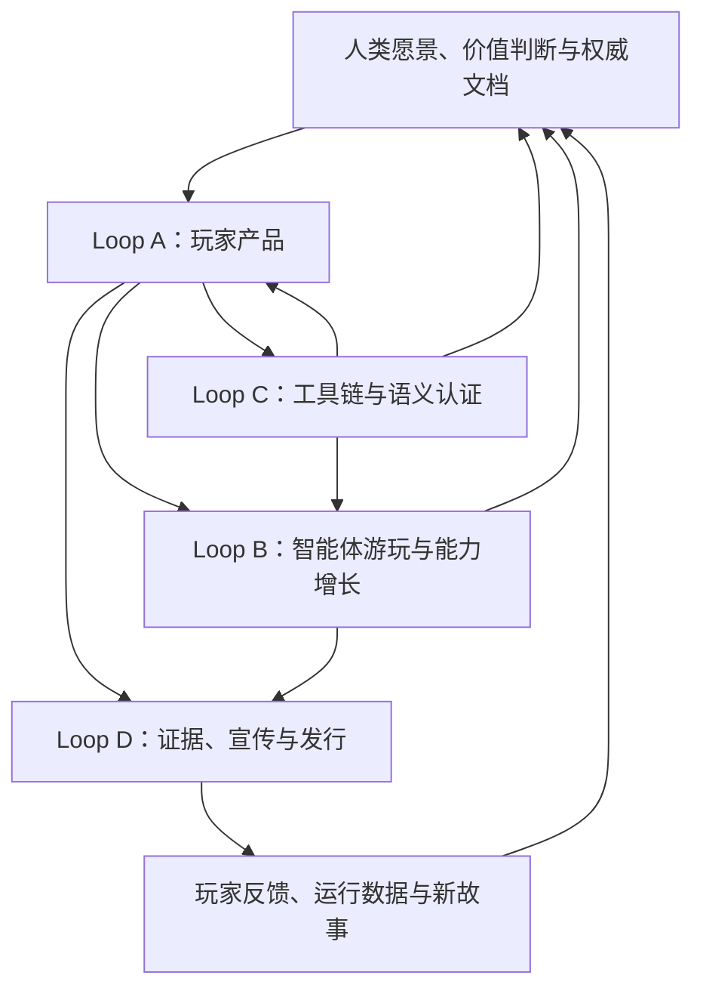

# 《project因果律》

> **伪天司的辉煌愿景**
>
> 从可玩的 Mod，到能够观察、决策、操作并核验 CK3 的自动玩家；从 Paradox 脚本工具链，到可复现的测试、发布与宣传体系。

《project因果律》已经不是单个 Mod 的源码包。它是一组彼此独立发布、又共享工程方法与证据体系的 CK3 玩家产品、自动化能力和开发工具。
《琉焰卿的永恒轮回》仍是旗舰产品，但不再代表仓库的全部。

每个 Mod 都有自己的启用条件、版本、构建器和发布边界。**不要把整个仓库直接安装成一个 Mod，也不要把开发源目录直接上传到
Workshop。** 玩家应从具体产品入口安装；发布者应使用对应的 release builder 生成正式 staging。

## 从这里开始

| 你想做什么 | 入口 |
|---|---|
| 游玩旗舰 Roguelite / New Game+ | [《琉焰卿的永恒轮回》玩家手册](docs/products/eternal-recurrence.md) |
| 查看全部玩家产品 | [玩家产品矩阵](#玩家产品) |
| 了解整个项目为何存在、如何运转 | [咒、术、道与辉煌愿景](docs/project-system-overview.md) |
| 查看自动游玩智能体的真实能力边界 | [进度中心](docs/autonomous-agent-progress/README.md) |
| 开发或维护 CK3 Mod | [统一开发范式](docs/ck3-mod-development-paradigm.md) |
| 查找机制、语法、测试和发布知识 | [docs 知识库](docs/README.md) |
| 使用在线 CK3 家徽编辑器 | [打开 Web 产品](https://xenoamess.github.io/ck3_eternal_recurrence/coat_of_arms_editer_of_ck3/) |

## 项目版图

项目由四类交付共同构成：

- **玩家产品**：可以独立安装和游玩的 CK3 Mod；
- **自动玩家**：围绕观察、决策、操作、验证和记忆建设的长期自治工程；
- **工具与语义基础设施**：生成器、MCP、native bridge、`open_kaishek`、网页工具与测试系统；
- **证据与发行**：acceptance artifact、报告、截图、Promo、Workshop、manifest 和 deterministic ZIP。

### 玩家产品

下表只提供稳定定位，不代替产品自己的 descriptor、README、发布记录和 fresh-cache 证据。公开版与开发树可能处于不同版本；
“正式构建线”也不自动等于已经公开发布。

| 产品 | 面向玩家的交付 | 当前边界 | 入口 |
|---|---|---|---|
| **琉焰卿的永恒轮回** | 一位统治者、一条命、一次结算；祝福与诅咒、本世契约、死亡计分和跨存档余烬构成 Roguelite / New Game+ | 旗舰公开产品；真人玩家专用 | [玩家手册](docs/products/eternal-recurrence.md) · [Workshop](https://steamcommunity.com/sharedfiles/filedetails/?id=3784706360) |
| **典造琉焰廷臣·白绮特供版** | 独立的付费廷臣定制、计价、创建与交付链 | 独立命名空间、独立发布线，可与旗舰双向共存 | [产品合同](docs/vivhite-courtier.md) · [Workshop](https://steamcommunity.com/sharedfiles/filedetails/?id=3787304042) |
| **天朝特色361制官员绩效考核** | 将 KPI、强制分布、京察、PIP、晋升和 361 项政策映射到天朝官僚体系 | Workshop 公开线与隔离开发线分开声明；不得把政策卡数量冒充 361 套小游戏 | [产品说明](mod_zhongguo_style/README.md) |
| **牛来** | 召来特殊勇士并闭合廷臣、骑士、宫廷职位、关系与事件交付 | 小型独立 Mod；少数获明确授权允许 AI 低意愿使用的产品之一 | [产品说明](ox_here/README.md) |
| **XenoAmess 的体验优化** | 自动继任保护、防止封臣上塞、自动防御援军和多项批处理决议 | 公开版与开发版分离；各功能复用原版合法性门禁 | [产品说明](mod_xenoamess_quality_of_life/README.md) |
| **自动升级建筑（XenoAmess 维护版）** | 每 15 日按原版资格、资源和玩家策略升级直属地产建筑 | 经授权维护的独立产品；由 exact-build 建筑图生成升级规则 | [产品说明](mod_auto_upgrade_buildings/README.md) |
| **重整河山** | 天命崩解、动态后朝、尊王诸侯与跨代复辟循环 | `0.4.0` 已完成独立发布闭环 | [产品说明](mod_reclaim_the_motherland/README.md) |
| **肃清曼荼罗伪信** | 按规则清理全图曼荼罗政府与 Temple Citadel，并约束后续转制 | 独立产品、专用 release builder | [产品说明](mod_remove_mandala/README.md) |
| **驱策朝贡国** | 宗主向直属 AI 朝贡国下达单县扩张命令，可选有限军费补贴 | `1.0.0` 正式线；威望、接受、宣战与补贴采用原子结算 | [产品说明](mod_tributary_expansion_directives/README.md) |
| **天朝制允许经商&贪腐框架（XenoAmess维护版）** | 为天朝政府恢复原生易货规则，并提供四档持续贪腐政策与税赋代价 | `1.0.0` 已发布；静态门禁、CK3 1.19.0.6 简中实机、全新订阅缓存与公开回读 GREEN | [产品说明](mod_celestial_commerce_corruption/README.md) · [Workshop](https://steamcommunity.com/sharedfiles/filedetails/?id=3804807463) |

### 自动玩家与工具平台

| 工程 | 解决的问题 | 真实边界 | 入口 |
|---|---|---|---|
| **CK3 自动游玩智能体** | 让智能体在真实 CK3 中持续执行“观察 → 决策 → 操作 → 验证 → 记忆” | 已有 production-live primitive 和有界 loop，但仍是本机研发系统，不是消费级全游戏 AI | [实现](ck3_autonomous_player/README.md) · [进度中心](docs/autonomous-agent-progress/README.md) · [机器状态](docs/project-state/current-state.json) |
| **`open_kaishek`** | lossless parser、profile-aware validator、strict IR、finite Runtime 与差分认证 | 独立仓库、独立版本；每项语义按 capability 认证，`UNSUPPORTED` 不会被静默吞掉 | [独立仓库](https://github.com/XenoAmess/open_kaishek) |
| **CK3 家徽编辑器** | 在浏览器中解析、编辑、拟合并确定性序列化 CK3 coat-of-arms 描述 | 生产网页为纯前端，不连接 CK3，不把剪贴板入口冒充通用脚本执行器 | [说明](coat_of_arms_editer_of_ck3/README.md) · [在线使用](https://xenoamess.github.io/ck3_eternal_recurrence/coat_of_arms_editer_of_ck3/) |
| **CK3 Workshop MCP** | 将发布计划、Launcher UIA 和 Steamworks native 发布能力拆成可恢复、可审计的层 | 三层 readiness 分别声明；某一通道成功不外推为全部链路完成 | [说明](ck3_workshop_mcp/README.md) |
| **Promo / Workshop / Release** | 把真实 GREEN 能力转化为截图、视频、描述、manifest、ZIP 和线上发行物 | 宣传必须绑定真实 artifact；工具存在不等于自动获得录制或发布授权 | [发布流程](docs/workshop-publishing.md) · [Promo 示例](promo/reclaim_the_motherland/README.md) |

自动玩家的“当前状态”是动态事实，不在此页写死轮次或完成比例。稳定投影以
[`current-state.json`](docs/project-state/current-state.json) 为机器可读入口；完整能力、RED、live artifact 和下一阶段工作以
[进度中心](docs/autonomous-agent-progress/README.md) 为准。单次 ACK、fixture 或 schema 字段不等于完整 OODA。

## 咒、术、道与辉煌愿景

- **咒**是最终用户能够直接看到和调用的 Mod、工具、智能体能力与发行物；
- **术**是组织文档、生成内容、构建 MCP、训练智能体、使用 OCR、测试与发布的方法；
- **道**是文档先行、文档高于测试、测试高于代码，以及原生事实、证据等级和用户价值等判断原则；
- **辉煌愿景**是让四个无限演进 Loop 咬合为自动化内容产出、测试、核验、游玩、展示和发行闭环。

四个 Loop 分别把玩法假设变成玩家产品、把真实 blocker 变成智能体能力、把新语义和 RED 变成可重复验证的工具，
再把真实 GREEN 结果变成可信的发布与传播。完整定义、OCR/MCP 边界和最终全流程见
[项目体系总纲](docs/project-system-overview.md)。

## 文档与事实层级

本项目以“文档先行，文档高于测试，测试高于代码”为工程纪律，但不同文档承担不同职责：

1. [项目体系总纲](docs/project-system-overview.md) 定义全局概念、方法、哲学与愿景；
2. [统一开发范式](docs/ck3-mod-development-paradigm.md) 定义新建、维护、验收和发布行为；
3. 产品 README 与专题文档定义玩家合同、状态机和精确边界；
4. 测试与 artifact 证明实现是否符合合同；
5. 代码、生成物和 staging 是合同在特定版本上的投影。

涉及实时状态时，机器可读状态、对应产品的 live artifact 与最新发布回读优先于本门户的概括。涉及 CK3 原生行为时，
必须区分源码证据、静态推断、fixture-live 与 production-live，不用更响亮的措辞升级证据。

## 开发、测试与发布

开始修改前先阅读 [`AGENTS.md`](AGENTS.md)，再进入对应产品 README 和专题文档。全仓通用入口：

- [贡献指南](CONTRIBUTING.md)
- [贡献者许可协议（CLA）](CLA.md)
- [知识库索引](docs/README.md)
- [CK3 Mod 开发、维护与发布行为范式](docs/ck3-mod-development-paradigm.md)
- [测试与实机验收流程](docs/testing-workflow.md)
- [Workshop 发布流程](docs/workshop-publishing.md)
- [产品与技术路线](docs/product-technical-roadmap.md)
- [自动玩家终极目标与路线图](docs/autonomous-agent-progress/goal-and-roadmap.md)

各产品的生成、校验、构建和验收命令保留在自己的 README、`AGENTS.md` 或测试专题中。正式发布只使用对应 builder 生成的
allowlist staging；开发夹具、调试桥、acceptance-only 内容和仓库 README 不得混入 Workshop 运行树。

## 许可证

仓库许可证见 [LICENSE](LICENSE)。被维护的上游项目、CK3 原版素材、第三方依赖和各产品资产仍服从各自的来源与授权记录。
外部贡献还须按 [贡献指南](CONTRIBUTING.md) 在对应 PR 中签署 [CLA](CLA.md)；自动门禁状态为 `CLA / signed`。
