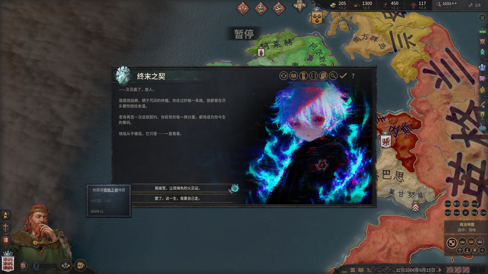
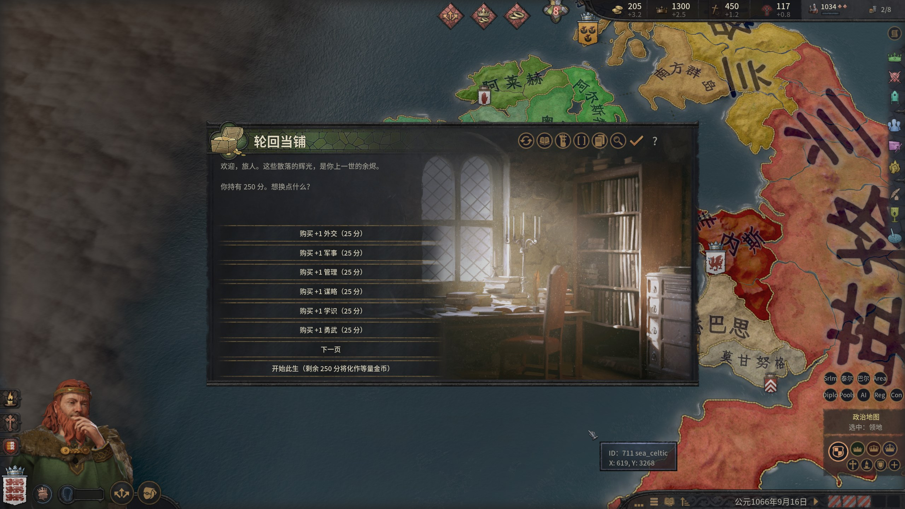
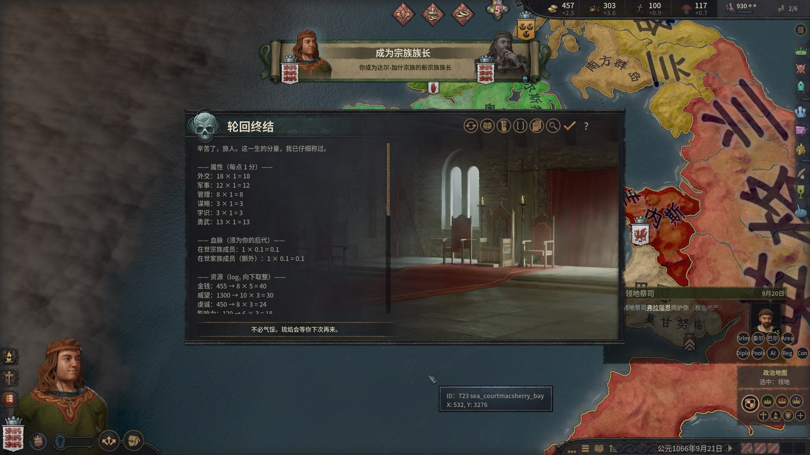
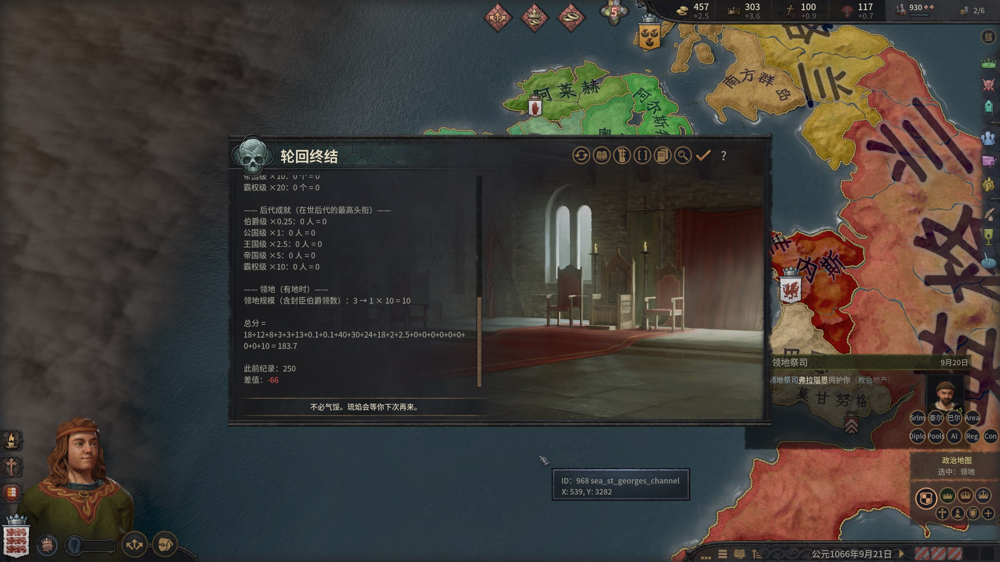

# 琉焰卿的永恒轮回 - CK3 Roguelite / New Game+

## ……我将永不停歇地，一次次回到那个你还在的冬日

一位统治者、一条命、一次结算：死亡时称量真实分数，把跨过的**量化余烬位阶跨存档保存**，下一世再花费其副本换取强化。版本 **1.0.0**，实测基线 **CK3 1.19.0.6**。

订阅地址： https://steamcommunity.com/sharedfiles/filedetails/?id=3784706360

GitHub Release： https://github.com/XenoAmess/ck3_eternal_recurrence/releases/tag/v1.0.0

> **1.0.0 已发布（2026-08-21）：** 付费自定义廷臣 v2 提供七页生成目录、0–120 岁与六项 0–100 基础能力、动态文化/信仰及可选同家族。最终 85 文件候选的完整 release-gating CK3 套件、非 debug 普通/铁人终局、L0 与确定性构建均为 GREEN；九语言、干净截图、UI 裁切和缩略图已完成人工签核。Steam 强制重下载缓存与正式 manifest 已完成逐文件验证，完整证据见 [docs/release-qa-v1.0.0.md](docs/release-qa-v1.0.0.md)。

> **⚠ 必须开启教程！** 游戏设置 → 教程（reactive advice）选「完整」或「警告」均可——**切勿「禁用」**。
>
> <sub>原因：本 mod 的跨存档全局存储复用引擎的教程课程持久化机制（`tutorial.txt`）。禁用教程后，既有余烬位阶仍可读取和导入，但新课程不会完成与落盘，因此新纪录无法保存。</sub>

## 玩法

1. 游戏规则中启用「琉焰卿的永恒轮回」（默认启用）
2. 开局弹出「终末之契」：接受则获得可成长特质【琉焰之视】（0–100 经验、每 10 经验一级，每级额外 +10% 压力获取）；特质悬浮提示会即时预览当前分数；拒绝则本局与无 mod 无异。历史余烬位阶为 0 时会进入首世说明并直接开始祝福流程，不再打开无商品可买的空商店



3. 游戏规则可选择绝对/本世成长赛道，以及 0%/25%/50%/100% 余烬继承；推荐默认是本世成长 + 100% 继承，继承预算不另设上限。非零预算会打开四页「轮回当铺」，可购买六维属性、资源、借命层数、重抽、封印、恐怖值、正统性、暴政修正和 1133 分的免费宗教改革；高位阶另有 10000 分【万国贡火】、50000 分【借来一代】和 100000 分【六维登神】。普通商品每次购买后涨价 ×1.2；剩余分数开始此生时等量转为金币



4. 契约接受后可随时从原生决议菜单打开「琉焰账簿」，只读查看当前分数、历史/候选/下一余烬位阶、距下一位阶差值、完成交易对数和拒绝次数；达到持久层上限时会明确标示
5. 琉焰卿的「垂青会」：开局及此后每 3 年，从带稀有度/构筑标签的 3 项祝福中领 1 项，再从 2 项诅咒中强制选择 1 项。每场恰好一对；每次拒绝最终结算 -1%。【琉焰之视】每 10 XP 解锁累积原生属性成长和逐步增加的重抽/封印奖励
6. 可从决议菜单选择征服者、织网者、圣徒、家主、贤王或享乐者契约。对应 CK3 行为提供增量进度和分数，3/6/10 进度会触发反馈并永久保存该契约 PB；详见 [docs/contracts-and-progression.md](docs/contracts-and-progression.md)
7. 死亡时展示真实分数；只有它跨过新的余烬阈值时，才写入量化纪录（教程通知）。有继承人时确认完整结算后进入观察者模式；无可玩继承人时由原生继承窗显示八项结算并退出主菜单，均不可继续扮演后代





**算分规则**：详见 [docs/scoring-rules.md](docs/scoring-rules.md)（逐条分列；游戏内死亡结算事件会展示当局逐项实况数值与完整公式）。

## 原理

利用引擎全局持久化的 `tutorial.txt` 课程完成列表作为只增位存储，把真实分数向下量化为分层余烬位阶（粒度 1→1000 递增，上限 166,600，可扩展）。课程用 `trigger_transition` 自动完成，无需玩家点击；读取经由 customizable_localization → request 门控 GUI state → scripted_gui 桥接导入存档。详见 `docs/cross-save-persistence.md`。

## 要求

- 游戏设置中开启教程（reactive advice）
- 单机定位（多人下各人纪录独立）

## 一局有多长

一局就是签约统治者的一生。30-50 年人生通常会经历约 10-17 次垂青会，每次最多两个模态窗口；统治者死亡即结算并结束，有继承人时转观察者，无继承人时退出主菜单。

## FAQ

- **能继续玩继承人吗？** 不能。契约只称量签约者的一生；有继承人时确认结算后进入观察者模式，无继承人时从原生继承窗退出主菜单。
- **关闭教程会怎样？** 已有位阶仍能读取，但新位阶、契约 PB 和图鉴不会写入 `tutorial.txt`。
- **能用于旧存档吗？** 推荐新开局；核心入口在开局规则和契约导入链上。
- **兼容其他 mod 吗？** 无继承人结算会用生成器投影原生 `window_succession_event.gui`；覆盖同一 GUI 的其他 mod 会产生冲突。on_action、GUI 或相同资源键的其他未逐项验证组合也不作保证。

## 挑战成绩模板

提交成绩时建议附上：游戏版本、mod 版本、开局角色/自建点数、其他 mod、赛道、继承比例、开局余烬位阶、寿命、最终真实分数、量化位阶和结算截图。

## 更新记录

见 [CHANGELOG.md](CHANGELOG.md)。

## 开发

源码地址 https://github.com/XenoAmess/ck3_eternal_recurrence.git

```powershell
py -m pip install -r tools/requirements-static.txt
py XenoAmess_s_Eternal_Recurrence/tools/gen_highscore.py
py tools/gen_pools.py
py tools/gen_contracts.py
py tools/gen_scoring.py
py tools/gen_score_preview.py
py tools/gen_courtier_creator.py
py tools/compose_decision_art.py
py tools/test_gen_no_heir_gui.py
py tools/test_build_release.py
py tools/validate_static.py
py -c "import sys; sys.path.insert(0, 'tools'); import scoring_data; scoring_data.assert_reference_vectors()"
py tools/build_release.py --check
py tools/build_release.py   # dist staging + manifest JSON + deterministic ZIP
```

Windows CK3 acceptance 的固定依赖位于 `tools/requirements.txt`；CI/L0 只安装
`tools/requirements-static.txt`。测试、调试与发布流程见 `AGENTS.md`、
`docs/testing-workflow.md` 与 `docs/workshop-publishing.md`。
