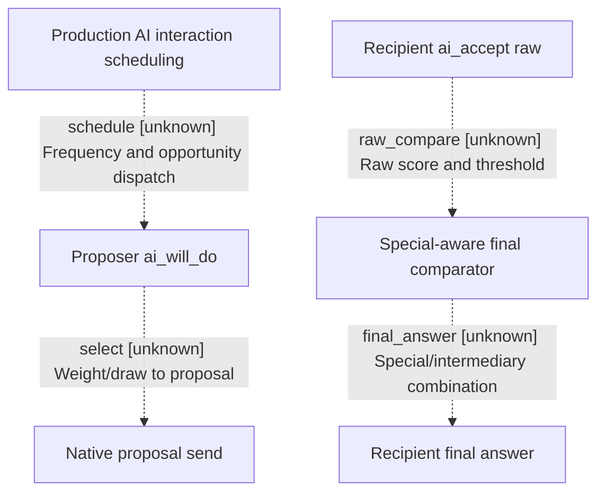

# Research plan: war-film-peace-policy

GENERATED from the supplied research plan; no native semantics are inferred.

Question: For exact-build AI white peace, what operands and signed comparisons produce the final recipient answer, and which production caller/frequency paths schedule proactive proposals?



| Edge | Declared status | Evidence IDs | Open question |
|---|---|---|---|
| schedule | unknown |  | Which real production entry reads frequency/tier and triggers evaluation? |
| select | unknown |  | Which branch sends and which draw/scheduler inputs remain? |
| raw_compare | unknown |  | What exact signed operands and comparison consume recipient raw? |
| final_answer | unknown |  | How is status combined for ordinary white peace versus special or human contexts? |

| Observation design | Value |
|---|---|
| mode | offline-only |
| actor_kind | ai |
| owner_scope | AI proposer and AI recipient of end_war_attacker_white_peace_interaction; human GUI legality is a separate excluded authority. |
| identity_kind | definition-key |
| identity_lifetime | Canonical interaction key is source identity for this exact build; runtime ordinals/pointers are not portable. |
| producer_trigger | unknown |
| producer | Authored ai_accept and ai_will_do trees are distinct; compiled definition evaluators and actual scheduling writer are to be traced. |
| caller | Known locator candidates: recipient 0x2C44320, inner 0x2C43C50, outer 0x2C43B40. GUI CanSend and diagnostic 0x19126D0 cannot establish production scheduling. |
| consumer | Find the machine compare consuming recipient raw and its special/intermediary bypass, then trace a production proposal consumer. |
| cache_lifetime | Offline bytes only; proposal scheduling cache creation/invalidation remains a research question. |
| expected_signal | Instruction-boundary confirmed RVA, operand width/sign, threshold, branch targets, definition offsets and direct callers with pdata function bounds. |
| zero_sample_meaning | No direct xref or string match cannot rule out virtual/indirect calls, inlining or other scheduling paths. |
| stop_condition | Read-only exact EXE and script extraction, bounded direct-call/RTTI/string traversal from acceptance and AI interaction anchors; preserve residual unknowns if a production edge cannot be proven. Never run CK3 or invoke native routines. |
| runtime_window_ref | None |

| Evidence ID | Declared layer | File | SHA-256 | Supports |
|---|---|---|---|---|

Check result (file integrity and declarations only):

```json
{
  "schema": "xar.native-research-plan-check.v1",
  "result": "plan-consistent",
  "proof_layer": "record-structure-and-file-integrity",
  "semantic_correctness_verified": false,
  "live_execution_performed": false,
  "observation_plan_issues": [
    "offline-only plan does not define a live observation window",
    "the real producer trigger must be located before live sampling"
  ],
  "declared_edges_by_status": {
    "counter-policy": 0,
    "inference": 0,
    "live-confirmed": 0,
    "static-confirmed": 0,
    "unknown": 4
  },
  "enumerated_native_edges": 4,
  "declared_cases_by_status": {
    "pending": 2,
    "observed": 0,
    "not-applicable": 0
  },
  "checked_evidence_files": 0,
  "limitations": [
    "Evidence layers and conclusions are author declarations; hashes bind bytes, not their truth.",
    "Counts cover this enumerated graph only, not all CK3 branches.",
    "A consistent observation plan is not authorization to run or manipulate CK3."
  ],
  "plan_sha256": "4acb82485f322d75d0920f05ea99d237061f883c4b0be54dae2ab8954e828a3a"
}
```
