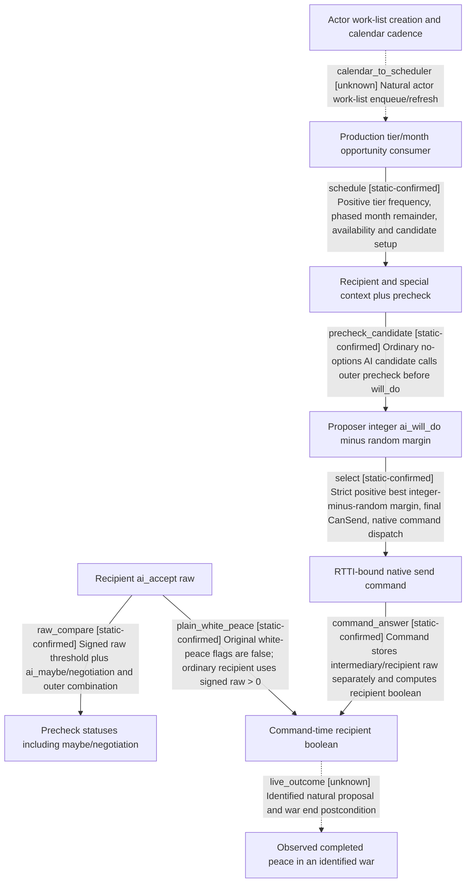

# Research plan: war-film-peace-policy

GENERATED from the supplied research plan; no native semantics are inferred.

Question: Exact-build production white-peace opportunity, proposer selection, precheck versus command-time recipient acceptance, and remaining runtime scheduling boundary.



| Edge | Declared status | Evidence IDs | Open question |
|---|---|---|---|
| calendar_to_scheduler | unknown | analysis | Exact daily/monthly actor scheduling before the located consumer remains unclosed. |
| schedule | static-confirmed | bytes, frequency_bytes, analysis |  |
| precheck_candidate | static-confirmed | bytes, frequency_bytes, analysis |  |
| select | static-confirmed | bytes, frequency_bytes, analysis |  |
| raw_compare | static-confirmed | bytes, frequency_bytes, analysis |  |
| command_answer | static-confirmed | bytes, frequency_bytes, analysis |  |
| plain_white_peace | static-confirmed | bytes, frequency_bytes, analysis |  |
| live_outcome | unknown | analysis | No CK3 launched or native routine invoked; no new live proposal or war outcome was observed. |

| Observation design | Value |
|---|---|
| mode | offline-only |
| actor_kind | ai |
| owner_scope | AI proposer and AI recipient of end_war_attacker_white_peace_interaction; human GUI legality is a separate excluded authority. |
| identity_kind | definition-key |
| identity_lifetime | Canonical interaction key is source identity for this exact build; runtime ordinals/pointers are not portable. |
| producer_trigger | unknown |
| producer | Production actor work list -&gt; 0x183DEC0 -&gt; 0x18813E0 frequency/tier/month gate -&gt; 0x1880C20; field loaders and command RTTI traced. |
| caller | 0x18876D0 actor list consumer and parallel wrapper 0x1889E80; natural work-list enqueue/calendar cadence remains unclosed. |
| consumer | CSendCharacterInteractionCommand 0x26B32D0 -&gt; 0x26B30A0 -&gt; 0x2752620; ordinary recipient signed raw&gt;0 is distinct from precheck status!=2. |
| cache_lifetime | Definition frequency tables are loaded candidate lists; actor work-list enqueue and invalidation lifetime not yet closed. |
| expected_signal | Instruction-boundary confirmed RVA, operand width/sign, threshold, branch targets, definition offsets and direct callers with pdata function bounds. |
| zero_sample_meaning | No direct xref or string match cannot rule out virtual/indirect calls, inlining or other scheduling paths. |
| stop_condition | Read-only exact EXE and script extraction, bounded direct-call/RTTI/string traversal from acceptance and AI interaction anchors; preserve residual unknowns if a production edge cannot be proven. Never run CK3 or invoke native routines. |
| runtime_window_ref | None |

| Evidence ID | Declared layer | File | SHA-256 | Supports |
|---|---|---|---|---|
| bytes | exact-build | war_film_peace_bytes_20260923.json | bac639bc850421dec6120abcc9560c93303311c5fee4218fbe40c1abf20cf3be | Exact EXE, selected instruction operands, constructor/parser flags, RTTI and white-peace script field identity; no live execution. |
| frequency_bytes | exact-build | war_film_peace_frequency_fields_20260923.json | f3928d6850d9e16de983a4714e9a720ab3530a4fb68fcb0834a0ea48a5487f09 | Frequency loader and title-tier getter bytes; bounded leaf windows are not claimed pdata functions. |
| analysis | source-contract | ../../../docs/ck3-native-ai/war-film-peace-policy-2026-09-23.md | 7e6e0bfd9eb4b3ed9c764c9f8441e465383fb9da2085659d66bfbd1de79da5e9 | Authored interpretation of caller/control flow, precheck versus actual command comparator, white-peace flags, scheduler limits; hashes do not prove semantics. |

Check result (file integrity and declarations only):

```json
{
  "schema": "xar.native-research-plan-check.v1",
  "result": "plan-consistent",
  "proof_layer": "record-structure-and-file-integrity",
  "semantic_correctness_verified": false,
  "live_execution_performed": false,
  "observation_plan_issues": [
    "offline-only plan does not define a live observation window",
    "the real producer trigger must be located before live sampling"
  ],
  "declared_edges_by_status": {
    "counter-policy": 0,
    "inference": 0,
    "live-confirmed": 0,
    "static-confirmed": 6,
    "unknown": 2
  },
  "enumerated_native_edges": 8,
  "declared_cases_by_status": {
    "pending": 2,
    "observed": 0,
    "not-applicable": 0
  },
  "checked_evidence_files": 3,
  "limitations": [
    "Evidence layers and conclusions are author declarations; hashes bind bytes, not their truth.",
    "Counts cover this enumerated graph only, not all CK3 branches.",
    "A consistent observation plan is not authorization to run or manipulate CK3."
  ],
  "plan_sha256": "6e944eb2816f332dce9322af49dbd042ce345b86a1d0ffa49118a4676fe16b79"
}
```
