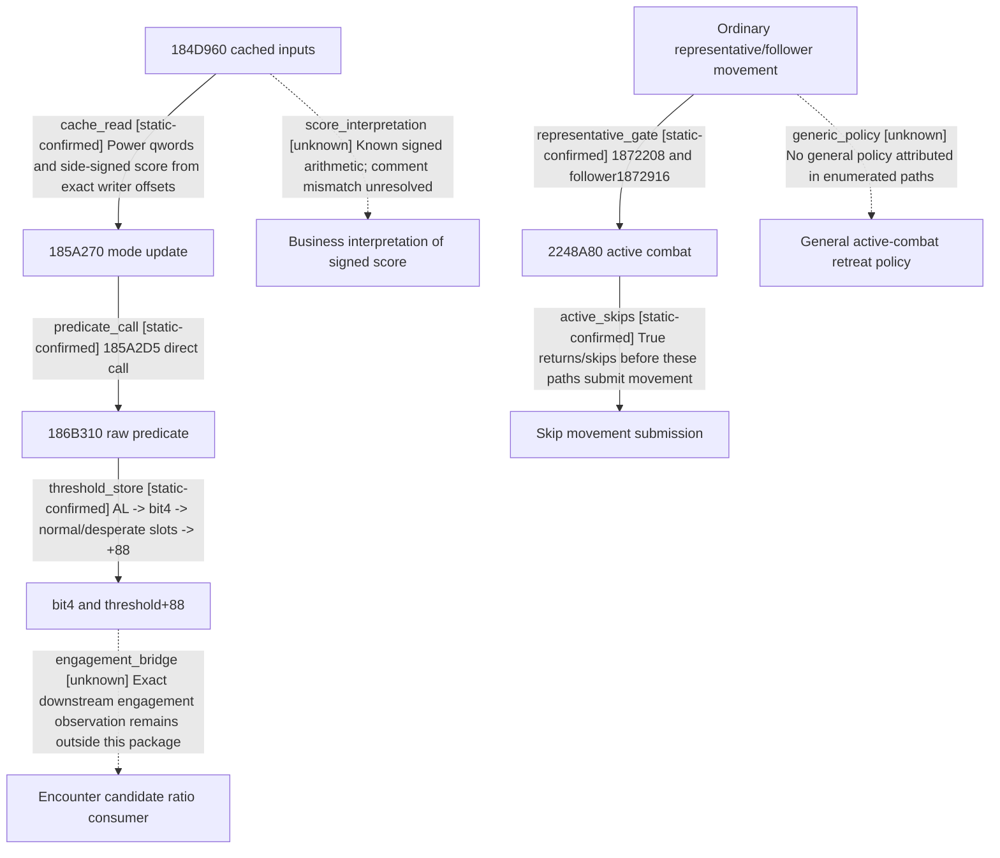

# Research plan: war-film-retreat-policy-results-a01

GENERATED from the supplied research plan; no native semantics are inferred.

Question: Locate the ordinary war AI active-combat retreat policy caller, and the producer selecting normal/desperate engagement thresholds, in CK3 1.19.0.6.



| Edge | Declared status | Evidence IDs | Open question |
|---|---|---|---|
| cache_read | static-confirmed | reviewed_contract |  |
| predicate_call | static-confirmed | reviewed_contract |  |
| threshold_store | static-confirmed | reviewed_contract |  |
| engagement_bridge | unknown | reviewed_contract | Bind the chosen threshold and all subsequent vetoes to a real candidate/action. |
| representative_gate | static-confirmed | reviewed_contract |  |
| active_skips | static-confirmed | reviewed_contract |  |
| generic_policy | unknown | reviewed_contract | Locate remaining indirect/vtable policy or prove bounded dispatch-specific absence; do not infer global absence. |
| score_interpretation | unknown | reviewed_contract | Reconcile cached raw score and role with exact primary identities and displayed/query perspective. |

| Observation design | Value |
|---|---|
| mode | offline-only |
| actor_kind | ai |
| owner_scope | Ordinary native war AI; exclude player commands and raid/barter/counter-raid as substitutes. |
| identity_kind | none |
| identity_lifetime | No runtime identity is sampled in this offline package. |
| producer_trigger | unknown |
| producer | Normal/desperate producer186B310 called by185A270 after mode timer expiry; ordinary active-combat retreat policy still unresolved. |
| caller | 18550D0 -&gt;185A270 -&gt;186B310; cache inputs refreshed by184D960. |
| consumer | CMoveArmyCommand active-combat apply and coordinator-like +0x88 ratio threshold. |
| cache_lifetime | Cached +68 bit4/+88 retain previous value until producer invocation; no live window sampled. |
| expected_signal | Exact RVA, decoded predecessor predicates, direct or vtable call chain, and bounded unresolved edges. |
| zero_sample_meaning | No static match does not prove absence of an indirect policy caller. |
| stop_condition | One bounded static package: threshold producer and immediate caller chain, plus active-combat dispatch or an exact next static entry. No CK3 launch or bridge changes. |
| runtime_window_ref | None |

| Evidence ID | Declared layer | File | SHA-256 | Supports |
|---|---|---|---|---|
| reviewed_contract | source-contract | war_film_retreat_evidence_a01.json | 4defcd2ffa3d2ec707a01771416f8d5ad38c1a624bdbd43cf97f2725bd7025dc | Reviewed predicates, producers, consumers and bounded active-combat dispatch exclusion; unresolved semantics remain declared unknown. |

Check result (file integrity and declarations only):

```json
{
  "schema": "xar.native-research-plan-check.v1",
  "result": "plan-consistent",
  "proof_layer": "record-structure-and-file-integrity",
  "semantic_correctness_verified": false,
  "live_execution_performed": false,
  "observation_plan_issues": [
    "offline-only plan does not define a live observation window",
    "the real producer trigger must be located before live sampling"
  ],
  "declared_edges_by_status": {
    "counter-policy": 0,
    "inference": 0,
    "live-confirmed": 0,
    "static-confirmed": 5,
    "unknown": 3
  },
  "enumerated_native_edges": 8,
  "declared_cases_by_status": {
    "pending": 1,
    "observed": 0,
    "not-applicable": 0
  },
  "checked_evidence_files": 1,
  "limitations": [
    "Evidence layers and conclusions are author declarations; hashes bind bytes, not their truth.",
    "Counts cover this enumerated graph only, not all CK3 branches.",
    "A consistent observation plan is not authorization to run or manipulate CK3."
  ],
  "plan_sha256": "cca44c7e519718a46f994053d16bad63cdea76d2e81ec7e135f4ad269c6ab8fd"
}
```
