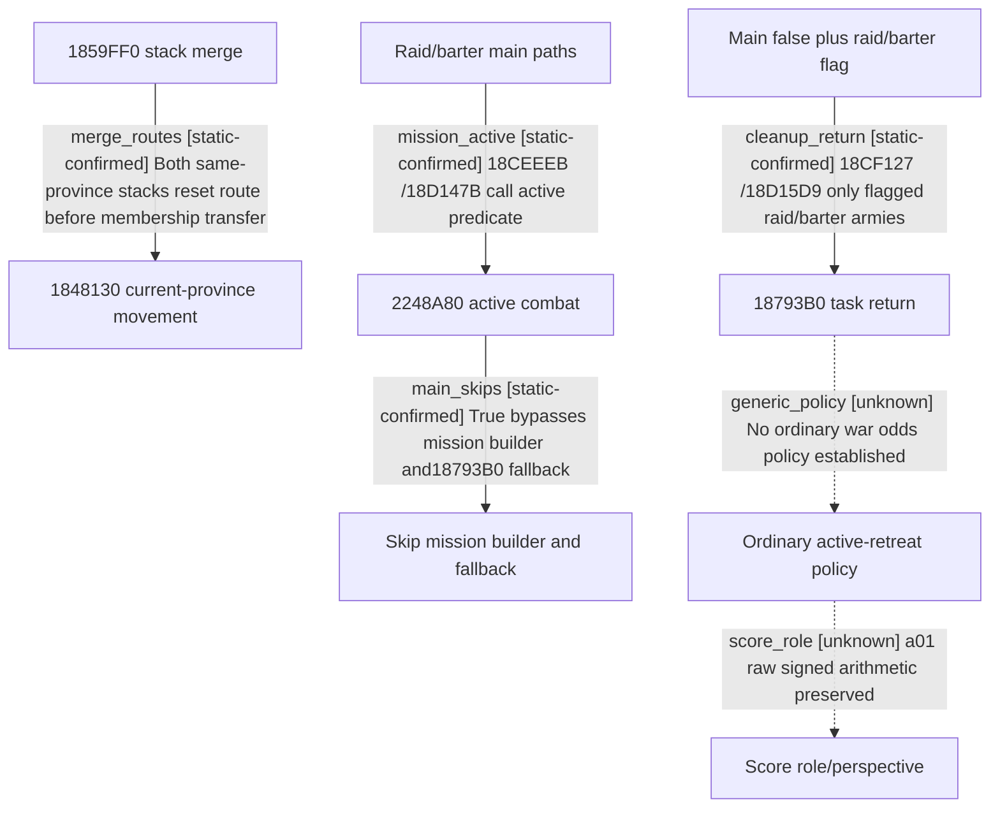

# Research plan: war-film-retreat-callers-results-a02

GENERATED from the supplied research plan; no native semantics are inferred.

Question: Classify the full parent/caller of 0x184818D and the four callers of 0x18793B0, prioritizing a real ordinary-war active-retreat policy; statically reconcile score direction where evidence permits.



| Edge | Declared status | Evidence IDs | Open question |
|---|---|---|---|
| merge_routes | static-confirmed | reviewed_a02 |  |
| mission_active | static-confirmed | reviewed_a02 |  |
| main_skips | static-confirmed | reviewed_a02 |  |
| cleanup_return | static-confirmed | reviewed_a02 |  |
| generic_policy | unknown | reviewed_a02 | Recover remaining indirect/vtable policy or attributable native case; do not infer absence. |
| score_role | unknown | reviewed_a02 | Compare exact primary IDs, coordinator role and score query/UI perspective in a paused case; producer freshness remains separate. |

| Observation design | Value |
|---|---|
| mode | offline-only |
| actor_kind | ai |
| owner_scope | Ordinary native war AI; mission return and player command paths must be identified separately. |
| identity_kind | none |
| identity_lifetime | No process identity is sampled. The a01 evidence remains immutable. |
| producer_trigger | unknown |
| producer | 1859FF0 stack transfer and18CEC60/18D1170 mission control; cleanup branches classified. Ordinary active-retreat policy remains unresolved. |
| caller | 18552F5,185A171,185A179,18CF047,18D14FE,18CF127,18D15D9 |
| consumer | 1874A10/18793B0 movement builders and generic movement apply; no command will be run. |
| cache_lifetime | Raw mode/score cache lifetime as a01; fresh runtime attribution remains unobserved. |
| expected_signal | Reviewed exact predicates plus synthetic-tested research-only paused RPM preparation; no process attached. |
| zero_sample_meaning | No classified direct caller does not prove absence of indirect policy. |
| stop_condition | Classify the named caller families and identify a concrete next observation/static entry. Do not launch CK3 or rewrite a01. |
| runtime_window_ref | None |

| Evidence ID | Declared layer | File | SHA-256 | Supports |
|---|---|---|---|---|
| reviewed_a02 | source-contract | war_film_retreat_evidence_a02.json | eb36bf33705cc133088a4d3a6fa111d37ed8fac3cb96883714b8848217f1f6b9 | Reviewed exact callsite roles, upstream active gates and bounded unresolved policy; raw artifacts hash-indexed. |

Check result (file integrity and declarations only):

```json
{
  "schema": "xar.native-research-plan-check.v1",
  "result": "plan-consistent",
  "proof_layer": "record-structure-and-file-integrity",
  "semantic_correctness_verified": false,
  "live_execution_performed": false,
  "observation_plan_issues": [
    "offline-only plan does not define a live observation window",
    "the real producer trigger must be located before live sampling"
  ],
  "declared_edges_by_status": {
    "counter-policy": 0,
    "inference": 0,
    "live-confirmed": 0,
    "static-confirmed": 4,
    "unknown": 2
  },
  "enumerated_native_edges": 6,
  "declared_cases_by_status": {
    "pending": 1,
    "observed": 0,
    "not-applicable": 0
  },
  "checked_evidence_files": 1,
  "limitations": [
    "Evidence layers and conclusions are author declarations; hashes bind bytes, not their truth.",
    "Counts cover this enumerated graph only, not all CK3 branches.",
    "A consistent observation plan is not authorization to run or manipulate CK3."
  ],
  "plan_sha256": "084634e1bf1525d95fc0e37fbf69fe3236f6ade8f1ea76c989996dff25fe0bc1"
}
```
