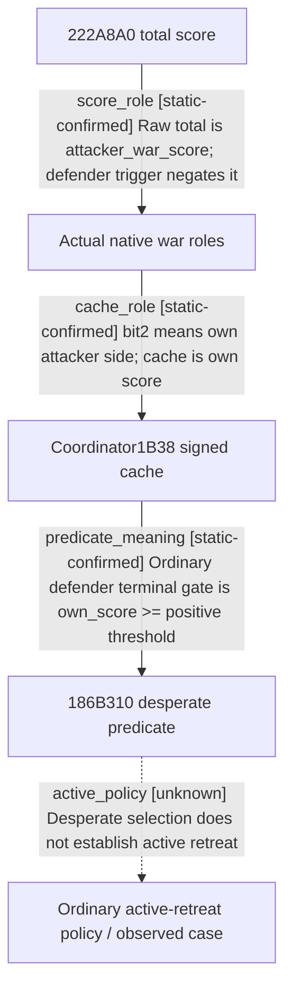

# Research plan: war-film-retreat-score-direction-results-a03

GENERATED from the supplied research plan; no native semantics are inferred.

Question: Resolve the sign of222A8A0 and the coordinator1B38 cache using actual side identities and native UI/settlement consumers, without relying on define comments.



| Edge | Declared status | Evidence IDs | Open question |
|---|---|---|---|
| score_role | static-confirmed | reviewed_a03 |  |
| cache_role | static-confirmed | reviewed_a03 |  |
| predicate_meaning | static-confirmed | reviewed_a03 |  |
| active_policy | unknown | reviewed_a03 | Recover attributable active policy caller or observe a natural producer window. |

| Observation design | Value |
|---|---|
| mode | offline-only |
| actor_kind | ai |
| owner_scope | Ordinary native war AI; mission return and player command paths must be identified separately. |
| identity_kind | none |
| identity_lifetime | No process identity is sampled. The a01 evidence remains immutable. |
| producer_trigger | unknown |
| producer | 1885440 own-side role producer; 184D960 own-score cache producer. No runtime freshness observation. |
| caller | Native attacker/defender trigger registrations and GetWarScoreFraction UI wrappers. |
| consumer | 186B310 desperate predicate, plus independent native score consumer. |
| cache_lifetime | Raw mode/score cache lifetime as a01; fresh runtime attribution remains unobserved. |
| expected_signal | Static score and side mappings closed; developer intent and active-retreat native case remain unobserved. |
| zero_sample_meaning | No classified direct caller does not prove absence of indirect policy. |
| stop_condition | Resolve or precisely bound score direction using independent native role/score paths; no launch/injection and no a01/a02 edits. |
| runtime_window_ref | None |

| Evidence ID | Declared layer | File | SHA-256 | Supports |
|---|---|---|---|---|
| reviewed_a03 | source-contract | war_film_retreat_evidence_a03.json | 83841aef6c93a35ab446c3b0df6c468606c7c58d936dcaff1e1bad6ac0471236 | Reviewed role and signed-score chains with exact raw artifacts and immutable a01 arithmetic. |

Check result (file integrity and declarations only):

```json
{
  "schema": "xar.native-research-plan-check.v1",
  "result": "plan-consistent",
  "proof_layer": "record-structure-and-file-integrity",
  "semantic_correctness_verified": false,
  "live_execution_performed": false,
  "observation_plan_issues": [
    "offline-only plan does not define a live observation window",
    "the real producer trigger must be located before live sampling"
  ],
  "declared_edges_by_status": {
    "counter-policy": 0,
    "inference": 0,
    "live-confirmed": 0,
    "static-confirmed": 3,
    "unknown": 1
  },
  "enumerated_native_edges": 4,
  "declared_cases_by_status": {
    "pending": 1,
    "observed": 0,
    "not-applicable": 0
  },
  "checked_evidence_files": 1,
  "limitations": [
    "Evidence layers and conclusions are author declarations; hashes bind bytes, not their truth.",
    "Counts cover this enumerated graph only, not all CK3 branches.",
    "A consistent observation plan is not authorization to run or manipulate CK3."
  ],
  "plan_sha256": "2aa5bc2930b78604c55d1e8fb97108ca389f4d9f07c66c22d2f69184ed5cd121"
}
```
