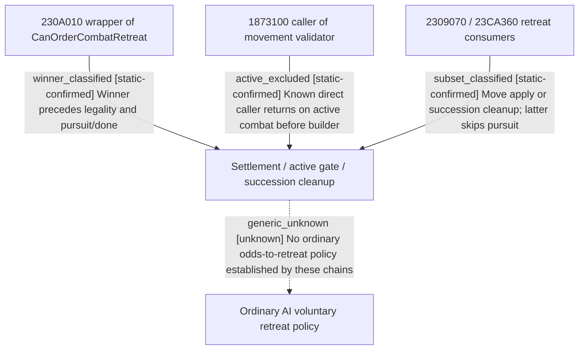

# Research plan: war-film-active-retreat-policy-results-a04

GENERATED from the supplied research plan; no native semantics are inferred.

Question: Find or classify at most three actual consumer-to-caller chains that could explain ordinary AI active-combat retreat; preserve negative reachability edges.



| Edge | Declared status | Evidence IDs | Open question |
|---|---|---|---|
| winner_classified | static-confirmed | reviewed_a04 |  |
| active_excluded | static-confirmed | reviewed_a04 |  |
| subset_classified | static-confirmed | reviewed_a04 |  |
| generic_unknown | unknown | reviewed_a04 | Classify remaining indirect movement producers that read active combat and prediction. |

| Observation design | Value |
|---|---|
| mode | offline-only |
| actor_kind | ai |
| owner_scope | Ordinary war AI active-combat retreat; distinguish player command, legality, terminal cleanup and mission control. |
| identity_kind | none |
| identity_lifetime | Disk-only exact EXE; no live identity or process attached. |
| producer_trigger | unknown |
| producer | Classified winner transition, known active-gated movement caller and succession subset cleanup; generic AI choice remains unknown. |
| caller | 2309E80/2309070;18721B0;24E53A0/24E1A60 |
| consumer | 2308250 legality, 26B4710 movement apply, 2309070 full-side and 23CA360 subset retreat. |
| cache_lifetime | Not sampled; the a01-a03 score/mode evidence is reused unchanged. |
| expected_signal | A classified AI caller with active-combat input and issued retreat consequence, or precise negative/unknown edges. |
| zero_sample_meaning | No policy in selected chains does not prove absence of indirect/vtable policy. |
| stop_condition | Classify no more than three promising consumer-upstream chains; no launch, injection or old-package edits. |
| runtime_window_ref | None |

| Evidence ID | Declared layer | File | SHA-256 | Supports |
|---|---|---|---|---|
| reviewed_a04 | source-contract | war_film_retreat_evidence_a04.json | 4de9f623d5e9bcb2f29f49b4377a5ad1b6302e6e9b50433797d326b3072f248a | Bounded classified upstreams and negative reachability; no generic AI absence claim. |

Check result (file integrity and declarations only):

```json
{
  "schema": "xar.native-research-plan-check.v1",
  "result": "plan-consistent",
  "proof_layer": "record-structure-and-file-integrity",
  "semantic_correctness_verified": false,
  "live_execution_performed": false,
  "observation_plan_issues": [
    "offline-only plan does not define a live observation window",
    "the real producer trigger must be located before live sampling"
  ],
  "declared_edges_by_status": {
    "counter-policy": 0,
    "inference": 0,
    "live-confirmed": 0,
    "static-confirmed": 3,
    "unknown": 1
  },
  "enumerated_native_edges": 4,
  "declared_cases_by_status": {
    "pending": 1,
    "observed": 0,
    "not-applicable": 0
  },
  "checked_evidence_files": 1,
  "limitations": [
    "Evidence layers and conclusions are author declarations; hashes bind bytes, not their truth.",
    "Counts cover this enumerated graph only, not all CK3 branches.",
    "A consistent observation plan is not authorization to run or manipulate CK3."
  ],
  "plan_sha256": "7f4ce1158a8c41a7a99afecaf40f413e8009ee9b69d37a1a9c92e46210b38285"
}
```
