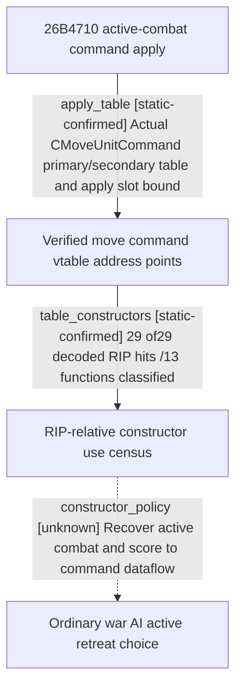

# Research plan: war-film-move-command-constructors-results-a05

GENERATED from the supplied research plan; no native semantics are inferred.

Question: Classify RIP-relative constructors of actual CMoveArmyCommand vtables and inspect new ordinary AI paths for active-combat input plus prediction-driven retreat choice.



| Edge | Declared status | Evidence IDs | Open question |
|---|---|---|---|
| apply_table | static-confirmed | reviewed_a05 |  |
| table_constructors | static-confirmed | reviewed_a05 |  |
| constructor_policy | unknown | reviewed_a05 | Unknown dynamic/factory consumers remain; no ordinary AI active-combat prediction-to-retreat choice recovered. |

| Observation design | Value |
|---|---|
| mode | offline-only |
| actor_kind | ai |
| owner_scope | Ordinary native war AI movement constructors; classified mission, terminal and succession paths are reused without re-expansion. |
| identity_kind | none |
| identity_lifetime | Read-only disk EXE; no process is queried or attached. |
| producer_trigger | unknown |
| producer | 29 declared RIP hits /13 functions classified; actual type CMoveUnitCommand; unknown dynamic producers remain. |
| caller | Known ordinary/mission paths reused; new CIngameInterfaceHandler, clone and empty factory classified. |
| consumer | CMoveArmyCommand apply 26B4710 -&gt; active retreat 2308850. |
| cache_lifetime | No live freshness observation; a01-a04 remain immutable dependencies. |
| expected_signal | Portable exact-build constructor census and bounded classification, with an ordinary active policy only if evidence establishes it. |
| zero_sample_meaning | A complete declared RIP-reference census is not a proof that all indirect command producers have been recovered. |
| stop_condition | Bind actual vtables, classify their RIP references, inspect at most three new plausible AI paths; no live or previous-package edits. |
| runtime_window_ref | None |

| Evidence ID | Declared layer | File | SHA-256 | Supports |
|---|---|---|---|---|
| reviewed_a05 | source-contract | war_film_retreat_evidence_a05.json | e741564dc1d0860f73743c7b5b0f82336d9b9f3ebfad59bf033c84dc548fb047 | Actual RTTI/address points and complete classification of declared scan hits, with bounded unknown policy. |

Check result (file integrity and declarations only):

```json
{
  "schema": "xar.native-research-plan-check.v1",
  "result": "plan-consistent",
  "proof_layer": "record-structure-and-file-integrity",
  "semantic_correctness_verified": false,
  "live_execution_performed": false,
  "observation_plan_issues": [
    "offline-only plan does not define a live observation window",
    "the real producer trigger must be located before live sampling"
  ],
  "declared_edges_by_status": {
    "counter-policy": 0,
    "inference": 0,
    "live-confirmed": 0,
    "static-confirmed": 2,
    "unknown": 1
  },
  "enumerated_native_edges": 3,
  "declared_cases_by_status": {
    "pending": 1,
    "observed": 0,
    "not-applicable": 0
  },
  "checked_evidence_files": 1,
  "limitations": [
    "Evidence layers and conclusions are author declarations; hashes bind bytes, not their truth.",
    "Counts cover this enumerated graph only, not all CK3 branches.",
    "A consistent observation plan is not authorization to run or manipulate CK3."
  ],
  "plan_sha256": "9902c204004eb8a66adb87f5418490d1051d472428c5642b99f8267469944ee2"
}
```
