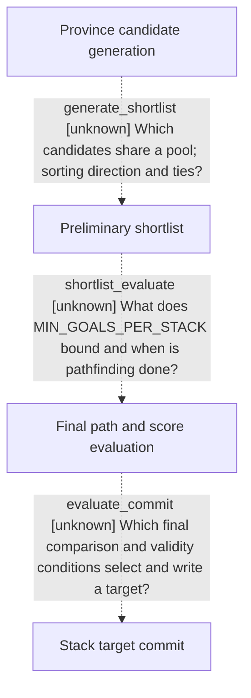

# Research plan: war-film-target-selection

GENERATED from the supplied research plan; no native semantics are inferred.

Question: How does the exact-build native target coordinator turn province candidates into a preliminary shortlist, evaluate it and commit a selected target?



| Edge | Declared status | Evidence IDs | Open question |
|---|---|---|---|
| generate_shortlist | unknown |  | Which candidates share a pool; sorting direction and ties? |
| shortlist_evaluate | unknown |  | What does MIN_GOALS_PER_STACK bound and when is pathfinding done? |
| evaluate_commit | unknown |  | Which final comparison and validity conditions select and write a target? |

| Observation design | Value |
|---|---|
| mode | offline-only |
| actor_kind | ai |
| owner_scope | Native CAIWarCoordinator and CAIUnitStack target selection; no own planner or player command substitution. |
| identity_kind | definition-key |
| identity_lifetime | Exact-build objective definitions and instruction RVAs; no portable runtime pointer identities. |
| producer_trigger | unknown |
| producer | Candidate generation downstream of native coordinator 0x185A780. |
| caller | 0x18550D0 calls 0x185A780; countdown semantics are already frozen in the separate timer package. |
| consumer | Preliminary shortlist, final score comparison, target and assignment writers. |
| cache_lifetime | Trace stack target lifecycle only where directly visible; no daily cadence claim. |
| expected_signal | Exact instruction operands, sorting direction and tie handling, pool membership and final target write call chain. |
| zero_sample_meaning | Missing direct xrefs do not rule out indirect or virtual execution. |
| stop_condition | Bounded read-only EXE and script tracing from 0x185A780; preserve residual unknowns and never start CK3 or call native routines. |
| runtime_window_ref | None |

| Evidence ID | Declared layer | File | SHA-256 | Supports |
|---|---|---|---|---|

Check result (file integrity and declarations only):

```json
{
  "schema": "xar.native-research-plan-check.v1",
  "result": "plan-consistent",
  "proof_layer": "record-structure-and-file-integrity",
  "semantic_correctness_verified": false,
  "live_execution_performed": false,
  "observation_plan_issues": [
    "offline-only plan does not define a live observation window",
    "the real producer trigger must be located before live sampling"
  ],
  "declared_edges_by_status": {
    "counter-policy": 0,
    "inference": 0,
    "live-confirmed": 0,
    "static-confirmed": 0,
    "unknown": 3
  },
  "enumerated_native_edges": 3,
  "declared_cases_by_status": {
    "pending": 1,
    "observed": 0,
    "not-applicable": 0
  },
  "checked_evidence_files": 0,
  "limitations": [
    "Evidence layers and conclusions are author declarations; hashes bind bytes, not their truth.",
    "Counts cover this enumerated graph only, not all CK3 branches.",
    "A consistent observation plan is not authorization to run or manipulate CK3."
  ],
  "plan_sha256": "7cab3408c96ec1137eaa4b9b0021408a8ed152256b67fee1c64c47c8dc14b5a2"
}
```
