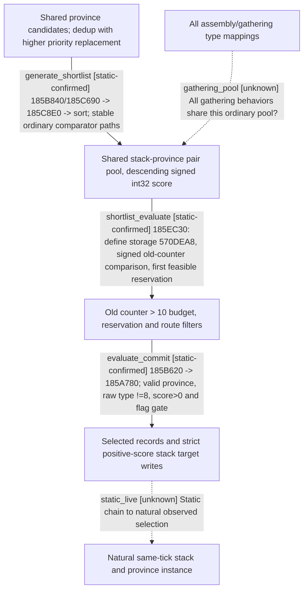

# Research plan: war-film-target-selection-result

GENERATED from the supplied research plan; no native semantics are inferred.

Question: How does the exact-build native target coordinator turn province candidates into a preliminary shortlist, evaluate it and commit a selected target?



| Edge | Declared status | Evidence IDs | Open question |
|---|---|---|---|
| generate_shortlist | static-confirmed | exact_bytes, source_contract |  |
| shortlist_evaluate | static-confirmed | exact_bytes, source_contract |  |
| evaluate_commit | static-confirmed | exact_bytes, source_contract |  |
| gathering_pool | unknown |  | Special raw 7 fallback bypasses ordinary pool; all assembly/gathering mapping is not recovered. |
| static_live | unknown |  | Need exact same production refresh input/pair/reservation/path/write snapshots; no game was started. |

| Observation design | Value |
|---|---|
| mode | offline-only |
| actor_kind | ai |
| owner_scope | Native CAIWarCoordinator and CAIUnitStack target selection; no own planner or player command substitution. |
| identity_kind | definition-key |
| identity_lifetime | Exact-build objective definitions and instruction RVAs; no portable runtime pointer identities. |
| producer_trigger | unknown |
| producer | 185AA40 block traversal and 185B840/185C690 province dedup; 185C8E0 pair scoring. |
| caller | 185A780 -&gt; 185AA40 -&gt; 185C8E0 -&gt; descending sort -&gt; 185EC30 -&gt; 185B620; outer coordinator writes target. |
| consumer | 185EE01 consumes same define storage 570DEA8; 185EF7F/EF83/EF89 select; 185A923/925 signed score&gt;0 precedes +60/+78/+74 writes. |
| cache_lifetime | Function-local province/stack/pair work and per-pass reservation; live identities not sampled. |
| expected_signal | Exact instruction operands, sorting direction and tie handling, pool membership and final target write call chain. |
| zero_sample_meaning | Missing direct xrefs do not rule out indirect or virtual execution. |
| stop_condition | Bounded read-only EXE and script tracing from 0x185A780; preserve residual unknowns and never start CK3 or call native routines. |
| runtime_window_ref | None |

| Evidence ID | Declared layer | File | SHA-256 | Supports |
|---|---|---|---|---|
| exact_bytes | exact-build | war_film_target_selection_evidence_20260923.json | 0e4918d99b92fc5d7034dee7807b45d68a655d92620abeef39483964d930c7e6 | Province dedup strict replacement; signed descending sort; old-counter budget condition; route bool, reservations and target writes. |
| source_contract | source-contract | ../../../docs/ck3-native-ai/war-film-target-selection-2026-09-23.md | 8f2af2d522f37fe5e453fd748bb052036f42f584deec73b65bdb5d79095cfdb8 | Bounded interpretation of exact EXE consumer chain, authored define and residual unknowns. |
| extractor | source-contract | war_film_target_selection_extract.py | b5494ce0ef14598a16f6c2ca166954537c6e0187500a1e726c6bf2e88d89dee7 | Read-only reproducible extraction, exact SHA and 32 instruction anchors; no live execution. |

Check result (file integrity and declarations only):

```json
{
  "schema": "xar.native-research-plan-check.v1",
  "result": "plan-consistent",
  "proof_layer": "record-structure-and-file-integrity",
  "semantic_correctness_verified": false,
  "live_execution_performed": false,
  "observation_plan_issues": [
    "offline-only plan does not define a live observation window",
    "the real producer trigger must be located before live sampling"
  ],
  "declared_edges_by_status": {
    "counter-policy": 0,
    "inference": 0,
    "live-confirmed": 0,
    "static-confirmed": 3,
    "unknown": 2
  },
  "enumerated_native_edges": 5,
  "declared_cases_by_status": {
    "pending": 2,
    "observed": 0,
    "not-applicable": 0
  },
  "checked_evidence_files": 3,
  "limitations": [
    "Evidence layers and conclusions are author declarations; hashes bind bytes, not their truth.",
    "Counts cover this enumerated graph only, not all CK3 branches.",
    "A consistent observation plan is not authorization to run or manipulate CK3."
  ],
  "plan_sha256": "eec1439f8d9c157cd4b29cab5d058ae2e318b46da1c10711583407628c645a4f"
}
```
