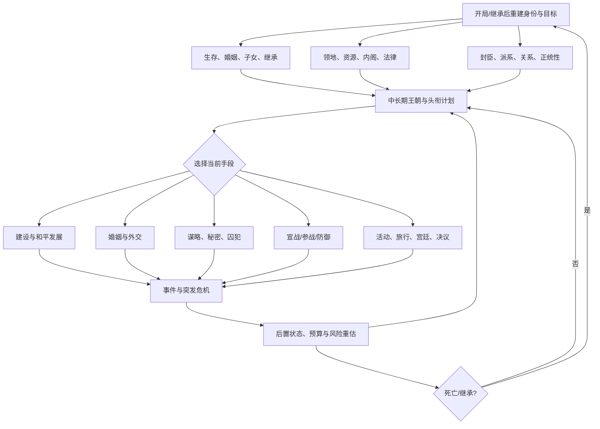
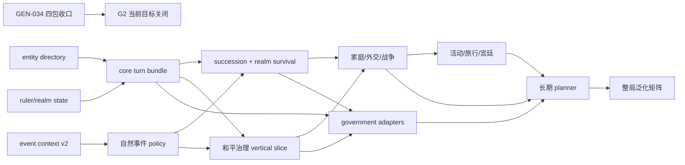

# G2 CK3 玩法覆盖与 Native/MCP 缺口研究

研究日期：2026-09-12（Asia/Shanghai）。仓库审阅范围包括 G2 目标/路线图、one-generation blocker ledger、`docs/ck3-native-ai/` 专题、native bridge/MCP 实现、策略 schema，以及 2026-09-11 至 2026-09-12 的日报证据。

## 结论

当前系统已经证明它能稳定接管 CK3 进程、在 paused exact-build 帧上读写若干原生状态、从固定 seed 连续游玩两个寿命，并在一条既有战争路径中完成相当深入的移动、接敌、战斗、撤退与窄终战闭环。这是一套扎实的自动化与战术执行底座。这里的跨 episode 是 immutable seed 重载同一角色，尚不是自然死亡后的真实继承连续性。

它离“会玩 CK3”仍有明显距离。CK3 的主循环是角色、家族、领地、封臣、继承、外交、战争与事件共同构成的跨代资源配置，而当前 planner 的可用信息和动作主要集中在既有战争。和平时期最常见、对存续最关键的选择——继承、子女、婚姻质量、经济建设、内阁、封臣与派系、健康与压力——多数仍是 `visual-narrow`、`implemented` 或 `absent`。官方对 CK3 的产品定义本身就把血统、顾问、继承人、婚姻联盟、谋略与领地治理和战争放在同一层级；战争只是其中一种手段。[^1]

日报中的 `T1=90%` 只表示 `GEN-034` 这个窄工作包接近收口，不能解释为整套 G2 自动玩家已经完成 90%。下一阶段应先完成它剩余的三项输入，用一个真实的三路战争退出 OODA 收口当前工作包。此后停止继续横向扩展单一 CB 的微观 ABI，转向四个会阻断几乎所有整局目标的公共底座：

1. 通用实体发现与批量 world/realm state；
2. 自然事件的 scope、结构化 effects 与结果验证；
3. 继承、家庭、健康、压力和正统性组成的生存连续性；
4. 经济、领地、内阁、封臣和派系组成的和平治理闭环。

完整战争 controller 应在这四项之后继续补齐补给、损耗、军备、盟友、多战争和完整终战语义。活动、旅行、宫廷和各政府/DLC 应由 runtime feature 与当前角色身份按需启用，不应一次横向铺开。当前 playset 的一次 production-live manifest 显示 44/44 effective feature flag 全为 true、29 个 runtime DLC key 可见，说明这些域最终都要覆盖；这份单 PID 证据不等于每个 feature 已经完成，也不能反推账户 entitlement。[loaded-feature-manifest.md](../ck3-native-ai/loaded-feature-manifest.md)

## 资料边界与判断口径

本报告把证据分为三类：

- **资料事实**：Paradox 官方产品页、开发日志/更新说明，以及 CK3 官方社区 Wiki 的玩法分类；
- **仓库事实**：当前提交中的能力文档、MCP surface、实机 artifact 结论与阻塞账本；
- **分析判断**：根据“能否解除完整一局 OODA blocker、能否复用于多个玩法域、能否产生玩家可见结果”给出的优先级。

CK3 官方 Wiki 在本次读取时返回了站点的 JavaScript client challenge，正文无法稳定抓取。报告仍保留其[主页](https://ck3.paradoxwikis.com/Crusader_Kings_III_Wiki)、[Beginner's guide](https://ck3.paradoxwikis.com/Beginner%27s_guide)、[Warfare](https://ck3.paradoxwikis.com/Warfare)、[Succession](https://ck3.paradoxwikis.com/Succession)、[Faction](https://ck3.paradoxwikis.com/Faction)、[Scheme](https://ck3.paradoxwikis.com/Scheme)、[Activities](https://ck3.paradoxwikis.com/Activity)与[Government](https://ck3.paradoxwikis.com/Government)作为 canonical 导航入口；需要具体机制依据的判断优先引用 Paradox 官方发布页和仓库冻结的 CK3 `1.19.0.6` exact-build 证据。旧版或镜像攻略只用于交叉确认玩法分类，不用于冻结数值、ABI 或当前版本行为。

`1.19.0.6` 的官方更新说明直接修改了手动邀请谋略 agents 以及 epidemic/natural-disaster lethality；这两类策略不能从旧版本攻略外推，必须以当前 exact build 的定义、调用链和实机结果重新验收。[^11]

仓库中的状态标签按现有定义使用：`research`、`static-ready`、`fixture-live`、`production-live primitive`、`production-live loop` 和 `complete`。工具存在、命令 ACK 或单个 fixture 均不计为玩法闭环。[goal-and-roadmap.md](goal-and-roadmap.md)

## CK3 完整一局的决策链

CK3 的玩家对象是跨代王朝而非单个国家。角色死亡、继承与新统治者重新建立权力基础会周期性重置目标；婚姻和子女既关系 game over，也影响联盟、宣称、遗传与后续可玩角色。官方资料把培养继承人、婚姻联盟、顾问、军队、谋略与领地经营并列为核心能力。[^1]

一局长期循环可抽象为下列依赖图：

这张图有三个工程含义。

第一，事件不是独立玩法，而是所有域的中断与状态转移层。没有可信 scope/effect/结果，任何长期策略都可能在一次多选事件中丢失目标。第二，继承不是终局清理，而是 campaign 的周期性入口。第三，战争 planner 必须消费财政、继承、派系、盟友和补给；单独提高战术微操无法形成正确的宣战或停战决策。Paradox 对原生 AI 的公开说明也体现了这种耦合：经济建设按首都、domain 和后期 development 分层投入，宣战评估会比较兵力和可用于雇佣兵的资金，派系还会随当前战争和其它派系改变要求。[^12][^13]

## 玩法覆盖审计

下表的“当前状态”来自 [goal-and-roadmap.md](goal-and-roadmap.md)、[autonomous-capability-roadmap.md](../ck3-native-ai/autonomous-capability-roadmap.md)、[one-generation-blocker-ledger.md](one-generation-blocker-ledger.md) 和 2026-09-12 日报。状态按整个玩法域评估，因此一个域即使已有窄 live primitive，也可能仍判为“严重不足”。

| 玩法域 | 完整一局要求 | 当前仓库证据 | 关键缺口 | 建议顺位 |
|---|---|---|---|---:|
| 会话、时间、暂停、checkpoint、进程回收 | 稳定推进、恢复、重绑 episode | 固定 seed 已有 `production-live loop`，两个完整寿命和再次跨 episode 已实走 | `start-next-episode` 会从 immutable seed 重新载入同一角色；它证明恢复与持续运行，不证明普通 campaign 继承 | 保持，不重复建设 |
| 世界与实体发现 | 搜索角色、头衔、领地、邻国、关系图，产生候选集 | campaign root、title navigation 和 war-scoped 部分发现 | 无 canonical character/title/province/realm directory；大量策略只能消费预知 ID | **P1** |
| 事件与通知 | 识别自然事件、比较多选后果、提交并验证 | current-window transport 为 fixture-live；共享 registry 已迁移大量合同；自然事件窄合同持续增加 | generic saved scope identity、资源/关系/健康/头衔/战争 delta、完整性与多选 utility 未闭合 | **P1** |
| 角色基础与资源 | 属性、traits、金币/威望等资源、收支、健康、压力、正统性 | 玩家 ID、存活、配偶/婚约；其余多为空缺 | 没有统一 ruler state；无法进行预算、风险或事件效用比较 | **P1** |
| 继承与头衔连续性 | 继承人、法则、title distribution、partition 风险、继承后恢复 | 固定 immutable seed 的跨 episode loop；视觉 succession fixture | 无 typed succession prediction；不是普通 campaign 继承 | **P1** |
| 家庭、婚姻、教育、王朝 | 联合评分婚配、guardian、子女与王朝资源 | 可列合法婚配并提交；部分关系后置 live | 仍可能选首个合法 ID；缺属性、继承、联盟、遗传、接受度、教育和 dynasty utility | P2 |
| 经济、domain、building | 收支预算、holding/slot、建设候选、回报期、domain limit | `visual-narrow` | native query、候选、动作、长期 postcondition 基本缺失 | **P1** |
| council、control、development、lifestyle | 任务分配、发展/控制、focus/perk 与长期目标一致 | `visual-narrow` | typed 状态、候选与 semantic action 缺失 | **P1** |
| 封臣、契约、派系、叛乱 | 监测 power/discontent/deadline，选择让步、分化、结盟或镇压 | 近乎 `absent` | CK3 realm survival 最大空白；没有 vassal/faction graph 或应对动作 | **P1** |
| 外交与关系 | opinion breakdown、联盟、停战、gift/sway/befriend、call/join | 互动 identity 和 war-scoped 关系很窄 | 无通用关系图、接受度、外交 action/postcondition | P2 |
| 谋略、hooks、secrets | 选择目标、agent/role、进度、隐蔽、时机、结果 | `absent` | 2024 scheme 已是角色化 agent roles、进度上限和可选择执行时机；当前无 query/action/policy[^2] | P3 |
| 囚犯、犯罪、tyranny | ransom/release/punish/imprison 与财政稳定联合判断 | inbound `pay_ransom` reject loop | 无 prisoner roster、crime/tyranny、outbound terms 与效用 | P2 |
| 健康、压力、疾病、瘟疫 | 治疗、医师、压力行为、传染风险与继承应急 | 自然事件安全合同；系统状态基本 `absent` | health/stress/plague/physician/legitimacy query 和动作缺失；瘟疫会同时破坏人物与发展[^3] | **P1** |
| 军队、路线、战斗与撤退 | 集结、移动、接战、增援、预测、撤退、终局 | 当前最强：多项 `production-live primitive/loop` | join-existing、多 compatible combat、增援真实 join、forecast 校准、异常 terminal 分支 | P2 |
| 补给、损耗、军备、佣兵、raid、海运 | 和平备战与战役持续能力 | 局部输入/research；多数未闭合 | supply/attrition、MAA/knight/commander composition、mercenary/raid/embark policy | P2 |
| 宣战、盟友、多战争 | 比较 CB/目标/成本/盟友/其它战争，合法宣战或不战 | 宣战候选、原生 strategic power、动作实现；缺输入时 `NO_DECLARE` live | campaign cost、forecast、退出、继承/派系风险与 call/join 后置；多战争调度 | P2 |
| 战争退出与战后 | 胜/和/降三路比较、terms、结果与恢复 | `claim_cb` 白和窄 loop；R459 已证 Raiktor 兵力 `3000→0`、truce expiry `53227656` 与 comparison input；R471 已证双方 strategic power | `GEN-034` 还缺 dominance certificate、versioned strategy budget/profile、同帧 white-peace comparison 与综合 action | **P0 当前** |
| 法律、政府、文化、创新、决议 | 长期制度投资和合法 action | 多为 `absent`/`visual-narrow`；feature manifest live | law/culture/innovation/decision state、候选、时间窗口和效果 | P3 |
| 活动与旅行 | 邀请/主办、选项/intent、路线/危险/随行、事件、返程 | `absent` | 官方系统要求 route、entourage、intent 和分阶段 activity；当前没有 state/action lifecycle[^4] | P3 |
| Royal Court、artifact、accolade | grandeur/amenities、职位、装备/修理/claim、骑士荣誉 | combat accolade 仅 research | 无状态、候选、动作、维护预算；官方系统会反馈封臣、外交和军事[^5] | P4 |
| Legends、legitimacy、plague | 跨代名望、正统性、疾病与恢复 | feature 可见，玩法层基本 `absent` | 这些系统影响所有 ruler，不应被当作纯 DLC 点缀[^3] | health/realm 包内提前 |
| Administrative / landless | Influence、estate、governorship、contract、流浪与落地 | feature 可见，玩法层 `absent` | 政府身份会改变资源、继承、领地与目标模型[^6] | P4，按身份启用 |
| Nomad / tributary | Herd、fertility、migration、dominance/obedience、tributary | feature 可见，玩法层 `absent` | 不能复用 feudal 钱/地/封臣假设[^7] | P5，独立 vertical slice |
| Coronation / oath | 新统治者正统性、派系关系、限时统治目标 | feature 可见，玩法层 `absent` | 继承后最早期目标与 realm stability 没有接入[^8] | 继承包内提前 |
| All Under Heaven 中国/日本/东南亚 | Merit/Influence、科举、国库/工程、dynastic cycle；日本 house blocs；Mandala/tributary | T0 已有大量天朝产品专用观察，但通用 agent policy 基本没有 | mod 验收 query 不能冒充 CK3 通用 government OODA；三个区域需要不同身份模型[^9] | 中国 P3/P4；日本 P5；Mandala 延后 |
| 长期目标、预算、学习、跨继承记忆 | 多目标调度、机会成本、结果校准、冷恢复 intent | 少量布尔记忆和单步 planner | 缺 canonical world state、预算、deadline、outcome model 与策略更新 | P5，依赖前述数据面 |

## 当前架构的主要结构性问题

### 战术深度远高于战略广度

已有原生研究与 live artifact 在接敌、战斗 tick、撤退、增援和 Raiktor surrender 上很深；与此同时，资源、继承、封臣、派系、健康、经济和活动等决定“为什么打、何时停、能不能承受战争”的输入尚未存在。结果是 planner 能精细执行别人已经替它选定的战争，却无法可靠选择 CK3 的大多数日常目标。

这不是要求削减战争能力。应把已经成熟的战术底座视为可复用执行器，把后续 native 预算转向能同时服务宣战、停战、事件、继承和治理的公共状态。例如一份权威的金币/收支/储备预算，比继续为单一 CB 添加一个边缘效果字段能解除更多决策阻塞。

### MCP surface 大，但语义覆盖窄且不均匀

[mcp_server.py](../../ck3_autonomous_player/src/xar_autoplayer/bridge/mcp_server.py) 当前注册 79 个 `ck3_*` 工具和 2 个 resources；[ck3_11906_adapter.cpp](../../ck3_autonomous_player/native_bridge/src/ck3_11906_adapter.cpp) 当前基线声明 82 个 capability，并可按编译期开关继续增加。相较之下，[autonomous-capability-roadmap.md](../ck3-native-ai/autonomous-capability-roadmap.md) 仍写 56 个，已经是过期盘点。上述数量还混合了天朝二期、纹章资源、证据 registry 和多个窄战争查询，不能当作玩法覆盖率。

通用 MCP 还存在三类接口债：

1. **发现债**：缺少按条件查角色、头衔、领地、关系与候选的 first-class 查询，调用者必须预知 ID；
2. **批量状态债**：曾在同一帧执行 167 条查询并造成显著耗时，[one-generation-blocker-ledger.md](one-generation-blocker-ledger.md) 的 `GEN-013` 已证明逐字段往返和 history 持久化会放大成本；
3. **动作语义债**：split/merge、route preview/contact 等仍常经 `ck3_execute_step` literal 暴露。长期应让高价值动作拥有 typed candidate、precondition、费用/效果、submit receipt 和 independent postcondition，而不是要求上层拼装字符串。

现有 [observation-v2.schema.json](../../ck3_autonomous_player/schemas/observation-v2.schema.json) 仍描述截图、OCR、可见控件与可见事实，[action-v1.schema.json](../../ck3_autonomous_player/schemas/action-v1.schema.json) 只枚举 pause/click/type/wait/save/exit 一类视觉动作。它们没有表达现有 native typed state 和 semantic actions。无需把所有原生字段塞回视觉 schema；应从 adapter/MCP 声明生成独立的 native observation capability index 与 semantic action catalog，再由 turn bundle 引用。

### 文档 source of truth 出现时间漂移

[goal-and-roadmap.md](goal-and-roadmap.md) 顶部盘点基线仍写 2026-08-27，“当前执行顺序”仍停在 2026-08-30；[autonomous-capability-roadmap.md](../ck3-native-ai/autonomous-capability-roadmap.md) 某些表述也落后于后续第二寿命和 `GEN-034` 证据。更危险的是 [one-generation-blocker-ledger.md](one-generation-blocker-ledger.md) 顶部 `GEN-034` 行还要求继续枚举旧 index 9/10，并把 source attribution/pre/loss 写成 false；同一文件后部 R459/R471 已经用更新证据取代这些入口。若自动施工只读顶部表，会重复已完成的 ABI 工作。

建议保留专题作为证据正文，但新增一份机器可读 `capability-catalog-v1.json` 作为唯一状态索引，最少包含：domain、capability、status、exact build、query/tool、action、planner consumer、latest live artifact、open blocker、last updated commit。README/roadmap 表格由它生成或校验，避免同一能力在不同文档里同时处于 `pending` 和 `production-live`。

### 产品专用 query 与通用 agent capability 边界模糊

天朝二期已积累大量精确 snapshot/provider，这些资产很有价值，但它们大多描述 mod 专用 business state。通用 agent 能读取某个考核榜、工作流 owner 或 promotion ticket，不等于它会管理 CK3 的资源、封臣、继承或政府。应把共用底座下沉为通用 character/title/realm/event/resource primitives，产品 query 只在其上投影 mod 语义。

### planner 仍是单步规则集，尚无目标与预算层

当前 planner 的优点是 fail-closed 且可审计：输入不全时会 `NO_DECLARE`，不会把 ACK 当状态。但它没有完整 world state、长期 budget、deadline、多目标依赖和结果校准，因此无法比较“花钱建造、留作佣兵、举办活动、拉拢派系、准备继承”之间的机会成本。应在数据面补齐后再引入分层计划，不能用更多硬编码 if/else 代替缺失观察。

[growth_100_v1.json](../../ck3_autonomous_player/strategies/growth_100_v1.json) 已经提供目标文件形状，但自身明确标记为 `planned`、`hypothesis` 和多项 `unvalidated`。它是待校准的策略提案，不能计作长期 planner 已完成；第一轮校准应消费建设、婚姻、派系和战争的 predicted/actual delta，而不是先扩充更多未验证权重。

## Native 层缺口

按复用价值排序，下一批 native 能力应是聚合的 semantic snapshot，而不是零散字段：

| Native 能力 | 最小字段 | 主要消费者 | 为什么优先 |
|---|---|---|---|
| `entity-directory-v1` | character/title/province/realm identity、类型、owner/holder/liege、adjacency/realm relation、分页与过滤 | 所有 candidate generator | 消除预知 ID；一次建设服务婚姻、外交、战争、封臣和活动 |
| `ruler-state-v1` | attributes、traits、age、health band、stress、fertility、resources、monthly income/expense、prestige/piety/renown/legitimacy/influence/merit 的合法可用项 | event utility、继承、经济、外交、政府 | 当前最常见的决策输入空洞；必须保留 feature/government gated unavailable |
| `realm-state-v1` | titles/domain limit、holdings/buildings/construction、control/development、council/tasks、vassals/contracts、factions/power/discontent/deadline | 和平治理、宣战与停战 | 把经济、稳定与战争机会成本放进同一 paused frame |
| `succession-state-v1` | player heir、eligible heirs、laws、per-title predicted heir、partition distribution、claims、game-over risk | 跨代连续性、婚姻、title actions | 现有跨 episode 是 immutable seed 重载，不是普通 campaign 继承 |
| `event-context-v2` | stable root/saved scopes、typed generic payload identity、structured resource/relationship/health/title/war effects、completeness | 所有长跑 | 解除自然多选事件阻塞；R506 再次证明 generic scope 类型不能硬编码 raw index |
| `military-sustainment-v1` | army/regiment composition、MAA、knights/commander、supply、attrition forecast、reinforcement cost、mercenary candidates、embark/raid state | war entry、campaign、battle controller | 补齐“能否持续打”而非只读当前兵数 |
| `diplomacy-graph-v1` | opinion breakdown、relations、alliances、truces、hooks、acceptance/reasons、diplomatic range | 外交、婚姻、派系、盟友 | 多域共用，减少重复角色关系 reader |
| `scheme-state-v1` | candidates、agent roles、progress/potential、success/secrecy/breaches、costs、execute-now legality | schemes、继承危机、派系处理 | 当前版本 scheme 的核心选择不是单一成功率[^2] |
| `activity-travel-state-v1` | candidate/invite、host/guest、options/intents、phases、route/danger、entourage、regent、return state | 活动、旅行、coronation/exam | 活动是跨事件的长 transaction，需独立 lifecycle[^4] |
| `culture-law-decision-v1` | laws/authority、culture/traditions/innovations/fascination、非宗教 decision eligibility/cost/effect | 长期制度规划 | 高价值但依赖资源/realm state |
| government adapters | feudal/clan/admin/celestial/japanese/nomad/landless/mandala 的身份、专属资源和候选 | feature-specific planner | 必须在通用 core 之后按 active identity 加载，禁止一个扁平 schema 填大量 null |

`faith/doctrine/tenet/fervor`、改宗、宗教改革与 holy order 不进入近期 native 清单。圣战只调用战争合法性、目标、费用、参战和结束所必需的原生最终结果；婚姻只调用接受度/合法性中不可替代的最小判定。Mandala 中与宗教系统紧耦合的部分延后，不能借政府工作包扩大通用宗教研究。

## MCP 查询与动作缺口

每个新域建议固定成四类 first-class 工具，而不是继续扩大万能 `ck3_execute_step`：

| 工具类型 | 统一合同 | 示例 |
|---|---|---|
| 状态查询 | exact build、connection/episode/generation、public/native revision、paused frame、typed unavailable | `ck3_query_realm_state_v1` |
| 候选与 terms | 稳定 candidate ID、合法性/reasons、成本、结构化效果、deadline、source provenance | `ck3_query_construction_candidates_v1` |
| semantic action | candidate ID + expected revisions；不允许 arbitrary script/string | `ck3_start_construction_v1` |
| 结果查询/等待 | 独立新帧读取、旧 candidate 生命周期、资源/关系/title delta、超时原因 | `ck3_wait_construction_result_v1` |

另需三个横切工具：

- `ck3_query_turn_bundle_v1`：按 planner 当前目标一次返回 ruler、realm、succession、event/pending、war summary 的同帧聚合，替代数十至上百次 RPC；
- `ck3_search_entities_v1`：使用 declarative filter 和分页，返回稳定 typed identity，禁止通过 OCR 或本地化名猜 ID；
- `ck3_get_capability_catalog_v1`：按当前 build/feature/government/role 返回 `available | unavailable | not_applicable`、证据等级和 first-class tool 名称，让 planner 不再从 79 个工具名推断 readiness。

动作结果必须由状态变化证明。ACK 仅表示命令已受理；结婚要验证配偶/婚约与联盟，建设要验证 construction queue 和资源扣除，派系处理要验证成员/power/discontent，活动要验证 phase 与 return，继承要验证实际 holder/title distribution。

## 建议施工顺序

### P0：完成 `GEN-034` 并结束当前窄工作包

仓库现状已经有真实 surrender、source-specific loss/truce、active-war strategic power。R459 已完成一次 surrender，把 source 兵力从 `3000` 证明到 `0`，并两次读取 persisted truce expiry `53227656`；R471 两次读取玩家 `13075500000`、对手 `16770900000`，比率 `128262/100000`。剩余明确为 campaign dominance certificate、strategy budget/profile、same-frame white-peace comparison。只做下列四个包：

1. 把 R471 strategic-power primitive 转为 policy-level dominance certificate；
2. 将 owner 决策口径落成 versioned strategy profile，包含仓库默认值、来源、版本和操作者 override；这是 planner 配置，不是新的 CK3 native observation；
3. 在同一 paused frame 取得 white-peace terms/utility；
4. 三路 comparison → 一次 semantic action → postwar state/checkpoint。

最小验收：一个 production checkpoint；同帧两次查询一致；recommendation 输入完整；只提交一次选定 action；下一 paused frame 独立验证 WarID/loss/truce/resources；保存并冷恢复。单字段修复只跑定向测试和一场有界实机，不扩成长跑。

### P1-A：通用发现与核心 turn bundle

实现 `entity-directory-v1`、`ruler-state-v1`、`realm-state-v1` 的最小子集和 `ck3_query_turn_bundle_v1`。第一版只需支持当前 feudal ruler，但 schema 必须用 component-level `not_applicable/unavailable` 支持其它政府。

最小验收：在两个不同 ruler/seed 的 paused production frame 上，搜索自身、主头衔、capital、liege/直属封臣和一个相邻独立 ruler；同一 bundle 返回资源/收支、domain、council、succession 摘要、faction alert、health/stress；双查询相等，cold restore 后稳定 identity 可重绑。

### P1-B：自然事件语义闭环

当前共享 vanilla registry 已索引 187 个事件，其中 116 个 source-reviewed、71 个 migration-only，并通过 5 个只读 MCP 知识/证据工具暴露；但 discovery summary 的 `portable_events=0`，其它机器可复用的 portable evidence 仍未闭合。[strategy.py](../../ck3_autonomous_player/src/xar_autoplayer/strategy.py) 的 current-event 分支也尚未消费这份 registry。`semantic_decision_ready=false` 时现有逻辑会按 death/cancel/native-order 的审计退化规则继续，这能维持 campaign，却明确不是 semantic optimum。

从现有 registry 与 `event-context-v2` 继续，先把当前 canonical event key/scope 接到 registry recommendation，再把选项执行接到旧 instance 消失和效果 postcondition。优先支持通用 Character/title/war/value scope identity，以及会影响资源、关系、stress/health、traits、titles/claims、war 的结构化效果；不可解释分支保持 RED 并进入 registry。

最小验收：三种自然 production 事件，其中至少两个有多个合法选项；planner 明确记录目标和 utility，不能固定第一项；选择后同日/下一帧验证预期 delta。每次新事件只做 exact definition + 最小合同 + frozen replay + 同进程热恢复，不为单个事件启动永久长跑。

### P1-C：继承与 realm survival

实现 `succession-state-v1`、health/stress/plague/legitimacy 最小状态、婚姻/guardian 候选，以及 vassal/faction alert。先把“下一次死亡后还能否继续、会失去什么、现在最大内患是什么”变成可回答问题。

最小验收：在死亡前 checkpoint 预测每个玩家头衔继承人和 partition distribution；自然死亡后逐项对照实际结果；新角色完成 coronation/oath（若 feature/身份适用）或记录 `not_applicable`，重建一个高层目标并继续至少三次可见 gameplay。

### P1-D：和平治理第一个 vertical slice

先做一个整合场景，而不是分别宣布 economy/council/faction static-ready：读取预算与 realm → 比较建设、内阁任务和派系缓解 → 执行其中一个 → 验证后置 → checkpoint。

最小验收：连续两个游戏年内完成至少一项建设、一项 council task 调整和一次真实 faction/vassal 风险处理；无人工点击；每项都有资源、关系或 faction postcondition。之后再运行一个十年和平自治 qualification，单个 bug 的修复仍只回归其最小场景。

### P2：家庭、外交与完整战争

1. 婚姻联合评分与 guardian/education；
2. diplomacy graph、outbound gift/sway/befriend、联盟/召集；
3. military sustainment、军备与补给；
4. planner 自主选择宣战或不战，随后完成一场胜/和/降任一路径；
5. 多战争、盟友战争、内战与 raid 作为后续矩阵。

最小验收：至少五个合法战争/外交候选；选择理由消费财政、继承、派系、盟友 ETA、supply 和 exit；从和平开始到战后 cold restore 全程无人工输入。

### P3：谋略、囚犯、文化/法律/决议、活动/旅行

这些系统价值很高，但依赖 P1 的角色、关系、预算和事件层。每项按一个真实 OODA 收口：启动 scheme 并决定何时执行；处理 prisoner/crime；完成一个非宗教 major decision 或 law/culture project；完成一场 activity 从计划、路线、事件到返程。

活动不应只测试“点击举办”。官方系统包含随行、路线危险、intent、阶段、regency 与结果；Coronation、考试和巡游可复用同一 lifecycle。[^4][^8]

### P4：当前 playset 的政府与 DLC 适配

顺序按复用和当前项目价值建议为：

1. **Celestial/merit admin**：复用天朝二期观察资产，补 Merit/Influence、考试候选、职位、国库/工程与 dynastic cycle 的通用 policy；
2. **Administrative**：estate、governorship、Influence 与 successor/co-ruler；
3. **Royal Court/Artifact/Accolade**：接入 realm、budget、knight 与 activity；
4. **Japan**：house relations/blocs、imperial policies、regent/shogun paths；
5. **Nomad**：独立 Herd/fertility/migration/dominance/tributary 模型；
6. **Landless**：camp/contracts/travel/settlement；
7. **Mandala**：宗教域解除前只做不依赖 doctrine/tenet 的政府外壳，其核心 Devaraja/piety 策略延后。

每个 adapter 最小验收是一个与该身份强相关、能改变可见游戏状态的 production OODA；只读 feature flag 或进入地图不计完成。

### P5：长期 planner 与整局矩阵

在核心状态和至少四个 vertical slice 成熟后，引入层次化目标：生存/继承 → realm stability → 经济与军备 → 对外扩张/制度 → 王朝长期目标。checkpoint 保存 intent、预算和 pending transaction；恢复后重新查询事实再继续，不重放不可逆动作。

最终矩阵至少覆盖：不同 seed/ruler；伯爵/公爵/国王；普通 campaign 跨继承；十年和平后战争；进攻、防御、内战与盟友战争；feudal 加一种行政型政府；当前角色实际启用的 DLC feature 场景。矩阵按域逐步累积，不把每个小 bug 的验证扩大为全矩阵长跑。

## 依赖关系

`GEN-034` 与 P1-A/P1-B 的静态研究可以并行，但 CK3 启动必须继续独占串行。T0 宣传采集占用 CK3 时，G2 只做不冲突的文档、exact-build 逆向和 focused fixture，不抢占实机资源。

## 可推迟工作

以下工作当前不会解除最近的整局 blocker，应明确推迟：

- loaded feature 的 entitlement provenance 与物理 archive residency；已有 effective runtime gate 足以决定 planner 是否加载 adapter；
- 纹章资源读写、纯展示性 artifact 细节和不影响决策的本地化文本解析；
- rare battle terminal 分支的穷举，除非 production run 真实命中；
- 单一 CB 的更多边缘 terms，在 `GEN-034` 完成后由真实战争场景驱动；
- 每个 DLC/政府一次性横向 schema；先完成 feudal core 与一个 Celestial/Administrative vertical slice；
- 通用宗教、改宗、宗教改革、faith/doctrine/tenet/fervor、holy order；继续遵守 owner-deferred；
- 未来 `By God Alone` 与 `Silk & Silver` 内容。冻结 build `1.19.0.6` 只包含 Chapter V 支持/Stories 等当前内容，未发布玩法不进入当前能力 backlog。[^10]

## 测试与实机证据缺口

当前 live evidence 的强项是可追溯性：exact EXE/DLL hash、paused revision、PID/generation、source checkpoint、action history、cleanup 和 RED preservation 都很成熟。缺口主要是场景代表性与 end-to-end value：

| 缺口 | 当前事实 | 建议验收 |
|---|---|---|
| seed/ruler 泛化 | 两个完整寿命来自同一 immutable seed/角色 | 两个不同 seed，至少一个普通 campaign 继承 |
| rank/government | 固定场景和 feudal/当前 T0 Celestial 产品验证为主 | 伯爵、公爵、国王；feudal + Celestial/Admin 各一条 OODA |
| 和平治理 | 没有通用十年经济/realm loop | 先做两年 vertical slice，再做一次十年 qualification |
| 事件语义 | transport/fixture 强，自然多选 utility 弱 | 3 个自然多选事件 focused closure；长期累计 50 key 作为后续 qualification |
| 战争入口到战后 | 既有战争与窄白和强，从和平自主宣战弱 | 一个自选 CB，从候选比较到战后恢复 |
| 继承 | episode reload 强，真实 title distribution 未验 | 死前预测与死后实际逐 title 对账 |
| DLC features | manifest 全 true，但 feature OODA 基本未跑 | 只对当前身份适用 feature 各一条 live loop；其余 `not_applicable` |
| 高层 intent 恢复 | save/restore 稳定，目标记忆很少 | 恢复后重建同一目标并达成一个可见里程碑 |
| outcome calibration | battle ledger 和少量结果已存，未形成学习 | 对 construction、faction、marriage、war 各记录 predicted/actual delta |

验收应遵循比例原则：新增 query 只需同帧双读和一个真实值；新增 action 只需一个候选、一次提交和独立后置查询；持续域在组合成 vertical slice 后才做多年运行。任何单个 bug 修复不自动触发全套整局矩阵。

## 对现有路线图的修改意见

现有 F0/P1–P11 分类覆盖面总体正确，但建议做五项调整：

1. 把 **event-context-v2** 和 **core turn bundle** 提到战争 P1/P2 之前的公共 P1；事件与状态缺口已经真实阻断多条长跑；
2. 把经济、内阁、封臣、派系、继承、health/stress/legitimacy 合并为一个“realm survival”纵向里程碑，避免每域只交付 read-only primitive；
3. 把战斗剩余长尾降为 encounter-driven，保留当前成熟 controller，先补 supply、campaign budget 与 ally 等战略输入；
4. 把 feature-specific 工作从“大而全 P10”改为 runtime identity 加载的 adapter 队列；Celestial/Admin 先行，Nomad/Landless 独立；
5. 给每个路线图条目增加 `latest_evidence`、`planner_consumer` 与 `visible_outcome`，没有后两者的 query 不得提高玩法完成度。

这套调整会把工程评价从“又闭合了多少字段/ABI”改为“又解除了一项长期决策阻塞，并让 agent 在游戏里完成了什么”。原生逆向仍然是必需前置，但每轮应优先选择复用面大、能够立刻进入 planner 和 production OODA 的观察口。

## Sources

[^1]: Paradox Interactive. [“Long Live the King! Crusader Kings III Now Available.”](https://www.paradoxinteractive.com/media/press-releases/press-release/long-live-the-king-crusader-kings-iii-now-available) 2020-09-01. 用于 CK3 核心玩法与跨代王朝定位。
[^2]: Paradox Development Studio. [“Dev Diary #157 — Schemes & Stories.”](https://store.steampowered.com/news/posts/?appids=1158310&enddate=1727194498&feed=steam_community_announcements) 2024-09-17. 用于当前 scheme 的 agent roles、progress/potential、secrecy 与执行时机。
[^3]: Paradox Development Studio. [“Dev Diary #145 — Legends & Legitimacy”及 Legends of the Dead feature breakdown.](https://store.steampowered.com/news/posts/?appids=1158310&enddate=1709816650&feed=steam_community_announcements) 2024-02-20；另见 Paradox Interactive [Legends of the Dead](https://www.paradoxinteractive.com/games/crusader-kings-iii/add-ons/crusader-kings-iii-legends-of-the-dead)。用于 plague、legitimacy、legend 对全局/跨代玩法的影响。
[^4]: Paradox Interactive. [Crusader Kings III: Tours & Tournaments.](https://www.paradoxinteractive.com/games/crusader-kings-iii/add-ons/crusader-kings-iii-tours-and-tournaments) 以及 [2023-05-11 发布说明](https://www.paradoxinteractive.com/games/crusader-kings-iii/news/tours-and-tournaments-now-available)。用于 route、entourage、intent、activity 与 accolade。
[^5]: Paradox Interactive. [Crusader Kings III: Royal Court.](https://www.paradoxinteractive.com/games/crusader-kings-iii/add-ons/crusader-kings-iii-royal-court) 用于 court grandeur、artifact、court judgment 与 culture hybridization/divergence。
[^6]: Paradox Interactive. [Crusader Kings III: Roads to Power.](https://www.paradoxinteractive.com/games/crusader-kings-iii/add-ons/crusader-kings-iii-roads-to-power) 用于 Administrative Government、estate、Influence、governorship、landless contracts 与 successor/co-ruler。
[^7]: Paradox Interactive. [Crusader Kings III: Khans of the Steppe.](https://www.paradoxinteractive.com/games/crusader-kings-iii/add-ons/crusader-kings-iii-khans-of-the-steppe)；另见 [Update 1.16/feature changelog](https://store.steampowered.com/news/posts/?appids=1158310&enddate=1746521581&feed=steam_community_announcements)。用于 Herd、fertility、migration、Dominance/Obedience 与 tributary。
[^8]: Paradox Interactive. [Crusader Kings III: Coronations.](https://www.paradoxinteractive.com/games/crusader-kings-iii/add-ons/crusader-kings-iii-coronations) 2025-09-09. 用于继承后 coronation、faction/detractor 与 oath 目标。
[^9]: Paradox Interactive. [Crusader Kings III: All Under Heaven.](https://www.paradoxinteractive.com/games/crusader-kings-iii/add-ons/crusader-kings-iii-all-under-heaven) 与 [2025-10-28 发布说明](https://www.paradoxinteractive.com/media/press-releases/press-release/establish-a-new-hegemony-in-all-under-heaven)。用于 Celestial/Merit/考试/国库/工程、Japan 与 Mandala/tributary 玩法边界。
[^10]: Paradox Development Studio. [“1.19 Scribe Update — Available Now.”](https://store.steampowered.com/news/posts/?appgroupname=Crusader+Kings+III&appids=1158310&enddate=1776772711&feed=steam_community_announcements) 2026-04-20. 用于 exact build 所属更新、Stories 与 Chapter V 支持边界；未来扩展发布日期仅作排除依据。
[^11]: Paradox Development Studio. [“Update 1.19.0.6.”](https://steamcommunity.com/ogg/1158310/announcements/detail/677373278422041208) 2026-05-25. 用于当前补丁对 scheme agent 邀请与 epidemic/natural-disaster lethality 的修正边界。
[^12]: Paradox Development Studio. [“Dev Diary #104 — AI AI AI.”](https://store.steampowered.com/news/posts/?appids=1158310&enddate=1661862855&feed=steam_community_announcements) 2022-08-23. 用于原生 AI 的分层领地经济投资方向；这里只把它当作玩法依赖证据，不复制版本相关权重。
[^13]: Paradox Development Studio. [“Dev Diary #60 — The Cost of War.”](https://store.steampowered.com/news/posts/?appids=1158310&enddate=1621580649&feed=steam_community_announcements) 2021-05-18. 用于宣战时的兵力/雇佣兵资金评估，以及战争、派系和要求之间的动态耦合；具体数值不外推到 `1.19.0.6`。
