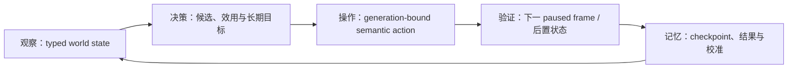

# CK3 自动游玩智能体：终极目标、当前能力与完整路线图

## 终极目标

构建一整套能够高智商游玩 CK3 的玩家智能体。它必须在 exact-build 原生桥之上长期、无人接管地反复完成：

最终智能体不是固定开局脚本，也不是若干命令的集合。它应覆盖当前 playset 中玩家可执行的全部主要玩法能力，能够处理
中断、并发目标、资源预算和不确定性；从开局选择开始，跨和平、战争、事件、家庭、统治与继承，完成自然统治者生命周期，
并在普通 campaign 模式跨继承继续。

## 冻结边界与本页口径

- 当前 exact build：CK3 `1.19.0.6`。
- `ck3.exe` SHA-256：`2D00FF3101EF70B566F2FCBAE292F09263199C80E9DC8F139B82D7D96F83DB86`。
- 本页盘点日期：2026-08-27；实现与验收合同盘点基线：`9e9ebbad6475`。
- 能力明细以
  [`autonomous-capability-roadmap.md`](../ck3-native-ai/autonomous-capability-roadmap.md) 为施工账本，
  以 [`docs/ck3-native-ai/README.md`](../ck3-native-ai/README.md) 为原生 AI 证据索引。
- 本页只汇总已经有证据支持的状态。`static-ready`、`fixture-live`、`production-live primitive` 与
  `production-live loop` 不互相混写。

一个玩法域只有同时具备以下五层，才可以标为 `complete`：

1. 冻结 exact build 并梳理原生 AI 决策树，证据正文与 Mermaid 分支同步；
2. 决策输入由 typed native observation 提供，并在 paused production frame 验证 identity、generation 与真实值；
3. 操作使用有前置验证的 semantic command，并以新状态而非 ACK 判断成功；
4. planner 能比较多个合法候选，结合长期目标、机会成本、风险与不确定性；
5. production 实机完成完整 OODA，持续域还要通过 checkpoint 冷恢复与重复长跑。

截至本页盘点，没有理由宣称“全游戏自治”或“高智商 CK3 智能体”已经完成。

## 已经完成或真实可用的能力

下表列的是已闭合的基础或窄里程碑，不把部分闭环扩义成整个玩法域完成。

| 能力 | 当前证据等级 | 已经能做什么 | 仍不能据此声称什么 |
|---|---|---|---|
| exact-build 会话与时间 | `production-live primitive` | 识别地图就绪、玩家与日期；暂停、速度和有界时间推进；最小化窗口运行。 | 不代表会选择长期目标。 |
| checkpoint / 冷恢复 / 进程回收 | `production-live loop` | 保存、冷恢复、校验日期/角色/history anchor，并维持 managed cleanup。 | 不代表恢复后所有高层 intent 已重建。 |
| 既有战争的基础移动与围城 | `production-live loop`（部分场景） | 集结、路线 preview、移动、split/merge 恢复、目标/围城观察及一日节拍控制。 | 不代表任意战争都能自主打到终局，也不包含完整补给、海运或多军团调度。 |
| route-contact 与实际接敌 identity | `production-live loop`（create-new） | 预测接触日，读取真实 CombatID、Province 和双方 stored order；战中 checkpoint 冷恢复后可复查。 | `join_existing`、多个 compatible combats 和通用接战策略仍未闭合。 |
| ongoing battle observation / hold | `production-live loop` | 读取 phase/day、双方军队、current/soft/hard ledger，并做 bounded one-day hold 后同 CombatID 复查。 | 还没有校准胜率或 Monte Carlo 决策。 |
| active retreat | `production-live loop`（full-side 与 owner-subset） | 读取 day-15 legality，绑定目标路线 token，执行玩家军队撤退并验证旧 CombatID/双方后置状态。 | 不代表已闭合原生 AI 的通用撤退目的地评分或所有战斗策略。 |
| reinforcement assignment observation | `production-live primitive` | 读取 asking、AI parent stored order、route 和 active CombatID；见过 owner-subset 后 membership reopen。 | assigned+aligned ETA、真实 join 和改派动作仍未完成。 |
| battle terminal | `production-live primitive/loop`（normal 分支） | 通过 journals/query 识别 normal terminal、旧 CombatID 删除、战分和玩家 retreat。 | no-normal、residual、assignment-reopened 分支尚未 live，aggregate readiness 仍为 false。 |
| pending character interaction | `production-live primitive` | 读取 stable kind、五 roles、routing、deadline、send options 与四路 legality；普通 white peace 已绑定 WarID/primary side。 | structured terms/effects 和 semantic reply policy 未完成。 |
| auto-accept notification ACK | `fixture-live` | 非宗教 definition-only fixture 中完成 query/query/ACK/旧 full ID 消失。 | 不是 stock/production-only 语义证据，自然 stock 与 intermediary 仍待验。 |
| campaign root 与 loaded feature manifest | `production-live primitive` | 读取玩家主头衔/tier、capital、liege、government/rules，以及当前进程 feature registry/runtime keys。 | 开局选择、全部政府/DLC 场景和 entitlement provenance 尚未完成。 |
| 婚姻关系与最小候选动作 | `implemented`，部分结果 live | 读取配偶/婚约关系，枚举合法 CharacterID 候选并提交、等待关系结果。 | 当前仍可能选择首个候选，不是智能婚姻策略。 |
| 一代结算 | `production-live primitive` | 读取死亡结算 snapshot、分数/纪录/契约进度并可从 immutable seed 开新 episode。 | 自然死亡完整 episode 与普通 campaign 跨继承仍未完成。 |

已有 managed war run 的已记录量化里程碑为 `210/210` 成功回合、78 个可见 gameplay 回合和 75 个游戏日；这是既有战争
checkpoint 的稳定性证据，不是全游戏覆盖率。

## 当前事件能力的精确状态

事件会中断几乎所有长期循环，因此当前优先闭合 `current-event-window-context-v1`：

- 生产实现已经静态发布 canonical event key、process-local calculated ID/runtime ordinal、实际物化的 shown/enabled/name/reason、
  authored native index、fallback/cancel，以及有损的 played-character trait/stress/death/scheme/unknown indicator 子集。
- `CEventWindowData+0x2C` 已纠正为 timeout index；cancel 从 authored `CEventOption+0x47A` 逐项读取，允许多个 cancel。
- indicator 空 rows 只表示该有损 GUI 子集为空，不能推导“选项没有效果”。resource/relationship delta、scope identity、完整性信号和
  full effect preview 仍 unavailable。
- Attempt1 是路径 harness RED；Attempt2 是旧 cancel ABI capability RED；Attempt3 已证明 cancel/空 indicators/readiness 在 seed 与
  cold 都正确，但因 runner 把 process-local 两个数值误当跨进程 identity 而保持 immutable RED。
- 2026-08-27 的修正合同 Attempt4 已整体 GREEN：seed PID `22976` 与 fresh-cold PID `43140` 跨 checkpoint 保持
  full instance `17`、canonical key 和三条 materialized option 一致，native index `3` 真实 `cancel=true`，cold 双查询严格
  相等。artifact SHA-256 为 `690EB5EA188B0903281E5F5DFDA343DA795117EE0FB1C83C3FCDC7F572170B7B`。
- 因此 current-window read-only query、definition identity、presentation/cancel 与 empty-indicator surface 升级为
  `fixture-live`。后继非空 fixture 又实读了 `trait/add brave`、`stress/increase`（`affected=false`、
  `critical=false`）与 `death/played_character` backing rows。`readiness.semantic_decision_ready` 仍为 false；stock
  events、其余 indicator 分支与视觉图标、selection lifecycle、scopes 与完整 effects 仍未完成。

## 还没有完成的主要能力

以下能力不能由现有窄接口代替：完整事件效果与多选语义；通用经济/domain/building；council/lifestyle；军备、补给、损耗、
海运与 raid；智能宣战、盟友与多战争；婚姻/教育/继承/王朝；外交、封臣、契约与派系；谋略、秘密与 hooks；囚犯、犯罪与
tyranny；健康、压力与生育；法律、政府、文化、创新与非宗教决议；活动、旅行、宫廷、宝物、勋号及各 enabled DLC/government；
通用世界发现；跨域长期目标、预算、学习与跨继承记忆。

视觉 fallback 中已有的经济、内阁、婚姻、继承和巴勒莫战争流程主要绑定 1066 罗贝尔固定场景，只能保留为 regression fixture，
不能记为通用能力。

## 全部后续工作

下面是完整工作包；每一包都按“原生 AI 树 → typed observation → semantic action → planner policy → production OODA”施工。

### F0：通用发现、开局与 feature manifest

- 枚举 bookmark、ruler、game rules、难度、政府与 enabled features，进入地图后验证实际设置。
- 扩展通用 character/title/province/realm 搜索与关系图，避免各剧本重复发明发现逻辑。
- 补非 duchy、非 feudal、landless、legal-absent、installed-but-disabled/offline-store/cold-restore 矩阵。

### P1：真实战斗 controller 收口

- 完成 `join_existing`、multiple-compatible combat、动态 join/leave 与同日顺序。
- 构造三同侧 CUnit fixture，闭合 assigned reinforcement、aligned ETA、真实 join、改派与后置验证。
- 覆盖 no-normal、same-Province residual、assignment-reopened/AI re-entry terminal。
- 闭合 loaded phase-event/effect feedback/original trace，输出有校准边界的胜率与损失分布。
- 让 planner 比较接战、绕行、等援、撤退和牺牲阻滞，并与真实结果对账。

### P2：从既有战争打到合法终局

- 补 score breakdown/ticking、occupation、participants、盟友 ETA、财政 runway、补给/损耗、完整 objective 与 exit terms。
- 实机验收 raise、assault start/stop、disband、enforce；恢复经过 terms/readiness 门的 white peace/surrender surface。
- 增加 call ally、rally、embark、reassignment、mercenary 等动作和后置状态。
- 从 active-war checkpoint 无人工输入走到 victory/white peace/surrender，处理战后、保存并冷恢复。

### P3：事件、通知与人物互动语义

- Attempt4 已闭合 current-window identity/presentation/empty-indicator transport；继续补 stable root/saved scope identity、
  resource/relationship/health/character/title/war delta 与 completeness。
- 发布足以区分长期后果的 structured effect/terms，并把原生 AI raw weight 仅作为先验，不冒充玩家效用。
- 覆盖多页事件、letter、toast、普通请求、auto-accept、intermediary 与 deadline。
- planner 对多个合法选项按长期目标评分；production 长跑连续处理至少 50 个不同 key，零固定首项、零默认接受。

### P4：和平期经济、domain、council 与军备

- 建立 economy/building、council/development、military-preparation 原生 AI 树。
- 读取资源及收支、holdings/buildings/construction、control/development、council/tasks、MAA/levy/knights/commanders/mercenaries。
- 实现建设、council、lifestyle/perk、MAA、knight/commander 与雇佣兵动作。
- 完成至少十年生产自治，并用积累的军备完成一战。

### P5：智能宣战、联盟与多战争

- 完整比较所有合法 CB、目标 title 价值、成本、双方 reserve、盟友接受/ETA、其它战争、truce、faction 与 succession 风险。
- 实现 declare、call/join/offer war 及可验证 participant 后置状态。
- planner 能在至少五个候选中选择目标/CB，也能选择“现在不打”，并处理进攻、防御、盟友与同时两战。
- 圣战/大圣战只读取战争 OODA 必需的原生合法性、目标、费用、参战与结束结果；faith 保持 opaque/minimal。

### P6：家庭、婚姻、教育、继承与王朝

- 梳理婚姻/联盟、教育/guardian、继承/title planning 原生树。
- 读取家族、继承序列、titles/laws/claims、年龄、属性、traits、health/fertility、联盟价值、接受度与 partition 风险。
- 实现婚姻、教育、title grant/create/destroy/usurp、继承修复和合法的 dynasty 资源动作。
- 让婚姻从“首个合法 ID”升级为联合评分，并验证死亡后的 title distribution；普通 campaign 跨继承继续。
- 只有婚姻合法性、接受度、费用或结果确实依赖信仰时，调用最小原生最终判定/原因。

### P7：外交、封臣、契约、派系与叛乱

- 读取 opinion breakdown、relations、alliances、truce、hooks、vassal contracts、faction power/discontent 与 realm stability。
- 实现 gift/sway/befriend、contract、grant/revoke/transfer、council appeasement 与 faction response。
- 对真实强派系比较让步、分化、结盟、威慑和镇压，验证意见、财政与权力后置状态。

### P8：谋略、秘密、囚犯、犯罪、健康与压力

- 建立 scheme/secret、prisoner/crime、health/stress 原生 AI 树。
- 读取 scheme progress/secrecy/agents、hooks/secrets、crime/tyranny、prisoners/ransom、disease/stress/death risk。
- 实现 scheme、blackmail/expose、imprison/release/ransom/punish、physician/treatment/stress decisions。
- 完成 hostile/personal scheme、囚犯处置和疾病/高压力三类 production OODA。

### P9：法律、政府、文化、创新与非宗教决议

- 建立 laws/government、culture/innovations、decisions 原生树。
- 读取 authority/laws/succession law、culture/traditions/acceptance、innovations 和非宗教 decision eligibility/cost/effect。
- 实现 law/authority、culture/fascination 与非宗教 major decision，并跨年验证长期效果。
- 通用 faith/doctrine/tenet/fervor、改宗、宗教改革及 holy order 继续 owner-deferred，不计完成。

### P10：活动、旅行、宫廷、宝物、勋号与 DLC/government packs

- 按 loaded feature manifest 分别施工 activities/travel、royal court/artifacts、accolades，以及 administrative、clan、tribal、
  nomad、landless/adventurer、regency/diarchy、plague、legend 等当前启用系统。
- 每个 enabled feature 至少完成一个 production OODA；未启用项明确记为 `not_present`，既不算失败也不算支持。

### P11：长期世界模型、目标调度与整局验收

- 建立 canonical world state、变化历史、预算、deadline、多目标依赖和 outcome calibration。
- 统一 semantic action registry；checkpoint 后重建 intent，避免重复不可逆动作。
- 实现生存/继承、战争/稳定、经济增长、王朝/制度的层次化规划及反事实比较。
- 完成整局矩阵：自然一代结算、普通 campaign 跨继承、伯爵/公爵/国王、进攻/防御/内战/盟友战争、十年和平后战争、
  至少两种政府、全部 enabled feature 代表场景，以及冷恢复后继续相同高层计划。

## 当前执行顺序

截至 2026-08-27，最近的施工队列是：

1. Attempt4 已冻结为 fixture-scoped GREEN；保持今天的演示手册、artifact 与日报/周报可复核；
2. 继续补事件非空 typed indicators、stable scopes、完整 structured effects 与资源/关系后置观测，随后闭合有授权的
   selection/lifecycle；
3. 为多选事件建立长期效用策略并做 stock/nonreligious 50-key 长跑；
4. 回到 P1 的 assigned reinforcement/join、terminal 剩余分支与可校准 forecast；
5. 完成 P2 既有战争终局，再从和平状态闭合智能宣战；
6. 依次扩展 P4–P10 的通用玩法域，同时持续维护 F0；
7. 用 P11 汇总为长期智能与整局验收。

真实 run 出现更高优先级的观测阻点时，可以调整相邻工作包，但不得通过重复返回 `unknown/unavailable` 代替补观测口。

## 宗教域暂缓边界

在项目所有者明确通知“可以开始宗教相关内容”之前：

- 不深入研究或实现通用 faith/doctrine/tenet/fervor、改宗、宗教改革、宗教专用 AI、bridge、策略或实机矩阵；
- holy order 继续暂缓；
- 只允许两项窄例外：完整战争 OODA 所必需的圣战/大圣战输入与动作；婚姻确实依赖信仰时的最小原生判定；
- 两类例外优先消费原生最终 legality/acceptance/result/reason，faith/religion 只保留 opaque identity 或直接必要输入；
- 暂缓不等于完成。解除暂缓后，通用宗教域仍须补齐五层完成门与整局矩阵。
