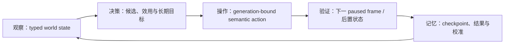

# CK3 自动游玩智能体：终极目标、当前能力与完整路线图

## 终极目标

构建一整套能够高智商游玩 CK3 的玩家智能体。它必须在 exact-build 原生桥之上长期、无人接管地反复完成：

最终智能体不是固定开局脚本，也不是若干命令的集合。它应覆盖当前 playset 中玩家可执行的全部主要玩法能力，能够处理
中断、并发目标、资源预算和不确定性；从开局选择开始，跨和平、战争、事件、家庭、统治与继承，完成自然统治者生命周期，
并在普通 campaign 模式跨继承继续。

## 冻结边界与本页口径

- 当前 exact build：CK3 `1.19.0.6`。
- `ck3.exe` SHA-256：`2D00FF3101EF70B566F2FCBAE292F09263199C80E9DC8F139B82D7D96F83DB86`。
- 本页盘点日期：2026-08-27；实现与验收合同盘点基线：runtime `8efa23f`（exact production bridge DLL 源提交仍为
  `51fe8cf`）。
- 能力明细以
  [`autonomous-capability-roadmap.md`](../ck3-native-ai/autonomous-capability-roadmap.md) 为施工账本，
  以 [`docs/ck3-native-ai/README.md`](../ck3-native-ai/README.md) 为原生 AI 证据索引。
- 本页只汇总已经有证据支持的状态。`static-ready`、`fixture-live`、`production-live primitive` 与
  `production-live loop` 不互相混写。

一个玩法域只有同时具备以下五层，才可以标为 `complete`：

1. 冻结 exact build 并梳理原生 AI 决策树，证据正文与 Mermaid 分支同步；
2. 决策输入由 typed native observation 提供，并在 paused production frame 验证 identity、generation 与真实值；
3. 操作使用有前置验证的 semantic command，并以新状态而非 ACK 判断成功；
4. planner 能比较多个合法候选，结合长期目标、机会成本、风险与不确定性；
5. production 实机完成完整 OODA，持续域还要通过 checkpoint 冷恢复与重复长跑。

截至本页盘点，没有理由宣称“全游戏自治”或“高智商 CK3 智能体”已经完成。

## 2026-09-03 天朝二期 P0：考核榜观测与动作门

考核榜第十八槽只读 state、provider-owned revision 和第二十二槽 exact semantic-activation transport 已静态接通，但正式动作
capability 仍为 `static-ready / production-live pending`。当前缺口不是更多 fixture，而是同一 paused 会话里的真实
source query → ACK → independent later query。独立只读后置验证器与默认关闭、且绝不自动晋级生产广告的候选诊断开关见
[`zhongguo-scoreboard-production-promotion-v1.md`](../ck3-native-ai/zhongguo-scoreboard-production-promotion-v1.md)。下一次允许占用 CK3 时应
单次启动批量覆盖 managed-capable、received-only、open、三种 switch、close 与两阶段 reopen；证据不齐时 capability、
`production_live_ready` 和二期首段 footage gate 全部继续保持 false。

2026-09-04 的启动恢复没有改变上述动作门：B1 effect 已在 generator 中按 41/36 个完整定义拆为两份，全部 77 个正文重组后与旧
495,777 B 单文件逐字节一致；正式 59-file 候选在 exact CK3 1.19.0.6 上以 245.770 秒通过主菜单、选角、开始、HUD、地图、暂停、
exact mount 与 game-state-ready 全部入口门。该结果只把 B1 提升为 `startup/full-entry production-candidate GREEN`；delayed-path、
seed、paused native snapshot、scoreboard action postcondition 与 8/8 footage 仍未完成。原单文件一次 1205.343 秒 RED 继续保留，现有
证据支持拆文件作为实证修复，但不把“文件过大”写成唯一根因。详情见
[`2026-09-03-vacation-handoff.md`](../handover/2026-09-03-vacation-handoff.md) 与
[`phase2-promo/README.md`](../phase2-promo/README.md)。

B1 的 `41 + 36` 是恢复期历史边界；从 B2 起，后续 effect 按用途/调用链分组，目标每文件 `1–10` 个、原则上不超过 `20` 个，
超限必须有理由与证据。后续加载性能 RED 按 [`testing-workflow.md`](../testing-workflow.md#加载性能-red先验证文件边界与单文件体量)
保留同条件文件边界 A/B。

B2 canonical generator 已按该规则完成 25 个用途分片：152/152 个顶层 effect 逐 block 字节一致，每片 `1–9` 个。其 Workforce
effect owner 也已从 `4,636,271 B / 324-effect` 单体改为 76 个用途分片；B2 所需 40 个 Workforce effect 可由 16 个完整分片精确
承载。Workforce 的 `168,729 B / 149-event` 单体随后拆为 35 个用途分片；B2 所需 19 个 Workforce event 是其中 7 个完整分片的
精确并集。

fresh no-stub r2 已在冻结 B1 的 59 文件上叠加 60 个精确 overlay 文件，物化为 119 files / 8,891,635 B；三 root 固定点为
71 effects / 28 events，selected events 总计 51，无旧单体、stub、重复或缺失符号。B2/Workforce 最大分片为 9；其余依赖中的
probation owner 为 15 effects。精确门禁口径是 B2 起的 60-file overlay：44 个 effect 文件 / 218 definitions，只有 probation
超过 10，overlay 中超过 20 为 0。119-file 整树继承冻结 B1 的 5 个 grandfathered 超 20 effect 文件：B1 part1=41、
part2=36、case_kernel=229、`zg361_effects`=26、`generated_mechanism`=1449；它们不是 B2 新增，且已有 B1 full-entry
证据。source/formal/file-list SHA 为
`F3B36DFDBE74827FF373B06C7C621D1EC72AA15E575F5ABBF1186E636C625184` /
`3DD3DA79F11EC892DF72024E25EE985ACAB26E21FD4C1281C35E5DEB0642C4D3` /
`6C3FE72E3FBB3E1AB6543BEE9226F24203D1063951999AAF6BD7E9053B7533FF`，projection/contract SHA 为
`2C8F0979113F75866191C3AE10C699F3801D83AEF91ADCFD9C4B526B469EAE28` /
`F5BC105C1C3EF8E55E82053F61D3B453E6B92A7E0AE224EDECBD072B6EF49180`。exact r2 随后在 164.781 秒完成 full-entry
GREEN：8 gates、3 markers、exact mount、material errors 0、`cleanup.ck3_running_after=false`。report/map SHA 为
`4DAAD3649E4FC37373EF2B95F9DE24FB15D23E1319403F37A89228E4B44674F1` /
`F867A24AE1267BA032BC8CDB2EE623A966FF8E7ED1AE9ED78251B115958F875C`。本轮没有加载性能 RED，故未做 A/B；readiness 现为
`startup/full-entry production-candidate GREEN`。随后 no-launch seed preflight 证明 fixed fixture 还要求 Incident
`zg361_ip_open_x_case_effect` 与 Workforce `zg361_we_open_portfolio_effect`，因此 B2 r2 不能直接进入 seed。

Incident 旧 `700,085 B / 124-effect` 与 `8,573 B / 54-event` aggregate 已按用途拆为 27/12 个分片；所有分片最多
7 个定义，124/124 与 54/54 顶层 block 逐字节一致，历史 aggregate SHA 为
`0C228FAABB5F6B7DCDABFD32A071CA82F0C1EF15C08AB0BD07C25AF3A467DACD` /
`49577D5475FBF6B22006021F4FADED2A248C7E193840A283FB043F7AAAC0E091`。X production 精确选择 11 个 effect 分片 /
47 个 Incident effects 与 4 个 event 分片 / 20 events；连同 case-kernel 后固定点为 `60 effects / 20 events / 6 triggers`。
用途分片与合同由 `df77ed636c51c51f99f534d8efbb559b94c639d2` 提交并推送。

exact r3 候选为 `_runtime/phase2-incident-x-production-closure-20260904-r3`，135 files / 9,158,442 B，formal tree SHA-256
`AF8F0DECE9477FDD60B6C96D0E09A27BFC9E55CEED40A9804B70ACB986D57A2D`。首次 r1 因默认 worktree 游戏路径不存在而在
0.338 秒 harness RED，CK3 未启动；r2 显式设置 `XAR_CK3_EXE` / `XAR_CK3_GAME_DIR` 后，在 exact CK3 1.19.0.6 上以
188.303 秒完成 8/8 gates、3/3 markers、exact mount、material errors 0 与 cleanup GREEN。artifact 为
`Z:\ck3_mod_rewrite_process_assets\zg361\phase2-incident-x-full-entry-20260904-r2`，report/map SHA 为
`1D41298B8987AA473304AE70FC53628639DE7700BBE5A9D7484A6BF76F566FE2` /
`F75097D9C20B610F81CA60837DF879865E26866F65AC76E7D40C1DF300C34B2A`。本轮同样没有加载性能 RED，不做追加 A/B；
Incident/X 仅提升为 `startup/full-entry production-candidate GREEN`，不代表 delayed-path 或 seed live。早先记录的
callable/event-only 中间计数漏掉 appointment + exit court-position definition 的 `on_court_position_*` native callbacks，
现已被 supersede，不再作为规模或施工依据。权威固定点为
`397 effects / 164 events / 6 triggers / 0 values / 2 court-position definitions`；相对 Incident/X r3 的 Workforce 增量为
`314 effects / 142 events / 0 triggers / 0 values / 2 court-position definitions`，新增 loc 为 `28 keys / 5 files`。
Manager 43-effect owner 增量仍为 0。最终 overlay/candidate 文件数待 renderer 与 mixed-owner 分片稳定后由 builder 生成。
下一施工项是只继续按用途物化 `zg361_we_open_portfolio_effect` 所需 Workforce owners、appointment/exit court-position owners
与 native callbacks；seed-capable exact candidate 通过 full-entry 后才运行 seed/paused-native。

## 2026-W35 最高优先级：先完整游玩一代人

所有者在 2026-08-27 09:47（Asia/Shanghai）明确把本周最高目标改为：**Agent 作为玩家，无人接管地完整游玩一局 CK3
的一代人过程**。本周 stage 的最低验收定义是：

1. 从一个固定、可复现的 production map-ready seed 和存活玩家角色开始；
2. 由 Agent 自己反复执行观察、决策、原生动作和后置验证，人工不代为点击游戏内容；
3. 事件、通知、人物互动、战争、暂停/推进与 checkpoint 恢复不能永久卡住主循环；
4. 持续运行到该玩家角色死亡；死亡后继续等待琉焰卿 Mod 的 committed settlement，记录其“人生分数”，并读取、处理和保存
   一代结算结果；
5. runner 保存全程动作/结果与能力债，进程和临时现场可回收，失败时能指出第一个真实 blocker。

这一 stage 不要求所有策略已是最优，也不要求一次覆盖所有政府、DLC、战争类型或 ruler。输入不完整时允许使用明确标记的
`degraded heuristic` 让合法游戏继续，并把缺失观测、选择理由与实际后置结果记账；不得用命令 ACK 冒充成功，也不得用人工
操作跨过 blocker。当前账本见 [`one-generation-blocker-ledger.md`](one-generation-blocker-ledger.md)。首次一代 GREEN 后，
再用重复 run、更多 seed 与原生决策树逐步替换这些降级策略。

normal-desktop 启动合同与历史双 profile handoff 见
[`one-generation-canary-handoff.md`](one-generation-canary-handoff.md)。当前 `xenoa / WinSta0\\Default` 已连续完成 strict runner、窄
`claim_cb` 白和、`pay_ransom` 回复、`NO_DECLARE` 续跑与 checkpoint 冷恢复，旧 sandbox desktop 不再是当前 blocker。两轮真实
pause RED 证明一次 fresh retry 与 public-CAS convergence 都可能被 speed-five revision stream 饿死；exact DLL `51fe8cf` 又证明
`pause-map` 本身 fresh-read 并幂等提交，不消费该 public gate。`8efa23f` 只移除 composite `_pause_life_advance` 的冗余预检，
direct/query/其它 action 合同不变；正式 run 已从 `578B0289...5C38` cold restore 越过旧边界并持续生成 checkpoint，故
`GEN-012` 已 production-live 关闭。

G1 已于 2026-08-30 正式 GREEN。最终 run `20260830T070223Z-one-generation-1f934571` 从
`0DF9CB66...69C` 冷恢复 CharacterID `29829` / episode `native-29829-ee172aa720db`，完成 `155/155` turns；角色自然终止后继续
等待到琉焰卿 committed settlement，权威人生分数为 `14.8`，三处 score 一致。全部 qualification gates 与 cleanup 全绿，
`first_blocker=null`。这是固定 production seed 的首次完整一生闭环，不外推为普通 campaign 跨继承或全游戏自治。

随后 G2 前探在同一 recovery checkpoint 形成两份 GEN-032 capability RED，并由第三次实机闭环：玩家身份可以在 native
tactical sentinel 正常 stop 前从 episode CharacterID 切到继承人；同一 bridge/connection/episode/current-player/terminal reason
的 one-life terminal 在显式 pause 服务期间是单调边界，允许日期前进，但 event/pending interaction 仍要求原 exact-date identity。
GREEN attempt 为 `20260830T073735Z-g2-terminal-boundary-date-drift-retry`：`10/10` turns、`1` terminal、settlement/cleanup
全绿。该结果只关闭 GEN-032；runner 在 `episode_complete` 返回，没有执行 `start-next-episode`，故完整 G2 仍未完成。

随后严格 `native-next-episode` runner 从死亡前 durable checkpoint 正式闭合 GEN-009。attempt 01
`20260830T101417Z-next-episode-1f7afbf7` 暴露同一 one-life terminal 在显式暂停期间可从“死亡角色帧”演化为“继承人已接管帧”；
最小修复只保留 bridge/connection/episode owner pins，不再要求这个终局表面像普通 event identity 一样完全不变。attempt 02
`20260830T102101Z-next-episode-77c4006e` 因并行 ZhongGuo 验收持有全局 CK3 lock 在 0 turn 退出，是保留的 harness RED。
attempt 03 `20260830T102401Z-next-episode-23c58fa1` 为 `7/7` turns、`next_episode_checkpointed / qualified`：旧 PID
`57484` 终局后以 `start-next-episode` 重启为 PID `33200`，connection generation `1→2`，逐字节载入 immutable seed
`E3B4A97D...C5D91`，得到新 run ID `native-29829-fffa4ba935f6`，完成一次可见 gameplay，并在 `date_raw=53211576`
保存绑定该新 run ID 的 checkpoint `BB4CD2B5...DC235`。全部 15 项 gate 与 managed cleanup 为 GREEN，`first_blocker=null`。
这是首个固定 seed 的 G2 跨 episode production-live loop；尚不证明第二个完整寿命或跨不同 seed 的泛化。

第二寿命随后由多个保留 attempt 沿 durable checkpoint 连续推进；最终 run
`20260830T182851Z-next-episode-19d679de` 从 `history=2181 / date_raw=53295288 / SHA-256 816B8B02...6D26`
cold resume，完成 `472/472` turns（310 query、160 gameplay、151 checkpoint、1 terminal、1 recovery）。turn 468 的原生
sentinel 在没有 `die`、控制台或人工死亡动作的自然时间推进中，于 `53319720→53319768` 观察
`played_character_changed` 并暂停；turn 469 完成 matching settlement，turn 470 以
`start-next-episode` 把 PID `72636→39036`、connection generation `1→2`、run ID
`native-29829-fffa4ba935f6→native-29829-6e06850de2a3`，逐字节重载 immutable seed；turn 472 在新 episode
推进一天并保存 `history=4 / date_raw=53211576 / SHA-256 56C00CDC...408E`。15 项 qualification gate、managed cleanup
与 process-tree 清空均 GREEN，`first_blocker=null`。这完成同一冻结 seed 的第二个完整寿命和再次跨局，不外推为不同
seed/ruler/government/DLC 或普通 campaign 继承。

历史主线 `7a89c58`、`4b82d5b`、`e23abe2`、`0848d61`、`726a1c0`、`75c67d2`、`aff784d`、`3bd8934`、
`8efa23f` 均已 push；本轮施工起点 `origin/master` 为 `f41c12a`，G1/GEN-032 的 scoped delivery 在本轮收口推送。其中
`726a1c0` 冻结最终结算合同：自然死亡后必须等琉焰卿 committed scoring；
`terminal-settlement.json.one_life_settlement.final_score` 是权威“人生分数”，且须与顶层 `score`、
`recorded_episode.score` 完全相等。

原生 AI 研究前置保持不变：遇到相关玩法，先冻结并落盘 exact-build 原版决策树、输入和 unknown 分支；完成这一步后，我方不必立刻复制
整棵树，可以选择足以继续游戏的最小实现。原生树中尚未采用的输入/分支必须作为可追踪能力债记录，后续以 production outcome
决定替换和校准顺序。

## 已经完成或真实可用的能力

下表列的是已闭合的基础或窄里程碑，不把部分闭环扩义成整个玩法域完成。

| 能力 | 当前证据等级 | 已经能做什么 | 仍不能据此声称什么 |
|---|---|---|---|
| exact-build 会话与时间 | `production-live primitive` | 识别地图就绪、玩家与日期；暂停、速度和有界时间推进；最小化窗口运行。 | 不代表会选择长期目标。 |
| checkpoint / 冷恢复 / 进程回收 | `production-live loop` | 保存、冷恢复、校验日期/角色/history anchor，并维持 managed cleanup。 | 不代表恢复后所有高层 intent 已重建。 |
| 既有战争的基础移动与围城 | `production-live loop`（部分场景） | 集结、路线 preview、移动、split/merge 恢复、目标/围城观察及一日节拍控制。 | 不代表任意战争都能自主打到终局，也不包含完整补给、海运或多军团调度。 |
| route-contact 与实际接敌 identity | `production-live loop`（create-new） | 预测接触日，读取真实 CombatID、Province 和双方 stored order；战中 checkpoint 冷恢复后可复查。 | `join_existing`、多个 compatible combats 和通用接战策略仍未闭合。 |
| ongoing battle observation / hold | `production-live loop` | 读取 phase/day、双方军队、current/soft/hard ledger，并做 bounded one-day hold 后同 CombatID 复查。 | 还没有校准胜率或 Monte Carlo 决策。 |
| active retreat | `production-live loop`（full-side 与 owner-subset） | 读取 day-15 legality，绑定目标路线 token，执行玩家军队撤退并验证旧 CombatID/双方后置状态。 | 不代表已闭合原生 AI 的通用撤退目的地评分或所有战斗策略。 |
| reinforcement assignment observation | `production-live primitive` | 读取 asking、AI parent stored order、route 和 active CombatID；见过 owner-subset 后 membership reopen。 | assigned+aligned ETA、真实 join 和改派动作仍未完成。 |
| battle terminal | `production-live primitive/loop`（normal 分支） | 通过 journals/query 识别 normal terminal、旧 CombatID 删除、战分和玩家 retreat。 | no-normal、residual、assignment-reopened 分支尚未 live，aggregate readiness 仍为 false。 |
| 窄 `claim_cb` white-peace termination | `production-live loop` | 当前 primary-attacker 场景已按 options → v1 claim terms → literal offer 提交，AI 异步响应后旧 WarID 消失；残军解散、即时 checkpoint、冷恢复与继续推进均已实走。 | 不是完整 v2/campaign 战争退出；其它 CB/角色、holy war、surrender、victory/defeat 与完整 outcome utility 仍未闭合。 |
| pending character interaction | typed query `production-live primitive`；`pay_ransom` degraded reply `production-live loop` | 读取 stable kind、五 roles、routing、deadline、send options 与四路 legality；exact `pay_ransom_interaction` 已完成 typed query→reject→旧 full ID 消失→时间推进/checkpoint，100% enforce-demands 始终优先。 | reject-first 不是赎金语义最优或原生等价；`spar`/unique-accept、其它 stock definition、intermediary/notification live 与 structured terms/effects 仍缺。 |
| auto-accept notification ACK | `fixture-live` | 非宗教 definition-only fixture 中完成 query/query/ACK/旧 full ID 消失。 | 不是 stock/production-only 语义证据，自然 stock 与 intermediary 仍待验。 |
| campaign root 与 loaded feature manifest | `production-live primitive` | 读取玩家主头衔/tier、capital、liege、government/rules，以及当前进程 feature registry/runtime keys。 | 开局选择、全部政府/DLC 场景和 entitlement provenance 尚未完成。 |
| 婚姻关系与最小候选动作 | `implemented`，部分结果 live | 读取配偶/婚约关系，枚举合法 CharacterID 候选并提交、等待关系结果。 | 当前仍可能选择首个候选，不是智能婚姻策略。 |
| 一代结算 | `production-live loop`（固定 G1 episode） | 自然死亡后等待 matching committed settlement；本次实读 `ready=true / commit_serial=1 / source=29829`，三处人生分数均为 `14.8`，record persistence 与零继承人 gameplay 全绿。 | 普通 campaign 跨继承与更多 seed 尚未完成。 |
| 一代人严格 runner | `production-live loop`（G1 qualified） | 从归档 exact cold seed 持续 OODA 到自然死亡、Mod committed settlement 和 managed cleanup；最终 run 为 `155/155` turns、`53` gameplay、`15` checkpoints、`1` terminal。 | 只完成一个固定 production seed；跨继承 G2、更多 ruler/government/DLC 与通用高质量策略仍未完成。 |
| tactical sentinel 的 one-life terminal | `production-live loop`（GEN-032 resolved） | native stop 前发生玩家死亡/切换时，稳定同 episode terminal、显式暂停、执行 `death-terminal` 并观察 settlement；attempt 03 为 `10/10`。 | 不证明 `start-next-episode`、新 episode gameplay 或完整 G2。 |
| 跨 episode 生命周期 | `production-live loop`（固定 seed G2 全寿命重复门） | 首次跨局后又完整游玩第二寿命至自然 terminal/匹配结算，再次 `start-next-episode`；两次均由新 PID/connection 精确重载 immutable seed、生成新 run ID、完成 gameplay 并保存绑定新 episode 的 checkpoint。 | 只覆盖同一冻结 seed/角色的两次 episode；不证明不同角色、政府、DLC、普通 campaign 继承或长期多样化自治。 |

已有 managed war run 的已记录量化里程碑为 `210/210` 成功回合、78 个可见 gameplay 回合和 75 个游戏日；这是既有战争
checkpoint 的稳定性证据，不是全游戏覆盖率。

最终 strict one-generation report 已 finalized：`status=episode_complete / outcome=qualified / ok=true`；report SHA-256
`FF689E88...EFB3`，terminal sidecar SHA-256 `D26744BF...850E`。G1、GEN-032、首个 GEN-009 跨局门与第二寿命重复门均已完成。
第二寿命最终 report SHA-256 为 `2D798DAB...C4DD`，terminal sidecar 为 `C72C3A11...667A`，next-episode sidecar 为
`BB570624...33A3`。

当前受管 state 的 `xar_episode_seed.ck3` 为 `76,980,533` bytes、SHA-256 `E3B4A97D...C5D91`，metadata 绑定
`date_raw=53211552 / CharacterID=29829`；该 exact seed 已在新 PID 上实读重绑并推进至 `53211576` 的新 episode checkpoint。
余下债务转为不同 seed/ruler/government/DLC 的 G2 重复矩阵与 G3 broadened，不再把第二个完整寿命或 GEN-009 写成未实测。

## 当前事件能力的精确状态

事件会中断几乎所有长期循环，因此当前优先闭合 `current-event-window-context-v1`：

- 生产实现已经静态发布 canonical event key、process-local calculated ID/runtime ordinal、实际物化的 shown/enabled/name/reason、
  authored native index、fallback/cancel，以及有损的 played-character trait/stress/death/scheme/unknown indicator 子集。
- `CEventWindowData+0x2C` 已纠正为 timeout index；cancel 从 authored `CEventOption+0x47A` 逐项读取，允许多个 cancel。
- indicator 空 rows 只表示该有损 GUI 子集为空，不能推导“选项没有效果”。resource/relationship delta、scope identity、完整性信号和
  full effect preview 仍 unavailable。
- Attempt1 是路径 harness RED；Attempt2 是旧 cancel ABI capability RED；Attempt3 已证明 cancel/空 indicators/readiness 在 seed 与
  cold 都正确，但因 runner 把 process-local 两个数值误当跨进程 identity 而保持 immutable RED。
- 2026-08-27 的修正合同 Attempt4 已整体 GREEN：seed PID `22976` 与 fresh-cold PID `43140` 跨 checkpoint 保持
  full instance `17`、canonical key 和三条 materialized option 一致，native index `3` 真实 `cancel=true`，cold 双查询严格
  相等。artifact SHA-256 为 `690EB5EA188B0903281E5F5DFDA343DA795117EE0FB1C83C3FCDC7F572170B7B`。
- 因此 current-window read-only query、definition identity、presentation/cancel 与 empty-indicator surface 升级为
  `fixture-live`。后继非空 fixture 又实读了 `trait/add brave`、`stress/increase`（`affected=false`、
  `critical=false`）与 `death/played_character` backing rows。`readiness.semantic_decision_ready` 仍为 false；stock
  events、其余 indicator 分支与视觉图标、selection lifecycle、scopes 与完整 effects 仍未完成。

## 还没有完成的主要能力

以下能力不能由现有窄接口代替：完整事件效果与多选语义；通用经济/domain/building；council/lifestyle；军备、补给、损耗、
海运与 raid；智能宣战、盟友与多战争；婚姻/教育/继承/王朝；外交、封臣、契约与派系；谋略、秘密与 hooks；囚犯、犯罪与
tyranny；健康、压力与生育；法律、政府、文化、创新与非宗教决议；活动、旅行、宫廷、宝物、勋号及各 enabled DLC/government；
通用世界发现；跨域长期目标、预算、学习与跨继承记忆。

视觉 fallback 中已有的经济、内阁、婚姻、继承和巴勒莫战争流程主要绑定 1066 罗贝尔固定场景，只能保留为 regression fixture，
不能记为通用能力。

## 全部后续工作

下面是完整工作包；每一包都按“原生 AI 树 → typed observation → semantic action → planner policy → production OODA”施工。

### F0：通用发现、开局与 feature manifest

- 枚举 bookmark、ruler、game rules、难度、政府与 enabled features，进入地图后验证实际设置。
- 扩展通用 character/title/province/realm 搜索与关系图，避免各剧本重复发明发现逻辑。
- 补非 duchy、非 feudal、landless、legal-absent、installed-but-disabled/offline-store/cold-restore 矩阵。

### P1：真实战斗 controller 收口

- 完成 `join_existing`、multiple-compatible combat、动态 join/leave 与同日顺序。
- 构造三同侧 CUnit fixture，闭合 assigned reinforcement、aligned ETA、真实 join、改派与后置验证。
- 覆盖 no-normal、same-Province residual、assignment-reopened/AI re-entry terminal。
- 闭合 loaded phase-event/effect feedback/original trace，输出有校准边界的胜率与损失分布。
- 让 planner 比较接战、绕行、等援、撤退和牺牲阻滞，并与真实结果对账。

### P2：从既有战争打到合法终局

- 补 score breakdown/ticking、occupation、participants、盟友 ETA、财政 runway、补给/损耗、完整 objective 与 exit terms。
- GEN-004 的最窄 `claim_cb` white-peace 已在 normal desktop 完成 final response、options → v1 terms → offer、AI 异步应用、
  WarID 消失、残军解散、保存与冷恢复；继续以 production outcome 扩其它 CB/角色及未采用的 v2/campaign 输入。
- 实机验收 raise、assault start/stop、disband、enforce；继续扩展其它 CB 的 white peace 与独立 surrender surface。
- 增加 call ally、rally、embark、reassignment、mercenary 等动作和后置状态。
- 从 active-war checkpoint 无人工输入走到 victory/white peace/surrender，处理战后、保存并冷恢复。

### P3：事件、通知与人物互动语义

- Attempt4 已闭合 current-window identity/presentation/empty-indicator transport；继续补 stable root/saved scope identity、
  resource/relationship/health/character/title/war delta 与 completeness。
- 发布足以区分长期后果的 structured effect/terms，并把原生 AI raw weight 仅作为先验，不冒充玩家效用。
- 覆盖多页事件、letter、toast、普通请求、auto-accept、intermediary 与 deadline。
- planner 对多个合法选项按长期目标评分；production 长跑连续处理至少 50 个不同 key，零固定首项、零默认接受。

### P4：和平期经济、domain、council 与军备

- 建立 economy/building、council/development、military-preparation 原生 AI 树。
- 读取资源及收支、holdings/buildings/construction、control/development、council/tasks、MAA/levy/knights/commanders/mercenaries。
- 实现建设、council、lifestyle/perk、MAA、knight/commander 与雇佣兵动作。
- 完成至少十年生产自治，并用积累的军备完成一战。

### P5：智能宣战、联盟与多战争

- 完整比较所有合法 CB、目标 title 价值、成本、双方 reserve、盟友接受/ETA、其它战争、truce、faction 与 succession 风险。
- 实现 declare、call/join/offer war 及可验证 participant 后置状态。
- planner 能在至少五个候选中选择目标/CB，也能选择“现在不打”，并处理进攻、防御、盟友与同时两战。
- 圣战/大圣战只读取战争 OODA 必需的原生合法性、目标、费用、参战与结束结果；faith 保持 opaque/minimal。

### P6：家庭、婚姻、教育、继承与王朝

- 梳理婚姻/联盟、教育/guardian、继承/title planning 原生树。
- 读取家族、继承序列、titles/laws/claims、年龄、属性、traits、health/fertility、联盟价值、接受度与 partition 风险。
- 实现婚姻、教育、title grant/create/destroy/usurp、继承修复和合法的 dynasty 资源动作。
- 让婚姻从“首个合法 ID”升级为联合评分，并验证死亡后的 title distribution；普通 campaign 跨继承继续。
- 只有婚姻合法性、接受度、费用或结果确实依赖信仰时，调用最小原生最终判定/原因。

### P7：外交、封臣、契约、派系与叛乱

- 读取 opinion breakdown、relations、alliances、truce、hooks、vassal contracts、faction power/discontent 与 realm stability。
- 实现 gift/sway/befriend、contract、grant/revoke/transfer、council appeasement 与 faction response。
- 对真实强派系比较让步、分化、结盟、威慑和镇压，验证意见、财政与权力后置状态。

### P8：谋略、秘密、囚犯、犯罪、健康与压力

- 建立 scheme/secret、prisoner/crime、health/stress 原生 AI 树。
- 读取 scheme progress/secrecy/agents、hooks/secrets、crime/tyranny、prisoners/ransom、disease/stress/death risk。
- 实现 scheme、blackmail/expose、imprison/release/ransom/punish、physician/treatment/stress decisions。
- 完成 hostile/personal scheme、囚犯处置和疾病/高压力三类 production OODA。

### P9：法律、政府、文化、创新与非宗教决议

- 建立 laws/government、culture/innovations、decisions 原生树。
- 读取 authority/laws/succession law、culture/traditions/acceptance、innovations 和非宗教 decision eligibility/cost/effect。
- 实现 law/authority、culture/fascination 与非宗教 major decision，并跨年验证长期效果。
- 通用 faith/doctrine/tenet/fervor、改宗、宗教改革及 holy order 继续 owner-deferred，不计完成。

### P10：活动、旅行、宫廷、宝物、勋号与 DLC/government packs

- 按 loaded feature manifest 分别施工 activities/travel、royal court/artifacts、accolades，以及 administrative、clan、tribal、
  nomad、landless/adventurer、regency/diarchy、plague、legend 等当前启用系统。
- 每个 enabled feature 至少完成一个 production OODA；未启用项明确记为 `not_present`，既不算失败也不算支持。

### P11：长期世界模型、目标调度与整局验收

- 建立 canonical world state、变化历史、预算、deadline、多目标依赖和 outcome calibration。
- 统一 semantic action registry；checkpoint 后重建 intent，避免重复不可逆动作。
- 实现生存/继承、战争/稳定、经济增长、王朝/制度的层次化规划及反事实比较。
- 完成整局矩阵：自然一代结算、普通 campaign 跨继承、伯爵/公爵/国王、进攻/防御/内战/盟友战争、十年和平后战争、
  至少两种政府、全部 enabled feature 代表场景，以及冷恢复后继续相同高层计划。

## 当前执行顺序

截至 2026-08-30，最近的施工队列是：

1. 冻结并保留 G1 `1f934571` 的 qualified report、terminal sidecar 与人生分数 `14.8`；不重复同 seed canary；
2. 保留 GEN-032 attempts 01/02 RED 与 attempt 03 GREEN；该 blocker 已关闭，不重复同 checkpoint 验证；
3. 冻结 GEN-009 的 capability RED、并发锁 harness RED 与 G2 GREEN；不重复同 seed 的同一跨局 gate；
4. 选择新 seed/ruler 扩展 G2 重复矩阵；同一冻结 seed 的第二完整寿命已关闭，不再重复；若出现新的真实 B0/B1，保留 artifact，先更新对应
   exact-build 原生树，再做最小合法 blocker-removal；
5. 完整 effects、reinforcement/join、terminal 剩余分支、forecast、智能宣战及 P4–P10 通用玩法域若未成为真实 blocker，继续按
   B2/B3 账本排序，不以重复审计取代可见玩法与完整 OODA。

真实 run 出现更高优先级的观测阻点时，可以调整相邻工作包，但不得通过重复返回 `unknown/unavailable` 代替补观测口。

## 宗教域暂缓边界

在项目所有者明确通知“可以开始宗教相关内容”之前：

- 不深入研究或实现通用 faith/doctrine/tenet/fervor、改宗、宗教改革、宗教专用 AI、bridge、策略或实机矩阵；
- holy order 继续暂缓；
- 只允许两项窄例外：完整战争 OODA 所必需的圣战/大圣战输入与动作；婚姻确实依赖信仰时的最小原生判定；
- 两类例外优先消费原生最终 legality/acceptance/result/reason，faith/religion 只保留 opaque identity 或直接必要输入；
- 暂缓不等于完成。解除暂缓后，通用宗教域仍须补齐五层完成门与整局矩阵。
