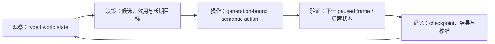

# CK3 自动游玩智能体：终极目标、当前能力与完整路线图

## 10-03 09:29 固定3798日：原婚约兑现与新原生输入边界

2026-10-03T09:29:27+08:00 Asia/Shanghai真实补录：已发布3664截点后新增 **134保存日＝94恢复保存＋2部分完成＋8正常完成＋30正常完成**，当前原Robert **3798/36524**、resume **645保存日**、10-03 **550保存日**。raw **53235480**，最新配对save **4534**，v31 cold full **4535**。actor29829 / episode `native-29829-2bc2d599f7f9` / typed dynasty_continuity reconciled_successions **0**。G2 **5/8**、NW **2/4**；原M2/M5/NW-FAMILY/NW-LIFE complete和机器percent_reporting_allowed=false保持。婚姻与新宗教只读输入具备实际价值，不另记全项完成或把cold额外算游戏日。

原首继承人 **38822↔38718 / recipient32897** 已由独立registered reader确认双向婚姻：v28PID24044/raw53234520/native146，primary_spouse38718、spouse_ids[38718]、betrothednull、bilateral_verified=true。后继正常typed marriage consumer已实际消费；v30newPID57484/native9 existing fulfillment cold **marriage/materialtrue/fulfilltrue**接续原source53234520/pre139。这是原首继承人pair，**不是Guy38988↔37689/recipient37685**。Guy仍原cold betrothal/materialtrue/verifiedtrue，实际alliance not_allied双方false；未查询首继承人联盟，不能借Guy的结果。没有新Family submit，不重计通知0日或增加原globalM5/NW-FAMILY信用，也不追加候选数/成年门禁。[独立双边首继承婚姻](Z:/ck3_mod_rewrite/artifacts/g2-maintainer-2026-10-02/resume-12003/m5-family/v28-first-heir-natural-marriage-01/REPORT-FIELDS.json)；[v30三条原Family正式消费](Z:/ck3_mod_rewrite/artifacts/g2-maintainer-2026-10-02/resume-12003/m5-family/v30-family-existing-consumption-01/REPORT-FIELDS.json)。

v29同原player context query的一次actual已发布三个独立 **production-live primitives**，原PID120436/source-native-envd1b5b4c5/raw53234568、epoch17985/native4/public2：pilgrimage **CanPlan=true**；confession shownfalse/finalfalse、affordabletrue、generic声明cost0；theocratic lease gold月收入 **current21165/max70554/Q100000＝0.21165/0.70554**。该一次Root query不按3leaf加查询数、天数或动作；CanPlan不是selected trip/CanStart/报价/ETA，本query未提供这些字段不能断言没有trip；最大−当前不是实际收入提升，也不能反推opinion/share/rule。没有朝圣/告解paid或完整religion loop，Catholic身份及旧SF5/58.333%按原源帧保持。[三sibling actual统一字段](Z:/ck3_mod_rewrite/artifacts/g2-maintainer-2026-10-02/resume-12003/m6-law/religion-pilgrimage-next-inputs-12003/actual-v29/REPORT-FIELDS.json)；[church实际最终月值](Z:/ck3_mod_rewrite/artifacts/g2-maintainer-2026-10-02/resume-12003/religion-church-income-12003/actual-v29-church-income-01/REPORT-FIELDS.json)。

Head-of-faith gold输入：v30 actual partial的amountnull/读取故障保留，唯一生产复现与最小named-value helper binding修复后，v31原paused实机独立完整readonly query已available=true、recipient29097、raw quote5833566/Q100000＝58.33566金币；shown=false/CanSend=false为真实negative legality，不能叫工具unavailable，也不能当申请或到账。当前PID97992/raw53235480/epoch16267/native4/public2/source-native-envdb463118。该输入升级production-live readonly primitive，没有请求/paid、收益或结果loop；原partial失败、修复测试、当前negative观测分别保留，不把当前合法拒绝外推为所有目标永久不可用。[Root已确认的HoF与本阶段字段](Z:/ck3_mod_rewrite/artifacts/g2-maintainer-2026-10-02/resume-12003/religion-head-of-faith-gold-12003/ACTUAL-V31-RECOVERY/REPORT-FIELDS.json)。

原native只读树、真实quote及合法negative输入已解锁下一决策；CanPlan不等于selectedtrip/CanStart/quote/ETA，church最大值差不等于增益，HoF报价不等于申请/到账。首继承婚姻是当前campaign玩家价值，不重复加globalM5/NWFAMILY完成数，也不把notification click当婚姻创建。新134日含failed94恢复及partial2，不能称整100/7请求完成。原八visible outcomes/5of8/NW2of4/percentfalse保持；M7自然继承0与3798保存天数分别列。

全域宗教研究用户ban已撤销、public6443a516的全面授权保持，不再大扫或恢复旧例外限制。新holy-order researchtopic/recipe已交、后继实际implementation待办；church有效tax/type与朝圣headless draft 仍source/research施工，未作为本stage完成项或要求打开planner。原Feast83886111活动子项loop与具名modifier有效，整体M6原scheme/useful outcome待真实结果；NW-LIFE TaxMan原及时合同完成与FAMILY原完成保持，G2-M4经济/其它原可见结果和M7自然跨继承主线未完成，自然继承0独立于本550天。唯一Robert ordinary/xar_off原episode、nonwar执行/war研究停止、玩家限定与最小化/no OS或Steam焦点、Root独占game/SDK/pipe/state/Git保持。 下一从最新sameactor配对继续普通循环，保留已成立的首继承婚姻与Guy婚约原consumer，仅当实际需要才独立采首继承联盟；宗教readonly条件与quote只用于下一真实价值决策，不强制付费动作。headless朝圣与church rule/type补同query，保留HoF旧partial失败及新quote观测边界；Sway原实例继续观测，不从进度推收益或重复Start。本3798固定截点一次提交，不等下个普通窗或v32施工。 [日报](daily/2026-10-03.md)保留完整runtime证据及失败边界。只本中央5更新，不争写原native专题/索引或他人视频。

## 10-03 07:53 原Robert3664日，神职final与Swayphase可观测

2026-10-03T07:53:26+08:00 Asia/Shanghai真实补录：上次3526阶段已经正常发布，此次新增 **138保存日＝v27后继37＋v28正常101**，原Robert累计 **3664/36524**、resume **511保存日**、10-03 **416保存日**。最终saved **raw53232264 / full4389**，同actor29829/episode `native-29829-2bc2d599f7f9`、typed dynasty_continuity reconciled_successions **0**。G2 **5/8＝62.5%**、NW **2/4＝50%**，原M2/M5/NW-FAMILY与NW-LIFE complete保持；机器percent_reporting_allowed=false不改变，神职只读与隐藏Sway阶段来源不增加整项完成数。

当前court chaplain **56513 / task7162** 在v28同PID24044/actor29829/raw53229840/public2/native5实际query **available=true / failure=none / valid_position=true / valid_character=true**，native **CanReassign=false** 与独立 **native_can_fire=false** 均已读到，false不是missing/null/unavailable。action_eligibility_complete=false；此查询解锁 **production-live readonly primitive**，没有任免、改task、收益或完整loop。currentlearning9、eligible集合五项[0,0,3,1,6]仅当帧观测，不能当所有任命final合法，也不能用CanReassign推导CanFire或制度原因。初11923 exit1/calls0为SDK全history snapshot harnessRED，保留原attempt；最小finite-02 2registered readonly calls实际GREEN/exit0/9.51s，未因harness故障修改native判定或重跑旧矩阵。[唯一神职actual字段](Z:/ck3_mod_rewrite/artifacts/g2-maintainer-2026-10-02/resume-12003/religion-clergy-12003/can-fire-leaf/actual-v28-current-can-fire-preparation-01/ACTUAL-REPORT-FIELDS.json)。

原Sway **134217986/gen8 / 29829→34333** 在v27预停首次得到真实隐藏阶段来源：execution ring actualseq **1**、recorddate **53228472**、hidden_phase_failure_source / `sway_outcome.0002` / phase_result=failure，exact scope/executing input=true；material/wholeterminal/message_enqueue=false，execution cursor1/no gap，其余rings0/empty。这是 **production-live phase-source observation**，并非收益、方案终态或新事件消费。预停PID64876/native100/raw53229840与新v28PID24044/native3同full/target exactjoin，CanContinue=true/chance55%；新PID三rings已attached/cursor0/empty/no gap，旧seq1记录独立保存，跨epoch不直接比revision。旧20/353/op−9仍明确date53228952/native83来源，不以其后normal101推current进度。[Swaypre-stop与v28cold正式joined](Z:/ck3_mod_rewrite/artifacts/g2-maintainer-2026-10-02/resume-12003/m4-sway/robert-v27-prestop-v28-cold-01/REPORT-FIELDS-20261003.json)。

正常101后Root唯一2-query actual已独立读到同原scheme full134217986/gen8、target34333：v28/PID24044/raw53232264/native44/public2，fresh progress158/goal353、总opinion−9、owned active1、exposedfalse/frozenfalse；专属Sway与blocker均observed但合法absence/null、terminal/cancelfalse。这个158来自实读，不是把clock101天累加旧progress；旧hiddenphasefailure@53228472仍是独立来源，不能用这些值证明新的phase/reset发生，也不能把总opinion归因Sway。当前完整Sway收益及wholeterminal仍pending，没有新Start/ring刷新或完成信用。[正常101后Sway有限实际材料](Z:/ck3_mod_rewrite/artifacts/g2-maintainer-2026-10-02/resume-12003/m4-sway/robert-v28-first-next-material-after-normal101-01/REPORT-FIELDS-20261003.json)。

后台宗教工作继续按原生树先行：doctrine/confession、church income、devotion/virtues、fervor/county 四份专题已research交付，新增provider/live/actions/days/G2信用0。conversion scheduler窄研究已区分 1CFC310是script CAvailableRiteListBuilder，并未证明AI scheduler，5C68824 LEA数字消费者仍未闭；历史v27 fulfillment5使stock stress动机false，不冒新帧或AI最终资格。下一CanPlan/confession/church-income独立leaf并行implementation尚未完成，不标static-ready或live；不等待这些futuresource阻止本3664阶段提交。[conversion scheduler research](Z:/ck3_mod_rewrite/artifacts/g2-maintainer-2026-10-02/resume-12003/religion-conversion-12003/scheduler-next-entry-01/REPORT-FIELDS.json)。

下一在最新sameepisode配对继续普通循环，使用已实际读取的神职final与Sway phase-source做后续决策输入；没有完整eligibility时补决策真正依赖的同query输入，不以false观测假设制度原因，不强制任免。宗教新leaf按具体树/真实paused输入推进，Sway原scheme继续追踪，剩余M4/M6/M7按原合同，不追加公共门禁。本阶段按3664/full4389立即发布，后继正常/源码/研究新增量另stage。 原神职空值缺口已被真实negative值解除，不等于任免/任务收益loop；隐藏phasefailure是真实输入而不是wholeterminal。整体G2与NW分母/完成数、原八visible outcomes及percentfalse不改。详情见[日报](daily/2026-10-03.md)；原native专题由原owner维护，本stage仅中央5。

## 10-03 07:02 133日已保存，宗教预览从缺口进入实际final输入

2026-10-03T07:02:55+08:00 Asia/Shanghai真实滚动补录：上个3393/full4299阶段已经Root正常发布；本阶段另计 **133保存日＝v26后继33＋v27正常100**，最新原Robert **3526/36524**、resume **373保存日**、10-03 **278保存日**，saved raw **53228952 / full4357**。actor29829、原episode `native-29829-2bc2d599f7f9`、typed dynasty_continuity reconciled_successions **0**。G2 **5/8＝62.5%**、NW **2/4＝50%**保持；NW-LIFE原timely合同与原NW-FAMILY/globalM2/M5 complete不回退，机器percent_reporting_allowed=false不改变。没有以三个宗教readonly primitive升级整体宗教OODA或M6。

v26后继窗口exit0、4个life-advance、无modal，实际保存33日到raw53226552/full4308；v27随后正常窗 **exit0、实际100日、无modal**，同PID64876/source-native-env `f30579bf6405e183192c96ea6b9bc35dddd11eec`，保存到raw53228952/full4357。后者最新save **88,439,522B / SHA `13975cb88e26e499847874d79edcfdce3ad2186e9b82d7a5ae909f028599e7a8`**，driver **52,288,988B / SHA `a25a4894989c9f0fbae8c41455e26a00879bb36f9f9fd9b48914c2361302e63f`**。原33日仅此前外置queue、没有包含在3393阶段，现与100日各入账一次；owner解析/readonly/cold不另加日数。[原33日闭包](Z:/ck3_mod_rewrite/artifacts/g2-maintainer-2026-10-02/resume-12003/m7-robert/v26-next-normal30-awaiting-v27-01/result.json)；[v27正常100日闭包](Z:/ck3_mod_rewrite/artifacts/g2-maintainer-2026-10-02/resume-12003/m7-robert/v27-religion-read-following-normal100-01/result.json)。

Holy-order loan现MCP v27 actual **available=true/read_only**，升级为 **production-live primitive**；v25 scalar RED和v26 decision RED保留历史，但不再作为当前loan读取阻点。同paused53226552/native3/public2原Robert：真实quote **30000000/Q100000＝300金币**；borrow **shown=false/can_take=false/affordable=true**，真实四资源报价只有 **50虔诚**；repay **shown=false/can_take=true/affordable=true**，声明报价全0。两决议当前均隐藏，因此都不可执行，没有borrow/repay、付费、财务收益或完整loop；隐藏repay的can_take=true不能当债务证据，零声明费用不能当免费还债effect。owed/holder/borrower-years当前合法absent；因为没有holder，lender-years与holder-resolution不适用且未调用，不能写lender不存在/已删除或已观察其年数。[唯一loan actual compact](Z:/ck3_mod_rewrite/artifacts/g2-maintainer-2026-10-02/resume-12003/religion-holy-order-loan-12003/ACTUAL-V27-OBSERVED/OBSERVED-COMPACT.json)。

Mystical communion同既有religion query的fixed-key native final terms已实机闭合为 **production-live primitive**：v27 native3/public2/raw53226552，shown=false、canTake=false、affordable=true，gold/treasury/prestige均0，piety **10000000/Q100000＝100**；原生完整generic requirement原文可用。没有把generic原文猜成具体失败条件，没有paid/action/策略loop；旧context/progress仍独立available，Catholic/SF5/58.333%保留此cold源帧，不是月增长。[共融actual字段](Z:/ck3_mod_rewrite/artifacts/g2-maintainer-2026-10-02/resume-12003/m6-law/mystical-communion-terms-12003/ACTUAL-V27-REPORT-FIELDS.json)。

普通改宗五个现MCP target preview均available，窄 **production-live readonly primitives**已取得实际值：原Robert Catholic152→Orthodox153不是sameRite，nativeFaithRule=true、unpaid=true，但paid=false；真实piety quote **777** 超过该paused源帧真实余额 **365.7625**，原文拒绝为虔诚不足。knowledge/StateRite合法absence、预测base0→0/delta0以及独立Catholic/fulfillment5/三flags absent按各实际字段列，不拿preview当newfaith、native AI最终策略或改宗动作。零付费、零conversion material，当前Catholic保持。[Orthodox目标实际预览](Z:/ck3_mod_rewrite/artifacts/g2-maintainer-2026-10-02/resume-12003/religion-conversion-12003/actual-v27-robert-orthodox-preview-01/REPORT-FIELDS.json)。

宗教领域全面开放及撤禁已发布；现三个窄primitive已产生独立可用final/quote/reason输入，真实条件不允许的目标继续按条件推进，而不是把旧读取RED保作current blocker。没有paid/action/faithchange或完整religionOODA信用；G2-M6仍按原scheme/结果主线，G2-M4原剩余可见结果与M7自然跨继承目标未完成。原NW-LIFE与FAMILY保持2/4，不因只读preview扩分母或追加收入/第二cold门。

Sway仍原full **134217986/gen8**、29829→34333。v26 PRE15592/native28与v27 COLD64876/native3同raw53226552，exactjoin/CanContinue55%，三rings两端attached/latest0/empty/no gap；completion没有progress/opinion，不按本次133日推算scheme progress、收益或终态，也不重新Start。Root其后following两query另在进行，本closed stage不预写其结果；Sway仍未completed。[原Sway pre/cold配对](Z:/ck3_mod_rewrite/artifacts/g2-maintainer-2026-10-02/resume-12003/m4-sway/robert-v26-prestop-v27-cold-01/REPORT-FIELDS-20261003.json)。 下一继续最新配对的原Robert正常运行与Sway真实结果观测；religion决策只用实际final/reasons/费用，目标不可见或付费不足是已知条件，不是重开通用capability故障。只在原生条件成立且策略有价值时接actual动作，不为了证明preview制造改宗、draft或借贷；未完成M4/M6/M7按原合同推进，不加新gate。本3526/full4357阶段立即冻结，不等后续clergy/新的normal/Sway收益。 机器只滚动原行evidence/current blockers/updated_at，statuses/visible outcomes/5of8/NW2of4/percentfalse不变。

## 10-03 06:51 及时技能原合同闭合，NW进至2/4

2026-10-03T06:51:32+08:00 Asia/Shanghai真实补录，按 **full/save4299** 的已closed截点一次收账：较上个3343阶段新保存 **50日＝10＋12＋9＋19**，原Robert累计 **3393/36524**，resume **240新增保存日**，10-03 **145保存日**。actor29829 / episode `native-29829-2bc2d599f7f9`，typed dynasty_continuity reconciled_successions **0** 独立列。G2仍 **5/8＝62.5%**；按原NW-LIFE合同owner已qualified complete，NW由1/4升 **2/4＝50%**（LIFE＋原FAMILY）。整体M4未因此完成，global M2/M5/NW-FAMILY原complete保持，机器percent_reporting_allowed=false不改变。后继新的保存窗另queue，不覆写本4299截点。

原NW-LIFE timely lifestyle focus and perk consumption合同owner最终qualified complete，readiness为该单perk窄production-live loop。真实税务专家 `tax_man_perk` / action `life-perk-cd2744b39fca4bc2b0142031aadb54da`：在原normal可用点机会native19/PUBLIC2/raw53224560，XP1100、unused1/used7/owned20与nativefinallegal row后只发送一次；独立native20/PUBLIC3 applied/verified/ownedtrue，XP100、unused0/used8/owned21，仅TaxMan新增；同action正式following保存10日到4286。v26新PID15592同episode/date53225304 fresh query available/ready/ownedTaxMantrue，wealth focus、unused0/used8/owned21，XP当前131.25；PythonPUBLIC2/native3与DTOpublic3/proof3分开。fresh NativeDriver query1，registered capture calls0只表示bookkeeping；历史intent与pending两markers不等于两次native发送，本次cold无submit/重放。冷后最后两正式回合继续消费原applied/verified/owned receipt，actual8＋11日保存到4299，raw53225760/PUBLIC9/native11。原合同normal once→warm material→following/save→newPID cold材料齐；只更新既有NW-LIFE原行complete，不增warming枚举、正常天数或收入门槛，不使wholeM4/G2或two-year目标完成。[原合同timely LIFE完整实际字段](Z:/ck3_mod_rewrite/artifacts/g2-maintainer-2026-10-02/resume-12003/m4-lifestyle/v26-actual-tax-man-cold-01/REPORT-FIELDS.json)。

本阶段最新save **87,142,531B / SHA `841f15b9eadf5f90b2a804a043396c7d711ea3da5f58625f2b5b1a3476277473`**，driver **51,547,517B / SHA `7452d1acbf5adb8192cc081f09054fa12710d57c05173a9ec7ac5e12d39df951`**，4299/raw53225760，最终paused。当前native/env/source **1bb3eee96e00216464e8269ec5153c60b22aca43 / v26 / newPID15592**；此前v25 sourcePython a588/1b75、nativef9的31日与本v26的19日分别绑定，不能把编译头倒填为旧实际源码。

原NW-LIFE **timely lifestyle focus and perk consumption**沿现有normal consumer在真实可用点时只消费一次、独立原生point/owned材料、成功following后保存与新PID冷query闭合，按原contract升complete；没有warming枚举、额外收入门或新policy。G2-M4还包括其它原可见结果，不由此单包升complete。Current v26普通goal/六ledgercold后19日正式保存有真实4goal/gov plans，自然继承仍0。[机器状态](g2-requirements-v1.json)本次只更新NW-LIFE原行及completed_packages2，原8项visible outcomes/5of8/percentfalse与其他NW状态保持；详情见[日报](daily/2026-10-03.md)。下一沿最新配对与原TaxMan已applied ledger继续正常消费，不重发技能动作；NW-LIFE原合同完成后不再加warming枚举或收入测量门槛。经济仍按实际readonly输入与budget/action门接续、Sway原方案与M6原其它结果继续；Holy loan仅最小有实证的decision ABI修复待新strict/实际结果。新的+33正常窗另queue，本阶段以3393/4299闭包立即发布，不等v27或新研究。

## 10-03 05:46 三个新readonly值、原活动结果与正常39日闭包

2026-10-03T05:46:08+08:00 Asia/Shanghai真实补录，以 **full/save4279** 为本阶段闭包截点：新保存 **39日＝v24后继16日＋v25正常12日＋新短窗11日**，原Robert累计 **3343/36524**、resume **190新增保存日**、10-03 **95保存日**。actor29829 / episode `native-29829-2bc2d599f7f9`，typed dynasty_continuity reconciled_successions **0** 独立列。G2 **5/8＝62.5%**、NW **1/4＝25%**及global M2/M5/NW-FAMILY complete保持；readonly和子项完整材料不自动升级全局整项。

本阶段最新save **86,893,075B / SHA `d3832baa019a223781949b4e57f3f9b5bf1bea6bfa9820d8477f8b0915158665`**，driver **51,376,239B / SHA `7638a63acef8355acbc7d0e4d85046e1f61da569a89426f122d0056b0081bcc2`**；4279/raw53224560，GAME**95636**最小化。前一4276/12日pair saveSHA90e6579a8772bc51321b855a57afe25abcc47b942023b98b0f0c214250a6ae6d/driverSHA8cea61400b332ec4b25955c94d4d771dc8f80f11168d147a7e0951bcaa8914ad保留为独立阶段来源。Python **a5882a567c0223884df0770494f60648677eab00** 与native/env **f9da88f9119223b150356ec110392c0f67073cc1 / v25**分别绑定。

宗教成长同一现有MCP context新增19field progress现已真实 **available**：newPID95636/raw53224008/native3/public2，current **5**、**level3 of7**、native **58.333%**、本级interval **−30/+30**、runtime **−100/+100**，is_monthly=false / Catholic身份未变。readiness从static-ready升 **production-live primitive**，这是等级区间progress及numeric范围，不能写个人月成长或本stage再次“0→5”；原Rite事件＋5材料只计原自然样本一次。[v25成长reader当前字段](Z:/ck3_mod_rewrite/artifacts/g2-maintainer-2026-10-02/resume-12003/m6-law/religion-growth-maintenance-12003/ACTUAL-V25-REPORT-FIELDS.json)。

同existing MCP的ReligiousRelations任务owner贡献真实 **45000/Q100000＝0.45**，现任56513 / general / infinite / notfrozen；这是 **pre-global evaluated modifier**。独立同帧玩家最终总月净值仍 **43750/Q100000＝0.4375**。两项数值均实读，但0.45不等总净值0.4375，差额原因未由本包归因；不以learning9、currenttask或余额猜完整任务净产出/approval。该贡献reader升 **production-live primitive**，0新任务切换/任命/动作。[任务owner贡献与独立玩家总净值](Z:/ck3_mod_rewrite/artifacts/g2-maintainer-2026-10-02/resume-12003/m4-council/role-coverage/religious-relations-contribution-12003/actual-v25-fields-01/REPORT-FIELDS.json)。

原宴会 **full83886111 / host29829** 现有真正newPID MCP结果：native3/public2/raw53224008 **completed=true / invalidated=false**，当前attending vector **18人，包含37265**；目标samefull record **state2 / native_active_attendee=true**，同query impressed_opinion10、总opinion82、历史baseline62且当时具名modifier未有。本newproducer真实返回terminal、vector、target状态与具名材料，不再是v24生命周期沿用历史native23的earlyreturn。原once100gold debit→formalnext→native terminal→本newPID full/target结果→具名modifier，原activity子项的production-live loop材料齐备；**整体M6仍未complete**，原scheme/有价值终态缺口继续。总opinion净20不等modifier10或全部自动归因Feast，目标当前active记录与历史其他参与语义分开。[原M6活动结果newPID完整观测](Z:/ck3_mod_rewrite/artifacts/g2-maintainer-2026-10-02/resume-12003/m6-feast/robert-feast/original-m6-outcome-interpretation-20261003/ACTUAL-REPORT-FIELDS.json)。

Holy-order loan是本轮真实 **capability RED**：combined只读包004 **available=false / loan_amount_expression_unavailable / quote=null**。其余false/cost0来自earlyreturn默认值、后续未执行，不能据此写无债、借款不合法或费用零；9call batch的harness GREEN不等9个能力均ready。Root已派具体原生表达式/桥接定位，普通normal循环可继续，不等待贷款完整修复才交本闭包。[9call混合包有限字段](Z:/ck3_mod_rewrite/artifacts/g2-maintainer-2026-10-02/resume-12003/actual-v25-religion-feast-sway-combined-01/REPORT-FIELDS.json)。

新观测已取代growth/task contribution长期未知与活动目标当前状态缺口；Holy loan当前明确有可复现表达式RED，需要最小原生修复，普通normal继续。经济实际readonly材料与final action资格、a588性能实测在[日报](daily/2026-10-03.md)按owner字段记录；不由新开关或static fixture授action。G2原M4/M6/M7整体未完成，globalM2/M5/NW-FAMILY原完成不回退，原visible outcomes与分母不改。[机器状态](g2-requirements-v1.json)按最新4279阶段同步。下一从最新4279原存档继续正常formal并保存真实日数；按实际经济材料校准现有hold/selector，未获允许的spend不因readonly开关解除。对Holy loan只修本次有实证的表达式缺口、未来strict/currentpaused结果另段记；Sway有价值phase/终态与原M6剩余scheme结果继续观测。本阶段normal＋新reader成果立即冻结发布，不等待新短窗timer分项分析、未来贷款修复或新native构建。

## 10-03 05:06 同原存档28日保存与LIFE可见观测

2026-10-03T05:06:09+08:00 Asia/Shanghai真实补录，本阶段按 **full/save4235** 闭包截点收账：原Robert存档实际又保存 **28日（12＋16）**，该截点累计 **3304/36524**，本resume **151新增保存日**，10-03 **56保存日**。actor29829 / episode `native-29829-2bc2d599f7f9`；typed dynasty_continuity **reconciled_successions0** 独立记账。G2 **5/8＝62.5%**、NW **1/4＝25%** 保持，global M2、M5与NW-FAMILY原complete不重授或回退；后继新闭包另段记账，不覆写本段。

同PID后继 `normal30-after-finalread-recovered-82c-v24-actual-01` 正常退出0，按 **turn-budget-boundary** 收束：16个正式回合各执行life-advance1日，合计 **16日**，raw53223240→**53223624**，末态正常保存 **full/save4235**。这次请求30日尚未达到，回合预算结束不等于30日目标完成。[后继16个正式回合保存闭包](Z:/ck3_mod_rewrite/artifacts/g2-maintainer-2026-10-02/resume-12003/m7-robert/normal30-after-finalread-recovered-82c-v24-actual-01/result.json)。 本阶段闭包保存 **86,769,058B / SHA `037c1678e95f0d8c1b192764f63f51504957cc5d02c7466c841f3dfe931a849f`**，配对driver **50,848,602B / SHA `de59a2e60c23352476fe3f7005340de306c3eb24d2ba345d121b09a904478b1d`**；full/save4235/date53223624。保存日由Root日数账本只计一次，LIFE/Family/M2各包不重复加28日。

LIFE现有formal consumer实际抵达：两个已结束包共 **20条（4＋16）available/ready查询**，当前Robert/原episode/PID38520；财富重心合法、stewardship XP **837.5→868.75**，used7/unused0、owned20，policy_target候选available且items=[]，实际decision **no_legal_minimum / selected_action=null**。readiness仅升 **production-live readonly primitive＋正常零点consumer**；本轮submit0/receipt0/技能动作冷结果0，不是新perk动作loop或M4 complete。canAdd与named per-target legal未显式发布，应记missing而不是false；旧centralization回执postdate53215920只是历史重消费，不作为本轮新动作。[本轮LIFE实际有限字段](Z:/ck3_mod_rewrite/artifacts/g2-maintainer-2026-10-02/resume-12003/m4-lifestyle/actual-closed/REPORT-FIELDS.json)。

当前第一批末端fullsnapshot finalRead=false已由samePID fresh query恢复，12日有独立4201保存，不升级为全批GREEN；后16日按真实回合预算正常保存。Global M2/M5原complete及visible outcomes保持，不因新leaf或Family冷材料重复加分。Feast原真实terminal/具名modifier保留，当前新PIDlifecycle历史早返和guestactive2研究明确分开；M6整体仍未由owner授complete。宗教growth与任务贡献包static-ready待v25实读，Catholic未改；完整宗教权限不等全域OODA。[机器状态](g2-requirements-v1.json)与[日报](daily/2026-10-03.md)维护现局，旧日期段保留历史数字。下一步从最新4235当前pair继续正常formal循环并保存实际日数；LIFE保持unused0/候选空的合法观测结果，不强行生成技能动作；Guy原婚约/年龄依赖正常接续，保持不重发。v25新growth/任务贡献与Feast真正新producer按真实strict/cold结果另段记录，当前保存28日与恢复已足够独立发布。

## 10-03 04:17 宗教readonly进入当前月净值，原存档0日冷恢复

2026-10-03T04:17:52+08:00 Asia/Shanghai当前真实补录：唯一Robert29829/episode `native-29829-2bc2d599f7f9`，当前source/native **6c87eb77 / v24 / newPID38520**、env8a98。本段 **0新增保存日**，累计 **3276/36524**、resume **123新增保存日**、10-03 **28保存日**；typedgoal reconciled_successions0另列。G2 **5/8=62.5%**、NW **1/4=25%**与global M2/M5/NW-FAMILY complete保持，不以新readonly/query/代码或sourceCI增加整项。

**当前月虔诚查询升为production-live primitive**：同MCP v24实际player_monthly_piety_v1 **available=true / signed raw43750 / scale100000＝＋0.4375/月**，Robert29829/raw53222952/frontend2/native3、rootready=true；同帧现任56513/ReligiousRelations、frozen=false/infinite保持。这是玩家最终月净值，不是piety余额413.1375，也不因现任learning9或任务保持就分配为该任务贡献/approval。原synthetic−125000/17只属于历史fixtures；此currentvalue是新生产reader真实paused验收，不是代码字段长期null。没有新任务任命/command/保存日/整项信用。[月虔诚独立实际final字段](Z:/ck3_mod_rewrite/artifacts/g2-maintainer-2026-10-02/resume-12003/m4-council/role-coverage/monthly-piety-observation-12003/actual-v24-monthly-and-sway-cold-01/REPORT-FIELDS.json)。旅行19新.3形状current5scope/2authored-render1/sole0源包已release、唯一fullroute首次 **1/1 GREEN**，目前static-ready，Root选择尚未发生，不以静态leaf/GREEN升级live。[当前旅行完成exact形状静态包](Z:/ck3_mod_rewrite/artifacts/g2-maintainer-2026-10-02/resume-12003/m2-events/actual-robert-travel-completion1000-blocker-01/python-compatibility/REPORT-FIELDS.json)。

currentpair4192/4191/date53222952、新38520及六ledger/goal0已恢复；原20typedclear后旅行19缺现形状consumer，0normalday保存不新增durable进度。下一为旅行completion实际接续、现有月净值有价值消费与conversion因果action，原Feast终态/具名modifier/必要参加材料和Sway专属收益持续。GlobalM2/M5 complete不重新设置5distinct或cold附加门禁；全面宗教授权撤禁已publicdone，不以权限/strict/query称全域完成。[机器状态](g2-requirements-v1.json)、[当日日报](daily/2026-10-03.md)维护current，旧日期段留作history。下一步沿最新4191原存档精确处理旅行完成19，再继续正常formalclock并保存实际日数；20choice原结果不重发。月虔诚真实最终净值可进入现有resource/value消费，收益解释/任务归因及conversion合法quote→一次command→独立faith/payment/cold结果按需要另包；Feast参加/有价值后置与Sway专属收益继续，已有M5不新增比较门禁。本cold/query闭合段立即发布，不等19新route或conversion未来动作。

## 10-03 03:26 当前3276累计：从实际query推进正常订婚与native终态

2026-10-03T03:26:56+08:00 Asia/Shanghai真实滚动补录。唯一Robert actor29829/episode `native-29829-2bc2d599f7f9`，v23 newPID6280最小化，Python/native **2c435dcb** / envd1f0。正常又保存 **13实际日**，累计 **3276/36524**、resume **123保存新增日**、10-03 **28保存日**；typed dynasty_continuity reconciled_successions0另列，非自然继承已发生。G2 **5/8=62.5%**、NW **1/4=25%**保持，原M2完整合同不复核/不重授。

最新full/save4187/raw53222952/save86097647B/SHA19660902df72fd0e51934ac6eface446dcf750c050e9e28c6d67989206e697e1、driverSHAcb7c0017b00cf8160be9409cb25da615ef3941a979e44132ea577d51e9f3340e；实际3＋3＋7共13日，新20未登记使30目标暂停。 原6003 API2/native1一次clear→关系post82/32（与跨cold100/12差−18/＋20）→normal13 saved窄loop；marriage18空选项材料不代婚约材料；新20 feast.7101未选。 Guy38988↔37689/recipient37685唯一1提议、独立betrothal materialtrue、原normalpendingnull/28字段sourcepending完全保留、实际alliance双方false；窄loop已闭，2distinct/5valuecalls不授原≥5新资格或adult婚姻。 原Feast83886111 nativecompleted/terminal/postcounter已true，attribution/benefitfalse、37265个体参加未知，完整M6不增加。 当前Sway只恢复原实例/55%和三rings，不用clock推scheme效果；学习9actual不代月yield。用户全面宗教授权及全局撤禁public完成，继续monthly readonly/conversion causal action/reform reasons/holyorder原生树与MCP施工；完整宗教域未完成。

下一步沿当前4187原Robert保存适配自然20.7101，继续既有正常clock并仅读实际Family已resolved结果，不重发1proposal/Start/Steward/C/Sway。Feast已达terminal，下一项必须补可见有价值后置及必要个人参加输入，按原合同判断且不增临时门槛；Sway按真实phase/专属关系材料继续，不用保存日数推效果。monthly-piety/reform reasons/conversion/clergy任务值/holyorder原生树→同MCP观测与真实因果结果继续并行，source/static成果不冒当前live；construction只在fresh资格成立后一次执行。 [机器指标](g2-requirements-v1.json)、[当天证据](daily/2026-10-03.md)维护当前值；下方旧日期截点保留作历史，不用旧未terminal/未queue数据覆盖此次actual。

## 10-03 02:31 本轮继续＋11日：3263累计，Family真实submit前value未闭合

2026-10-03T02:31:05+08:00 Asia/Shanghai实际滚动补录，前02:03阶段与10-02closed留作dated history。唯一Robert actor29829/episode `native-29829-2bc2d599f7f9`，当前Python **2f0bb9dc** / native **b594-v22** / PID119508。Robert **3263/36524**、resume **110保存新增日**、10-03 **15保存日**，typed dynasty_continuity reconciled_successions0不混天数比例。G2 **5/8=62.5%**（M0/M1/M2/M3/M5）、NW **1/4=25%**（NW-FAMILY）保持，原M2三自然/两不同多选完整合同已complete，不重复审核或计第四multi；Feast/Sway/Family新动作/宽M7不借该信用。

本段真实 **＋11 saved日**，raw53222376→53222640、full/save **4168**；save SHA `c9314c243cd2b5eaad006b891d46d368d0e62d3dce24b94c4699d831331aa4f5`、driver SHA `a6f90cbb74281be091c90891a4213e5204b662eb4e30054cfcd1da3d36f2f0e6`。返回turn1 life-advance实际＋4、turn2已有registry自然事件实际gold−50、turn3 life-advance实际＋7；turn4新自然modal缺consumer处暂停，不是完整30日目标达成。[正常＋11保存原包](Z:/ck3_mod_rewrite/artifacts/g2-maintainer-2026-10-02/resume-12003/m7-robert/fowl9002-following-normal30-2f0-v22-actual-02/result.json)。

原15 fowl9002 typed once/oldgone为无资源收益primitive；实际新6231/16 sole native0扣50gold且oldgone，新6003/17两个visible fighter选项未登记/未选、第三条件隐藏，下一exact形状适配。 Family fresh新37689/37513两full-value GREEN并选择37689后，提交前首value admission聚合guard RED，未到prewrite/nativeSubmit，0新pending/提议；specific falsepredicate需最小诊断，既有shortlist改动已实际解锁新pair但真正提交仍未闭合。 现阶段先修当前原生value读取故障并用真正一次submit验证，现有M2complete不重新设置附加门禁；Feast/Sway原实例自然跟踪终态/材料，宗教任务learning与reform原因源已apply但strict/native文本待，建设沿fresh和平资格。下一步由Root在最新4168原campaign精确适配feast_default.6003/17后继续正常策略；Family先让既有聚合拒绝响应发布真正false predicate，再只修实际故障所需最小项、用fresh选定pair一次submit验收。学习/reform源已apply后应走一次future严格native构建与真实paused材料，不以已有synthetic值、总piety/好感或CI代getter发布。Feast83886111/Sway134217986/gen8持续真实终态/参加/归因收益观察，不重Start；construction在freshpeace/armyempty/modalclear实际资格成立后既有一次消费。该closed＋11段现在发布，不等新选择/participant opinion或v23 futurecompile。 [当日日报](daily/2026-10-03.md)、[机器指标](g2-requirements-v1.json)为当前入口，下方旧日期数字是历史。

## 10-03 02:03 原M2合同完成：G2 5/8，Robert累计3252日

2026-10-03T02:03:47+08:00 Asia/Shanghai真实滚动补录，10-03日报仍进行中、10-02已closed不倒填。Robert **3252/36524**、本resume **99新增保存日**，其中10-03 **4日**；typed dynasty_continuity reconciled_successions0 / last_succession null保持。G2 **5/8=62.5%**、NW **1/4=25%**；原G2-M2合同由sole owner22/22最终判定complete，新增一整项；NW四域为LIFE/ECON/FAMILY/JOINT，M2无对应整包，故NW仍1/4。唯一actor29829/episode `native-29829-2bc2d599f7f9`，Steam离线、最小化/no-focus、Robert-only/nonwar保持。

**G2-M2 complete（原合同范围）**：same original Robert episode三自然样本为 **feast.7002单选＋35prestige、rite_growth.0010三可见多选＋5fulfillment、feast_events_ewan.0801三可见多选两recipient各＋20opinion**。两个不同multi均有typed选择、独立material、oldinstance gone、正常next与paired保存、选后newPID材料保留；sole owner22/22最终合同评估确认，不添加next之后第二次cold条款，genericmetricnull也不新增门禁。fowl.0003 health＋0.5是另一个历史独立材料候选，不把原事件/天数重复加账。原八visible_outcome/denominator完整保留，新增M2使 **M0/M1/M2/M3/M5共5/8（62.5%）**；NW仍只有NW-FAMILY complete **1/4（25%）**。新15未登记只是下一实际运行适配，不撤销已满足M2合同，也不授M4/M6/M7或Family动作信用。[M2最终合同判定与全部pins](Z:/ck3_mod_rewrite/artifacts/g2-maintainer-2026-10-02/resume-12003/m2-events/actual-robert-feast-0801-blocker-01/actual-b59464e0-v22-complete/REPORT-FIELDS.json)。

最新真正保存pair为 **full/save4156、raw53222376**；save SHA `b138cf4661e1e2509727cc4935dd5fcba686863c5edf974a437e24fbf900dc92`、driver SHA `fd37c1d6fcf556f88f7867f0900681e6f654c603d8fbbbeca9107fbce6e74ead`。此前选后4151保存EWAN关系材料与37571 may_have_submitted pending，10streams保全，未退回4140；该旧pair是本次newPID119508 cold的源，不冒充最终4156。[选后源pair](Z:/ck3_mod_rewrite/artifacts/g2-maintainer-2026-10-02/resume-12003/m2-events/ewan0801-post-choice-normal-checkpoint-01/result.json)。 正式life-advance仅实际＋3保存日到raw53222376/full-save4156，新15 fowl.9002未登记使requested30暂停；Council/Sway/root实际正常查询恢复，0新Council任命/Family婚配/Start重发。 Family原37571实际cold proper consumer为gone_unmaterialized/materialfalse，source_pending完整归档、pendingnull、attempted[37571,37909]，不是婚约/拒绝/timeout。Feast83886111终态/37265参加/归因收益、Sway134217986/gen8专属收益、建设收益与跨自然继承/宽政府矩阵仍未完成；M4/M6/M7保持in_progress。下一步继续当前Robert4156原campaign正常循环及新15精确适配，全宗教研究（含holyorder）开放、nonwar/Robertonly/最小化不抢焦点分别保持。[当日日报](daily/2026-10-03.md)、[机器合同状态](g2-requirements-v1.json)。以下各dated截点是当时历史，不能用旧4/8或待13覆盖本次当前值。

## 23:33 Robert v20冷恢复、健康材料及正式新增6日：累计3248天

2026-10-02 23:33:53 Asia/Shanghai最新用户明确授权：“从现在开始，允许你进行全方位的深入的宗教领域研究。你需要全局搜索，打破任何你发现的 类似‘宗教领域暂缓’ 的禁令。”本次八份中央文档中所有现行宗教暂缓、holy order暂缓及“只有婚姻/圣战两项窄例外”限制全部撤销；下方dated历史段中的旧限制只记录当时权限，当前均已失效。通用faith/religion、doctrine/tenet/fervor、改宗/宗教改革、holy order及相应原生AI树、只读bridge/MCP和策略研究可按真实价值施工。授权不等于能力完成；Robert唯一入口、nonwar-only当前执行、玩家限定与发布规则保持。

2026-10-02 23:33:53 Asia/Shanghai当前closed截点：唯一Robert originalordinary、Steam离线/最小化no-focus、root实机独占，上一8doc actualpublica6b1727833e33b500d9d288cef6ea43b1a952574。新native **4ee/v20** 487TU/933pins严格83.79s后实际新PID94488冷恢复samegoal/六ledger；currentPython **b03/nativeenv4ee** 分列，b03官方CI37023469750 SUCCESS。原fowl.0003/instance12 sole native0/API1真实clear，独立health3.80962→4.30962 **＋0.5**，随后正式 **＋6 saved日**；**Robert3248/36524、本次95新增日**，raw53222280/fullsave4130，G2 **4/8=50%**、NW **1/4=25%**、typedgoal0succession不变。该窗口requested30只actual6，在新natural **rite_growth.0010/13** 消费者尚未适配处暂停；最新用户已全面开放宗教研究并撤销旧限制，原13适配与原生宗教树/只读采集并行，权限不补M2两multi或live。

Guy原properconsumer一次gone_unmaterialized/materialfalse/not_observed，pendingnull但完整sourcepending保留、retainedqueue1/match0，无婚约/联盟/拒绝/timeout信用；Chancellor7→13一次ACK→原typedapplied/正常6日，原successful plan nexttrue在clock前native15/date53222136，随后真＋6日，samePID窄loop成立；额外modeconsume03新modal早退不是RED，cold待验；Feast同83886111 actualcold ongoing、Swayfull134217986/gen8/cold4/三ringattached，均无终态/归因收益/整体M6完成。Constructionafter1108.33266/war1army1仍hold，净值修复仅static/noaction。Latestsave85,736,985B/SHA `ed1bf0fb76915ffda910121a83b327780d5b94352d4388ab6592129c1d6e6e23`，driver49,851,154B/SHA `1f81968a0434dd4e610d6ce13cb1386b4903a6b19cefbdf1ad67bd601e5e3842`；[当前6日保存及原13停点](Z:/ck3_mod_rewrite/artifacts/g2-maintainer-2026-10-02/resume-12003/m7-robert/fowl3-chancellor-following-normal30-b03-actual-01/result.json)。

## 22:33 Robert配偶scope修复实机闭环与新增4日：累计3242天

2026-10-02 22:33:32 Asia/Shanghai当前截点：Robert原ordinary campaign/Python242/native716-v19/GAME70968，Steam离线/最小化不抢焦点、原17:27释放及21:12继续授权保持。已封存85日stage public991ac2fb0626d4c992c22d0656cb4d4f1dbf5180；purePython修复 public242d2f0f75278a9f78fec3b9fa96211c1f0da29a。原feast.2001/11/my_spouse34730的4scope兼容已真实sole native0/API1选择→独立clear→正式 **＋4日保存**，**Robert3242/36524、本次89新增日**；raw53222136/h4111/full4111，typedgoal0succession另列，G2 **4/8=50%**、NW **1/4=25%**不变。新自然instance12/1 authored尚未读key，不预填选择；[scope242原11闭环与＋4日](Z:/ck3_mod_rewrite/artifacts/g2-maintainer-2026-10-02/resume-12003/m2-events/actual-robert-normal90-natural-blocker-01/actual-242-next-closed/REPORT-FIELDS.json)。

当前save85,694,642B/SHA `05bb2edc36c8276ab88c6555bd62a465e76056599ab8efc3c816742b6d011cfd`，driver49,674,745B/SHA `fb63ee5115b713291c7406787ad66361b2d28bb44aadf48f539728891d22a265`。2001仅tooltip/metric null，0新M2材料，两multi仍缺。Feast同full83886111原following true/native23/date53220648和自动ongoing追踪是limited production-live loop，最后hosted query只raw53221296/native37；无当前terminal/guest37265 attendance/named payoff/cold/M6完成。Construction旧同槽降级−.45已修为empty cereal＋.50/142.5gold，仅实际world static-ready/无施工收益；新Chancellor/Family源包也是static-ready，combined native/live待root，Spy34333保留。exact242 CI37018765851真实RED是旧prompt第14行文字违反既有Python-only规则，分别记录，不判本次功能失败、不重跑旧检查。

## 22:09 Robert一次Feast启动与已保存59日增量：累计3238天，90日窗口未达标

2026-10-02 22:09:30 Asia/Shanghai当前截点：Robert原ordinary campaign/Python412/native716-v19/PID70968、Steam离线/最小化no-focus、21:12授权继续。上一docs public58330849469f5d70d2ad13bb8c91a5ca8d128bd6已实际发布。此stage正常39日＋后续90目标未达前保存20日，**Robert3238/36524、本次85新增日**；raw53222040/full4106/save4106，typedgoal0succession另列。G2 **4/8=50%**、NW **1/4=25%**不变，requested30实际39、requested90只实际20/3advance且existing_consumer_not_ready，不能当90达标。

Robert唯一Feast Start **full83886111**独立applied、100gold精确扣款：预算maintenance5.886×18＋floor200=305.948，加cost100需405.948、wallet1206.59426余800.64626，无Family hold。5次lifecycle ongoing最后仅raw53221296/native37，不投射最新终态。自然feast.7002/instance10/native0/API1独立＋35prestige与ordinary38日后续闭合，仍单选、不补两multi/M2complete；后续feast.2001/instance11/spouse34730旧scope3漂移正在最小Python兼容修复。无活动终态/guest37265 attendance/named reward/G2晋级。

首次Robert建设readonly基线24keys/55quotes/8 inactive，有authored降级−.45与空槽cereal＋.50/142.5gold价值输入但war/army hold/无施工/无净收益；C7→13＋6、Spy12→23＋11皆readonly0assign，Spy保留既有Sway目标。Sway新v19规划首native5在raw53220456真19/355/op−10，不再只标旧warm19/353，但不能推当前进度/收益；Guy fullqueue0只not_observed。最新save85,672,987B/SHA `48b9d2a54890a10f323a1aee34215dd7143c85ec6509dac5816808f58898bd83`，driver49,640,813B/SHA `874fbfe6a006b5582cd07347ac2574dc8ecdd1621f45c9e4040440229b5d439d`。此stage收口，不等未来90或fix；[39日正常续行已关闭结果](Z:/ck3_mod_rewrite/artifacts/g2-maintainer-2026-10-02/resume-12003/m7-robert/normal-30day-412-actual-01/result.json)。

## 21:25 21:12继续授权后的Robert正式7日闭包：累计3179天

2026-10-02 21:25:13 Asia/Shanghai当前状态：21:12用户按新prompt继续高并发，承接17:27Steam离线/CK3释放，唯一Robert原ordinary campaign、最小化不抢前台。Python41291bf2＋actual native716/v19/GAME70968的一正式回合真实推进7日raw53220456→53220624、final paused、无新modal或Sway Start，**Robert3179/36524，本次恢复26新日**；typed goal0另列。G2 **4/8=50%**、NW **1/4=25%**不变，21:05计划/prompt发布不当live。

最新full4081/save h4081，save84,495,805B/SHA `ce9c7b4aa8ac70664920696fa9629f58e738b28aa7e8227a7c8ded66bddfec60`，driver49,329,974B/SHA `91c383a0a147895464c5b7c3fe61415d68cb09e5ed9c4e66b27433d49f7384e1`。本批有限输出233,875B、完整4081持久history保持；target7由1turn满足，不冒3turn已执行。本批已经closed的唯一正式turn实读root查询3→1、all-planning queries8→6，其他5个domain查询各一次保留；goal dynasty_continuity同actor29829，GOV feudal/core_supported44 features ready=true，Steward43706 skill14/CollectTaxes且NO_CHANGE（14native/11legal），首继承人38822↔38718双向14/14、阈16保持未成年hold。本turn只life-advance，无新业务receipt，不扩Council/Family等动作分支的live覆盖。该单次规划root复用升production-live loop，规划20.101028s、dispatch1.317485s、整run JSON0.019963s；旧三turn平均26.823697s是不同日期、PID及sample1-vs3的观察，不能据此声称受控速度倍数或全部耗时改善。两路closed判读与有限capture proof已落盘，复用，不补跑样本。 [本批规划复用实际判读](Z:/ck3_mod_rewrite/artifacts/g2-maintainer-2026-10-02/resume-12003/m7-robert/planning-reuse-412-live-readout-01/wire-live-proof.json) [412正式7日闭包](Z:/ck3_mod_rewrite/artifacts/g2-maintainer-2026-10-02/resume-12003/m7-robert/planning-reuse-412-actual-01/result.json)。

Sway新进度/收益/终态、Guy接受拒绝终态及Feast fresh预算/Start都未由7日自动证明；maintenance5.886与18月预留305.948含floor为上一raw53220456实际值，fresh余额/quote/commitments未读。CA1/Council原窄loop保持、无whole milestone晋级；root继续同局fresh Feast资格和正常lifecycle，不为该stage无限等未来成果。

## 20:36 Robert有限输出正式续行新增15日：累计3172天

2026-10-02 20:36:16 Asia/Shanghai当前增量：已发布20:07旧3157阶段之后，Robert原ordinary campaign真实又保存15日，**本次恢复新增19日、累计3172/36524**（约8.7%历史天数比例；typed goal0另列）。G2 **4/8=50%**、NW **1/4=25%**不变，17:27实机授权/Steam离线/唯一Robert入口/最小化不抢前台保持。三turn requested1/7/7、实际1/5/9，raw53220456、full4075/save h4075；不声称30日或固定7日窗口已验。

外置三turn＋双snapshot输出 **881,867,199B→608,110B，减少99.931%**，原driver完整4075历史保持，有限输出capturer可记production-live loop；规划80.471s是主要实测成本，旧run无同计时不能推wall-time倍数。最新save83,192,479B/SHA `dd4d3f772147778e7308a85f0e09336b491f00ad4f6e067e1d11564dfb5d23ec`，driver49,277,053B/SHA `49b547a68df99c2fe8e4c4aecd20d1bf6605a12a68aba908791cd1882f454b72`。[有限输出实际增量字段](Z:/ck3_mod_rewrite/artifacts/g2-maintainer-2026-10-02/resume-12003/m7-robert/normal-time-value-01/REPORT-FIELDS-LIVE-INCREMENT.json)。

CA1/Council窄loop沿用已闭证据，Sway收益和Feast终态未成；Guy两次原child-subject provider RED发生在result query/ledger write之前，未观察新婚约结果，不由19日推断成交。v18严格构建931 inputs/486TU/75s GREEN只static，v19诊断构建进行中无新live。旧20:07历史与原合同分母保持；下一项原Robert latestpair及fresh材料，root负责Git发布，不预填commit。

## 20:07 Robert原局冷恢复后正式续行闭包：3157天，整体门数不变

2026-10-02 20:07:09 Asia/Shanghai真实当前状态：17:27用户已授权Robert原ordinary campaign恢复实机，Steam离线、最小化且不抢前台；原用户手玩禁令留作dated history。G2 **4/8=50%**、NW **1/4=25%**不变。本轮冷前1日＋新PID冷后正式3日已正常保存，Robert **3157/36524**（约8.6%历史天数），raw53220096、h4065/full4065；typed goal progress0/successions0分列，不新增政府矩阵或自然继承信用。

Python/runtime c0f53e9b、native仍D4/v16 DLL83a811…；新GAME101084冷恢复原goal/五ledger pins、实际正式plan使用goal与feudal/core_landed44后life-advance→正常保存窄loop闭合。CA1原207prestige实际扣款及Steward32716/11→43706/14保留CollectTaxes，已具原next＋次日fresh＋新PIDcold，分别记有限production-live loop，不替整体M4/M6/M7完成。Sway原134217986/gen8冷同实例/三ring已挂载，原following消费next=true/raw53220048；此前1/353与opinion−10来自旧PID同日读，冷包未采这两值，仍无关系收益/终态。首继承人双方14/14未成年，Guy原pending不由四日推断结果；Feast未Start、war reserve hold保留，新finance/county源码CI成功但native C1061 RED修复中，无新getter live。

最新真实pair：save80,076,282B/SHA `8f3517957d7697a2cbf780f3caedae3ae951a12a52a414378e5738e8ceb186aa`；driver49,131,360B/SHA `1db0dd4a2eefa90f542cdc7cd5bb84bab493d63daff89ff7dcbd925b9ac1f187`。冷恢复succession_expectation已清为null，旧prediction是历史；下一fresh frame重新观察，禁止声称逐字节恢复。详见[冷后3日正式续行结果](Z:/ck3_mod_rewrite/artifacts/g2-maintainer-2026-10-02/resume-12003/m7-robert/actual-cold-following-family-sway-01/result.json)及[当前维护专题](../g2-maintainer-resume-1.20.0.3-2026-10-02.md)。本段是真实晚间补录，source/API/合同分母不变，root负责后续Git发布，不预填commit。

## 19:36 Robert本局法律、换任和Sway材料成立，时间及next/cold仍待

2026-10-02 19:36:30 Asia/Shanghai阶段更新：Robert唯一入口与17:27用户释放保持。raw53220000/新增日0，G2仍4/8=50%、NW1/4=25%、Robert3153/36524，typedgoal0另列。CA1已独立enacted扣207prestige、其他4资源及14title继承集合保持；Steward原32716 skill11→43706 skill14及CollectTaxes独立APPLIED，同action无重发；Sway134217986/gen8已启动0/353/55%，三rings attached/seq0/empty，opinion−10/专属modifiersabsent。均production-live primitive，CA1/Councilnext/cold、Sway收益/终态尚待，不升级整体完成。

派系188实际county-only populist/leadernull/charmembers[]/2111与2115，不能把Sway34333当派系处理。Family原first婚约cold材料有效，Guy13岁原pending age3、.3cutoff7，不重提议。FeastStage5/guest37265/fee100合法，但warreserve缺观测hold，未Start/扣款。Public finite SDK snapshot stdio实际GREEN/54,567B/history4041 omitted，仅snapshotprimitive，原90秒timeout留档；正常following hardcodedH3 early-deny RED与最小scopefix staticGREEN保持，实际日期推进/新PIDcold仍待ROOT。详见[当前实机ledger](../g2-maintainer-resume-1.20.0.3-2026-10-02.md)，root唯一Game/SDK/Git，owner文件并行，不抢Steam或用户前台。

## 18:41 Robert原campaign实际恢复：v16暂停帧与16项读取GREEN

2026-10-02 18:41:12 Asia/Shanghai当前实机增量：17:27用户释放/Steam离线和Robert唯一原campaign入口保持，旧offline禁令为历史。真正成功为v16 d4/PID109676，v17首direct600秒semantic未ready的RED保留、不升级v17live。原Robert29829/episode2bc2…在raw53220000 alive/paused/map_ready，原goal0successions保持；首gov query RED后同PID注册MCP available feudal/core_landed/44features，无patch。[16registered reads全GREEN](Z:/ck3_mod_rewrite/artifacts/g2-maintainer-2026-10-02/resume-12003/m7-robert/actual-v16-multidomain-01/capture-01/result.json)，0新日/动作/继承，checkpoint_requested=false，newPIDcold/正式next尚待。

当前root收入3.73295/domain5/6/六Council occupied；main38822，5头衔→38822、2173→Guy38988。law数组数字Normalize不代表native priority，CA1合法207prestige不消除分割。Council32716skill11→43706skill14/gain3为合法REPLACE_REQUIRED机会，尚无ACK/receipt；Develop13/13valid、5own/capital2142-province2619 growth1.35/progress59.45。Law action正准备、prisoner0；Feast仅planner_opened/stage1推进中，HostedPost本批[]，未Start/费用/terminal。war1/army1使普通建设hold；Family/Sway专用新材料待existing readers，不借旧归档/其他seed。G2 4/8=50%、NW1/4=25%、Robert3153/36524与typedgoal0保持；ROOT负责实机/Git，owner文件并行，最小化/禁止Steamfocus不变。详细结果见[本轮resume](../g2-maintainer-resume-1.20.0.3-2026-10-02.md)。

[现行授权与测试入口](../testing-workflow.md)。

## 17:32 17:27用户明确恢复Robert唯一存档线实机

实际补录时间2026-10-02 17:32:37（Asia/Shanghai）。用户于2026-10-02 17:27 CST明确释放CK3供agent恢复实机，并确认Steam已离线。此前14:55及15:41手玩期间“仅offline、等待用户明确恢复”的条件现已满足；这些段落保留为当时历史，不再作为当前禁止Robert实机的安排。

**当前恢复的唯一实机入口仍是Robert原ordinary campaign最新真实save/driver配对**，同campaign自然继承继续沿用。没有授权另开Murchad、Clan、Tribal、rogue独立seed或CK3新开局fixture。root负责本机实机、SDK/pipe、managed进程与实际checkpoint；后台owner继续文件施工和已有closed材料判读，不各自连接游戏或操作窗口/state。

Steam离线确认直接复用用户本次说明，不为截图切Steam窗口。CK3保持最小化、不抢用户前台；不得恢复桌面点击/SetForegroundWindow路线。先从Robert原归档恢复，fresh paused读取原未完成提议回执/家族盟约、当前同帧Council候选任务、建设材料及Sway/封臣，沿原策略合法操作、独立验证、正式next与正常保存；历史动作不重发。

当前v17源 `2929bf666cf6d8ea5dddd5f398a76ab157a55417`、DLL `ac5f188d0a63e0633eb20ac70adc29a6f15ed2d7df729698429e606e9765e23c`的adopted构建仍按已闭合static-ready基线记录，用户恢复授权本身不算新paused/live能力结果。此条尚未产生新actual：G2仍4/8、NW仍1/4、Robert历史3153/36524及typed goal progress0保持，不预填新日数/动作/材料或government资格。后续结果按实际时间与独立receipt续写，不将旧archive/sourceCI作为当前帧实证；本次只有文档授权切换与一次纯文档检查，无G2/ABI/fixture/CI重跑。

[现行测试入口与恢复说明](../testing-workflow.md)。

## 14:55 罗贝尔作为当前唯一测试入口；手玩期间仅离线工作

2026-10-02 14:55:31 Asia/Shanghai真实补录。用户明确要求“使用罗贝尔作为当前唯一测试入口”：后续本机实机从Robert原ordinary campaign最新真实save/driver配对续跑，同campaign自然继承沿用；不另开Murchad/Clan/Tribal/rogue独立seed或CK3新开局fixture，旧artifact保留为历史证据，不算本轮新资格。

当前用户手玩期间仅offline，直到用户明确恢复agent实机：不启动、attach、SDK/pipe、输入、保存、关闭任何CK3，不抢窗口；最小化也不代表获准后台实机。root自有CK3已正常退出，Robert恢复与新政府实机ETA均暂停待用户恢复。后台继续Robert归档/ledger/source只读整理、最新版兼容配置与源码、exact-build原生研究、离线fixture/native编译、源码CI及文档提交，严格按实际offline readiness记录，不冒充live或新增游戏日。Robert3153/36524、Murchad153日现场保留、G2 4/8与NW1/4及原合同/分母不变。源码公共HEAD `2929bf666cf6d8ea5dddd5f398a76ab157a55417` 已由root收口，本条为其后独立文档增量。

[当前唯一入口与离线执行规则](../testing-workflow.md)。

## 2026-10-02 14:18：后台原生呈现与正式续行已实证，Murchad独立153日

2026-10-02 14:18 Asia/Shanghai真实更新：G2仍4/8=50%（原M0/M1/M3/M5），NW四包仍1/4=25%（NW-FAMILY）；固定合同项比例不代表整局自主完成率。Murchad原ordinary episode独立153自然日，最新h2121/full2121、raw53330832、save112,436,214B、SHA `1fd5168dd61a373849b93d46fc8c27093d88ebaf382c3f93923ad3fe1b2be74c`；rogue191/243、Robert3153/36524与自然继承/政府矩阵资格不增加。v16 source d4f377d9/938inputs/63ON4OFF strictGREEN，[exact官方CI36969620602](https://github.com/XenoAmess/ck3_eternal_recurrence/actions/runs/36969620602)13:40:05 SUCCESS。

用户持续要求最小化、不抢前台已落实：首次启动1914样本与运行1949样本两180秒窗口均无CK3 foreground、0window/input mutations。一次显式原生Activity呈现保留原event15→typed读首次成功→正式tooltip-only2001选择→正常2日→保存，窄后台production-live loop成立，0M2材料/完整Feast终态信用。Chancellor仅唯一ACK/receipt_pending，material/next/cold false；原Steward39761 once/material/next/cold已满足M4 Council及M6 institution子项，没有额外替换现任门槛。最后Sway实际151日91/310/opinion-5/modifierabsent/rings空，无收益/终态。Develop实际3county只读primitive可用，任务价值比较仍待。

当前formal turn4新自然事件existing_consumer_not_ready暂停；Clan旧607秒RED与Tribal新54.489秒真实bookmark拒绝分开留存，均0新政府资格。下一步事件续行/原Chancellor材料及Sway/Feast结果，修真实frontend后再mincold。14:10–14:30及14:30–15:30为条件ETA，完整G2无法可靠定时。[当前机器合同](g2-requirements-v1.json)、[最新日报](daily/2026-10-02.md)、[完整证据与历史RED](../g2-maintainer-resume-1.20.0.3-2026-10-02.md)。下方各原日期状态是历史截点，保留。

## 2026-10-02 11:03：G2-M5原合同完成，当前4/8与真实110日停点

G2-M5原visible_outcome保持“≥5合法候选并完成所选路径的verified postconditions”。成人36403↔16825238实际选定路径已有warm/cold婚姻与nativeparent36403/child-House10443/Dynasty2039价值，formal-v13-next-01 turn4消耗原material/cold receipt并自然31日续行，六合同项全PASS；M5/NW-FAMILY complete，G2 4/8、NW队列1/4。M2/M4/M6/M7继续in_progress，不声称形成联盟、未来孩子、通用Family/war完成。见[机器索引](g2-requirements-v1.json)、[原contract closeout](Z:/ck3_mod_rewrite/artifacts/g2-maintainer-2026-10-02/resume-12003/m5-family/g2-m5-nw-family-adult-contract-closeout.json)。

v13 source176f0640/937inputs/63ON4OFF strict24.11秒GREEN、exactCI36954746962 10:17:54 SUCCESS；Murchad独立110日，最新h2072/raw53329800/saveSHA `22cd736c7feb67e3077838c33549a5833cc6a99b911110d6e41c01ab19f01ff8`。新的pending instance -721420283/sender32718 typedcontext invalid，60日目标未成、0reply，正在最小实际故障修复；已完成M5不回退。Rogue恢复191/累计243、Robert3153/36524不混加；Clan/Tribal只有file-ready、无NewGame/live/新政府/广M7资格。

其余主线按真实价值：Feast7002单选+35/正常31日续行但两个multi未完成，root-assisted冷view仍明确；Sway同234881208/gen14最后独立31/310/ring空/opinion5，following消费与cold有证但收益/终态未证；建设oldkey材料已读，authored+0.15/月不作净收益；Feast ongoing待完整终态/attendance/useful reward；Develop现有callback注册真实RED先修后live。历史日期段3/8保留，当前完整证据与下一包见[resume](../g2-maintainer-resume-1.20.0.3-2026-10-02.md)与[日报](daily/2026-10-02.md)。

## 2026-10-02 01:10:05：维护者休假，R11完整现场已收口

用户要求完成在途工作且不再开新工作。最新真实配对为 **full165/h165／raw53170320**，自有PID97312已正常停止、资源释放。R11新增9自然日，独立1.20 rogue累计40日；**G2仍3/8、Robert仍3153/36524**。CA1实际material／次日保存／新PIDcold窄loop闭合；Sway专属modifier合法缺席，终态未发生；serve_the_crown_perk独立applied并被正式next消费，随后第11次campaign-root查询RED保留；整批没有完成30日／64轮。

最新state、save／driver／ledger／native／runtime pins、已收口包、CI实际RED与下一维护入口统一见[2026-10-02休假交接](../handover/2026-10-02-g2-r11-maintainer-vacation-handoff.md)。本节覆盖下方00:22:30的h139／首query RED／继续运行队列；历史记录保留。宗教允许，战争研究停止，不操作Steamfocus；后续待办尚未启动。

## 2026-10-02 00:22:30：G2 当前施工入口与实际证据

G2 固定为 **3/8**（M0/M1/M3 complete），Robert 为 **3153/36524** 持久日。M2/M4/M5/M6/M7 均已 `in_progress`；M5–M7 的旧 `not_started` 和“typed state absent”不再代表当前施工状态。[机器索引](g2-requirements-v1.json)保留八项原始玩家可见验收合同及历史 RED，仅更新状态、证据和下一施工入口。用户已允许实机与宗教研究，战争研究停止；本节覆盖下方历史队列安排。

R10 的独立 1.20 rogue episode（actor29829）已自然推进 **31 个持久游戏日**，raw53169360→53170104；最新实际配对为完整 history139／h139，save SHA-256 `9c6a20497dad75d39c9829bafada38f8f44013fc8aaefca6d35c11e1d0df8095`，driver SHA-256 `cc470b9a6de70e705f3a55bebaca66e495eecc0e8d72c3bae4b9de4c27c6df9e`。它不增加 Robert、百年或双种子资格。当前接续以[实际 R10 配对回执](Z:/ck3_mod_rewrite/artifacts/g2-offline-2026-10-01/root-r10-final-continuation.json)为准，不退回旧 h98/pre-live driver。首批推进尾部摘要路径错误是保留的 harness RED；真实推进与保存成功，未为补摘要重复运行那30日。

| 里程碑 | 已有结果与当前边界 | 下一项实际交付 |
| --- | --- | --- |
| M2 自然事件 | 既有 registry、typed 选项与 stress 比较器可复用；新版 .1007/.0030 的 production material metadata 为 null，窄修复待接入；本轮未新关闭三事件矩阵 | 恢复既有 observable material 输入，自然遇到并验证三个事件（其中两个多选），继续 formal next turn |
| M4 和平治理 | R9 有限19个正收入 key 报价覆盖完成，65 costs／23可预算空槽；新 Council 正式消费者为 static-ready；实测 incumbent33433 skill15，高于可替换最高11，因此 NO_CHANGE；Sway 是在做的直接封臣干预 | 完成同一两年窗口的建设、有效内阁任命与真实干预；先观察专属 Sway material，保留更好人选，不为验收换差人 |
| M5 家庭／外交／完整战争 | R4 固定五候选质量选择、一次婚约、独立双向关系及 R6 新 PID 零重发冷恢复形成窄 `production-live loop`；双方8岁，无联盟，未成年完婚 | 沿原合同验证选择路径与长期家庭／外交价值及 formal 消费，不把婚约直接称为整个 M5 完成；战争研究继续停止 |
| M6 谋略／制度／活动 | CA1 已一次执行、独立 enacted/material、精确22300000 prestige扣款、完整10头衔继承集合及次日h139保存；Sway42/350、CanContinue=true但无终态；Feast实际Open，旧消费者 envelope RED 的窄修复 static-ready | 修复当前 cold 查询，独立复核 CA1 且零重发；完成 Sway、囚犯／制度动作，以及 fresh CanStart/cost/Start 到结束的活动生命周期 |
| M7 identity／长期矩阵 | feudal/core_landed／44feature 实测；ordinary current-government 与 nonwar goal hooks static-ready；Robert原始full4028/h4025配对已文件准备，但未本轮实际恢复 | 实际恢复普通 campaign 与同一高层 intent，跨 checkpoint／自然继承；随后扩真实 rulers／seeds／governments |

婚约细节与原失败见[迁移进度](../ck3-1.20.0.2-migration-progress-2026-10-01.md)及[婚约 cold 报告](Z:/ck3_mod_rewrite/artifacts/g2-offline-2026-10-01/family-live-next/actual-betrothal-cold-report-r6.json)。CA1 的实际收益是撤销／收回权利和 CA2 前序，不是当前 partition 改善；首个 receipt unavailable 后只做同 ID 的独立读取恢复，未第二次提交，见[实际法律结果](../ck3-native-ai/ck3-1.20.0.2-ca1-production-outcome-2026-10-01.md)。总好感-18不能归因于 Sway 收益，专属 modifier 正在新 MCP 口实测。

R11 现有 **--nonwar-only** 正式 Council/LIFE/ECON/FAMILY 与 fresh government 消费、Sway 专属意见口及 Feast 实际 envelope 修复已通过必要的新 fixture，见[施工账本](g2-offline-implementation-2026-10-01.md)与[正式服务说明](../ck3-native-ai/ck3-1.20.0.2-nonwar-service-mode.md)。新 PID97312已恢复到 actor29829/raw53170104；首次 Law source／Sway专属意见／Sway completion **三口实际查询 RED** 保留于[首个 R11 attempt](Z:/ck3_mod_rewrite/artifacts/g2-offline-2026-10-01/targeted-sdk-r11/r11-cold-law-and-sway-material-20261001T160813Z/result.json)。恢复 snapshot identity 不等于这三口已 qualified，也不闭合 CA1 cold。root 正继续实际修复与推进，文档／CI 收口不构成 G2 停点。

宗教目前按各原生专题继续施工：Rite/Faith/Religion、doctrine/tenet、AI inputs 的 actual paused/read-only 结果已有记录，通用动作和完整宗教 OODA 仍按真实结果计。下方“宗教暂缓”和继续战争施工的段落属于其标注日期的历史；暂停研究的授权现已由用户明确解除，战争研究的停止指令仍有效。

## 2026-10-01 15:49:34：非战争 G2 源码交付与实机准备

项目所有者最新指令已允许本机 CK3 实机，恢复宗教研究，并停止战争相关研究。本节覆盖下方历史截点中的“禁止占用游戏／宗教暂缓／继续战争施工”安排；历史 artifact 与失败保留，不重新解释其资格。

议会候选／四 gates／typed assign、完整派系／gift、Sway、realm law、Feast、政府真实 caller、家族 lineage／解约条款、赎金及普通 campaign 目标续接已按精确清单分包提交和普通 FF 推送。native fixture 与真实 C++ wire→Python／MCP 的通过范围见[施工账本](g2-offline-implementation-2026-10-01.md)；新增源最高为 **static-ready**，尚未新增 paused/live 或 G2 credit。中央候选首轮 DLL/injector 构建已通过，最终小增量／source pins 收口后使用[新独立 runner](../handover/2026-10-01-g2-offline-runner-files.md)进入新 PID cold／paused，再验证自然合法非战争动作及独立 material、next turn 和 cold。

新候选为 **40 ON／4 OFF**，旧 slot33 council probe／war cash／prewar／planner diag OFF，新 council 使用 slot41；MCP 计划只启用八项非战争 readonly permits，typed action 由实机责任人单独明确启用。原 canonical pair actor29829／h74／raw53169072 只是独立 1.20 migration seed，未延续 Robert。G2 **3/8**、Robert **3153/36524**、完整一局／百年／双种子资格不增加。

宗教先落 stock 与 exact-build 原生树，实际当前 Rite→Faith→Religion／main Rite／tags／fervor／精神满足度 provider 的 Od/O2 各20检查通过；当前为独立 library static-ready，同一 MCP 的实际只读 query 正在下一增量接线，尚无宗教 paused live／转换动作资格。Character+B4 是 Rite identity，不能沿用旧 Faith 标签。战争源已停止开发；[冻结归档](Z:/ck3_mod_rewrite/artifacts/g2-offline-2026-10-01/war-paused/.xar-frozen-evidence.json)保留38文件，含明确未验证的 prewar supply/latest selector，不能称其 static-ready。非战争 gold Snapshot 与赎金只复用停止前已证明的最小 getter，不继续战争研究。

root 已取得当前 Steam 离线的新鲜像素证据（07:20 UTC）与无 CK3 进程清单；此处仍未启动新游戏。最终 native bundle／新 profile／paused outcome 按实际回执追加，不以首轮 build 或 ACK 代替结果。

## 2026-10-01 13:57:06：整局目标的后台路线更正

前轮1.20迁移包已收口，后续实际query/action/cold确须实机；整体G2另有尚未移植或实现的能力。按最新需求与生产源码冻结，下一并行施工为：M4完整议会／派系威胁；M5战争现金来源与多战争资源；M6既有Sway／realm law／Feast的新版链；M7普通campaign高层目标跨checkpoint／继承消费与新版feudal GOV profile。详细输入依赖、已完成范围、source行号与live边界见[施工图](g2-offline-work-map-2026-10-01.md)。

不根据过时JSON的“typed state absent”重复写已有消费者，不把未实现生产输入变成永久`unknown`，不以缺实机时段停止这些后台包。仅缺实际自然阳性、材料收益或广资格的门继续等待真实游戏。G2固定3/8及长期分母不变，当前这批新包尚未施工。

## 2026-10-01 13:00：1.20 非战争离线集成待办已闭合

11:56 的 FAMILY 最终接线、中央 native 联编与候选冻结已由后来的真实回执完成；旧截点保留。LIFE 当前观测与 typed 命令、ECON held/cost/state/submit、FAMILY ranked38/rich48/query68/fulfill69/child/alliance/outbound、完整 campaign 与正式 Python 消费组合均为 **`static-ready`**。实际中央 **12 个测试 EXE**、campaign **15 组** fixture、FAMILY **17/17 C++→Python**、JOINT **111 普通 / 111 `-O`** 分别 GREEN，完整 source/EXE/双 binary pins 与[新 profile/pair](../handover/2026-10-01-nonwar-12002-offline-runner.md)回链[原生索引](../ck3-native-ai/README.md)。provider manifest 冻结 adb source；当前生产合同修复 source `6878392841ed93328159a839999e0c9df44185ee` 的 [exact 官方 CI #36817339144](https://github.com/XenoAmess/ck3_eternal_recurrence/actions/runs/36817339144) **SUCCESS**，原 adb Vivhite 字节合同 RED 保留。

路线图的下一门槛已缩至实机：正式 exact preflight → 新 PID cold/paused 同帧读取 → 真实合法 LIFE/建设/婚配 typed 操作及独立后置、next-turn/checkpoint/规定 cold；自然 CE1 与同日 JOINT/长期家庭价值按真实机会验收。文件准备没有替代这些证据，缺失战争现金和长期义务仍保留 typed 缺口，formal consumers 仍 OFF。

独立新版 migration seed actor29829/h74/raw53169072 不是 Robert 配对；0 游戏日/G2 增量。旧基础迁移及 BA5 primitive 不倒算新 provider 已 live，G2 **3/8**、Robert **3153/36524**、百年/首整局/独立种子 **0/1、0/1、0/2**、h4025 未再次 cold-tested、战争 hold 与宗教暂缓边界不变。最终 docs-only 提交官方 CI仍以其真实终态单独记录。

## 2026-10-01 11:56：1.20 非战争接入的当前能力边界

本轮执行用户要求的后台并发迁移，不占用本地 CK3。新构建绑定 `1.20.0.2 Crozier / Steam25588574`，EXE SHA-256 `AE1BA6FF060BA603842F6F4A2DED0AF4B7D3666B3DD271F75FB01B0DA8E81B2D`；master 上现有正式消费者与新版 provider 的连接以[交接 intake](../ck3-1.20.0.2-nonwar-handoff-intake.md)、[执行账本](../ck3-1.20.0.2-nonwar-offline-execution.md)及各[原生专题](../ck3-native-ai/README.md)为准。下方累计能力仍保留其原始 exact build、seed 与证据范围。

| 对完整自治的增量 | 本轮已经通过 | 尚未获得的资格 |
| --- | --- | --- |
| [LIFE](../ck3-native-ai/ck3-1.20.0.2-lifestyle.md) | 当前 focus/XP/点数/角色观测及 native 最终合法性、typed focus/perk command/receipt 的独立离线实现 | 新版 paused 同帧与合法实际动作 |
| [ECON](../ck3-native-ai/ck3-1.20.0.2-construction.md) | held/candidate/cost/active-state 和已有地产 submit provider，保留原生费用、储备、pending 和 receipt 消费 | 新版实际扣款/施工/收益、下一 turn 与 cold |
| [FAMILY](../ck3-native-ai/ck3-1.20.0.2-family.md) | 当前婚约 query 68 / fulfill 69，实际权限对应候选、联盟/child provider 的独立 ABI/fixture | 中央最终接线/联编仍在收口；新版合法婚配、真实关系/联盟与 cold 待验 |
| [完整 campaign-root](../ck3-native-ai/ck3-1.20.0.2-nonwar-campaign-context.md) | 15 组真实 reader/serializer fixture 及实际 C++ wire→Python 消费，补齐原生收入、健康、领地、继承、关系与内阁 | 新版 paused 数据互证，不能以字段存在代替 |
| [JOINT](../ck3-native-ai/ck3-1.20.0.2-joint-offline.md) | 两个正式生产路径故障最小修复，111 项普通与 `-O` 回归；独立合法和平建设继续，pending 承诺保留一次 | 真实五候选选择与物质后置；战争远期现金和长期婚配义务仍沿原缺口 |

独立包最高为 `static-ready`；中央所有离线包、最终 native DLL 与候选冻结尚未统一收口。此前 `d19e794` 的[基础迁移实机](../ck3-1.20.0.2-migration-completion.md)没有覆盖上述新增高级非战争 provider，旧 1.19 private live 也不自动升级为新版 live。本轮 G2 保持 **3/8**、Robert **3,153/36,524** 持久日，百年/首整局/独立种子仍 **0/1、0/1、0/2**；当前 h4025 输出未 cold-tested 的交接事实保留。

最近的可交付门槛是完成余下后台接线、联编和回归，然后集中验证新版 paused 读口及现有合法 typed 动作的独立后置、下一 turn 和规定 cold 恢复。完整宗教、holy order 和完整 combat-v3 的原边界保持，圣战及婚配必要最终判定仍仅按所有者已授权窄例外施工。

## 终极目标

构建一整套能够高智商游玩 CK3 的玩家智能体。它必须在 exact-build 原生桥之上长期、无人接管地反复完成：

```mermaid
flowchart LR
    O["观察：typed world state"] --> D["决策：候选、效用与长期目标"]
    D --> A["操作：generation-bound semantic action"]
    A --> V["验证：下一 paused frame / 后置状态"]
    V --> M["记忆：checkpoint、结果与校准"]
    M --> O
```

最终智能体不是固定开局脚本，也不是若干命令的集合。它应覆盖当前 playset 中玩家可执行的全部主要玩法能力，能够处理
中断、并发目标、资源预算和不确定性；从开局选择开始，跨和平、战争、事件、家庭、统治与继承，完成自然统治者生命周期，
并在普通 campaign 模式跨继承继续。

## 冻结边界与本页口径

2026-09-12 起，G2 的现行需求、固定分母与施工顺序以
[`g2-requirements-and-execution.md`](g2-requirements-and-execution.md) 及其机器可读
[`g2-requirements-v1.json`](g2-requirements-v1.json) 为准。G2 全局当前为 `4/8` 个可见 OODA 里程碑完成（M0/M1/M3/M5）；历史上出现的
`T1=90%` 仅是 GEN-034 窄包的临时估计，不得再解释或汇报为全游戏自治完成率。

- 以下历史累计盘点的 exact build：CK3 `1.19.0.6`；当前 `1.20.0.2` 增量见顶部独立段落。
- `ck3.exe` SHA-256：`2D00FF3101EF70B566F2FCBAE292F09263199C80E9DC8F139B82D7D96F83DB86`。
- 历史累计盘点日期：2026-08-27；实现与验收合同盘点基线：runtime `8efa23f`（exact production bridge DLL 源提交仍为
  `51fe8cf`）。
- 能力明细以
  [`autonomous-capability-roadmap.md`](../ck3-native-ai/autonomous-capability-roadmap.md) 为施工账本，
  以 [`docs/ck3-native-ai/README.md`](../ck3-native-ai/README.md) 为原生 AI 证据索引。
- 本页只汇总已经有证据支持的状态。`static-ready`、`fixture-live`、`production-live primitive` 与
  `production-live loop` 不互相混写。

一个玩法域只有同时具备以下五层，才可以标为 `complete`：

1. 冻结 exact build 并梳理原生 AI 决策树，证据正文与 Mermaid 分支同步；
2. 决策输入由 typed native observation 提供，并在 paused production frame 验证 identity、generation 与真实值；
3. 操作使用有前置验证的 semantic command，并以新状态而非 ACK 判断成功；
4. planner 能比较多个合法候选，结合长期目标、机会成本、风险与不确定性；
5. production 实机完成完整 OODA，持续域还要通过 checkpoint 冷恢复与重复长跑。

截至本页盘点，没有理由宣称“全游戏自治”或“高智商 CK3 智能体”已经完成。

## 2026-09-03 天朝二期 P0：考核榜观测与动作门

考核榜第十八槽只读 state、provider-owned revision 和第二十二槽 exact semantic-activation transport 已静态接通，但正式动作
capability 仍为 `static-ready / production-live pending`。当前缺口不是更多 fixture，而是同一 paused 会话里的真实
source query → ACK → independent later query。独立只读后置验证器与默认关闭、且绝不自动晋级生产广告的候选诊断开关见
[`zhongguo-scoreboard-production-promotion-v1.md`](../ck3-native-ai/zhongguo-scoreboard-production-promotion-v1.md)。下一次允许占用 CK3 时应
单次启动批量覆盖 managed-capable、received-only、open、三种 switch、close 与两阶段 reopen；证据不齐时 capability、
`production_live_ready` 和二期首段 footage gate 全部继续保持 false。

2026-09-04 的早期启动恢复没有改变上述动作门：B1 effect 已在 generator 中按 41/36 个完整定义拆为两份，全部 77 个正文重组后与旧
495,777 B 单文件逐字节一致；正式 59-file 候选在 exact CK3 1.19.0.6 上以 245.770 秒通过主菜单、选角、开始、HUD、地图、暂停、
exact mount 与 game-state-ready 全部入口门。该结果只把 B1 提升为 `startup/full-entry production-candidate GREEN`；delayed-path、
scoreboard action postcondition 与 8/8 footage 当时仍未完成。原单文件一次 1205.343 秒 RED 继续保留；后续 seed-entry
split-only r2/r3 仍 RED、定点移除 direct self-call 后连续 GREEN，已把本次更大候选的启动原因收敛到 scripted-effect 直接自递归，
并否定“文件过大”是必要或充分原因。详情见
[`2026-09-03-vacation-handoff.md`](../handover/2026-09-03-vacation-handoff.md) 与
[`phase2-promo/README.md`](../phase2-promo/README.md)。

B1 的 `41 + 36` 是恢复期历史边界；从 B2 起，后续 effect 按用途/调用链分组，目标每文件 `1–10` 个、原则上不超过 `20` 个，
超限必须有理由与证据。后续加载性能 RED 按 [`testing-workflow.md`](../testing-workflow.md#加载性能-red先验证文件边界与单文件体量)
保留同条件文件边界 A/B。

B2 canonical generator 已按该规则完成 25 个用途分片：152/152 个顶层 effect 逐 block 字节一致，每片 `1–9` 个。其 Workforce
effect owner 也已从 `4,636,271 B / 324-effect` 单体改为 76 个用途分片；B2 所需 40 个 Workforce effect 可由 16 个完整分片精确
承载。Workforce 的 `168,729 B / 149-event` 单体随后拆为 35 个用途分片；B2 所需 19 个 Workforce event 是其中 7 个完整分片的
精确并集。

fresh no-stub r2 已在冻结 B1 的 59 文件上叠加 60 个精确 overlay 文件，物化为 119 files / 8,891,635 B；三 root 固定点为
71 effects / 28 events，selected events 总计 51，无旧单体、stub、重复或缺失符号。B2/Workforce 最大分片为 9；其余依赖中的
probation owner 为 15 effects。精确门禁口径是 B2 起的 60-file overlay：44 个 effect 文件 / 218 definitions，只有 probation
超过 10，overlay 中超过 20 为 0。119-file 整树继承冻结 B1 的 5 个 grandfathered 超 20 effect 文件：B1 part1=41、
part2=36、case_kernel=229、`zg361_effects`=26、`generated_mechanism`=1449；它们不是 B2 新增，且已有 B1 full-entry
证据。source/formal/file-list SHA 为
`F3B36DFDBE74827FF373B06C7C621D1EC72AA15E575F5ABBF1186E636C625184` /
`3DD3DA79F11EC892DF72024E25EE985ACAB26E21FD4C1281C35E5DEB0642C4D3` /
`6C3FE72E3FBB3E1AB6543BEE9226F24203D1063951999AAF6BD7E9053B7533FF`，projection/contract SHA 为
`2C8F0979113F75866191C3AE10C699F3801D83AEF91ADCFD9C4B526B469EAE28` /
`F5BC105C1C3EF8E55E82053F61D3B453E6B92A7E0AE224EDECBD072B6EF49180`。exact r2 随后在 164.781 秒完成 full-entry
GREEN：8 gates、3 markers、exact mount、material errors 0、`cleanup.ck3_running_after=false`。report/map SHA 为
`4DAAD3649E4FC37373EF2B95F9DE24FB15D23E1319403F37A89228E4B44674F1` /
`F867A24AE1267BA032BC8CDB2EE623A966FF8E7ED1AE9ED78251B115958F875C`。本轮没有加载性能 RED，故未做 A/B；readiness 现为
`startup/full-entry production-candidate GREEN`。随后 no-launch seed preflight 证明 fixed fixture 还要求 Incident
`zg361_ip_open_x_case_effect` 与 Workforce `zg361_we_open_portfolio_effect`，因此 B2 r2 不能直接进入 seed。

Incident 旧 `700,085 B / 124-effect` 与 `8,573 B / 54-event` aggregate 已按用途拆为 27/12 个分片；所有分片最多
7 个定义，124/124 与 54/54 顶层 block 逐字节一致，历史 aggregate SHA 为
`0C228FAABB5F6B7DCDABFD32A071CA82F0C1EF15C08AB0BD07C25AF3A467DACD` /
`49577D5475FBF6B22006021F4FADED2A248C7E193840A283FB043F7AAAC0E091`。X production 精确选择 11 个 effect 分片 /
47 个 Incident effects 与 4 个 event 分片 / 20 events；连同 case-kernel 后固定点为 `60 effects / 20 events / 6 triggers`。
用途分片与合同由 `df77ed636c51c51f99f534d8efbb559b94c639d2` 提交并推送。

exact r3 候选为 `_runtime/phase2-incident-x-production-closure-20260904-r3`，135 files / 9,158,442 B，formal tree SHA-256
`AF8F0DECE9477FDD60B6C96D0E09A27BFC9E55CEED40A9804B70ACB986D57A2D`。首次 r1 因默认 worktree 游戏路径不存在而在
0.338 秒 harness RED，CK3 未启动；r2 显式设置 `XAR_CK3_EXE` / `XAR_CK3_GAME_DIR` 后，在 exact CK3 1.19.0.6 上以
188.303 秒完成 8/8 gates、3/3 markers、exact mount、material errors 0 与 cleanup GREEN。artifact 为
`Z:\ck3_mod_rewrite_process_assets\zg361\phase2-incident-x-full-entry-20260904-r2`，report/map SHA 为
`1D41298B8987AA473304AE70FC53628639DE7700BBE5A9D7484A6BF76F566FE2` /
`F75097D9C20B610F81CA60837DF879865E26866F65AC76E7D40C1DF300C34B2A`。本轮同样没有加载性能 RED，不做追加 A/B；
Incident/X 仅提升为 `startup/full-entry production-candidate GREEN`，不代表 delayed-path 或 seed live。早先 callable/event-only
扫描的五-root `2034 effects / 578 events` 与 Workforce root `385 effects / 161 events` 漏掉 appointment + exit court-position
definition 的 `on_court_position_*` native callbacks，现已被 supersede。callbacks 对五-root union 净增
`8 effects / 2 events`；单独遍历 Workforce root 时还会从 role-failure 继续进入 probation publish，另拉入 `4 effects` 与
`zg361wpf.1`。
`zg361_we_open_portfolio_effect` 的完整闭包为
`397 effects / 164 events / 6 triggers / 0 values / 2 court-position definitions`；五个 product roots 在 candidate 内的完整
materialized closure 为 `2042 effects / 580 events / 6 triggers / 0 values / 2 court-position definitions`。Workforce root 与
Incident/X r3 provider 的交集为 `83 effects / 22 events / 6 triggers`，故相对 r3 的增量仍为
`314 effects / 142 events / 0 triggers / 0 values / 2 court-position definitions`，新增 loc 为 `28 keys / 5 files`。
Manager 43-effect owner 增量仍为 0。最终 overlay/candidate 文件数待 renderer 与 mixed-owner 分片稳定后由 builder 生成。
下一施工项是只继续按用途物化 `zg361_we_open_portfolio_effect` 所需 Workforce owners、appointment/exit court-position owners
与 native callbacks；seed-capable exact candidate 通过 full-entry 后才运行 seed/paused-native。

上述最后两句是 03:03 的施工账本，已由 07:46 的 r9 supersede：Workforce closure 已物化为完整 249-file product，B2+ 新增层
为 72 个用途 effect 文件 / 314 definitions，单片最大 10，`>10=0 / >20=0`；旧 B1 41-effect hotfix 作为 inherited 例外单列。
split-only r2/r3 分别在 `302.912s / 303.181s` RED；移除
`zg361_workforce_appointment_fact_seal_and_publish_effect` 的直接 self-call 后，诊断候选与 production r4/r5 连续 GREEN。
r8 暴露的 69 条旧存档 optional-field 错误也已用 lazy `trigger_if.limit` 修复并由 r9 归零。

r9 已在 exact CK3 `1.19.0.6` 生成 canonical paused seed：product `249 files / 12,098,441 B`，loader `48.19s`，runner
`161.686s`，五 typed selectors、checkpoint、paused map 与 cleanup GREEN。runner report SHA-256 为
`32186480AAAEFB2F3F10D8606BD6D44E4FFF6DB8A82A7C34D8121B9594D43BA5`，checkpoint SHA-256 为
`BFC73FD9E7E80145CDF39AABC66BC2D731881122ADAB0CC0BA675FA07D1E6733`。readiness 现为 canonical seed ready，但 provider
matrix 仍 blocked：AI-owned case ready；Incident X ready 但 N/A；B2 PIP、Incident Y/Z 与 Workforce 尚缺真实业务状态。
当前下一施工项是 product-only loaded-seed managed provider 与首个可见 OODA；不得重复 seed，也不得把 seed GREEN 写成
8/8 footage 或完整 Phase2 loop。

## 2026-09-09 天朝二期 P1 验收重基线

项目所有者批准把 T0-P1 的完成门收敛为以下四项，四项都必须有当前候选对应的可核验证据：

1. **完整 L0**：生成器、静态校验、BOM/本地化结构、玩家/AI 闸门、release allowlist、验收内容剥离及可复现构建全部 GREEN；
2. **canonical 产品路径**：从正式 product-only 起点完成 B1–B8、Central stage 9–11、四类关键业务后置条件、checkpoint
   save/restore、错误扫描与受管 cleanup，不用 fixture、控制台、OCR 或 ACK 冒充业务结果；
3. **代表性高风险实机切片**：覆盖动态 root/scope、玩家与 AI 边界、跨周期/跨存档、关键资源和状态转换，以及代表性简中 UI；
   只要求能证明风险最高的产品语义，不要求枚举所有合法随机组合；
4. **真实遇到的 RED 闭环**：实机自然遇到新产品或原版事件形态时，保留 RED 与未选择证据，查 exact-build 定义，做最小修复，
   再重跑同一边界；没有在 canonical 路径或代表切片中出现的理论变体，不得扩成发布前置。

`strict 4/361` 与 `definitions 106/626` 继续作为覆盖债务/长期回归 backlog 指标保留；`361/361 static-ready` 继续说明业务内容
已经静态接线。T0 完成不要求把前两项刷成 `361/361 live` 或 `626/626 sampled`，它们不得阻塞 P1 签收或 P2 解锁。

自然遇到的原版事件分析不再只服务天朝 runner。每项 exact-build 定义、动态 scope/option 形状、最小安全选择及 live 变体证据都应
沉淀为 CK3 自动玩家与其他 mod 可共同消费的共享 registry asset；完成 cutover 后，项目专用 runner 只引用或投影该资产，
不重复维护互相漂移的私有结论。

当前 cutover 状态为首个 **`production-live primitive`**。共享 registry 已提供 157 条默认合同及 `157/157` JSON-safe 分析记录，
MCP 真实 `list/call` 已接通；production runtime 已接入 296 条记录，17 个 literal 与 31 个 wrapper 已完成切换。vanilla migration
全集在 normal / `-O` 下各为 `60 passed, 271 subtests`，promotion checkpoint runner 为 `90/90` normal / `-O` GREEN；旧消费者复跑
在 normal / `-O` 下也各为 `160 passed, 1 skipped, 61 subtests`。shared-registry cutover、tuple-preservation、GHW repeatable、
TGP0020 合同及历史分析迁移分别由 `fc84f4c`、`081ca93`、`09f7b43`、`23049d9` 收口并推送。R372 已在同一 PID/session 对
`TGP0160`、`great_holy_war.0011` 与 `tgp_dynastic_cycle_events.0020` 完成真实选择、旧 instance advance 和后续推进；TGP0020
retry-7 冻结快照为
`_runtime/p2r372-post-bound-continuation-live/driver-state-hot-retry-7-snapshot.json`，SHA-256
`07E292E84DCD56E1917EDF6043D2138A0FCD1F8ADC6EFBF028CCA8C1FD4BDA65`。这个状态只证明自然遇到的首批 event slice，不能外推为
157 条合同全部实机覆盖，也不改变 T0 百分比。T2
`open_kaishek` 初始能力提交 `6b38d9c` 后，BOM source hash 重绑提交 `edcd1ba` 已推送，API 语义不变；父仓 pin verifier
normal / `-O` GREEN。

## 2026-W35 最高优先级：先完整游玩一代人

所有者在 2026-08-27 09:47（Asia/Shanghai）明确把本周最高目标改为：**Agent 作为玩家，无人接管地完整游玩一局 CK3
的一代人过程**。本周 stage 的最低验收定义是：

1. 从一个固定、可复现的 production map-ready seed 和存活玩家角色开始；
2. 由 Agent 自己反复执行观察、决策、原生动作和后置验证，人工不代为点击游戏内容；
3. 事件、通知、人物互动、战争、暂停/推进与 checkpoint 恢复不能永久卡住主循环；
4. 持续运行到该玩家角色死亡；死亡后继续等待琉焰卿 Mod 的 committed settlement，记录其“人生分数”，并读取、处理和保存
   一代结算结果；
5. runner 保存全程动作/结果与能力债，进程和临时现场可回收，失败时能指出第一个真实 blocker。

这一 stage 不要求所有策略已是最优，也不要求一次覆盖所有政府、DLC、战争类型或 ruler。输入不完整时允许使用明确标记的
`degraded heuristic` 让合法游戏继续，并把缺失观测、选择理由与实际后置结果记账；不得用命令 ACK 冒充成功，也不得用人工
操作跨过 blocker。当前账本见 [`one-generation-blocker-ledger.md`](one-generation-blocker-ledger.md)。首次一代 GREEN 后，
再用重复 run、更多 seed 与原生决策树逐步替换这些降级策略。

normal-desktop 启动合同与历史双 profile handoff 见
[`one-generation-canary-handoff.md`](one-generation-canary-handoff.md)。当前 `xenoa / WinSta0\\Default` 已连续完成 strict runner、窄
`claim_cb` 白和、`pay_ransom` 回复、`NO_DECLARE` 续跑与 checkpoint 冷恢复，旧 sandbox desktop 不再是当前 blocker。两轮真实
pause RED 证明一次 fresh retry 与 public-CAS convergence 都可能被 speed-five revision stream 饿死；exact DLL `51fe8cf` 又证明
`pause-map` 本身 fresh-read 并幂等提交，不消费该 public gate。`8efa23f` 只移除 composite `_pause_life_advance` 的冗余预检，
direct/query/其它 action 合同不变；正式 run 已从 `578B0289...5C38` cold restore 越过旧边界并持续生成 checkpoint，故
`GEN-012` 已 production-live 关闭。

G1 已于 2026-08-30 正式 GREEN。最终 run `20260830T070223Z-one-generation-1f934571` 从
`0DF9CB66...69C` 冷恢复 CharacterID `29829` / episode `native-29829-ee172aa720db`，完成 `155/155` turns；角色自然终止后继续
等待到琉焰卿 committed settlement，权威人生分数为 `14.8`，三处 score 一致。全部 qualification gates 与 cleanup 全绿，
`first_blocker=null`。这是固定 production seed 的首次完整一生闭环，不外推为普通 campaign 跨继承或全游戏自治。

随后 G2 前探在同一 recovery checkpoint 形成两份 GEN-032 capability RED，并由第三次实机闭环：玩家身份可以在 native
tactical sentinel 正常 stop 前从 episode CharacterID 切到继承人；同一 bridge/connection/episode/current-player/terminal reason
的 one-life terminal 在显式 pause 服务期间是单调边界，允许日期前进，但 event/pending interaction 仍要求原 exact-date identity。
GREEN attempt 为 `20260830T073735Z-g2-terminal-boundary-date-drift-retry`：`10/10` turns、`1` terminal、settlement/cleanup
全绿。该结果只关闭 GEN-032；runner 在 `episode_complete` 返回，没有执行 `start-next-episode`，故完整 G2 仍未完成。

随后严格 `native-next-episode` runner 从死亡前 durable checkpoint 正式闭合 GEN-009。attempt 01
`20260830T101417Z-next-episode-1f7afbf7` 暴露同一 one-life terminal 在显式暂停期间可从“死亡角色帧”演化为“继承人已接管帧”；
最小修复只保留 bridge/connection/episode owner pins，不再要求这个终局表面像普通 event identity 一样完全不变。attempt 02
`20260830T102101Z-next-episode-77c4006e` 因并行 ZhongGuo 验收持有全局 CK3 lock 在 0 turn 退出，是保留的 harness RED。
attempt 03 `20260830T102401Z-next-episode-23c58fa1` 为 `7/7` turns、`next_episode_checkpointed / qualified`：旧 PID
`57484` 终局后以 `start-next-episode` 重启为 PID `33200`，connection generation `1→2`，逐字节载入 immutable seed
`E3B4A97D...C5D91`，得到新 run ID `native-29829-fffa4ba935f6`，完成一次可见 gameplay，并在 `date_raw=53211576`
保存绑定该新 run ID 的 checkpoint `BB4CD2B5...DC235`。全部 15 项 gate 与 managed cleanup 为 GREEN，`first_blocker=null`。
这是首个固定 seed 的 G2 跨 episode production-live loop；尚不证明第二个完整寿命或跨不同 seed 的泛化。

第二寿命随后由多个保留 attempt 沿 durable checkpoint 连续推进；最终 run
`20260830T182851Z-next-episode-19d679de` 从 `history=2181 / date_raw=53295288 / SHA-256 816B8B02...6D26`
cold resume，完成 `472/472` turns（310 query、160 gameplay、151 checkpoint、1 terminal、1 recovery）。turn 468 的原生
sentinel 在没有 `die`、控制台或人工死亡动作的自然时间推进中，于 `53319720→53319768` 观察
`played_character_changed` 并暂停；turn 469 完成 matching settlement，turn 470 以
`start-next-episode` 把 PID `72636→39036`、connection generation `1→2`、run ID
`native-29829-fffa4ba935f6→native-29829-6e06850de2a3`，逐字节重载 immutable seed；turn 472 在新 episode
推进一天并保存 `history=4 / date_raw=53211576 / SHA-256 56C00CDC...408E`。15 项 qualification gate、managed cleanup
与 process-tree 清空均 GREEN，`first_blocker=null`。这完成同一冻结 seed 的第二个完整寿命和再次跨局，不外推为不同
seed/ruler/government/DLC 或普通 campaign 继承。

历史主线 `7a89c58`、`4b82d5b`、`e23abe2`、`0848d61`、`726a1c0`、`75c67d2`、`aff784d`、`3bd8934`、
`8efa23f` 均已 push；本轮施工起点 `origin/master` 为 `f41c12a`，G1/GEN-032 的 scoped delivery 在本轮收口推送。其中
`726a1c0` 冻结最终结算合同：自然死亡后必须等琉焰卿 committed scoring；
`terminal-settlement.json.one_life_settlement.final_score` 是权威“人生分数”，且须与顶层 `score`、
`recorded_episode.score` 完全相等。

原生 AI 研究前置保持不变：遇到相关玩法，先冻结并落盘 exact-build 原版决策树、输入和 unknown 分支；完成这一步后，我方不必立刻复制
整棵树，可以选择足以继续游戏的最小实现。原生树中尚未采用的输入/分支必须作为可追踪能力债记录，后续以 production outcome
决定替换和校准顺序。

## 已经完成或真实可用的能力

下表列的是已闭合的基础或窄里程碑，不把部分闭环扩义成整个玩法域完成。

| 能力 | 当前证据等级 | 已经能做什么 | 仍不能据此声称什么 |
|---|---|---|---|
| exact-build 会话与时间 | `production-live primitive` | 识别地图就绪、玩家与日期；暂停、速度和有界时间推进；最小化窗口运行。 | 不代表会选择长期目标。 |
| checkpoint / 冷恢复 / 进程回收 | `production-live loop` | 保存、冷恢复、校验日期/角色/history anchor，并维持 managed cleanup。 | 不代表恢复后所有高层 intent 已重建。 |
| 既有战争的基础移动与围城 | `production-live loop`（部分场景） | 集结、路线 preview、移动、split/merge 恢复、目标/围城观察及一日节拍控制。 | 不代表任意战争都能自主打到终局，也不包含完整补给、海运或多军团调度。 |
| route-contact 与实际接敌 identity | `production-live loop`（create-new） | 预测接触日，读取真实 CombatID、Province 和双方 stored order；战中 checkpoint 冷恢复后可复查。 | `join_existing`、多个 compatible combats 和通用接战策略仍未闭合。 |
| ongoing battle observation / hold | `production-live loop` | 读取 phase/day、双方军队、current/soft/hard ledger，并做 bounded one-day hold 后同 CombatID 复查。 | 还没有校准胜率或 Monte Carlo 决策。 |
| active retreat | `production-live loop`（full-side 与 owner-subset） | 读取 day-15 legality，绑定目标路线 token，执行玩家军队撤退并验证旧 CombatID/双方后置状态。 | 不代表已闭合原生 AI 的通用撤退目的地评分或所有战斗策略。 |
| reinforcement assignment observation | `production-live primitive` | 读取 asking、AI parent stored order、route 和 active CombatID；见过 owner-subset 后 membership reopen。 | assigned+aligned ETA、真实 join 和改派动作仍未完成。 |
| battle terminal | `production-live primitive/loop`（normal 分支） | 通过 journals/query 识别 normal terminal、旧 CombatID 删除、战分和玩家 retreat。 | no-normal、residual、assignment-reopened 分支尚未 live，aggregate readiness 仍为 false。 |
| 窄 `claim_cb` white-peace termination | `production-live loop` | 当前 primary-attacker 场景已按 options → v1 claim terms → literal offer 提交，AI 异步响应后旧 WarID 消失；残军解散、即时 checkpoint、冷恢复与继续推进均已实走。 | 不是完整 v2/campaign 战争退出；其它 CB/角色、holy war、surrender、victory/defeat 与完整 outcome utility 仍未闭合。 |
| pending character interaction | typed query `production-live primitive`；`pay_ransom` degraded reply `production-live loop` | 读取 stable kind、五 roles、routing、deadline、send options 与四路 legality；exact `pay_ransom_interaction` 已完成 typed query→reject→旧 full ID 消失→时间推进/checkpoint，100% enforce-demands 始终优先。 | reject-first 不是赎金语义最优或原生等价；`spar`/unique-accept、其它 stock definition、intermediary/notification live 与 structured terms/effects 仍缺。 |
| auto-accept notification ACK | `fixture-live` | 非宗教 definition-only fixture 中完成 query/query/ACK/旧 full ID 消失。 | 不是 stock/production-only 语义证据，自然 stock 与 intermediary 仍待验。 |
| campaign root 与 loaded feature manifest | base `production-live primitive`；vassal/boundary/succession/income/health extensions `static-ready` | 读取玩家主头衔/tier、capital、liege、直属有地封臣、相邻外部省份持有者、主头衔继承序列、signed Q100000 月收入与健康值、government/rules，以及当前进程 feature registry/runtime keys。 | 新增字段待一次共享 paused live read；开局选择、全部政府/DLC 场景和 entitlement provenance 尚未完成。 |
| 婚姻关系与最小候选动作 | `implemented`，部分结果 live | 读取配偶/婚约关系，枚举合法 CharacterID 候选并提交、等待关系结果。 | 当前仍可能选择首个候选，不是智能婚姻策略。 |
| 一代结算 | `production-live loop`（固定 G1 episode） | 自然死亡后等待 matching committed settlement；本次实读 `ready=true / commit_serial=1 / source=29829`，三处人生分数均为 `14.8`，record persistence 与零继承人 gameplay 全绿。 | 普通 campaign 跨继承与更多 seed 尚未完成。 |
| 一代人严格 runner | `production-live loop`（G1 qualified） | 从归档 exact cold seed 持续 OODA 到自然死亡、Mod committed settlement 和 managed cleanup；最终 run 为 `155/155` turns、`53` gameplay、`15` checkpoints、`1` terminal。 | 只完成一个固定 production seed；跨继承 G2、更多 ruler/government/DLC 与通用高质量策略仍未完成。 |
| tactical sentinel 的 one-life terminal | `production-live loop`（GEN-032 resolved） | native stop 前发生玩家死亡/切换时，稳定同 episode terminal、显式暂停、执行 `death-terminal` 并观察 settlement；attempt 03 为 `10/10`。 | 不证明 `start-next-episode`、新 episode gameplay 或完整 G2。 |
| 跨 episode 生命周期 | `production-live loop`（固定 seed G2 全寿命重复门） | 首次跨局后又完整游玩第二寿命至自然 terminal/匹配结算，再次 `start-next-episode`；两次均由新 PID/connection 精确重载 immutable seed、生成新 run ID、完成 gameplay 并保存绑定新 episode 的 checkpoint。 | 只覆盖同一冻结 seed/角色的两次 episode；不证明不同角色、政府、DLC、普通 campaign 继承或长期多样化自治。 |

已有 managed war run 的已记录量化里程碑为 `210/210` 成功回合、78 个可见 gameplay 回合和 75 个游戏日；这是既有战争
checkpoint 的稳定性证据，不是全游戏覆盖率。

最终 strict one-generation report 已 finalized：`status=episode_complete / outcome=qualified / ok=true`；report SHA-256
`FF689E88...EFB3`，terminal sidecar SHA-256 `D26744BF...850E`。G1、GEN-032、首个 GEN-009 跨局门与第二寿命重复门均已完成。
第二寿命最终 report SHA-256 为 `2D798DAB...C4DD`，terminal sidecar 为 `C72C3A11...667A`，next-episode sidecar 为
`BB570624...33A3`。

当前受管 state 的 `xar_episode_seed.ck3` 为 `76,980,533` bytes、SHA-256 `E3B4A97D...C5D91`，metadata 绑定
`date_raw=53211552 / CharacterID=29829`；该 exact seed 已在新 PID 上实读重绑并推进至 `53211576` 的新 episode checkpoint。
余下债务转为不同 seed/ruler/government/DLC 的 G2 重复矩阵与 G3 broadened，不再把第二个完整寿命或 GEN-009 写成未实测。

## 当前事件能力的精确状态

事件会中断几乎所有长期循环，因此当前优先闭合 `current-event-window-context-v1`：

- 生产实现已经静态发布 canonical event key、process-local calculated ID/runtime ordinal、实际物化的 shown/enabled/name/reason、
  authored native index、fallback/cancel，以及有损的 played-character trait/stress/death/scheme/unknown indicator 子集。
- `CEventWindowData+0x2C` 已纠正为 timeout index；cancel 从 authored `CEventOption+0x47A` 逐项读取，允许多个 cancel。
- indicator 空 rows 只表示该有损 GUI 子集为空，不能推导“选项没有效果”。resource/relationship delta、scope identity、完整性信号和
  full effect preview 仍 unavailable。
- Attempt1 是路径 harness RED；Attempt2 是旧 cancel ABI capability RED；Attempt3 已证明 cancel/空 indicators/readiness 在 seed 与
  cold 都正确，但因 runner 把 process-local 两个数值误当跨进程 identity 而保持 immutable RED。
- 2026-08-27 的修正合同 Attempt4 已整体 GREEN：seed PID `22976` 与 fresh-cold PID `43140` 跨 checkpoint 保持
  full instance `17`、canonical key 和三条 materialized option 一致，native index `3` 真实 `cancel=true`，cold 双查询严格
  相等。artifact SHA-256 为 `690EB5EA188B0903281E5F5DFDA343DA795117EE0FB1C83C3FCDC7F572170B7B`。
- 因此 current-window read-only query、definition identity、presentation/cancel 与 empty-indicator surface 升级为
  `fixture-live`。后继非空 fixture 又实读了 `trait/add brave`、`stress/increase`（`affected=false`、
  `critical=false`）与 `death/played_character` backing rows。`readiness.semantic_decision_ready` 仍为 false；stock
  events、其余 indicator 分支与视觉图标、selection lifecycle、scopes 与完整 effects 仍未完成。

## 还没有完成的主要能力

以下能力不能由现有窄接口代替：完整事件效果与多选语义；通用经济/domain/building；council/lifestyle；军备、补给、损耗、
海运与 raid；智能宣战、盟友与多战争；婚姻/教育/继承/王朝；外交、封臣、契约与派系；谋略、秘密与 hooks；囚犯、犯罪与
tyranny；健康、压力与生育；法律、政府、文化、创新与非宗教决议；活动、旅行、宫廷、宝物、勋号及各 enabled DLC/government；
通用世界发现；跨域长期目标、预算、学习与跨继承记忆。

视觉 fallback 中已有的经济、内阁、婚姻、继承和巴勒莫战争流程主要绑定 1066 罗贝尔固定场景，只能保留为 regression fixture，
不能记为通用能力。

## 全部后续工作

下面的 F0/P1–P11 保留为完整能力域清单。现行交付顺序已重排为 G2-M0–M7：先关闭 GEN-034，再完成 core turn bundle、
自然事件、realm survival 与和平治理四个公共底座，随后进入家庭/外交/完整战争、谋略/制度/活动和 identity adapter/长期矩阵。
每一包仍按“原生 AI 树 → typed observation → semantic action → planner policy → production OODA”施工；没有 planner consumer
和玩家可见结果的只读 primitive 不增加里程碑完成数。

### F0：通用发现、开局与 feature manifest

- 枚举 bookmark、ruler、game rules、难度、政府与 enabled features，进入地图后验证实际设置。
- 扩展通用 character/title/province/realm 搜索与关系图，避免各剧本重复发明发现逻辑。
- 补非 duchy、非 feudal、landless、legal-absent、installed-but-disabled/offline-store/cold-restore 矩阵。

### P1：真实战斗 controller 收口

- 完成 `join_existing`、multiple-compatible combat、动态 join/leave 与同日顺序。
- 构造三同侧 CUnit fixture，闭合 assigned reinforcement、aligned ETA、真实 join、改派与后置验证。
- 覆盖 no-normal、same-Province residual、assignment-reopened/AI re-entry terminal。
- 闭合 loaded phase-event/effect feedback/original trace，输出有校准边界的胜率与损失分布。
- 让 planner 比较接战、绕行、等援、撤退和牺牲阻滞，并与真实结果对账。

### P2：从既有战争打到合法终局

- 补 score breakdown/ticking、occupation、participants、盟友 ETA、财政 runway、补给/损耗、完整 objective 与 exit terms。
- GEN-004 的最窄 `claim_cb` white-peace 已在 normal desktop 完成 final response、options → v1 terms → offer、AI 异步应用、
  WarID 消失、残军解散、保存与冷恢复；继续以 production outcome 扩其它 CB/角色及未采用的 v2/campaign 输入。
- 实机验收 raise、assault start/stop、disband、enforce；继续扩展其它 CB 的 white peace 与独立 surrender surface。
- 增加 call ally、rally、embark、reassignment、mercenary 等动作和后置状态。
- 从 active-war checkpoint 无人工输入走到 victory/white peace/surrender，处理战后、保存并冷恢复。

### P3：事件、通知与人物互动语义

- Attempt4 已闭合 current-window identity/presentation/empty-indicator transport；继续补 stable root/saved scope identity、
  resource/relationship/health/character/title/war delta 与 completeness。
- 发布足以区分长期后果的 structured effect/terms，并把原生 AI raw weight 仅作为先验，不冒充玩家效用。
- 覆盖多页事件、letter、toast、普通请求、auto-accept、intermediary 与 deadline。
- planner 对多个合法选项按长期目标评分；production 长跑连续处理至少 50 个不同 key，零固定首项、零默认接受。

### P4：和平期经济、domain、council 与军备

- 建立 economy/building、council/development、military-preparation 原生 AI 树。
- 读取资源及收支、holdings/buildings/construction、control/development、council/tasks、MAA/levy/knights/commanders/mercenaries。
- 实现建设、council、lifestyle/perk、MAA、knight/commander 与雇佣兵动作。
- 完成至少十年生产自治，并用积累的军备完成一战。

### P5：智能宣战、联盟与多战争

- 完整比较所有合法 CB、目标 title 价值、成本、双方 reserve、盟友接受/ETA、其它战争、truce、faction 与 succession 风险。
- 实现 declare、call/join/offer war 及可验证 participant 后置状态。
- planner 能在至少五个候选中选择目标/CB，也能选择“现在不打”，并处理进攻、防御、盟友与同时两战。
- 宗教领域现已全面开放，faith/religion原生输入与圣战/大圣战相关宗教决策树可按exact-build深入研究，不再受opaque/minimal窄例外限制；当前战争研究/战争实机任务仍停止，Robert nonwar-only入口保持。

### P6：家庭、婚姻、教育、继承与王朝

- 梳理婚姻/联盟、教育/guardian、继承/title planning 原生树。
- 读取家族、继承序列、titles/laws/claims、年龄、属性、traits、health/fertility、联盟价值、接受度与 partition 风险。
- 实现婚姻、教育、title grant/create/destroy/usurp、继承修复和合法的 dynasty 资源动作。
- 让婚姻从“首个合法 ID”升级为联合评分，并验证死亡后的 title distribution；普通 campaign 跨继承继续。
- 只有婚姻合法性、接受度、费用或结果确实依赖信仰时，调用最小原生最终判定/原因。

### P7：外交、封臣、契约、派系与叛乱

- 读取 opinion breakdown、relations、alliances、truce、hooks、vassal contracts、faction power/discontent 与 realm stability。
- 实现 gift/sway/befriend、contract、grant/revoke/transfer、council appeasement 与 faction response。
- 对真实强派系比较让步、分化、结盟、威慑和镇压，验证意见、财政与权力后置状态。

### P8：谋略、秘密、囚犯、犯罪、健康与压力

- 建立 scheme/secret、prisoner/crime、health/stress 原生 AI 树。
- 读取 scheme progress/secrecy/agents、hooks/secrets、crime/tyranny、prisoners/ransom、disease/stress/death risk。
- 实现 scheme、blackmail/expose、imprison/release/ransom/punish、physician/treatment/stress decisions。
- 完成 hostile/personal scheme、囚犯处置和疾病/高压力三类 production OODA。

### P9：法律、政府、文化、创新与非宗教决议

- 建立 laws/government、culture/innovations、decisions 原生树。
- 读取 authority/laws/succession law、culture/traditions/acceptance、innovations 和非宗教 decision eligibility/cost/effect。
- 实现 law/authority、culture/fascination 与非宗教 major decision，并跨年验证长期效果。
- 通用 faith/doctrine/tenet/fervor、改宗、宗教改革及 holy order 已在最新用户全面宗教授权内，按真实当前价值研究原生树/只读bridge/MCP并逐步实机验收；解除限制本身不计能力完成。

### P10：活动、旅行、宫廷、宝物、勋号与 DLC/government packs

- 按 loaded feature manifest 分别施工 activities/travel、royal court/artifacts、accolades，以及 administrative、clan、tribal、
  nomad、landless/adventurer、regency/diarchy、plague、legend 等当前启用系统。
- 每个 enabled feature 至少完成一个 production OODA；未启用项明确记为 `not_present`，既不算失败也不算支持。

### P11：长期世界模型、目标调度与整局验收

- 建立 canonical world state、变化历史、预算、deadline、多目标依赖和 outcome calibration。
- 统一 semantic action registry；checkpoint 后重建 intent，避免重复不可逆动作。
- 实现生存/继承、战争/稳定、经济增长、王朝/制度的层次化规划及反事实比较。
- 完成整局矩阵：自然一代结算、普通 campaign 跨继承、伯爵/公爵/国王、进攻/防御/内战/盟友战争、十年和平后战争、
  至少两种政府、全部 enabled feature 代表场景，以及冷恢复后继续相同高层计划。

## 当前执行顺序

截至 2026-09-12，施工队列固定为：

1. `G2-M0 / GEN-034`：**complete**。R0043 在同一 paused frame 比较 continue/white peace/surrender，只提交一次
   `surrender-war-16777285`，随后验证 WarID、资源、方向性 persisted truce、24 个 source-bound regiment、postwar checkpoint、
   replacement-PID cold restore 和下一正式 turn 零重放；outer/native report SHA-256 为 `9294D8B8…13EE` / `2B726601…2D6`；
2. `G2-M1`：current-feudal-ruler 的 `entity-directory-v1`、`ruler-state-v1`、`realm-state-v1` 最小子集和
   `ck3_query_turn_bundle_v1`；2026-09-13 已把直属有地封臣及玩家子领地边界外直接相邻 Province holder 的
   full-generation IDs 接入现有 exact-build `campaign-root-context-v1`，并发布支持 relation filter/keyset pagination 的
   `ck3_search_entities_v1` relationship-search 切片；同帧 `related_character_contexts` 已把每个 related ID 解析为 primary title、
   capital 与 immediate/top liege，并保留 holder source role 后归一 realm identity，状态为 `static-ready / live=false`。下一输入是
   campaign-root 已新增保持 native 顺序的主头衔继承人 CharacterID vector，可作为最低 succession alert 的真实输入；下一输入是
   最低 ruler/realm/succession alerts 已由 `ck3_query_turn_bundle_v1` 聚合为 `static-ready / live=false`；exact-build 玩家月收入也已
   接入 campaign-root 双采样并令 gold+income 资源门可真实变绿；exact-build `GetDomainSize`/`GetDomainLimit` 也已发布玩家直辖
   规模/上限并令 turn-bundle `realm_domain_ready=true`；原版 `has_targeting_faction` 的 exact-build evaluator 也已转成
   targeting-faction count 与 `faction_threat` 最低告警；exact-build `Character.GetHealth` 也已发布 signed Q100000 health、
   `1.5/3.0` 最低分档与 `ruler_health_below_fine`；逐头衔 partition 与 typed council position/task/target/progress 也已接入。
   新轮次 R639 已在同一 paused production PID 内完成独立/vassal 双场景，两个 root 和 turn bundle 均 ready，非空 relationship
   vectors 与 occupied council task 均实机成立；M1 已 `complete`。派系身份、成员、力量、诉求、不满度和最后期限保留为后续治理深度；
3. `G2-M2`：`event-context-v2` 接入共享 registry recommendation，并以三个自然事件闭合选择与状态后置；
   普通封建 production continuation 顺路采集 `.1007`，而 `.0030` 的 exact-build 前置要求天朝政体和旅行状态，不能在此普通封建场景自然遇到，另保留合法自然场景门；
4. `G2-M3/M4`：R0077 已闭合自然继承预期/实际分配及同 campaign 真实继承人续玩（M3）；下一步以 health/stress/legitimacy、vassal/faction alert、建设和内阁组成和平治理 OODA（M4）；
5. `G2-M5–M7`：家庭/外交/完整战争，谋略/制度/活动，以及按 runtime identity 启用的政府/DLC adapter 和长期 qualification。

G1、GEN-032、GEN-009 与同一 fixed seed 的第二寿命是已冻结前置证据，不再进入现行 G2 分母。当前全局进度只能写 `4/8`；
GEN-034 子包进度另按 `4/4` 汇报：A/B/C/D 均已完成；
禁止恢复没有固定分母的百分比。

真实 run 出现更高优先级的观测阻点时，可以调整相邻工作包，但不得通过重复返回 `unknown/unavailable` 代替补观测口。

## 宗教领域当前全面开放

2026-10-02 23:33:53 Asia/Shanghai最新用户明确授权：“从现在开始，允许你进行全方位的深入的宗教领域研究。你需要全局搜索，打破任何你发现的 类似‘宗教领域暂缓’ 的禁令。”本次八份中央文档中所有现行宗教暂缓、holy order暂缓及“只有婚姻/圣战两项窄例外”限制全部撤销；下方dated历史段中的旧限制只记录当时权限，当前均已失效。通用faith/religion、doctrine/tenet/fervor、改宗/宗教改革、holy order及相应原生AI树、只读bridge/MCP和策略研究可按真实价值施工。授权不等于能力完成；Robert唯一入口、nonwar-only当前执行、玩家限定与发布规则保持。

原生树、exact-build输入与实际paused材料按既有readiness分级；缺少新live不能以授权、schema、源码或fixture冒充完成。原午夜计划和旧日期段中的宗教权限仅为历史记录，不作为当前门禁。
