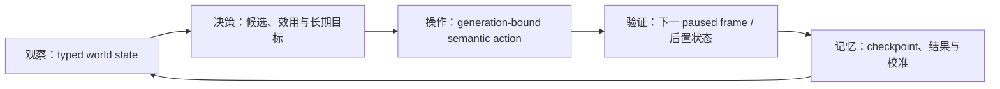

# CK3 自动游玩智能体：终极目标、当前能力与完整路线图

## 2026-10-05T02:11:29+08:00 Oct5滚动：R35 plan恢复，4672日未增

当前4672/36524、恢复1519、Oct5+14、Oct4冻结633，G2 5/8、NW2/4、自然0，零新日。R35/PID110044/managed21223、native+Py g67冻结091bb268aae3e533daeb853c1f8f34aa736ca62a已实际cold GREEN；锁normalh7811/raw53256456/96643154B/SHA `be877d06ebff37a7fd10fe612aa986eb28d526121e602679a9a98b13402ce980`/env3866。all4strict64 GREEN77.133568s、exactCI37221568910 SUCCESS只属构建/静态资格。SDK30243 closed exit1，原4Sway/plan011/army013 GREEN，plan恢复production-live primitive；015 death配方遗漏两个必需可空参数为Harness RED，未调用native，非capability RED。army GREEN不替代新FULLDATA/E字段资格，sole decode仍待；combined source已编译部署，不自动授specific leaf live。历史R34/g66 bef2的14 whole/calendar/bounded保存日/336h、wholeh7805及failed15后h7807保存保留；failed15 typed-query错误0h/无lifeadvance、根因仍未查明，Python b2e4fe4e错误后缀分支未触发，不授诊断修复live。R34@h7763/raw53256120 health恢复/clock3rows/rawrecall仅该历史query primitive，不回填末帧null；472 work24615916/40000000/ETA102尚未占领/未攻占。P0继续普通战争OODA和实际保存，按sole解码/真实paused观测补齐必要字段；测试不替代游玩。

## 2026-10-05T00:06:54+08:00 Oct5/W41跨日同步：4658游戏日，零新日

真实跨日同步：累计4658/36524、恢复1505，Oct4冻结633、Oct5+0，G2 5/8、NW2/4、自然0；自然日/周跨越不是新game日或新live信用。normalh7759/raw53256120/96644058B/SHA `1001971ecbc27b557940fc5aa3a72d4ef41e284492c87bf09e37c482b2777cc3`。相对4619累计新增39=历史R32clock24+R33实际15；SDK47177 requested32/closed exit1，已保存15 whole/calendar/bounded日/360h，第16次plan002原文“application-main typed query failed or its snapshot changed”，0h/无lifeadvance，beforeafter native65/pub62 paused/mapready/alive/clear，不推原因。当前R33/g65/aac paused、controller57523/env9b104…117，whole army-strength query unavailable RED未修，新clock/recall仍未验收；472未占、ETA120/B3515是siege行而非freshhealth专口。P0先修native strengths并真实pausedquery，再继续普通战争OODA与实际保存，测试不能替代游玩。跨日入口：[Oct4正式日报收口](daily/2026-10-04.md)；[Oct5早会](meetings/daily/2026-10-05.md)；[W40正式周报收口](weekly/2026-W40.md)；[W41周计划](meetings/weekly/2026-W41.md)，收口/计划正文由并行lane维护。历史4643/h7712原记录保留（下文“仍滚动”为当时状态）：Oct4/W40仍滚动，尚未00，不提前收口。当前4643/36524、恢复1490、Oct4+618，G2 5/8、NW2/4、自然0；R33零日normalh7712/raw53255760/96688098B/SHA `6b1008d15dc671056d0927edcc374f2e30fdb4a652dc4379446dd2f9a78e1432`，无新增保存日。R33/g65/aac实际cold70196及原4Sway/plan/warstate GREEN，controller57523/exec02f91fd1-2a4f-40dc-bfbb-85adf84f80a2、env9b1043，PID未提供；014strengths RED原文“native gameplay step failed: CK3 army-strength query is unavailable”。旧R32 20+4=24日/576h、clock3rows primitive及预act model4→+4→readonly匹配D393990/phase0/ownbucket0、last55040→55760/B3550→3515限定OODA loop仅历史GREEN；母20metadata为act后登记、预act17c3/wholeh7705及后零日query保留，不授全损失/补员/RNG。R32@h7708历史472 ownSiege work19739642/40000000、ETA135仍未占；旧AI3rows sibling MISSING liveRED/.3 SHA误配.2 binder disabled保留。aac one-line enabled后新.3 readaddr/chain故障诊断中未修，R33 clock/AI无fresh live资格；g65 all4strict64 GREEN81.566643s/568TU565unique1103inputs、exactCI37211690104 SUCCESS，旧37207645140 FAIL保留；clocktopic5773c45b已pub。actualallcache123flags=65ON58OFF/candidate115=65ON50OFF分列；R32 Sway continue/chance35/空rings与R31 seq1属历史，完整phase仍pending。P0修已复现strength与.3读取故障，再授新观测资格；source/CI不替代实际clock/AI验收。

## 当前主线：围城预测有限loop与续行（2026-10-04T21:19:50+08:00 实际补录）

**4619/36524、resume1466、Oct4+594、Oct3冻结777**；相对已pub4539新增80正常保存日/1920h=前瞻1+闭32+闭39+fresh8，calendar/bounded/whole分别闭账；4504→4619的115日另列完整历史，不再加一次。最新6query正常保存为零日，末wholeOODA h7623单独保留。 正常h7626/raw53255184/96635572B/SHA-256 ec4e1b0d3bcd19665c598a23b4d2250adeacadf2bdb511afb907974449c9d996。R31/PID73976/managed84135、frozen g63 df6e5039后台暂停，同Robert29829/episode/envac949；full4 strict64 GREEN75.388693s已部署B98 hardconversion纠正，exactCI37196371137 success仅静态资格。 301989997@472仍围城，ownSiege251658324 work16316250/40000000、ETA172估计、Fort4/Garr500/breach0/未占领；War117440524 active/score0。第40次plan_turn state_changed失败0h、未发送advance，区别旧map-unavailable；fresh8成功仅有限恢复，不证明根因修复。 4294490+126385→4420875及counter13的前置预测，经真实一日、独立读回和normalSAVE闭合有限production-live loop；native phase_due未发布，13<18与状态不变仅支持原no-due预测相容。 G2 5/8、NW2 2/4、自然0；完整siege/war/campaign、战斗MC仍未完成。旧R30暂停、map-unavailable零日RED及upstream追加保持原历史。 实际phase端点0/0/0/1/0→0/0/1/2/0→0/0/1/3/1→0/0/1/3/2，当前counter2/D138446/current+preparedL1800000/cacheenum5；仅变化观测，未还原事件顺序/RNG。当前独立兵力301=3550/3884/reg41、184=3000/3000/reg24、敌268=2692/4702/reg41；驻围军供300、月0、attr0.01，兵数差不归因战斗。Sway execution实际1record hidden_phase_success_source/sway_outcome.0001/success，material/message/terminal均false，只授来源primitive；另两环attached空，旧+25 beneficialloop保留、完整生命周期pending。 新Horizon79e0e4fb、normalfinalizer9597750d、assemblerb0c20706、namedperson0799f6ea、feedbackc3d2188d、selectedowner1ff943f1仅static-ready/partial，未进入frozen g63；owner-retreat94c03c90与月序/bucket仍按研究边界记。四R31topic pub21200c2a、前瞻tick pub54f290f0、war-relief pubcf7f3837。新bucket/D/supplydates及AI recall只读口已授权，native/wire/focused pending，未compiled/live。 继续实际围城OODA，并按已闭原生输入补两项只读观测；未来预算、g64部署与新字段信用均为0。 证据：[连续日账及最终保存](Z:/ck3_mod_rewrite_process_assets/g2-resume-20261003/military-ooda-continuation/ordinary-v58/r31-closed32-39-failed40-fresh8-topic-projection/ROOT-FINAL-DAY-WEEK-FIELDS.json)、[前瞻tick校准](Z:/ck3_mod_rewrite_process_assets/g2-resume-20261004/r29-route-actual/r31-post-predicted-tick-once/ROOT-DELIVERY.json)、[最终phase](Z:/ck3_mod_rewrite_process_assets/g2-resume-20261004/r29-route-actual/r31-final-after8-phase-once/OBSERVATION-DELIVERY.json)、[Sway来源](Z:/ck3_mod_rewrite_process_assets/g2-resume-20261003/sway-natural-material/r31-final-after-eighty-days-once/OCT4-W40-REPORT-FIELDS.json)。

## 当前主线：4539日与472围城输入闭包（2026-10-04T18:29:45+08:00 当前补录）

**4539/36524、resume1386、Oct4+514、Oct3冻结777**；较已pub4504新增35正常保存日=6登陆+21围城+8续行/840h，G2 5/8、NW2/4、自然0。最新正常h7368/raw53253264/96372333B/SHA-256 c2c85675d1b328faed78297924130836cdd981aeb3e92b91801ebf3f1f9add08。v57 R30/PID120956/g62/d1b已pause于h7368且不占foreground；v58候选正准备，g63/R31统一build与cold尚待执行。301989997已登陆472，现sieging/空route/非combat，ownSiege251658324 work4294490/40000000、ETA283估计、breach0/CanStartfalse，仍未攻占，War117440524 active/score0。登陆有限loop与五项siege输入production-live primitive成立；纯consumer只验证输入相容，未实测nexttick。第22次lifeadvance literal CK3 map state unavailable失败0日与同帧独立mapreadytrue、normalh7344同时保留；后8日实际成功不证明根因已修复。dev b52a7a96中phaseprovider acf85a14、phase pure3fbf13deb两case GREEN、futurebuilder/knight/advantage14c5aaee、phaseeventobserver61018c30及calendar均static-ready，无新live/MC；horizon四lane与pursuit B98修复尚施工，不授ready。证据：[登陆6日](Z:\ck3_mod_rewrite_process_assets\g2-resume-20261003\military-ooda-continuation\ordinary-v57\r30-landfall-six-days-consumed01\ROOT-DELIVERY.json)、[围城21日](Z:\ck3_mod_rewrite_process_assets\g2-resume-20261003\military-ooda-continuation\ordinary-v57\r30-siege-first32-days-consumed01\ROOT-DELIVERY.json)、[后8日](Z:\ck3_mod_rewrite_process_assets\g2-resume-20261003\military-ooda-continuation\ordinary-v57\r30-siege-fresh-after-map-unavailable-eight-days-consumed01\ROOT-DELIVERY.json)、[五输入](Z:/ck3_mod_rewrite_process_assets/g2-resume-20261004/r29-route-actual/r30-landfall-active-siege-once/ROOT-DELIVERY.json)。

## 当前主线：4504日续行截点与v57静态准备（2026-10-04T16:29:57+08:00 当前补录）

**4504/36524、resume +1351、10-04 +479、10-03冻结777**，相对4464增40正常calendar/whole/bounded日/960h，G2 5/8、NW2/4、自然继承0；固定 h7252/raw53252424/95804821B/SHA-256 8c8557def103f73519387fecd006b23336d1e3ac659249af7f468dedbb1c21fc。最近实机证据R29/g61f3/env898b、PID38372，新301仍1038 embarked→472未到，旧184仍2619 regular；War117 ATT score0/goal3无siege，470 clean不是我方收复。public285212904/100663351的CArmy解析未找到，不猜unit_kind或合计兵力；Sway继续能力与既有现金primitive保留，完整scheme未terminal。新战斗source各sole focused GREEN仅static-ready，counter首次native2＋Python2 GREEN，counter源d1b7f18d/g62统一full4/Release/W4WX/jobs64与正常freeze一次GREEN81.955581s；最近实机证据为R29/f3/g61，08:21:34.069477Z正常stop/54355 exit0已回收，v57 renderer/prepare/verify GREEN，stage/rebind待执行，R30未allocated且无新live。证据：[8日](Z:/ck3_mod_rewrite_process_assets/g2-resume-20261003/military-ooda-continuation/ordinary-v56/r29-march-eight-days-consumed01/ROOT-DELIVERY.json)、[32日封存](Z:/ck3_mod_rewrite_process_assets/g2-resume-20261003/military-ooda-continuation/ordinary-v56/r29-march-next32-days-consumed01/ROOT-DELIVERY.json)。

## 当前主线：4464日已保存，R29恢复与现金观测口实机验收（2026-10-04T15:43:25+08:00 实际补录）

**用户已结束游玩并释放CK3，R29已冷启动，实机运行已恢复。** 20a2暂停及R28正常关闭保留为历史；当前R0029/execution69c953da-34f4-4d8d-a3a4-5c94bb1987e8、managed54355/PID38372运行，native+Python f3f365c5/g61；cold99233 GREEN/fullhistory7124/saveanchor7123，后续53439正常closed GREEN，原四Sway、现金012、newcmd014及preview016已实测。现金current/allraised观测升为production-live primitive，人物/损失/P1的新live仍未qualified。累计**4464/36524、resume1311、Oct4+439、Oct3冻结777**，G2 5/8、NW2/4、自然继承0；较已pub4421一次新增43个正常保存日/1032h，本次部署及查询新增0日。最新正常保存**h7127/raw53251464/95107270B/SHA-256 a265c124196a8e289ef0512ab6721a45ea69654b13a25eb9857a93d42dc569d9**；h7123原末保存仍为部署历史锚点。

第五战Robert battleATT/WarDEF实际获胜；War129一次提案后3保存日独立退出、零日standdown及普通9日均已闭有限loop，直接AIreply/结算类型仍未观测。event25后新War117440524；五次合军及独立集结8日后，184549452=3000/3000/reg24、301989997=3681/3884/reg41，两军仍独立，6681只合计；新动员到账有限loop成立。统帅34867已独立指派读回并提升行军速度，472仅preview未move。Sway有益旧loop保留、生命周期pending；M7预期仅真实24h retention、自然0。v56 f3/g61 full4strict64jobs实际65ON50OFF、编译/freeze-only修复/exactCI GREEN，R29冷启动已实测；cash观测口production-live primitive，knight/levy/P1新live待验收，新P2与补给/围城施工未计ready。所有旧Harness RED及其它产品追加保留。

证据：[用户实机会话交接](../ck3-native-ai/2026-10-04-user-game-window-handoff.md)、[8正常日](Z:/ck3_mod_rewrite_process_assets/g2-resume-20261003/military-ooda-continuation/ordinary-v55/gather-eight-day-consumption/ROOT-DELIVERY.json)、[两军独立实读](Z:/ck3_mod_rewrite_process_assets/g2-resume-20261003/army-reinforcement-raise/port-war-v56/gather-finished-strength/ROOT-FINAL-DELIVERY.json)。

## 当前主线：2669主战进行，battle输入观测已实测（2026-10-04T12:11:53+08:00 实际补录）

相对已发布4395，本轮连续批次合并26个正常保存日=8＋14行军＋1接敌＋3战斗/624h，累计 **4421/36524、resume1268、Oct4+396、Oct3冻结777**；G2 5/8、NW2/4、自然继承0。当前C1291845646/关联Result469762068@2669已到main day0，我方ATT0 Robert29829/83886367 fighting3924，对敌DEF16777683/owner32750/cmd30470 fighting2228；尚无winner，War129的player primary仍DEF。正常h6927/raw53250432/94606488B/SHA `770a1760e6cc3245721ec29b76a153f484a7407c66eff497a68c28c1346be02c`。

侧来源账本与统帅输入两个observer已在真实battle达到有限production-live primitive：联系帧native105/pub2/raw53250360返回side各6行、commander各17 inputs/7 rows，martial23对11为实测非零输入；零roll合成context+7/helpermatchtrue与当前native118/main帧stored advantage+7分开，不作完整因果。opaque1/2未解，full encounter/MC及win odds未完成。R27/g58/source39b/PID122268保持；Sway已成立有益窄loop而整scheme未terminal。后继SDK55969预算32尚未closed，本包0未来日/胜利信用。

证据：[3日正常保存](Z:/ck3_mod_rewrite_process_assets/g2-resume-20261003/battle-observation-schedule/v54-battle1291845646-days01-consumption/ROOT-DELIVERY.json)、[真实来源observer](Z:/ck3_mod_rewrite_process_assets/g2-resume-20261004/battle-contextual-actual-next-v54/actual-combat1291845646/ROOT-DELIVERY-ACTUAL.json)、[Sway有益cold读回](Z:/ck3_mod_rewrite_process_assets/g2-resume-20261003/actual-sway-next-material-v52/r27-actual-cold-six-consumption-01/ROOT-DELIVERY.json)。

## 当前主线：有益Sway冷读回已闭合，2669截击待执行（2026-10-04T11:51:42+08:00 实际补录）

**4395/36524、resume +1242、10-04 +370、10-03冻结+777**，G2 5/8、NW2/4、自然继承0，无新增日。R27 source39b55512/g58 cold GREEN、PID122268已实际启动，R26已closed；玩家capital2619／县2142解围与503胜利历史保留，旧2640为县2115头衔首府的纠正继续有效。

SDK11235已closed GREEN，原四Sway、两target/opinion与2669 preview全通过；unique active134217986/gen8→34333 progress183/355、continue与CanContinue true、terminalfalse；独立opinion27/+25专用modifier present，新PID三ring attached/emptycursor0/gapfalse。一次干预→实际物质后态→后续正常日→冷重载读回的窄有益production-live loop已成立，完整scheme生命周期及M6/G2不加信用。2669预览已accepted/available，路线2619→[2614,8757,2669]，当前省limit6355/use3893、目标3285/use0仅观测primitive，未计move/arrival/未来日。v53/v54源码随R27已部署，真实battle来源rows仍未query，仅static-ready，不授MC/预测完成。

证据：[R27部署](Z:/ck3_mod_rewrite_process_assets/g2-resume-20261003/runtime-preparation/v54/DEPLOYMENT-REPORT-DELIVERY.json)、[2669实际预览](Z:/ck3_mod_rewrite_process_assets/g2-resume-20261003/army-supply-attrition/intercept2669-preview-consumer/actual-preview-v54/ROOT-DELIVERY.json)；Sway唯一下游收据由Root sealed r27-actual-cold-six-consumption-01/ROOT-DELIVERY.json提供，不二读原artifact。

## 当前主线：首都2619解围后准备2669截击（2026-10-04T11:20:56+08:00 实际补录）

**4395/36524、resume +1242、10-04 +370、10-03冻结+777**；新增30行军＋6战斗=36个保存日、864h，G2 5/8、NW2/4、自然继承0。真正玩家capital2619／县2142已抵达并解围；1728053248→1442840576为Robert DEF normal_result，wipe true且敌末值1、我军3893，不能改写为敌末值0。

主83886367 regular@2619、空route，独立查询确认无occupation/active siege。503已victory_enforced并独立退出；剩余129 score−13，WP/enforce false。敌16777683@2614向2669移动；截击仍preview，下一步按actual推进。旧2640为县2115头衔首府的纠正保留；R26 source1791/g57已运行，v53/v54准备成果尚未部署/live。

当前正常保存 **h6844/raw53249808/94141190B/SHA-256 675a6f104e0d620b210675f327165883fc0723c2e9b256e7a0ec760cc8a20706**；[30日抵达账本](Z:/ck3_mod_rewrite_process_assets/g2-resume-20261003/military-ooda-continuation/capital2619-v52/relief64-consumption/ROOT-DELIVERY.json)、[首都终态](Z:/ck3_mod_rewrite_process_assets/g2-resume-20261003/siege-efficiency-inputs/current-capital-2619-query/actual-after-battle1728053248-v52-01/ROOT-DELIVERY.json)。 [第四战6日保存](Z:/ck3_mod_rewrite_process_assets/g2-resume-20261003/battle-observation-schedule/v52-capital2619-battle1728053248-days02-consumption/ROOT-DELIVERY.json)。

## 当前主线：两场胜利后继续前往玩家capital2619（2026-10-04T10:23:52+08:00 实际补录）

**4359/36524、resume +1206、10-04 +334、10-03冻结+777**；本批36日=第二战9＋行军2＋第三战25，G2 5/8、NW2/4、自然继承0。2629两次真实DEF胜利与wipe各自封存：1577058310→1711276040、1593835526→1761607683；不合并敌军损失或外推全战胜利。

主83886367@2629 moving7，目标2619、路线四跳，尚未抵达/解围；**玩家capital2619／县2142，旧2640为县2115头衔首府。** 一次enforce→独立warstate仅余129已闭合有限结算loop；下一步继续向2619行军，129 score−24且两围城敌军仍在。R26 source1791/g57已cold GREEN；v2新13来源片段已实测primitive，合法负值/零值且MC/complete=false，不计完整预测，后续relief/天数不给预授信用。

当前正常保存 **h6666/raw53248944/93863164B/SHA-256 9c499e083880b20d8b7e3a14871cd2e72cb3b0cf680ea732377960bbc599ce47**；[第三战证据](Z:/ck3_mod_rewrite_process_assets/g2-resume-20261003/battle-casualty-outcomes/player-combat-1593835526-actual-terminal/ROOT-DELIVERY.json)、[25日账本](Z:/ck3_mod_rewrite_process_assets/g2-resume-20261003/battle-observation-schedule/battle1593835526-twenty-five-normal-save-index/ROOT-DELIVERY.json)。

## 当前主线：玩家capital2619接敌，等待真实战斗后态（2026-10-04T08:16:12+08:00 实际补录）

**地理锚点仍为玩家capital2619／县2142；2640属于县2115 titlecapital，已收复有限loop不是玩家首都收复。** 55日真实正常行军/1320h已封存，累计 **4323/36524、resume +1170、10-04 +298**，10-03冻结777；G2 5/8、NW2/4、自然继承0。最后正常 **h6509/raw53248080/93584151B/SHA-256 375ab8dd80c2aeeb6e9e48411038e7b671213cd2da118a0c05c4f339023046c9**。末帧native1089/pub220、Robert29829存活/同episode、paused且事件互动清除；主军83886367在2629接入FullCombat1577058310，玩家DEFENDER side1、maneuver第1日、无winner，尚有4跳[2630,2631,2624,2619]去首都。首都2619未被敌占，但敌Siege201326609仍在、ETA122仅估计，未到达或解围。同帧seq81我军health3920/4231、supply113.34217/300、月+20、attr0，不由旧兵力差推伤亡。当前active_wars仅50331736/129，玩家相对分数−10/−26；War16777231自march第2日/raw53246808起不在集合，即提案后第5个保存日，只授war-ended观测primitive，结算类型未查明，不写白和平accepted或全战胜利。

下一步从准确Combat与末军状态进入实际战斗观察和操作，按真实normal保存记账；当前仅确认玩家接敌，不授解围或胜利。原129两支敌军在2619 sieging的观测、旧三军strength和DEFENDER ctor0-v2输入各保留其原帧/partial边界，不混用旧2640现场或假装fresh兵力。零日move后h6278不是本批最终锚点。nativeR25/g54、Python210943/g56 hot与未部署的v50诊断分列；contextual ledger扩展授权不等已实现，后续battle预算不预授。

实证：[55日完整账本](Z:/ck3_mod_rewrite_process_assets/g2-resume-20261003/military-ooda-continuation/capital2619-v51/relief55-sealed-day-consumption/ROOT-DELIVERY.json)、[接敌终帧与正常保存](Z:/ck3_mod_rewrite_process_assets/g2-resume-20261003/military-ooda-continuation/capital2619-v51/relief55-sealed-day-consumption/DAY55-TERMINAL-CRITICAL.json)；[此前三军strength观察](Z:/ck3_mod_rewrite_process_assets/g2-resume-20261003/army-reinforcement-raise/runtime-v51-capital-defense-strength-consumption/ROOT-FINAL-DELIVERY.json)、[无日数move后态](Z:/ck3_mod_rewrite_process_assets/g2-resume-20261003/battle-observation-schedule/v51-relief2619-moving-zero-day-control/ROOT-DELIVERY.json)。

## 当前主线：2640已收复，战争按独立后态记账（2026-10-04T06:57:59+08:00 实际补录）

**纠正地理：实际玩家capital为2619／县2142；2640是县2115的title capital。此前称“玩家首都收复”不准确。** 本轮我方围城→2640收复的production-live bounded loop保留，地理称谓纠正不抹除实际收复，也不外推全战胜利；历史原文追加本纠正。

当前 **4268/36524、resume +1115、10-04 +243**，10-03冻结777、G2 5/8、NW2/4、自然继承0；相对4180阶段38+47+3=88日/2112h，最后normal **h6267/raw53246760/SHA-256 e5f1e0538a26f0b675dcf5dac3fca6b561b684e44b29cd2423aab50a150c3518**。零日事件24保存独立保留，traits效果未读；day01 harness日期匹配RED和纯读回补保存不重复计时。

下一步依据当前独立war/reply与合法军务值继续：第3个答复等待日SDK64107正常closed0/GREEN；独立active_wars仍16777231/50331736/129，玩家相对分数12/−13/−29，单次白和平提案仍pending，和平终态信用0。 原onceoffer不重发，错误collector的[]不是和平证据。Python g56/210943a7已真实hot，官方CI37158023572 GREEN；native仍R25/g54/889821f5/PID66464，v50/g55诊断候选未部署，horizon根因未查明。 运行批次无未来预算信用；首个收复后1日、day02及后续真实日各按normal保存计，缺字段不靠旧摘要猜补。

下一施工入口为玩家当前首都2619的实际占领、敌我兵力及路线观测；Root后续查询不计入本次固定截点。

实证：[47日收复账本](Z:/ck3_mod_rewrite_process_assets/g2-resume-20261003/military-ooda-continuation/recapture-v49/siege02-sealed-day-consumption/ROOT-DELIVERY.json)、[第3日正常保存及战争后态](Z:/ck3_mod_rewrite_process_assets/g2-resume-20261003/runtime-preparation/v51/ROOT-ACTUAL-REPLY-DAY-03-RECEIPT.json)、[事件24零日处理](Z:/ck3_mod_rewrite_process_assets/g2-resume-20261003/battle-observation-schedule/r25-v49-event24-select-zero-days/ROOT-DELIVERY.json)、[军需历史帧](Z:/ck3_mod_rewrite_process_assets/g2-resume-20261003/army-supply-attrition/siege-cache-trend-r25/ROOT-DELIVERY.json)。

## 当前主线：已抵达并围城，首都尚未收复（2026-10-04T05:56:22+08:00 实际补录）

累计 **4180/36524、resume +1027、10-04 +155**，10-03冻结+777；G2 5/8、NW2/4、自然继承0。新批64个正常保存日/1536h与原55日合计119日，最后正常 **h6059/raw53244648**。day38/raw53244024才首次实读抵达及我方围城，预测时间不能代替该实证。

主军83886367在2640、sieging、路线空、无combat/retreat；首都敌占70766而ownSiege385875999/playertrue并存，ETA128仅估计，不能写收复或围城终态。下一步依据原生战争树、实际围城进展与fresh补给决定继续围城或合法外交；兵力3801/4231、47兵团，补员30/47行只是部分观测，不由差额推伤亡。WP167合法资格/报价可读，但recipient answer unavailable，defender typed gate仅attacker正在v51修复；其余两WPfalse、三enforcefalse，未发送。

v50/g55诊断候选full strict/CI GREEN尚未deploy，horizon cause仍unknown，不把静态诊断当已解实际故障或新增门禁。R25仍g54/8898/PID66464；SDK68437 future64和terms另零日save均不改本次锚点。旧六入口与另机append原样保留。

实证：[64日账本](Z:/ck3_mod_rewrite_process_assets/g2-resume-20261003/military-ooda-continuation/recapture-v49/actual02-sealed-day-consumption/ROOT-DELIVERY.json)、[零日正常保存](Z:/ck3_mod_rewrite_process_assets/g2-resume-20261003/battle-observation-schedule/r25-v49-capital-siege-zero-days/ROOT-DELIVERY.json)、[军需实读](Z:/ck3_mod_rewrite_process_assets/g2-resume-20261003/army-supply-attrition/actual-capital-arrival-health-v49/ROOT-DELIVERY.json)、[v50严格构建](Z:/ck3_mod_rewrite_process_assets/g2-resume-20261003/runtime-preparation/v50/ROOT-ACTUAL-V50-STATIC-BUILD-RECEIPT.json)。

## 当前主线：55日持久续行，首都仍敌占（2026-10-04T05:07:15+08:00 实际补录）

累计 **4116/36524、resume +963、10-04 +91**，10-03冻结+777；最后正常 **h5895/raw53243112**。64日预算实际保存55日/1320h后exit1，第56日horizon typed query失败或snapshot changed，0推进；保留该RED与已成功保存，不能把请求预算写成完成日数。最终封存字段由Root锁定，不追中间前缀或重核旧包。

主军83886367在2626向2640行军，完整四跳 [2627,2633,2634,2640]，无combat/retreat、尚未到达；首都占领者70766，当前围城452984850属enemy/playerfalse，war16777683、驻军85、ETA53日。该状态不授我方围城、收复、解围或新战斗胜利。下一步通过现有显式逐日skip-route-horizon推进，并消费实际路线、目标归属和独立保存；已发生的horizon故障由Root三路最小修复并行处理，不增加life前置。运行中的SDK66198/max64无未来信用。首战、合军、v49 live及其他历史沿原正文保留，新增专题发布不代替新的游戏结果。

实际55日ledger与第56失败：[sole cached delivery](Z:/ck3_mod_rewrite_process_assets/g2-resume-20261003/military-ooda-continuation/recapture-v49/sealed-day-consumption/ROOT-DELIVERY.json)；本次采用与6前像SHA见[ROOT-DELIVERY](Z:/ck3_mod_rewrite_process_assets/g2-resume-20261003/progress-current-six-v49-recapture64/ROOT-DELIVERY.json)。

## 最新短增量：玩家首战胜利、v49/R25 已实机部署

真实编制 **2026-10-04T04:56:11.084525+08:00（Asia/Shanghai）**，固定截止正常关闭的 **SDK38881**；累计 **4061/36524 已保存日 / resume908 / Oct3正式冻结777 / Oct4新增36**，G2 **5/8**、NW **2/4**、自然继承 **0**。最新正常保存 **h5707 / raw53241792 / 92,162,450 B / SHA-256 `2f8446a5f45d0844c1621ab087c57a7d8e4ecde33ea0528d2896df1873f1175f`**。

首场玩家战斗 **1543503874 → normal_result1694498817 / cursor17→58 / player-side1胜利 / old combat deleted** 已闭合为有限 `production-live loop`。实际战斗 **4040→4061共21保存日**，前述分段均包含其中。战后第二次合军独立验证 **D83886367保留、S167772189消失、controlled set2→1**；独立后态 **3901/4231、47兵团、Supply111.52397/300、月供+20、attrition0**，不与终局记录 ours3900 混为同一帧。**整场战争仍active**；2640已敌占70766、fort7/garrison25、无active siege，下一P0是夺回首都。

**R0025 / PID66464 / managed75537 / native+Python g54/source889821f5** 已真实cold GREEN并保持最小化、非前台、无输入；四目标64jobs/fullstrict **78.056079s GREEN** 与 CI **37150080025 GREEN** 分开记录。13201与38881查询正常关闭；当前省2618 **limit5330/usage3901**、目标2640 **limit3080/usage0** 双row available/scale1，达到 `production-live primitive`；目标usage0不含本军未来抵达。AI增援007对非AI管理主体合法返回 `subject_not_ai_managed / unavailable / accepted-ready=false / noerror`，限定负分支生产口已实测。

部署、查询与这次正常保存均 **0新增日**；后继首都move、SDK60709预算64由独立owner接续，不计未来信用。旧RED、R24 completed-red、此前v48 build-only与另一产品追加均保留；Oct4及W40继续滚动，不提前正式收口。此前六入口已发布 `d1507e768a0053da37b9d710f21b749e5fd44f9c`；本短段待Root实际采用与commit/push登记。完整终局、独立强度/war/供给/部署/Sway证据与前像SHA见[本次采用receipt](Z:/ck3_mod_rewrite_process_assets/g2-resume-20261003/progress-current-six-v47-battle-terminal/ROOT-DELIVERY.json)，不重复投影旧39k包。

## 当前实际边界：v47 首场玩家战斗进入主战，截至 h5616

本次进度投影真实编制时间为 **2026-10-04T03:23:56.430551+08:00（Asia/Shanghai）**，采用 Root 已确认的关闭区间、sole-consumer compact 与正常保存；不倒填到 00:00。累计 **4043/36524 个已保存日**、恢复后 **890 日**；Oct3 正式收口保持 **777 日**，Oct4 当前 **18 日**。G2 **5/8**、NW **2/4**、自然继承 **0**。最新正常保存 **h5616 / raw53241360 / 91,982,553 B / SHA-256 `a90ce4d26566ee2cd41abfeeeda3cb0957e29e83ae7519483e23b4399ce08497`**。这是保存后的真实边界，不把预算日、零日查询或历史派生日再相加。

实际能力新增：Company **514** 的有限雇佣闭环，以及当地合军的 **D 保留、S 消失、control set 精确核验 → 独立兵力与统帅回读**，分别达到 `production-live loop`。合军后独立帧为 **1770/1770、7 个兵团、Supply 99.999/100、月供给变化 +20、attrition 0、current commander34867**；这些是该 postmerge 帧的读数。主军单次派遣至 2618 已有独立 route/horizon/正常保存闭环；其后预算 10 日的批次只实际完成 **8 日/192h**，遇到 J167772189 在 2618 的真实玩家战斗而停止。没有异地两军会合、2640 解围或战争完成信用。

首场玩家战斗 **CombatID1543503874** 的 scope/control 与 terminal 查询为 `production-live primitive`，J167772189 为 side1/player defender；journal cursor/baseline **17**。第三次 exact-day 真实完成 **1 个 24h/bounded/saved 日**，day04 再完成 **2 个 24h/bounded/saved 日**。初次停止来自决策输入变化：敌方增援加入、统帅/优势/宽度变化，不能误写成当时 phase 已变。最新 day04 帧才实际从 maneuver day3 进入 **main phase raw1/day0**：attacker fighting **1576**、player defender fighting **1770**，attacker-oriented advantage **-21**；双方 next range **0..10** available、current roll **0/0**，**winner 未产生、finalized=false**。主军仍在 **2632**，moving route **[2617,2618]**、noncombat。不同帧的 stored fighting 与 dedicated strength 不混为同一指标，不从兵数差推算战斗伤亡。首个有保存的战斗推进区间已经实做，完整战斗决策、胜负及结算仍未完成。

实际失败继续保留：battle day01 的 epoch/composite-advertisement RED 为 **0h/0日**；exact-day02 两个早期 snapshot RED 同样 **无动作、无保存、无推进**。之后诊断 SDK36947 GREEN 确认 same PID32372/gen14、connected/semantic/build_match、life-advance-one-day 发布 true、battle epoch 未发布；诊断本身也是零日、零保存，不用它倒推前两次失败的唯一原因。原 subset h2 horizon RED 不是授权/flag OFF，后来 full-scope h6 GREEN 是另一组实际输入；named reinforcement/AI-assignment typed RED 的原 raw 未保存，唯一原因未确认。原 Sway004 RED 和 native1c 的旧 CI RED 均不抹除。四项 Sway 当前查询与军务/角色/速度查询曾各自 GREEN，但空 ring 不能冒充 durable replay 或 Sway 终态。

当前游戏仍是 **R24 / PID32372 / managed62758**，native **g51 / `1c67491f8217a389bfdea75a9914afff70b44a05`** 与 Python **g52**；保持最小化、不抢焦点，窗口证据为 `runtime-preparation/v47/ROOT-ACTUAL-NEW-PID-WINDOW-01.json`。day05 **budget8 / SDK99839 正在执行**，其未来日、保存、战果均不记入上述 4043。新源 **`89f45fa1408620b750e1a808c42284d824d03d81` / g53 clean freeze** 已发布并完成四目标完整 strict：**64 jobs / 556 TU / 553 unique / 1074 inputs / 119.23244s GREEN**；新 DLL **8,920,064 B / SHA-256 `10269cb8b926e55a9e66a533f48e7b04b2920f027963e55026f97c6d1b8918f6`**，official CI **37147014880 GREEN**。新组合仍是 `static-ready`、尚未部署 R24，不把它的源修复归因为本次现有 DLL 的实机成功。先前 exact1c CI **37139457808 RED**（旧 union test schema）保留；test-only 修正发布 c3cd1a5 后 CI **37141461220 GREEN**，892378b 实际专题/Python发布后 CI **37143363221 GREEN**，两者不代替旧 run 的结果。

下一 P0 是依据这场持续战斗的新玩家输入完成合法战斗决策、真实推进和独立终态/战后回读；继续现有 bounded OODA，不等待所有研究专题完成。Oct4 D1–D5 与 W40 按既有日/周计划会滚动：战争/增援项新增上述有限闭环和玩家战斗价值，事件、生存、外交与整局终态仍按各自证据推进；不得把这一轮有限能力写成整局 `complete`。Oct4 日报在次日午夜正式逐项收口，W40 在 Oct5 00:00 正式收口。已完成的历史合同与原生输入账本保留，战争/宗教授权继续全面开放。此次包由 Root 实际采用后再登记 commit/push，不预写提交成功。

实际证据回链：[hire514 receipt](Z:/ck3_mod_rewrite_process_assets/g2-resume-20261003/war-mercenary-hire-v46/actual-v47-hire514/ROOT-DELIVERY.json)、[localmerge membership](Z:/ck3_mod_rewrite_process_assets/g2-resume-20261003/war-goal-capture-execution/army-coordination-v47/actual-merge-membership-01/ACTUAL-MERGE-MEMBERSHIP.json)、[postmerge strength/commander final](Z:/ck3_mod_rewrite_process_assets/g2-resume-20261003/army-reinforcement-raise/runtime-v47-postmerge-strength-commander-consumption/ROOT-FINAL-DELIVERY.json)、`military-ooda-continuation` 的 main-dispatch 与 sole battle compact、`battle-player-live-preparation` 的原失败和后续实际 day03/day04 区间。原生专题入口为 `docs/ck3-native-ai/README.md`，增援/合军账本为 `army-regiment-replenishment-raised-reserve-12003.md`；本次完整 owner 字段和六入口前像/投影哈希见 [ROOT-DELIVERY](Z:/ck3_mod_rewrite_process_assets/g2-resume-20261003/progress-current-six-v47/ROOT-DELIVERY.json)。源码发布：[c3cd1a5](https://github.com/XenoAmess/ck3_eternal_recurrence/commit/c3cd1a512f8c788a6c0cfefb6fe5f5ed94059ed4)、[892378b](https://github.com/XenoAmess/ck3_eternal_recurrence/commit/892378b5e82b7be0bfe4eb596b631b4be8c52fa4)、[89f45fa](https://github.com/XenoAmess/ck3_eternal_recurrence/commit/89f45fa1408620b750e1a808c42284d824d03d81)；这些 publication 与冻结 live source 分开记录。

## 2026-10-04T01:06:20.190420+08:00 最新状态：123成军、h5534正常保存、R23已关闭

当前累计 **4032/36524**、恢复 **879**、10月3日正式冻结 **+777**、10月4日 **+7**，G2 **5/8**、NW **2/4**、自然继承 **0**；七日预算就是同批7个正常保存日，未再加7。最新正常锚点 **h5534 / raw53241096 / 91825231B / SHA-256 `22e9028da99a4f77ba5b5485b912065f38aa9761fc9100a1adf63d4dd238f028`**，独立查询与新保存新增 **0日**。

SDK99980 **closed / exit0 / GREEN** 已fresh确认：新军 **167772189** 在 **2618 / regular1**，**123/123 soldiers、1 regiment、days=null/not_gathering、ready=true**；主军 **83886367** 在 **8754 / moving**，**2259/2460 soldiers、39 regiments、Supply120/300、本帧attrition0、月供变化0**，仍八跳向2640。此前同一路径的 **一次defaultRaise→0兵gathering→独立7天ETA→真实7日循环→独立123成军** 已闭合为限定 **bounded production-live loop**。初raise为h5496/raw53240904，先前首日到53240928，本日7日到53241096；from-raise总8日，本日仍只+7，首日不重加。该信用不扩为雇佣、有效解围援军、2640到达、玩家battle、战争complete或自然继承。h5532原末snapshot没发布strength的null仍是当时事实，fresh查询已经补足当前兵力；不继续以它描述current未知。

**当前CK3已正常关闭、运行中SDK为0，旧PID77476不再存活。** Root在 **2026-10-04 00:53:37+08:00** 正常stop R0023，managed57163 **closed/exit0**，并在 **00:55:01+08:00** retired为 **completed-red**：原Sway004实际RED保留，同PIDreadonly recovery GREEN、merc/gather及7日各自GREEN分开记账。停止/回收证据为 `runtime-preparation/v47/ROOT-RETIRE-R23-ARGV.json` 与 `retire-r23-result`。v47批次部署准备中；本包没有新的native组合full/cold/live信用。独立fresh strength唯一消费：[ROOT-FINAL-DELIVERY](Z:/ck3_mod_rewrite_process_assets/g2-resume-20261003/army-reinforcement-raise/runtime-v46-gathering-finished-consumption/ROOT-FINAL-DELIVERY.json)，SHA-256 `dddda5bd5a63553cc15b5c0e04d168dff5e4403415576fe158692dc7dba5424e`。

主军仍未到2640，目标未被敌占领，敌围城末ETA10天；原Sway仍同FullID134217986/gen8/target34333、CanContinue/statuscontinue、terminalfalse，未重Start。下一P0转为结合**已fresh成军的123军队**与主军/围城/合法候选决定军务、完成既有typed hire静态整合与新exact部署/独立动作验收。已完成的兵力查询不再列为待执行；新merc雇佣、支付、接战和解围仍待真实后态。Root48-source LF包已实际apply/check GREEN，等待与本六报告共同publish后组合fullbuild；此前CRLF applycheck失败未写共享树，EOL修复后的成功单独保留，不外推native部署。以下h5532阶段记录及旧runtime身份保留为各自采集时现场。

## 当前截点：v46 七日保存闭环，4032 日（2026-10-04T00:53:20.825759+08:00 实际补录）

累计 **4032/36524 保存日、resume +879、10-03已收口 +777、10-04 +7**，G2 **5/8**、NW **2/4**、自然继承 **0**。原Robert29829/ordinary episode `native-29829-2bc2d599f7f9`、xar_off保持。SDK53917正常关闭 **exit0/GREEN**，本次七个bounded日循环、七个正常保存、168 raw小时：**4025→4032**，raw53240928→**53241096**；预算准备的7日就是本次已执行的7日，不能再加另一组7日。最新正常pair **h5532/raw53241096/91,825,231B/SHA-256 e7b610e633f3a5c47a3bcfe3386adee7ec6b83db220edf191ab6b6cfec750783**，native35/public30。[七日sole消费收据](Z:/ck3_mod_rewrite_process_assets/g2-resume-20261003/military-ooda-continuation/relief-v46/seven-day-consumption/ROOT-DELIVERY.json)。

主力 **83886367** 末帧位于 **8754**、state7/moving、target2640，剩完整八跳 `[2613,8752,2628,2626,2627,2633,2634,2640]`，无combat/retreat。2640仍未occupied，敌Siege318767158继续，work **60892200/62500000**、remaining1607800、ETA **10日**、2508兵、breach2。**尚未到达、接战或解围**，七日仅授既定行军限定 `production-live loop`。最近主军arrival ETA79日来自before-day7 raw53241072，较末帧老24h，不能造raw53241096当前ETA；末包未提供独立main strength，不把旧2259写成末帧数。新军 **167772189** 同末帧owner29829/current2618、**regular1/controllable=true**；targetnull且targetobservablefalse、route complete_empty/sourcecount0/[]，无combat/retreat。该末帧soldiers=null是未提供strength查询，不能写合法0兵；max/regiments/current内部CArmy/gatherdays/ready尚未发布，83886088仅历史mapping，不写当前仍0兵gathering。[军务末帧compact](Z:/ck3_mod_rewrite_process_assets/g2-resume-20261003/military-ooda-continuation/relief-v46/seven-day-consumption/COMPACT-TERMINAL-STATE.json)。

原Sway只读恢复独立入账：SDK92861正常 **exit0/GREEN**，FullID134217986/gen8、target34333、exact join/present、CanContinue、statuscontinue、terminalfalse，**Start0/新增日0**。其正常历史pair **h5510/raw53240928/91,443,885B/SHA-256 c3005d3b1305cfb29b1efd8f9ac48eb20e1d8c5dbbccbe8ba6285360827237cc** 保留，当前save仍为上方h5532。原completion004 RED保留；error1相关最小修复 **`f4cdcb66b96e71f2b9f966e40f33ddede3b9cacd`** 已发布，runtime Python **g50** 与native **g49** 分列。本次恢复是实际查询primitive，未授Sway完整终态、专属收益或新全局信用。[修复发布](Z:/ck3_mod_rewrite_process_assets/g2-resume-20261003/battle-observation-schedule/sway-v46-completion-red/ROOT-ERROR-TEXT-ADOPTED-PUBLISHED.json)、[独立恢复收据](Z:/ck3_mod_rewrite_process_assets/g2-resume-20261003/battle-observation-schedule/sway-v46-original-readonly-recovery/ROOT-DELIVERY.json)。

运行native为v46/R23、PID77476、frozen **Z:/g49**／source **`9772958a55e5182ef78562c74e43d72ba3f2302e`**，paused/minimized、无窗口输入；其四目标strict64jobs与exact-sourceCI **37134271120 GREEN** 保留独立构建信用。10-03正式收口/10-04早会/W40/交接四文件已实际发布 **`5b07786f56950b95959b3520c46cd21ac77552e1`**，不把该报告commit当DLL身份。[10-03已收口日报](daily/2026-10-03.md)、[10-04当前日报](daily/2026-10-04.md)、[10-04真实早会](meetings/daily/2026-10-04.md)。

候选新增包按部署边界分列：**c456** 的v2增量目前仅部分 `static-ready`，尚未full组合构建/部署；mercenary typed hire **24路径**、native fixture65/registered31检查及4ownerTU strict GREEN，仍外部整合、未full部署或实机hire；faith **8路径/4native+4registered GREEN** 仅外部集成 `static-ready`，speed/character待交。以上不能授雇佣、支付、生成军、信仰变化或新增玩法收益。当前0hire信用，后续用原生树及真实资格/费用/资源决定已授权增援动作，再按实际material和normal save记账。

此前Robert单军统帅、县task_conversion派遣和2604单holding收复各自有限loop保持；县尚未改宗，2640仍未解围，玩家battle/战争胜利/终战与自然继承仍待实际结果。旧004 RED、v45 modal RED、defaultRaise012登记RED、v42/v44 C1061、v39请求7实进13和v41首44保存日仅43whole OODA等全部保留。下方所有旧“当前”段仅代表各自历史时刻，最新状态以上节为准。

当前优先级：依据[Robert原生防御战争树](../ck3-native-ai/robert-defensive-war-loop-12003.md)，把七日末route/敌围城与集结结果用于下一增援和军务动作；typed hire候选交付后按其真实部署/资格/独立material推进。新强度采集或下一save另按自己的实际结果入账，本截点不等待或预写未来SDK；到达、解围、玩家战斗结果和自然继承继续按现有合同验证。

## 2026-10-03T23:15:48+08:00 当前 v45 实机截止

累计4025/36524、resume872、10月3日777，最新正常h5504/raw53240928。v45 R22/PID28944最小化cold、defaultRaise权限/预备人数和新增军队独立读回、living retention及无阻塞modal读取已实测；正常一日后新军仍0兵集结。主力仍2616→2640，无接战抵达解围。自然0/G2 5/8/NW 2/4保持。原生DLL7a/g47与Python补线451dde/g48分开绑定，四目标strict64jobs和exact-sourceCI GREEN。详见[10月3日日报](daily/2026-10-03.md)及[实机汇总](Z:/ck3_mod_rewrite_process_assets/g2-resume-20261003/runtime-preparation/v45/ROOT-ACTUAL-MILESTONE-H5504.json)；下面前序v43/v45pending段保留当时事实。

## 当前截点：v43 行军续32日，4024 个保存日（2026-10-03T22:58:42+08:00 实际补录）

- **最新实机与保存**：v43/R0021/PID14124，compiled source `8e2cfbee4981af7f80398ec09129c1cf0f3dbe54` / frozen `Z:/g45`，原Robert29829/episode native-29829-2bc2d599f7f9/ordinary/xar_off/pact absent；minimized=true/foreground=false。最新正常 `h5490 / raw 53240904 / SHA-256 45a738d9082a9bab322c786a1c9c2c784f9468a13a4e664fe1a3a435bc15eeab` 来自holy只读SDK26432正常exit0，新增日0。累计 **4024/36524**、恢复 **+871**、10-03 **+776**，G2 **5/8**、NW **2/4**、自然终局 **0**、`percent_reporting_allowed=false`。[holy actual fields](Z:/ck3_mod_rewrite_process_assets/g2-resume-20261003/war-holy-order/ACTUAL-V43-REPORT-FIELDS.json)。
- **行军实际闭环**：3992→4024，共32 rounds/32 GREEN/32实际保存日/32完整one-day OODA/768 raw hours；只续行既定route，逐日fresh army/target观测与normal save已构成限定的 `production-live loop`。batch自己的正常保存 `h5489 / raw 53240904 / SHA-256 78577dea427e8f2c0e0611308057a0cc758ec8fdc344cf27df365aece7a64351` 独立保留；后续h5490不追溯替换该batch，artifact消费不新增日。[32日终态消费](Z:/ck3_mod_rewrite_process_assets/g2-resume-20261003/military-ooda-continuation/relief-v43/terminal-consumption/ROOT-DELIVERY.json)。
- **末帧仍在途**：army83886367/owner29829位于2616、state7 moving、target2640，完整9段route `[8754,2613,8752,2628,2626,2627,2633,2634,2640]`，未combat/retreat。目标2640仍有敌Siege318767158/army473/2508兵，fort7/garrison1350、progress95.169%/ETA18；在War50331736/129两行投影同一个物理siege。尚未观察到到达、玩家参战或解除敌围城，不计relief/胜利/终战。
- **时间与兵数边界**：最后route ETA只来自day32推进前raw53240880，canonical arrival53242968/当帧剩2088h；没有把它当作raw53240904终帧的新ETA。32日末无独立strength packet，最近strength引用为day30，不能把旧兵数或差值当成终帧兵数/combat casualty。下一决策需fresh route/contact/strength及目标围城输入。
- **holy真实读口**：raw53240904/native141/capture339029配对完整，5行（4非military/1military）；唯一军事order4/Rite15实际938兵，employer39004/patron35131/leases7558、4146。final `CanHire=false / CanAfford=true / quote106 piety`，原生理由为绝罚与已受雇；当前无合法可雇骑士团增援。查询为fresh `production-live primitive`，无hire/payment/player新增兵/完整军用loop信用。[holy actual receipt](Z:/ck3_mod_rewrite_process_assets/g2-resume-20261003/war-holy-order/mcp-recipe/actual-v43/ROOT-DELIVERY.json)、[holy战争资格专题](../ck3-native-ai/religion-holy-order-war-eligibility-12003.md)。
- **候选与真实失败分列**：v44/g46/`a6f3221ef99cea5501dcd0595b4461affc63e2db` 的full strict实际 **C1061 RED** 保留；v45/g47/`7a0bef46588292d26c74716a39fe02b348d3ee65` 已冻结，fullbuild运行中、尚未live。候选115 flags64ON51OFF保留既有death/succession modal flag ON，六ordered guarded dispatch chains修C1061；增援query仍待新PID真实采集，不能把source/fixture或构建进度写成live。[v44 freeze](Z:/ck3_mod_rewrite_process_assets/g2-resume-20261003/runtime-preparation/v44/ROOT-SOURCE-FREEZE.json)、[v44实际C1061 RED](Z:/ck3_mod_rewrite_process_assets/g2-resume-20261003/runtime-preparation/v44/ROOT-BUILD-RESULT.json)、[v45 freeze](Z:/ck3_mod_rewrite_process_assets/g2-resume-20261003/runtime-preparation/v45/ROOT-SOURCE-FREEZE.json)。
- **当前下一入口**：先将敌围城ETA18与fresh行军/接战/兵力输入交回[Robert防御战争树](../ck3-native-ai/robert-defensive-war-loop-12003.md)决策；首次玩家combat交battle owner，capital occupation/event/siege clearance交Root。v45新PID再验收增援读口；holy既有读口已足够判定本帧不可雇，typed hire仍未实现，constructor/submit为既有施工入口，合法候选出现时再实测独立employer/resources/new-army after。先前2604单县收复和commander/county dispatch bounded loops保留各自信用，县尚未改宗。

下方旧短指针、截点、保存与失败attempt保留当时事实；旧标题“当前”仅代表记录时点，最新状态以本节为准。

当前优先级：以fresh行军、投影接战、兵力和敌围城状态推进Robert原生战争树的下一动作；完成v45组合后在新PID采集增援输入。行军32个日循环已有live信用，到达、解围、玩家战斗获胜和结算仍分别需要真实结果；holy资格false不阻断其余战争施工。

## 当前截点：v41 实际收复 2604，3992 个保存日（2026-10-03T21:35:30+08:00 实际补录）

- **真实运行与当前保存**：本次 actual 编译源码 `cd5db630a5e280b477cf946f3ce6cc0410799d85` / frozen `Z:/g43`；最近已闭合的实机R20/记录bridge PID62988、原Robert29829/episode native-29829-2bc2d599f7f9/ordinary/xar_off/pact absent，收复SDK正常关闭；随后readonly SDK45702 GREEN/recovery0day、plan_turn retentions为actual primitive，normal保存更新h5364，计日不变。当前v43/R21已launchstarted但新cold尚未确认。 最新 normal `h5364 / raw 53240136 / SHA-256 e8b4f01508d5e08b20091d87a127f154de49b074c14d680159e6d2dc035f2014`。累计 **3992/36524**、恢复 **+839**、10-03 **+744**，G2 **5/8**、NW **2/4**、自然终局 **0**、`percent_reporting_allowed=false`。[military 终态消费收据](Z:/ck3_mod_rewrite_process_assets/g2-resume-20261003/military-ooda-continuation/siege-v41/second-batch-consumption/ROOT-TERMINAL-DELIVERY.json)、[readonly后最新normal pair投影](Z:/ck3_mod_rewrite_process_assets/g2-resume-20261003/runtime-preparation/v43/v43-root-packet/root-stage-current-pair-01.json)。索引消费新增日0。
- **收复已由实机闭合**：第二批31 rounds、31实际保存日、744 raw hours，末轮24h与正常保存成功后 `STOPPED / actual_target_recaptured`，SDK正常close。2604/title2400/legal holder33435 实际 `occupied=false / occupier=null / count-opposing=false / active_siege=null`，fort3/garrison25；native308/public125/gen5。自己的army83886367/CArmy50331794实际 current2604/state1regular/route complete_empty count0/targetnull/无combat/无retreat；独立strength2248/2461、40regiments、supply100。 这是限定于**2604 一处收复的 production-live loop**，不能外推其他目标、玩家战斗获胜、战争胜利或终战。[第二批31日收复终态](Z:/ck3_mod_rewrite_process_assets/g2-resume-20261003/military-ooda-continuation/siege-v41/actual-explicit-day-siege-batch-2604-02/result.json)。
- **计日和 OODA 分开**：首批44个真实time/save日仅43个完整whole OODA，恢复查询0新日；第二批31保存日/31 bounded成功各按终态收据一次消费，3961→3992。保留首批失败与恢复、v39末段7日请求/13日实际推进及更早RED；不造第44个whole OODA或恢复新日。[首批44日及恢复边界](Z:/ck3_mod_rewrite_process_assets/g2-resume-20261003/military-ooda-continuation/siege-v41/ROOT-CONSUMPTION-STATUS.json)。
- **已执行构建与候选分列**：v41 fresh four targets strict64 jobs/541 TU/538 unique/1041 inputs、84.544788 s GREEN，DLL SHA-256 `779f2a9f7b2ce404a9dc44b480f32697970ed19e19d7a19138e4a52096999c32`，exact [CI37121444783](https://github.com/XenoAmess/ck3_eternal_recurrence/actions/runs/37121444783) GREEN。v42/g44/`dafba6bea02ba43388e47a20779c3c6f9c352e5d` fullstrict four-target构建 **C1061 RED**；exact [CI37123459146](https://github.com/XenoAmess/ck3_eternal_recurrence/actions/runs/37123459146) GREEN仅是该静态CI结果，不能覆盖当时本地fullstrict失败。C1061最小修 focused8.21s GREEN 与 final-survivor8 两frames staticfocused GREEN已发布；v43/g45/`8e2cfbee4981af7f80398ec09129c1cf0f3dbe54` 已 fresh strict64jobs GREEN（79.43849s、545TU/542unique/1051inputs；DLL8752128B/SHA `1dba8d92eadfb6ea4469345b465b9500b8dc83ed4059303adcd949a2707e8524`），exact [CI37125578704](https://github.com/XenoAmess/ck3_eternal_recurrence/actions/runs/37125578704) / job111210093463 GREEN（13:21:34Z）；prepare/verify stage10、rebind/preflight02 GREEN。R21 execution `554dbe98-8378-42bc-a8a4-455ae6da4b33` 已launch-started、managed11354，cold query55176进行，**尚未取得新cold/actual能力信用**。[v41 four-target strict](Z:/ck3_mod_rewrite_process_assets/g2-resume-20261003/runtime-preparation/v41/ROOT-BUILD-RESULT.json)、[v42 full build C1061 RED](Z:/ck3_mod_rewrite_process_assets/g2-resume-20261003/runtime-preparation/v42/ROOT-BUILD-RESULT.json)。
- **战后下一施工入口**：主战War16777231完整集合当前defender31eligible/15occupied、attacker4/0；17→15的两项变化不能全部归给2604一个holding。三战争仍未结束；现成战争摘要的主战score=-18，War50331736/129目标2640仍有非玩家siege输入，下一步先刷新战后occupation/war与army输入，依原生专题选择下一实际目标或战争外交动作，再验证新OODA。 当前补给可读，最新strength差不能解释成combat casualty；新 reserve/attrition/loss/remote/phase/selected-roll/survivor观测已组合构建通过，仍须fresh cold与actual trace，不外推为实机完成。既有Robert单军commander和县task_conversion派遣仍各为bounded loop，县尚未改宗。

以下此前截点、失败attempt和正常保存均保留当时事实；旧标题“当前”只表示各自记录时点，最新状态以本节为准。

当前后续按实际收复状态刷新 occupation/war目标与可操作战争外交，再选择下一处目标并验证新的OODA；v43 four-target strict和exact official CI已GREEN，下一步是cold及新观测实机。县改宗、盟友参战、战争结算、自然继承仍分别按既有专题继续施工，不由一县收复取得信用。

## 当前截点：v39 实际驻地围城，3917 个保存日（2026-10-03T19:46:05+08:00 实际补录）

- **当前 runtime**：actual 编译源码 `fca9daf1aa517ca5a5c185cc2c0736287ad26847` / frozen `Z:/g41`；R0018 / bridge PID112516；corrected stationary siege batch 终态 RED，最后正常保存已落盘，v40 尚未部署。 运行窗口实测 `minimized=true / foreground=false`。
- **strict / CI / cold**：fresh four targets Release `/W4 /WX`、64 jobs、541 TU / 538 unique / 1041 inputs、71.17104 s GREEN；DLL SHA-256 `ba650ab1d42aa17d9d2e94f2f3a92db7b644c36a7b9348c6a18e541fe7a4153e`；exact-source [CI37117062048](https://github.com/XenoAmess/ck3_eternal_recurrence/actions/runs/37117062048) GREEN；cold / 10 streams / rebind / preflight GREEN。[v39 fresh strict](Z:/ck3_mod_rewrite_process_assets/g2-resume-20261003/runtime-preparation/v39/ROOT-BUILD-RESULT.json)。
- **最新正常 pair**：`h5021 / raw 53238336 / SHA-256 d6e9986ccf24fd85c853a08921cd4d200e2b279a33236a31619e8fc1ba88bab2`；累计 **3917 / 36524**、恢复 **+764**、10-03 **+669**，G2 **5/8**、NW **2/4**、自然终局 **0**，`percent_reporting_allowed=false`。[最后实际正常保存](Z:/ck3_mod_rewrite_process_assets/g2-resume-20261003/military-ooda-continuation/siege-v39/actual-stationary-siege-batch-2604-02/result.json)。artifact 消费、读口、ACK 和未推进的保存均不计新日。
- **原 active_siege P0 CLOSED**：v39 实际完整读到 target2604 / holding2400 / Siege503316492 / army83886367 / 2334 soldiers / work175750÷32500000 / native progress540 / ETA184 / breach0 / CanStart=false，成为 `production-live primitive`。compact snapshot 原三 NULL 与专用 active_siege 原生读口分开记账。[active siege 实际读取](Z:/ck3_mod_rewrite_process_assets/g2-resume-20261003/runtime-preparation/v39/actual-holding-siege-v39-01/result.json)。
- **真实驻地围城闭环**：首个 ordinary 1日由独立 normal h4831/raw53237160/3868保存闭合；corrected batch共37轮，其中36轮24h bounded成功。末day37请求7日、实际13日并留下harness RED；batch实际累积49 calendar日按正常末保存全部记账（3868→3917），不是64完成。没有重发move。 首个独立日及成功的24h rounds构成限定于驻地围城推进与复观测的 `production-live loop`；末段13日只记实际末帧与正常保存，不造逐日观测或bounded成功。收复、玩家战斗获胜、终战及自然终局尚未取得信用。[首日后独立正常保存](Z:/ck3_mod_rewrite_process_assets/g2-resume-20261003/military-ooda-continuation/siege-v39/actual-after-stationary-day-save-2604-01/result.json)、[corrected stationary siege batch](Z:/ck3_mod_rewrite_process_assets/g2-resume-20261003/military-ooda-continuation/siege-v39/actual-stationary-siege-batch-2604-02/result.json)。
- **失败和正常事实分别保留**：h4824/raw53237136 的新 observer 正常保存；h4827/raw53237136 后 zero-day horizon RED（batch0 complete_saved_days）；首个 ordinary day 实际推进后 readonly date guard RED，再独立正常 h4831/raw53237160 保存恢复闭包。两次早期 RED 和 corrected batch 最后 interval RED 都作为 harness attempt 保留，不能抹去已正常保存的实际calendar日，也不能重复计日。[zero-day horizon RED](Z:/ck3_mod_rewrite_process_assets/g2-resume-20261003/military-ooda-continuation/siege-v39/actual-first-siege-batch-2604-01/result.json)、[首日后 readonly date-guard RED](Z:/ck3_mod_rewrite_process_assets/g2-resume-20261003/military-ooda-continuation/siege-v39/actual-first-stationary-day-2604-01/result.json)。
- **当前围城输入与下一依赖**：目标2604仍由30097占领，17敌占未减少；当前work9781290÷32500000、scale100000/native progress对应30.096%、ETA109。own army仍2604/state3sieging/空route/无combat/无retreat，尚未夺回。末段7日请求与13日实际推进偏差作为真实harness RED保留。 v40 / frozen g42 / source02e88d57fcef399368f34b23f497d3e8565af95d 的盟友final-CanSend-false原生原因观测仍为static-ready：4 native fixtures+1 registered GREEN、64job strict build GREEN、exact CI37119607735 GREEN；尚未部署、actual trace未到，旧9terms最终false实测blocker仍未关闭。 Robert 一军 commander 与县 task_conversion 派遣保持各自既有 bounded loop；县尚未改宗，盟友未发送或取得参战信用。

以下 v38 及更早记录保留当时原始事实、保存和失败 attempt；旧标题“当前”仅代表各自记录时点，最新状态以本节为准。

当前主线：复用实读 active_siege 输入继续实际围城 outcome，查清已实测盟友 final CanSend=false 的原生原因并推进必要观察口。候选 v40 的 fixture/构建/CI 与实际 trace 分级；没有 trace 不能声称盟友 blocker 已解除。

## 当前截点：v38 实际到达 2604 并围城，3867 个保存日（2026-10-03T18:32:58+08:00 实际补录）

- **当前 runtime 与源码分列**：v38 live 编译源码 `0ad923525ef899b836a823dfe983db49030789f2` / frozen `Z:/g40`；R0017 / bridge PID107772 仍 paused 运行；到达后查询 GREEN，本轮 SDK 已正常关闭。 环境指纹 `79f9a725a47a82cb4104637f62f3c4173662818a2f39f06e779b050270888e31`。窗口实际 `minimized=true / foreground=false`，无抢焦点输入。
- **构建和发布证据**：fresh 4 targets、Release `/W4 /WX`、64 jobs、541 TU / 538 unique / 1041 inputs、73.42814 s 全 GREEN；115 flags 仍为 63 ON / 52 OFF。DLL SHA-256 `943ce8ac4cb12a83e9036b313cfd101bd3cfd66afc1c967154d8848da6537fa9`；exact-source 官方 CI `run37113104087` GREEN；fresh cold / official prepare / rebind / preflight GREEN。[v38 build](Z:/ck3_mod_rewrite_process_assets/g2-resume-20261003/runtime-preparation/v38/ROOT-BUILD-RESULT.json)。
- **最新正常保存**：`h4821 / raw 53237136 / SHA-256 19007da8127bf8cda28bea484021fad116e1082a67d15e7c5927c7d6c546c08f`；累计 **3867 / 36524**、本次恢复 **+714**、10-03 **+619**，G2 **5/8**、NW **2/4**、自然终局 **0**，`percent_reporting_allowed=false`。[到达后实际查询及保存](Z:/ck3_mod_rewrite_process_assets/g2-resume-20261003/war-goal-capture-execution/actual-v38-post-arrival-01/result.json)。读取、预览、ACK 与 artifact 消费均不计日。
- **真实行军闭环**：对玩家 Robert 29829 的 army `83886367` 只发一次 2604 move，先真实保存 1 日，再同 SDK batch 真实保存 13 日（312 raw hours），以 `STOPPED / actual_target_arrival` 停止；末帧 `current=2604 / state=3 sieging / complete_empty route count=0 / target=null / move_target_observable=false / combat=false / retreat=false`。这是 `production-live loop` 的实际移动、逐日观测、到达并围城；**尚未证实收复**。[首个行军日](Z:/ck3_mod_rewrite_process_assets/g2-resume-20261003/military-ooda-continuation/recapture-v38/actual-first-route-day-2604-01/result.json)、[13 日到达 batch](Z:/ck3_mod_rewrite_process_assets/g2-resume-20261003/military-ooda-continuation/recapture-v38/actual-route-days-batch-2604-01/result.json)。
- **新读取实机通过**：3 ally payload 实际 `available`，9 war rows 的最终 `CanSend=false`，零费用与 AI 答案可读，未邀请；17 enemy-occupied targets 的 fort/garrison 无 NULL，fort=0 是合法零；3 fresh previews 全 GREEN（2604 `[2605,2604]`、2629 六 hop、2625 七 hop）；current battle 未退化。修复后的 terminal 单次实际 `ready/available`、healthy=0、ready=true，尚未观察到 terminal journal；这些是 `production-live primitive`。[新叶实机](Z:/ck3_mod_rewrite_process_assets/g2-resume-20261003/runtime-preparation/v38/actual-new-leaves-v38-01/result.json)、[占领与三路线 preview](Z:/ck3_mod_rewrite_process_assets/g2-resume-20261003/war-goal-capture-execution/actual-v38-previews-01/result.json)、[修复后的单次 terminal](Z:/ck3_mod_rewrite_process_assets/g2-resume-20261003/runtime-preparation/v38/actual-terminal-fixed-v38-01/result.json)。
- **到达后的实测与下一依赖**：post-arrival occupation native revision69/raw53237136：defender eligible31/occupied17、attacker eligible4/occupied0；2604/holding2400/legal holder33435 仍由30097占领，count-opposing=true、fort3/garrison400，收复尚未发生。own army 当前2604/state3/sieging/route[]/无战无退，但 compact siege 的剩余天数、holder、subrealm 三字段仍 NULL。 P0 是补齐实际2604的 active siege 观测：现 compact 投影仍来自 warGoal2610；v39 active_siege 仅 static-ready，待真实 fixture 与组合实机，不外推为当前 live。 Robert 一军统帅任命与县 `task_conversion` 派遣仍各有独立 `production-live loop`；县尚未改宗。全局战争/战斗授权持续开放，既有历史 OFF 不构成限制。

以下 v37 及更早截点保留当时原始事实、正常保存和失败 attempt；其中旧标题的“当前”仅表示各自记录时点，最新状态以本节为准。

当前优先级：以到达 2604 的 paused 实际状态补齐决策必需的围城观测，再推进围城/收复验证；既有 commander、county dispatch、arrival loop 分别保留完成边界。候选新源码须另经 strict、exact CI、cold 和实际查询，不能外推本节 live 源码。

## 当前截点：v37 已实测并正常关闭，3853 个保存日（2026-10-03T17:16:28+08:00 实际补录）

最近实际现场 **v37 / R0016 / PID62452** 已 queue stop 并由 controller16490 **正常 exit0 回收**；allocator 状态为 **completed-red**，当前无 CK3/SDK 活动。原 Robert29829 / episode `native-29829-2bc2d599f7f9`、ordinary / `xar_off` / pact absent 保持。native/compiled 冻结于 `Z:/g39` 的 **`f42522f7f176ad67b000d66341a17a02a3f82ae7`**，开发基准为 `Z:/g38`；该实际运行窗口 **minimized=true / foreground=false**。最新正常配对 **raw53236800 / h4747**，save SHA-256 **`b5e311543062571113816a93be3b1b3e4b9d6f7c332f11d85beb96fde3e18f66`**；累计 **3853/36524 保存日**、恢复 **+700 日**、10-03 **+605 日**，G2 **5/8**、NW **2/4**、自然继承 **0**、`percent_reporting_allowed=false` 保持。[最新正常保存与三次预览](Z:/ck3_mod_rewrite_process_assets/g2-resume-20261003/war-goal-capture-execution/actual-v37-previews-01/result.json)

v37 四目标 fresh-cache Release `/W4 /WX` 严格构建与 exact f425 官方 [CI37110280135](https://github.com/XenoAmess/ck3_eternal_recurrence/actions/runs/37110280135) 均 GREEN：64 jobs、541 TU / 538 unique / 1041 inputs、71.683891 秒，DLL SHA-256 `e6c114d82d31900d0a07bf6c43eb89a26f3fd55e2ffb3a3c9a1b5385af7c4585`。R0016 已从原最新 R15 save anchor4735 正常冷恢复至 full history4736，原角色、episode、日期和六 ledger 保持；原 Sway134217986/gen8 四项重挂及主 batch 12 项查询均已完成，未重发 Start。主 batch 正常保存 **h4743 / raw53236800 / SHA `f428e0bfb7e7eca995025c3c8851b8b99759db1ba4c39ae833016548595fe621`** 作为独立成功帧保留，最新正常 anchor 为 h4747。[v37 主 batch](Z:/ck3_mod_rewrite_process_assets/g2-resume-20261003/runtime-preparation/v37/actual-new-leaves-v37-01/result.json)；[构建](Z:/ck3_mod_rewrite_process_assets/g2-resume-20261003/runtime-preparation/v37/BUILD-RESULT.json)；[实际窗口](Z:/ck3_mod_rewrite_process_assets/g2-resume-20261003/runtime-preparation/v37/actual-window-state-01.json)

R15 已完成一次正式统帅任命：CUnit83886367 / CArmy50331794 / owner29829，独立实际 commander 为 Robert29829。县任务已一次替换并独立读回 `task_conversion` → province2629 / title2173 / incumbent56513，原 ActiveTaskFullID7162 合法不变；两项各为限定于任命/派遣的 **production-live loop**，`county_conversion_completed=false`。[统帅闭环](Z:/ck3_mod_rewrite_process_assets/g2-resume-20261003/commander-assignment-provider/actual-r15-live-loop-delivery-01/ROOT-DELIVERY.json)；[县任务闭环](Z:/ck3_mod_rewrite_process_assets/g2-resume-20261003/county-task-command-provider/actual-r15-evidence/ROOT-ACTUAL-R15-DOC-DELIVERY.json)

R15 第6、7、8个军务日分别正常保存一日，raw53236728→53236752→53236776→53236800；原3850→3851→3852→3853只计一次。第6/7日军队仍2614 moving `[2610]`，第8日实际到达 **2610 / regular(state1) / complete_empty route / target null / in_combat=false / retreating=false**，兵2334/2461、当前补给100；抵达部署为限定 **production-live loop**。2610 实际未被占领，到达不算收复；旧7日预计值不作实际到达时刻。[第6/7日消费](Z:/ck3_mod_rewrite_process_assets/g2-resume-20261003/battle-observation-schedule/actual-days-six-seven-v36-r15-consumed01/ROOT-DELIVERY.json)；[第8日消费](Z:/ck3_mod_rewrite_process_assets/g2-resume-20261003/battle-observation-schedule/actual-day-eight-v36-r15-consumed01/ROOT-DELIVERY.json)

v37 的 occupation、title-holder、悔罪完整输入、holy-order 当前兵数、外国战斗 current_observation 由 static-ready 晋级 **production-live primitive**。三场占领集合完整非空、共104行：主 War16777231 defender31 eligible/17 occupied、attacker4/0；War50331736 defender31/0、attacker0/0；War129 defender31/0、attacker7/0。后两战争中的同17个地理占领者30097为 outside_war，不能算 opposing 占领。县2128真实 holder33435、直属/最高领主均29829；县2115 holder29829。外国 Combat1577058305@2640 main/day4、width2412→1206、base/resolved advantage−12/−1，当前 soft/main hard 与按 owner hard 可读；Robert 不在双方，外国损失不算玩家战果。[占领目标](Z:/ck3_mod_rewrite_process_assets/g2-resume-20261003/war-goal-capture-execution/actual-v37-01/targets/ROOT-DELIVERY.json)；[真实 holder](Z:/ck3_mod_rewrite_process_assets/g2-resume-20261003/war-settlement-typed-action/title-holder-live-v37/ROOT-DELIVERY.json)；[当前战斗观测](Z:/ck3_mod_rewrite_process_assets/g2-resume-20261003/battle-missing-observations/actual-v37-01/ROOT-DELIVERY.json)

悔罪查询已补齐19个去重 ordinary 候选、realm/de-jure源及 PAM/mainRite/flag/rank 输入，普通恢复决策输入 readiness=true；当前19个最终 shown/CanSend 全 false，central-sacraments 的必要显示条件 false，两 modifier 合法 absent，未发送或解除绝罚。军事 holy order4 实际 **1008 兵**，已受雇于39004；CanHire=false、独立 CanAfford=true，真实报价106虔诚；绝罚及已受雇的原生理由均已读，当前没有可用 holy 增援。[悔罪完整输入](Z:/ck3_mod_rewrite_process_assets/g2-resume-20261003/repentance/actual-v37-01-analysis/OBSERVATION-QUALIFICATION.json)；[圣骑士团实读](Z:/ck3_mod_rewrite_process_assets/g2-resume-20261003/holy-order-title/hire-military-observation/actual-v37/ROOT-DELIVERY.json)

当前收复施工缺口是三次 fresh native preview 到 **2604 / 2625 / 2629** 实际 RED：`native DLL does not implement gameplay step preview-move-army-83886367-to-<province>`。这是已发布真实目标的 step exposure 缺口；本次 **0 move、0 新游戏日**，war owner 正最小修复既有 targets 路径。R14 的 executor_exception512、下游未执行查询和提交前拒绝，以及 R15 正常 stop/reap exit0/completed-green 保留各自历史。v37最后一次terminal查询再现真实 RED：Win32 **0xC0000005**、image **bridge**、**RVA5413773（十进制）**、mailbox failure512/ready=false/sequence17。后置 snapshot 日期/军队2610保持，SDK正常 close，无save、retry或rearm；最新正常pair仍h4747。Root随后 queue stop ack62452，controller16490正常exit0回收、R0016标completed-red；不恢复旧pair或回退日期。terminal owner已exact闭合bridge RVA0x529B8D = ReinforcementSample+0x30D：生产binder coordinator storage误用5D204F0，原生CUnit+1C4 getter正确slot为5D20550、fallback5D20560；正在一常量最小修及必需生产路径回归，进入v38。此为已闭合根因和待验候选，未记fixed-live；current_observation成功与terminal真实失败独立分类。[最终terminal实证](Z:/ck3_mod_rewrite_process_assets/g2-resume-20261003/runtime-preparation/v37/actual-terminal-last-v37-01/result.json)；[R0016正常关闭](Z:/ck3_mod_rewrite_process_assets/g2-resume-20261003/runtime-preparation/v37/LIVE-RUN-close-r16.json)；v37 三份 ally 条款查询 tool GREEN 的业务消费交由独立 owner，未发送、未取得参战/支付信用。没有县 Faith 改变、收复、玩家参战、终战、完整宗教/整代/整局的新信用。

下一步并行修当前真实preview exposure与terminal存储槽AV，冻结v38并从最新h4747正常cold恢复后，沿已实读的17项主战被占holding选择目标并推进完整军务OODA；盟友条款由独立owner继续，已完成primitive独立保留。统帅和县派遣不重提交，后续 faith/holder/占领/参战/资源变化分别用 fresh 原生后态验证。本包由4个纯文件 worker并行消费既有 evidence，不启动新研究、不重跑 static/strict/CI/live；Root统一 exact-path commit 与普通 push，提交前实际文档状态为待采用，Git 结果由 Root 回链。

### 历史 R14 构建、cold 与失败帧（保留当时事实）

fresh-cache Release 四目标 `/W4 /WX` 严格构建 **74.994401 秒 GREEN**，64 jobs、538 次编译 / 535 个unique source / 1034 个inputs，115 flags保持63 ON / 52 OFF。DLL SHA-256 `bdb08f2e6cc7bc5afd4d65119e8d19ca5cf19fba50c1e356eb8fa892c1702c16`；manifest SHA-256 `898c26db8c2f7d27ec52680982e0389e7c28c59a94d8f45a2c36679ff8f479d0`。此前v36 configure RED保留，retry02只修既有fixture GLOB重复项，未借重试改变ABI、flags或回调。[实际严格构建回执](Z:/ck3_mod_rewrite_process_assets/g2-resume-20261003/runtime-preparation/v36-retry-02/BUILD-RESULT.json)。[exact-head官方CI37107189723](https://github.com/XenoAmess/ck3_eternal_recurrence/actions/runs/37107189723) GREEN只证明static，不替代本机实测。

此前R14/PID90596冷恢复独立结果 **GREEN**：full history **4702**、原save anchor **4701**，原日期、角色、goal与六ledger保持；原Sway134217986/gen8的completion/execution/termination/invalidation四项重新附着均GREEN，没有重发Start。[原存档cold基线](Z:/ck3_mod_rewrite_process_assets/g2-resume-20261003/runtime-preparation/v36-retry-02/v36-root-packet/actual-candidate-cold-goal-01/result.json)。实际窗口 `minimized=true / ck3_is_foreground=false`，无窗口修改或输入。[窗口只读回执](Z:/ck3_mod_rewrite_process_assets/g2-resume-20261003/runtime-preparation/v36-retry-02/actual-window-state-01.json)。

此前R14只读batch正常保存 **h4712 / raw53236728**，save SHA-256 `31ef035624be4146e8f9f9743081e27b0418e18ea3f67d885252648e97a8b784`；aggregate仍 **RED**，成功分项独立保留。h4702是cold full history、h4701是其来源save，不能当作本batch保存序号，也不增加游戏日。[完整新查询与正常保存](Z:/ck3_mod_rewrite_process_assets/g2-resume-20261003/runtime-preparation/v36-retry-02/actual-new-leaves-v36-01/result.json)。

## 15:34 最新军事保存截点：五个单日 OODA

截至本次实际保存，累计 **3850/36524** 日、resume+697、10月3日+602；`raw53236728`，正常保存 `h4701`，SHA `662f8ce9e40d515ccceea97466585e2e66e6e9c01cfcc135f8dede0a7f7cca4f`。第三日3848/h4692记录保留为历史截点，不重复计日。当前v35/Robert29829/episode `native-29829-2bc2d599f7f9`/PID13408继续最小化不抢焦点；新统帅、县任务、召盟修复、占领收复目标、悔罪恢复及圣骑士团兵数能力已源码采用并聚焦GREEN，待统一新DLL实测。G2 5/8、NW2/4和自然继承0保持；推进ACK不能当作抵达、战争胜利或宗教结果。原始第五日证据：`Z:\ck3_mod_rewrite_process_assets\g2-resume-20261003\battle-observation-schedule\actual-fifth-day-v35-01\result.json`。

## 当前截点：v35，3848 个保存日（2026-10-03T15:07:18+08:00 实际补录）

当前唯一战役为 Robert29829 / `native-29829-2bc2d599f7f9`，ordinary / `xar_off` / pact absent；持久化 **3848/36524 天**，resume **695 天**、10-03 **600 天**，G2 **5/8**、NW **2/4**、自然继承 **0**，`percent_reporting_allowed=false`。实际 v35/PID13408/source-native `19b508ae4fa8e3ab09f4e8631fcf0340d69939c2` 继续最小化暂停、不抢焦点。新实现合入开发源，本更新读取 `Z:/g36` **3802702** 基准，不冒充当前live DLL；exact CK3 **1.20.0.3 / Steam25652598**、EXE SHA-256 `94B55397ABB687A3DCD436805A5D885E6BE90FA6C693FEB44A9E3BBEEADE02A6` 保持。

已完成一次真实拒绝最后通牒→事件23消失→保留直辖县2102/2111/2115→新War50331736的后置闭环。军队83886367一次提交move→2610后，三次各一日的全敌军时序观察、正常推进、独立状态读回及保存均GREEN；最新第三次 **raw53236656→53236680 / save4692**，save SHA-256 `f992cd3f865972df85862abb2d8539b4bb8060a6cbd2b8f0ab889d4491678e02`。[第三日实际包](Z:/ck3_mod_rewrite_process_assets/g2-resume-20261003/battle-observation-schedule/actual-third-day-v35-01/result.json)。此前第二次 **raw53236632→53236656 / save4687**、原SHA `b51c572538c5205d3dfdf90d1aad1b3f91d4001b59e0c4d41dffb435e139f407`仍是[3847天冻结截点](Z:/ck3_mod_rewrite_process_assets/g2-resume-20261003/battle-observation-schedule/actual-second-day-v35-consumed01/ROOT-DELIVERY.json)。这是已验证的 bounded `production-live loop`，尚未抵达2610、玩家尚未参战、战争尚未结束；h-7表示七个hostile IDs，不表示放行七个游戏日。

| 能力 / 当前用途 | 已取得的真实等级与边界 | 下一项可交付 |
| --- | --- | --- |
| 防御战争、军队路线与逐日循环 | 三场真实防御战争16777231/129/50331736；两目标原生路线7/89日；move一次及三个独立一日循环为 `production-live loop`。第三日玩家仍2614 moving `[2610]` | 保留既有路线；每次推进依据当前完整敌军时序，读回抵达/状态并正常保存；不借查询字段计战争胜利 |
| 战略战力与实际战斗观测 | 三场war-entry的实际查询已GREEN，为 `production-live primitive`。外部Combat1577058305@2640为maneuver/day3、无winner/finalization，双方均非Robert；fresh Strength八行available，玩家2334、War129敌军16777683为2436 | 继续观测真实阶段/参加者；战略base、人数和假设阵容不能代替胜率或当前战斗结果 |
| 统帅候选与正式任命 | 候选getter、玩家mode1最终资格和typed owned-command任命已合入源，聚焦验证GREEN，最高 `static-ready`；实际军队当前统帅缺位 | v36同帧查询真实合法候选；提交一次正式任命后独立读回同CUnit/CArmy/owner的实际commander，再计任命闭环 |
| 县改宗任务 | 五县最终native派遣资格和价值输入已实际available，为 `production-live primitive`；typed任务替换/结果查询为 `static-ready` | v36取得fresh资格后正式派遣，独立读回type/target/owner/incumbent；ActiveTaskID可以合法保持7162，派遣不等于县Faith/Rite已转变 |
| 当前补给与终结结果 | 当前signed supply字段和battle terminal phase/day/date最小修复已合入源，均 `static-ready`；原v35 terminal serialization实际RED保留 | v36用现有ArmyStrength读取当前补给；用当前完整CombatID和实际subject取得terminal基线，真实finalizer与后态另计；不把已分配BattleResultID当终结 |
| 召盟参战 | 34730/37689/38718名单枚举为 `production-live primitive`；三份recipient terms均capability RED，具体原因为 `call_ally_finalized_context_identity_unavailable`。typed sender为 `static-ready` | 先修实际context缺口并观察同帧final CanSend/费用/回答/WarID；存在合法实际机会时发送一次，再独立观察参战和资源支付。三位has_realm_data=false不证明最终CanSend=false |
| 悔罪与占领/收复目标 | 悔罪角色/两候选/两petition的已成功只读字段保留，旧actual恢复资格仍NOT_READY；新source/recovery/PAM输入接线28scene/5wire GREEN，最高 `static-ready`；占领/收复目标观测在并行施工 | 新v36同MCP实际验收新增输入后执行策略；占领/收复观测沿exact-build原生树补齐。不以静态GREEN、长期null或ACK当作恢复已完成 |

源码先合入、冻结组合DLL、官方prepare/rebind及原最新配对冷恢复后，再做上述实际验收；Root独占SDK/game/pipe/Git/桌面，独立原生研究、接线和文档包在外置投影高并发施工。既有focused GREEN和失败artifact直接复用，不增加无实证的全局前置。当前native目标ranking/tie、求援比率、敌未来意图和Monte Carlo仍为质量债，替换入口保留在[阻点账本](one-generation-blocker-ledger.md)及原生专题；它们不阻断已合法的逐日循环。

全部战争与宗教研究/实现/执行已授权。全局非战prompt/交接撤禁最终批次已普通发布，[最终分类](Z:/ck3_mod_rewrite_process_assets/g2-resume-20261003/war-authorization/final-coverage/FINAL-COVERAGE-CLASSIFICATION.json)留存；下方各日期的nonwar、WAR OFF、STOP、未选事件和旧天数只作为当时事实，不构成当前授权或能力结论。新增三日和本页更新没有新增G2/NW整项、自然继承、百年或完整campaign信用。

## 13:45 全局撤禁收口与一次真实拒绝后置

最终全局扫描仅执行一次：482个tracked路径、1338处匹配；在前两批之后补齐9文件12处遗漏的现行授权文案（含CMake option说明和历史交接当前指令）。纯技术nonwar标识、历史OFF/失败和真实未实现能力不当作授权禁令。两批已发布43085c96、bf6a64c7官方CI均GREEN；本批继续普通commit/push。用户指定的原脏g2dlv交接与两份原AGENTS只镜像授权的精确句子，其余现场不覆写。

已实际选择一次native3/API4拒绝：原事件23消失，faction33554465实际关联新WarID50331736，Robert29829为primary defender、对手70766、target2115。11/11原生后置检查GREEN；原直辖县2102/2111/2115仍由29829持有、2107仍是封臣32716，完整realm13县集合保持。新增敌军251658381、473、474已在2640战斗，玩家军队仍在2614；是否及何方正在胜利必须继续用实际CombatID/阶段观测。仅此事件处理取得 bounded production-live loop，战争本身未完成。

保留harness RED：首attempt只完成snapshot与失败事件预读，缺必需event_instance_id，未发送任何选择；补齐参数后第二attempt只提交一次。raw53236608、原episode保持，无新增游戏日；这不是战斗胜利或日推进信用。当前全部战争授权成立，不再等待非战/战争域确认。下一批同时读取新增战争CB、8部队、财务及两目标全敌军接触时序，再执行最小战术循环。

实际拒绝：[ACTUAL-REFUSAL.json](Z:/ck3_mod_rewrite_process_assets/g2-resume-20261003/war-revolt-outcome/ACTUAL-REFUSAL.json)。撤禁最终分类：[FINAL-COVERAGE-CLASSIFICATION.json](Z:/ck3_mod_rewrite_process_assets/g2-resume-20261003/war-authorization/final-coverage/FINAL-COVERAGE-CLASSIFICATION.json)。3845保存天、G2 5/8、NW 2/4、自然继承0保持；实际Root动作1，不能把新增战争视为完整战争能力。

## 13:23 全仓授权文档收口与实际防御战争输入

八个原生/进度文档桶全部完成：原生87份审阅、59份授权修订、28份仅历史/技术事实的明确跳过；进度33份审阅、31份修订、2份技术证据跳过。主prompt/交接/中央报告及事件授权已普通推送43085c96。当前所有已识别 operative 非战/战争停工/其他维护者独占限制均按2026-10-03撤销；历史真实OFF、失败、模块名、哈希和能力等级不被抹掉。对纯prose不新增测试；JSON只改既有说明字段，结构已由分桶作者一次检查。

实际军事查询同PID119724/raw53236608：已有两个防御战争，16777231的真实CB为individual_county_de_jure_cb/index17，分数−39/持续1907日/目标2610；129为minor_religious_war/index41，分数0/11日/目标2640。这不是尚未开始的民粹第三战争。ArmyStrength五行GREEN：Robert83886367当前2334/上限2461；2640的敌军1362+302，另101正在来援；另一战线敌军2305。基础人数/AIbase不是胜率。

正常保存已到4653，同actor/episode、保存日3845/G2 5/8/NW 2/4/自然继承0保持，无事件选择或军队动作。两场终战查询已有真实CB，故不重复发囚犯查询、不新建CB观测口；双方当前投降CanSend=true/自动接受，白和平与胜利false，此为条款观测，不是选择投降的策略。战略实力查询真实RED源于 .2迁移漏掉active-war targetscope，正在最小修复；核心军队/路线不需等待该修复。

当前原生树和实读边界：[防御战争施工入口](../ck3-native-ai/robert-defensive-war-readiness-12003-2026-10-03.md)。正确 .3 stock 根为 `Z:/SteamLibrary/steamapps/common/Crusader Kings III/game`，仓库参考目录部分旧字节不可冒充当前原版。复用原生core动作，下一步先读新路线/敌军接触时序与财务，再按已落盘原生目标树交付可验证战斗循环。

## 13:16 取消非战限制，战斗原生研究与实机并行

**2026-10-03 当前战争授权：** 项目所有者明确命令取消任何非战约束并研究战斗。原 nonwar-only、战争研究停止、战争执行 OFF、仅由其他维护者施工、WAR_CASH/PREWAR 永久关闭等授权限制全部失效；允许战争原生研究、观测、实现、策略和实机执行，不再仅因战争请求确认。旧配置 OFF、失败和零动作均保留为当时事实，不能继续当作禁令。Robert29829 原 ordinary campaign、原生 AI 研究优先、exact-build、玩家限定、真实 readiness 和最小化无焦点继续执行。授权不等于全部能力已完成。

已对164个匹配 tracked prompt/文档/配置分桶：87个原生专题、33个进度/计划文档与其余44个路径。交接维护者扫描38份交接，12份34处限制已更新；主prompt组14份28处文案与两配置说明已更新；事件consumer三个真实授权字段改为true，六个既有聚焦用例一次GREEN，独立 action_execution_ready、自动选择与完整后果边界没有冒充完成。其余分桶及各战争专题并行交付，逐包应用，不等待战争维护者归来。

Root已移除当前SDK计划的 `--nonwar-only`，同v34/PID119724保持最小化暂停，并读取现有两场防御战争及五支部队：能力/warstate/两终战预览/ArmyStrength均GREEN；两个strategic war-entry真实RED已交给最小生产修复，成功输入独立保留。事件23尚未选择，无新增游戏日或战斗动作。先复用现成core军事能力，WAR_CASH/PREWAR的历史OFF不作为授权条件，也不盲目启用没有 .3 producer的旧flags。

新增并行工作：prompt/交接/八文档桶、军力、动员、战斗阶段、行军、补给、终战、军事财务、民粹战争后置、CB观测、原生AI目标/围城救援/盟友支援，及原县派遣与悔罪工作。Root独占SDK/game/pipe/Git，文件工作均外置投影。3845保存天、G2 5/8、NW 2/4与自然继承0保持；战争全面授权不增加milestone。

现场计划：[MCP-WAR-AUTHORIZED-PLAN.json](Z:/ck3_mod_rewrite_process_assets/g2-resume-20261003/war-native-readiness/MCP-WAR-AUTHORIZED-PLAN.json)；实际军事实读：[result.json](Z:/ck3_mod_rewrite_process_assets/g2-resume-20261003/war-native-readiness/actual-paused-war-v34-01/result.json)。历史非战账本均须按本条最新授权解读。

## 12:22 v33 最小化冷恢复与真实只读能力

实际记录 `2026-10-03T12:22:23+08:00`。四目标 fresh-cache `/W4 /WX` 构建 GREEN：522 次编译、519 个独立源、1002 个实际输入，115 flags＝63 ON / 52 OFF；source/native/compiled `6934feb12b7da876b1ec9b639cf32d024a6d4e38`，冻结 `Z:/g33`。DLL SHA `470af75b2113822b53ad7d9e82f8d1cff5918a174b1a53af9213ea26d8db8d51`，最终 manifest SHA `f5c69bf69b73df3cac710670fa1b069fcbd7be058d88d52217012d729bce8c06`；environment `8660ca2f27a20e0a02fa2bbcaa1b443d767b99f3c1acbc19f9c6cc452ce1801f`。开发源码另在 `Z:/g34`，已发布县 v34 `9be27840c8c6d86004b155374c783f7dbce1b9f8` 不当作当前 DLL 的来源。

官方 prepare/verify/stage/rebind/preflight 后，`xenoamess-full-tower-eb9d2c1186--eternal-recurrence--R0011` 新 PID **96112** 从原 save4639 冷恢复 GREEN，角色29829、episode、raw53236608和六账本保持。实读窗口 minimized=true、CK3 foreground=false、无窗口修改或桌面输入。现仍暂停，stock faction event23 未选择；ordinary campaign／xar_off／pact absent、nonwar-only、WAR OFF 保持。一次正常 save 到 **4643**，checkpoint **90951584B**／SHA `ecb3537ee59d78720a6e512fa00547251ed082e0ccc015934920b871ae233b16`；3845保存天、G2 5/8、NW 2/4、自然继承0保持，无新增日、宗教动作、净收益或完整OODA信用。

成功 queries 分列公开/native revisions：事件与派系 **2/3**；religion **2/3**；clergy/县 **2/4**；悔罪 **2/5**，raw date均53236608。事件真实 FullFactionID33554465、leader70766、target29829、peasant_county2102／target_title2115／new_title16795606；native2→API3接受，native3→API4拒绝。身份 `binding_ready=true`，但当前割让 producer `surrender_title_collection_unavailable`，不能把空集合说成零损失；对应 actual independent-liege 路径正在最小修复，未选项或战争。

新增只读叶取得 **production-live primitive**：奉献1329.43177／level1／cap5／65.886%，Rite152七traits均neutral，贫穷誓愿final terms（shown=false、CanTake/affordable=true、四费用0），固定忏悔permission status0／permitted=false（决议shown/take=false）。朝圣5候选全CanSelect、5出程route全valid／arrival DateRaw可读；phase_choices均空、activity quote0，报价仍static-ready，继续查default phase输入。候选与route成功资格独立保留。详见[宗教实际提取](Z:/ck3_mod_rewrite_process_assets/g2-resume-20261003/devotion/actual-consumer-v33-01/ACTUAL-READINESS-AND-REPORT.md)。

县 query available：当前chaplain56513、task_religious_relations；合法未改宗，真实目标／进度／当前改宗月率为null。5个valid候选 title2102、2111、2115、2165、2173 的最终预测月率分别1.09917、1.17175、1.17175、1.20804、1.22013百分点/月；2165为封臣32716，其余4直辖。新value_inputs仍仅v34 static-ready，未将月率排序写成完整改宗策略或收益。独立绝罚trait **true**，Faith23 head29097/title4 的六角色和final terms实际available，但shown=false／CanSend=false／十成本0；recipient接受度−23，不能把零费用或隐藏head称作合法免费解除。继续补原生优先收件人选择。

保留失败并按性质分开：首batch缺clergy Python opt-in为harness RED，补已有opt-in后同PID clergy成功；圣骑士团selected-title查询为真实capability RED，诊断首版筛选遗漏无step失败帧形成harness RED，修正后的第二次诊断保存原生结果供修复。成功event/religion/县/悔罪不被后续batch停止污染。ROOT独占MCP/game/pipe/Git；派系、holy、朝圣与合法悔罪候选继续独占文件并行，不抢窗口。机器回执：[ACTUAL-V33-REPORT-FIELDS.json](Z:/ck3_mod_rewrite_process_assets/g2-resume-20261003/runtime-preparation/ACTUAL-V33-REPORT-FIELDS.json)。

已完成源码包正常commit/push，首9个native组件、Python consumer `caa7bb5b` 和县v34 `9be2784` 各自exact-head官方CI GREEN；CI只证明static。下一步优先修复实际派系观测→新严格DLL→原最新save正常冷恢复→完整损失决策及后置，随后恢复原日推进；Sway原实例与recorders保持，不重Start。

**2026-10-03 11:29 当前施工已恢复：** 用户明确接续，10包后台并行，原Robert3845/save4639和G2 5/8、NW 2/4、自然继承0保持。先补派系scope/割让范围，再实机读回和策略；宗教组件同时采用，首包奉献接线仍static-ready，v33未部署、游戏未重启。实际进展见[接续账本](../handover/2026-10-03-g2-v33-resume.md)。下方STOP为此前封存事实。

## 10:59 本轮封存与返岗主线：3845天／STOP

实际补录 **2026-10-03T10:59:14+08:00 Asia/Shanghai**；**本轮工作封存，游戏已正常停止。** Robert29829原episode持久化 **3845/36524天**，resume已保存 **692天**，10-03已保存 **597天**；比已公开3834阶段新增 **11天**。原始G2 **5/8**、NW **2/4**，自然继承 **0**、`percent_reporting_allowed=false`；原M2/M5与NW-LIFE/NW-FAMILY完成状态保留，整体M4/M6/M7未完成。

最后运行source/native/compiled `8cf176b436b6b0024fb591d4114b92448146181a`、v32、PID109732、env `a659ee553736c3a9429a961711411090ed6b53931a9c1a202f057b3179397486`。managed session43772已EXIT0，stop request `root-g2-resume12003-stop-20261003T024235028735Z`；ROOT实际进程盘点确认无CK3。最终paused raw **53236608**、save/full **4639**，十条stream／六ledger及原dynasty_continuity goal保持，`reconciled_successions=0`、last_succession=null。关闭游戏与封存新增日数均为0。[正常停止与最终封存配对](Z:/ck3_mod_rewrite/artifacts/g2-maintainer-2026-10-02/resume-12003/vacation-handoff-20261003/FINAL-SAVED-PAIR.json)。

请求normal100仅实际保存11日，11formal均life-advance、11个plan使用真实savedgoal/government context；whole status `existing_consumer_not_ready`，未完成100日。turn12自然modal是边界记录，未作为成功事件消费。独立停止前4只读＋checkpoint批次CLOSED GREEN 5calls，没有新动作／天数。[未完成100日窗口的实际11日](Z:/ck3_mod_rewrite/artifacts/g2-maintainer-2026-10-02/resume-12003/m7-robert/V32-PARTIAL-NORMAL11-REPORT-FIELDS-01.json)。

最终checkpoint90,951,487B，SHA-256 `1ed74c29f7c574d390f7fd6876b2f5cb945ee4b9f148f338b89f2649ee60ca26`；冻结driver55,892,133B，SHA-256 `a530dd0f247a18735076720bfabfc81599b480eba3670e45701b0eb50830f97a`。4636为11日窗口的保存，4639为同日期最终正常封存，未把两次保存或shutdown重复记作推进。

当前真实阻点为未选择的自然派系event23，不是新religion能力全面完成：自然event23 `faction_demand.1001`仍未选：populist faction33554465、leader70766，已观测三成员县2102/2111/2115都由Robert直接持有。三县仅可确定损失下界，duchy/kingdom及完整割让范围未闭合；API3/native2接受独立会割让，API4/native3会触发stock faction war。当前nonwar/WAR OFF保持，未接受、拒绝、发动战争或割让；不依通用条件猜实际后果。原生树、当前有限派系观测与必要输入账本已封存供返岗接续。[派系自然事件原生树与必要输入](Z:/ck3_mod_rewrite/artifacts/g2-maintainer-2026-10-02/resume-12003/m2-events/actual-v32-faction-demand1001-blocker-01/REPORT-FIELDS.json)；[割让范围未闭合的影响账本](Z:/ck3_mod_rewrite/artifacts/g2-maintainer-2026-10-02/resume-12003/m4-construction/faction-surrender-impact-20261003/REPORT-FIELDS.json)。

本轮后台成果按真实ready状态归档：县改宗组件与existing clergy mailbox/serializer/Python normalization接线为 **static-ready**，唯一新native／registered MCP链fixture结果复用，尚未应用当前运行源、未构建／部署v33、未采Robert当前县/Rite/rate。[县改宗同口接线静态交付](Z:/ck3_mod_rewrite/artifacts/g2-maintainer-2026-10-02/resume-12003/religion-fervor-county-12003/county-share-glue-v32/REPORT-FIELDS.json)。悔罪／绝罚解除、派系完整割让影响与其他已冻结原生树为 **research**，原生条件文本不当作当前trait或解除材料。[悔罪／绝罚解除研究交付](Z:/ck3_mod_rewrite/artifacts/g2-maintainer-2026-10-02/resume-12003/religion-excommunication-12003/REPORT-FIELDS.json)。此前类型、税率、教会收入、告解可见性、圣骑士团、政府语义路径与Sway等live原帧有效，当前封存不新增paid/action/outcome信用；教会configured cap和最大收入不作实际增益。宗教全域授权保持，旧暂缓禁令已撤销，Catholic未发生实际改宗。

现有fixture最后结果：已在手两项case均GREEN后封存。Holy selected六个unique native文件为static-ready：一次联合case、三个decision／三个title，GREEN1.94秒；原C4324 harness RED保留，未接CMake、transport、normalizer或shared口，未构建部署v33／未live。朝圣headless候选factory两文件＋owned550 activityquote两文件的一次生产组件case，经Context→factory→quote→serializer→现有.3renderer编译6.807759秒／run0 GREEN；callbacks为synthetic，未进入native mailbox、MCP、Python查询或当前Robert。三个真实harness RED保留，仅修MAX_PATH harness recipe，四个source文件未因此改变。该quote仅activity cost，不是CanStart或整段旅行费用；service/options与wholetrip仍research。ROOT未应用本批source，压缩静态patch包与新研究文档用于交接，动作／live／day／G2增量均0。

按用户“温和完结手上事情、不启动新事、写handover”的指令，现有工作包收尾后停止；未开新任务、agent、游戏或执行矩阵。ROOT维护返岗入口 `docs/handover/2026-10-03-g2-religion-v32-maintainer-vacation-handoff.md`，封存static patch packets及当前snapshot。返岗首先从该handover和最终pair确认角色／episode／source身份，再补派系scope5/25与完整割让impact，依必要观测决定当前event；其余宗教查询候选在同口下一strict与paused实测后才提升live。此处只记录接手顺序，没有启动后续施工。

仅一次新报告片段UTF-8／链接／格式与当前JSON检查；复用现有closed reports、唯一fixture与失败归档，没有重读大历史、旧tests/ABI/CI/库存或重新扫授权。所有source、game/SDK/pipe/state/Git操作均由ROOT／原owner负责，本报告回合为0。

3834阶段15docs已正常publicpush `3f80cc34b28c5fd0279495f5452c38a4a7dd1ce0`，owned `7e54ecaed56b691ebd0a702da1ce406a5639009c`，[3834阶段实际公开回执](Z:/ck3_mod_rewrite/artifacts/g2-maintainer-2026-10-02/resume-12003/day03-v32-religion-3834-progress-published.json)；[3f80文档官方CI](https://github.com/XenoAmess/ck3_eternal_recurrence/actions/runs/37089905100) SUCCESS 2026-10-03 10:33:43 CST，观测10:34:49。当前canonical已由ROOT同步最终published文件，全部上游war/video段继续保留；本次从该基线追加，未恢复prepublication缓存。新最终五报告与handover的Git由ROOT统一发布，事后回执为 `artifacts/g2-maintainer-2026-10-02/resume-12003/day03-v32-vacation-handoff-published.json`，最终docshead与runtime/compiler8cf身份分列。

## 10:26 当前主线补录：v32，3834持久日与宗教决策输入

实际补录 **2026-10-03T10:26:56+08:00 Asia/Shanghai**，当前cutoff不含随后normal100；Robert 29829 原 episode 已持久化 **3834/36524 天**，本次恢复累计 **681 天**，10-03 已保存 **586 天**；原始 G2 **5/8**、NW **2/4**，自然继承 **0**。本阶段比已发布 3798 截点新增 **36＝29＋7 天**。所有能力分母、原 M2/M5 与 NW-LIFE/NW-FAMILY 完成状态保持；`percent_reporting_allowed=false`。

实际运行 source/native/compiled `8cf176b436b6b0024fb591d4114b92448146181a`、v32、PID **109732**，env `a659ee553736c3a9429a961711411090ed6b53931a9c1a202f057b3179397486`；最终 paused raw **53236344**，save/full **4611**。前一 v31 normal 请求 30、实际保存 29，`turn-budget-boundary`、32 formal＝3 既有 Family 结果查询＋29 life-advance，0 modal；当前 v32 following7 实际保存 7、10 formal＝3 既有 Family 结果查询＋7 life-advance，0 modal，正常达到该 7 日目标。共 42 个正式计划使用实际 saved goal/government context。新 PID 冷恢复 full4596/save4595、六 ledger 与十条 stream 保持，仅恢复既有状态，新增日数为 0。[M7 冷恢复与 29＋7 日闭包](Z:/ck3_mod_rewrite/artifacts/g2-maintainer-2026-10-02/resume-12003/m7-robert/V32-CURRENT-COLD-NORMAL29-AND7-REPORT-FIELDS-01.json)。

本轮新完成输入为同 existing MCP 宗教类型与教会税率 primitive：53236176同帧effective0.075/configuredcap0.25、final教会收入0.21240/0.70804金月，支出与收益策略仍需要实际关系／费用／final legality。告解三查询在53236344确认 Christian=true、runtime feature43=true，固定 Rite confession permission尚未发布；shownfalse/takefalse、affordabletrue/四费用0与通用原因只能支持当前可见性观测，不能补造具体失败条件或动作。[同口类型／税率聚合字段](Z:/ck3_mod_rewrite/artifacts/g2-maintainer-2026-10-02/resume-12003/m6-law/religion-same-context-type-tax-v32/actual-aggregate-qualified/REPORT-FIELDS.json)；[教会税率与收入实测](Z:/ck3_mod_rewrite/artifacts/g2-maintainer-2026-10-02/resume-12003/religion-church-income-12003/actual-v32-tax-income-01/REPORT-FIELDS.json)；[告解三项输入实测](Z:/ck3_mod_rewrite/artifacts/g2-maintainer-2026-10-02/resume-12003/religion-doctrine-gameplay-12003/confession-actual-v32/current-visibility-three-inputs/REPORT-FIELDS.json)。

军事圣骑士团id4 terms available、hirefalse/affordtrue、106虔诚；五组织为一个军事加四个非军事，原生文本条目不替代唯一失败条件。[圣骑士团组织与雇佣条件](Z:/ck3_mod_rewrite/artifacts/g2-maintainer-2026-10-02/resume-12003/religion-holy-order-systems-12003/actual-v32/REPORT-FIELDS.json)。政府语义读取已在following7实际消费，inclusive计时不作为受控提速或新功能信用。[政府语义读取实际路径](Z:/ck3_mod_rewrite/artifacts/g2-maintainer-2026-10-02/resume-12003/recent-loop-cost-12003/actual-v32-government-semantic-01/REPORT-FIELDS.json)。Sway53236344当前328/353、op−8、无专属modifier/terminal，冷帧55%及旧hiddenfailureseq1分来源保留，不重Start。[Sway 后续材料](Z:/ck3_mod_rewrite/artifacts/g2-maintainer-2026-10-02/resume-12003/m4-sway/robert-v32-first-next-material-after-normal7-01/REPORT-FIELDS-20261003.json)；[Sway 新 PID 冷恢复](Z:/ck3_mod_rewrite/artifacts/g2-maintainer-2026-10-02/resume-12003/m4-sway/robert-v31-prestop-v32-cold-01/REPORT-FIELDS-20261003.json)。

宗教全域授权与旧暂缓禁令撤销已公开交付，沿用用户授权；Catholic 身份保持，未改宗、告解、朝圣、雇佣或付费。新增观测只按各自 primitive 记录，整体宗教 OODA、M4/M6/M7 仍未完成。Family 三步骤消费既有 Guy 婚约／not_allied 与首继承人婚姻材料，无本轮提议或新联盟；LIFE 原 TaxMan 窄合同及原 M2/global M5 完成状态保留。原 capability/harness RED 与各历史帧材料完整保留，本轮不倒改历史失败，也不复跑旧检查。

下一步按具体缺口补同口固定 Rite 告解 permission/status 只读叶，再获取当前最终条件；教会收益策略需实际 lessee→玩家好感及相关费用／final legality，朝圣 headless quote/holy-site qualification 继续独立施工。Sway 保持原 scheme 等真实收益／终态，不重 Start。ROOT 后续 normal100 的新进度另阶段记账，本次固定3834，所有未闭合源码与未来动作均未提升 readiness。

最新保存90,886,952B，SHA-256 `1927e6392eac3baeed592a27650546884e0bf8437d677a2e249a99a092b5d6b6`；配对 driver55,520,371B，SHA-256 `b538eadac58ffdf58a9989bcf3a5e87ff0160acb75c9ecf80e2c282ad7960e9a`。前一29日 normal 的4594保存与新cold4595保存分别保留，未把恢复锚点作新推进。

上阶段中央报告已真实公开 `e859965831b1ef227e13635472b0163b2c35cb91`（owned `55cb8542bcebadb34a24a64e4d0a5ee1c2179fb2`），[3798 截点实际发布回执](Z:/ck3_mod_rewrite/artifacts/g2-maintainer-2026-10-02/resume-12003/day03-v31-religion-normal134-progress-published.json)；[e859 文档 CI](https://github.com/XenoAmess/ck3_eternal_recurrence/actions/runs/37086673129) SUCCESS 09:41:16。新 source `8cf176b436b6b0024fb591d4114b92448146181a` 已公开，严格 fresh969inputs/505TUs/502uniqueCPP/0reuse、flags不变；[8cf 官方 CI](https://github.com/XenoAmess/ck3_eternal_recurrence/actions/runs/37087106124) SUCCESS 09:48:02。CI、严格编译、冷恢复与实际 domain 查询分别记账，CI不授予live。当前这五份报告发布由ROOT负责，发布后事实回执位于 `artifacts/g2-maintainer-2026-10-02/resume-12003/day03-v32-religion-3834-progress-published.json`；文档最终 HEAD 不冒充编译 HEAD。保留上游 war/video 各段，不制作日报／周报视频。

## 10-03 09:29 固定3798日：原婚约兑现与新原生输入边界

2026-10-03T09:29:27+08:00 Asia/Shanghai真实补录：已发布3664截点后新增 **134保存日＝94恢复保存＋2部分完成＋8正常完成＋30正常完成**，当前原Robert **3798/36524**、resume **645保存日**、10-03 **550保存日**。raw **53235480**，最新配对save **4534**，v31 cold full **4535**。actor29829 / episode `native-29829-2bc2d599f7f9` / typed dynasty_continuity reconciled_successions **0**。G2 **5/8**、NW **2/4**；原M2/M5/NW-FAMILY/NW-LIFE complete和机器percent_reporting_allowed=false保持。婚姻与新宗教只读输入具备实际价值，不另记全项完成或把cold额外算游戏日。

原首继承人 **38822↔38718 / recipient32897** 已由独立registered reader确认双向婚姻：v28PID24044/raw53234520/native146，primary_spouse38718、spouse_ids[38718]、betrothednull、bilateral_verified=true。后继正常typed marriage consumer已实际消费；v30newPID57484/native9 existing fulfillment cold **marriage/materialtrue/fulfilltrue**接续原source53234520/pre139。这是原首继承人pair，**不是Guy38988↔37689/recipient37685**。Guy仍原cold betrothal/materialtrue/verifiedtrue，实际alliance not_allied双方false；未查询首继承人联盟，不能借Guy的结果。没有新Family submit，不重计通知0日或增加原globalM5/NW-FAMILY信用，也不追加候选数/成年门禁。[独立双边首继承婚姻](Z:/ck3_mod_rewrite/artifacts/g2-maintainer-2026-10-02/resume-12003/m5-family/v28-first-heir-natural-marriage-01/REPORT-FIELDS.json)；[v30三条原Family正式消费](Z:/ck3_mod_rewrite/artifacts/g2-maintainer-2026-10-02/resume-12003/m5-family/v30-family-existing-consumption-01/REPORT-FIELDS.json)。

v29同原player context query的一次actual已发布三个独立 **production-live primitives**，原PID120436/source-native-envd1b5b4c5/raw53234568、epoch17985/native4/public2：pilgrimage **CanPlan=true**；confession shownfalse/finalfalse、affordabletrue、generic声明cost0；theocratic lease gold月收入 **current21165/max70554/Q100000＝0.21165/0.70554**。该一次Root query不按3leaf加查询数、天数或动作；CanPlan不是selected trip/CanStart/报价/ETA，本query未提供这些字段不能断言没有trip；最大−当前不是实际收入提升，也不能反推opinion/share/rule。没有朝圣/告解paid或完整religion loop，Catholic身份及旧SF5/58.333%按原源帧保持。[三sibling actual统一字段](Z:/ck3_mod_rewrite/artifacts/g2-maintainer-2026-10-02/resume-12003/m6-law/religion-pilgrimage-next-inputs-12003/actual-v29/REPORT-FIELDS.json)；[church实际最终月值](Z:/ck3_mod_rewrite/artifacts/g2-maintainer-2026-10-02/resume-12003/religion-church-income-12003/actual-v29-church-income-01/REPORT-FIELDS.json)。

Head-of-faith gold输入：v30 actual partial的amountnull/读取故障保留，唯一生产复现与最小named-value helper binding修复后，v31原paused实机独立完整readonly query已available=true、recipient29097、raw quote5833566/Q100000＝58.33566金币；shown=false/CanSend=false为真实negative legality，不能叫工具unavailable，也不能当申请或到账。当前PID97992/raw53235480/epoch16267/native4/public2/source-native-envdb463118。该输入升级production-live readonly primitive，没有请求/paid、收益或结果loop；原partial失败、修复测试、当前negative观测分别保留，不把当前合法拒绝外推为所有目标永久不可用。[Root已确认的HoF与本阶段字段](Z:/ck3_mod_rewrite/artifacts/g2-maintainer-2026-10-02/resume-12003/religion-head-of-faith-gold-12003/ACTUAL-V31-RECOVERY/REPORT-FIELDS.json)。

原native只读树、真实quote及合法negative输入已解锁下一决策；CanPlan不等于selectedtrip/CanStart/quote/ETA，church最大值差不等于增益，HoF报价不等于申请/到账。首继承婚姻是当前campaign玩家价值，不重复加globalM5/NWFAMILY完成数，也不把notification click当婚姻创建。新134日含failed94恢复及partial2，不能称整100/7请求完成。原八visible outcomes/5of8/NW2of4/percentfalse保持；M7自然继承0与3798保存天数分别列。

全域宗教研究用户ban已撤销、public6443a516的全面授权保持，不再大扫或恢复旧例外限制。新holy-order researchtopic/recipe已交、后继实际implementation待办；church有效tax/type与朝圣headless draft 仍source/research施工，未作为本stage完成项或要求打开planner。原Feast83886111活动子项loop与具名modifier有效，整体M6原scheme/useful outcome待真实结果；NW-LIFE TaxMan原及时合同完成与FAMILY原完成保持，G2-M4经济/其它原可见结果和M7自然跨继承主线未完成，自然继承0独立于本550天。唯一Robert ordinary/xar_off原episode、nonwar执行/war研究停止、玩家限定与最小化/no OS或Steam焦点、Root独占game/SDK/pipe/state/Git保持。 下一从最新sameactor配对继续普通循环，保留已成立的首继承婚姻与Guy婚约原consumer，仅当实际需要才独立采首继承联盟；宗教readonly条件与quote只用于下一真实价值决策，不强制付费动作。headless朝圣与church rule/type补同query，保留HoF旧partial失败及新quote观测边界；Sway原实例继续观测，不从进度推收益或重复Start。本3798固定截点一次提交，不等下个普通窗或v32施工。 [日报](daily/2026-10-03.md)保留完整runtime证据及失败边界。只本中央5更新，不争写原native专题/索引或他人视频。

## 10-03 07:53 原Robert3664日，神职final与Swayphase可观测

2026-10-03T07:53:26+08:00 Asia/Shanghai真实补录：上次3526阶段已经正常发布，此次新增 **138保存日＝v27后继37＋v28正常101**，原Robert累计 **3664/36524**、resume **511保存日**、10-03 **416保存日**。最终saved **raw53232264 / full4389**，同actor29829/episode `native-29829-2bc2d599f7f9`、typed dynasty_continuity reconciled_successions **0**。G2 **5/8＝62.5%**、NW **2/4＝50%**，原M2/M5/NW-FAMILY与NW-LIFE complete保持；机器percent_reporting_allowed=false不改变，神职只读与隐藏Sway阶段来源不增加整项完成数。

当前court chaplain **56513 / task7162** 在v28同PID24044/actor29829/raw53229840/public2/native5实际query **available=true / failure=none / valid_position=true / valid_character=true**，native **CanReassign=false** 与独立 **native_can_fire=false** 均已读到，false不是missing/null/unavailable。action_eligibility_complete=false；此查询解锁 **production-live readonly primitive**，没有任免、改task、收益或完整loop。currentlearning9、eligible集合五项[0,0,3,1,6]仅当帧观测，不能当所有任命final合法，也不能用CanReassign推导CanFire或制度原因。初11923 exit1/calls0为SDK全history snapshot harnessRED，保留原attempt；最小finite-02 2registered readonly calls实际GREEN/exit0/9.51s，未因harness故障修改native判定或重跑旧矩阵。[唯一神职actual字段](Z:/ck3_mod_rewrite/artifacts/g2-maintainer-2026-10-02/resume-12003/religion-clergy-12003/can-fire-leaf/actual-v28-current-can-fire-preparation-01/ACTUAL-REPORT-FIELDS.json)。

原Sway **134217986/gen8 / 29829→34333** 在v27预停首次得到真实隐藏阶段来源：execution ring actualseq **1**、recorddate **53228472**、hidden_phase_failure_source / `sway_outcome.0002` / phase_result=failure，exact scope/executing input=true；material/wholeterminal/message_enqueue=false，execution cursor1/no gap，其余rings0/empty。这是 **production-live phase-source observation**，并非收益、方案终态或新事件消费。预停PID64876/native100/raw53229840与新v28PID24044/native3同full/target exactjoin，CanContinue=true/chance55%；新PID三rings已attached/cursor0/empty/no gap，旧seq1记录独立保存，跨epoch不直接比revision。旧20/353/op−9仍明确date53228952/native83来源，不以其后normal101推current进度。[Swaypre-stop与v28cold正式joined](Z:/ck3_mod_rewrite/artifacts/g2-maintainer-2026-10-02/resume-12003/m4-sway/robert-v27-prestop-v28-cold-01/REPORT-FIELDS-20261003.json)。

正常101后Root唯一2-query actual已独立读到同原scheme full134217986/gen8、target34333：v28/PID24044/raw53232264/native44/public2，fresh progress158/goal353、总opinion−9、owned active1、exposedfalse/frozenfalse；专属Sway与blocker均observed但合法absence/null、terminal/cancelfalse。这个158来自实读，不是把clock101天累加旧progress；旧hiddenphasefailure@53228472仍是独立来源，不能用这些值证明新的phase/reset发生，也不能把总opinion归因Sway。当前完整Sway收益及wholeterminal仍pending，没有新Start/ring刷新或完成信用。[正常101后Sway有限实际材料](Z:/ck3_mod_rewrite/artifacts/g2-maintainer-2026-10-02/resume-12003/m4-sway/robert-v28-first-next-material-after-normal101-01/REPORT-FIELDS-20261003.json)。

后台宗教工作继续按原生树先行：doctrine/confession、church income、devotion/virtues、fervor/county 四份专题已research交付，新增provider/live/actions/days/G2信用0。conversion scheduler窄研究已区分 1CFC310是script CAvailableRiteListBuilder，并未证明AI scheduler，5C68824 LEA数字消费者仍未闭；历史v27 fulfillment5使stock stress动机false，不冒新帧或AI最终资格。下一CanPlan/confession/church-income独立leaf并行implementation尚未完成，不标static-ready或live；不等待这些futuresource阻止本3664阶段提交。[conversion scheduler research](Z:/ck3_mod_rewrite/artifacts/g2-maintainer-2026-10-02/resume-12003/religion-conversion-12003/scheduler-next-entry-01/REPORT-FIELDS.json)。

下一在最新sameepisode配对继续普通循环，使用已实际读取的神职final与Sway phase-source做后续决策输入；没有完整eligibility时补决策真正依赖的同query输入，不以false观测假设制度原因，不强制任免。宗教新leaf按具体树/真实paused输入推进，Sway原scheme继续追踪，剩余M4/M6/M7按原合同，不追加公共门禁。本阶段按3664/full4389立即发布，后继正常/源码/研究新增量另stage。 原神职空值缺口已被真实negative值解除，不等于任免/任务收益loop；隐藏phasefailure是真实输入而不是wholeterminal。整体G2与NW分母/完成数、原八visible outcomes及percentfalse不改。详情见[日报](daily/2026-10-03.md)；原native专题由原owner维护，本stage仅中央5。

## 10-03 07:02 133日已保存，宗教预览从缺口进入实际final输入

2026-10-03T07:02:55+08:00 Asia/Shanghai真实滚动补录：上个3393/full4299阶段已经Root正常发布；本阶段另计 **133保存日＝v26后继33＋v27正常100**，最新原Robert **3526/36524**、resume **373保存日**、10-03 **278保存日**，saved raw **53228952 / full4357**。actor29829、原episode `native-29829-2bc2d599f7f9`、typed dynasty_continuity reconciled_successions **0**。G2 **5/8＝62.5%**、NW **2/4＝50%**保持；NW-LIFE原timely合同与原NW-FAMILY/globalM2/M5 complete不回退，机器percent_reporting_allowed=false不改变。没有以三个宗教readonly primitive升级整体宗教OODA或M6。

v26后继窗口exit0、4个life-advance、无modal，实际保存33日到raw53226552/full4308；v27随后正常窗 **exit0、实际100日、无modal**，同PID64876/source-native-env `f30579bf6405e183192c96ea6b9bc35dddd11eec`，保存到raw53228952/full4357。后者最新save **88,439,522B / SHA `13975cb88e26e499847874d79edcfdce3ad2186e9b82d7a5ae909f028599e7a8`**，driver **52,288,988B / SHA `a25a4894989c9f0fbae8c41455e26a00879bb36f9f9fd9b48914c2361302e63f`**。原33日仅此前外置queue、没有包含在3393阶段，现与100日各入账一次；owner解析/readonly/cold不另加日数。[原33日闭包](Z:/ck3_mod_rewrite/artifacts/g2-maintainer-2026-10-02/resume-12003/m7-robert/v26-next-normal30-awaiting-v27-01/result.json)；[v27正常100日闭包](Z:/ck3_mod_rewrite/artifacts/g2-maintainer-2026-10-02/resume-12003/m7-robert/v27-religion-read-following-normal100-01/result.json)。

Holy-order loan现MCP v27 actual **available=true/read_only**，升级为 **production-live primitive**；v25 scalar RED和v26 decision RED保留历史，但不再作为当前loan读取阻点。同paused53226552/native3/public2原Robert：真实quote **30000000/Q100000＝300金币**；borrow **shown=false/can_take=false/affordable=true**，真实四资源报价只有 **50虔诚**；repay **shown=false/can_take=true/affordable=true**，声明报价全0。两决议当前均隐藏，因此都不可执行，没有borrow/repay、付费、财务收益或完整loop；隐藏repay的can_take=true不能当债务证据，零声明费用不能当免费还债effect。owed/holder/borrower-years当前合法absent；因为没有holder，lender-years与holder-resolution不适用且未调用，不能写lender不存在/已删除或已观察其年数。[唯一loan actual compact](Z:/ck3_mod_rewrite/artifacts/g2-maintainer-2026-10-02/resume-12003/religion-holy-order-loan-12003/ACTUAL-V27-OBSERVED/OBSERVED-COMPACT.json)。

Mystical communion同既有religion query的fixed-key native final terms已实机闭合为 **production-live primitive**：v27 native3/public2/raw53226552，shown=false、canTake=false、affordable=true，gold/treasury/prestige均0，piety **10000000/Q100000＝100**；原生完整generic requirement原文可用。没有把generic原文猜成具体失败条件，没有paid/action/策略loop；旧context/progress仍独立available，Catholic/SF5/58.333%保留此cold源帧，不是月增长。[共融actual字段](Z:/ck3_mod_rewrite/artifacts/g2-maintainer-2026-10-02/resume-12003/m6-law/mystical-communion-terms-12003/ACTUAL-V27-REPORT-FIELDS.json)。

普通改宗五个现MCP target preview均available，窄 **production-live readonly primitives**已取得实际值：原Robert Catholic152→Orthodox153不是sameRite，nativeFaithRule=true、unpaid=true，但paid=false；真实piety quote **777** 超过该paused源帧真实余额 **365.7625**，原文拒绝为虔诚不足。knowledge/StateRite合法absence、预测base0→0/delta0以及独立Catholic/fulfillment5/三flags absent按各实际字段列，不拿preview当newfaith、native AI最终策略或改宗动作。零付费、零conversion material，当前Catholic保持。[Orthodox目标实际预览](Z:/ck3_mod_rewrite/artifacts/g2-maintainer-2026-10-02/resume-12003/religion-conversion-12003/actual-v27-robert-orthodox-preview-01/REPORT-FIELDS.json)。

宗教领域全面开放及撤禁已发布；现三个窄primitive已产生独立可用final/quote/reason输入，真实条件不允许的目标继续按条件推进，而不是把旧读取RED保作current blocker。没有paid/action/faithchange或完整religionOODA信用；G2-M6仍按原scheme/结果主线，G2-M4原剩余可见结果与M7自然跨继承目标未完成。原NW-LIFE与FAMILY保持2/4，不因只读preview扩分母或追加收入/第二cold门。

Sway仍原full **134217986/gen8**、29829→34333。v26 PRE15592/native28与v27 COLD64876/native3同raw53226552，exactjoin/CanContinue55%，三rings两端attached/latest0/empty/no gap；completion没有progress/opinion，不按本次133日推算scheme progress、收益或终态，也不重新Start。Root其后following两query另在进行，本closed stage不预写其结果；Sway仍未completed。[原Sway pre/cold配对](Z:/ck3_mod_rewrite/artifacts/g2-maintainer-2026-10-02/resume-12003/m4-sway/robert-v26-prestop-v27-cold-01/REPORT-FIELDS-20261003.json)。 下一继续最新配对的原Robert正常运行与Sway真实结果观测；religion决策只用实际final/reasons/费用，目标不可见或付费不足是已知条件，不是重开通用capability故障。只在原生条件成立且策略有价值时接actual动作，不为了证明preview制造改宗、draft或借贷；未完成M4/M6/M7按原合同推进，不加新gate。本3526/full4357阶段立即冻结，不等后续clergy/新的normal/Sway收益。 机器只滚动原行evidence/current blockers/updated_at，statuses/visible outcomes/5of8/NW2of4/percentfalse不变。

## 10-03 06:51 及时技能原合同闭合，NW进至2/4

2026-10-03T06:51:32+08:00 Asia/Shanghai真实补录，按 **full/save4299** 的已closed截点一次收账：较上个3343阶段新保存 **50日＝10＋12＋9＋19**，原Robert累计 **3393/36524**，resume **240新增保存日**，10-03 **145保存日**。actor29829 / episode `native-29829-2bc2d599f7f9`，typed dynasty_continuity reconciled_successions **0** 独立列。G2仍 **5/8＝62.5%**；按原NW-LIFE合同owner已qualified complete，NW由1/4升 **2/4＝50%**（LIFE＋原FAMILY）。整体M4未因此完成，global M2/M5/NW-FAMILY原complete保持，机器percent_reporting_allowed=false不改变。后继新的保存窗另queue，不覆写本4299截点。

原NW-LIFE timely lifestyle focus and perk consumption合同owner最终qualified complete，readiness为该单perk窄production-live loop。真实税务专家 `tax_man_perk` / action `life-perk-cd2744b39fca4bc2b0142031aadb54da`：在原normal可用点机会native19/PUBLIC2/raw53224560，XP1100、unused1/used7/owned20与nativefinallegal row后只发送一次；独立native20/PUBLIC3 applied/verified/ownedtrue，XP100、unused0/used8/owned21，仅TaxMan新增；同action正式following保存10日到4286。v26新PID15592同episode/date53225304 fresh query available/ready/ownedTaxMantrue，wealth focus、unused0/used8/owned21，XP当前131.25；PythonPUBLIC2/native3与DTOpublic3/proof3分开。fresh NativeDriver query1，registered capture calls0只表示bookkeeping；历史intent与pending两markers不等于两次native发送，本次cold无submit/重放。冷后最后两正式回合继续消费原applied/verified/owned receipt，actual8＋11日保存到4299，raw53225760/PUBLIC9/native11。原合同normal once→warm material→following/save→newPID cold材料齐；只更新既有NW-LIFE原行complete，不增warming枚举、正常天数或收入门槛，不使wholeM4/G2或two-year目标完成。[原合同timely LIFE完整实际字段](Z:/ck3_mod_rewrite/artifacts/g2-maintainer-2026-10-02/resume-12003/m4-lifestyle/v26-actual-tax-man-cold-01/REPORT-FIELDS.json)。

本阶段最新save **87,142,531B / SHA `841f15b9eadf5f90b2a804a043396c7d711ea3da5f58625f2b5b1a3476277473`**，driver **51,547,517B / SHA `7452d1acbf5adb8192cc081f09054fa12710d57c05173a9ec7ac5e12d39df951`**，4299/raw53225760，最终paused。当前native/env/source **1bb3eee96e00216464e8269ec5153c60b22aca43 / v26 / newPID15592**；此前v25 sourcePython a588/1b75、nativef9的31日与本v26的19日分别绑定，不能把编译头倒填为旧实际源码。

原NW-LIFE **timely lifestyle focus and perk consumption**沿现有normal consumer在真实可用点时只消费一次、独立原生point/owned材料、成功following后保存与新PID冷query闭合，按原contract升complete；没有warming枚举、额外收入门或新policy。G2-M4还包括其它原可见结果，不由此单包升complete。Current v26普通goal/六ledgercold后19日正式保存有真实4goal/gov plans，自然继承仍0。[机器状态](g2-requirements-v1.json)本次只更新NW-LIFE原行及completed_packages2，原8项visible outcomes/5of8/percentfalse与其他NW状态保持；详情见[日报](daily/2026-10-03.md)。下一沿最新配对与原TaxMan已applied ledger继续正常消费，不重发技能动作；NW-LIFE原合同完成后不再加warming枚举或收入测量门槛。经济仍按实际readonly输入与budget/action门接续、Sway原方案与M6原其它结果继续；Holy loan仅最小有实证的decision ABI修复待新strict/实际结果。新的+33正常窗另queue，本阶段以3393/4299闭包立即发布，不等v27或新研究。

## 10-03 05:46 三个新readonly值、原活动结果与正常39日闭包

2026-10-03T05:46:08+08:00 Asia/Shanghai真实补录，以 **full/save4279** 为本阶段闭包截点：新保存 **39日＝v24后继16日＋v25正常12日＋新短窗11日**，原Robert累计 **3343/36524**、resume **190新增保存日**、10-03 **95保存日**。actor29829 / episode `native-29829-2bc2d599f7f9`，typed dynasty_continuity reconciled_successions **0** 独立列。G2 **5/8＝62.5%**、NW **1/4＝25%**及global M2/M5/NW-FAMILY complete保持；readonly和子项完整材料不自动升级全局整项。

本阶段最新save **86,893,075B / SHA `d3832baa019a223781949b4e57f3f9b5bf1bea6bfa9820d8477f8b0915158665`**，driver **51,376,239B / SHA `7638a63acef8355acbc7d0e4d85046e1f61da569a89426f122d0056b0081bcc2`**；4279/raw53224560，GAME**95636**最小化。前一4276/12日pair saveSHA90e6579a8772bc51321b855a57afe25abcc47b942023b98b0f0c214250a6ae6d/driverSHA8cea61400b332ec4b25955c94d4d771dc8f80f11168d147a7e0951bcaa8914ad保留为独立阶段来源。Python **a5882a567c0223884df0770494f60648677eab00** 与native/env **f9da88f9119223b150356ec110392c0f67073cc1 / v25**分别绑定。

宗教成长同一现有MCP context新增19field progress现已真实 **available**：newPID95636/raw53224008/native3/public2，current **5**、**level3 of7**、native **58.333%**、本级interval **−30/+30**、runtime **−100/+100**，is_monthly=false / Catholic身份未变。readiness从static-ready升 **production-live primitive**，这是等级区间progress及numeric范围，不能写个人月成长或本stage再次“0→5”；原Rite事件＋5材料只计原自然样本一次。[v25成长reader当前字段](Z:/ck3_mod_rewrite/artifacts/g2-maintainer-2026-10-02/resume-12003/m6-law/religion-growth-maintenance-12003/ACTUAL-V25-REPORT-FIELDS.json)。

同existing MCP的ReligiousRelations任务owner贡献真实 **45000/Q100000＝0.45**，现任56513 / general / infinite / notfrozen；这是 **pre-global evaluated modifier**。独立同帧玩家最终总月净值仍 **43750/Q100000＝0.4375**。两项数值均实读，但0.45不等总净值0.4375，差额原因未由本包归因；不以learning9、currenttask或余额猜完整任务净产出/approval。该贡献reader升 **production-live primitive**，0新任务切换/任命/动作。[任务owner贡献与独立玩家总净值](Z:/ck3_mod_rewrite/artifacts/g2-maintainer-2026-10-02/resume-12003/m4-council/role-coverage/religious-relations-contribution-12003/actual-v25-fields-01/REPORT-FIELDS.json)。

原宴会 **full83886111 / host29829** 现有真正newPID MCP结果：native3/public2/raw53224008 **completed=true / invalidated=false**，当前attending vector **18人，包含37265**；目标samefull record **state2 / native_active_attendee=true**，同query impressed_opinion10、总opinion82、历史baseline62且当时具名modifier未有。本newproducer真实返回terminal、vector、target状态与具名材料，不再是v24生命周期沿用历史native23的earlyreturn。原once100gold debit→formalnext→native terminal→本newPID full/target结果→具名modifier，原activity子项的production-live loop材料齐备；**整体M6仍未complete**，原scheme/有价值终态缺口继续。总opinion净20不等modifier10或全部自动归因Feast，目标当前active记录与历史其他参与语义分开。[原M6活动结果newPID完整观测](Z:/ck3_mod_rewrite/artifacts/g2-maintainer-2026-10-02/resume-12003/m6-feast/robert-feast/original-m6-outcome-interpretation-20261003/ACTUAL-REPORT-FIELDS.json)。

Holy-order loan是本轮真实 **capability RED**：combined只读包004 **available=false / loan_amount_expression_unavailable / quote=null**。其余false/cost0来自earlyreturn默认值、后续未执行，不能据此写无债、借款不合法或费用零；9call batch的harness GREEN不等9个能力均ready。Root已派具体原生表达式/桥接定位，普通normal循环可继续，不等待贷款完整修复才交本闭包。[9call混合包有限字段](Z:/ck3_mod_rewrite/artifacts/g2-maintainer-2026-10-02/resume-12003/actual-v25-religion-feast-sway-combined-01/REPORT-FIELDS.json)。

新观测已取代growth/task contribution长期未知与活动目标当前状态缺口；Holy loan当前明确有可复现表达式RED，需要最小原生修复，普通normal继续。经济实际readonly材料与final action资格、a588性能实测在[日报](daily/2026-10-03.md)按owner字段记录；不由新开关或static fixture授action。G2原M4/M6/M7整体未完成，globalM2/M5/NW-FAMILY原完成不回退，原visible outcomes与分母不改。[机器状态](g2-requirements-v1.json)按最新4279阶段同步。下一从最新4279原存档继续正常formal并保存真实日数；按实际经济材料校准现有hold/selector，未获允许的spend不因readonly开关解除。对Holy loan只修本次有实证的表达式缺口、未来strict/currentpaused结果另段记；Sway有价值phase/终态与原M6剩余scheme结果继续观测。本阶段normal＋新reader成果立即冻结发布，不等待新短窗timer分项分析、未来贷款修复或新native构建。

## 10-03 05:06 同原存档28日保存与LIFE可见观测

2026-10-03T05:06:09+08:00 Asia/Shanghai真实补录，本阶段按 **full/save4235** 闭包截点收账：原Robert存档实际又保存 **28日（12＋16）**，该截点累计 **3304/36524**，本resume **151新增保存日**，10-03 **56保存日**。actor29829 / episode `native-29829-2bc2d599f7f9`；typed dynasty_continuity **reconciled_successions0** 独立记账。G2 **5/8＝62.5%**、NW **1/4＝25%** 保持，global M2、M5与NW-FAMILY原complete不重授或回退；后继新闭包另段记账，不覆写本段。

同PID后继 `normal30-after-finalread-recovered-82c-v24-actual-01` 正常退出0，按 **turn-budget-boundary** 收束：16个正式回合各执行life-advance1日，合计 **16日**，raw53223240→**53223624**，末态正常保存 **full/save4235**。这次请求30日尚未达到，回合预算结束不等于30日目标完成。[后继16个正式回合保存闭包](Z:/ck3_mod_rewrite/artifacts/g2-maintainer-2026-10-02/resume-12003/m7-robert/normal30-after-finalread-recovered-82c-v24-actual-01/result.json)。 本阶段闭包保存 **86,769,058B / SHA `037c1678e95f0d8c1b192764f63f51504957cc5d02c7466c841f3dfe931a849f`**，配对driver **50,848,602B / SHA `de59a2e60c23352476fe3f7005340de306c3eb24d2ba345d121b09a904478b1d`**；full/save4235/date53223624。保存日由Root日数账本只计一次，LIFE/Family/M2各包不重复加28日。

LIFE现有formal consumer实际抵达：两个已结束包共 **20条（4＋16）available/ready查询**，当前Robert/原episode/PID38520；财富重心合法、stewardship XP **837.5→868.75**，used7/unused0、owned20，policy_target候选available且items=[]，实际decision **no_legal_minimum / selected_action=null**。readiness仅升 **production-live readonly primitive＋正常零点consumer**；本轮submit0/receipt0/技能动作冷结果0，不是新perk动作loop或M4 complete。canAdd与named per-target legal未显式发布，应记missing而不是false；旧centralization回执postdate53215920只是历史重消费，不作为本轮新动作。[本轮LIFE实际有限字段](Z:/ck3_mod_rewrite/artifacts/g2-maintainer-2026-10-02/resume-12003/m4-lifestyle/actual-closed/REPORT-FIELDS.json)。

当前第一批末端fullsnapshot finalRead=false已由samePID fresh query恢复，12日有独立4201保存，不升级为全批GREEN；后16日按真实回合预算正常保存。Global M2/M5原complete及visible outcomes保持，不因新leaf或Family冷材料重复加分。Feast原真实terminal/具名modifier保留，当前新PIDlifecycle历史早返和guestactive2研究明确分开；M6整体仍未由owner授complete。宗教growth与任务贡献包static-ready待v25实读，Catholic未改；完整宗教权限不等全域OODA。[机器状态](g2-requirements-v1.json)与[日报](daily/2026-10-03.md)维护现局，旧日期段保留历史数字。下一步从最新4235当前pair继续正常formal循环并保存实际日数；LIFE保持unused0/候选空的合法观测结果，不强行生成技能动作；Guy原婚约/年龄依赖正常接续，保持不重发。v25新growth/任务贡献与Feast真正新producer按真实strict/cold结果另段记录，当前保存28日与恢复已足够独立发布。

## 10-03 04:17 宗教readonly进入当前月净值，原存档0日冷恢复

2026-10-03T04:17:52+08:00 Asia/Shanghai当前真实补录：唯一Robert29829/episode `native-29829-2bc2d599f7f9`，当前source/native **6c87eb77 / v24 / newPID38520**、env8a98。本段 **0新增保存日**，累计 **3276/36524**、resume **123新增保存日**、10-03 **28保存日**；typedgoal reconciled_successions0另列。G2 **5/8=62.5%**、NW **1/4=25%**与global M2/M5/NW-FAMILY complete保持，不以新readonly/query/代码或sourceCI增加整项。

**当前月虔诚查询升为production-live primitive**：同MCP v24实际player_monthly_piety_v1 **available=true / signed raw43750 / scale100000＝＋0.4375/月**，Robert29829/raw53222952/frontend2/native3、rootready=true；同帧现任56513/ReligiousRelations、frozen=false/infinite保持。这是玩家最终月净值，不是piety余额413.1375，也不因现任learning9或任务保持就分配为该任务贡献/approval。原synthetic−125000/17只属于历史fixtures；此currentvalue是新生产reader真实paused验收，不是代码字段长期null。没有新任务任命/command/保存日/整项信用。[月虔诚独立实际final字段](Z:/ck3_mod_rewrite/artifacts/g2-maintainer-2026-10-02/resume-12003/m4-council/role-coverage/monthly-piety-observation-12003/actual-v24-monthly-and-sway-cold-01/REPORT-FIELDS.json)。旅行19新.3形状current5scope/2authored-render1/sole0源包已release、唯一fullroute首次 **1/1 GREEN**，目前static-ready，Root选择尚未发生，不以静态leaf/GREEN升级live。[当前旅行完成exact形状静态包](Z:/ck3_mod_rewrite/artifacts/g2-maintainer-2026-10-02/resume-12003/m2-events/actual-robert-travel-completion1000-blocker-01/python-compatibility/REPORT-FIELDS.json)。

currentpair4192/4191/date53222952、新38520及六ledger/goal0已恢复；原20typedclear后旅行19缺现形状consumer，0normalday保存不新增durable进度。下一为旅行completion实际接续、现有月净值有价值消费与conversion因果action，原Feast终态/具名modifier/必要参加材料和Sway专属收益持续。GlobalM2/M5 complete不重新设置5distinct或cold附加门禁；全面宗教授权撤禁已publicdone，不以权限/strict/query称全域完成。[机器状态](g2-requirements-v1.json)、[当日日报](daily/2026-10-03.md)维护current，旧日期段留作history。下一步沿最新4191原存档精确处理旅行完成19，再继续正常formalclock并保存实际日数；20choice原结果不重发。月虔诚真实最终净值可进入现有resource/value消费，收益解释/任务归因及conversion合法quote→一次command→独立faith/payment/cold结果按需要另包；Feast参加/有价值后置与Sway专属收益继续，已有M5不新增比较门禁。本cold/query闭合段立即发布，不等19新route或conversion未来动作。

## 10-03 03:26 当前3276累计：从实际query推进正常订婚与native终态

2026-10-03T03:26:56+08:00 Asia/Shanghai真实滚动补录。唯一Robert actor29829/episode `native-29829-2bc2d599f7f9`，v23 newPID6280最小化，Python/native **2c435dcb** / envd1f0。正常又保存 **13实际日**，累计 **3276/36524**、resume **123保存新增日**、10-03 **28保存日**；typed dynasty_continuity reconciled_successions0另列，非自然继承已发生。G2 **5/8=62.5%**、NW **1/4=25%**保持，原M2完整合同不复核/不重授。

最新full/save4187/raw53222952/save86097647B/SHA19660902df72fd0e51934ac6eface446dcf750c050e9e28c6d67989206e697e1、driverSHAcb7c0017b00cf8160be9409cb25da615ef3941a979e44132ea577d51e9f3340e；实际3＋3＋7共13日，新20未登记使30目标暂停。 原6003 API2/native1一次clear→关系post82/32（与跨cold100/12差−18/＋20）→normal13 saved窄loop；marriage18空选项材料不代婚约材料；新20 feast.7101未选。 Guy38988↔37689/recipient37685唯一1提议、独立betrothal materialtrue、原normalpendingnull/28字段sourcepending完全保留、实际alliance双方false；窄loop已闭，2distinct/5valuecalls不授原≥5新资格或adult婚姻。 原Feast83886111 nativecompleted/terminal/postcounter已true，attribution/benefitfalse、37265个体参加未知，完整M6不增加。 当前Sway只恢复原实例/55%和三rings，不用clock推scheme效果；学习9actual不代月yield。用户全面宗教授权及全局撤禁public完成，继续monthly readonly/conversion causal action/reform reasons/holyorder原生树与MCP施工；完整宗教域未完成。

下一步沿当前4187原Robert保存适配自然20.7101，继续既有正常clock并仅读实际Family已resolved结果，不重发1proposal/Start/Steward/C/Sway。Feast已达terminal，下一项必须补可见有价值后置及必要个人参加输入，按原合同判断且不增临时门槛；Sway按真实phase/专属关系材料继续，不用保存日数推效果。monthly-piety/reform reasons/conversion/clergy任务值/holyorder原生树→同MCP观测与真实因果结果继续并行，source/static成果不冒当前live；construction只在fresh资格成立后一次执行。 [机器指标](g2-requirements-v1.json)、[当天证据](daily/2026-10-03.md)维护当前值；下方旧日期截点保留作历史，不用旧未terminal/未queue数据覆盖此次actual。

## 10-03 02:31 本轮继续＋11日：3263累计，Family真实submit前value未闭合

2026-10-03T02:31:05+08:00 Asia/Shanghai实际滚动补录，前02:03阶段与10-02closed留作dated history。唯一Robert actor29829/episode `native-29829-2bc2d599f7f9`，当前Python **2f0bb9dc** / native **b594-v22** / PID119508。Robert **3263/36524**、resume **110保存新增日**、10-03 **15保存日**，typed dynasty_continuity reconciled_successions0不混天数比例。G2 **5/8=62.5%**（M0/M1/M2/M3/M5）、NW **1/4=25%**（NW-FAMILY）保持，原M2三自然/两不同多选完整合同已complete，不重复审核或计第四multi；Feast/Sway/Family新动作/宽M7不借该信用。

本段真实 **＋11 saved日**，raw53222376→53222640、full/save **4168**；save SHA `c9314c243cd2b5eaad006b891d46d368d0e62d3dce24b94c4699d831331aa4f5`、driver SHA `a6f90cbb74281be091c90891a4213e5204b662eb4e30054cfcd1da3d36f2f0e6`。返回turn1 life-advance实际＋4、turn2已有registry自然事件实际gold−50、turn3 life-advance实际＋7；turn4新自然modal缺consumer处暂停，不是完整30日目标达成。[正常＋11保存原包](Z:/ck3_mod_rewrite/artifacts/g2-maintainer-2026-10-02/resume-12003/m7-robert/fowl9002-following-normal30-2f0-v22-actual-02/result.json)。

原15 fowl9002 typed once/oldgone为无资源收益primitive；实际新6231/16 sole native0扣50gold且oldgone，新6003/17两个visible fighter选项未登记/未选、第三条件隐藏，下一exact形状适配。 Family fresh新37689/37513两full-value GREEN并选择37689后，提交前首value admission聚合guard RED，未到prewrite/nativeSubmit，0新pending/提议；specific falsepredicate需最小诊断，既有shortlist改动已实际解锁新pair但真正提交仍未闭合。 现阶段先修当前原生value读取故障并用真正一次submit验证，现有M2complete不重新设置附加门禁；Feast/Sway原实例自然跟踪终态/材料，宗教任务learning与reform原因源已apply但strict/native文本待，建设沿fresh和平资格。下一步由Root在最新4168原campaign精确适配feast_default.6003/17后继续正常策略；Family先让既有聚合拒绝响应发布真正false predicate，再只修实际故障所需最小项、用fresh选定pair一次submit验收。学习/reform源已apply后应走一次future严格native构建与真实paused材料，不以已有synthetic值、总piety/好感或CI代getter发布。Feast83886111/Sway134217986/gen8持续真实终态/参加/归因收益观察，不重Start；construction在freshpeace/armyempty/modalclear实际资格成立后既有一次消费。该closed＋11段现在发布，不等新选择/participant opinion或v23 futurecompile。 [当日日报](daily/2026-10-03.md)、[机器指标](g2-requirements-v1.json)为当前入口，下方旧日期数字是历史。

## 10-03 02:03 原M2合同完成：G2 5/8，Robert累计3252日

2026-10-03T02:03:47+08:00 Asia/Shanghai真实滚动补录，10-03日报仍进行中、10-02已closed不倒填。Robert **3252/36524**、本resume **99新增保存日**，其中10-03 **4日**；typed dynasty_continuity reconciled_successions0 / last_succession null保持。G2 **5/8=62.5%**、NW **1/4=25%**；原G2-M2合同由sole owner22/22最终判定complete，新增一整项；NW四域为LIFE/ECON/FAMILY/JOINT，M2无对应整包，故NW仍1/4。唯一actor29829/episode `native-29829-2bc2d599f7f9`，Steam离线、最小化/no-focus、Robert-only/nonwar保持。

**G2-M2 complete（原合同范围）**：same original Robert episode三自然样本为 **feast.7002单选＋35prestige、rite_growth.0010三可见多选＋5fulfillment、feast_events_ewan.0801三可见多选两recipient各＋20opinion**。两个不同multi均有typed选择、独立material、oldinstance gone、正常next与paired保存、选后newPID材料保留；sole owner22/22最终合同评估确认，不添加next之后第二次cold条款，genericmetricnull也不新增门禁。fowl.0003 health＋0.5是另一个历史独立材料候选，不把原事件/天数重复加账。原八visible_outcome/denominator完整保留，新增M2使 **M0/M1/M2/M3/M5共5/8（62.5%）**；NW仍只有NW-FAMILY complete **1/4（25%）**。新15未登记只是下一实际运行适配，不撤销已满足M2合同，也不授M4/M6/M7或Family动作信用。[M2最终合同判定与全部pins](Z:/ck3_mod_rewrite/artifacts/g2-maintainer-2026-10-02/resume-12003/m2-events/actual-robert-feast-0801-blocker-01/actual-b59464e0-v22-complete/REPORT-FIELDS.json)。

最新真正保存pair为 **full/save4156、raw53222376**；save SHA `b138cf4661e1e2509727cc4935dd5fcba686863c5edf974a437e24fbf900dc92`、driver SHA `fd37c1d6fcf556f88f7867f0900681e6f654c603d8fbbbeca9107fbce6e74ead`。此前选后4151保存EWAN关系材料与37571 may_have_submitted pending，10streams保全，未退回4140；该旧pair是本次newPID119508 cold的源，不冒充最终4156。[选后源pair](Z:/ck3_mod_rewrite/artifacts/g2-maintainer-2026-10-02/resume-12003/m2-events/ewan0801-post-choice-normal-checkpoint-01/result.json)。 正式life-advance仅实际＋3保存日到raw53222376/full-save4156，新15 fowl.9002未登记使requested30暂停；Council/Sway/root实际正常查询恢复，0新Council任命/Family婚配/Start重发。 Family原37571实际cold proper consumer为gone_unmaterialized/materialfalse，source_pending完整归档、pendingnull、attempted[37571,37909]，不是婚约/拒绝/timeout。Feast83886111终态/37265参加/归因收益、Sway134217986/gen8专属收益、建设收益与跨自然继承/宽政府矩阵仍未完成；M4/M6/M7保持in_progress。下一步继续当前Robert4156原campaign正常循环及新15精确适配，全宗教研究（含holyorder）开放、nonwar/Robertonly/最小化不抢焦点分别保持。[当日日报](daily/2026-10-03.md)、[机器合同状态](g2-requirements-v1.json)。以下各dated截点是当时历史，不能用旧4/8或待13覆盖本次当前值。

## 23:33 Robert v20冷恢复、健康材料及正式新增6日：累计3248天

2026-10-02 23:33:53 Asia/Shanghai最新用户明确授权：“从现在开始，允许你进行全方位的深入的宗教领域研究。你需要全局搜索，打破任何你发现的 类似‘宗教领域暂缓’ 的禁令。”本次八份中央文档中所有现行宗教暂缓、holy order暂缓及“只有婚姻/圣战两项窄例外”限制全部撤销；下方dated历史段中的旧限制只记录当时权限，当前均已失效。通用faith/religion、doctrine/tenet/fervor、改宗/宗教改革、holy order及相应原生AI树、只读bridge/MCP和策略研究可按真实价值施工。授权不等于能力完成；2026-10-03 已撤销 nonwar-only 的执行授权限制，战争与战斗研究、实现、策略和实机全面开放；Robert 原普通战役唯一入口、玩家限定与发布规则保持。

2026-10-02 23:33:53 Asia/Shanghai当前closed截点：唯一Robert originalordinary、Steam离线/最小化no-focus、root实机独占，上一8doc actualpublica6b1727833e33b500d9d288cef6ea43b1a952574。新native **4ee/v20** 487TU/933pins严格83.79s后实际新PID94488冷恢复samegoal/六ledger；currentPython **b03/nativeenv4ee** 分列，b03官方CI37023469750 SUCCESS。原fowl.0003/instance12 sole native0/API1真实clear，独立health3.80962→4.30962 **＋0.5**，随后正式 **＋6 saved日**；**Robert3248/36524、本次95新增日**，raw53222280/fullsave4130，G2 **4/8=50%**、NW **1/4=25%**、typedgoal0succession不变。该窗口requested30只actual6，在新natural **rite_growth.0010/13** 消费者尚未适配处暂停；最新用户已全面开放宗教研究并撤销旧限制，原13适配与原生宗教树/只读采集并行，权限不补M2两multi或live。

Guy原properconsumer一次gone_unmaterialized/materialfalse/not_observed，pendingnull但完整sourcepending保留、retainedqueue1/match0，无婚约/联盟/拒绝/timeout信用；Chancellor7→13一次ACK→原typedapplied/正常6日，原successful plan nexttrue在clock前native15/date53222136，随后真＋6日，samePID窄loop成立；额外modeconsume03新modal早退不是RED，cold待验；Feast同83886111 actualcold ongoing、Swayfull134217986/gen8/cold4/三ringattached，均无终态/归因收益/整体M6完成。Constructionafter1108.33266/war1army1仍hold，净值修复仅static/noaction。Latestsave85,736,985B/SHA `ed1bf0fb76915ffda910121a83b327780d5b94352d4388ab6592129c1d6e6e23`，driver49,851,154B/SHA `1f81968a0434dd4e610d6ce13cb1386b4903a6b19cefbdf1ad67bd601e5e3842`；[当前6日保存及原13停点](Z:/ck3_mod_rewrite/artifacts/g2-maintainer-2026-10-02/resume-12003/m7-robert/fowl3-chancellor-following-normal30-b03-actual-01/result.json)。

## 22:33 Robert配偶scope修复实机闭环与新增4日：累计3242天

2026-10-02 22:33:32 Asia/Shanghai当前截点：Robert原ordinary campaign/Python242/native716-v19/GAME70968，Steam离线/最小化不抢焦点、原17:27释放及21:12继续授权保持。已封存85日stage public991ac2fb0626d4c992c22d0656cb4d4f1dbf5180；purePython修复 public242d2f0f75278a9f78fec3b9fa96211c1f0da29a。原feast.2001/11/my_spouse34730的4scope兼容已真实sole native0/API1选择→独立clear→正式 **＋4日保存**，**Robert3242/36524、本次89新增日**；raw53222136/h4111/full4111，typedgoal0succession另列，G2 **4/8=50%**、NW **1/4=25%**不变。新自然instance12/1 authored尚未读key，不预填选择；[scope242原11闭环与＋4日](Z:/ck3_mod_rewrite/artifacts/g2-maintainer-2026-10-02/resume-12003/m2-events/actual-robert-normal90-natural-blocker-01/actual-242-next-closed/REPORT-FIELDS.json)。

当前save85,694,642B/SHA `05bb2edc36c8276ab88c6555bd62a465e76056599ab8efc3c816742b6d011cfd`，driver49,674,745B/SHA `fb63ee5115b713291c7406787ad66361b2d28bb44aadf48f539728891d22a265`。2001仅tooltip/metric null，0新M2材料，两multi仍缺。Feast同full83886111原following true/native23/date53220648和自动ongoing追踪是limited production-live loop，最后hosted query只raw53221296/native37；无当前terminal/guest37265 attendance/named payoff/cold/M6完成。Construction旧同槽降级−.45已修为empty cereal＋.50/142.5gold，仅实际world static-ready/无施工收益；新Chancellor/Family源包也是static-ready，combined native/live待root，Spy34333保留。exact242 CI37018765851真实RED是旧prompt第14行文字违反既有Python-only规则，分别记录，不判本次功能失败、不重跑旧检查。

## 22:09 Robert一次Feast启动与已保存59日增量：累计3238天，90日窗口未达标

2026-10-02 22:09:30 Asia/Shanghai当前截点：Robert原ordinary campaign/Python412/native716-v19/PID70968、Steam离线/最小化no-focus、21:12授权继续。上一docs public58330849469f5d70d2ad13bb8c91a5ca8d128bd6已实际发布。此stage正常39日＋后续90目标未达前保存20日，**Robert3238/36524、本次85新增日**；raw53222040/full4106/save4106，typedgoal0succession另列。G2 **4/8=50%**、NW **1/4=25%**不变，requested30实际39、requested90只实际20/3advance且existing_consumer_not_ready，不能当90达标。

Robert唯一Feast Start **full83886111**独立applied、100gold精确扣款：预算maintenance5.886×18＋floor200=305.948，加cost100需405.948、wallet1206.59426余800.64626，无Family hold。5次lifecycle ongoing最后仅raw53221296/native37，不投射最新终态。自然feast.7002/instance10/native0/API1独立＋35prestige与ordinary38日后续闭合，仍单选、不补两multi/M2complete；后续feast.2001/instance11/spouse34730旧scope3漂移正在最小Python兼容修复。无活动终态/guest37265 attendance/named reward/G2晋级。

首次Robert建设readonly基线24keys/55quotes/8 inactive，有authored降级−.45与空槽cereal＋.50/142.5gold价值输入但war/army hold/无施工/无净收益；C7→13＋6、Spy12→23＋11皆readonly0assign，Spy保留既有Sway目标。Sway新v19规划首native5在raw53220456真19/355/op−10，不再只标旧warm19/353，但不能推当前进度/收益；Guy fullqueue0只not_observed。最新save85,672,987B/SHA `48b9d2a54890a10f323a1aee34215dd7143c85ec6509dac5816808f58898bd83`，driver49,640,813B/SHA `874fbfe6a006b5582cd07347ac2574dc8ecdd1621f45c9e4040440229b5d439d`。此stage收口，不等未来90或fix；[39日正常续行已关闭结果](Z:/ck3_mod_rewrite/artifacts/g2-maintainer-2026-10-02/resume-12003/m7-robert/normal-30day-412-actual-01/result.json)。

## 21:25 21:12继续授权后的Robert正式7日闭包：累计3179天

2026-10-02 21:25:13 Asia/Shanghai当前状态：21:12用户按新prompt继续高并发，承接17:27Steam离线/CK3释放，唯一Robert原ordinary campaign、最小化不抢前台。Python41291bf2＋actual native716/v19/GAME70968的一正式回合真实推进7日raw53220456→53220624、final paused、无新modal或Sway Start，**Robert3179/36524，本次恢复26新日**；typed goal0另列。G2 **4/8=50%**、NW **1/4=25%**不变，21:05计划/prompt发布不当live。

最新full4081/save h4081，save84,495,805B/SHA `ce9c7b4aa8ac70664920696fa9629f58e738b28aa7e8227a7c8ded66bddfec60`，driver49,329,974B/SHA `91c383a0a147895464c5b7c3fe61415d68cb09e5ed9c4e66b27433d49f7384e1`。本批有限输出233,875B、完整4081持久history保持；target7由1turn满足，不冒3turn已执行。本批已经closed的唯一正式turn实读root查询3→1、all-planning queries8→6，其他5个domain查询各一次保留；goal dynasty_continuity同actor29829，GOV feudal/core_supported44 features ready=true，Steward43706 skill14/CollectTaxes且NO_CHANGE（14native/11legal），首继承人38822↔38718双向14/14、阈16保持未成年hold。本turn只life-advance，无新业务receipt，不扩Council/Family等动作分支的live覆盖。该单次规划root复用升production-live loop，规划20.101028s、dispatch1.317485s、整run JSON0.019963s；旧三turn平均26.823697s是不同日期、PID及sample1-vs3的观察，不能据此声称受控速度倍数或全部耗时改善。两路closed判读与有限capture proof已落盘，复用，不补跑样本。 [本批规划复用实际判读](Z:/ck3_mod_rewrite/artifacts/g2-maintainer-2026-10-02/resume-12003/m7-robert/planning-reuse-412-live-readout-01/wire-live-proof.json) [412正式7日闭包](Z:/ck3_mod_rewrite/artifacts/g2-maintainer-2026-10-02/resume-12003/m7-robert/planning-reuse-412-actual-01/result.json)。

Sway新进度/收益/终态、Guy接受拒绝终态及Feast fresh预算/Start都未由7日自动证明；maintenance5.886与18月预留305.948含floor为上一raw53220456实际值，fresh余额/quote/commitments未读。CA1/Council原窄loop保持、无whole milestone晋级；root继续同局fresh Feast资格和正常lifecycle，不为该stage无限等未来成果。

## 20:36 Robert有限输出正式续行新增15日：累计3172天

2026-10-02 20:36:16 Asia/Shanghai当前增量：已发布20:07旧3157阶段之后，Robert原ordinary campaign真实又保存15日，**本次恢复新增19日、累计3172/36524**（约8.7%历史天数比例；typed goal0另列）。G2 **4/8=50%**、NW **1/4=25%**不变，17:27实机授权/Steam离线/唯一Robert入口/最小化不抢前台保持。三turn requested1/7/7、实际1/5/9，raw53220456、full4075/save h4075；不声称30日或固定7日窗口已验。

外置三turn＋双snapshot输出 **881,867,199B→608,110B，减少99.931%**，原driver完整4075历史保持，有限输出capturer可记production-live loop；规划80.471s是主要实测成本，旧run无同计时不能推wall-time倍数。最新save83,192,479B/SHA `dd4d3f772147778e7308a85f0e09336b491f00ad4f6e067e1d11564dfb5d23ec`，driver49,277,053B/SHA `49b547a68df99c2fe8e4c4aecd20d1bf6605a12a68aba908791cd1882f454b72`。[有限输出实际增量字段](Z:/ck3_mod_rewrite/artifacts/g2-maintainer-2026-10-02/resume-12003/m7-robert/normal-time-value-01/REPORT-FIELDS-LIVE-INCREMENT.json)。

CA1/Council窄loop沿用已闭证据，Sway收益和Feast终态未成；Guy两次原child-subject provider RED发生在result query/ledger write之前，未观察新婚约结果，不由19日推断成交。v18严格构建931 inputs/486TU/75s GREEN只static，v19诊断构建进行中无新live。旧20:07历史与原合同分母保持；下一项原Robert latestpair及fresh材料，root负责Git发布，不预填commit。

## 20:07 Robert原局冷恢复后正式续行闭包：3157天，整体门数不变

2026-10-02 20:07:09 Asia/Shanghai真实当前状态：17:27用户已授权Robert原ordinary campaign恢复实机，Steam离线、最小化且不抢前台；原用户手玩禁令留作dated history。G2 **4/8=50%**、NW **1/4=25%**不变。本轮冷前1日＋新PID冷后正式3日已正常保存，Robert **3157/36524**（约8.6%历史天数），raw53220096、h4065/full4065；typed goal progress0/successions0分列，不新增政府矩阵或自然继承信用。

Python/runtime c0f53e9b、native仍D4/v16 DLL83a811…；新GAME101084冷恢复原goal/五ledger pins、实际正式plan使用goal与feudal/core_landed44后life-advance→正常保存窄loop闭合。CA1原207prestige实际扣款及Steward32716/11→43706/14保留CollectTaxes，已具原next＋次日fresh＋新PIDcold，分别记有限production-live loop，不替整体M4/M6/M7完成。Sway原134217986/gen8冷同实例/三ring已挂载，原following消费next=true/raw53220048；此前1/353与opinion−10来自旧PID同日读，冷包未采这两值，仍无关系收益/终态。首继承人双方14/14未成年，Guy原pending不由四日推断结果；Feast未Start、war reserve hold保留，新finance/county源码CI成功但native C1061 RED修复中，无新getter live。

最新真实pair：save80,076,282B/SHA `8f3517957d7697a2cbf780f3caedae3ae951a12a52a414378e5738e8ceb186aa`；driver49,131,360B/SHA `1db0dd4a2eefa90f542cdc7cd5bb84bab493d63daff89ff7dcbd925b9ac1f187`。冷恢复succession_expectation已清为null，旧prediction是历史；下一fresh frame重新观察，禁止声称逐字节恢复。详见[冷后3日正式续行结果](Z:/ck3_mod_rewrite/artifacts/g2-maintainer-2026-10-02/resume-12003/m7-robert/actual-cold-following-family-sway-01/result.json)及[当前维护专题](../g2-maintainer-resume-1.20.0.3-2026-10-02.md)。本段是真实晚间补录，source/API/合同分母不变，root负责后续Git发布，不预填commit。

## 19:36 Robert本局法律、换任和Sway材料成立，时间及next/cold仍待

2026-10-02 19:36:30 Asia/Shanghai阶段更新：Robert唯一入口与17:27用户释放保持。raw53220000/新增日0，G2仍4/8=50%、NW1/4=25%、Robert3153/36524，typedgoal0另列。CA1已独立enacted扣207prestige、其他4资源及14title继承集合保持；Steward原32716 skill11→43706 skill14及CollectTaxes独立APPLIED，同action无重发；Sway134217986/gen8已启动0/353/55%，三rings attached/seq0/empty，opinion−10/专属modifiersabsent。均production-live primitive，CA1/Councilnext/cold、Sway收益/终态尚待，不升级整体完成。

派系188实际county-only populist/leadernull/charmembers[]/2111与2115，不能把Sway34333当派系处理。Family原first婚约cold材料有效，Guy13岁原pending age3、.3cutoff7，不重提议。FeastStage5/guest37265/fee100合法，但warreserve缺观测hold，未Start/扣款。Public finite SDK snapshot stdio实际GREEN/54,567B/history4041 omitted，仅snapshotprimitive，原90秒timeout留档；正常following hardcodedH3 early-deny RED与最小scopefix staticGREEN保持，实际日期推进/新PIDcold仍待ROOT。详见[当前实机ledger](../g2-maintainer-resume-1.20.0.3-2026-10-02.md)，root唯一Game/SDK/Git，owner文件并行，不抢Steam或用户前台。

## 18:41 Robert原campaign实际恢复：v16暂停帧与16项读取GREEN

2026-10-02 18:41:12 Asia/Shanghai当前实机增量：17:27用户释放/Steam离线和Robert唯一原campaign入口保持，旧offline禁令为历史。真正成功为v16 d4/PID109676，v17首direct600秒semantic未ready的RED保留、不升级v17live。原Robert29829/episode2bc2…在raw53220000 alive/paused/map_ready，原goal0successions保持；首gov query RED后同PID注册MCP available feudal/core_landed/44features，无patch。[16registered reads全GREEN](Z:/ck3_mod_rewrite/artifacts/g2-maintainer-2026-10-02/resume-12003/m7-robert/actual-v16-multidomain-01/capture-01/result.json)，0新日/动作/继承，checkpoint_requested=false，newPIDcold/正式next尚待。

当前root收入3.73295/domain5/6/六Council occupied；main38822，5头衔→38822、2173→Guy38988。law数组数字Normalize不代表native priority，CA1合法207prestige不消除分割。Council32716skill11→43706skill14/gain3为合法REPLACE_REQUIRED机会，尚无ACK/receipt；Develop13/13valid、5own/capital2142-province2619 growth1.35/progress59.45。Law action正准备、prisoner0；Feast仅planner_opened/stage1推进中，HostedPost本批[]，未Start/费用/terminal。war1/army1使普通建设hold；Family/Sway专用新材料待existing readers，不借旧归档/其他seed。G2 4/8=50%、NW1/4=25%、Robert3153/36524与typedgoal0保持；ROOT负责实机/Git，owner文件并行，最小化/禁止Steamfocus不变。详细结果见[本轮resume](../g2-maintainer-resume-1.20.0.3-2026-10-02.md)。

[现行授权与测试入口](../testing-workflow.md)。

## 17:32 17:27用户明确恢复Robert唯一存档线实机

实际补录时间2026-10-02 17:32:37（Asia/Shanghai）。用户于2026-10-02 17:27 CST明确释放CK3供agent恢复实机，并确认Steam已离线。此前14:55及15:41手玩期间“仅offline、等待用户明确恢复”的条件现已满足；这些段落保留为当时历史，不再作为当前禁止Robert实机的安排。

**当前恢复的唯一实机入口仍是Robert原ordinary campaign最新真实save/driver配对**，同campaign自然继承继续沿用。没有授权另开Murchad、Clan、Tribal、rogue独立seed或CK3新开局fixture。root负责本机实机、SDK/pipe、managed进程与实际checkpoint；后台owner继续文件施工和已有closed材料判读，不各自连接游戏或操作窗口/state。

Steam离线确认直接复用用户本次说明，不为截图切Steam窗口。CK3保持最小化、不抢用户前台；不得恢复桌面点击/SetForegroundWindow路线。先从Robert原归档恢复，fresh paused读取原未完成提议回执/家族盟约、当前同帧Council候选任务、建设材料及Sway/封臣，沿原策略合法操作、独立验证、正式next与正常保存；历史动作不重发。

当前v17源 `2929bf666cf6d8ea5dddd5f398a76ab157a55417`、DLL `ac5f188d0a63e0633eb20ac70adc29a6f15ed2d7df729698429e606e9765e23c`的adopted构建仍按已闭合static-ready基线记录，用户恢复授权本身不算新paused/live能力结果。此条尚未产生新actual：G2仍4/8、NW仍1/4、Robert历史3153/36524及typed goal progress0保持，不预填新日数/动作/材料或government资格。后续结果按实际时间与独立receipt续写，不将旧archive/sourceCI作为当前帧实证；本次只有文档授权切换与一次纯文档检查，无G2/ABI/fixture/CI重跑。

[现行测试入口与恢复说明](../testing-workflow.md)。

## 14:55 罗贝尔作为当前唯一测试入口；手玩期间仅离线工作

2026-10-02 14:55:31 Asia/Shanghai真实补录。用户明确要求“使用罗贝尔作为当前唯一测试入口”：后续本机实机从Robert原ordinary campaign最新真实save/driver配对续跑，同campaign自然继承沿用；不另开Murchad/Clan/Tribal/rogue独立seed或CK3新开局fixture，旧artifact保留为历史证据，不算本轮新资格。

当前用户手玩期间仅offline，直到用户明确恢复agent实机：不启动、attach、SDK/pipe、输入、保存、关闭任何CK3，不抢窗口；最小化也不代表获准后台实机。root自有CK3已正常退出，Robert恢复与新政府实机ETA均暂停待用户恢复。后台继续Robert归档/ledger/source只读整理、最新版兼容配置与源码、exact-build原生研究、离线fixture/native编译、源码CI及文档提交，严格按实际offline readiness记录，不冒充live或新增游戏日。Robert3153/36524、Murchad153日现场保留、G2 4/8与NW1/4及原合同/分母不变。源码公共HEAD `2929bf666cf6d8ea5dddd5f398a76ab157a55417` 已由root收口，本条为其后独立文档增量。

[当前唯一入口与离线执行规则](../testing-workflow.md)。

## 2026-10-02 14:18：后台原生呈现与正式续行已实证，Murchad独立153日

2026-10-02 14:18 Asia/Shanghai真实更新：G2仍4/8=50%（原M0/M1/M3/M5），NW四包仍1/4=25%（NW-FAMILY）；固定合同项比例不代表整局自主完成率。Murchad原ordinary episode独立153自然日，最新h2121/full2121、raw53330832、save112,436,214B、SHA `1fd5168dd61a373849b93d46fc8c27093d88ebaf382c3f93923ad3fe1b2be74c`；rogue191/243、Robert3153/36524与自然继承/政府矩阵资格不增加。v16 source d4f377d9/938inputs/63ON4OFF strictGREEN，[exact官方CI36969620602](https://github.com/XenoAmess/ck3_eternal_recurrence/actions/runs/36969620602)13:40:05 SUCCESS。

用户持续要求最小化、不抢前台已落实：首次启动1914样本与运行1949样本两180秒窗口均无CK3 foreground、0window/input mutations。一次显式原生Activity呈现保留原event15→typed读首次成功→正式tooltip-only2001选择→正常2日→保存，窄后台production-live loop成立，0M2材料/完整Feast终态信用。Chancellor仅唯一ACK/receipt_pending，material/next/cold false；原Steward39761 once/material/next/cold已满足M4 Council及M6 institution子项，没有额外替换现任门槛。最后Sway实际151日91/310/opinion-5/modifierabsent/rings空，无收益/终态。Develop实际3county只读primitive可用，任务价值比较仍待。

当前formal turn4新自然事件existing_consumer_not_ready暂停；Clan旧607秒RED与Tribal新54.489秒真实bookmark拒绝分开留存，均0新政府资格。下一步事件续行/原Chancellor材料及Sway/Feast结果，修真实frontend后再mincold。14:10–14:30及14:30–15:30为条件ETA，完整G2无法可靠定时。[当前机器合同](g2-requirements-v1.json)、[最新日报](daily/2026-10-02.md)、[完整证据与历史RED](../g2-maintainer-resume-1.20.0.3-2026-10-02.md)。下方各原日期状态是历史截点，保留。

## 2026-10-02 11:03：G2-M5原合同完成，当前4/8与真实110日停点

G2-M5原visible_outcome保持“≥5合法候选并完成所选路径的verified postconditions”。成人36403↔16825238实际选定路径已有warm/cold婚姻与nativeparent36403/child-House10443/Dynasty2039价值，formal-v13-next-01 turn4消耗原material/cold receipt并自然31日续行，六合同项全PASS；M5/NW-FAMILY complete，G2 4/8、NW队列1/4。M2/M4/M6/M7继续in_progress，不声称形成联盟、未来孩子、通用Family/war完成。见[机器索引](g2-requirements-v1.json)、[原contract closeout](Z:/ck3_mod_rewrite/artifacts/g2-maintainer-2026-10-02/resume-12003/m5-family/g2-m5-nw-family-adult-contract-closeout.json)。

v13 source176f0640/937inputs/63ON4OFF strict24.11秒GREEN、exactCI36954746962 10:17:54 SUCCESS；Murchad独立110日，最新h2072/raw53329800/saveSHA `22cd736c7feb67e3077838c33549a5833cc6a99b911110d6e41c01ab19f01ff8`。新的pending instance -721420283/sender32718 typedcontext invalid，60日目标未成、0reply，正在最小实际故障修复；已完成M5不回退。Rogue恢复191/累计243、Robert3153/36524不混加；Clan/Tribal只有file-ready、无NewGame/live/新政府/广M7资格。

其余主线按真实价值：Feast7002单选+35/正常31日续行但两个multi未完成，root-assisted冷view仍明确；Sway同234881208/gen14最后独立31/310/ring空/opinion5，following消费与cold有证但收益/终态未证；建设oldkey材料已读，authored+0.15/月不作净收益；Feast ongoing待完整终态/attendance/useful reward；Develop现有callback注册真实RED先修后live。历史日期段3/8保留，当前完整证据与下一包见[resume](../g2-maintainer-resume-1.20.0.3-2026-10-02.md)与[日报](daily/2026-10-02.md)。

## 2026-10-02 01:10:05：维护者休假，R11完整现场已收口

用户要求完成在途工作且不再开新工作。最新真实配对为 **full165/h165／raw53170320**，自有PID97312已正常停止、资源释放。R11新增9自然日，独立1.20 rogue累计40日；**G2仍3/8、Robert仍3153/36524**。CA1实际material／次日保存／新PIDcold窄loop闭合；Sway专属modifier合法缺席，终态未发生；serve_the_crown_perk独立applied并被正式next消费，随后第11次campaign-root查询RED保留；整批没有完成30日／64轮。

最新state、save／driver／ledger／native／runtime pins、已收口包、CI实际RED与下一维护入口统一见[2026-10-02休假交接](../handover/2026-10-02-g2-r11-maintainer-vacation-handoff.md)。本节覆盖下方00:22:30的h139／首query RED／继续运行队列；历史记录保留。宗教允许，战争研究停止，不操作Steamfocus；后续待办尚未启动。

## 2026-10-02 00:22:30：G2 当前施工入口与实际证据

G2 固定为 **3/8**（M0/M1/M3 complete），Robert 为 **3153/36524** 持久日。M2/M4/M5/M6/M7 均已 `in_progress`；M5–M7 的旧 `not_started` 和“typed state absent”不再代表当前施工状态。[机器索引](g2-requirements-v1.json)保留八项原始玩家可见验收合同及历史 RED，仅更新状态、证据和下一施工入口。用户已允许实机与宗教研究，战争研究停止；本节覆盖下方历史队列安排。

R10 的独立 1.20 rogue episode（actor29829）已自然推进 **31 个持久游戏日**，raw53169360→53170104；最新实际配对为完整 history139／h139，save SHA-256 `9c6a20497dad75d39c9829bafada38f8f44013fc8aaefca6d35c11e1d0df8095`，driver SHA-256 `cc470b9a6de70e705f3a55bebaca66e495eecc0e8d72c3bae4b9de4c27c6df9e`。它不增加 Robert、百年或双种子资格。当前接续以[实际 R10 配对回执](Z:/ck3_mod_rewrite/artifacts/g2-offline-2026-10-01/root-r10-final-continuation.json)为准，不退回旧 h98/pre-live driver。首批推进尾部摘要路径错误是保留的 harness RED；真实推进与保存成功，未为补摘要重复运行那30日。

| 里程碑 | 已有结果与当前边界 | 下一项实际交付 |
| --- | --- | --- |
| M2 自然事件 | 既有 registry、typed 选项与 stress 比较器可复用；新版 .1007/.0030 的 production material metadata 为 null，窄修复待接入；本轮未新关闭三事件矩阵 | 恢复既有 observable material 输入，自然遇到并验证三个事件（其中两个多选），继续 formal next turn |
| M4 和平治理 | R9 有限19个正收入 key 报价覆盖完成，65 costs／23可预算空槽；新 Council 正式消费者为 static-ready；实测 incumbent33433 skill15，高于可替换最高11，因此 NO_CHANGE；Sway 是在做的直接封臣干预 | 完成同一两年窗口的建设、有效内阁任命与真实干预；先观察专属 Sway material，保留更好人选，不为验收换差人 |
| M5 家庭／外交／完整战争 | R4 固定五候选质量选择、一次婚约、独立双向关系及 R6 新 PID 零重发冷恢复形成窄 `production-live loop`；双方8岁，无联盟，未成年完婚 | 沿原合同验证选择路径与长期家庭／外交价值及 formal 消费，不把婚约直接称为整个 M5 完成；战争研究继续停止 |
| M6 谋略／制度／活动 | CA1 已一次执行、独立 enacted/material、精确22300000 prestige扣款、完整10头衔继承集合及次日h139保存；Sway42/350、CanContinue=true但无终态；Feast实际Open，旧消费者 envelope RED 的窄修复 static-ready | 修复当前 cold 查询，独立复核 CA1 且零重发；完成 Sway、囚犯／制度动作，以及 fresh CanStart/cost/Start 到结束的活动生命周期 |
| M7 identity／长期矩阵 | feudal/core_landed／44feature 实测；ordinary current-government 与 nonwar goal hooks static-ready；Robert原始full4028/h4025配对已文件准备，但未本轮实际恢复 | 实际恢复普通 campaign 与同一高层 intent，跨 checkpoint／自然继承；随后扩真实 rulers／seeds／governments |

婚约细节与原失败见[迁移进度](../ck3-1.20.0.2-migration-progress-2026-10-01.md)及[婚约 cold 报告](Z:/ck3_mod_rewrite/artifacts/g2-offline-2026-10-01/family-live-next/actual-betrothal-cold-report-r6.json)。CA1 的实际收益是撤销／收回权利和 CA2 前序，不是当前 partition 改善；首个 receipt unavailable 后只做同 ID 的独立读取恢复，未第二次提交，见[实际法律结果](../ck3-native-ai/ck3-1.20.0.2-ca1-production-outcome-2026-10-01.md)。总好感-18不能归因于 Sway 收益，专属 modifier 正在新 MCP 口实测。

R11 现有 **--nonwar-only** 正式 Council/LIFE/ECON/FAMILY 与 fresh government 消费、Sway 专属意见口及 Feast 实际 envelope 修复已通过必要的新 fixture，见[施工账本](g2-offline-implementation-2026-10-01.md)与[正式服务说明](../ck3-native-ai/ck3-1.20.0.2-nonwar-service-mode.md)。新 PID97312已恢复到 actor29829/raw53170104；首次 Law source／Sway专属意见／Sway completion **三口实际查询 RED** 保留于[首个 R11 attempt](Z:/ck3_mod_rewrite/artifacts/g2-offline-2026-10-01/targeted-sdk-r11/r11-cold-law-and-sway-material-20261001T160813Z/result.json)。恢复 snapshot identity 不等于这三口已 qualified，也不闭合 CA1 cold。root 正继续实际修复与推进，文档／CI 收口不构成 G2 停点。

宗教目前按各原生专题继续施工：Rite/Faith/Religion、doctrine/tenet、AI inputs 的 actual paused/read-only 结果已有记录，通用动作和完整宗教 OODA 仍按真实结果计。下方“宗教暂缓”和继续战争施工的段落属于其标注日期的历史；宗教暂停研究的授权已由用户明确解除；2026-10-03 又取消全部非战约束，战争研究停止指令亦已撤销，后续战争研究、实现、策略和实机执行全面获准。

## 2026-10-01 15:49:34：非战争 G2 源码交付与实机准备

项目所有者最新指令已允许本机 CK3 实机，恢复宗教研究，并停止战争相关研究。本节覆盖下方历史截点中的“禁止占用游戏／宗教暂缓／继续战争施工”安排；历史 artifact 与失败保留，不重新解释其资格。

议会候选／四 gates／typed assign、完整派系／gift、Sway、realm law、Feast、政府真实 caller、家族 lineage／解约条款、赎金及普通 campaign 目标续接已按精确清单分包提交和普通 FF 推送。native fixture 与真实 C++ wire→Python／MCP 的通过范围见[施工账本](g2-offline-implementation-2026-10-01.md)；新增源最高为 **static-ready**，尚未新增 paused/live 或 G2 credit。中央候选首轮 DLL/injector 构建已通过，最终小增量／source pins 收口后使用[新独立 runner](../handover/2026-10-01-g2-offline-runner-files.md)进入新 PID cold／paused，再验证自然合法非战争动作及独立 material、next turn 和 cold。

新候选为 **40 ON／4 OFF**，旧 slot33 council probe／war cash／prewar／planner diag OFF，新 council 使用 slot41；MCP 计划只启用八项非战争 readonly permits，typed action 由实机责任人单独明确启用。原 canonical pair actor29829／h74／raw53169072 只是独立 1.20 migration seed，未延续 Robert。G2 **3/8**、Robert **3153/36524**、完整一局／百年／双种子资格不增加。

宗教先落 stock 与 exact-build 原生树，实际当前 Rite→Faith→Religion／main Rite／tags／fervor／精神满足度 provider 的 Od/O2 各20检查通过；当前为独立 library static-ready，同一 MCP 的实际只读 query 正在下一增量接线，尚无宗教 paused live／转换动作资格。Character+B4 是 Rite identity，不能沿用旧 Faith 标签。战争源已停止开发；[冻结归档](Z:/ck3_mod_rewrite/artifacts/g2-offline-2026-10-01/war-paused/.xar-frozen-evidence.json)保留38文件，含明确未验证的 prewar supply/latest selector，不能称其 static-ready。非战争 gold Snapshot 与赎金只复用停止前已证明的最小 getter，不继续战争研究。

root 已取得当前 Steam 离线的新鲜像素证据（07:20 UTC）与无 CK3 进程清单；此处仍未启动新游戏。最终 native bundle／新 profile／paused outcome 按实际回执追加，不以首轮 build 或 ACK 代替结果。

## 2026-10-01 13:57:06：整局目标的后台路线更正

前轮1.20迁移包已收口，后续实际query/action/cold确须实机；整体G2另有尚未移植或实现的能力。按最新需求与生产源码冻结，下一并行施工为：M4完整议会／派系威胁；M5战争现金来源与多战争资源；M6既有Sway／realm law／Feast的新版链；M7普通campaign高层目标跨checkpoint／继承消费与新版feudal GOV profile。详细输入依赖、已完成范围、source行号与live边界见[施工图](g2-offline-work-map-2026-10-01.md)。

不根据过时JSON的“typed state absent”重复写已有消费者，不把未实现生产输入变成永久`unknown`，不以缺实机时段停止这些后台包。仅缺实际自然阳性、材料收益或广资格的门继续等待真实游戏。G2固定3/8及长期分母不变，当前这批新包尚未施工。

## 2026-10-01 13:00：1.20 非战争离线集成待办已闭合

11:56 的 FAMILY 最终接线、中央 native 联编与候选冻结已由后来的真实回执完成；旧截点保留。LIFE 当前观测与 typed 命令、ECON held/cost/state/submit、FAMILY ranked38/rich48/query68/fulfill69/child/alliance/outbound、完整 campaign 与正式 Python 消费组合均为 **`static-ready`**。实际中央 **12 个测试 EXE**、campaign **15 组** fixture、FAMILY **17/17 C++→Python**、JOINT **111 普通 / 111 `-O`** 分别 GREEN，完整 source/EXE/双 binary pins 与[新 profile/pair](../handover/2026-10-01-nonwar-12002-offline-runner.md)回链[原生索引](../ck3-native-ai/README.md)。provider manifest 冻结 adb source；当前生产合同修复 source `6878392841ed93328159a839999e0c9df44185ee` 的 [exact 官方 CI #36817339144](https://github.com/XenoAmess/ck3_eternal_recurrence/actions/runs/36817339144) **SUCCESS**，原 adb Vivhite 字节合同 RED 保留。

路线图的下一门槛已缩至实机：正式 exact preflight → 新 PID cold/paused 同帧读取 → 真实合法 LIFE/建设/婚配 typed 操作及独立后置、next-turn/checkpoint/规定 cold；自然 CE1 与同日 JOINT/长期家庭价值按真实机会验收。文件准备没有替代这些证据，缺失战争现金和长期义务仍保留 typed 缺口，formal consumers 仍 OFF。

独立新版 migration seed actor29829/h74/raw53169072 不是 Robert 配对；0 游戏日/G2 增量。旧基础迁移及 BA5 primitive 不倒算新 provider 已 live，G2 **3/8**、Robert **3153/36524**、百年/首整局/独立种子 **0/1、0/1、0/2**、h4025 未再次 cold-tested、战争 hold 与宗教暂缓边界不变。最终 docs-only 提交官方 CI仍以其真实终态单独记录。

## 2026-10-01 11:56：1.20 非战争接入的当前能力边界

本轮执行用户要求的后台并发迁移，不占用本地 CK3。新构建绑定 `1.20.0.2 Crozier / Steam25588574`，EXE SHA-256 `AE1BA6FF060BA603842F6F4A2DED0AF4B7D3666B3DD271F75FB01B0DA8E81B2D`；master 上现有正式消费者与新版 provider 的连接以[交接 intake](../ck3-1.20.0.2-nonwar-handoff-intake.md)、[执行账本](../ck3-1.20.0.2-nonwar-offline-execution.md)及各[原生专题](../ck3-native-ai/README.md)为准。下方累计能力仍保留其原始 exact build、seed 与证据范围。

| 对完整自治的增量 | 本轮已经通过 | 尚未获得的资格 |
| --- | --- | --- |
| [LIFE](../ck3-native-ai/ck3-1.20.0.2-lifestyle.md) | 当前 focus/XP/点数/角色观测及 native 最终合法性、typed focus/perk command/receipt 的独立离线实现 | 新版 paused 同帧与合法实际动作 |
| [ECON](../ck3-native-ai/ck3-1.20.0.2-construction.md) | held/candidate/cost/active-state 和已有地产 submit provider，保留原生费用、储备、pending 和 receipt 消费 | 新版实际扣款/施工/收益、下一 turn 与 cold |
| [FAMILY](../ck3-native-ai/ck3-1.20.0.2-family.md) | 当前婚约 query 68 / fulfill 69，实际权限对应候选、联盟/child provider 的独立 ABI/fixture | 中央最终接线/联编仍在收口；新版合法婚配、真实关系/联盟与 cold 待验 |
| [完整 campaign-root](../ck3-native-ai/ck3-1.20.0.2-nonwar-campaign-context.md) | 15 组真实 reader/serializer fixture 及实际 C++ wire→Python 消费，补齐原生收入、健康、领地、继承、关系与内阁 | 新版 paused 数据互证，不能以字段存在代替 |
| [JOINT](../ck3-native-ai/ck3-1.20.0.2-joint-offline.md) | 两个正式生产路径故障最小修复，111 项普通与 `-O` 回归；独立合法和平建设继续，pending 承诺保留一次 | 真实五候选选择与物质后置；战争远期现金和长期婚配义务仍沿原缺口 |

独立包最高为 `static-ready`；中央所有离线包、最终 native DLL 与候选冻结尚未统一收口。此前 `d19e794` 的[基础迁移实机](../ck3-1.20.0.2-migration-completion.md)没有覆盖上述新增高级非战争 provider，旧 1.19 private live 也不自动升级为新版 live。本轮 G2 保持 **3/8**、Robert **3,153/36,524** 持久日，百年/首整局/独立种子仍 **0/1、0/1、0/2**；当前 h4025 输出未 cold-tested 的交接事实保留。

最近的可交付门槛是完成余下后台接线、联编和回归，然后集中验证新版 paused 读口及现有合法 typed 动作的独立后置、下一 turn 和规定 cold 恢复。完整宗教、holy order 和完整 combat-v3 的原边界保持，圣战及婚配必要最终判定仍仅按所有者已授权窄例外施工。

## 终极目标

构建一整套能够高智商游玩 CK3 的玩家智能体。它必须在 exact-build 原生桥之上长期、无人接管地反复完成：

```mermaid
flowchart LR
    O["观察：typed world state"] --> D["决策：候选、效用与长期目标"]
    D --> A["操作：generation-bound semantic action"]
    A --> V["验证：下一 paused frame / 后置状态"]
    V --> M["记忆：checkpoint、结果与校准"]
    M --> O
```

最终智能体不是固定开局脚本，也不是若干命令的集合。它应覆盖当前 playset 中玩家可执行的全部主要玩法能力，能够处理
中断、并发目标、资源预算和不确定性；从开局选择开始，跨和平、战争、事件、家庭、统治与继承，完成自然统治者生命周期，
并在普通 campaign 模式跨继承继续。

## 冻结边界与本页口径

2026-09-12 起，G2 的现行需求、固定分母与施工顺序以
[`g2-requirements-and-execution.md`](g2-requirements-and-execution.md) 及其机器可读
[`g2-requirements-v1.json`](g2-requirements-v1.json) 为准。G2 全局当前为 `4/8` 个可见 OODA 里程碑完成（M0/M1/M3/M5）；历史上出现的
`T1=90%` 仅是 GEN-034 窄包的临时估计，不得再解释或汇报为全游戏自治完成率。

- 以下历史累计盘点的 exact build：CK3 `1.19.0.6`；当前 `1.20.0.2` 增量见顶部独立段落。
- `ck3.exe` SHA-256：`2D00FF3101EF70B566F2FCBAE292F09263199C80E9DC8F139B82D7D96F83DB86`。
- 历史累计盘点日期：2026-08-27；实现与验收合同盘点基线：runtime `8efa23f`（exact production bridge DLL 源提交仍为
  `51fe8cf`）。
- 能力明细以
  [`autonomous-capability-roadmap.md`](../ck3-native-ai/autonomous-capability-roadmap.md) 为施工账本，
  以 [`docs/ck3-native-ai/README.md`](../ck3-native-ai/README.md) 为原生 AI 证据索引。
- 本页只汇总已经有证据支持的状态。`static-ready`、`fixture-live`、`production-live primitive` 与
  `production-live loop` 不互相混写。

一个玩法域只有同时具备以下五层，才可以标为 `complete`：

1. 冻结 exact build 并梳理原生 AI 决策树，证据正文与 Mermaid 分支同步；
2. 决策输入由 typed native observation 提供，并在 paused production frame 验证 identity、generation 与真实值；
3. 操作使用有前置验证的 semantic command，并以新状态而非 ACK 判断成功；
4. planner 能比较多个合法候选，结合长期目标、机会成本、风险与不确定性；
5. production 实机完成完整 OODA，持续域还要通过 checkpoint 冷恢复与重复长跑。

截至本页盘点，没有理由宣称“全游戏自治”或“高智商 CK3 智能体”已经完成。

## 2026-09-03 天朝二期 P0：考核榜观测与动作门

考核榜第十八槽只读 state、provider-owned revision 和第二十二槽 exact semantic-activation transport 已静态接通，但正式动作
capability 仍为 `static-ready / production-live pending`。当前缺口不是更多 fixture，而是同一 paused 会话里的真实
source query → ACK → independent later query。独立只读后置验证器与默认关闭、且绝不自动晋级生产广告的候选诊断开关见
[`zhongguo-scoreboard-production-promotion-v1.md`](../ck3-native-ai/zhongguo-scoreboard-production-promotion-v1.md)。下一次允许占用 CK3 时应
单次启动批量覆盖 managed-capable、received-only、open、三种 switch、close 与两阶段 reopen；证据不齐时 capability、
`production_live_ready` 和二期首段 footage gate 全部继续保持 false。

2026-09-04 的早期启动恢复没有改变上述动作门：B1 effect 已在 generator 中按 41/36 个完整定义拆为两份，全部 77 个正文重组后与旧
495,777 B 单文件逐字节一致；正式 59-file 候选在 exact CK3 1.19.0.6 上以 245.770 秒通过主菜单、选角、开始、HUD、地图、暂停、
exact mount 与 game-state-ready 全部入口门。该结果只把 B1 提升为 `startup/full-entry production-candidate GREEN`；delayed-path、
scoreboard action postcondition 与 8/8 footage 当时仍未完成。原单文件一次 1205.343 秒 RED 继续保留；后续 seed-entry
split-only r2/r3 仍 RED、定点移除 direct self-call 后连续 GREEN，已把本次更大候选的启动原因收敛到 scripted-effect 直接自递归，
并否定“文件过大”是必要或充分原因。详情见
[`2026-09-03-vacation-handoff.md`](../handover/2026-09-03-vacation-handoff.md) 与
[`phase2-promo/README.md`](../phase2-promo/README.md)。

B1 的 `41 + 36` 是恢复期历史边界；从 B2 起，后续 effect 按用途/调用链分组，目标每文件 `1–10` 个、原则上不超过 `20` 个，
超限必须有理由与证据。后续加载性能 RED 按 [`testing-workflow.md`](../testing-workflow.md#加载性能-red先验证文件边界与单文件体量)
保留同条件文件边界 A/B。

B2 canonical generator 已按该规则完成 25 个用途分片：152/152 个顶层 effect 逐 block 字节一致，每片 `1–9` 个。其 Workforce
effect owner 也已从 `4,636,271 B / 324-effect` 单体改为 76 个用途分片；B2 所需 40 个 Workforce effect 可由 16 个完整分片精确
承载。Workforce 的 `168,729 B / 149-event` 单体随后拆为 35 个用途分片；B2 所需 19 个 Workforce event 是其中 7 个完整分片的
精确并集。

fresh no-stub r2 已在冻结 B1 的 59 文件上叠加 60 个精确 overlay 文件，物化为 119 files / 8,891,635 B；三 root 固定点为
71 effects / 28 events，selected events 总计 51，无旧单体、stub、重复或缺失符号。B2/Workforce 最大分片为 9；其余依赖中的
probation owner 为 15 effects。精确门禁口径是 B2 起的 60-file overlay：44 个 effect 文件 / 218 definitions，只有 probation
超过 10，overlay 中超过 20 为 0。119-file 整树继承冻结 B1 的 5 个 grandfathered 超 20 effect 文件：B1 part1=41、
part2=36、case_kernel=229、`zg361_effects`=26、`generated_mechanism`=1449；它们不是 B2 新增，且已有 B1 full-entry
证据。source/formal/file-list SHA 为
`F3B36DFDBE74827FF373B06C7C621D1EC72AA15E575F5ABBF1186E636C625184` /
`3DD3DA79F11EC892DF72024E25EE985ACAB26E21FD4C1281C35E5DEB0642C4D3` /
`6C3FE72E3FBB3E1AB6543BEE9226F24203D1063951999AAF6BD7E9053B7533FF`，projection/contract SHA 为
`2C8F0979113F75866191C3AE10C699F3801D83AEF91ADCFD9C4B526B469EAE28` /
`F5BC105C1C3EF8E55E82053F61D3B453E6B92A7E0AE224EDECBD072B6EF49180`。exact r2 随后在 164.781 秒完成 full-entry
GREEN：8 gates、3 markers、exact mount、material errors 0、`cleanup.ck3_running_after=false`。report/map SHA 为
`4DAAD3649E4FC37373EF2B95F9DE24FB15D23E1319403F37A89228E4B44674F1` /
`F867A24AE1267BA032BC8CDB2EE623A966FF8E7ED1AE9ED78251B115958F875C`。本轮没有加载性能 RED，故未做 A/B；readiness 现为
`startup/full-entry production-candidate GREEN`。随后 no-launch seed preflight 证明 fixed fixture 还要求 Incident
`zg361_ip_open_x_case_effect` 与 Workforce `zg361_we_open_portfolio_effect`，因此 B2 r2 不能直接进入 seed。

Incident 旧 `700,085 B / 124-effect` 与 `8,573 B / 54-event` aggregate 已按用途拆为 27/12 个分片；所有分片最多
7 个定义，124/124 与 54/54 顶层 block 逐字节一致，历史 aggregate SHA 为
`0C228FAABB5F6B7DCDABFD32A071CA82F0C1EF15C08AB0BD07C25AF3A467DACD` /
`49577D5475FBF6B22006021F4FADED2A248C7E193840A283FB043F7AAAC0E091`。X production 精确选择 11 个 effect 分片 /
47 个 Incident effects 与 4 个 event 分片 / 20 events；连同 case-kernel 后固定点为 `60 effects / 20 events / 6 triggers`。
用途分片与合同由 `df77ed636c51c51f99f534d8efbb559b94c639d2` 提交并推送。

exact r3 候选为 `_runtime/phase2-incident-x-production-closure-20260904-r3`，135 files / 9,158,442 B，formal tree SHA-256
`AF8F0DECE9477FDD60B6C96D0E09A27BFC9E55CEED40A9804B70ACB986D57A2D`。首次 r1 因默认 worktree 游戏路径不存在而在
0.338 秒 harness RED，CK3 未启动；r2 显式设置 `XAR_CK3_EXE` / `XAR_CK3_GAME_DIR` 后，在 exact CK3 1.19.0.6 上以
188.303 秒完成 8/8 gates、3/3 markers、exact mount、material errors 0 与 cleanup GREEN。artifact 为
`Z:\ck3_mod_rewrite_process_assets\zg361\phase2-incident-x-full-entry-20260904-r2`，report/map SHA 为
`1D41298B8987AA473304AE70FC53628639DE7700BBE5A9D7484A6BF76F566FE2` /
`F75097D9C20B610F81CA60837DF879865E26866F65AC76E7D40C1DF300C34B2A`。本轮同样没有加载性能 RED，不做追加 A/B；
Incident/X 仅提升为 `startup/full-entry production-candidate GREEN`，不代表 delayed-path 或 seed live。早先 callable/event-only
扫描的五-root `2034 effects / 578 events` 与 Workforce root `385 effects / 161 events` 漏掉 appointment + exit court-position
definition 的 `on_court_position_*` native callbacks，现已被 supersede。callbacks 对五-root union 净增
`8 effects / 2 events`；单独遍历 Workforce root 时还会从 role-failure 继续进入 probation publish，另拉入 `4 effects` 与
`zg361wpf.1`。
`zg361_we_open_portfolio_effect` 的完整闭包为
`397 effects / 164 events / 6 triggers / 0 values / 2 court-position definitions`；五个 product roots 在 candidate 内的完整
materialized closure 为 `2042 effects / 580 events / 6 triggers / 0 values / 2 court-position definitions`。Workforce root 与
Incident/X r3 provider 的交集为 `83 effects / 22 events / 6 triggers`，故相对 r3 的增量仍为
`314 effects / 142 events / 0 triggers / 0 values / 2 court-position definitions`，新增 loc 为 `28 keys / 5 files`。
Manager 43-effect owner 增量仍为 0。最终 overlay/candidate 文件数待 renderer 与 mixed-owner 分片稳定后由 builder 生成。
下一施工项是只继续按用途物化 `zg361_we_open_portfolio_effect` 所需 Workforce owners、appointment/exit court-position owners
与 native callbacks；seed-capable exact candidate 通过 full-entry 后才运行 seed/paused-native。

上述最后两句是 03:03 的施工账本，已由 07:46 的 r9 supersede：Workforce closure 已物化为完整 249-file product，B2+ 新增层
为 72 个用途 effect 文件 / 314 definitions，单片最大 10，`>10=0 / >20=0`；旧 B1 41-effect hotfix 作为 inherited 例外单列。
split-only r2/r3 分别在 `302.912s / 303.181s` RED；移除
`zg361_workforce_appointment_fact_seal_and_publish_effect` 的直接 self-call 后，诊断候选与 production r4/r5 连续 GREEN。
r8 暴露的 69 条旧存档 optional-field 错误也已用 lazy `trigger_if.limit` 修复并由 r9 归零。

r9 已在 exact CK3 `1.19.0.6` 生成 canonical paused seed：product `249 files / 12,098,441 B`，loader `48.19s`，runner
`161.686s`，五 typed selectors、checkpoint、paused map 与 cleanup GREEN。runner report SHA-256 为
`32186480AAAEFB2F3F10D8606BD6D44E4FFF6DB8A82A7C34D8121B9594D43BA5`，checkpoint SHA-256 为
`BFC73FD9E7E80145CDF39AABC66BC2D731881122ADAB0CC0BA675FA07D1E6733`。readiness 现为 canonical seed ready，但 provider
matrix 仍 blocked：AI-owned case ready；Incident X ready 但 N/A；B2 PIP、Incident Y/Z 与 Workforce 尚缺真实业务状态。
当前下一施工项是 product-only loaded-seed managed provider 与首个可见 OODA；不得重复 seed，也不得把 seed GREEN 写成
8/8 footage 或完整 Phase2 loop。

## 2026-09-09 天朝二期 P1 验收重基线

项目所有者批准把 T0-P1 的完成门收敛为以下四项，四项都必须有当前候选对应的可核验证据：

1. **完整 L0**：生成器、静态校验、BOM/本地化结构、玩家/AI 闸门、release allowlist、验收内容剥离及可复现构建全部 GREEN；
2. **canonical 产品路径**：从正式 product-only 起点完成 B1–B8、Central stage 9–11、四类关键业务后置条件、checkpoint
   save/restore、错误扫描与受管 cleanup，不用 fixture、控制台、OCR 或 ACK 冒充业务结果；
3. **代表性高风险实机切片**：覆盖动态 root/scope、玩家与 AI 边界、跨周期/跨存档、关键资源和状态转换，以及代表性简中 UI；
   只要求能证明风险最高的产品语义，不要求枚举所有合法随机组合；
4. **真实遇到的 RED 闭环**：实机自然遇到新产品或原版事件形态时，保留 RED 与未选择证据，查 exact-build 定义，做最小修复，
   再重跑同一边界；没有在 canonical 路径或代表切片中出现的理论变体，不得扩成发布前置。

`strict 4/361` 与 `definitions 106/626` 继续作为覆盖债务/长期回归 backlog 指标保留；`361/361 static-ready` 继续说明业务内容
已经静态接线。T0 完成不要求把前两项刷成 `361/361 live` 或 `626/626 sampled`，它们不得阻塞 P1 签收或 P2 解锁。

自然遇到的原版事件分析不再只服务天朝 runner。每项 exact-build 定义、动态 scope/option 形状、最小安全选择及 live 变体证据都应
沉淀为 CK3 自动玩家与其他 mod 可共同消费的共享 registry asset；完成 cutover 后，项目专用 runner 只引用或投影该资产，
不重复维护互相漂移的私有结论。

当前 cutover 状态为首个 **`production-live primitive`**。共享 registry 已提供 157 条默认合同及 `157/157` JSON-safe 分析记录，
MCP 真实 `list/call` 已接通；production runtime 已接入 296 条记录，17 个 literal 与 31 个 wrapper 已完成切换。vanilla migration
全集在 normal / `-O` 下各为 `60 passed, 271 subtests`，promotion checkpoint runner 为 `90/90` normal / `-O` GREEN；旧消费者复跑
在 normal / `-O` 下也各为 `160 passed, 1 skipped, 61 subtests`。shared-registry cutover、tuple-preservation、GHW repeatable、
TGP0020 合同及历史分析迁移分别由 `fc84f4c`、`081ca93`、`09f7b43`、`23049d9` 收口并推送。R372 已在同一 PID/session 对
`TGP0160`、`great_holy_war.0011` 与 `tgp_dynastic_cycle_events.0020` 完成真实选择、旧 instance advance 和后续推进；TGP0020
retry-7 冻结快照为
`_runtime/p2r372-post-bound-continuation-live/driver-state-hot-retry-7-snapshot.json`，SHA-256
`07E292E84DCD56E1917EDF6043D2138A0FCD1F8ADC6EFBF028CCA8C1FD4BDA65`。这个状态只证明自然遇到的首批 event slice，不能外推为
157 条合同全部实机覆盖，也不改变 T0 百分比。T2
`open_kaishek` 初始能力提交 `6b38d9c` 后，BOM source hash 重绑提交 `edcd1ba` 已推送，API 语义不变；父仓 pin verifier
normal / `-O` GREEN。

## 2026-W35 最高优先级：先完整游玩一代人

所有者在 2026-08-27 09:47（Asia/Shanghai）明确把本周最高目标改为：**Agent 作为玩家，无人接管地完整游玩一局 CK3
的一代人过程**。本周 stage 的最低验收定义是：

1. 从一个固定、可复现的 production map-ready seed 和存活玩家角色开始；
2. 由 Agent 自己反复执行观察、决策、原生动作和后置验证，人工不代为点击游戏内容；
3. 事件、通知、人物互动、战争、暂停/推进与 checkpoint 恢复不能永久卡住主循环；
4. 持续运行到该玩家角色死亡；死亡后继续等待琉焰卿 Mod 的 committed settlement，记录其“人生分数”，并读取、处理和保存
   一代结算结果；
5. runner 保存全程动作/结果与能力债，进程和临时现场可回收，失败时能指出第一个真实 blocker。

这一 stage 不要求所有策略已是最优，也不要求一次覆盖所有政府、DLC、战争类型或 ruler。输入不完整时允许使用明确标记的
`degraded heuristic` 让合法游戏继续，并把缺失观测、选择理由与实际后置结果记账；不得用命令 ACK 冒充成功，也不得用人工
操作跨过 blocker。当前账本见 [`one-generation-blocker-ledger.md`](one-generation-blocker-ledger.md)。首次一代 GREEN 后，
再用重复 run、更多 seed 与原生决策树逐步替换这些降级策略。

normal-desktop 启动合同与历史双 profile handoff 见
[`one-generation-canary-handoff.md`](one-generation-canary-handoff.md)。当前 `xenoa / WinSta0\\Default` 已连续完成 strict runner、窄
`claim_cb` 白和、`pay_ransom` 回复、`NO_DECLARE` 续跑与 checkpoint 冷恢复，旧 sandbox desktop 不再是当前 blocker。两轮真实
pause RED 证明一次 fresh retry 与 public-CAS convergence 都可能被 speed-five revision stream 饿死；exact DLL `51fe8cf` 又证明
`pause-map` 本身 fresh-read 并幂等提交，不消费该 public gate。`8efa23f` 只移除 composite `_pause_life_advance` 的冗余预检，
direct/query/其它 action 合同不变；正式 run 已从 `578B0289...5C38` cold restore 越过旧边界并持续生成 checkpoint，故
`GEN-012` 已 production-live 关闭。

G1 已于 2026-08-30 正式 GREEN。最终 run `20260830T070223Z-one-generation-1f934571` 从
`0DF9CB66...69C` 冷恢复 CharacterID `29829` / episode `native-29829-ee172aa720db`，完成 `155/155` turns；角色自然终止后继续
等待到琉焰卿 committed settlement，权威人生分数为 `14.8`，三处 score 一致。全部 qualification gates 与 cleanup 全绿，
`first_blocker=null`。这是固定 production seed 的首次完整一生闭环，不外推为普通 campaign 跨继承或全游戏自治。

随后 G2 前探在同一 recovery checkpoint 形成两份 GEN-032 capability RED，并由第三次实机闭环：玩家身份可以在 native
tactical sentinel 正常 stop 前从 episode CharacterID 切到继承人；同一 bridge/connection/episode/current-player/terminal reason
的 one-life terminal 在显式 pause 服务期间是单调边界，允许日期前进，但 event/pending interaction 仍要求原 exact-date identity。
GREEN attempt 为 `20260830T073735Z-g2-terminal-boundary-date-drift-retry`：`10/10` turns、`1` terminal、settlement/cleanup
全绿。该结果只关闭 GEN-032；runner 在 `episode_complete` 返回，没有执行 `start-next-episode`，故完整 G2 仍未完成。

随后严格 `native-next-episode` runner 从死亡前 durable checkpoint 正式闭合 GEN-009。attempt 01
`20260830T101417Z-next-episode-1f7afbf7` 暴露同一 one-life terminal 在显式暂停期间可从“死亡角色帧”演化为“继承人已接管帧”；
最小修复只保留 bridge/connection/episode owner pins，不再要求这个终局表面像普通 event identity 一样完全不变。attempt 02
`20260830T102101Z-next-episode-77c4006e` 因并行 ZhongGuo 验收持有全局 CK3 lock 在 0 turn 退出，是保留的 harness RED。
attempt 03 `20260830T102401Z-next-episode-23c58fa1` 为 `7/7` turns、`next_episode_checkpointed / qualified`：旧 PID
`57484` 终局后以 `start-next-episode` 重启为 PID `33200`，connection generation `1→2`，逐字节载入 immutable seed
`E3B4A97D...C5D91`，得到新 run ID `native-29829-fffa4ba935f6`，完成一次可见 gameplay，并在 `date_raw=53211576`
保存绑定该新 run ID 的 checkpoint `BB4CD2B5...DC235`。全部 15 项 gate 与 managed cleanup 为 GREEN，`first_blocker=null`。
这是首个固定 seed 的 G2 跨 episode production-live loop；尚不证明第二个完整寿命或跨不同 seed 的泛化。

第二寿命随后由多个保留 attempt 沿 durable checkpoint 连续推进；最终 run
`20260830T182851Z-next-episode-19d679de` 从 `history=2181 / date_raw=53295288 / SHA-256 816B8B02...6D26`
cold resume，完成 `472/472` turns（310 query、160 gameplay、151 checkpoint、1 terminal、1 recovery）。turn 468 的原生
sentinel 在没有 `die`、控制台或人工死亡动作的自然时间推进中，于 `53319720→53319768` 观察
`played_character_changed` 并暂停；turn 469 完成 matching settlement，turn 470 以
`start-next-episode` 把 PID `72636→39036`、connection generation `1→2`、run ID
`native-29829-fffa4ba935f6→native-29829-6e06850de2a3`，逐字节重载 immutable seed；turn 472 在新 episode
推进一天并保存 `history=4 / date_raw=53211576 / SHA-256 56C00CDC...408E`。15 项 qualification gate、managed cleanup
与 process-tree 清空均 GREEN，`first_blocker=null`。这完成同一冻结 seed 的第二个完整寿命和再次跨局，不外推为不同
seed/ruler/government/DLC 或普通 campaign 继承。

历史主线 `7a89c58`、`4b82d5b`、`e23abe2`、`0848d61`、`726a1c0`、`75c67d2`、`aff784d`、`3bd8934`、
`8efa23f` 均已 push；本轮施工起点 `origin/master` 为 `f41c12a`，G1/GEN-032 的 scoped delivery 在本轮收口推送。其中
`726a1c0` 冻结最终结算合同：自然死亡后必须等琉焰卿 committed scoring；
`terminal-settlement.json.one_life_settlement.final_score` 是权威“人生分数”，且须与顶层 `score`、
`recorded_episode.score` 完全相等。

原生 AI 研究前置保持不变：遇到相关玩法，先冻结并落盘 exact-build 原版决策树、输入和 unknown 分支；完成这一步后，我方不必立刻复制
整棵树，可以选择足以继续游戏的最小实现。原生树中尚未采用的输入/分支必须作为可追踪能力债记录，后续以 production outcome
决定替换和校准顺序。

## 已经完成或真实可用的能力

下表列的是已闭合的基础或窄里程碑，不把部分闭环扩义成整个玩法域完成。

| 能力 | 当前证据等级 | 已经能做什么 | 仍不能据此声称什么 |
|---|---|---|---|
| exact-build 会话与时间 | `production-live primitive` | 识别地图就绪、玩家与日期；暂停、速度和有界时间推进；最小化窗口运行。 | 不代表会选择长期目标。 |
| checkpoint / 冷恢复 / 进程回收 | `production-live loop` | 保存、冷恢复、校验日期/角色/history anchor，并维持 managed cleanup。 | 不代表恢复后所有高层 intent 已重建。 |
| 既有战争的基础移动与围城 | `production-live loop`（部分场景） | 集结、路线 preview、移动、split/merge 恢复、目标/围城观察及一日节拍控制。 | 不代表任意战争都能自主打到终局，也不包含完整补给、海运或多军团调度。 |
| route-contact 与实际接敌 identity | `production-live loop`（create-new） | 预测接触日，读取真实 CombatID、Province 和双方 stored order；战中 checkpoint 冷恢复后可复查。 | `join_existing`、多个 compatible combats 和通用接战策略仍未闭合。 |
| ongoing battle observation / hold | `production-live loop` | 读取 phase/day、双方军队、current/soft/hard ledger，并做 bounded one-day hold 后同 CombatID 复查。 | 还没有校准胜率或 Monte Carlo 决策。 |
| active retreat | `production-live loop`（full-side 与 owner-subset） | 读取 day-15 legality，绑定目标路线 token，执行玩家军队撤退并验证旧 CombatID/双方后置状态。 | 不代表已闭合原生 AI 的通用撤退目的地评分或所有战斗策略。 |
| reinforcement assignment observation | `production-live primitive` | 读取 asking、AI parent stored order、route 和 active CombatID；见过 owner-subset 后 membership reopen。 | assigned+aligned ETA、真实 join 和改派动作仍未完成。 |
| battle terminal | `production-live primitive/loop`（normal 分支） | 通过 journals/query 识别 normal terminal、旧 CombatID 删除、战分和玩家 retreat。 | no-normal、residual、assignment-reopened 分支尚未 live，aggregate readiness 仍为 false。 |
| 窄 `claim_cb` white-peace termination | `production-live loop` | 当前 primary-attacker 场景已按 options → v1 claim terms → literal offer 提交，AI 异步响应后旧 WarID 消失；残军解散、即时 checkpoint、冷恢复与继续推进均已实走。 | 不是完整 v2/campaign 战争退出；其它 CB/角色、holy war、surrender、victory/defeat 与完整 outcome utility 仍未闭合。 |
| pending character interaction | typed query `production-live primitive`；`pay_ransom` degraded reply `production-live loop` | 读取 stable kind、五 roles、routing、deadline、send options 与四路 legality；exact `pay_ransom_interaction` 已完成 typed query→reject→旧 full ID 消失→时间推进/checkpoint，100% enforce-demands 始终优先。 | reject-first 不是赎金语义最优或原生等价；`spar`/unique-accept、其它 stock definition、intermediary/notification live 与 structured terms/effects 仍缺。 |
| auto-accept notification ACK | `fixture-live` | 非宗教 definition-only fixture 中完成 query/query/ACK/旧 full ID 消失。 | 不是 stock/production-only 语义证据，自然 stock 与 intermediary 仍待验。 |
| campaign root 与 loaded feature manifest | base `production-live primitive`；vassal/boundary/succession/income/health extensions `static-ready` | 读取玩家主头衔/tier、capital、liege、直属有地封臣、相邻外部省份持有者、主头衔继承序列、signed Q100000 月收入与健康值、government/rules，以及当前进程 feature registry/runtime keys。 | 新增字段待一次共享 paused live read；开局选择、全部政府/DLC 场景和 entitlement provenance 尚未完成。 |
| 婚姻关系与最小候选动作 | `implemented`，部分结果 live | 读取配偶/婚约关系，枚举合法 CharacterID 候选并提交、等待关系结果。 | 当前仍可能选择首个候选，不是智能婚姻策略。 |
| 一代结算 | `production-live loop`（固定 G1 episode） | 自然死亡后等待 matching committed settlement；本次实读 `ready=true / commit_serial=1 / source=29829`，三处人生分数均为 `14.8`，record persistence 与零继承人 gameplay 全绿。 | 普通 campaign 跨继承与更多 seed 尚未完成。 |
| 一代人严格 runner | `production-live loop`（G1 qualified） | 从归档 exact cold seed 持续 OODA 到自然死亡、Mod committed settlement 和 managed cleanup；最终 run 为 `155/155` turns、`53` gameplay、`15` checkpoints、`1` terminal。 | 只完成一个固定 production seed；跨继承 G2、更多 ruler/government/DLC 与通用高质量策略仍未完成。 |
| tactical sentinel 的 one-life terminal | `production-live loop`（GEN-032 resolved） | native stop 前发生玩家死亡/切换时，稳定同 episode terminal、显式暂停、执行 `death-terminal` 并观察 settlement；attempt 03 为 `10/10`。 | 不证明 `start-next-episode`、新 episode gameplay 或完整 G2。 |
| 跨 episode 生命周期 | `production-live loop`（固定 seed G2 全寿命重复门） | 首次跨局后又完整游玩第二寿命至自然 terminal/匹配结算，再次 `start-next-episode`；两次均由新 PID/connection 精确重载 immutable seed、生成新 run ID、完成 gameplay 并保存绑定新 episode 的 checkpoint。 | 只覆盖同一冻结 seed/角色的两次 episode；不证明不同角色、政府、DLC、普通 campaign 继承或长期多样化自治。 |

已有 managed war run 的已记录量化里程碑为 `210/210` 成功回合、78 个可见 gameplay 回合和 75 个游戏日；这是既有战争
checkpoint 的稳定性证据，不是全游戏覆盖率。

最终 strict one-generation report 已 finalized：`status=episode_complete / outcome=qualified / ok=true`；report SHA-256
`FF689E88...EFB3`，terminal sidecar SHA-256 `D26744BF...850E`。G1、GEN-032、首个 GEN-009 跨局门与第二寿命重复门均已完成。
第二寿命最终 report SHA-256 为 `2D798DAB...C4DD`，terminal sidecar 为 `C72C3A11...667A`，next-episode sidecar 为
`BB570624...33A3`。

当前受管 state 的 `xar_episode_seed.ck3` 为 `76,980,533` bytes、SHA-256 `E3B4A97D...C5D91`，metadata 绑定
`date_raw=53211552 / CharacterID=29829`；该 exact seed 已在新 PID 上实读重绑并推进至 `53211576` 的新 episode checkpoint。
余下债务转为不同 seed/ruler/government/DLC 的 G2 重复矩阵与 G3 broadened，不再把第二个完整寿命或 GEN-009 写成未实测。

## 当前事件能力的精确状态

事件会中断几乎所有长期循环，因此当前优先闭合 `current-event-window-context-v1`：

- 生产实现已经静态发布 canonical event key、process-local calculated ID/runtime ordinal、实际物化的 shown/enabled/name/reason、
  authored native index、fallback/cancel，以及有损的 played-character trait/stress/death/scheme/unknown indicator 子集。
- `CEventWindowData+0x2C` 已纠正为 timeout index；cancel 从 authored `CEventOption+0x47A` 逐项读取，允许多个 cancel。
- indicator 空 rows 只表示该有损 GUI 子集为空，不能推导“选项没有效果”。resource/relationship delta、scope identity、完整性信号和
  full effect preview 仍 unavailable。
- Attempt1 是路径 harness RED；Attempt2 是旧 cancel ABI capability RED；Attempt3 已证明 cancel/空 indicators/readiness 在 seed 与
  cold 都正确，但因 runner 把 process-local 两个数值误当跨进程 identity 而保持 immutable RED。
- 2026-08-27 的修正合同 Attempt4 已整体 GREEN：seed PID `22976` 与 fresh-cold PID `43140` 跨 checkpoint 保持
  full instance `17`、canonical key 和三条 materialized option 一致，native index `3` 真实 `cancel=true`，cold 双查询严格
  相等。artifact SHA-256 为 `690EB5EA188B0903281E5F5DFDA343DA795117EE0FB1C83C3FCDC7F572170B7B`。
- 因此 current-window read-only query、definition identity、presentation/cancel 与 empty-indicator surface 升级为
  `fixture-live`。后继非空 fixture 又实读了 `trait/add brave`、`stress/increase`（`affected=false`、
  `critical=false`）与 `death/played_character` backing rows。`readiness.semantic_decision_ready` 仍为 false；stock
  events、其余 indicator 分支与视觉图标、selection lifecycle、scopes 与完整 effects 仍未完成。

## 还没有完成的主要能力

以下能力不能由现有窄接口代替：完整事件效果与多选语义；通用经济/domain/building；council/lifestyle；军备、补给、损耗、
海运与 raid；智能宣战、盟友与多战争；婚姻/教育/继承/王朝；外交、封臣、契约与派系；谋略、秘密与 hooks；囚犯、犯罪与
tyranny；健康、压力与生育；法律、政府、文化、创新与非宗教决议；活动、旅行、宫廷、宝物、勋号及各 enabled DLC/government；
通用世界发现；跨域长期目标、预算、学习与跨继承记忆。

视觉 fallback 中已有的经济、内阁、婚姻、继承和巴勒莫战争流程主要绑定 1066 罗贝尔固定场景，只能保留为 regression fixture，
不能记为通用能力。

## 全部后续工作

下面的 F0/P1–P11 保留为完整能力域清单。现行交付顺序已重排为 G2-M0–M7：先关闭 GEN-034，再完成 core turn bundle、
自然事件、realm survival 与和平治理四个公共底座，随后进入家庭/外交/完整战争、谋略/制度/活动和 identity adapter/长期矩阵。
每一包仍按“原生 AI 树 → typed observation → semantic action → planner policy → production OODA”施工；没有 planner consumer
和玩家可见结果的只读 primitive 不增加里程碑完成数。

### F0：通用发现、开局与 feature manifest

- 枚举 bookmark、ruler、game rules、难度、政府与 enabled features，进入地图后验证实际设置。
- 扩展通用 character/title/province/realm 搜索与关系图，避免各剧本重复发明发现逻辑。
- 补非 duchy、非 feudal、landless、legal-absent、installed-but-disabled/offline-store/cold-restore 矩阵。

### P1：真实战斗 controller 收口

- 完成 `join_existing`、multiple-compatible combat、动态 join/leave 与同日顺序。
- 构造三同侧 CUnit fixture，闭合 assigned reinforcement、aligned ETA、真实 join、改派与后置验证。
- 覆盖 no-normal、same-Province residual、assignment-reopened/AI re-entry terminal。
- 闭合 loaded phase-event/effect feedback/original trace，输出有校准边界的胜率与损失分布。
- 让 planner 比较接战、绕行、等援、撤退和牺牲阻滞，并与真实结果对账。

### P2：从既有战争打到合法终局

- 补 score breakdown/ticking、occupation、participants、盟友 ETA、财政 runway、补给/损耗、完整 objective 与 exit terms。
- GEN-004 的最窄 `claim_cb` white-peace 已在 normal desktop 完成 final response、options → v1 terms → offer、AI 异步应用、
  WarID 消失、残军解散、保存与冷恢复；继续以 production outcome 扩其它 CB/角色及未采用的 v2/campaign 输入。
- 实机验收 raise、assault start/stop、disband、enforce；继续扩展其它 CB 的 white peace 与独立 surrender surface。
- 增加 call ally、rally、embark、reassignment、mercenary 等动作和后置状态。
- 从 active-war checkpoint 无人工输入走到 victory/white peace/surrender，处理战后、保存并冷恢复。

### P3：事件、通知与人物互动语义

- Attempt4 已闭合 current-window identity/presentation/empty-indicator transport；继续补 stable root/saved scope identity、
  resource/relationship/health/character/title/war delta 与 completeness。
- 发布足以区分长期后果的 structured effect/terms，并把原生 AI raw weight 仅作为先验，不冒充玩家效用。
- 覆盖多页事件、letter、toast、普通请求、auto-accept、intermediary 与 deadline。
- planner 对多个合法选项按长期目标评分；production 长跑连续处理至少 50 个不同 key，零固定首项、零默认接受。

### P4：和平期经济、domain、council 与军备

- 建立 economy/building、council/development、military-preparation 原生 AI 树。
- 读取资源及收支、holdings/buildings/construction、control/development、council/tasks、MAA/levy/knights/commanders/mercenaries。
- 实现建设、council、lifestyle/perk、MAA、knight/commander 与雇佣兵动作。
- 完成至少十年生产自治，并用积累的军备完成一战。

### P5：智能宣战、联盟与多战争

- 完整比较所有合法 CB、目标 title 价值、成本、双方 reserve、盟友接受/ETA、其它战争、truce、faction 与 succession 风险。
- 实现 declare、call/join/offer war 及可验证 participant 后置状态。
- planner 能在至少五个候选中选择目标/CB，也能选择“现在不打”，并处理进攻、防御、盟友与同时两战。
- 宗教领域现已全面开放，faith/religion原生输入与圣战/大圣战相关宗教决策树可按exact-build深入研究，不再受opaque/minimal窄例外限制；2026-10-03 已撤销战争研究/战争实机任务停止与 nonwar-only 入口的授权限制；Robert 原普通战役唯一入口保持，直接推进当前 exact-build 的战争观测、策略和 typed 执行。

### P6：家庭、婚姻、教育、继承与王朝

- 梳理婚姻/联盟、教育/guardian、继承/title planning 原生树。
- 读取家族、继承序列、titles/laws/claims、年龄、属性、traits、health/fertility、联盟价值、接受度与 partition 风险。
- 实现婚姻、教育、title grant/create/destroy/usurp、继承修复和合法的 dynasty 资源动作。
- 让婚姻从“首个合法 ID”升级为联合评分，并验证死亡后的 title distribution；普通 campaign 跨继承继续。
- 只有婚姻合法性、接受度、费用或结果确实依赖信仰时，调用最小原生最终判定/原因。

### P7：外交、封臣、契约、派系与叛乱

- 读取 opinion breakdown、relations、alliances、truce、hooks、vassal contracts、faction power/discontent 与 realm stability。
- 实现 gift/sway/befriend、contract、grant/revoke/transfer、council appeasement 与 faction response。
- 对真实强派系比较让步、分化、结盟、威慑和镇压，验证意见、财政与权力后置状态。

### P8：谋略、秘密、囚犯、犯罪、健康与压力

- 建立 scheme/secret、prisoner/crime、health/stress 原生 AI 树。
- 读取 scheme progress/secrecy/agents、hooks/secrets、crime/tyranny、prisoners/ransom、disease/stress/death risk。
- 实现 scheme、blackmail/expose、imprison/release/ransom/punish、physician/treatment/stress decisions。
- 完成 hostile/personal scheme、囚犯处置和疾病/高压力三类 production OODA。

### P9：法律、政府、文化、创新与非宗教决议

- 建立 laws/government、culture/innovations、decisions 原生树。
- 读取 authority/laws/succession law、culture/traditions/acceptance、innovations 和非宗教 decision eligibility/cost/effect。
- 实现 law/authority、culture/fascination 与非宗教 major decision，并跨年验证长期效果。
- 通用 faith/doctrine/tenet/fervor、改宗、宗教改革及 holy order 已在最新用户全面宗教授权内，按真实当前价值研究原生树/只读bridge/MCP并逐步实机验收；解除限制本身不计能力完成。

### P10：活动、旅行、宫廷、宝物、勋号与 DLC/government packs

- 按 loaded feature manifest 分别施工 activities/travel、royal court/artifacts、accolades，以及 administrative、clan、tribal、
  nomad、landless/adventurer、regency/diarchy、plague、legend 等当前启用系统。
- 每个 enabled feature 至少完成一个 production OODA；未启用项明确记为 `not_present`，既不算失败也不算支持。

### P11：长期世界模型、目标调度与整局验收

- 建立 canonical world state、变化历史、预算、deadline、多目标依赖和 outcome calibration。
- 统一 semantic action registry；checkpoint 后重建 intent，避免重复不可逆动作。
- 实现生存/继承、战争/稳定、经济增长、王朝/制度的层次化规划及反事实比较。
- 完成整局矩阵：自然一代结算、普通 campaign 跨继承、伯爵/公爵/国王、进攻/防御/内战/盟友战争、十年和平后战争、
  至少两种政府、全部 enabled feature 代表场景，以及冷恢复后继续相同高层计划。

## 当前执行顺序

截至 2026-09-12，施工队列固定为：

1. `G2-M0 / GEN-034`：**complete**。R0043 在同一 paused frame 比较 continue/white peace/surrender，只提交一次
   `surrender-war-16777285`，随后验证 WarID、资源、方向性 persisted truce、24 个 source-bound regiment、postwar checkpoint、
   replacement-PID cold restore 和下一正式 turn 零重放；outer/native report SHA-256 为 `9294D8B8…13EE` / `2B726601…2D6`；
2. `G2-M1`：current-feudal-ruler 的 `entity-directory-v1`、`ruler-state-v1`、`realm-state-v1` 最小子集和
   `ck3_query_turn_bundle_v1`；2026-09-13 已把直属有地封臣及玩家子领地边界外直接相邻 Province holder 的
   full-generation IDs 接入现有 exact-build `campaign-root-context-v1`，并发布支持 relation filter/keyset pagination 的
   `ck3_search_entities_v1` relationship-search 切片；同帧 `related_character_contexts` 已把每个 related ID 解析为 primary title、
   capital 与 immediate/top liege，并保留 holder source role 后归一 realm identity，状态为 `static-ready / live=false`。下一输入是
   campaign-root 已新增保持 native 顺序的主头衔继承人 CharacterID vector，可作为最低 succession alert 的真实输入；下一输入是
   最低 ruler/realm/succession alerts 已由 `ck3_query_turn_bundle_v1` 聚合为 `static-ready / live=false`；exact-build 玩家月收入也已
   接入 campaign-root 双采样并令 gold+income 资源门可真实变绿；exact-build `GetDomainSize`/`GetDomainLimit` 也已发布玩家直辖
   规模/上限并令 turn-bundle `realm_domain_ready=true`；原版 `has_targeting_faction` 的 exact-build evaluator 也已转成
   targeting-faction count 与 `faction_threat` 最低告警；exact-build `Character.GetHealth` 也已发布 signed Q100000 health、
   `1.5/3.0` 最低分档与 `ruler_health_below_fine`；逐头衔 partition 与 typed council position/task/target/progress 也已接入。
   新轮次 R639 已在同一 paused production PID 内完成独立/vassal 双场景，两个 root 和 turn bundle 均 ready，非空 relationship
   vectors 与 occupied council task 均实机成立；M1 已 `complete`。派系身份、成员、力量、诉求、不满度和最后期限保留为后续治理深度；
3. `G2-M2`：`event-context-v2` 接入共享 registry recommendation，并以三个自然事件闭合选择与状态后置；
   普通封建 production continuation 顺路采集 `.1007`，而 `.0030` 的 exact-build 前置要求天朝政体和旅行状态，不能在此普通封建场景自然遇到，另保留合法自然场景门；
4. `G2-M3/M4`：R0077 已闭合自然继承预期/实际分配及同 campaign 真实继承人续玩（M3）；下一步以 health/stress/legitimacy、vassal/faction alert、建设和内阁组成和平治理 OODA（M4）；
5. `G2-M5–M7`：家庭/外交/完整战争，谋略/制度/活动，以及按 runtime identity 启用的政府/DLC adapter 和长期 qualification。

G1、GEN-032、GEN-009 与同一 fixed seed 的第二寿命是已冻结前置证据，不再进入现行 G2 分母。当前全局进度只能写 `4/8`；
GEN-034 子包进度另按 `4/4` 汇报：A/B/C/D 均已完成；
禁止恢复没有固定分母的百分比。

真实 run 出现更高优先级的观测阻点时，可以调整相邻工作包，但不得通过重复返回 `unknown/unavailable` 代替补观测口。

## 宗教领域当前全面开放

2026-10-02 23:33:53 Asia/Shanghai最新用户明确授权：“从现在开始，允许你进行全方位的深入的宗教领域研究。你需要全局搜索，打破任何你发现的 类似‘宗教领域暂缓’ 的禁令。”本次八份中央文档中所有现行宗教暂缓、holy order暂缓及“只有婚姻/圣战两项窄例外”限制全部撤销；下方dated历史段中的旧限制只记录当时权限，当前均已失效。通用faith/religion、doctrine/tenet/fervor、改宗/宗教改革、holy order及相应原生AI树、只读bridge/MCP和策略研究可按真实价值施工。授权不等于能力完成；2026-10-03 已撤销 nonwar-only 的执行授权限制，战争与战斗研究、实现、策略和实机全面开放；Robert 原普通战役唯一入口、玩家限定与发布规则保持。

原生树、exact-build输入与实际paused材料按既有readiness分级；缺少新live不能以授权、schema、源码或fixture冒充完成。原午夜计划和旧日期段中的宗教权限仅为历史记录，不作为当前门禁。
## 2026-10-05T02:31:49+08:00 当前4690日：事件26待选择

当前4690/36524、恢复1537、Oct5+32，Oct4冻结633、G2 5/8、NW2 2/4、自然0；4672后新增18 normal/calendar/bounded/whole保存日/432h。锁R35/PID110044/g67冻结091bb268、env3866、normalh7869/raw53256888/96786861B/SHA `f1c6424a97235cbd23a1b9815a178d964b22cf281ee61a3de94f2ffc3a7e188a`。首attempt74130 plan final_read=false零日，typed campaign/Finish=true/exception0完整Python传播已获primitive；其后18日GREEN不等原cause修复，cause仍unknown。新增只读primitive：FULLDATA199 records/16合法empty、缺369=350+19（doc311dd96d）；person alive/no-record及dead death_battle（docc200f996）。Eprefix3 matched-empty仅membership，E/Gov/PlIn数值与fullAIselection未解；Sway gen8 continue/cold records0，无新material/terminal/fullscheme；traitcallbackv63 factory未闭，仍research，0model/tests。事件26两选项待Root query/semantic choice，不授已选择；下一P0处理该实机事件并独立读回，继续普通war OODA与实际保存。

[2026-10-05T03:17:19+08:00] 当前4690/36524、恢复1537、Oct5+32、G2 5/8、NW2 2/4、自然0，零新日；R36/PID82512/g68 source60a11f657、envfeaaa，SDK98644 exit0/result GREEN，原4Sway+plan+armyhealth通过；normalh7877/raw53256888/96786421B/SHA `5c5ea2fd45d1e7b47c295916246a0f2272d368305629d0551465abceef61ccc2`。campaign完成口首actual plan GREEN仅production-live primitive，原R35拒绝predicate/race原因未证，不算全部fault complete。Event26 PAM.0004空option.a ACK→独立event=null→h7873保存有限loop/topic6287b8f6保留；e88effa NormalSummaryResult fullterminal仍partial/static，不升级whole模型或Sway完整scheme。下一P0继续普通war OODA与实际保存，必要观测优先补口，不预授未来预算。

[2026-10-05T03:35:44+08:00] 当前4722/36524、恢复1569、Oct5+64、Oct4冻结633，G2 5/8、NW2 2/4、自然0；新增32 normal/calendar/bounded/whole保存日/768h、0failure，限定普通持续OODA loop。R36/PID82512/g68 source60a，normalh7973/raw53257656/96863792B/SHA `61f6ba6a6db08ee9ba9b3a0fb8bb514aa35d3a5492502255183decd64cea2d26`。末native132/pub129，301989997@472 sieging、184549452@2619及268435597@470 regular，均noncombat/noevent。472仍未占领：我方Siege251658324 work32605314/40000000、ETA50估计、B3446/garr500/fort4/breach0/CanStart=false；mapSoldiers=null，docfde2旧frame3515→3480不当末帧人数，旧health/siegeB不回填、不归因attr。Gov/PlIn aa72仅static-ready未g68，Sway6bc仅只读无新material/terminal/lifecycle；CI37225547066 SUCCESS只属static，32日成功不证明旧R35 race因果。下一P0继续真实472围城OODA与保存，必要观测优先补口；29111 ACTIVE预算无未来信用。证据：[32日军方封存](Z:/ck3_mod_rewrite_process_assets/g2-resume-20261003/military-ooda-continuation/ordinary-v63/r36-ordinary-next32-days-01-consumed01/ROOT-DELIVERY.json)。

[2026-10-05T04:12:29+08:00] 当前4770/36524、恢复1617、Oct5+112、G2 5/8、NW2 2/4、自然0；4722已pub后新增48=32+16 normal/calendar/bounded/whole保存日/1152h，R36自4690累计80日不重复加。R36/PID82512/g68 source60a、envfeaaa，最新95326 exit0/GREEN独立terms+occupation，零日normalh8124/raw53258808/97516899B/SHA `82e5551d8e1af8c808ae5a6f32f3ace58c38d00d4f4d269f26d61edacc2959d6`。03day11 raw53258664未占→53258688 occupied/byRobert29829、garr500→25/B3378→0/siege=null/mainregular，h8106独立保存，限定玩家siege→capture loop GREEN；472/h1359最新占领/activeSiege=null/garr25独立确认，3710/h1360也Robertcounted仅后态，无独立我方动作信用。War117仍active/+25、enforce=false/WP=false/surrender=true attackerdefeat未选，非warwin/fullMC，ETA15不当实际完成日；新enemy83886508@1037仅scope无兵数因果。新puregold/loss/weight/Gov source静态、traitfactory仍research；phase AST有限静态/initial wrapper HarnessRED与缓存复核分列，knight/g69构建部署未完成，不授新live。下一P0按实际战争/占领状态继续普通war OODA保存，决策必需观测优先补口。证据：[攻占封存](Z:/ck3_mod_rewrite_process_assets/g2-resume-20261003/military-ooda-continuation/ordinary-v63/r36-ordinary-siege-final16-days-03-consumed01/ROOT-DELIVERY.json)/[独立terms/occupation](Z:/ck3_mod_rewrite_process_assets/g2-resume-20261003/war-settlement-typed-action/war117-current-g68/actual-siege-completed-01-consumption/ROOT-DELIVERY.json)。

## 2026-10-05T04:53:17+08:00 R37当前4778日：仍在472行军至470

当前4778/36524、恢复1625、Oct5+120，G2 5/8、NW2 2/4、自然0；44881 closed exit0/GREEN新增8 whole/calendar/bounded日/192h、partial0。R37/g69 a14/PID136112、env988e，normalh8158/raw53259000/97452022B/SHA `c405e3eb76c0bd049dfde0be178ca118cd20b66005aed009e541c80422094e4b`。supply preview→decide470→once move→独立读回/保存限定loop：3711 limit2625<3378、470 limit4562>3378，接受多1node/+50garr，无ETA。末native41/pub33 paused/mapready、Robertalive，主301989997仍@472 moving7→470/完整route[3715,3717,470]未到，guard184549452@2619 regular；两军可控/combatretreat=false、event/pending=null/owncombat0。470未占/fort6g550/B0/siege=null，472仍Robert占/g25/siege=null，War117440524 active/+25。dayleaf soldiers/supply=null，不回填历史n3 health；n3三health/loss available、第四native_carmy_not_found/null及独立四Gov/PlIn owner primitive分列，owner-ready缺键不补true，fullAIselection=false。county3f544静态未g69、traitv69仅research，g70/d3b构建未完成/未部署；a14 CI37231024254 FAILED及upstream a2f文本修复保留，不宣GREEN。P0依据真实位姿继续普通战争OODA与保存，必要native观测优先补口，11731 ACTIVE下一24日无未来信用。

## 2026-10-05T05:29:46+08:00 R38 当前 4810 日：实际抵达 470 并开始围城

当前 4810/36524 日、resume 1657、Oct5 +152；上次 4778 后新增 24+8=32 个正常 whole/calendar/bounded 保存日（768h），本批 28149 closed exit0 GREEN 为 8 日/192h、partial0。R38/g70/PID42080：day03 主军 301989997 实际到达 470 并启动我方围城，形成有限普通 production-live loop；末帧仍 sieging3、空 route，470 尚未占领，War117440524 active/+25，未取得攻占或全战胜利。368 行县映射首次实机只读 primitive；新诊断 4 路径仅 static-ready，trait 研究未升 live。下一 P0 继续围城战争 OODA，以实际占领变化与 normal 保存验收，缺必要观测则补同一查询口。G2 5/8、NW2 2/4、自然终态0不变；最新 normal h8261/raw53259768/97664986B/SHA256 3bab89a635f10fa92322c42c8dbe9f4003c48bd309089d49b26623370d6f0356；[8 日军事封存](Z:/ck3_mod_rewrite_process_assets/g2-resume-20261003/military-ooda-continuation/ordinary-v65/r38-next-eight-arrival-days-01-consumed01/ROOT-DELIVERY.json)。

## 2026-10-05T07:33:53+08:00 R39 当前 4852 日：普通围城继续

当前 4852/36524 日、resume1699、Oct5+194；4810 后新增 24+2+16=42 个正常 whole/calendar/bounded 保存日（1008h），本批 86779 closed exit0 GREEN、16 日/384h、partial0。R39/g71/PID126252 主军 301989997@470 sieging、空 route/无 owncombat，470 尚未占领，War117440524 active/+25、eventclear、Robert alive。M/K、三 resolution 成功分支及 corrected LOSS 预算已验只读 production-live primitive；trait_specific.4001 option2 拒绝→独立 eventnull→normal 保存为0日有限 loop，无 trait/secret/piety 信用。下一 P0 继续实际围城 OODA 与正常保存；新 Type6、berserker wrapper 仅 static-ready，trait callback/producer 为 research，不计 g72 实机。G2 5/8、NW2 2/4、自然终态0不变；最新 normal h8406/raw53260776/98135224B/SHA256 f3291550ce642b7836b84c7994568d7e387a613635d4932931374018c3602b5a；[16 日军事封存](Z:/ck3_mod_rewrite_process_assets/g2-resume-20261005/military-r39-siege-next16-03-consumed01/ROOT-DELIVERY.json)。

## 2026-10-05T08:11:48+08:00 R40 零日：自有围城兵种与雇佣兵组成已观测

当前仍 4852/36524 日、resume1699、Oct5+194，R40/g72/PID110616 本次查询和 normal 保存0日。三个已召集军队 scope 的104行均读出：36 tier0、1 positive tier2、67合法 type absence/null；自有主军39行与守军24行均无正围城等级，敌方41行中唯一正值是 mangonel20/20 tier2。554雇佣公司可读，1538持久 regiment 行含984 typed tier0及554非MAA；30可雇 terms 含27 affordable、3 debt-allowed，当前无 siege-goal 公司。两组成查询为只读 production-live primitive，未 hire/buy/AI-loop。下一 P0 继续真实围城 OODA，以必要观测选择策略；G2 5/8、NW2 2/4、自然终态0不变。normal h8411/raw53260776/98135202B/SHA256 bc71178f3b934498c3286f12d1243ef71f723f03c6f0e7610d9838542677064c。

## 2026-10-05T08:21:02+08:00 R40 当前4876日：正常24日围城延续
当前4876/36524日、resume1723、Oct5+218；4852后新增24个正常 whole/calendar/bounded 保存日（576h），批次已关闭、全部GREEN、partial0/无失败。末native100/pub97：主军301989997@470 sieging3/route[]，守军184549452@2619 regular，owncombat0、Robert alive、event/interactionclear；470未占，Siege503316504 work9832460/55000000、ETA445仅估计，War117440524 active/+25。继续实际围城OODA与正常保存验收；本批未新增capability family、攻占或全战胜利，G2 5/8、NW2 2/4、自然终态0不变。normal h8483/raw53261352/98360179B/SHA256 8c38025b22a8e75766eba48f752b9b020ea63473d493d05fa715df0b6c78b95c；军事封存SHA256 275eb8e7ce6380572cf731abe0aa5818fd3701adfa7828ae6bdc9ab6d558d2c3。

## 2026-10-05T08:58:13+08:00 R40 当前4903日：独立恢复后继续普通战争OODA

当前4903/36524日、resume1750、Oct5+245；4876后新增27=22+独立恢复1+独立4个正常保存日（648h）。原requested24仅完成22后failed23零推进、第24未计；75745 closed exit0 GREEN的4日/96h/partial0与独立1日只证明有限恢复，未闭根因。同actor/episode、eventnull，运行仍R40/g72/frozen564/PID110616；本cut绑定新日与保存，新4日军事末帧尚在sole解码，不用旧22日pose授新到达/第二围城/攻占。Guard preview→选择3711→move→独立readback/save的0日有限production-live OODA保留；TrueRegular正确新2case/5TU及owned observer attempt03仅static-ready，trait79 carrier static而paused新inputs/future context/Entry待闭。下一P0继续真实战争OODA与必需观测，G2 5/8、NW2 2/4、自然终态0不变。最新normal h8573/raw53262000/98381165B/SHA256 b77a87104c7d3fdcb9b2e606cdefd227b73793b9448e6b3f1ff16e331ba33ef3；whole22 h8555、failed23零日 h8558、fresh1 h8561、新4日 h8573四帧分列。

## 2026-10-05T09:33:54+08:00 R41 当前4911日：普通MAA报价与许可已实测

当前4911/36524日、resume1758、Oct5+253；4903后新增8个正常 whole/calendar/bounded 保存日（192h）、partial0。R41/g73/PID45628：主军301989997仍在470围城、目标未占；守军184549452@1038 embarked4/route[3711]未到，P3711无siege，owncombat0/eventnull/War117 active+25。普通CCreate的9类资源报价可读，onager48 Gold54、mangonel50 Gold59.4许可true（native qty10），另7类false；这是只读production-live primitive，未Create或购买loop。下一P0将合法siege MAA观测接入实际创建→独立编成读回→保存，并持续战争OODA；新trait request只static-ready，G2 5/8、NW2 2/4、自然终态0不变。normal h8602/raw53262192/98341434B/SHA256 29d07e0ff930bfbc2f81822a623783615814b8117588224c72d2f8decb472cff；[8日军事封存](Z:/ck3_mod_rewrite_process_assets/g2-resume-20261003/runtime-preparation/v68/root-results/ordinary-r41-first-eight01-consumed01/ROOT-DELIVERY.json)。
