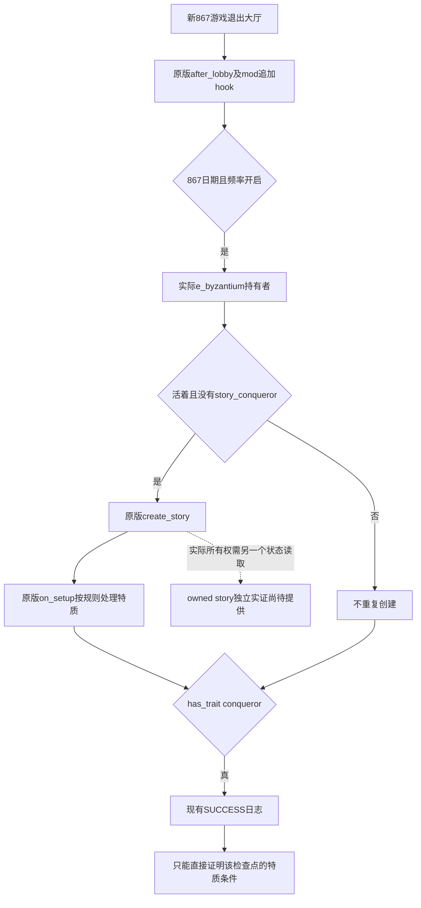

# Byzantium 867 - Conqueror v1.0.1：安装修复与实机验证

日期：2026-10-07（Asia/Shanghai）。本稿只封存已经完成的源码核对、安装修复和证据边界，**实机结果、实际人物身份和截图尚待 Root 填入**。不把源代码、安装收据或 SUCCESS 字符串的预期行为写成已经通过的实机测试。

## 已确认原因及修复

安装前，本机普通用户目录 `C:/Users/xenoa/Documents/Paradox Interactive/Crusader Kings III` 中，外层 `mod/byzantium_867_conqueror.mod` 与对应文件夹均不存在。该目录的 `launcher-v2_openbeta.sqlite` 以 SQLite `mode=ro` 核对：98个 mod 中目标条目为0，10个播放集中活动条目为0；`dlc_load.json:1` 的 `enabled_mods=[]`。这些是普通用户目录的加载前阻点，不是脚本授予失败的实证。

用户随后授权安装及867实测。13:27:50 已把 ZIP 中原样三个文件安装到该目录，并备份原 `dlc_load.json` 后只追加 `mod/byzantium_867_conqueror.mod`；其他字段和值保留。原 ZIP、三个 mod 文件内容以及其他 mod 都未修改。没有修改启动器数据库或播放集，不声称启动器已经重新扫描注册。

隔离测试准备目录 `Z:/ck3_mod_rewrite_process_assets/byzantium-867-review-20261007/real-test-userdir-01` 的外层 `.mod` 使用已安装源码的绝对路径，并只启用目标 mod。普通目录的外层 `.mod` 仍保留原包的相对路径。因此，Root 隔离实机的成功挂载、普通启用清单修复、普通启动器播放集注册是三个独立结论；不能相互代替。R67 最终实际采用的 userdir/state/source 由 Root 按真实 receipt 填入，不从最初准备目录推定。

证据包根目录：`Z:/ck3_mod_rewrite_process_assets/byzantium-867-review-20261007/`。初始状态见 `launcher-log-lane/result.json`；安装及原字节核对见 `installation-attempt-01/INSTALLATION-RESULT.json`，备份见 `installation-attempt-01/backups/dlc_load.json`。

## 1.20.0.4 原生脚本链

实际安装 `Z:/SteamLibrary/steamapps/common/Crusader Kings III/launcher/launcher-settings.json:6–7` 声明1.20.0.4；已有 exact4 构建身份直接复用，没有重新读取或哈希 EXE。以下游戏源码路径相对于该安装的 `game/`。

| 节点 | 实际源码与语义 |
|---|---|
| 新开局退出大厅 | `common/on_action/game_start.txt:2509–2511`：`on_game_start_after_lobby` 在单人玩家或主机退出大厅后执行，规则和玩家选择已经确定。 |
| 追加 mod hook | 原包 `zzz_byz867_conqueror_on_actions.txt:3–7` 使用 `on_actions` 调用独立初始化；不是给原版 hook 再加冲突 effect。 |
| 日期和频率 | mod第14–19行：867.1.1 ≤ 日期 < 868.1.1，且征服者频率不是“无”。 |
| 实际授予对象 | mod第21–24行：`title:e_byzantium.holder`；没有硬编码测试人物。 |
| 创建或保留故事 | mod第27–33行：持有者活着且没有 `story_conqueror` 时执行原版 `create_story = story_conqueror`；已有故事不重复创建。 |
| 故事创建回调 | `common/story_cycles/_story_cycles.info:5–8` 将故事刚创建时的回调命名为 **`on_setup`**；实际 `story_cycle_conqueror.txt:18` 使用该节点，并没有名为 `on_creation` 的节点。 |
| 规则与特质 | `story_cycle_conqueror.txt:21–28` 在关闭频率时结束故事；第100–106行在关闭加成时移除特质；普通分支第108–110行添加 `conqueror`，第113–115行给 `story_owner` 设置 `conqueror` 变量。 |
| 现有成功日志 | mod第35–37行只有 `has_trait = conqueror` 判断，随后输出 `BYZ867 v1.0.1: SUCCESS - emperor has conqueror trait`。 |

以上故事主体复用初次核对已缓存的 `zip-source-lane/NAMED-CONTEXT-AND-INSTRUCTIONS.json`；大厅及 info 的有限源码补充在 `live-source-preparation/FINITE-SOURCE-RECEIPT.json`。没有新增 mod 探针、强制授予 effect、翻译或原生代码。

## SUCCESS 对故事的证明边界

SUCCESS 直接证明 hook 的对应持有者通过了 `has_trait = conqueror`。源链说明 mod 使用原版故事机制；它没有在成功日志前再次检查 `any_owned_story`，也没有输出故事实例或所有者。

因此，单独 SUCCESS 不能当作 actual owned story 的独立读取。它不能区分“本次新创建”与“已有故事/已有特质”；即使新建分支源代码确实调用了 `create_story`，日志检查的仍然是特质，并非故事集合返回值。正确结论是“实际特质检查成功，源链使用原版故事”，而不是凭这一个字符串另行宣布“实际 owned story 已独立核验”。

本次对已有 MCP façade、`game_contract.hpp` 和 actual4 full-snapshot foundation 的有限源码核对，没有找到 `owned_story` / `story_conqueror` 输出。没有因此猜造某个 gameplay query 参数，也没有调用游戏或 SDK。

现成原版 UI 的具体源入口是 `gui/window_situation_list.gui:234–238`：`SituationGroupItem.GetItems` → `SituationItem.GetStoryCycle`，故事项明确在 `other` 页隐藏。这是已有故事显示入口；这些GUI行既未单独读取故事所有者，也未给出用于任意指定 AI 皇帝的已发布只读查询。因此若 Root 测试玩家为留里克，不能把当前玩家视图中的任意故事项直接当成拜占庭持有者的所有权证据。也不把该原版 getter 冒充已经实现的新 MCP observer。

如果 Root 的已有合法 observer/可见 UI 确实返回了目标持有者的故事集合，应记录该实际 observer 名、人物/故事类型/所有者与帧；未取得时，本报告明确写“未独立读取 owned story”。这不阻止按用户要求验证已显示的征服者特质及保存成功截图。

## Root 实机结果（待真实收口）

| 项目 | 当前本稿状态 |
|---|---|
| 实际测试进程、userdir、state/source、1.20.0.4身份 | 待 Root 填实际 receipt |
| 实际新开局日期与玩家/拜占庭持有者身份 | 待 Root 填；不预设 CharacterID |
| 目标 mod 实际挂载及 BYZ867 startup/SUCCESS 行 | 待 Root 填实际路径、行号和时点 |
| 皇帝 `conqueror` 特质可见结果及截图 | 待 Root 填截图路径；目前没有声称截图成功 |
| 实际 owned story 独立读取 | 未提供；若未取得则保留此边界 |
| 游戏规则、解析错误与任何失败 attempt | 待 Root 填实际内容，失败 attempt 保留 |
| 原 G2 与普通目录/播放集边界 | 安装线无进程操作；普通播放集数据库未改，隔离挂载单独记录 |

已有 `tools/run_acceptance.py` 导航写死1066罗贝尔；其日志 helper 过滤 `XAR:`，不能直接验证 BYZ867；原启动 helper 也不能原样组合 debug/userdir 与保留另一 CK3 进程。Root 的独立测试 harness 及 `real-test-recipe-lane/ROOT-RECIPE.md` 已记录这些限制。实际截图、native/UI输入和 SDK 仅由 Root 执行，不通过控制台添加特质或故事来制造结果。

本稿作者执行的游戏/SDK/测试/构建/EXE/大存档/Driver读取为0；只复用有限源数据并编写报告。最终是否通过须由 Root 按真实实机证据更新本节。
