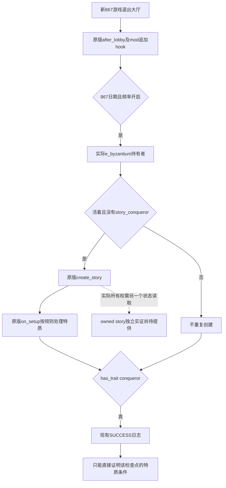

# Byzantium 867 - Conqueror v1.0.1：安装修复与实机验证

日期：2026-10-07（Asia/Shanghai）。**R71 实机验证通过：正常867留里克开局，拜占庭当前持有者 Basileios 的角色界面显示 Conqueror 特质及英文 tooltip。** 原包脚本未改，未复现脚本授予缺陷；本机已确认的问题是未安装、未启用，修复为安装及启用补齐。原生 SUCCESS 日志与当前人物 UI 分别留证；owned story 尚未独立读取，不影响此次特质验证。

## 已确认原因及修复

安装前，本机普通用户目录 `C:/Users/xenoa/Documents/Paradox Interactive/Crusader Kings III` 中，外层 `mod/byzantium_867_conqueror.mod` 与对应文件夹均不存在。该目录的 `launcher-v2_openbeta.sqlite` 只读核对：98个 mod 中目标条目为0，10个播放集中活动条目为0；`dlc_load.json:1` 的 `enabled_mods=[]`。这些是普通用户目录的加载前阻点，不是脚本授予失败的实证。

用户随后授权安装及867实测。13:27:50 已把 ZIP 中原样三个文件安装到该目录，并备份原 `dlc_load.json` 后只追加 `mod/byzantium_867_conqueror.mod`；其他字段和值保留。原 ZIP、三个 mod 文件内容以及其他 mod 均未修改。这次初始安装没有修改启动器数据库；后续登记单独记录。没有制作所谓“修复版 ZIP”。

最终成功的 R71 使用 `real-test-userdir-07`、`real-test-state-07` 与冻结的 g110-r16 Python 源码。隔离测试外层 `.mod` 指向已安装源码的绝对路径，并只启用目标 mod；普通目录外层 `.mod` 保留原包相对路径。隔离实机挂载、普通启用清单修复、普通启动器数据库登记是三个独立结论。

Root 在 2026-10-07 09:19:51 UTC 实际执行正常启动器登记 helper，exit0。SQLite 在线备份后，mod记录98→99、播放集10→11、成员关系43→44；新增专用 `Byzantium 867 - Conqueror` 播放集为 active1，目标 mod 为 enabled1，其他记录保留。**这证明数据库登记及激活完成，正常启动器 UI 尚未执行验证**；不得写成“Launcher verified”。

证据包根目录：`Z:/ck3_mod_rewrite_process_assets/byzantium-867-review-20261007/`。初始状态见 `launcher-log-lane/result.json`；安装及原字节核对见 `installation-attempt-01/INSTALLATION-RESULT.json`，备份见 `installation-attempt-01/backups/dlc_load.json`。数据库执行收据为 `normal-launcher-install-completion01/ROOT-NORMAL-LAUNCHER-REGISTRATION.json`，同目录保留 SQLite 备份。

## 1.20.0.4 原生脚本链

实际安装 `Z:/SteamLibrary/steamapps/common/Crusader Kings III/launcher/launcher-settings.json:6–7` 声明1.20.0.4；已有 exact4 构建身份直接复用，没有重新读取或哈希 EXE。以下游戏源码路径相对于该安装的 `game/`。

| 节点 | 实际源码与语义 |
|---|---|
| 新开局退出大厅 | `common/on_action/game_start.txt:2509–2511`：`on_game_start_after_lobby` 在单人玩家或主机退出大厅后执行，规则和玩家选择已经确定。 |
| 追加 mod hook | 原包 `zzz_byz867_conqueror_on_actions.txt:3–7` 使用 `on_actions` 调用独立初始化；不是给原版 hook 再加冲突 effect。 |
| 日期和频率 | mod第14–19行：867.1.1 ≤ 日期 < 868.1.1，且征服者频率不是“无”。 |
| 实际授予对象 | mod第21–24行：`title:e_byzantium.holder`；没有硬编码测试人物。 |
| 创建或保留故事 | mod第27–33行：持有者活着且没有 `story_conqueror` 时执行原版 `create_story = story_conqueror`；已有故事不重复创建。 |
| 故事创建回调 | `common/story_cycles/_story_cycles.info:5–8` 将故事刚创建时的回调命名为 **`on_setup`**；实际 `story_cycle_conqueror.txt:18` 使用该节点，并没有名为 `on_creation` 的节点。 |
| 规则与特质 | `story_cycle_conqueror.txt:21–28` 在关闭频率时结束故事；第100–106行在关闭加成时移除特质；普通分支第108–110行添加 `conqueror`，第113–115行给 `story_owner` 设置 `conqueror` 变量。 |
| 现有成功日志 | mod第35–37行只有 `has_trait = conqueror` 判断，随后输出 `BYZ867 v1.0.1: SUCCESS - emperor has conqueror trait`。 |

以上故事主体复用初次核对已缓存的 `zip-source-lane/NAMED-CONTEXT-AND-INSTRUCTIONS.json`；大厅及 info 的有限源码补充在 `live-source-preparation/FINITE-SOURCE-RECEIPT.json`。没有新增 mod 探针、强制授予 effect、翻译或原生代码。

## SUCCESS 对故事的证明边界

SUCCESS 直接证明 hook 的对应持有者通过了 `has_trait = conqueror`。源链说明 mod 使用原版故事机制；它没有在成功日志前再次检查 `any_owned_story`，也没有输出故事实例或所有者。

因此，单独 SUCCESS 不能当作 actual owned story 的独立读取。它不能区分“本次新创建”与“已有故事/已有特质”；即使新建分支源代码确实调用了 `create_story`，日志检查的仍然是特质，并非故事集合返回值。正确结论是“实际特质检查成功，源链使用原版故事”，而不是凭这一个字符串另行宣布“实际 owned story 已独立核验”。

本次对已有 MCP façade、`game_contract.hpp` 和 actual4 full-snapshot foundation 的有限源码核对，没有找到 `owned_story` / `story_conqueror` 输出。没有因此猜造某个 gameplay query 参数，也没有调用游戏或 SDK。

现成原版 UI 的具体源入口是 `gui/window_situation_list.gui:234–238`：`SituationGroupItem.GetItems` → `SituationItem.GetStoryCycle`，故事项明确在 `other` 页隐藏。这是已有故事显示入口；这些GUI行既未单独读取故事所有者，也未给出用于任意指定 AI 皇帝的已发布只读查询。因此若 Root 测试玩家为留里克，不能把当前玩家视图中的任意故事项直接当成拜占庭持有者的所有权证据。也不把该原版 getter 冒充已经实现的新 MCP observer。

如果 Root 的已有合法 observer/可见 UI 确实返回了目标持有者的故事集合，应记录该实际 observer 名、人物/故事类型/所有者与帧；未取得时，本报告明确写“未独立读取 owned story”。这不阻止按用户要求验证已显示的征服者特质及保存成功截图。

## R71 实机结果

| 项目 | 实际结果与证据 |
|---|---|
| 实际运行身份 | R71 `b1a003e6-3d93-4822-b87b-f28077523795`，PID82140；userdir/state07；Python 源码冻结于 `C:/codex-ck3-background/migration4-entry-live-fix/g110-r16`，游戏1.20.0.4。 |
| 普通开局输入 | 官方 `-skip -bookmark=bm_867_adventurers -play=d_novgorod`，独立 userdir；Bridge、注入器、MCP 均为0，没有用控制台或强制 effect 添加特质。 |
| 玩家与日期 | Root 目视原截图2：留里克，正常867开局，暂停于867年1月2日。 |
| 当前拜占庭持有者 | Root 目视原截图7：当前 `e_byzantium` 持有者为 Basileios；从当前头衔 UI 打开，没有从测试日志或固定人物 ID 推定。 |
| 原脚本实际执行 | userdir07 `logs/debug.log:5995–5996`，日志时刻16:43:36：原 mod startup hook 与 `BYZ867 v1.0.1: SUCCESS - emperor has conqueror trait`。已安装原文件未改。 |
| 特质实际可见 | Root 目视原截图12：同一位 Basileios 的角色界面及英文 Conqueror tooltip；绿色龙图标与原版 `conqueror.dds` 一致。 |
| owned story | 未独立读取；不把日志或特质截图扩张为故事集合证明，不阻碍本次特质验证。 |
| 普通启动器 | Root 已实际完成数据库登记及专用播放集激活；正常启动器 UI 验证仍为 NOT_RUN。 |
| 正常回收 | Root 于17:22:55 CST完成 owned tracked-stop：cleanup_proven、进程树已消失、job活动计数0、watchdog不存在、无残留CK3。`ck3_exit_code=1` 是这次有意停止的实际结果，不写成游戏exit0。最终收据内嵌 `artifacts/ROOT-BYZANTIUM-VANILLA05-REAL-TEST.json` 的实际回收证据。 |

最终证据索引为 [ROOT-BYZANTIUM-867-REAL-TEST.json](Z:/ck3_mod_rewrite_process_assets/byzantium-867-review-20261007/success-evidence-r71/ROOT-BYZANTIUM-867-REAL-TEST.json)，记录实际回收及三张原截图副本的哈希。原截图复制为：

- [normal-867-rurik.png](Z:/ck3_mod_rewrite_process_assets/byzantium-867-review-20261007/success-evidence-r71/normal-867-rurik.png)：原截图2，正常留里克开局与867年1月2日。
- [byzantium-current-holder.png](Z:/ck3_mod_rewrite_process_assets/byzantium-867-review-20261007/success-evidence-r71/byzantium-current-holder.png)：原截图7，当前拜占庭持有者。
- [basileios-conqueror-tooltip.png](Z:/ck3_mod_rewrite_process_assets/byzantium-867-review-20261007/success-evidence-r71/basileios-conqueror-tooltip.png)：原截图12，同一皇帝与 Conqueror tooltip。

R68 导航 RED 保留。R69/R70 的自动大厅及内部脚本测试没有归因为 mod 故障；无 debug 仍运行内部测试的反证也保留，调度原因尚未查明。R71 的角色、日期、持有者、特质结论来自独立当前 UI，不拿内部测试的历史变更当作当前世界状态。

已有 `tools/run_acceptance.py` 导航写死1066罗贝尔；其日志 helper 过滤 `XAR:`，不能直接验证 BYZ867。Root 使用独立测试 harness 完成此次普通867开局和截图，不通过控制台添加特质或故事制造结果。

本稿作者执行的游戏/SDK/测试/构建/EXE/大存档/Driver读取为0；只复用有限源数据及 Root 已实际审阅的证据编写报告。实机与正常数据库执行均由 Root 完成。本次结论为原 v1.0.1 的 Conqueror 特质实机 GREEN、安装修复完成；启动器 UI 与 owned story 的未验边界保持明确。
