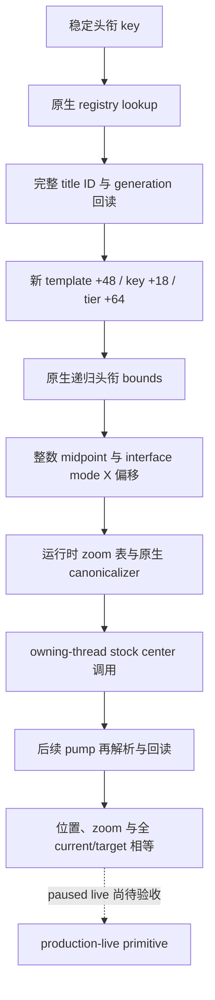

# CK3 1.20.0.2 头衔定位与镜头迁移

本包为 **static-ready**。只读取冻结 EXE 与合成 fixture，没有读取玩家进程、移动镜头、发送游戏命令或重启游戏。新版本实际的头衔解析、原生镜头调用和后续 pump 的稳定回读仍需 paused live 验收。

精确构建：CK3 1.20.0.2，EXE SHA-256 `AE1BA6FF060BA603842F6F4A2DED0AF4B7D3666B3DD271F75FB01B0DA8E81B2D`。公共 `title-map-navigation-v1` 请求、响应与完成谓词保持原有 schema；新 backend 为 `ck3-1.20.0.2-native-title-map-navigation-v1`。

## 已闭合的变化

| 绑定 | 1.19.0.6 | 1.20.0.2 | 新构建实证 |
| --- | --- | --- | --- |
| 头衔按 key 解析 | `0xA0DC00` | `0xA847A0` | 调用 registry `0x29EBFA0`，GameData manager `+0x2FF8` |
| 头衔 storage / fallback | `0x570C410` / `0x570C3F8` | `0x5D1DAF8` / `0x5D1DAE0` | key getter 与 bounds helper 的 RIP 消费者 |
| 头衔 template 指针 | `+0x160` | `+0x48` | registry build `0x29EF383`、province getter `0x230F900` |
| template key / tier | `+0x18` / `+0x5C` | `+0x18` / `+0x64` | registry build 与 province getter 的读取 |
| 原生 province getter | `0x20B6B20` | `0x230F900` | county 递归第一个子头衔，其他头衔读取 `+0x338` |
| 原生递归 bounds | `0x20B7DD0` | `0x2311040` | 子头衔 ID 数组 `+0x110`、数量 `+0x11C`、精确 generation 复核 |
| handler camera 指针 | `+0x628` | `+0x670` | target writer `0xAF3E3B` |
| 原生 center / target writer | `0xA79C70` / `0xA79B10` | `0xAF3FB0` / `0xAF3E30` | bounds → midpoint → mode offset → zoom → target 的完整链 |
| 镜头 canonicalizer / update | `0x3473590` / `0x3473630` | `0x3846160` / `0x3846200` | 当前与目标状态分别规范化，后续插值与收敛 |

GameData province 指针数组 `+0x140`、数量 `+0x14C`，ProvinceID `+0x10` 保持不变。镜头 current `+0x710`、target `+0x728`、zoom index `+0x744`、transient X/Z `+0x75C` / `+0x760`、target inhibition `+0x777` 以及 zoom/param4 表的布局均有新构建消费者闭合。

`0x2311040` 用 province `+0x85C == 0x50726F76` 判断实际 Province；未得到有效 Province 时继续递归头衔 bounds。因此新解析器把原生空 Province 当作“没有 capital provenance”，仍允许解析高层头衔。ProvinceID 只作来源说明，镜头后置条件继续使用完整头衔 bounds。

## 代码与离线证据

- `ck3_12002_title_map.hpp` 提供新构建的 title/camera environment 与 resolver、advance API。
- `ck3_12002_title_map.cpp` / `ck3_12002_title_map_camera.cpp` 使用上述新布局与原生绑定；共享游戏 DTO 保持 wire 兼容。
- `ck3_1_20_0_2_title_map.json` 冻结 13 段完整函数、49 条语义指令、3 组 vtable prefix 与代码常量。
- `verify_ck3_12002_title_map.py` 从磁盘复核 EXE SHA、函数哈希、指令、RIP 目标、vtable 与代码常量；不访问游戏进程。
- MSVC x64 三组 fixture 已通过：title key/generation/template/province 往返，camera 首次 dispatch、后续 pump 收敛、原生 opaque 参数 clamp、临时偏移、zoom、状态漂移和失败回读，以及成功结果的新构建身份序列化。新增旧布局 decoy 和原生空 Province fixture。
- 编译与验证产物：`artifacts/migrations/2026-09-30/post-update-1.20.0.2/build-title-map-msvc/`。

## 集成与实机边界

新 typed dispatch 使用新 environment 和 `AdvanceTitleMapNavigationCommandV1`；协议 parser 复用原 schema，独立 `ck3_12002_title_map_serializer.cpp` 输出新 version、SHA 与 backend。

每个 owning-thread callback 只 advance 一次。首次调用写 target 后返回 `pending`，worker reclaim ticket 后重新提交，下一个 pump 再回读。默认整体预算 15 秒、最多 600 次 callback；发送 ACK 不等于镜头稳定完成。

唯一游戏相关的剩余验收是：暂停状态下原生 key/province 往返、stock center 调用、跨 pump 稳定回读及 production typed dispatch。当前不宣称新版本已有 live 能力。
