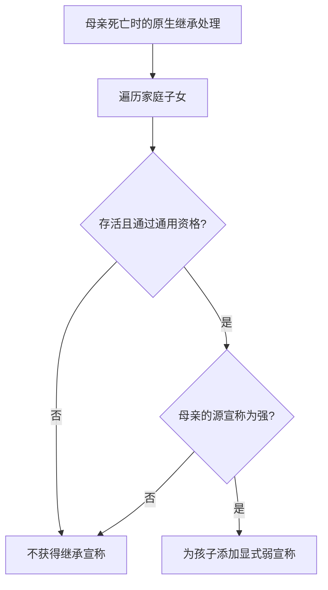

# CK3 1.20.0.3：侧室子女继承母亲的宣称

> 2026-10-10 主线整合：恢复来源提交 `30318ac960d39731bddc44ce88ae50fc2280fd28` 的研究。下文“当前”均指原调查时的构建与样本；没有新增实机验收，也没有把结论外推到 CK3 1.20.0.4。文中外置原始路径是历史定位，本次未重新读取那些原件。

调查时间：2026-10-04 16:17（Asia/Shanghai）。用户要求调查代码、给出判断依据，并说明是否必须实机。范围为原版头衔宣称，没有修改玩法或自动玩家策略，没有启动、读取或操作游戏进程。

## 结论

**可以，侧室身份本身不阻止子女继承母亲的强宣称。** 母亲死亡时，符合通用宣称继承资格的存活子女获得弱宣称；母亲原有的弱宣称不会传下去。不能将“侧室之子”与带有 `bastard` 特质的未合法化私生子混为一谈。

这是当前构建的静态代码结论，通则不以实机为必要前提。本次没有实机互证，也不声明某个具体存档、特殊头衔或外部 mod 的实际结果。具体子女仍须通过性别继承法、其他特质等通用资格判定；头衔本身的宣称添加规则同样适用。

## 构建与范围

| 冻结项 | 值 |
|---|---|
| 当前安装 | `Z:\SteamLibrary\steamapps\common\Crusader Kings III` |
| launcher version / rawVersion | `1.20.0.3 (Crozier)` / `1.20.0.3` |
| Steam buildid | `25652598` |
| ck3.exe SHA-256 | `94B55397ABB687A3DCD436805A5D885E6BE90FA6C693FEB44A9E3BBEEADE02A6` |
| 证据等级 | `research`，原版数据与当前 EXE `static-confirmed`；非 live |

版本来自安装内 `launcher/launcher-settings.json:6` 与 Steam `appmanifest_1158310.acf:13`，EXE 哈希本次重新计算。仓库内 `Crusader Kings III/` 是 1.19.0.6 / EXE `2D00FF3101EF70B566F2FCBAE292F09263199C80E9DC8F139B82D7D96F83DB86` 的参考副本；发现后切换当前安装，以下行号与逆向证据均指向 1.20.0.3。没有用旧构建 ABI 直接作新版结论。

以下原版路径相对于当前安装的 `game/`。证据保存于 `artifacts/research/2026-10-04-concubine-claims/`，摘要与文件哈希见该目录 `evidence.json`。

## 原版数据的直接依据

| 证据 | 原版位置 | 判断意义 |
|---|---|---|
| `claim_inheritance_blocker` 默认 `none` | `common/traits/_traits.info:66`–`:74` | 原版明确说明宣称继承阻断字段沿用继承字段语义，缺省不阻断。支持 `none/dynasty/secular/all`。 |
| 两种侧室子女特质都没有继承阻断字段 | `common/traits/00_traits.txt:11666`、`:11696` | `child_of_concubine_female` / `_male` 都没有 `inheritance_blocker` 或 `claim_inheritance_blocker`，与私生子特质互斥。后缀指侧室父母的性别，注释分别写母亲/父亲是侧室，不是孩子的性别。 |
| 私生子明确禁止继承宣称 | `common/traits/00_traits.txt:11579`–`:11580` | `bastard` 同时设置 `inheritance_blocker = all` 和 `claim_inheritance_blocker = all`，与侧室子女形成直接对照。 |
| 出生链标记侧室子女 | `common/on_action/child_birth_on_actions.txt:1110`–`:1124` | 母亲 `is_concubine_of = scope:father` 时加 `_female`；父亲是母亲侧室时加 `_male`。 |
| 家族归属另行处理 | `common/on_action/child_birth_on_actions.txt:978`–`:999` | 母系婚姻/男性侧室走母亲家族，通常情形走父亲家族；家族归属并不是只允许继承其中一方宣称的规则。 |
| 强宣称传给孩子时变弱，弱宣称不继承 | `localization/english/game_concepts_l_english.yml:987`、`:992`；中文同文件 `:966`、`:971` | 原版机制说明直接给出传递规则，用来与原生写入路径互证。 |

主 mod 与白绮独立版脚本中检索 `claim_inheritance_blocker`、`child_of_concubine`、`remove_claim` 未发现覆盖这条规则的实现。此检查范围不包括任意其他已安装 mod。

## 当前 EXE 的原生依据

下列 RVA 均来自本次读取的 exact EXE。函数语义名为依据调用和字段使用作出的识别，不是公开 C++ 源码或符号。逆向只做只读磁盘反汇编，没有调用游戏函数。

1. **原生继承处理直接按家庭关系列表分发强宣称。** `0x278D510` 的 `0x278D56F` 调 `0x28C6A30` 取得当前角色的显式宣称数组；`0x278D577..0x278D59B` 读取 `CCharacter+0x1A8` 家庭对象的 `+0x38` 列表并逐项解析。该列表的子女含义与出生关系处理及原版“children”宣称说明互证，是语义识别。`0x278D5E5` 跳过已死亡项，`0x278D5F9` 调通用资格函数 `0x2B9E940(child, parent)`，没有先按正妻/侧室或父母性别筛选。
2. **只传强宣称，并以弱宣称写入。** `0x278D618` 检查源 `CClaim+0x10`，为零就跳过；数组 stride 为 `0x18`。`0x278D665` 将 `R8D` 清零，再在 `0x278D66B` 调 `0x28C65D0(child, title, strong=false, ...)`。添加函数 `0x28C6808` 将 `R12B`（来自传入 `R8B`）写入目标 claim 的 `+0x10`，`0x28C680D` 将 `+0x11` 的 implicit 写为零。这是显式弱宣称的实际写入，和机制说明一致。
3. **资格函数没有侧室身份专门禁令。** 完整 `0x2B9E940..0x2B9EB94` 检查父母对象、宗族关系、孩子特质的资格字节 `+0x4AA`，以及父母侧的性别继承法。特质零值在 `0x2B9EA41..0x2B9EA43` 直接继续，非零值才进入同宗族、神职例外或完全阻断分支。随后按性别法与孩子性别判断。通用函数未读取配偶/侧室关系，也未要求孩子与母亲同家族；只有相应阻断特质的非零分支使用宗族限制。
4. **母系关系没有被排除。** 当前 claim getter `0x2B9ECD0` 在没有已有显式宣称时依次解析家庭对象的两个父母 ID，在 `0x2B9EDE6`、`0x2B9EE42` 调同一父母资格路径 `0x2BB42D0`。这一 getter 路径处理潜在宣称，不能单独冒充死亡后的强宣称转移；它这里只作为父母两侧都进入宣称系统的补充证据。

继承处理的直接调用点为 `0x289FF0E` 与 `0x28B603E`，均调用 `0x278D510`；前者明确将第五参数置零，进入上述强宣称分发分支。调用点及函数完整范围一并留在 artifact，避免只凭本地化或“没有配置字段”推断引擎实现。



侧室之子特质采用缺省的不阻断配置，因此在没有其他资格限制的情况下走正常子女分支。性别法或其他特质导致的拒绝，应按对应通用条件解释，不能归因为“母亲是侧室”。

## 复现与验证边界

已完成当前 EXE SHA/版本核对、原版脚本和 `.info` 阅读、上述函数与直接调用点的静态反汇编；保存源文件 SHA、原生区间 SHA 和反汇编文本。本次文档检查覆盖本地链接、引用行号、代码围栏和 `git diff --check`。没有运行无关 mod L0 或游戏 L1–L3，也没有新的 live artifact、bridge/MCP capability 或 readiness 升级。

复用仓库只读工具即可重现；指定 `-3` 使用已具备 `capstone/pefile` 的 Python，显式传当前安装 EXE，不使用工具的旧安装默认路径：

```text
py -3 ck3_autonomous_player/native_bridge/research/disasm_ck3.py 0x278D510 --size 0x189 --exe "<frozen-1.20.0.3-ck3.exe>"
py -3 ck3_autonomous_player/native_bridge/research/disasm_ck3.py 0x2B9E940 --size 0x239 --exe "<frozen-1.20.0.3-ck3.exe>"
py -3 ck3_autonomous_player/native_bridge/research/disasm_ck3.py 0x28C67CF --size 0x46 --exe "<frozen-1.20.0.3-ck3.exe>"
```

如后续问题针对“这个存档里的某个孩子为什么没得到某个宣称”，才需要结合该母亲死亡前的强弱宣称、孩子资格、头衔状态及实际加载 mod 查看存档或实机；这不影响这里对原版通则的代码判断。
