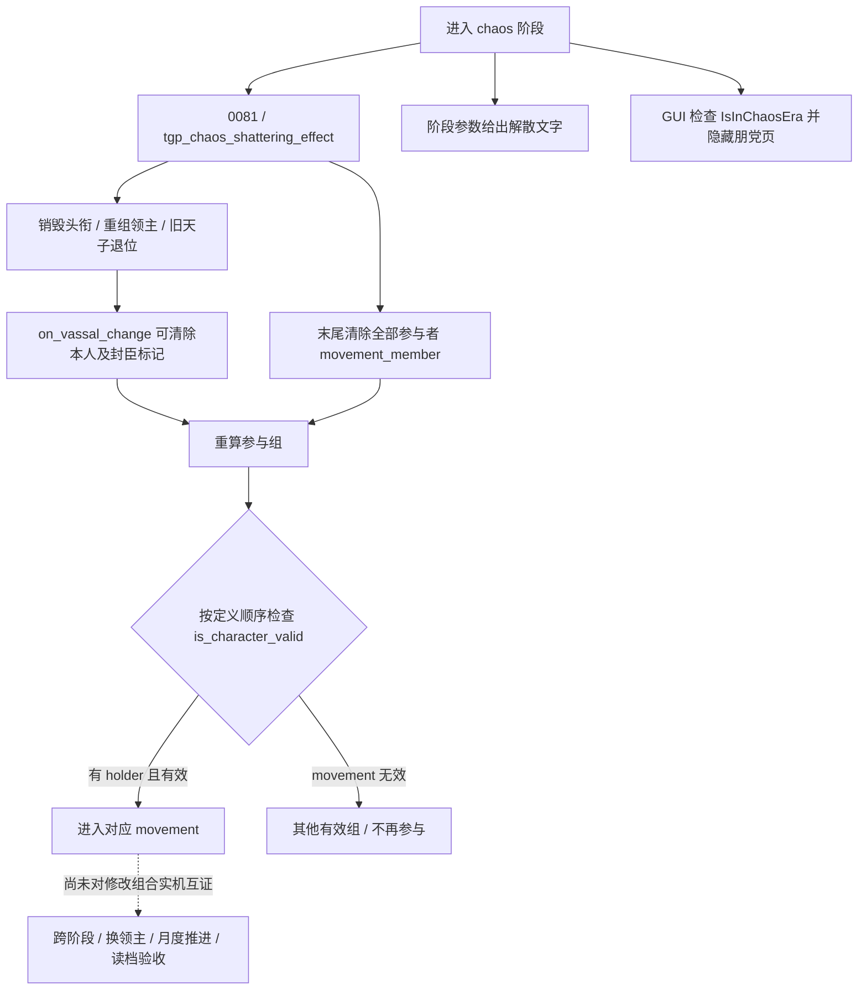

# CK3 1.20.0.3：群雄割据阶段保留朋党

> 2026-10-10 主线整合：恢复来源提交 `373c03198557e211b4830bb6cc29cc746e92e784` 的研究。下文“当前”均指原调查时的构建与样本；没有新增实机验收，也没有把结论外推到 CK3 1.20.0.4。文中外置原始路径是历史定位，本次未重新读取那些原件。

调查日期：2026-10-05（Asia/Shanghai）。用户要求调查原版脚本和二进制，解释为何保留霸权头衔后派系仍退出、轮盘仍显示解散，并给出修改入口。本次只读调查当前安装；没有修改 mod、游戏安装或存档，没有启动或操作游戏。

## 结论

**仅阻止销毁 `h_china` 不足以保留原成员关系。原版还有两处主动清除归属、废黜旧天子的步骤，以及独立的界面隐藏和“解散”提示。** 已定位的这些路径可从脚本和 GUI 修改，不需要先补丁 EXE。下面是静态确认的修改入口，完整组合尚未实机验收；用户所用 mod 的具体覆盖内容未提供，不能声称已经修好其存档。

这里的“派系”指王朝轮回的朋党 `movement`：尊王、进取、攘夷、守旧及中立，底层是 situation 的 `participant_groups`。它们和普通索求者、独立、自由权派系的 `common/factions/` 系统不同。当前原版中文阶段名为“群雄割据”，内部键为 `situation_dynastic_cycle_phase_chaos`。

## 当前构建与证据

| 项目 | 值 |
|---|---|
| 当前安装 | `Z:\SteamLibrary\steamapps\common\Crusader Kings III` |
| launcher version / rawVersion | `1.20.0.3 (Crozier)` / `1.20.0.3` |
| Steam buildid | `25652598` |
| EXE SHA-256 | `94B55397ABB687A3DCD436805A5D885E6BE90FA6C693FEB44A9E3BBEEADE02A6` |
| 状态 | `research` / `static-confirmed`；没有 live artifact |

仓库内 `Crusader Kings III/` 是旧版 1.19.0.6 参考副本。本次发现后切换当前 Steam 安装核对全部结论。以下原版路径和行号均相对当前安装的 `game/`。摘要、源文件 SHA-256、带行号摘录及四段反汇编保存在 `artifacts/research/2026-10-05-dynastic-movements/evidence.json` 及同目录 `*.asm.txt`；`capture_evidence.py` 是当次只读采集脚本。artifact 未纳入 Git。

## 成员为什么仍然退出

1. **进入阶段时主动执行天下分裂。** `common/situation/situations/tgp_dynastic_cycle.txt:1831` 的 chaos `on_start` 触发 `tgp_dynastic_cycle.0081`；事件在 `events/dlc/tgp/tgp_dynastic_cycle_events.txt:1226` 调 `tgp_chaos_shattering_effect`。
2. **该 effect 不止销毁霸权头衔。** `common/scripted_effects/10_dlc_tgp_dynastic_cycle_scripted_effects.txt:409` 起依次销毁旧天子的高等级头衔、处理独立和重新组织封臣/朝贡关系。末尾 `:662` 仍有 `force_step_down_landed_titles = yes`，所以取消 `destroy_title` 不等于保留旧持有者和领主结构。
3. **即使跳过销毁，末尾也明确清掉旧归属。** 同文件 `:665`–`:670`：

```text
situation:dynastic_cycle = {
    every_situation_participant = {
        remove_variable = movement_member
        recalculate_participant_group = situation:dynastic_cycle
    }
}
```

4. **改换领主也能独立清除归属。** `common/on_action/title_on_actions.txt:4845` 的 `on_vassal_change` 在 `:5002`–`:5021` 检查：角色参与轮回、没有 `h_china`，并且成为独立统治者或其直属领主属于 `other_rulers`。满足时清掉本人及 `every_vassal_or_below` 的 `movement_member`，再重算本人参与组。只移除上面 effect 的末尾清理，仍可能被这个钩子清掉。
5. **重算使用有效性，而不是永久保留手动分组。** `common/situation/situations/_situations.info:102` 起说明每角色每子区域只能属于一组、自动选第一个有效组，`:145` 起明确 `is_character_valid` 同时决定“能加入”和“能留下”。`tgp_dynastic_cycle.txt:156`、`:214`、`:272`、`:330`、`:388` 的五个 movement 都先要求 `exists = title:h_china.holder`。没有已存 `movement_member` 等条件时，再检查是天子封臣/带政治册封标记的朝贡国，并重新选择朋党。`other_rulers` 位于最后，头衔无持有者时其分支为 `always = yes`，但仍受 situation 的通用参与/地域条件约束。

`movement_member` 是角色上的类别标记；`top_participant_group:dynastic_cycle` 是实际组归属。设置标记不等于立即完成组转移，重算也不会保证角色永久留组。相反，留组所需条件成立且清理路径已移除时，不需要用每天反复加入掩盖归属丢失。



## 轮盘“解散”与成员资格分别控制

**“解散”提示来自阶段数据。** chaos 的 `modifier_sets → dynastic_cycle_government_effects` 在 `tgp_dynastic_cycle.txt:1880` 起，对天子和五个 movement 共六组设置 `dynastic_cycle_no_movement = yes`。中文 `localization/simp_chinese/dlc/tgp/dlc_tgp_situation_parameters_l_simp_chinese.yml:133` 将它显示为 `#weak 解散#!`；英文同路径文件 `:139` 为 `#weak Dissolved#!`。

对当前 `game/` 的该键引用检索，只找到上述阶段定义与各语言本地化；当前 EXE 也未找到该完整字符串。原版 `.info:345` 把该位置定义为阶段内启用的 situation parameters。因此这里已确认的是阶段提示来源，不能把这个文字当作运行时成员存在性查询，也不能把删除提示当作恢复成员的动作。

**朋党页另有 GUI 阶段限制。** `gui/window_tgp_dynastic_cycle.gui`：

| 行号 | 位置 | 原版条件 |
|---|---|---|
| `93` | `dynastic_cycle_tabs`，含朋党页签 | `Not( SituationDynasticCycleWindow.IsInChaosEra )` |
| `153` | 王朝轮回主体 scrollbox | `Or( GetVariableSystem.Exists( 'dynastic_cycle' ), SituationDynasticCycleWindow.IsInChaosEra )` |
| `649` | `movements_scrollarea` | `And( GetVariableSystem.Exists( 'movements' ), Not( SituationDynasticCycleWindow.IsInChaosEra ))` |

允许 chaos 阶段查看朋党时，需要放开页签和朋党页隐藏，同时修改王朝轮回主体在 chaos 时强制显示的条件，避免点朋党页后两个主体同时显示。保留默认开窗选择王朝页的逻辑即可。不是把全文件所有 `IsInChaosEra` 一律删除；群雄列表等位置仍承担本阶段的实际布局。

## 二进制确认：界面直接认阶段

以下 RVA 均绑定上述 EXE，语义由 GUI 注册、字符串绑定和调用链识别，不是公开 C++ 源码。

- `0x2C2440` 的注册函数在 `0x2C2499`、`0x2C24A6` 分两段读取字符串 `IsInChaosEra`（字符串 RVA `0x458D148`）；`0x2C2517` 绑定 adapter `0x17755B0`。短字符串使用 `movsd` 等复制，因此仅搜索 RIP-relative `lea` 会漏掉这条注册链。
- adapter `0x17755B0` 在 `0x17755C2` 调 `0x1771F20`，再把返回布尔值写入 GUI result。
- `CSituationDynasticCycleWindow` 构造链在 `0x1770447` 读取 `situation_dynastic_cycle_phase_chaos`（字符串 RVA `0x458CEF0`），查取 token 后在 `0x1770475` 存到窗口 `+0x56C`。
- `0x1771F20` 解析该窗口绑定的 situation、top sub-region 和当前 phase type；`0x1771FBA` 读取窗口 `+0x56C`，`0x1771FC1` 取当前 phase type，`0x1771FC8` 比较其 token，`0x1771FCB` 返回相等结果。这个判定没有查询 `h_china.holder` 或参与组成员数量。

所以原阶段仍为 chaos 时，保留霸权头衔、改变朋党标记或重新加入成员都不会令 `IsInChaosEra` 变成 false。可以改调用它的 GUI 条件；不需要修改这个原生 getter。这里没有以局部反汇编宣称已经排除整个 EXE 内的所有特殊机制。

## 可施工的最小修改组合

目标是保留已有朋党成员，同时允许真正发生群雄割据，推荐按以下顺序修改用户自己的 mod 覆盖：

1. 在 `tgp_chaos_shattering_effect` 保留 `movement_member`，取消末尾无条件清除。检查 `force_step_down_landed_titles` 与实际的 `h_china.holder`：保留定义/不销毁，不等于持有者一直有效。重算可以在修改资格条件以后保留。
2. 让 `on_vassal_change` 中上述朋党清理块在 chaos 阶段跳过，其他阶段沿用原行为。如果天下分裂还有用户自定义清理钩子，也需要按其实际脚本处理。原版 on_action 同名定义会覆盖，不合并；另加一个钩子不会撤销已经执行的原版删除。
3. 对五个 movement 的 `is_character_valid` 增加 chaos 保留分支，以已存标记维持归属。以下仅是进取派替换结构示例；`trigger_else` 中放完整原有条件，其余四组使用自己的 flag：

```text
is_character_valid = {
    trigger_if = {
        limit = {
            scope:situation = {
                situation_current_phase = situation_dynastic_cycle_phase_chaos
            }
        }
        has_variable = movement_member
        var:movement_member = flag:advancement
    }
    trigger_else = {
        # 完整保留原 is_character_valid 内容
    }
}
```

这利用 `.info` 明确提供的 `scope:situation`，并确保无标记角色不会误被第一个朋党接收；没有把所有组改成 `always = yes`。该分支允许保存了原类别的独立者/封臣在没有天子时也留组，同时继续服从通用参与/地域条件。原版有 `movement_member` 时本就绕过首次臣属身份检查，因此 holder 一直存在、标记未被清除的情况下，独立成员也有原版留组路径，不一定要改资格；若希望即使无 holder 也保留朋党，再添加上述 chaos 分支。

4. 删除 chaos 中六处 `dynastic_cycle_no_movement = yes`，并按上节放开 GUI 页签和朋党页。对页签、王朝主体、朋党主体可分别改成 `visible = yes`、`[GetVariableSystem.Exists( 'dynastic_cycle' )]`、`[GetVariableSystem.Exists( 'movements' )]`。若依然保留天下分裂，群雄列表可继续使用原 chaos 布局。
5. 同步修正文案中“所有朋党解散”等旧描述。恢复选择/切换朋党不是“保留旧成员”的必要条件；若要开放这项玩法，还需单独解除 `common/decisions/dlc_decisions/tgp/tgp_dynastic_cycle_decisions.txt:257` 的 chaos 禁止条件及所需互动限制。现有 power、受宠和领袖选举在修改组合下的行为尚未实机核对。

如果目标实际上是“仅阶段名变为群雄割据，原帝国和朋党都保持”，也可以替换 chaos 的天下分裂调用为自定义无清理流程。这会改变独立、朝贡和退位等游戏行为，不能和保留真实割据下的朋党视为同一结果。

## 验证边界与下一入口

本次已做一次当前构建的脚本/本地化/GUI 检索、EXE 指纹确认和上述原生调用链反汇编，没有实机或存档修改。它给出具体原因和可施工入口，不宣称组合补丁已通过游戏验收，也不把提示消失当成成员恢复。

实施后需比较进入 chaos 前后同一角色的 `movement_member` 与实际 `top_participant_group`，覆盖原天子封臣、独立军阀及其封臣；再核对一次换领主、月度推进和存读档，确认没有重复退出/加入。界面验收应同时检查组列表、领袖、人数/权势和轮盘提示。若存档已丢标记，可依据仍保留的 `former_movement_member` 等记录评估一次性恢复，但不保证旧记录未被清理，不能只删除新清理代码就自动找回旧成员。

本次未新增 bridge/MCP、自动玩家策略或 live 能力，自动玩家 readiness 不变。用户后续明确要求暂不实机验证，只交付改前/改后文档；对应交付见[mod 修改方案](ck3-1.20.0.3-dynastic-cycle-movement-mod-changes.md)。
