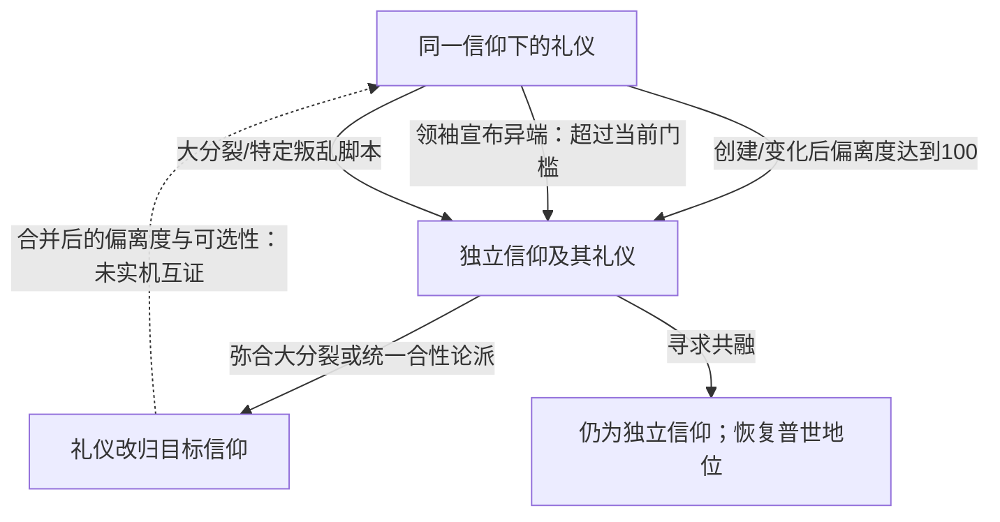

# CK3 1.20.0.3：礼仪独立与信仰重新并入

研究日期：2026-10-04（Asia/Shanghai）。范围：当前原版玩家机制与脚本接口；没有修改 mod、执行游戏动作或验收自动玩家。

## 结论与构建

新版层级是 **宗教组 → 宗教大类（religion）→ 信仰（faith）→ 礼仪（rite）**。“独立出宗教”通常实际指礼仪升格为独立信仰，仍属于原宗教大类。

通用途径是偏离度达到100，或信仰领袖在较低异端门槛上宣布礼仪为异端。特定历史机制包括东西教会大分裂和阿扎里加叛乱胜利。重新吸纳的原版机制是**弥合大分裂、统一合性论派教会**；**寻求共融只恢复普世地位，保留独立信仰**。已查脚本没有任意两信仰通用的玩家合并互动。

| 冻结项 | 当前值 |
|---|---|
| 安装目录 | `Z:\SteamLibrary\steamapps\common\Crusader Kings III` |
| launcher version / rawVersion | `1.20.0.3 (Crozier)` / `1.20.0.3` |
| Steam buildid | `25652598` |
| ck3.exe SHA-256 | `94B55397ABB687A3DCD436805A5D885E6BE90FA6C693FEB44A9E3BBEEADE02A6` |
| 证据等级 | 原版脚本 / defines / GUI / 官方说明：`static-confirmed`；非 live |

版本来源：安装内 `launcher/launcher-settings.json:6`、Steam `appmanifest_1158310.acf:13`；当次重新计算 EXE SHA。仓库 `Crusader Kings III/` 是1.19.0.6旧安装，迁移记录冻结的1.20.0.2也不是当次当前构建；没有沿用它们的ABI或实机等级。

以下路径相对于当前安装的 `game/`。没有开展EXE调用链逆向；自动分离的入口由defines、GUI、on_action及官方说明支持，不推断原生内部刷新时机。

## 一、礼仪如何独立

| 机制 | 条件与结果 | 原版证据 |
|---|---|---|
| 创建时直接独立 | 创建礼仪的偏离度 **≥100**，确认项变为创建新信仰；不必先创建礼仪再等领袖驱逐。 | `common/defines/00_defines.txt:831`；`localization/english/gui/rite_creation_window_l_english.yml:50` |
| 既有礼仪自动分离 | 与主流礼仪差异达到100，自动成为新信仰。自身礼仪修改、主流礼仪修改核心信条/教义都可改变相对差异；后者可由会议或诏书引起。 | `localization/simp_chinese/dlc/pam/pam_game_concepts_l_simp_chinese.yml:148`；`common/on_action/religion_on_actions.txt:3`；官方更新说明Rites段 |
| 领袖宣布异端 | 一般严格要求偏离度 **> `faith.heresy_threshold`**；领袖有`zealous`时，改为严格大于门槛的4/5（脚本值向下取整）。不能选主流礼仪，也不能有该礼仪统治者正在追随挑战者信仰领袖。执行`detach_rite_to_new_faith`。 | `common/scripted_triggers/pam_scripted_triggers.txt:2711`；`common/scripted_effects/pam_effects.txt:6749` |
| 教宗异端诏书 | 教宗走诏书入口，其他信仰领袖走“宣布礼仪为异端”决议；最终调用同一分离effect。 | `common/decisions/dlc_decisions/pam/pam_decisions.txt:3440`；`common/decisions/dlc_decisions/pam/bulls_decisions.txt:313`；`events/dlc/pam/pam_bull_events.txt:246` |
| 东西教会大分裂 | 将迦克墩信仰下的罗马、拜占庭礼仪分别迁到天主教、东正教并设为主流，其他指定礼仪分流；用预设faith，不是任意命名的动态信仰。 | `common/scripted_effects/pam_effects.txt:7190`、`:7223` |
| 阿扎里加叛乱胜利 | 特殊`azariqa_rebellion_cb`胜利时对`rite:azariqa`执行分离，并建立世俗信仰领袖头衔。特定事件战争，不是所有礼仪的通用独立战争。 | `common/casus_belli_types/00_event_war.txt:1954`、`:2059` |

**被视为异端与完全独立是两道门槛。** `NRite.RITE_DIVERGENCE_HERETICAL_THRESHOLD`基础值为65，主流教义可改变`faith.heresy_threshold`：原教旨主义-5，多元主义+5，无信仰领袖+5。因此不能把宣布异端门槛写死为65，也不能说偏离度超过65就一律已经成立独立faith。完全自动分离的基础门槛为100。

偏离度衡量相对主流礼仪的核心信条/教义差异，含信条的认知、许可、禁止等状态权重。个人秘密信条本身不等于改了礼仪核心信条；角色被绝罚也不等于整个礼仪分离。来源：`common/defines/00_defines.txt:833`、`:839`；`common/religion/doctrine_types/20_doctrines.txt:1035`、`:1106`、`:1196`。

## 二、真正重新并入礼仪的机制

### 弥合东西教会大分裂

两条决议最终调用`mend_great_schism_scripted_effect`：

- **军事/控制圣地路线**：`mend_the_great_schism_decision`。独立、有地、成年且有行为能力，帝国或更高等级、最高奉献等级，完全控制君士坦丁堡、安条克、耶路撒冷、亚历山大、罗马五个伯爵领，其持有者须与你同信仰；教会局势须开放弥合分裂，当前角色不得是造成大分裂者。见`common/decisions/80_major_decisions_roman.txt:417`。
- **外交路线（By God Alone）**：`pam_mend_great_schism_decision`。至少王国等级、`very_high_piety_level`、己方信仰控制至少一处圣地；自身或神学代理人具有信仰/礼仪领袖身份。两位领袖须是你的朋友、情人或你持有其牵制（自己担任者免本人检查），并满足其他神职及次级支持人数和局势条件。双方须仍有领袖及信仰伯爵领。见`common/decisions/dlc_decisions/pam/pam_decisions.txt:2795`。

实际范围由`common/scripted_effects/00_major_decisions_scripted_effects.txt:832`的三个分支决定：

| 发起者信仰 | 真正迁入的对象 |
|---|---|
| 天主教 | 东正教旗下全部礼仪迁入天主教 |
| 东正教 | 天主教旗下全部礼仪迁入东正教 |
| 其他基督教信仰 | 天主教与东正教旗下全部礼仪迁入发起者信仰 |

先移除被并方的信仰领袖绑定，再逐礼仪执行`set_parent_faith`，参数`main = no`、`include_derived = no`。保留礼仪分支，改变母信仰；不能扩大成所有基督教信仰全被合并。

其他基督教支派另走移除普世教义、热情变化与改宗事件链，不等于也迁入礼仪。该effect对迁入的礼仪明确执行`set_can_convert_to_rite = no`，所以“成为附属礼仪”不保证此后能自由选择改宗。合并后实际可用性、是否因偏离度再次分离需独立实机观察，本次未验。

### 统一合性论派教会（By God Alone）

`pam_unite_miaphysite_churches_decision`限定`faith:miaphysitism`（科普特所属信仰）和`faith:armenian_apostolic`（亚美尼亚使徒教会）。可以双向合并，目标全部礼仪迁入发起者信仰。

主要条件：两边仍有信仰伯爵领与领袖；至少王国等级、最高奉献等级、己方信仰控制至少三处圣地；自身或神学代理人有信仰/礼仪领袖身份；取得双方领袖支持（朋友、情人或牵制，自己担任者免本人检查）；成年、有行为能力且未被囚禁；花费 **5000虔诚**，全局一次。

来源：`common/decisions/dlc_decisions/pam/pam_decisions.txt:2960`；`common/scripted_effects/pam_effects.txt:7384`。同样移除目标的领袖绑定，并对礼仪逐个`set_parent_faith`；没有泛化到任意具有合性论信条的自建信仰。

## 三、寻求共融保持独立信仰

`seek_communion_interaction`（By God Alone）由未拥有普世基督教或普世合性论教义的基督教信仰领袖发起；没有信仰领袖时，允许主流礼仪领袖发起。接受者限定天主教信仰领袖。双方成年、未被囚禁，接受者不能无行为能力，双方不能互相交战；对同一接受者冷却十年。

被接受后的实际写入位于来信`pam_interactions_events.0130`的确认选项，调用`pam_seek_communion_reconcile_faith_effect`：

- 加`special_doctrine_ecumenical_christian`，恢复普世地位。
- 遍历该信仰角色，按`if/else`移除异端创立者或被绝罚特质；同时有两者时本次优先移除前者，不能保证同次清掉两个。
- **没有**`set_parent_faith`、礼仪迁移或更换领袖绑定，仍是独立faith。

`concord`在当前互动中是AI提议/接受的加分项（各+30），不是`is_available`/`is_valid`的硬性唯一阶段条件；不能仅凭本地化或旧说明声称必须在concord才能发送。接受还考虑牵制、教宗性格、好感、奉献等级及双方主流礼仪偏离度负分。

来源：`common/character_interactions/pam_interactions.txt:28643`、`:28791`；`events/dlc/pam/pam_interactions_events.txt:5361`；`common/scripted_effects/pam_heresy_shared_effects.txt:701`。本次没有据此调整自动玩家策略。

## 四、脚本层可以通用吸纳，原版按钮不能

原版已经使用的最小接口为下列rite作用域effect。这只是研究示意，不是可直接投放的mod实现：

```text
set_parent_faith = {
    target = faith:目标信仰
    main = no
    include_derived = no
}
```

吸纳整个faith时，原版先定位该faith，遍历`every_faith_rite`，逐礼仪改parent。官方说明明确可跨宗教乃至宗教组迁移；属于mod接口能力，不是原版玩家任意合并基督教、伊斯兰、佛教的通用玩法。

迁入后仍受偏离度系统影响；官方跨宗教演示特意提高阈值，否则会立即再次分离。信仰/宗教锁定的教义也会在parent变化时移除。

宗教融合信条、普世关系、角色改宗、反教宗、主流礼仪更替不能凭名称视为吸纳独立faith。`set_main_rite`只切换同一faith的主流，不等于合并两个faith。

## 机制关系图



## 一手来源与验证边界

[Paradox官方更新说明及开发日志（Steam公告汇总）](https://store.steampowered.com/oldnews/?appgroupname=crusader+kings+iii&appids=1158310&enddate=1790838000&feed=steam_community_announcements)的Rites/Heresies段确认自动分离、宣布异端；Seek Communion段说明重新接纳；Modding的Move Rite段说明`set_parent_faith`、跨宗教迁移和再次分离。

具体条件以当前1.20.0.3安装内脚本为准，没有依赖旧版`tenet_rite`攻略或社区推测。验证为一次版本/EXE冻结、相关effect/trigger/decision/UI的交叉阅读和文档检查。没有启动游戏、paused artifact或L1–L3验收；自动玩家宗教观测和合并动作readiness未升级。
