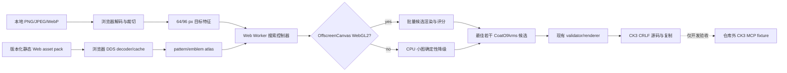

# CK3 原生家徽元素图片拟合：可行性与纯浏览器方案

## 结论

**可行，但交付物应定义为“受 CK3 原生 pattern / colored emblem / 三色通道 / affine instance 约束的近似重建”，不能定义为任意图片的像素级转换。**

第一版实现为纯浏览器：用户选择的图片只在本机页面内解码；前端先读取完整原生注册库的 32×32 RGBA 搜索索引，以 Web
Worker 对当前残差反复选择 DDS、颜色和 affine transform，并在大预算时用原生矩形 DDS 做自适应分块重建，最后只按需取得
入选元素的完整 DDS。CPU reference 是 Alpha 的确定性选择权威，WebGL2 对最终候选做独立 RGBA8 交叉评分；WebGL2 atlas
批量搜索仍是后续优化。Quarkus 不接收
图片、不执行视觉算法，也不维护第二套家徽语义；正式平台不需要 Quarkus。

扁平图标、旗帜、徽标、剪影和少色插画是高适配输入。照片、细小文字、渐变、复杂纹理和要求精确字体的输入只能得到低置信近似。用户自己的像素不能通过这个剪贴板入口嵌入游戏；最终代码只引用资源目录中已经存在的原生或用户明确选定的模组 DDS。

最终 Web 平台的上传、拟合、预览、导出和复制必须在没有安装或运行 CK3、没有 Quarkus/MCP、没有桌面截图、没有 OCR、没有屏幕自动化时正常工作。现有 CK3 MCP 只属于开发期研究与验收夹具，不进入正式平台的运行时、界面或用户操作流程。

## 为什么技术上可行

CK3 已实证可导入的 render description 是一个有限的组合模型：

```text
三通道 pattern + 三个底色
  -> 零到多个 colored_emblem
       -> 每层三个颜色
       -> 零到多个 position / scale / rotation / depth instance
       -> 可选 pattern channel mask
```

现有编辑器已经具备完成逆向搜索所需的正向模型：

- 基础游戏和当前配置模组的 pattern / colored-emblem 候选目录，可在开发期冻结成静态 asset pack；
- 受 provenance 和 SHA-256 绑定的单个 DDS reader，以及同一合同的静态 Web asset reader；
- DXT1、DXT5、BGRA8 顶层 mip 的浏览器 decoder；
- 从 CK3 随附 shader 翻译的 pattern、三色 emblem、mask、flip、rotation、scale、translation、surface detail 和 alpha blend；
- 只生成原生实机矩阵已接受字段的 serializer；超过当前开发期 MCP 的 128 KiB 传输合同时只警告，不把它冒充为 CK3 引擎上限；
- 开发期可用的 MCP apply → native Copy/export fixed-point 检查；正式平台不调用它。

因此问题可以写成离散素材选择加连续参数优化：在原生元素集合中寻找代码 `c`，使浏览器正向渲染 `R(c)` 与目标图 `T` 的损失最小，同时惩罚过多图层和实例。

```text
score(c) = color_loss(R(c), T)
         + silhouette_loss(R(c), T)
         + edge_loss(R(c), T)
         + complexity_penalty(c)
```

全局最优搜索具有组合爆炸，不能承诺；但使用分层候选、beam search 和局部优化可以在交互时间内得到可解释、可继续手工编辑的近似结果。

## 纯浏览器架构



### 浏览器与隐私边界

- 使用 `<input type="file">` 或拖放取得 `File`，不把图片 POST 给 Quarkus。
- Alpha 只接受浏览器可安全解码的 PNG、JPEG、WebP；拒绝 SVG、HTML、远程 URL 和无法解码的内容。
- 输入上限建议 16 MiB、4096×4096；解码后立即缩小到搜索分辨率，避免压缩炸弹和显存失控。
- 原图、ImageBitmap、像素数组和搜索缓存只留在当前页面；刷新页面即释放，不写 IndexedDB，除非用户以后显式选择持久缓存。
- 最终平台不要求 CK3 安装或进程，不连接 MCP/Quarkus，不读取屏幕，也不走 OCR。

### 独立静态 asset pack

“使用原生元素”与“最终平台不依赖 CK3”意味着部署物必须自己提供元素 bytes。Alpha 定义
`ck3-coa-web-asset-pack-v1`：一个小型 JSON manifest 加 content-addressed DDS 文件；manifest 冻结 CK3 build、来源 manifest
SHA-256、素材类型、逻辑名、颜色通道数、可见性、相对 URL、字节数和内容 SHA-256。浏览器拒绝 build/schema 不匹配、越界 URL、
重复逻辑键或 hash 不符的文件。

开发期 Python pack builder 可以从明确给出的 exact-build 游戏安装目录生成 pack，但它不属于 Web 运行时，也不会由页面启动。
项目所有者已于 2026-09-15 明确将原版 DDS 素材包视为本项目版本管理和 Pages 发布所授权的内容；因此当前仓库跟踪完整
1.19.0.6 基础游戏 CoA DDS 树。精确盘点、注册/未注册边界与 hash 回执见
[`ck3-coat-of-arms-asset-inventory.md`](ck3-coat-of-arms-asset-inventory.md)。该项目政策记录不转移 Paradox 素材所有权，也不
自动涵盖其他 build 或模组资源。

### WebGL2 的职责

WebGL2 适合批量执行正向渲染，不应负责搜索策略本身：

1. 把候选 pattern 和 emblem channel mask 打进纹理数组或分页 atlas；
2. 用 instanced draw 对同一纹理的一组 position / scale / rotation / flip 组合批量渲染；
3. 在 64×64 或 96×96 framebuffer 中计算候选图；
4. 通过小尺寸 `readPixels` 或分层 reduction 得到颜色、alpha 和边缘损失；
5. Worker 根据分数做 beam expansion、去重和确定性 tie-break。

优先使用 Worker 内的 `OffscreenCanvas.getContext("webgl2")`，避免阻塞编辑界面。若浏览器只允许主线程 WebGL2，可以把渲染器留在主线程并以小批次让出事件循环。WebGL2、OffscreenCanvas 或浮点 render target 不可用时，CPU 路径使用同一候选顺序、量化参数和评分合同；它可以更慢、搜索预算更小，但不能静默产生不同格式的代码。

WebGPU 暂不作为 Alpha 必需项。它适合以后把 reduction 和大规模并行搜索放入 compute shader，但当前浏览器覆盖率和测试成本不值得成为首发门禁。

## 搜索流程

### 1. 输入预处理

- 按透明像素或显著前景求 bounding box，保留用户可切换的 `contain` / `cover` 策略；
- 统一为正方形 RGBA 画布；透明像素不复合成白色。小预算生成 56×56 搜索图，大于等于 128 层的重建预算使用 96×96，展示图为 230×230；
- 将透明度、低频颜色、边缘强度和距离场分开，避免只用 RGB 均方误差偏爱模糊结果；
- 给照片或高颜色熵输入显示“原生元素不适配”的预警，但仍允许搜索。

### 2. 背景 pattern 与底色

- 枚举资源目录中可读取且可见的 pattern；exact 1.19.0.6 manifest 有 42 项，其中原生网格显示 38 项；
- 按 pattern 的三个累积通道把目标像素分区；
- 对每个分区求稳健代表色，量化成 `rgb { r g b }`，不受原版命名颜色数量限制；
- 保留得分最好的少量背景作为后续 beam 起点。

纯色或大色块输入往往仅这一阶段就能得到可接受结果。

### 3. emblem 粗筛

- 对每个可读取 colored-emblem 顶层 mip 预计算 alpha occupancy、重心、长宽比、低分辨率轮廓、边缘方向直方图和三通道能量；
- 将目标相对当前背景的残差转成同类特征；
- 先用这些廉价特征淘汰大多数资源，再对前 K 项进入真实渲染评分；
- 缓存键必须包含候选 opaque ID / asset SHA-256，不能仅按同名 DDS 缓存，以免混淆模组冲突。

### 4. 变换与颜色拟合

- 粗网格搜索 position、X/Y scale、rotation 与水平 flip；DDS 的透明内容边界和内容重心参与 position/scale 补偿；
- 对入选候选再局部细化 position、X/Y scale 和 rotation；角度先到 1°，再以 0.5°、0.25°、0.125° 二分到 0.1° 量级；
- 根据 emblem RGB channel mask 对目标残差求三个代表色；
- Alpha 默认搜索预算为 6 个 colored-emblem 图层；UI 不设固定产品上限，并回归验证 1024 和 10000。同一个原生 DDS 可以在不同位置、颜色和变换下重复使用；
- 搜索预算不是承诺产出相同数量的层。默认阈值为零，但每个候选必须严格降低实际正向渲染损失；无继续改善或用户取消时会提前停止；当前不再依据未经实测的
  CK3 大载荷边界截断拟合；
- depth 按加入顺序确定，导出有限数值，不依赖浮点比较的偶然顺序。

### 5. 分层 beam search

小预算语义路径同时保留最佳当前背景与最佳纯色背景，前六层维持路径多样性；每轮尝试增加一个原生 emblem instance，只接受
严格降低损失的候选。大预算原生块路径则从纯色背景开始，把目标按颜色方差自适应分成四叉树叶片，重复堆叠
`ce_block_02.dds` 做矩形近似。达到用户层数上限或剩余叶片都不能改善时停止；`layerLosses` 永久记录逐层严格递减证据。

### 6. 输出与可信度

Alpha 输出一个可继续手调的确定性最佳候选；Beta 扩展为 1–3 个 Pareto 候选。每项显示：

- 浏览器预览；
- 总相似度以及颜色、轮廓、边缘子分数；
- 使用的 pattern、emblem 和 instance 数量；
- `webgl2` 或 `cpu` backend、搜索分辨率、耗时、候选预算；
- asset-pack build、manifest SHA 与单项资源 provenance；
- 可继续结构化编辑的 CoatOfArms 模型和确定性 CRLF 代码。

分数只比较同版本算法和同一目标，不应宣传为“与 CK3 有 N% 像素一致”。正式平台不能显示“已由当前 CK3 原生接受”，因为它不连接游戏。仓库开发报告可以引用离线冻结的 exact-build 实机证据；在取得开发期原生 framebuffer reader 前，仍不能显示“CK3 像素验证通过”。

## 为什么 Alpha 不需要 Java 图像后端

Java 后端目前没有必要，正式平台应直接静态部署：

- 浏览器已经能解码上传图片和 CK3 DDS；
- WebGL2 比在 Java 中逐候选软件渲染更贴近交互需求；
- 图片不离开浏览器，隐私和部署更简单；
- 避免浏览器与 Java 出现两套 shader/serializer 语义；
- 静态 asset pack 可以由 CDN/普通静态文件服务提供，不需要 Java 或本机 CK3。

只有出现以下实测瓶颈，才重新评估 Java：浏览器无法在可接受内存内索引资源、受企业策略完全禁用 WebGL/Worker、或需要多人共享的预计算特征服务。即使届时增加 Java，它也只提供可选的 content-addressed 特征缓存或任务排队；纯静态浏览器路径仍是产品门禁，Java 不得接管 parser、serializer 和 CK3 字段白名单。

## 主要风险与缓解

| 风险 | 后果 | 缓解 |
|---|---|---|
| 素材组合空间巨大 | 搜索慢、局部最优 | 特征粗筛、分层 beam、明确时间/图层预算 |
| 浏览器 renderer 与 CK3 非逐像素一致 | 最佳候选在游戏中略有偏差 | 使用随附 shader 合同；结果标注近似；可选 MCP apply/export；后续补原生 framebuffer MCP |
| 同名模组 DDS 胜者未知 | asset pack 可能与玩家游戏配置不同 | pack 内逻辑名必须唯一并绑定 SHA；正式平台声明目标 build/pack，不声称匹配玩家的模组 VFS |
| 素材授权范围被误外推 | 把当前项目授权误当成所有权或其他 build/mod 的授权 | manifest 固定 build/source/hash；授权记录只适用于本仓库当前原版包 |
| 照片、文字、高频细节 | 结果质量差 | 输入适配度预警、边缘/复杂度指标、展示多个候选并允许手调 |
| GPU/浏览器差异 | 分数漂移 | 固定 UNORM 小图、显式 shader 精度、CPU reference tests、稳定 tie-break |
| 大图或恶意文件 | 内存/显存耗尽 | MIME 解码、字节/像素上限、超时、取消、分批纹理 atlas |
| 生成代码原生不接受 | 无法粘贴 | 只生成实证白名单；复用 validator/serializer；开发期 exact-build MCP fixture 回归 |

## Alpha 验收范围

图片拟合 Alpha 至少满足：

1. 用户可以选择 PNG/JPEG/WebP；图片不经网络或 Quarkus 上传。
2. 显示标准化目标预览、尺寸、类型和适配度提示；非法/超限输入 fail closed。
3. 基于 `ck3-coa-web-asset-pack-v1` 中经 SHA-256 绑定的 42 pattern / 1,577 个可粘贴 registered colored-emblem 完整搜索索引运行有限预算搜索；另一个含高位文件名的注册项只收录，不生成已知会被 reader 拒绝的输入。
4. 完成 WebGL2 capability 与小批量评分验证；CPU reference fitter 是 Alpha 的确定性权威降级。WebGL2 全量 atlas 批处理可以在 Beta 收口，但不得因此调用服务器做图像搜索。
5. 搜索可取消，不让页面长时间无响应。
6. 从当前背景残差开始逐轮选择、调色、变换和追加原生 DDS；结果包含合法的多层 CoatOfArms 候选、分数分解、资源清单和搜索 provenance。
   Worker 同时按背景匹配、当前层全库粗筛和候选精筛报告真实 `completed/total`；页面进度条显示当前阶段百分比与累计评估候选数，
   不用与实际计算无关的定时动画冒充进度。
7. 应用候选后进入现有结构化编辑器；确定性语法错误继续阻止复制。超过 128 KiB 时页面明确说明这只是开发期 MCP 合同，
   仍允许纯浏览器复制，但不允许经当前 MCP probe/apply 发送。
8. 对由已知原生元素正向合成的 fixture，搜索应能稳定恢复同类背景/主要轮廓并在固定预算下重复得到相同结果；另以用户提供的
   hunter 三色曲线图做 1024 上限 exact-pack 门禁，断言至少 900 层、每层严格改善、序列化块数无截断、总损失低于 0.04 且
   相对背景改善高于 80%。冻结结果见 [`coat-of-arms-fit-artifacts/xenoamess-hunter-v3/README.md`](coat-of-arms-fit-artifacts/xenoamess-hunter-v3/README.md)。
9. 没有安装 CK3、MCP 或 Java 也能完成上传、拟合、预览和复制；正式构建不显示 CK3 连接控件。

Alpha 不承诺照片写实重建、OCR/文字识别、全局最优、逐像素 CK3 一致、自动判定模组 VFS 胜者或把用户图片嵌入游戏资源。

## 后续阶段

- **Alpha**：完整独立静态 asset pack、纯浏览器输入、确定性多层残差 fitter、WebGL2 最终候选交叉评分、可编辑代码；正式构建不包含 CK3 连接界面。
- **Beta**：先修复大预算块覆盖空隙造成的规则底色分割线，并以高分辨率 seam gate、hunter v4 和 MCP 大载荷原生回读为首批阻断门禁；随后推进最终剪枝/实例合并、WebGL2 atlas/reduction 批量搜索、更强的 beam/连续优化、多候选与可暂停/恢复。完整执行计划见 [`ck3-coat-of-arms-editor-beta-plan.md`](ck3-coat-of-arms-editor-beta-plan.md)。
- **Native fidelity（仅开发夹具）**：继续优先补原生 MCP，从 CK3 renderer 取得不依赖屏幕/OCR的 framebuffer 或稳定像素摘要，用于校准浏览器评分；该夹具不进入正式平台，在此之前保持“近似”标签。
- **Advanced**：可选 WebGPU compute、感知 embedding 粗筛、用户约束（指定元素/对称/颜色/最大图层）和多目标 Pareto 结果。

## 证据关系

本方案的 CK3 语法、字段和原生正反例边界以
[`ck3-coat-of-arms-clipboard-import-capability.md`](ck3-coat-of-arms-clipboard-import-capability.md)
为准；前端当前能力和伴随服务入口以
[`../coat_of_arms_editer_of_ck3/README.md`](../coat_of_arms_editer_of_ck3/README.md)
为准。本文是设计与 Alpha 合同，不把尚未运行的图片拟合实现写成已经完成。
