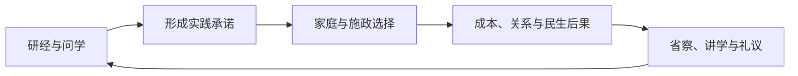

# 《礼治天下》：CK3 儒家风味扩展规划书

编写日期：2026-10-03。产品名、目录名与版本安排均为暂定。

**定位：让玩家通过读书修身、事亲齐家、讲学交友、进谏施政和主持礼仪，体验唐宋儒者的生活与政治责任。** 内容分为“儒家礼仪修正”和“日常制度扩展”两层，优先修正原版孝道等设定，再把经义落实到有代价、有争论、有后果的选择中。

机制依据是[儒家与天主教／基督教对比清单](ck3-religion-confucian-christian-comparison-1.20.0.3.md)及其[原版来源快照](ck3-religion-confucian-christian-comparison-1.20.0.3.sources.json)。目标基线为本机 **CK3 1.20.0.3（Crozier），Steam build 25652598**。下文原版路径均相对游戏安装目录的 `game/`。

本文件是可供开发采用的规划，尚未创建 mod 源码、验证新礼仪的实际继承行为或进行实机验收。史料中的经典规范、历史制度与本规划的游戏抽象分别表述；所有数值、内容数量与工时均为设计估算。

## 1. 要解决的体验问题

原版的仁政、格致、孝道和五伦已有儒家方向，科举与天朝政治也提供了重要背景。主要问题在于：这些方向常以教义参数和奖励呈现，缺少把家庭责任、学问、礼仪和具体施政串起来的玩法；部分机制还把复杂的伦理关系简化成了单向控制。

最明显的例子是“孝道”：原版会赋予父母永久的亲子牵制。它能表现家长权威，却难以表现赡养、父母的责任、子女的劝谏，以及亲情和公共职责之间的冲突。《孝经》〈谏诤〉讨论了子与臣纠正不义的责任，〈丧亲〉又强调服丧有终、不能因哀毁伤害生者。这些可作为玩法依据，但不能据此把古代家庭写成没有等级或强制的现代平等关系。[《孝经》原文](https://zh.wikisource.org/wiki/今文孝經)

本 mod 应当形成三种可以辨认的玩家体验：

- **做儒者：** 学问影响对事情的理解与选择；修养需要长期实践，不能读一本书就消除贪婪、欺诈等性格。
- **处人伦：** 父子、师生、君臣和朋友都有相应责任；亲疏、身份、利益和原则会发生冲突。
- **行礼与施政：** 礼仪确认秩序和共同记忆，施政检验宣称的德行。盛大祭礼不能抵消侵吞赈款，纳谏也不保证每条建议正确。

玩家可以成为有德行的官员，也可以成为以经义包装私利的权臣。两种路线都应有故事和后果，避免只有“花钱买虔诚”的最优解。

## 2. 历史范围与取材原则

### 2.1 以唐末至宋代为主，允许有条件的架空演化

| 时间背景 | 适宜作为主轴的内容 | 应避免预置的内容 |
| --- | --- | --- |
| 867：唐末 | 五经研习、家学、官学、尊师、州县释奠、国家与家族礼仪 | 全国成熟的宋式书院网络、范氏义庄式制度普及、朱子学成为官学正统 |
| 1066：北宋 | 经筵与士人政治、官学和私人讲学并存、义庄尝试、经义与施政争论 | 把所有士人归入同一种成熟道学；四书取代其他经典成为唯一学习路线 |
| 十二至十三世纪 | 书院与学派网络成长、家礼整理、道统论述、国家从祀与正统争议 | 按固定年份强迫玩家接受唯一学派；完整前移明清的宗族与贞节制度 |

唐代释奠及孔庙配享、从祀的调整见[《新唐书》卷十五](https://zh.wikisource.org/zh/新唐書/卷015)。书院教育的形成与宋代兴衰，可参考[袁征《宋代书院的兴衰》](https://cernet.edu.cn/zhong_guo_jiao_yu/zong_he/fa_zhan/200603/t20060323_13996.shtml)，但不把其中的数量估计作为游戏硬规则。

1066 年原版使用“道学”主礼仪，是游戏的分类，不足以证明成熟朱子正统已经确立。《宋史》记录宋理宗在 **1241 年**把周敦颐、张载、二程、朱熹列入从祀，并黜王安石。规划以此作为“学术获得国家承认需要政治过程”的例子，不能把这一结果提前写死在北宋开局。[《宋史》卷四十二](https://zh.wikisource.org/zh-hant/宋史/卷042)

年代主要控制初始内容、用语和制度成熟度。架空路线以教师、著作、机构、门生与统治者支持等条件解锁；不要求历史人物必须出生、存活或完成原历史事迹。成熟道统的内容需要相应发展条件，不能让 867 年玩家通过一次决议立即获得整套朱子家礼和后世官学。

### 2.2 五项内容原则

1. **经典是价值与争论的来源。** 《大学》的修身、齐家、治国线索可以组织玩法；经典中的规范不能直接视为唐宋社会逐项执行的法律。[《礼记·大学》](https://ctext.org/liji/da-xue/zh)
2. **保留等级，也表现责任和限度。** 官位、宗族身份、性别和财富会影响参与资格与评价；不把所有压迫都归为后世，也不把所有不服从都判为儒家罪恶。
3. **礼仪包含宗教情感和政治意义。** 祭祖、祭孔、祭天地分别处理。人物可以相信鬼神、灾异和感应，系统通过人物判断与社会后果表现，首版不把祭礼成功设为必然改变天气的法术。
4. **儒学有内部差异。** 经学、心性讨论与施政取向可以重叠；不同意见不默认成为互相绝罚、发动宗教战争的独立信仰。
5. **身份与实践分开。** CK3 的单一信仰栏难以完整表达古人的礼仪实践。首版以儒家玩家为主体；后续可让其他信仰的中国背景玩家参与尊师、家祭等适合其身份的事件，保留实际信仰及其限制。

## 3. 将机制对比转化为儒家内容

开发目标是提供相应的玩法深度。天主教系统中哪些适宜借鉴，取决于它解决了什么体验问题，以及唐宋中国有哪些真实制度可以承接。

| 对比清单中的差别 | 本规划的处理 | 对应玩法与优先级 |
| --- | --- | --- |
| 无教宗及独立教会权力中心 | 保留默认无教宗；权威分别来自朝廷、学问、师承和礼制资格 | 经筵、礼议、学者资助与士人评价；P1 |
| 无枢机、教宗选举、反教宗 | 发展学派影响和国家正统之争，不制造“儒家教皇” | 主讲人任用、议定从祀、相互竞争的经义主张；P1–P2 |
| 不参与基督教教会局势、教宗诏书、信条流行度 | 朝廷与士人围绕学校、礼典和施政争论 | 玩家推动的兴学、修礼、求言事件链；P1–P2，首版不复制完整 situation |
| 无独立教区、教会租约 | 以官学、地方学校、书院、义庄等机构承接长期投入 | 教师、经费、藏书和受助对象；P1；不替换全国神殿地产类型 |
| 无默认圣事、告解和绝罚 | 通过省察、改过、谏诤与舆论表现伦理约束 | 实际补救行为、师友规劝、有限的意见与名望后果；P0 |
| 无默认隐修与修道会 | 儒者可以退居、讲学或辞荣，仍保留家庭与社会联系 | 读书、讲学、退居选择；P0–P1；不把出家设为儒家常规义务 |
| 无军事修会及默认大圣战动员 | 保留这项差别；儒家政治中的战争争论围绕名分、边防、财政和民生 | 战时经筵与谏诤议题；P2；宣战与军队仍用原版机制 |
| 使用通用灵性满足，缺少基督教专属入口 | 另设读书、省察、践行的内容层，谨慎复用原版虔诚等资源 | 修身计划与人格冲突；P0；不把灵性满足改名后宣称整个后台已适配 |
| 缺少基督教大教堂工程 | 发展教育和礼制场所的投入 | 学校、书院、文庙修缮；P1；实体建筑和活动地点另行验证 |
| 缺少守护圣人与圣人敬礼强化 | 从师、尊贤、整理先贤著作；国家从祀与家族祭祖分开 | 师友关系、经籍、从祀礼议；P1–P2；原版非基督教封圣路径只是可选接口 |
| 缺少基督教历史宗教目标 | 建立中国背景的长期目标 | 兴复学校、完成礼典、立学传承、扶助宗族；P1–P2 |
| 没有神职傅油 | 接续原版加冕，补充告庙、即位名分与受命叙事 | 帝国礼制；P2；不把一般 emperor 头衔自动认作中国天子 |
| 原版已有朝圣、葬礼、祭祖相关参数和宝物 | 优先补内容和关系后果，避免创建重复系统 | 曲阜敬祭、释奠、丧祭、谱牒与礼器；P0–P1 |

这张表同时排除了错误立项依据：儒家并非没有朝圣、葬礼、普通圣战、礼仪改革或非基督教封圣路径；科举、功绩与王朝循环也并非儒家信仰独占。详细门禁沿用[机制对比清单](ck3-religion-confucian-christian-comparison-1.20.0.3.md)。

## 4. 礼仪与核心信条的修正方案

### 4.1 第一项修正：把孝从永久控制扩展为具体责任

原版证据：

- `common/religion/tenet_types/00_tenet_types.txt:5637–5649`：孝道包含 `parents_get_hooks_on_children`。
- `common/on_action/child_birth_on_actions.txt:1045–1084`：可见出生分支要求孩子礼仪带有该参数，并分别检查在世父、母礼仪后授予 `filial_piety_hook`。
- `common/hook_types/00_hook_types.txt:235–238`：该钩为永久钩。

**优先原型：在同一儒家信仰下，提供玩家自愿采用、以自定义“敬亲有谏”替代原孝道核心的新礼仪。** 新核心通过赡养、照护、劝谏和丧祭提供内容与评价，不授予出生即永久控制的参数。其余新核心的主动及被动奖励同样限定已开启模块的玩家。

换个人核心不会当然删除礼仪原有参数；旧钩也不会当然随礼仪变化消失。因此，这一修正是首版前置研究项：必须证明新礼仪可被实际采用、参数没有从其他层继承、父母与孩子礼仪组合符合预期、保存读档正常。不能在只修改名称或个人信条后宣布“已经修正孝道”。

旧档提供玩家明确选择的一次性迁移，候选实现只按类型删除**涉及该玩家**的 `filial_piety_hook`，保留家主、秘密等其他钩。原版 `common/scripted_effects/00_secret_effects.txt:1155–1175` 可见 `has_hook_of_type` 和按类型 `remove_hook` 的语法；永久钩是否可按预期移除仍须实机证明。首版不以常年出生后删钩作为首选补丁。

本项目既有规则要求新增内容仅由玩家触发，因此当前方案不全局覆盖所有儒家角色，不自动让 AI 改礼仪。NPC 可以是玩家行动的对象，并承受原版关系和政治后果；玩家子女的礼仪继承影响需单独测试。该产品范围见[AGENTS.md](../AGENTS.md)“硬性约束”。

还必须检查原版系统自身的传播入口：`common/religion/rite_types/_rite_types.info:47–56` 说明 `create`、`convert` 默认均为 `yes`。新增决议的玩家门禁不能阻止原版改宗或个人核心采纳。P0 要验证如何限制新礼仪和核心的原生采纳，同时让授权的玩家入口可用；对象尚未创建时不得直接访问 `rite:key`。具体创建／转入配置是原型候选，不能提前当作有效解法。新增核心避免无条件作用于 NPC 的 `character_modifier`、德性等定义；无法限定玩家的奖励不进入首版。

### 4.2 六个核心信条候选，优先实现前三个

这些是设计名称，不是已经注册或可用的原版 key。每个核心优先改变行动与代价，再考虑小幅数值效果。

| 候选核心 | 玩家实际能做什么 | 约束与取舍 |
| --- | --- | --- |
| 敬亲有谏 | 赡养父母、照护病亲、劝止不义要求、处理丧祭 | 耗费时间或钱；意见变化取决于具体要求与人物；不保证父母接受 |
| 修己践履 | 选择研经与省察议题，并在事件中践行承诺 | 获得有限学习与实践进展；违背承诺会失去部分认可，不自动洗去性格 |
| 仁政恤民 | 在可负担范围内赈济、宽恤、听取具体民情 | 必须付出资源或放弃利益；核算原版仁政已有奖励，防止叠刷 |
| 礼以成俗 | 主持适合身份的祭礼，协调次序、参与者与开支 | 简礼、盛礼各有适用情境；支出更大不必然评价更好 |
| 尊师兴学 | 求教、邀请讲学、资助教师与贫寒学生 | 人才网络增长缓慢；教师也有立场和局限；不直接购买科举名次 |
| 义以聚族 | 捐资建义庄、助婚丧与求学、选任管理人 | 福利受预算限制；亲族可能偏袒、侵占或争议分配 |

“经学／道学”的现有礼仪分类先保留。新内容通过学习主张和实践选择表达差异，P1 后再评估是否需要更多礼仪。原版慈悲、公正、诚实、博学等德性有可用基础；勇敢、忠诚、节俭或不同性格的价值通过具体情境表现，避免把所有好特质一律设为宗教美德。

婚姻、离婚、性别、继承等法制暂不全局重写。后续专题须区分时代、阶层、礼论和司法实践；不能仅凭“更传统”就预设全时期禁止再嫁或无限家长权。范氏义庄初定规则中存在女子再嫁的资助，是需要保留的差异例证。[《范氏义庄规矩》](https://www.shidianguji.com/zh/book/GJTS12/chapter/1lphelhl1l7vy)

## 5. 核心玩法：从个人选择到公共后果

### 5.1 修身：读书要与处事相接

玩家选择一段有限期的学习计划，议题包括诚信、恤民、亲情与公义、礼与节用。研读经典或请教师友后，遇到与当前身份相关的事件；完成计划时根据选择和实际支出结算学习经验、小幅虔诚或短期修养状态。

例如，玩家研读“信”，后来发现亲族希望隐瞒挪用的钱款。事件区分不告亲属、私下谏止并赔偿、借官职造假庇护，以及依法处理等行为。选项分别影响亲情、财政、压力和相关人物评价。这里的补救必须实际扣除资源；不能只点“我已悔过”就获得奖励。

“亲亲相隐”本身也是经典与古代法制的重要立场，不告亲属与主动枉法不能简单混为一谈。具体评价按亲等、职责、罪类和时代处理，不把公开告发设为唯一德行最高的选项；法律后果制作前须补齐对应条文。[《论语·子路》](https://zh.wikisource.org/zh/論語/子路第十三)、[《唐律疏议》卷六](https://zh.wikisource.org/wiki/唐律疏議/卷第六)

原版 `common/schemes/scheme_types/tgp_study_scheme.txt:1–39` 的 `study_confucian_classics` 提供私人自学计谋的结构参考。MVP 先以决议与事件实现连续学习，不承诺直接复用全部计谋 UI、旅行处理和奖励。

### 5.2 齐家：亲慈子孝、祭祖与有限的家族照护

生前内容包括赡养、问疾、教养和劝谏；父母玩家也需要回应子女的学习、照护与婚姻利益冲突。后者首版只做相关事件选择，不另造婚姻审批系统。

祭祖选择已故父母或合格祖先、主持者、简繁程度和祭文主题。结果主要体现在家庭关系、祖先记忆、名望及纪念性宝物。谱牒、祭文、礼器与著作可保留曾经做过的事；宝物加成要低，祖先不按固定周期赐予强力属性。

父母死亡后，已开启模块的玩家进入丧亲事件，以相应时代和身份的丧礼规范作参照。因国事、军情或家庭生计缩短、离丧任事或分阶段守礼，属于需要解释的权宜选择：可能得到理解，也可能被批评，不与完整居丧结算完全相同。所有期限明确可结束。首版以礼制承诺、活动取舍和压力表现；**不把一个 modifier 说成已经完成真实辞官、代理任职或原官复职。** 原生任职变更另列 P2 原型。

### 5.3 问学与讲学：师友网络先于庞大学派系统

玩家寻找教师、请教具体问题，或邀请少数学友讲学。主讲、问难和主持角色影响议题、事件与关系结果；学识决定知识能力，性格和利益影响发言，不能将高学识等同于德行高尚。

MVP 用“邀友讲学”决议事件；P1 再形成可重复的小型活动和机构支持。官学、家学与书院各有名称与角色，不把全部学校统称为书院。官学侧重公共经费与培养，私人讲学强调师承和主张，家学强调亲族支持。

原版 `common/activities/activity_types/debate.txt:1–31` 的辩论活动有功绩政府、王朝循环、天子直属封臣及 movement 等门禁；`common/activities/activity_types/university_visit.txt:176–200` 的大学造访要求原生高等学习地点。因此，“改名为讲学”与“给建筑取名书院”都不足以解锁这些后台。活动类型、地点与邀请机制在 P1 单独施工。

### 5.4 书院与义庄：长期投入必须面对维护和分配

P1 的教育机构先记录一个明确地点、教师、资助者、学习方向与维持状态。玩家可投入藏书或经费、资助学生、调整方向。教师离开、战乱、失去经费会使机构衰落；投资所得主要是渐进学习与人才关系，不是永久全国属性加成。

义庄与书院分开建模：前者支持贫困亲族的衣食、婚丧和求学，后者支持教育。玩家捐资时实际扣钱；可分配余额始终有限，首次实现不模拟可反复兑现的免费义田收入。后续土地收益需独立完成成本和收入验证。

管理事件围绕谁先受助、是否留储备、是否偏袒近亲、如何处理侵吞展开。范氏规矩中有储粮、救助次序和管理约束，后续条目也有考试及教学资助；其规则年代应分别记录，不能合并成 1050 年已经存在的完整制度。[《范氏义庄规矩》](https://www.shidianguji.com/zh/book/GJTS12/chapter/1lphelhl1l7vy)

### 5.5 谏诤与经筵：君臣共同承担判断的风险

谏诤以具体事实为入口：不义的家庭要求、已经发生的苛待、赈济选择或可验证的财政争议。玩家对父母、领主或合格统治者发起互动，选择私下规劝、正式进言或保留意见；对方根据性格、关系、利益和内容作回应。

接受建议需要对应行动或明确的有限政策后果，不能只增加“纳谏”美名。拒绝可能伤害关系，也可能有合理的财政、军情理由。进谏者可以误判或借机争权，君主也可以表面纳谏、实际拖延。

P1 经筵由具备资格的玩家统治者组织，或由玩家讲官通过与统治者的互动参与。经史讲题接当前议题：灾后支出、边防费用、任人唯亲、繁礼扰民。原文记录了宋代讲官借经义论政；讲学与皇权关系也存在张力。[《宋史》卷二百九十四](https://zh.wikisource.org/wiki/宋史/卷294)、[张晓宇《理学与皇权》](https://www1.ihp.sinica.edu.tw/storage/publish2L/92-4-1%20%E5%BC%B5%E6%9B%89%E5%AE%870103.pdf)

首版的师友和士人评价来自玩家接触过的具体人物。后续可以发展声望网络；当前玩家限定范围内，不为世界所有 AI 启动自动学派传播和独立政治循环。

### 5.6 仁政：以实际支出和对象定义“有做事”

首版选择两个可以闭合的行动：资助一个确定地区的救济，以及对合格囚犯作宽恤。必须验证钱实际扣除、地区正确、囚犯状态实际改变，才结算新增效果。

同一次行动可以改善关系或短期地方状态，但不会同时大幅增加虔诚、威望、功绩、宗族威望与合法性。对同一对象重复施行需要冷却与收益上限；释放再抓回同一囚犯不能持续刷奖励。

原版仁政已包含巡察、救灾和宽宥参数，见 `common/religion/tenet_types/00_tenet_types.txt:5555–5572`。`common/activities/activity_types/inspection.txt:1–24` 的巡察还有 DLC、定居政府、有领地与等级门禁。符合条件的玩家可获得内容衔接；无地儒生通过个人照护、求学与师友事件参与，不被错误送入巡察。

### 5.7 礼制：祭祖、释奠与国家大礼分别有资格

释奠围绕尊师、学校、讲经和地方公共投入。玩家主持地方礼仪时，需要适合的身份或机构关系；赴曲阜敬祭则优先衔接原版朝圣和旅行条件。首版不增加大量圣地，也不为未核验的地点许诺新圣地资格。

P2 国家礼制加入告庙、社稷与郊祀等内容，先确认主持者、政权资格、所在地和具体年代。皇帝等级本身不是全部资格：其他地区的帝国统治者不能仅凭头衔获得中国天子礼制。

礼仪的争议来自名分、继承、参加者和费用。财政紧张时举行盛礼可能得到部分认可，也会引起劳民与节用争论；简礼可以保存资源，但可能使重视仪节者不满。经典提供等级礼制的思想背景，实际唐宋礼制仍以各时代记录为准。[《礼记·王制》](https://zh.wikisource.org/zh-hant/禮記/王制)、[《新唐书》卷十五](https://zh.wikisource.org/zh/新唐書/卷015)

### 5.8 学统与从祀：把国家承认作为长期目标

P1 先让玩家形成学习主张，例如重经义训释、重修养实践或重施政论证。这些是可组合的游戏取向，不宣称是覆盖全部历史儒学的三大宗派。学习选择影响讲题、教师关系和事件，不自动改变宗教敌意。

P2 才加入国家“议定从祀”：候选者必须已故，具有相关著作、师承或实践记录；玩家统治者组织礼议，听取不同意见，作出加入、暂缓或拒绝决定。花钱只能筹备礼仪，不能直接购买圣人地位。

从祀、家族祭祖、授予生者荣誉和原版封圣分别记录。结果认可某种主张并留下历史记忆；反对者可以继续存在，不自动被绝罚。玩家创立的新学可以获得支持、衰落或在身后被重估，提供跨代目标。

## 6. 三段代表性游戏故事

**亲情与公义。** 玩家是低阶官员，父亲要求替亲族隐瞒侵占。容隐、劝止补偿、依法处理和利用官职造假分别提供选择；容隐不自动等于枉法，告发也不自动获得最高认可。评判同时考虑亲亲、职责、补救与持续作恶，照护责任仍然存在。

**讲学与施政。** 玩家资助一位教师讨论节用，后来辖地需要救济，书院也缺经费。玩家可削减自己的礼仪开支、减少教学资助、只做有限救济，或借“灾异”诿过他人。不同选择影响教师、受助者、家庭和财政，讨论内容由过去行为提供新的材料。

**即位与名分。** 玩家统治者继位，准备告庙和国家礼仪。亲族争主祭次序，讲官请求节省费用并先处理积案。盛礼、折衷和简礼都带来不同支持；过去的失政不会被一场祭礼自动抹去。该故事属于 P2，只有国家礼制资格和原版继承衔接通过后才实现。

## 7. MVP 与开发顺序

### 7.1 首版必须完成的范围

第一版面向中国背景、儒家信仰的玩家，支持个人、亲族和有限地方治理。它应具备一个可玩循环，而不是只有一组替换名称。

建议内容预算：**4 个日常决议、3 个角色互动、24–36 个事件、3 个首批核心信条、2–3 类纪念宝物**；启用、退出与礼仪迁移入口另计。这是控制首版工作量的预算，不是已完成清单。

| 首版入口 | 主要内容 | 完成标准 |
| --- | --- | --- |
| 开始研经省察 | 学习议题、一次实践冲突、结算与退出 | 学习和实践相接；没有无限刷经验或自动洗性格 |
| 举行家祭 | 合格已故对象、礼仪规模、祭文与家人意见 | 祭祖对象、成本、记录与宝物归属正确 |
| 邀友讲学 | 少量教师／学友、讲题与问难 | 不依赖天朝辩论身份；有学习及关系后果 |
| 施行恤民之举 | 可验证的救济／宽恤分支 | 实际支出或对象状态改变后才发新增奖励 |
| 请益师友 | 针对当前学习或困惑的问学 | 对方有资格、存活并可交互；不无限叠加同类奖励 |
| 以义劝谏 | 对父母或合格上级的具体规劝 | 接受／拒绝各有理由及后果，不凭空剥夺官职或改宗 |
| 赡养与照护 | 对在世亲属的资源和时间支持 | 实际付出、需要与关系匹配；亲属死亡时安全终止 |

父母死亡后的守丧事件是玩家限定的被动入口。MVP 不建独立礼制大窗口、不改全国地产、不建立新的科举评分、不处理完整从祀名录，也不让 AI 自主运行新增模块。

### 7.2 阶段安排与验收门槛

| 阶段 | 交付内容 | 进入下一阶段的条件 |
| --- | --- | --- |
| P0-A：机制原型 | 新礼仪／核心继承与原生采纳门禁，亲子钩对照，一次性旧档迁移，玩家门禁，死亡延迟事件 | 用当前 exact build 实机证明修正成立；继承和旧档不出现不明副作用，未启用 AI 不自主采纳新内容或获得新增奖励 |
| P0-B：v0.1 儒者日常 | 上述日常入口、首批核心与事件；丧祭、修身和实践形成循环 | 简体中文完整体验；换角、死亡、读档与重复触发安全；资源与对象后果正确 |
| P1-A：v0.2 兴学齐家 | 独立讲学活动、学校／书院成长、义庄与长期师友网络 | 活动地点、邀请、费用与保存稳定；普通官学、家学与书院名称符合背景 |
| P1-B：v0.3 经义与政治 | 经筵、纳谏、学术取向、施政争议；更多身份内容 | 建议与真实后果相连；不重复科举和原版官僚奖励；不同取向各有价值 |
| P2：v1.0 礼制与传承 | 国家礼仪、从祀、礼典与跨代记忆；经验证的丁忧任职衔接 | 政权资格、历史时序、任职与继承验证闭合；达到正式发布门槛 |

估算一名熟悉 CK3 脚本的开发者可按 **P0-A 3–5 个工作日，P0-B 10–15 日，两个 P1 包各 10–15 日，P2 15–25 日**分配初始容量。范围包含内容、简中／英文结构与相应验收；不承诺日历交付日期。引擎门禁未闭合时，调整依赖它的功能，不把基础仪式和家庭内容全部压在大型 UI 或新 situation 后面。

**首版是否可以发布的关键标准：** 玩家能采用有效的孝道修正，并玩到至少一条贯穿“学习—实践—人际后果—省察”的链。若只有添加事件、永久牵制仍按旧逻辑作用，应明确称为日常内容预览，不能声称已完成原版伦理修正。

## 8. 数值、信息与事件频率

优先使用原版学识经验、虔诚、威望、压力、金钱、关系和合适的地方 modifier。合法性、功绩、国库等仅在实际身份和 API 支持时使用。首版不增加可消费的统一“儒学点数”；少量实践标记只记录做过的事和当前承诺。

首轮平衡建议：

- 学习计划以 3–6 个月为一段；同一角色同时最多一项，不要求玩家每月点击。
- 普通家祭同一主持者 12 个月内最多结算一次完整奖励；具体纪念与亲属死亡事件另处理。
- 问学、照护和谏诤对同一对象设置合理冷却；历史情境变化可以产生新事件，原样重复不重复给主要收益。
- 非紧急自动事件以已开启玩家为范围，初始目标每年不超过 4–6 个；丧亲等重要人生节点另计。后续提供内容频率选项。
- 简礼费用应让普通角色可承担；盛礼和机构投入按身份、收入能力分档，不能用单一巨额费用挡住低阶角色。
- 个人行动使用个人财产；有国库且具备权限的公共行动才能用国库。界面明确显示扣款来源。
- 每个行动优先有一项主要收益及关系变化。收益不能无上限积累为属性、功绩或合法性；大典不永久洗去暴政。

玩家文案说明人物处境、礼的意义和实际选择后果。可用“居丧”“释奠”“从祀”等术语，但第一次出现给简短解释。开发 key、计数器和脚本校验细节留在开发文档，不进入故事叙述。

## 9. 实现结构与兼容边界

### 9.1 独立产品，优先新增定义

建议未来源码目录为 `mod_confucian_rites/`，采用独立命名空间，例如 `rltx_`，事件使用对应独立 namespace。正式定名时检查冲突。当前只建立此规划，不预建空源码或发布包。

主体使用 CK3 原生决议、互动、事件、scripted trigger/effect、角色／地区 modifier 与宝物。学习承诺、对象和截止日期按需要存入角色变量或保存 scope。Python 仅用于开发期生成与检查，玩家运行不依赖外部服务。

新增死亡与其他 on_action 使用原版允许的跨文件追加方式：在原版入口只追加 `on_actions = { rltx_独立子链 }`，玩家门禁与效果放入独立子链，不重定义原版 `trigger`／`effect`。同名的多个效果块会冲突，不能复制整份原版文件后认为其他 mod 的钩子仍存在。依据为 `common/on_action/_on_actions.info:104–117`。礼仪、核心和玩家门禁集中定义，减少在每个事件内复制条件。

每个异步链至少明确：发起玩家、对象、开始／结束条件、实际成本、一次结算标记，以及对象失效时如何终止。换角后旧角色停止新增主动循环；已发生的有限意见与付款后果保留，后续回调重新判断对象和资格。退出模块取消未完成承诺，已支付的内容不凭空重复退款。

### 9.2 玩家限定的具体含义

启用决议、互动发起者、活动主办者都检查 `is_ai = no` 与模块开启状态。`ai_will_do = 0` 只是附加措施。延迟事件、死亡通知、学习结算及活动结束也重新检查。

NPC 可以作为父母、子女、教师、上级和受助对象，回应玩家的行为；不为 NPC 开启独立修身进度、自动讲学或自动机构扩张。教师死亡等结果通过已有玩家链处理，避免每月扫描全球所有角色。

全国自动学派演化、AI 主办书院／礼仪、全世界儒家教义覆盖均不列入当前版本路线。此范围遵循仓库既有玩家限定规则，不妨碍玩家推动的朝廷与地方内容。

### 9.3 DLC 分层，不因一个活动限制全部内容

| 层次 | 规划处理 |
| --- | --- |
| 基础事件层 | 以 1.20.0.3 为语法基线，尽量用通用事件与互动实现日常内容；实际可玩角色与儒家定义在不同 DLC 组合下仍须核验 |
| 天朝与中国制度接口 | 按原版 DLC、政府、地区和头衔门禁开放巡察、经筵身份等衔接；无资格玩家仍可玩修身、家庭和师友内容 |
| 葬礼、朝圣、活动及宝物扩展 | 逐项核对相应 DLC 与接口。不可用时提供明确、有限的事件版本，不制造无效活动入口 |
| PAM 宗教接口 | 不作为 MVP 硬依赖；原版灵性满足、先祖／圣者等后台只有通过专项验证才复用 |

不能因为当前本机拥有某项 DLC 就宣称所有玩家都可用。最终商店说明的硬依赖来自实测矩阵，规划阶段不预先写成“零 DLC 要求”。

### 9.4 与现有 mod 的关系

- **永恒轮回主 mod：** 不依赖其计分、奖池和自定义角色生成。可以合载，儒家修养不直接送轮回分数。
- **天朝 361：** 使用独立命名空间，不改 cohort、KPI、档位、PIP 或年度榜单。其已有 AI 授权不扩展到本 mod。首版守丧不宣称免考；未来丁忧免考或起复需要双方明确接口与验证，避免礼制和考核互相矛盾。
- **天朝经商贪腐：** 借原版可观察状态设计议题；不能仅凭存在该 mod 就自动断言某个角色有真实贪腐事实。无可靠接口时使用明确的自定义事件事实。
- **其他宗教／礼仪 overhaul：** 新增定义尽量减少冲突；修改同一礼仪或教义继承规则时可能冲突，需公布具体覆盖文件及推荐组合。不能提前承诺全面兼容。

官方构建采用独立 allowlist、可重现 staging 与 manifest，不直接上传开发树；不内嵌 Workshop `remote_file_id`，也不预设新产品 ID。发布时按仓库制度完成简中验收、订阅缓存复核、永久 changelog 和公开 Change Notes 回读。这些是未来发布条件，本次规划不包含发布动作。

## 10. 验收清单与主要风险

### 10.1 原型必须先回答的问题

| 风险 | 必须观察的结果 | 失败后的处理 |
| --- | --- | --- |
| 新礼仪仍继承孝道参数 | 原／新礼仪父母与孩子组合的出生钩、个人核心与礼仪参数各自作用 | 查明继承层和其他路径；推迟“伦理修正完成”的宣称，不靠每次出生强删钩掩盖问题 |
| 旧档钩迁移损伤其他关系 | 指定永久孝道钩可删除；其他钩保留；重复迁移和读档稳定 | 禁用迁移入口并记录限制；不删除角色全部钩 |
| 讲学误复用受限活动 | 无地、非天朝与不同等级玩家的正确入口和地点 | 保留决议事件版；独立活动验证后再替换 |
| 守丧卡住原生职位 | 期限结束、继承、失地、入狱与换角后状态正常 | 首版只保留有限礼制承诺；真实任职机制单独实现 |
| 多系统叠加刷资源 | 同一救济／宽恤的实际付款、对象状态和原版＋新增总收益 | 缩减新增收益，使用一次结算与对象冷却 |
| 机构变成无限福利 | 资助、维护、停办和支出余额一致 | 首版采用有限余额；土地收入通过独立原型后接入 |
| 历史内容错误前移 | 867／1066／后期的术语、名单、制度成熟度不同 | 将晚期内容改为条件演化，补史料后再加入具体制度规则 |

### 10.2 实机矩阵

正式运行前依仓库规则确认当次 Steam 离线状态与屏幕占用。全部实机验收使用简体中文，并绑定当次 exact build；1.19 的旧证据不能外推为 1.20。

1. 单 mod 的新档与旧档；与主 mod、361 分别合载并检查两种加载顺序。原版宗教、科举、王朝循环入口不被意外覆盖。
2. 867、1066 及后期背景；个人／低阶角色、地方统治者和合格天子。各身份可玩内容明确，隐藏与不可用原因正确。
3. 父／母／子女玩家；父母及孩子原／新礼仪组合；单双胎、父母死亡、改宗与保存读档。分别观察新钩与存量钩。
4. 父母先后或同时死亡、守丧中死亡／继承／入狱／失地／换角。没有重复结算、永不结束的限制或错误对象。
5. 亲属与教师失效、活动被取消、费用不足、没有国库等失败路径安全结束；提示与实际付款来源一致。
6. 原版已有奖励与新增奖励合算；同一对象重复操作、退出重开、读档不重复发奖。
7. AI 观察场景中没有新增主动事件、学习 tick、决议或活动自主发生；原版改宗、个人核心采纳等入口也不会让未启用 AI 主动采用新礼仪／核心或获得新增奖励。玩家选择 NPC 为对象仍能完成关系后果，子女原生继承影响单独记录。
8. 实际 DLC 配置与不具备对应扩展的配置按分层检查。适用的已有离线 parser／validator 先用于确定性预验，不能代替实机。

纯规划阶段只检查文档、来源与路径，不运行产品构建或游戏。后续实现阶段再建立与上述风险相称的脚本检查、必要测试和实机证据。

### 10.3 内容质量门槛

每条事件应能回答：涉及什么儒家问题、角色为何在乎、玩家付出什么、各选项有何理由、后果是否实际发生。通不过这五项的“节日送属性”事件不进入主线。

史料记录至少包括时代、出处、属于规范还是事例，以及如何抽象成玩法。涉及具体礼仪程序、丧服亲等、夺情／起复法制和婚姻诉讼时，先补专题史料；当前规划不把这些细节视为已经查明。

## 11. 史料与后续研究入口

以下资料访问日期均为 2026-10-03。古籍采用公开整理文本；关键字句在内容制作时应再与可靠版本核对，现代译文不直接大量复制入游戏。

| 资料 | 用途与边界 |
| --- | --- |
| [《礼记·大学》](https://ctext.org/liji/da-xue/zh) | 修身、齐家、治国的组织线索；经典规范。此次参考检索可见原文，页面直读受限，不据此声称完整校勘 |
| [《孝经》〈谏诤〉〈事君〉〈丧亲〉](https://zh.wikisource.org/wiki/今文孝經) | 忠孝中的劝谏、照护与丧祭；经典理想，不等同于唐宋完整法律 |
| [《论语·子路》](https://zh.wikisource.org/zh/論語/子路第十三)、[《唐律疏议》卷六](https://zh.wikisource.org/wiki/唐律疏議/卷第六) | 亲亲相隐及容隐的法制依据；实际案件须区分亲属范围、罪类与官员职责，不能泛化为所有庇护都合法 |
| [《礼记·王制》](https://zh.wikisource.org/zh-hant/禮記/王制) | 身份与祭祀、学校和公共责任的礼制模型；具体唐宋执行须另证 |
| [《新唐书》卷十五〈礼乐五〉](https://zh.wikisource.org/zh/新唐書/卷015) | 唐代释奠、官学、配享与从祀记录；可用于 867 的制度背景 |
| [《宋史》卷四十二](https://zh.wikisource.org/zh-hant/宋史/卷042) | 南宋从祀、国家正统与灾后求言等记录；1241 年事实不前移到 1066 |
| [《宋史》卷二百九十四](https://zh.wikisource.org/wiki/宋史/卷294) | 宋代讲官、经义论政及人物事例；不把个案视为所有官员的统一行为 |
| [《范氏义庄规矩》](https://www.shidianguji.com/zh/book/GJTS12/chapter/1lphelhl1l7vy) | 有限救助、储备和管理规则；1050 年初定与后续修订分开处理，现页为后世汇编传录 |
| [袁征《宋代书院的兴衰》](https://cernet.edu.cn/zhong_guo_jiao_yu/zong_he/fa_zhan/200603/t20060323_13996.shtml) | 书院教育的形成、兴衰与发展解释；学术概括，不作全国精确数量合同 |
| [张晓宇《理学与皇权——两宋之际“圣学”观念的演变》](https://www1.ihp.sinica.edu.tw/storage/publish2L/92-4-1%20%E5%BC%B5%E6%9B%89%E5%AE%870103.pdf) | 经筵、士人学术与皇权的关系；研究解释，不等同于所有学派只有一种政治立场 |
| [哥伦比亚大学教学资料：朱熹论学习](https://afe.easia.columbia.edu/ps/cup/zhuxi_learning.pdf) | 宋代理学的学习观念与《大学》解释；现代选译，只用作理解与核对，不能泛化成全时期儒学 |

进入实现后的研究次序：**先闭合礼仪／核心继承与钩迁移，再核验家庭与活动接口，随后制作日常内容，最后研究国家礼制和真实任职。** 具体先贤名录、学派人物和礼仪程序在对应阶段补证，不为追求大而全提前塞入首版。
