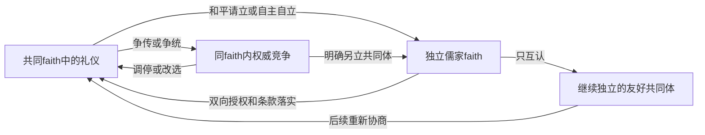

# 《礼与道》：争统宗主与可重复合流、分立

设计日期：2026-10-04。基线：CK3 1.20.0.3。
状态：设计方案及原版脚本核对；没有实现mod、启动游戏或完成实机验收。

依据用户指定的[礼仪独立与信仰重新并入研究](ck3-1.20.0.3-rites-split-and-reunion.md)、[总规划](ck3-confucian-flavor-mod-plan.md)和[36项礼仪／36张信条清单](ck3-confucian-rites-and-tenets-design-list.md)。本轮增加三项明确需求：儒家可以争夺共同宗主；其他儒家faith可以并入成为rite；rite可以升格为faith，且同一战役能够反复合流、分立。

## 1. 产品规则与可行性

**采用“共同宗教内，信仰可分可合、学统继续存在”的结构。** 信仰合流不抹掉学派；宗师争传不必导致信仰分裂；一次成功不会关闭将来的合流或自立入口。

| 层次 | 设计含义 | 对应承载 |
| --- | --- | --- |
| 儒家共同宗教 | 尊孔、经典、天人、祭祖与成德的共同背景 | `religion:confucianism_religion` |
| 独立信仰 | 独立的共同体规则、主流礼仪及领袖安排 | 原生faith；接受动态新faith，不只认预设名单 |
| 学派礼仪 | 有区别的经义、祭礼、工夫和传承 | 原生rite；学统身份不随母faith更换而消失 |
| 学统宗师 | 一派的授业、传承与论礼权威 | 原生rite领袖或经验证的角色／事件职能 |
| 共尊宗主 | 各方明确建立的共同最高宗教职位 | 原生faith领袖的候选映射；属于可选制度建设 |
| 争统宗主 | 对同一个共尊职位提出竞争主张 | 自定义认可关系；制度化后研究原生challenger |

原版已经使用`set_parent_faith`迁移礼仪、使用`detach_rite_to_new_faith`分立礼仪；一次性限制来自特定历史决议的完成标记。原生挑战者宣告入口也不统一硬限基督教。因此三项需求有脚本施工入口，不能据此声称完整儒家循环已经通过实机。

“吸收一个信仰成为礼仪”在引擎上须具体解释：来源faith如果只有一个rite，就迁入该rite；如果有多个，则迁入约定的全部rite，旧主流变为接收方的附属礼仪，其他分支也分别保留。不能把整个faith对象直接塞成一个有内部子faith的rite，更不能将多派默认压成接收方主流。

## 2. 历史素材与制度抽象

御前议经、师门论辩和奉祀世系可以提供场景；“共尊宗主批准faith合并”是CK3制度设计，不能冒称中国历朝已有同一种教会。

| 素材 | 有依据的内容 | 可采用的玩法 |
| --- | --- | --- |
| 石渠阁、白虎观议经 | 皇帝召议，群儒辨经，官员奏议，国家裁决 | 邀请议礼、提出兼采条款、决定本国官学及国礼安排 |
| 鹅湖论学及后续交往 | 朱陆方法相争，也有会讲及局部认可 | 宗师争论、承认共同经典、保留各自工夫；不自动变成不同faith |
| 南北孔氏奉祀 | 不同政治格局下的奉祀世系与继承问题 | 各国认可不同奉祀主体；共享经典，不自动生成两个儒家faith |

石渠阁与白虎观分别见[《汉书·宣帝纪》](https://zh.wikisource.org/wiki/漢書/卷008)、[《后汉书·章帝纪》](https://zh.wikisource.org/wiki/後漢書/卷3)。朱陆会讲见[《象山先生全集·年谱》](https://www.shidianguji.com/book/SBCK222/chapter/SBCK222_474)。南北宗见[山东地情档案《曲阜市志》](https://shandong-chorography.org/database/c8a/section/1/article/75/)。上述史实均不是faith合并或欧洲式反教宗的存在证明。

一期使用通用“议经论礼”“学统宗师”“奉祀领袖”名称；朝代名称、历史人物、学派兴起与时代门禁按二期历史模式细化。

## 3. 谁拥有何种批准权

批准分为**共同体归属、经义与传承、国家礼制、具体奉祀**四种。不是每个按钮都必须凑齐皇帝、孔氏、太常和宗主，也不是某一人有全部权力。

| 权威 | 可以发起或批准 | 不能由此自动取得的权力 |
| --- | --- | --- |
| 共尊宗主／有效faith领袖 | 接纳来归礼仪、认可和平自立、依章程裁定共同体资格 | 不能替另一个独立faith同意被吸纳；也不天然管辖全部儒家religion |
| 学统宗师／有效rite代表 | 提交经义与祭修条款、同意本派合流、认可自立或新传人 | 不能仅靠声望处分他国国礼和全部奉祀世系 |
| 议礼会 | 无共同领袖时提供共同体授权；审议章程和争议 | 属mod机构，不假称所有历史学派都有同一议会 |
| 皇帝、国王及其他保护者 | 召议、资助、庇护学统，批准本国国礼／官学与相关祀产安排 | 普通国家批准不直接改变境外整套faith／rite归属；帝国等级不等于全球宗主资格 |
| 礼官与祭仪主持者 | 核对祭序、资格、祝文及礼典，提出仪式可执行意见 | 不能独自裁决所有学统或宣布整个faith合并 |
| 孔氏及其他奉祀主体 | 同意本支祀所、祭孔传承、保管物与具体主持安排 | 不拥有全国文庙或全部经义的当然管辖权；南北支系分开处理 |

默认章程分两级：**本派认可程序**由具备传承资格的本派成员参与，以三分之二赞成形成该rite的授权，再由被认可的宗师或代表签署；**faith议礼会**由每项rite各出一名有效代表，以三分之二赞成决定接纳议案及共同章程。来源faith整体迁移还须每个被迁rite分别取得本派授权，不能以一派的票代替其他派。这不要求每派内部全票同意；宗主批准共同体接纳，大会和本派程序确定参与范围和条款。

没有领袖不是永久死路：可先召集本派代表，形成临时认可程序；有真实争统时先解决代表资格，或只对能够有效授权的范围协商。不能任命一个唯命是从的新角色后，直接宣称已经代表全部来源faith。

## 4. 对立教宗式玩法：争统宗主

### 4.1 同一学派的争传

任何有足够学行、著述或传承认可的宗师候选，可以由玩家保护者支持其争传。候选不必独立统治、不必为神权政体；双方可以继续同faith、同rite。

触发场景包括：宗师去世而继承有争议；现任宗师被认为失德；经典解释出现新论证；现任由朝廷强行任命而师门不服。并非只要好感低就能宣布全派分裂。

结果可以是会讲调停、重新选传人、承认多支师门、继续争传或请求另立礼仪。争传记录影响授业和认可；不会自动改政体、夺取伯爵领、转移所有追随者。

### 4.2 同一faith最高职位的争统

须先存在有效的共尊宗主制度及现任宗主。玩家可以支持另一名候选，也可在允许世俗宗主的章程下自立；两者争同一个职位，才对应“对立教宗”。

| 场景 | 谁可发起 | 批准或认可 | 可能结果 |
| --- | --- | --- | --- |
| 正常继承争议 | 有地玩家保护者、宗师玩家或符合章程的候选 | 被争议职位的选立／传承共同体 | 候选退出、再选、并立争统或另立共同体 |
| 宗主失德或违规干预礼仪 | 受影响学统及其玩家保护者 | 本派代表先认可指控，其他派可加入 | 限制权力、改选、支持挑战者或维持现任 |
| 朝廷另立宗主 | 满足庇护能力的王国级以上玩家作为起始平衡方案 | 至少一个有效学统支持；候选本人同意 | 初期只有本朝及签署者认可，不能仅靠皇帝诏令取得全球职位 |
| 跨派推举新宗主 | 玩家发起共同议礼会 | 按既定章程计票，现任有申辩机会 | 和平改选、认可分散权威或继续争统 |

旧宗主无需批准挑战自己。争统者应有来源明确的学统支持；武力、金钱、牵制可以帮助召集和施压，但不把被迫认可包装成充分的学行证明。

原生challenger适合制度化后的“共同最高职位之争”，须先做专用建立／清理原型。原版完整effect会涉及头衔、独立、神权政体、代理人和牵制；胜出路径还可能夺取旧领袖世俗领地。儒家和平论辩不直接调用这套完整胜出效果。

争统不自动分faith，也不默认允许holy order参加同教冲突。若另设扶正宗主战争，必须独立定义目标与和平结果；不将建立挑战者等同于已获得战争或军会功能。

## 5. 吸纳独立儒家faith：会通诸学、纳为礼仪

### 5.1 可重复议案流程

玩家决议“召集会通议礼”打开对象选择，选择**本局实际存在、仍有共同体的另一儒家faith**。双方都须属于儒家religion；动态分立的faith与预设faith一视同仁。来源方也可以通过玩家入口主动请求来归。

1. 明确接收faith、来源faith、具体礼仪和代表；展示跨国人物、领地、领袖及组织影响。
2. 提出共同条款：哪些经典和祭修原则共同认可，哪些差异留在附属礼仪；列出必须修改的原生信条／教义。
3. 取得接收方接纳决定、来源方移交决定及各被迁礼仪的有效授权。涉及国礼、奉祀或祀产才追加对应主体的批准。
4. 检查对接收方主流礼仪的实际偏离度、可改宗状态，以及领袖和挑战者安排。
5. 在最终确认时重新核对双方对象、代表、条款和支持；通过后才实施迁移。

建议初始数值：召议需成年、有行为能力、未被囚禁，具备较高奉献等级和学识15；统治者或经验证的宗教角色均可作为玩家入口。基础合流成本暂设1500虔诚、300金币，每额外迁入一项礼仪增加200虔诚；规模费用设上限并经平衡校准。数值不是史实或已验证的原生条件。

### 5.2 三种场景，三种授权

| 场景 | 宗教批准者 | 国家／奉祀批准者 | 结果 |
| --- | --- | --- | --- |
| 两个独立共同体自愿会通 | 接收宗主及大会；来源宗主及所有被迁礼仪代表。无宗主时用有授权的大会 | 只对实际改变的本国礼制、祀产分别批准 | 来源各rite保留特色，迁入接收faith |
| 朝廷召集御前议礼 | 学统或共同体代表仍须同意归属条款 | 皇帝批准本朝国礼，礼官核礼；相关奉祀主体批准本支变化 | 可先只有本国共同认可；达到全局授权后再实施faith合流 |
| 战后整合或受庇护来归 | 仍需有效共同体代表；强制条款明确记为被迫 | 控制者可以处理其可处分的祀产和保护安排 | 占领土地、俘虏宗主或持有牵制本身，不等于全球faith已同意 |

接收faith保留其现有主流礼仪；改主流是单独议案，须重新评估所有附属礼仪的偏离度。不能在吸纳时悄悄把来源主流设成全体新主流。

来源faith整体合流后，旧宗主经该派认可可任宗师，否则退位或担任经认可的荣誉主持；不自动替换现有宗师。若原生rite领袖任命不能承担，就用经验证的角色职能。只迁部分rite时，留存faith保留有效领袖安排，不能直接撤掉整个来源方领袖。取消旧faith领袖绑定不等于剥夺其世俗地产，更不自动抹去所有挑战者和代理人。

### 5.3 允许拒绝与局部结果

可拒绝、修改条款重议、保留独立faith但互认，或只迁入有独立授权的若干rite。**互认不是原生parent迁移，不能计为已经吸纳。** 仅部分rite迁入时，来源faith继续存在，主流与领袖须有可持续安排。

若反对者与赞成者目前共享同一个全球rite对象，不能用一个`set_parent_faith`假装只改本国。应先验证建立有追随者的新分支并分配人物、伯爵领的路径，再作局部迁移；无法可靠细分时保留原结构，交付互认或继续协商。不得让一次国家礼制裁决无提示地改变境外所有共享rite者。

多人游戏的受影响玩家必须明确选择；NPC代表只能对玩家提案作限定链内的回应，不新增自主召议、吞并或分裂循环。角色职能不代表已经取得整个对象的授权。

## 6. 从rite成为独立faith：请立、自立与黜礼

### 6.1 和平“请立学统”

本派宗师或其玩家保护者提出；本派议礼会通过；旧共同体宗主／有效大会批准和平独立。自立方另行决定新faith的宗主章程与主流礼仪，允许无统一领袖。

适用场景：希望自行维护礼典和传承而不再接受共同裁判；跨国管理无法共用权威；共同体协商决定友好分立。结果是独立faith，但可以继续互相认可，保留传承与祭祀交往。政治领主关系不因宗教分立而自动解除。

### 6.2 “别立门户”：旧宗主拒绝后仍可自立

批准自立的是**本派有效代表及其认可程序**，旧宗主没有永久否决权。需要能持续存在的追随共同体与真实争议，例如本派传承被否认、获认可的祭修路径遭禁止、宗主失德且调停失败，或明确要求独立制定共同体规则；不强迫先改坏原教义以凑满100偏离度。

建议初始条件：本派有效代表三分之二支持，有至少一个有地保护者，或有可实际观察的持续追随群体；成本1000虔诚、200金币。保护者不是必须为皇帝，也不因出资就取得经义最高裁判权。全部条件均为设计数值，具体追随者及地点查询在P0确定。

旧宗主可以不承认、继续论辩、要求调停或影响本朝认可；不会仅凭拒绝自动把新faith变成全球儒家共同敌人。良好学统与国礼认可分别计入新共同体的合法性；反复背弃自己签署的条款会损害信用。

### 6.3 “黜出共同礼统”

由当前有效宗主依章程发起；礼官提出资格／仪式证据，本派有申辩机会，大会裁定。用于明确破坏共同约定且拒绝调停的共同体，而不是泛称所有学说分歧都是邪教。

若复用原版“宣布异端”，必须遵守实际`faith.heresy_threshold`、狂热修正、非主流及挑战者追随限制。低偏离度的章程处分须有独立设计及effect原型，不能伪称原生异端按钮本来就允许任意驱逐。宗主正在被合法争统时，不能靠驱逐挑战者礼仪跳过争议裁定。

### 6.4 主流、最后一项与部分追随者

- 和平请立、自主自立与黜礼都核对授权的实际范围。本国支持者三分之二赞成不能冒充全球rite的认可；全体迁出需要有效的整派授权，或依已成立的全faith章程作出的有效处分。黜礼不要求被黜者赞成，但本国禁令不等于全faith处分。
- 只带走支持阵营、保留境外反对者时，先建立真实分支并分配其人物与伯爵领；无法可靠细分则不能宣称局部分立已经完成，不直接对共享全球rite执行整派分立。
- 主流rite要求自立且仍有其他rite留在旧faith时，先合法确定留存方的新主流和领袖，再尝试分立；每一步检查余下礼仪。
- 唯一rite本来已经代表整个faith，整派“自立”不能凭空伪造两方。要分出部分追随者，先形成实际的新礼仪／分支；若全体只换宗主，走改制或争统。
- 只分一个rite不自动带走其所有派生rite；带走哪些分支须有明确名单和授权。
- 分立后人物、伯爵领、改宗可用性及新领袖逐一核验；不把宗教独立写成自动获得政治独立。

主流／最后rite的原生内部限制和回调次序仍是P0问题，以上是期望行为，不是已经确认的引擎保证。

## 7. 反复执行的规则与保存状态

**永久保存历史，临时限制操作频率。** 不写基督教历史合并决议的全局完成标记，也不另造“儒家已经统一过”永久禁用条件。

| 状态 | 起始设计 | 保存及重复规则 |
| --- | --- | --- |
| 正式合流／分立调整期 | 同一学统5年 | 冷却绑定学统／rite身份及相关范围，继承和改换赞助者不清除；届满可再议 |
| 被拒绝的同一提案 | 1年后可重议 | 可改条款；不因一次拒绝永久锁死对象 |
| 待批准议案 | 有效期12个月 | 领袖死亡、对象改归属或条款改变时重新批准，不能使用已失效授权 |
| 争统 | 依实际职位及支持者保存 | 和平争传不与整个religion共用一个冷却；宗主死亡须处理继任与现存支持 |
| 历史 | 合流、自立、强制条款、旧宗主与旧母faith记录 | 只作叙事及信用依据，不作永久关闭入口的完成标记 |

冷却只控制新增玩家按钮，不阻止原生偏离度达到100后的自动分离，也不能保证新领袖不走原生宣布异端。若出现自动再次分裂，应保留该结果并提供修订条款的提案，不能后台无休止强制吸回。

本局能够实现：**B并入A → B学统从A自立成新faith → 再并入A或C → 再自立**。下一次不要求原faith ID仍存活、不要求同一人物主持、不要求同一个接收faith；但必须重新取得当轮授权、满足条款与冷却。

稳定学统身份、当轮faith对象和原生rite对象分别保存。手动／自动分立进入新faith建立链时需更新对象关联；动态ID是否复用不能成为机制正确性的前提。空来源faith可以保留为历史对象，不假设脚本能够删除或自动回收它。

## 8. 偏离度：会通保留差异，不能承诺魔法清零

接受儒家内部思想差异，但仍使用真实原生规则。**不修改全游戏自动分离阈值、不把`divergence_protection`当免分裂、不使用隐藏flag宣称永久免疫。**

合流条款应具体列出认可池、禁止／许可状态及共同教义。穷理与本心等特色尽量保留在儒家专属信条、祭修选择及经过验证的局部权重中；最低共同约定与本派特色分别配置。新专属ID可以避免同时改动基督教使用的同一项定义，但不代表整套差异已局部清零。

原版“寻求共融”已使用有目标参数的`main_rite.divergence(另一main_rite)`查询跨faith差异。合流应逐个检查迁入rite与**接收方主流**的关系，而不是拿它相对旧母faith的无参读数。

仍须验证迁入前pair查询与迁入后判定：parent变化可能移除锁定教义、改变继承内容及认可状态。因此一期只对已通过样板的组合开放实际合流；其他组合先议定条款或保持独立互认，不能凭一次查询保证稳定。

目标是迁入后低于自动分立门槛，并对实际异端门槛留出余量；具体余量在P0按计分来源确定。若内容无法满足，向玩家展示需要改变的规则或继续独立的选项。`change_rite_divergence`会替换信条／教义，不用于偷偷扣一个抽象数值。

## 9. 原生入口与未闭合问题

路径相对当前游戏`game/`。既有研究的冻结安装为Z盘；本轮补查为本机Program Files安装的1.20.0.3。文件来源与哈希见[本轮来源记录](ck3-confucian-repeatable-reunion-and-schism-design.sources.json)，不混用为同一安装的EXE或live证据。

| 入口 | 本轮确认／设计限制 |
| --- | --- |
| `common/decisions/dlc_decisions/pam/pam_antipope_decisions.txt:29—40,346—374` | 非统一基督教限定；需要相应领袖制度，原版儒家no_head会阻挡现成入口 |
| `common/scripted_triggers/pam_antipope_triggers.txt:71—107,198—277` | 局势折扣、追随者路由与宗教条件；不能等同自由师承支持setter |
| `common/scripted_effects/pam_antipope_effects.txt:68—264` | 动态头衔、可能独立和政体变化等；赞助者头衔通过`sponsor_new_religious_head_challenger`登记挑战者 |
| `common/scripted_effects/pam_antipope_effects.txt:267—400` | 撤登记／代理人／头衔清理及胜出；胜出可能夺取旧领袖世俗头衔，需专门拆出儒家行为 |
| `common/scripted_triggers/pam_scripted_triggers.txt:2711—2740` | 原生宣布异端的实际门槛、主流排除和挑战者追随限制 |
| `common/scripted_effects/pam_effects.txt:6749—6759` | 分立effect与改宗可用性开关；不证明任意主流／最后rite都可直接分立 |
| `common/scripted_effects/pam_effects.txt:7384—7418` | 移除来源领袖绑定、逐rite迁入；effect自身没有历史决议的全局完成锁 |
| `common/character_interactions/pam_interactions.txt:28781,28833` | 跨faith的显式目标rite分歧查询；迁入后的继承变化仍须验 |
| `common/on_action/religion_on_actions.txt:3—55` | 新faith回调；founder不一定存在，须处理无创建者的自动分立 |
| `common/on_action/dlc/pam/pam_on_actions.txt:528—542` | 挑战者分立后清flag路径，不足以保证完整清理；原版注释仍有TODO |

P0待确定：原生rite领袖赋任；任意角色的原生挑战者追随setter及多challenger上限；main／last rite分立；按支持阵营创建与分配分支；新faith回调顺序、空faith与动态ID；宗主退出后的领袖、代理人、头衔和挑战者状态；军会、圣物与其他faith绑定对象的迁移策略。

共享faith／rite改变会影响所有使用者，包括NPC；玩家入口屏障不等于被动效果只影响玩家。新增主动决议、互动及后续事件全部从玩家发起链进入；不扩成原生AI策略或自动玩家实现任务。

## 10. 玩法样例

以下均为架空本局情景，学派名称不代表史实曾有对应独立faith。

**朱陆会通。** 两派暂为独立faith，认可共同经典但保留穷理与本心工夫。玩家召议，双方宗主／授权大会及宗师同意；可先互认，再在差异满足条件后合流。陆氏宗师仍掌其传承，接收方不自动夺其祀产。

**官学独尊引发自立。** 合流后共同宗主改变认可状态，陆氏工夫被排除。本派先请求恢复条款；调停失败，可获准和平自立或自行另立faith。冷却届满、后来宗主重新接纳该工夫后，可以再次合流，不检查“以前已经统一过”。

**南北奉祀与争统。** 两国认可不同孔氏奉祀主体，只产生奉祀及国家认可争议。若双方明确共尊同一个最高宗主职位而又各立候选，才进入争统；若只各守本支祀所，可以保持同faith，不强行生成宗教大分裂。

**一个faith内多派反对。** 来源faith有三项rite，两派同意来归，一派拒绝。不能替第三派签署；可只迁同意且有独立授权的两项，留存派继续旧faith并确定新主流。若反对者和赞成者共用一个rite，则先完成真实分支拆分，否则只互认。

## 11. 一期迭代与完成标准

这套分合循环属于宗教核心，建议在一期按小迭代加入；朝代分隔、历史开局及时代演进仍交二期。新增需求扩大了原排期范围，不能未经原型就把它当成已包含在14—18周估算内。M0同时验证循环后，按实际工时校准。

| 迭代 | 交付目标 |
| --- | --- |
| 原型 | 两项rite、两个faith：迁入→分立→再迁入；人物、伯爵领和重载互证；确认pair分歧、main／last与领袖清理 |
| 基础功能 | 双向授权、无领袖大会、和平请立／自主自立、保留礼仪、可改宗、学统冷却与历史记录 |
| 权威争议 | 普通宗师争传，制度化宗主竞争及退出继任；原生challenger只有在其完整生命周期通过后启用 |
| 完整一期 | 多rite来源、动态faith、部分授权、跨国与多人游戏范围、军会／圣物绑定、自动再分立与长期重载 |
| 二期 | 按朝代的官职称号、历史开局、真实形成／传播事件；不重写一期已保存的自由模式 |

完成至少须证明以下行为，按钮可见或命令返回不能代替：

1. 同一学统三轮“合流→分立→再合流”，跨两次人物继承及存档重载；循环没有全局一次性锁。
2. 换接收faith、来源为动态faith、拒绝后重议、无统一领袖、主流与仅余一项rite各有正确结果。
3. 迁入及分立后人物、伯爵领、主流、领袖、改宗开关正确；礼仪特色没有未经批准的替换。
4. 支持者可以争传而留在同faith；旧宗主、赞助者或候选死亡后没有错误代理人、领袖绑定或重复挑战者。
5. 高偏离度会导致的原生自动分离有实际证据；冷却不能虚假阻止它；不循环强制吸回。
6. 多rite、跨国及不同支持阵营的实际影响符合预览与授权；受影响玩家可以表达拒绝。
7. 新增主动入口保持玩家限定；原生AI传播和共享被动影响明确观察。军会／圣物等只对完成验证的迁移策略宣称支持。

本轮交付为可评审设计、历史依据及施工入口，未创建游戏脚本或承诺未经实机证明的功能完成。
