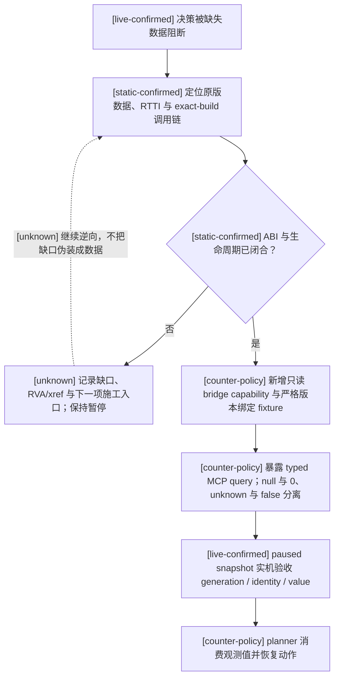

# CK3 原生 AI 决策树索引

- [typed observation/selection production-live slices; aggregate live pending] [天朝二期 Promotion source progress 与 review-now action](zhongguo-promotion-source-progress-and-review-action-v1.md)：冻结 1.19.0.6 exact build；R162 已在 repaired review action 后独立观察真实 B1 active，R193–R207 又在同一 product PID 上连续读取 B1/Central/PP 与 exact current-event。R207 以独立 instance-advanced 后置证明 `zg361pp.150` option `3/2` GREEN，随后在 `.151` instance `130` typed RED；`.151`、剩余 PP、AF5 route 3、`.146 -> D+1 -> .147 -> save` 与完整迁移树仍 pending。ACK 不作状态证据，正式 capability 保持 default-off。

## 版本与证据边界

- [static-confirmed] 本目录只绑定 CK3 `1.19.0.6` 的
  `Crusader Kings III/binaries/ck3.exe`，SHA-256 为
  `2D00FF3101EF70B566F2FCBAE292F09263199C80E9DC8F139B82D7D96F83DB86`。
- [static-confirmed] `static-confirmed` 表示结论由该 EXE 的 RTTI、反汇编调用链，或同一安装包随附的
  `game/common` 原版数据/说明直接支持；RVA 均以该 EXE 模块基址为零点。
- [live-confirmed] `live-confirmed` 表示结论已在该 exact build 的真实 paused frame 中互证；具体专题必须记录其
  artifact/checkpoint 与生产会话边界。纯研究采样保持只读；production query/command 的验收则必须走正式 bridge/session，
  并以观测到的后置状态和 managed cleanup 为准，不能只凭 ACK。
- [inference] `inference` 表示由多个已证事实推出、但尚未找到执行分支或独立实机对照的解释，不能当成
  exact ABI 或确定策略。
- [unknown] `unknown` 表示尚未闭合；图中的虚线边和虚线节点也一律表示 unknown，不能据此实现原生动作。
- [static-confirmed] EXE、原版 AI 数据或版本任一变化后，本目录的地址、阈值和决策树都失效，必须先重算
  SHA、重新定位锚点，再逐条升级证据等级。

## 文档

- [production-live primitive; cold restore pending] [天朝二期 AF5 独立终态观测](zhongguo-compensation-af5-snapshot-v1.md)：R402 已独立读取同 case 的 state 5→6、revision 19→22 及 m299/m300 route 3 结清；终态存档、日志与受管清理 GREEN。游标清理后的帧仅有合成验证，真实 cold restore 待验。
- [static-ready, live pending] [天朝二期 Workforce owner 终态观测](zhongguo-workforce-owner-snapshot-v1.md)：由玩家 owner 的 Central subject 绑定读取不同角色上的 Workforce/AL/M360 终态，区分 success、history 与合法 N/A，并单独发布 Central stage 11 消费状态；不切换玩家。

- [static-confirmed + fixture-ready, live pending] [phase2-wrapper-consumer-edge-observer-2026-09-03.md](phase2-wrapper-consumer-edge-observer-2026-09-03.md)
  冻结天朝二期 D7 selected task 发布后的 wrapper-entry 与 consumer-entry 组合观察：精确区分 wrapper 未再调度、进入但走其它分支、命中两条 consumer call edge 但未呈现 selected task，以及 `0x3B9DEA7` identity match。观察器仅在 private/default-OFF 构建启用；公共 ABI/readiness 不变，仍待一次 bounded live。
- [exact-build managed live, typed RED] [phase2-seed-live-82d6b77-2026-09-03.md](phase2-seed-live-82d6b77-2026-09-03.md)
  记录 exact `82d6b77` canonical-seed 唯一实机：no-launch preflight GREEN，PID 9904 在 completion publish 后仍停于
  `database_init`，未产生 candidate/native readiness；cleanup 与输入不变性全 GREEN。下一条 distinct live 是已合入的
  selected producer task → scheduler consumer `0x3B9DEA7` 动态指针关联，不重复同形 seed timeout。
- [counter-policy] [autonomous-capability-roadmap.md](autonomous-capability-roadmap.md) 盘点全游戏自治能力面、
  当前 bridge/MCP/planner 的可玩边界、依赖顺序与持续验收里程碑；它是施工路线图，不代表 CK3 原生行为。
- [static-confirmed + fixture-ready, live pending] [zhongguo-b2-pip-snapshot-v1.md](zhongguo-b2-pip-snapshot-v1.md)
  冻结天朝 361 received-self PIP 的 73-key 玩家 allowlist、绑定后唯一 owner-capacity 读取、
  gate/八维证据/回执/支持/双预算/midpoint/outcome/下一周期证据语义，以及 D+180/D+365 ticket
  与 modifier 的诚实 typed-unavailable 边界；公开 MCP 只有 owner equality filter，不含任意变量读取。
- [production transport integrated + static/fixture-ready, live pending] [zhongguo-manager-subordinate-selector-v1.md](zhongguo-manager-subordinate-selector-v1.md)
  冻结 B3 的 provider-observed 经理/直属下属 selector：从玩家与候选经理各自的原生
  `CSubjectContract` native-order 集合枚举，逐项做 full-generation identity 与 immediate-liege
  复核，再以既有 exact-build AI / `celestial_government` / landed duke+ 判定选择第一组合法绑定。
  请求不接受人物 ID；无候选与结构读取失败是不同的 typed unavailable，尚无 paused live artifact。
- [static-confirmed + fixture-ready, live pending] [zhongguo-incident-snapshot-v1.md](zhongguo-incident-snapshot-v1.md)
  冻结天朝 361 Incident X/Y/Z 的三份 50-key allowlist、真实经理国库 Q100000、严格 N/A/正案/KPI union，
  并通过第十七个 application-main slot 与 MCP 只读查询接入；玩家是唯一 subject，owner 仅作相等过滤。
- [static-confirmed + fixture-ready, live pending] [zhongguo-workforce-normal-exit-snapshot-v1.md](zhongguo-workforce-normal-exit-snapshot-v1.md)
  冻结天朝 361 received-self 正常离职的 94-key 玩家 allowlist、HC 六分区迁移、不可变回执与再录用复制，
  并通过第二十一个 application-main 固定槽与 MCP 只读查询接入；owner 只作相等过滤，尚无 paused live artifact。
- [static-confirmed exact dispatcher + provider observed revision, live pending] [zhongguo-scoreboard-state-v1.md](zhongguo-scoreboard-state-v1.md)
  冻结考核榜 15 个 named widget、玩家 ACL、cached effective visibility/enabled、modal top receiver、
  provider-owned TREE/SEMANTIC fingerprint 与 observed revision；第十八槽发布只读观测，第二十二槽执行
  exact shortcut-manager semantic activation 并只返回 verification-pending ACK。旧 slot 36 已证伪；在真实
  paused source→ACK→later artifact 完成前不广告 production action、不得生成 verified PASS。
- [static-confirmed, live pending] [title-vassal-transfer.md](title-vassal-transfer.md) 冻结原版
  `grant_vassal_interaction` 的接收者、战争、tier、容量与特殊制度前置，以及
  `create_title_and_vassal_change → change_liege → resolve_title_and_vassal_change` 原子结算树；天朝 361
  的 CL 转岗只消费 Career/HC 真实 vacancy/HC reserve 并回读 liege/title/holder，paused MCP 后置查询仍待补。
- [static-confirmed + independent/vassal production-live] [campaign-root-context.md](campaign-root-context.md) 冻结 campaign setup 后 local player、主头衔/完整六级
  tier、当前首都、immediate/top liege、effective government stable key/全部 flags 与完整 selected game-rule setting-token
  vector 的 exact-build 状态解析树；该域没有原生 AI 决策树。typed bridge/service/MCP 已在两个不同角色的 independent/vassal
  checkpoint 上完成双查询与冷恢复，artifact SHA 为 `DA5EB7F0...02CDDC`、`677C4FF9...B279F9`；非-duchy、非-feudal 与
  landless/legal-absent live 矩阵仍待补。
- [static-confirmed + production-live] [loaded-feature-manifest.md](loaded-feature-manifest.md) 区分当前进程 effective gameplay feature
  bitset、script-visible `has_dlc` runtime set 与独立 store entitlement service；冻结完整 44-entry feature vocabulary、三套
  exact-build registry/service RVA与 typed wire。bridge/MCP 已在真实 paused frame 双查询完成 44 rows/29 runtime keys，artifact
  SHA `2B1C8CA4...C2F2D`；原生 AI 决策树为 N/A，entitlement provenance 仍 typed unavailable，磁盘 descriptor、government
  与 selected rules 明确不能作为 runtime truth。
- [static-confirmed + production-live] [events-and-interactions.md](events-and-interactions.md) 冻结通用事件 option 的
  `SetupOptions` shown/enabled/fallback/exclusive/cancel/name/reason/effect-preview 静态 ABI、原生 AI exact weighted selector，
  以及人物互动的候选/接受树；人物互动 typed bridge/MCP 已对普通 white-peace recipient pending 完成跨存档冷恢复双查询，
  artifact SHA `D20E339D...B8BC89`。事件 current GUI data locator 已发布生产查询；EventData 稳定 key 与
  player-only trait/stress/death/scheme indicator 子集已静态闭合，但完整结构化 preview、resource/relation 语义、
  completeness 与 event live fixture 仍待施工；notification discovery/ACK 另见下一专题。宗教/信仰内容按 owner 指示保持 opaque
  compatibility，只有圣战战争 OODA 与婚姻必要判定可取最小原生输入，宗教域整体仍不计入完成。
- [static-confirmed + implementation-confirmed] [interaction-notification-ack.md](interaction-notification-ack.md)
  单独冻结人物互动 notification 的 full-generation 枚举、`+0x5C6` channel、enum-4 false validator seam、原生 UI
  construct/submit 与 manager transition；production bridge 已扩展为 notification 可见、paused typed query 可达和严格
  full-ID ACK step，queue 后仍以旧 pending ID 推进作为成功条件。非宗教 definition-only fixture 已完成 fresh-cold
  query/query/ACK/旧 full ID 消失；它不是 stock 或 production-only playset，自然 stock 与 intermediary notification 仍待实机。
- [static-confirmed + implementation-confirmed, cost live pending]
  [interaction-structured-terms.md](interaction-structured-terms.md) 分开冻结普通人物互动的十槽 compiled-cost evaluator、
  engine-owned `InteractionEffectsDescription` 物化链，以及 intermediary/recipient/outer 原生 AI 接受链；十个资源槽
  stable key 已由 formatter/serializer/affordability 三链闭合并接入 pending query，明确标记 actor 在 on-send 已支付。
  effect typed row/root 与 special-war dynamic outcome rows 仍是观测依赖，当前不得把 legality、已付成本或 WarID 绑定
  冒充 semantic decision readiness。
- [static-ready complete analysis + mixed production-live primitives] [vanilla-event-knowledge-registry.md](vanilla-event-knowledge-registry.md)
  本包组合默认 `182 contracts / 182 analysis / 182 observation metadata rows` 的 exact-build 原版事件表，其中
  `38` 个 key 含非 legacy 的 paused/live observation；既有迁移基线与
  embedded bucket 仍保持冻结，R384 新增 `pay_homage.0101` 的 exact-build Smooth 合同和选择前 RED。离线只读
  `ck3_query_vanilla_event_knowledge_v1` 保持既有 schema，production runtime 当前消费 `328` 条事件合同。R372 的 `TGP0160`、
  `great_holy_war.0011`、`TGP0020`、`TGP0001` 已分别完成共享查询、真实选择与 advance，属于四条 production-live
  primitive。`stress_threshold.1721` 保留真实 RED：reload 已生效，根因是提交阶段重新按 base contract 解析；补丁提交为
  `039a509`、`e6ab3d4`。`epidemic_events.1064` 随后以同 PID 选择 reviewed native0 并完成 advance，成为第五条
  production-live primitive；R374 又将 `natural_disaster.7031` authored3/native2 同 PID drain 并验证 instance `978` advance，成为第六条。
  其 observation 仍保留选择前 RED；R374 随后又将 `ep3_story_cycle_admin_eunuch.1001` authored2/native1 同 PID drain 并验证 instance `988` advance，成为第七条。
  `tribute_mission.1005` 的 rejected-eunuch shape 按 exact-build 定义迁移为可移植合同、analysis 与 observation 后，也在
  同一 PID 以 authored6/native5 drain instance `1007` 并验证 advance，成为第八条；其动作前 RED evidence 继续保留。
  产品私有 `.p2c.2` 的第三次合法 summary 已在同一 PID 热恢复，但上游 typed-RED cycle 仍按失败保留。
  `vassal_interaction.0040` 作为第十一个选择前 RED observation 迁移后，已在同一 PID 以 authored1/native0
  drain instance `1038` 并验证 advance，成为第九条 live primitive。当前 park6 的
  `trait_specific.4001` instance `1040` 选择前 RED 完成 exact-build 合同迁移后，已在同一 PID 以
  authored2/native1 drain 并验证 advance，成为第十条 live primitive。park7 的 `death_management.1007`
  严格无 killer 三 scope shape 已由 commit `c666335` 收口并通过 Official Runner run `34401932801` / job
  `102635654978`；R374 同 PID/generation 选择 authored1/native0，instance `1046 -> null`、snapshot
  `native:1779 -> native:1780`、revision `1780 -> 1781` 且 postcondition GREEN，成为第十一条 live primitive。
  其后 `.0010` #1047 authored2/native1、`.5110` #1048 authored2/native1 与 `.1100` #1049 authored1/native0
  均安全 drain。park8 的 `faction_demand.2001` #1050 五个 scope 与 native options
  `(0 enabled, 1 disabled, 2 enabled)` 已冻结；通用合同只登记 authored3/native2 的拒绝路线，并新增
  `disabled_native_option_indices` 以精确接受 source-authored 的 disabled row。该包由 commit
  `3bb5169ca2b81701a8ea49e9d842de36f39fd87b` 按 rebase-only 推送，Official Runner run `34404896747` / job
  `102645406781` 在约 4 分 26 秒内 completed/success、失败步骤为空；T2 判定 open_kaishek `NO-CODE-CHANGE`。
  R374 随后在原 PID/generation 选择 authored3/native2，instance `1050 -> null`、snapshot
  `native:1847 -> native:1848`、revision `1848 -> 1849` 且 postcondition GREEN，成为第十二条 live primitive。
  当前 park9 保留新的 `faction_demand.1101` #1055 选择前 RED；其 exact-build 四 scope、两个 enabled option、
  authored1/native0 安全路线和有限产品窗口内可重复合同已完成共享静态包及 normal/`-O` 双模式测试。普通不满积累约
  50 个月，高不满加成时约 7 个月；只在 eligible 状态按月检查，另有最多 90 eligible days 的更新上界，事件本身没有
  daily pulse。接受路线仍会在有效条件下损失 50 legitimacy，并对 top-liege 路线施加县控制与十年 modifier 等原版后果；
  它只是避免拒绝路线立即开农民战争的有界选择。实际 MCP list/call 已返回 available、三投影与 authored1/native0
  JSON roundtrip，T2 为 `NO-CODE-CHANGE`；Python normal/`-O` 各 `42/42`、open_kaishek `3/3` GREEN。
  commit/rebase/push 与同 PID live retry 尚待，因此 production-live 仍为十二条。
  两条 prebootstrap context profile 不混入扁平表；缺少既有 source hash 的旧分析只标 migration-only，不编造 hash。
  R414 新遇到的 `yearly.0003` 已完成 exact-source 决策树、三 scope/四 authored option/三 rendered option
  合同和选择前 RED 冻结；参见 [yearly-forbidden-love.md](yearly-forbidden-love.md)。attempt 2 随后遇到的
  `bp1_house_feud.0014` 也已按实机 scope 形状收口到 authored3/native2；参见
  [house-feud-cuckold-reveal.md](house-feud-cuckold-reveal.md)。两者已被同 PID 热恢复越过。attempt 3 进入
  stage 9 后又实见 `trait_specific.4001` 的既有廷臣 scope variant；原版可证明的四种 exact shape、R374
  生成分支与 R414 既有廷臣分支见 [trait-specific-witch-encounter.md](trait-specific-witch-encounter.md)。
  该变体已在 attempt 4 同 PID drain；继续推进后停在新事件 `tgp_movement_events.0030`，其两个 scope、两个
  shown/enabled option、原生 AI 权重与 authored2/native1 最小状态改动路线见
  [tgp-movement-support-letter.md](tgp-movement-support-letter.md)。R414 后续已越过该事件、无关系 scope 的
  `tgp_dynastic_cycle_events.0001` 和 `trait_specific.8001`。R416 从 partial checkpoint 冷恢复后再次越过草药种子事件，
  并用热更新合同越过 `bp1_house_feud.0014` 的 relation-scope 形态与 `bp1_yearly.1040`；浴场事件现为 production-live
  primitive；赠书与 artifact 事件随后也在同 PID 完成各自选择与 advance。`health.1006` 无医师投影也已在
  retry 06 以 authored1/native0 完成选择与 advance，并按原版延迟进入 `health.3001`；后者的六 scope
  形态也已在 retry 07 以 authored2/native1 完成招募与 advance。`health.3101` 的八 scope 继承形态已在 retry 08
  以 authored1/native0 完成安全治疗选择与 advance，随机结果为成功；`health.3103` 十二 scope 继承形态也已在
  retry 09 完成唯一确认与 advance。`health.3102` 八 scope / native `0/1/3/4` 投影也已在 retry 10 以
  authored1/native0 完成安全治疗与 advance；exact-build 五段决策树见
  [health-consumption-diagnosis.md](health-consumption-diagnosis.md)。`bp1_yearly.4000` 家族回忆也已在 retry 11
  以 authored2/native1 完成选择与 advance；死亡参与者的两行投影见
  [bp1-yearly-family-memory.md](bp1-yearly-family-memory.md)。R418 已从 partial checkpoint 在新 PID 冷恢复并以
  authored1/native0 闭合 `health.2202` 无医师三 scope 康复通知；retry 02 又在同一 PID 闭合九 scope
  `health.3101` 与十二 scope 成功结果 `health.3103`；retry 03 又以唯一 authored1/native0 闭合玩家康复
  `health.1106`。attempt 04 已以 authored1/native0 闭合 `yearly.1030`，retry 05 再在同一 PID/generation
  闭合稳定阶段通知 `tgp_dynastic_cycle.0072`。同一 retry 随后实见 `tgp_movement_events.0070` 在十年冷却后
  第二次合法出现，证明旧 `max_occurrences=1` 是产品合同 RED；attempt 06 已在同一 PID/generation 闭合第二次动作。
  年度把柄换秘密路线见 [yearly-hook-for-secret.md](yearly-hook-for-secret.md)，稳定阶段通知与保持独立路线见
  [tgp-dynastic-cycle-stability-notification.md](tgp-dynastic-cycle-stability-notification.md)，共读卷册的重复语义见
  [tgp-movement-shared-scroll.md](tgp-movement-shared-scroll.md)。attempt 06 已在同一 PID/generation 闭合第二次
  `.0070`，随后跑满固定 `10190` 天窗口并冻结 B1 零幸存者 liveness RED；产品诊断与最小恢复合同见
  [r418-b1-zero-survivor-liveness-red-2026-09-11.md](../phase2-promo/r418-b1-zero-survivor-liveness-red-2026-09-11.md)。artifact 树见
  [artifact-expert-improvement.md](artifact-expert-improvement.md)。上述状态不表示 182 条全部 live；
  `361/626` 全树覆盖也不是 T0、其它 mod、CI 或发布门。T0 仍为 `50% / stage 8/11 / source 3/4 / P2 LOCKED`。
- [static-confirmed + marriage/alliance production-live loop + call-ally blocker live / fallback static-ready]
  [marriage-and-alliance.md](marriage-and-alliance.md) 冻结 stock
  `arrange_marriage_interaction` 的 AI→玩家专用发送前接受树、五角色 redirect、marriage special 分类、六项 option 与
  accept/decline effect 边界；fresh paused run 已实见 negative full pending ID `-2013265918`、四个婚姻角色、无 intermediary、
  六 option 全未选和正常双向 reply legality；definition-bound reject-only 已实机令旧 negative full ID 消失并继续推进/checkpoint。
  G2 的 `negotiate_alliance_interaction` 又完成 definition-bound accept lifecycle。最新 turn-79 production blocker 是
  `call_ally_interaction`：target type 已实见为 `war`，type-16 token→active `CWar` resolver 已静态闭合；当前
  definition-bound query 已可在 exact canonical 组合下发布 full `war:<id>`（仍无新的 paused production live artifact），
  因而 production wire 的 target side/其它 call 语义仍
  尚未闭合；definition-bound busy-war reject fallback 与“旧 pending 消失且下一 paused frame 不新增
  WarID”后置门已通过 normal/`-O` L0，但尚未做 fresh CK3 reply。发送时具体 `ai_accept` raw/breakdown、
  secondary pair/alliance 与 call-target participant 后置观测、完整婚姻/联盟/多战争效用仍未完成，faith 只保留最小 opaque legality。
- [static-confirmed + implementation-confirmed + ordinary white-peace production-live]
  [pending-interaction-special-war-binding.md](pending-interaction-special-war-binding.md) 证明三种普通 war-exit
  `special_data` 都只是八字节 exact subtype tag，并闭合 actor/recipient common-war relation → full WarID → active
  `CWar` 的原生只读链；generic effect materializer 不读取该 special object。type + WarID + primary-side 绑定已接入现有
  pending query。[paused fixture](pending-special-war-binding-live-fixture.md) Attempt 2 已用普通 `claim_cb` 闭合
  white-peace subtype、WarID `16777290`、primary attacker/defender 与同 revision active-war 互证，artifact SHA-256
  `3140B47AD855DF50BE182CB41E5957D1041E2221496A7256C7FF903E660810EE`。Attempt 1 仍为 RED；victory/defeat、
  special outcome terms、structured terms 与 semantic decision readiness 仍为 false。其它 subtype 保持 opaque；圣战只能
  在独立战争切片中取完整 war OODA 所需最小输入，其余宗教专用语义继续暂缓。
- [static-confirmed + implementation-confirmed + fixture-scoped live] [event-window-context.md](event-window-context.md) 复用原生
  `0xAA43C0` accessor 闭合 `module+0x570F7B8 → owner+0x10 → CIngameInterfaceIdlerGfx` stable root，继续冻结
  manager/window/data 生命周期与最终 shown/enabled option context；production 已发布 owning-thread 最小只读 query，
  frontend 由 in-game idler/window vtable 与完整 current event instance ID 排除。generic 非宗教 seed/checkpoint/cold
  Attempt4 已整体 GREEN，artifact SHA-256 `690EB5EA188B0903281E5F5DFDA343DA795117EE0FB1C83C3FCDC7F572170B7B`；
  它闭合 canonical identity、process-local 数值、实际 presentation/cancel 与空 indicator surface。后继非空 fixture 又
  实读 `trait/add brave`、`stress/increase affected=false/critical=false` 与 `death/played_character` backing rows。详见
  [current-event-window-context-live-fixture.md](current-event-window-context-live-fixture.md) 与
  [current-event-nonempty-effect-indicators-live-fixture.md](current-event-nonempty-effect-indicators-live-fixture.md)。stock event、
  其余 indicator 分支/视觉图标、selection lifecycle、完整 effect preview、scope identity 与 semantic decision 仍未完成。
- [static-confirmed + observed product frames production-live; generic/fresh-cold breadth pending] [current-event-scopes.md](current-event-scopes.md) 以 ActiveEvent 默认构造、复制/迁移和
  serializer 三条 exact-build 链闭合 `ActiveEvent+0x00` 的 `EventTargetScope`，并冻结 root generic token、
  `+0x18/+0x24` named-target vector、`0x18` row、stable named/type key 解析。只有 type `4` CharacterID payload
  identity 有 decoder；R193–R207 retained product session 已实读 paused root 与完整 saved-scope inventory，R207 `.151`
  帧为 53 rows（19 Character、34 value）。该 live 只覆盖观察到的帧；所有非 Character payload identity、generic fresh-cold
  breadth、完整 effect preview 与 semantic decision 继续 unavailable/false。该专题为 generic 非宗教观测，不扩张宗教域。
- [static-confirmed + bounded nonempty fixture-live] [event-effect-indicators.md](event-effect-indicators.md) 闭合 `CEventOptionItem+0x88` 的 engine-owned
  `OptionEffectItem` vector：玩家角色的 trait add/remove、stress direction/critical、death 与 scheme start 可发布为
  typed indicators；Attempt4 已实读三条 available/empty rows，后续 Attempt1 又在非选择式 generic fixture 中实读
  `trait/add brave`、`stress/increase affected=false/critical=false` 与 `death/played_character`，artifact SHA-256
  `1DE73B16...8249C3`。这只升级这些特定 backing rows，不覆盖 visual icon、trait remove、其它 stress 分支或 scheme。该 vector
  不含资源/关系 delta、完整性信号或 effect execution order，不得冒充 full preview。
- [static-confirmed] [army-controller.md](army-controller.md) 记录战争 stance、目标候选和评分、重算节拍、
  `CAISubunitStack` 分派状态机、围城/追击/战斗/撤退切换边界，以及战争 `16777290` 的双敌军实例；并新增
  CUnit raw kind `0/1`、CFleet→CArmy→canonical CUnit 链与原生 move/contact tactical identity gate。
- [static-confirmed + production blocker live] [primary-defensive-war-response.md](primary-defensive-war-response.md)
  把原版集结阈值、安全集结、三个 defender stance 的共同 wargoal、胜利/白和/投降与 ordinary continue 串成
  “新发生主防守战争”决策树；run `20260828T053149Z-one-generation-9ace0939` 又实证 source `88dba0a` 在玩家为
  defender 时交换 `0xC569F0` 的 victory/surrender context。当前最小 counter-policy 输入是先修正
  `player_victory` 极性，再允许已集结军消费 exact wargoal 与 route/tactical safety；完整 terms/forecast 只约束实际退出，
  不是普通军事 continue 的前置。
- [static-confirmed + production blocker live] [army-contact-resolution.md](army-contact-resolution.md) 把原生 AI 的目标/避战门连接到
  normal daily movement，并闭合“全军移动后按 queue 接触”、省份 full-CUnitID 数值序 opponent、已有战斗优先、
  多战斗 tie-break、新战斗 participant 顺序与 `initiator_is_defender` 攻守极性；public speed 1..5 不改变这条逐 native-day
  movement/contact 链。共享 hostile timeline 已 production-live 解除原 GEN-018；随后正式 run 又实见一个旧 reader 投影为
  stationary 的 CUnit 与 embarked 主体连续 59 日逐省同步，并因 186 次失败 preview 浪费 `572.765s`。exact-build 结构闭合其
  CFleet carrier 形状：raw kind `1` 不通过原生 move/contact gate，只有 raw kind `0` 且 CArmy backlink 回到同一 full CUnitID
  才能进入 tactical ArmySnapshot。该 reader 过滤与首次拒绝即停止 target scan 已 static-ready，具体 live ID 对仍待 cold replay。
  已承诺 route 的 speed-3 application-main sentinel 已 production-live：独立 canonical step 显式绑定
  `committed_route` scope、subject、target 与 bound，完整 controllable watch 在 route target、CombatID/contact、retreat、
  army identity、native pause 或 `+45d` 边界当日停表，不再每日 query/pause。current G1 cold continuation 的 5 个 arm
  共推进 44 日且全部零 running RQ/中停/过冲，接触同日转入 battle OODA；hostile 未接触时的 retarget forecast 与非 daily
  placement 完整全序仍为 unknown。
- [live-confirmed] [actual-contact-scope.md](actual-contact-scope.md) 把同一链冻结为机器可读 ABI/fixture 与
  application-main 只读 query；已完成真实 contact date、CombatID、两侧 stored order、combat-v3 复用和战中冷恢复对照，
  `join_existing` 与 multiple-compatible 实机分支仍待闭合。
- [static-confirmed] [war-declaration.md](war-declaration.md) 记录周期/人格/cooldown 门、目标与盟友军力聚合、
  战争中目标的 power-ratio 上限、hostage、CB 评分、90% 截断、Top-5 加权随机与声明提交顺序；未闭合的
  财政和军力细项均保留为虚线 `unknown`。
- [static-confirmed + stand-and-fight inference + production blocker live] [combat-prediction.md](combat-prediction.md) 闭合原生 AI 的确定性战力占比、敌方修正、
  接战/成本 `+180` 的坏邻接绕路/求援/接战前撤退，以及无退路时 raw-code-2 的 30/45 日 bookkeeping；原版 define
  将后者关联到 stand-and-fight，但正式枚举名仍 unknown。它明确
  不是胜率或随机战斗模拟。`53216424` 的真实 blocker 又证明敌 `117440838` 在玩家任何 exact objective 首跳前 10 日
  抵达同省；该帧最小解除是现有 timed horizon 驱动的一日 contact-transition，而不是继续枚举第 186 条路或先新增预测 API。
- [static-confirmed] [battle-simulation.md](battle-simulation.md) 记录真实 `CCombat` phase/day tick、战宽、
  commander roll、advantage、MAA counter、主阶段 damage、casualty/pursuit 与 PRNG 边界；同时冻结
  exact-native-parity Monte Carlo 的完整输入门，并明确当前局胜率为 unavailable，而不是近似人数比。
- [static-confirmed + live-confirmed + production RED] [battle-controller.md](battle-controller.md) 把接触/参战、求援/增援、主动撤退、
  溃退、追击与战斗终结串成原生控制树；P1 ongoing identity/ledger 与 normal terminal query 已 production-live，
  `battle_identity_live_ready=true`、`battle_retreat_ready=true`。正式长跑实见请求一日后 paused frame 为同 CombatID
  `main/32→34`、action 自报 `elapsed_days=2` 且 ledger coherent，旧硬编码单日 verifier 因而阻断；最小修复与复跑前
  `planner_battle_hold_live_ready=false`。full-side 与 owner-subset
  retreat postcondition 均已 live，增援 assignment 只读查询也已 production-live，但 assigned+ETA/join、forecast、no-normal/residual/
  assignment-reopened terminal 分支与总 controller 仍未完成。
- [static-confirmed + production-live primitives / further live pending] [battle-speed-control.md](battle-speed-control.md) 证明 public speed `1..5`
  不改变逐 native-day 的 movement/contact/combat 计算，只改变外部介入时间；冻结五档在行军、接触、交战、围城、
  突击、撤退和追击中的准入/退出矩阵。普通战 speed 3、contact-free exact-day route speed 3 与 full-watch terminal
  primitive 已 live；phase/winner 粗停点合并与 committed-route multi-day sentinel 也已由当前 G1 cold continuation 实机闭合。speed 4 及
  double-`4x` guarded speed 5 仍保持 research。
- [production-live loop + implementation-confirmed] [battle-decision-epoch-cruise.md](battle-decision-epoch-cruise.md)
  把普通 hold 的真实 invalidation 与 phase/winner 粗变化分开，记录完整全军 speed-3 sentinel 与 speed-5 terminal
  primitive 的 live 证据；普通 arm 已删除 phase/winner-only pause，double-`4x` 则冻结为独立 guarded mode +
  feature marker + 紧凑触发 raw 的预研方案，不在 qualifying checkpoint 出现前阻塞 G1。
- [live-confirmed expanded frame] [ongoing-battle-frame.md](ongoing-battle-frame.md)
  冻结 `query-battle-control-snapshot-v1` 的 exact ABI、
  retained entry/current-soft-hard ledger 与 bounded hold 后置验证；cold checkpoint `9104CCB8...CC63` 的 maneuver 1 到
  main 2 原 frame artifact SHA 为 `A0FC6BB7268E38026CC8EED6D6388BFD675AD5DCFB60A1A65FE1C1B64E816AC6`；新增
  selected identity/scope/flags/four-gate legality 又通过 day 0–16 production progression，artifact SHA 为
  `FB521B39AD5529434596212DB9ADC1EA27D4C270D28D13575B9A2D80913BCF40`；production planner 两轮
  query→one-day advance→same-CombatID requery 的历史 GREEN artifact SHA 为
  `96CE25384517F0060A58623958DE071F43C3C2F7B68AEB6E668473E986C1DD57`；production 两日 overshoot RED report SHA 为
  `E1710E19DC4039716D3EC7A42BC6729D6245E6D99F2FDDDD0771E8FC7CC36403`；full-side 完整撤退 transition artifact SHA 为
  `21D58737126CA4ED8B0B49DB7749EA4701F3BA6F94A8B8493698F8737E5784FA`。
- [static-confirmed + full-side/owner-subset live-confirmed] [active-combat-retreat.md](active-combat-retreat.md) 冻结 active battle movement
  candidate、共同 legality、full-side/owner-subset apply 与 pursuit 边界；同帧只读 retreat projection 已证明 day 14 false、
  day 15 true；planner-selected target 的 exact route preview/token/order 又在 full-side 实机中令军队真实进入 retreat 并写入
  target/route；按完整旧 CombatID 的独立查询同时证明 full-side `main/12 → pursuit/0`，owner-subset 则只移除 owner
  `36108` 的 CUnit `357`、保留盟军 `33554657` 与原战斗。owner-subset artifact SHA 为
  `7780B619B2E7B90B8D5D5030D779F58F266585A6246A79B6C2FE20EF0F2701F9`。AI cadence 与 native destination
  候选/评分继续作为 opponent-model `unknown`，不阻塞我方动作。
- [static-confirmed + assignment-query live-confirmed] [battle-reinforcement-and-join.md](battle-reinforcement-and-join.md)
  闭合原生求援滞回、helper stored-order 分配、普通行军、抵达时选择既有 CombatID、tail append 与 pursuit→main 反馈；
  paused `ReadBattleReinforcementAssignmentV1` 已在 CUnit `357` 上实见 asking、parent stored order、route、active CombatID
  与稳定双查询，artifact SHA 为 `F0A6F3C73D49AE93CC20680E23E787F28B54CA086DAD80392E27651DAB1DB9C6`。
  owner-subset retreat 后又实见 `subunit_backlink_mismatch -> 独立 CArmy/stack membership available`，SHA
  `4AFE99B8...EE248`；当前两军夹具因留战 requester parent 退化为 singleton 而原生清 asking，故 assigned+aligned ETA、
  真实 join 与改派动作仍待三同侧 CUnit 夹具闭合。
- [static-confirmed + normal-terminal live-confirmed] [battle-terminal-and-reentry.md](battle-terminal-and-reentry.md) 区分 daily phase-done
  normal result 与 invalidation sweep no-normal-result，冻结共同 army backlink 清理、Province residual rescan、旧 CombatID 删除和幸存
  AI assignment 重入顺序。`0x230A590` terminal journal、`0x222A69B` battle-warscore journal、paused transition query、service 与 MCP
  均已实现；真实 `CombatID=335544325` 在第 33 日以 normal result 删除并把玩家分类为 `subject_retreating`，artifact SHA
  `61D0D912206A90D9B34DDE3555AEC941EC3538C253DBC4DCEB9D177D7456FDB1`。ResultID 缺失仍不得反推 terminal kind；
  no-normal、同省 residual 与 assignment-reopened live fixtures 尚缺。
- [implementation-confirmed] [combat-phase-events.md](combat-phase-events.md) 冻结 stock commander/knight
  phase-event 的 13 个顶层 row、canonical machine manifest、独立 golden、伤残死亡与 prowess 状态转移、同日刷新
  顺序；同时给出 v3 character/side/army/accolade/advantage required-field matrix、precontact 不伪造 CombatID 的边界，
  以及 actual playset、effect-local 抽样与 original trace 的剩余门。
- [implementation-confirmed] [combat-simulator-core.md](combat-simulator-core.md) 记录已落地的纯 Python
  Q100000、main casualty、逐 tick counter、component、三日 pursuit、RNG scheduler、battle-end/retreat 与四场
  `N=100000` research envelope，以及不可绕过的 transition manifest；当前由 loaded-playset/effect evaluator、
  same-day character feedback 与 exact original trace 阻断，始终不接 planner/MCP。
- [static-confirmed] [combat-simulation-inputs.md](combat-simulation-inputs.md) 盘点当前 bridge 可观测性、原版
  数据参数与尚缺的 live regiment/terrain/commander/combat-side/RNG 输入，并定义只读查询与模拟输出的
  fail-closed schema 草案。
- [static-confirmed] [war-termination.md](war-termination.md) 记录原版 AI 的执行要求、白和、投降三棵主动提出与
  接受树，包括战分、时长、债务、其它战争、人格、人质与 auto-accept 边界。
- [private production-live action-bound receipt; public/action readiness false] [g2-postwar-retention-expiry-preflight-2026-09-04.md](g2-postwar-retention-expiry-preflight-2026-09-04.md)
  把 production r1 的 WarID `50331699`、同 session 的八个 persistent/current generation、两组 CArmy 与实测
  `598` 冻结为 deterministic retention ticket；未来 receipt 必须在同 PID/connection/episode 内绑定唯一 termination
  submit、全 destroyed cleanup 与真实 persisted truce-row expiry。`04c1a00` 已补 default-OFF expiry query，后续适配边界见
  [g2-postwar-cleanup-expiry-adapter-2026-09-04.md](g2-postwar-cleanup-expiry-adapter-2026-09-04.md)；cleanup runtime dispatch
  已作为 exact-build、default-OFF private candidate 接入同 connection 的
  terms baseline → surrender ACK → exact-store cleanup 生命周期；candidate
  DLL 与 source/ABI 已冻结，fixture/静态已 GREEN；当前 canonical `549076f`
  的 fresh binary/product/唯一 short-path command 另见
  [g2-postwar-cleanup-expiry-current-pin-no-launch-2026-09-04.md](g2-postwar-cleanup-expiry-current-pin-no-launch-2026-09-04.md)。
  R3 已在 exact `e72f9fa` candidate 上完成同 lifecycle surrender → exact-store cleanup → persisted-expiry
  双读：`598 -> 0`、`evaluated_days=1825`，完整 report SHA-256 为
  `44E1F7C0B470B2CF7B6549192865402F21F88C7CF073E896DE1B93632311D5D0`。该证据仍为 private
  default-OFF，且 generic war-bound rows 没有 Raiktor source attribution，所以
  public/action/automatic-surrender/GEN-034 仍全 false。
- [static/no-launch unified intake; source-specific comparison still RED] [g2-postwar-outcome-comparison-intake-2026-09-05.md](g2-postwar-outcome-comparison-intake-2026-09-05.md)
  R3 receipt 现已进入统一 `raiktor-three-way-exit-intake-provider-v1`，并保留既有 policy 兼容输出；intake 接受
  action-bound checkpoint/cleanup/actual-expiry facts，但明确返回
  `source_specific_war_loss_attribution_unavailable`，不把 generic `598 -> 0` 当成 Raiktor-source loss，
  也不产生三方赢家或 action。
- [static-ready / default-OFF source-attribution provider; live not run] [g2-source-specific-war-loss-provider-2026-09-05.md](g2-source-specific-war-loss-provider-2026-09-05.md)
  复用 exact `spawn_army` RVA `0x2E7F951..0x2E7F9A6` standalone observer，新增六次
  `bookmark.1071.a` source execution 的 typed normalizer 与纯离线 exact-build preflight。ABI、fresh Release
  binary 和 self-test 已 GREEN；尚无真实六次 capture，也未与同 lifecycle current/postwar cleanup 配对，故
  source-specific loss/comparison/public/action/GEN-034 仍 false。
- [static-ready / no-launch same-lifecycle continuation; live not run] [g2-source-specific-war-loss-lifecycle-runner-2026-09-05.md](g2-source-specific-war-loss-lifecycle-runner-2026-09-05.md)
  将六次 source capture、同 PID paused current 双读、精确三类 generation、唯一 surrender、destroyed cleanup
  与 persisted expiry 串为同一 caller-owned driver 合同；旧 standalone capture CLI 仍自行清理进程，不允许
  跨进程拼接。当前只有 deterministic fixture，T1 保持 90%，三方 comparison/action/GEN-034 仍 false。
- [static-ready / no-launch exclusive outer-owner orchestration] [g2-source-specific-war-loss-outer-owner-2026-09-05.md](g2-source-specific-war-loss-outer-owner-2026-09-05.md)
  冻结正常事件进程在 observer 恢复断点并仅 detach 后继续存活、同 PID bridge attach、同一 driver 交给
  lifecycle continuation、最终由外层唯一 cleanup 的确定性顺序。C++ observer 已具备 detach-without-kill 路径。
- [static-ready / concrete default-OFF live adapter; live not run] [g2-source-specific-war-loss-live-adapter-2026-09-05.md](g2-source-specific-war-loss-live-adapter-2026-09-05.md)
  已实现 normal launch → speed-5 natural event → observer detach → same-PID pause/explicit-pipe bridge → same-driver
  lifecycle → one outer cleanup，并对 launch receipt 形成前的失败补 exact-PID 回收。OCR 仅用于 bridge attach 前 UI，
  source truth 来自 native observer，current/action/postwar truth 来自 MCP。no-launch preflight GREEN；等待排他 CK3
  槽执行，故 source-specific readiness 仍 false、T1 保持 90%。
- [static-ready / portable operator MCP no-launch profile generator] [g2-source-specific-operator-mcp-preflight-2026-09-10.md](g2-source-specific-operator-mcp-preflight-2026-09-10.md)
  把 target identity、endpoint、clone、游戏文件与 runtime bundle 变为每机参数，并以 production operator
  profile parser 和逐文件 SHA-256 冻结；生成结果只暴露 adapter `--verify-only`，不能启动或控制 CK3，
  不绑定操作者、绝对部署根、机器或固定 `R{n}`，且不提升 G2 live/readiness。
- [static-ready / no-launch source-specific policy intake; live input pending] [g2-source-specific-comparison-intake-2026-09-06.md](g2-source-specific-comparison-intake-2026-09-06.md)
  新增不改 frozen live runner 的离线后处理器：只有完整验证六次 source join、同 PID/WarID/episode、唯一 surrender、
  destroyed cleanup 与 persisted expiry 后，才把真实 source-specific outcome 投影进既有三方 policy。当前尚无 live
  report，campaign、owner-budget 与 same-frame white-peace 三项 provider 仍缺，decision/action/GEN-034 不提升。
- [provider static-ready / owner-approved source not configured] [g2-owner-budget-profile-provider-2026-09-06.md](g2-owner-budget-profile-provider-2026-09-06.md)
  新增无默认值的 owner-authored JSON provider：严格验证 approval 与全部 budget 字段，将精确 source bytes SHA-256
  绑定进既有三方 policy profile。仓库仍无 owner-approved source 数值，因此当前 checkpoint 继续返回
  `owner_budget_profile_unavailable`，campaign/white-peace/action/GEN-034 均不提升。
- [provider static-ready / terms and utility evidence pending] [g2-raiktor-white-peace-comparison-provider-2026-09-06.md](g2-raiktor-white-peace-comparison-provider-2026-09-06.md)
  新增 Raiktor white-peace 四输入合取 provider：同帧 terms observation、campaign、owner profile 与显式 utility
  evaluation 的 frame/SHA 全闭合才生成既有 comparison certificate。当前 terms/utility live evidence 尚缺，
  因此 comparison/action/GEN-034 不提升，也不拿 surrender 六域或静态脚本方向冒充白和实际条款。
- [static-ready / exact source-frame binder; live evidence pending] [g2-same-frame-white-peace-comparison-2026-09-07.md](g2-same-frame-white-peace-comparison-2026-09-07.md)
  新增独立 source/white-peace/surrender 条款 comparator：durable pre-mutation source checkpoint 作为 snapshot
  锚，white observation 与 surrender aggregate 必须在 `snapshot_id`、public/native revision、full WarID 上直接或
  SHA-transitive 同帧绑定。输出只含条款差异，utility/preference/live/action/GEN-034 恒不提升。
- [NO-GO / producer evidence missing] [g2-campaign-provider-go-no-go-2026-09-06.md](g2-campaign-provider-go-no-go-2026-09-06.md)
  审计现有 campaign certificate 消费合同、combat v3 fixture、100,000 次 research envelope 与 owner 输入；确认当前
  没有 campaign-level production producer，且现有 combat 输出明确 `planner_usable=false`。因此不新增只包装
  synthetic/external JSON 的 provider；文档冻结重新开工所需的观测、forecast、owner authority 与同帧证据入口。
- [static-ready / unified fail-closed intake] [g2-three-way-exit-intake-2026-09-07.md](g2-three-way-exit-intake-2026-09-07.md)
  把 owner source provider、white-peace 四输入 provider 与既有三方策略接成一个纯离线消费入口；一次返回完整 typed
  blocker，且无论 fixture 是否能产生静态推荐都不开放 production/action。hash-bound 文件入口可直接消费 source-specific
  与 R3 generic postwar 两种完整 envelope，后者仍保留 source-attribution RED；已有 surrender execution projection 也已作为
  独立输出接入。文件 manifest v2 可显式绑定 aggregate session provenance，但 submit/cooldown/postcondition 始终关闭；
  v1 保持兼容。当前真实输入仍缺，G2 readiness 不提升。
- [NO-GO / owner valuation source missing] [g2-white-peace-utility-provider-go-no-go-2026-09-07.md](g2-white-peace-utility-provider-go-no-go-2026-09-07.md)
  审计确认 budget ceiling、campaign continue/surrender interval 与 combat-entry coefficients 均不能生成 white-peace
  owner utility；冻结 owner-approved 模型、同帧 observation/campaign 和 paused 复算等重开条件，不新增默认/fixture wrapper。
- [provider static-ready / owner choices and approval still missing] [g2-owner-exit-utility-model-provider-2026-09-07.md](g2-owner-exit-utility-model-provider-2026-09-07.md)
  新增独立的 owner exit utility model 严格 provider 与全空 draft 模板；覆盖域系数、非线性、uncertainty、tail-risk、
  budget-profile identity 和 exact-byte SHA 绑定，不猜权重。仓库仍无 owner-approved 数值，evaluator/live/action/GEN-034
  readiness 全部保持 false。
- [production-live read-only primitives + static policy, not action-ready] [raiktor-three-way-exit-policy.md](raiktor-three-way-exit-policy.md)
  冻结 G2 `GEN-034` 的 Raiktor continue/white-peace/surrender 三方静态策略；exact-build
  paused probes 已把 gold/prestige/prisoner/favor 四个窄域和 truce `evaluated_days` 提升为 read-only
  primitives，但仍不发布 surrender/white-peace action 或关闭 `GEN-034`。additive public session wrapper 已在同一 paused
  frame 完成 connection/episode/PID/revision/cache 双查询验收，GREEN report SHA-256 为
  `DD46F69ABB6B1DFA2C35B5FA72D394EC99291CA6F4421C37B8179343432B135D`；这只把 session binding
  提升为 production-live evidence；随后 default-production r1 在同一 paused frame 双查询稳定返回
  `evaluated_days=1825`，report SHA-256 为
  `AD6EEF83DCCA07C3AE280F01CADE6BBD0C1912FF0E086D797604D5F06C99F7C2`。generic current soldiers
  虽可见，但 source-specific pre/loss、actual expiry 仍不可观测，aggregate/decision/action/automatic surrender
  仍未就绪。receipt 见
  [evaluated-days-production-live-r1-green.json](../../artifacts/g2/2026-09-04/evaluated-days-production-live-r1-green.json)，terms wire/runner 入口见
  [run_war_termination_terms_live_acceptance.py](../../ck3_autonomous_player/native_bridge/research/run_war_termination_terms_live_acceptance.py)，
  四域状态与策略边界见
  [raiktor_continue_vs_surrender_policy_v1_contract.json](../../ck3_autonomous_player/native_bridge/research/fixtures/raiktor_continue_vs_surrender_policy_v1_contract.json)
  和 [raiktor_gen034_boundary_v1.json](../../ck3_autonomous_player/native_bridge/research/fixtures/raiktor_gen034_boundary_v1.json)。
  六域聚合及其 source-contract 入口为
  [raiktor_surrender_six_domain_v1_source_contract.json](../../ck3_autonomous_player/native_bridge/research/fixtures/raiktor_surrender_six_domain_v1_source_contract.json)，
  并分别冻结 [truce](../../ck3_autonomous_player/native_bridge/research/fixtures/raiktor_surrender_truce_v1_source_contract.json)
  与 [war-bound](../../ck3_autonomous_player/native_bridge/research/fixtures/raiktor_war_bound_regiment_v1_source_contract.json)
  source contract。另有 [paired war-bound loss candidate](../../ck3_autonomous_player/native_bridge/research/fixtures/raiktor_war_bound_loss_candidate_v1_source_contract.json)
  仅把 termination 前的实测 generic current checkpoint 与 full-generation postwar cleanup 配对：全 destroyed 才可得
  `post=0` 与 boundary loss，still-alive 保持 post/loss unavailable；它 default-OFF、尚无 action-bound live，
  不提供 event source attribution，也不提升 public terms/GEN-034。四域 production-live read-only primitive 不等于六域、决策或 action-ready。
  [passive native-callsite observer](g2-truce-native-callsite-observer-2026-09-02.md)
  已增加静态 session-bound postprocessor intake：仅 GREEN、双 callsite 稳定相等 return 与
  manifest/source/session identity 全匹配时可填充既有 truce v1。2026-09-03 唯一 bounded
  live 已在 exact build 上成功安装两处 observer，但 241 samples 内两处均为稳定 `0/0`，typed
  `NO-GO / no_native_callsite_hit`；因此仍无 GREEN return artifact，no-hit/pre-only/partial/read
  failure 继续 unavailable，且 decision/action/automatic surrender readiness 不变。
  [activation/CFG follow-up](g2-truce-callsite-activation-2026-09-03.md) 进一步证明实际
  index-7 节点只对应 `CAddTruceEffect<0>` 的 site0；两处 hook 属于不同模板特化，而 paused
  heartbeat-only run 没有 dispatch mutating execute slot。共享只读 preview slot 可作为更早
  traversal observer，但它不调用 duration evaluator，不能生成 `evaluated_days`。
  2026-09-02 的 paused private pre-reset capture 先将缺失 duration 收窄为
  evaluator 前的 `root_shape_drift`；随后唯一 staged capture 将首个失败检查
  精确到 `root_capacity_mismatch`（actual `capacity/count=13/12`，旧合同
  `19/14`）。后续 root-child 枚举完整读出 12/12 个 vtable，但 scripted
  effect 有五个候选 index `6/7/9/10/11`，已排除“按 vtable 唯一定位”的
  假设；候选级 shape 又证明旧 default `6/5` 无一匹配，且 indices `9/10`
  同为 selector `0`、default `1/1`。sole-child live 进一步区分为 index 9
  `Context→0x44D1E18` 与 index 10 `0x44D1D50→Context`；exact Context
  child-0 live 又确认两条 Context 均为 scope/count/capacity `1/1/1`，后继
  分别为 `0x44D1E18(1/1)` 与 `0x41E36D0(6/6)`，仍未命中 Truce vtable，
  不能命名 CAddTruce。详见
  [g2-truce-private-live-capture-2026-09-02.md](g2-truce-private-live-capture-2026-09-02.md)；
  下一层 `1+6` capture 仍未直接命中 Truce；exact-build RTTI 已将七个位置
  缩到四个 `MultipleTarget` container 位置，并确认 `CIfEffect+0x258` 是另一个
  optional owned effect pointer。后续 residual RTTI 又将 `0x44D1D50 / 0x44D27B8`
  定名为 `CShowAsTooltipEffect / CJominiContextEffect`，并以冻结原版脚本的
  12 项顶层顺序纠正 shape-only narrowing：唯一 truce scripted-effect 是 index
  `7`（其 4 个源码 children 与 live `4/4` 一致），index `9/10` 分别是
  discontent 与 LAAMP tooltip。下一 private read-only 路径只沿 index 7 的
  `hidden_effect -> scope:attacker -> CAddTruce` 验证；其首次 targeted live
  在进入 reader 前因 native readiness timeout 收口，未生成 JSONL、未命中
  Truce vtable，故仍尚未改 production 合同。
  详见
  [g2-truce-next-layer-rtti-2026-09-02.md](g2-truce-next-layer-rtti-2026-09-02.md)。
  这些 RED/static 结果不升级 truce、expiry、decision 或 action readiness。
- [inference] [player-counterpolicy.md](player-counterpolicy.md) 把上述已证事实映射为我方 planner 的
  lexicographic counter-policy、enemy endpoint epoch、multi-stack 路线矩阵、cohesion / merge 边界与测试矩阵；
  该文档描述我方策略，不代表 CK3 原生 AI 的 static fact。
- [inference] [player-war-entry-policy.md](player-war-entry-policy.md) 在原生宣战树之上设计胜率下界、损失、
  财政/时间/机会成本、盟友不确定性与退出代价的 expected-utility 门；declaration 缺 power 或 combat
  forecast 时必须 fail closed。
- [inference] [player-war-exit-policy.md](player-war-exit-policy.md) 比较继续、白和与投降的风险调整效用，
  设计防守战提前止损、条款核验、接受概率、防抖和 paused postcondition；输入缺失不会被误读成自动投降。

## 原生 AI 研究工作流

1. [static-confirmed] 先冻结游戏版本、EXE SHA 和原版数据文件版本；不同 SHA 的地址或行为不得沿用。
2. [static-confirmed] 先从原版 `.info`/`defines`/`txt` 和 EXE RTTI、调用链建立决策树，并把每条边标成
   `static-confirmed`、`live-confirmed`、`inference` 或 `unknown`。
   每个新增或变更的原生 AI 决策专题都必须同时维护证据文本与对应 Mermaid 决策图；只改其中一边不算完成。
   所有 `unknown` 边必须使用 Mermaid 虚线（例如 `-.->`），不得与已证或推断边画成同一种实线。
3. [live-confirmed] 如需互证，只做可审计的只读快照，记录 PID、对象 ID、字段和时间；不得为研究触发任何
   游戏动作或改变时间流逝。
4. [unknown] 无法闭合的枚举、评分账本、事件触发器和分支顺序必须继续留作虚线 unknown，不得用“看起来像”
   补成实现契约。
5. [counter-policy] 只有决策树已落入本目录、证据边界清楚后，才允许设计或调整我方 planner；落盘后不要求照搬或
   一次实现整棵原生树。为解除一代 run 的真实 blocker，可以先交付只消费已证合法候选、具备真实后置验证的最小
   deterministic policy；未采用的原生输入/分支、质量差距与替换入口必须写入对应专题或
   `docs/autonomous-agent-progress/one-generation-blocker-ledger.md`。策略层仍须保留失败回退和观察窗口，不能调用尚未证实的
   native 分支。该许可不覆盖 owner-deferred 宗教域；宗教仍只限圣战战争 OODA 与婚姻必要判定两项最小例外。
6. [static-confirmed] CK3 升级后按“新 SHA → 重新静态定位 → 只读互证 → 更新树 → 再改策略”的顺序执行，
   先改我方策略再补逆向文档不构成完成。

## 可观测性优先：缺数据就补 MCP

[counter-policy] `unknown` 只描述当前证据边界，不是自动玩家可以无限停留的运行状态。只要缺失字段已经阻断
真实游戏里程碑，下一项工作默认是补 exact-build 只读观测链，而不是继续用相同快照重复规划。实施顺序固定为：

- [counter-policy] 优先发布只读状态或查询；只有查询结果、validator 与后置条件都闭合后才新增改变游戏状态的命令。
- [counter-policy] MCP 查询必须给出 typed `available / unavailable / invalid` 结果及缺失 capability，禁止返回猜测值。
- [counter-policy] 原生命令的 queue ACK 只证明提交；决策所需事实仍必须由下一份一致 paused snapshot 或专用只读查询确认。
- [counter-policy] 若某字段影响战斗、宣战、战争退出、围城或路线安全，缺字段即触发观测口施工优先级；不得用 UI 人数、
  字段默认值或旧版本偏移代填。
- [counter-policy] `null` 是 transport 的三态语义，不是完成标志。若 damage/toughness、骑士、渡河等字段仍让
  `monte_carlo_ready=false`，就必须继续补对应原生读取口；只有已独立解锁真实决策价值的 partial query 才能单独发布，
  不得把“已经定义字段名”写成“已经观测到数据”。
