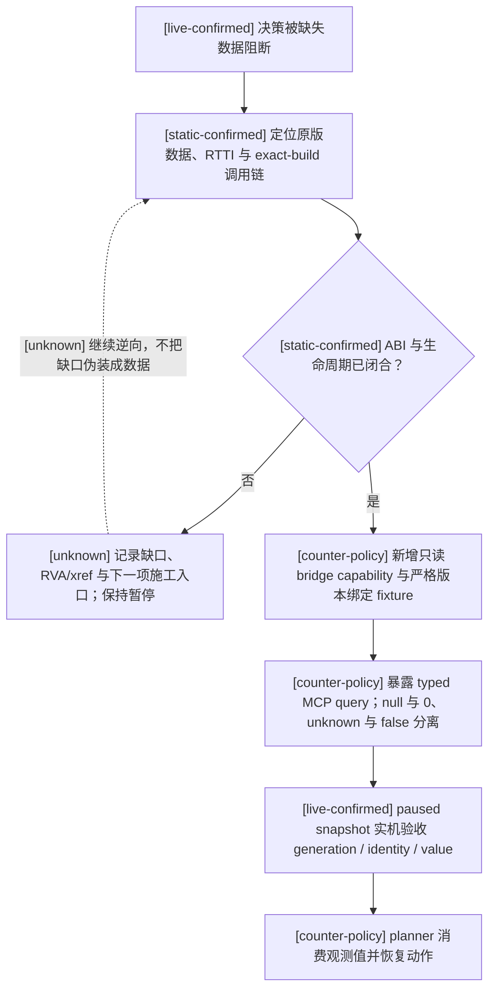

# CK3 原生 AI 决策树索引

## 版本与证据边界

- [static-confirmed] 本目录只绑定 CK3 `1.19.0.6` 的
  `Crusader Kings III/binaries/ck3.exe`，SHA-256 为
  `2D00FF3101EF70B566F2FCBAE292F09263199C80E9DC8F139B82D7D96F83DB86`。
- [static-confirmed] `static-confirmed` 表示结论由该 EXE 的 RTTI、反汇编调用链，或同一安装包随附的
  `game/common` 原版数据/说明直接支持；RVA 均以该 EXE 模块基址为零点。
- [live-confirmed] `live-confirmed` 表示结论已在该 exact build 的真实 paused frame 中互证；具体专题必须记录其
  artifact/checkpoint 与生产会话边界。纯研究采样保持只读；production query/command 的验收则必须走正式 bridge/session，
  并以观测到的后置状态和 managed cleanup 为准，不能只凭 ACK。
- [inference] `inference` 表示由多个已证事实推出、但尚未找到执行分支或独立实机对照的解释，不能当成
  exact ABI 或确定策略。
- [unknown] `unknown` 表示尚未闭合；图中的虚线边和虚线节点也一律表示 unknown，不能据此实现原生动作。
- [static-confirmed] EXE、原版 AI 数据或版本任一变化后，本目录的地址、阈值和决策树都失效，必须先重算
  SHA、重新定位锚点，再逐条升级证据等级。

## 文档

- [counter-policy] [autonomous-capability-roadmap.md](autonomous-capability-roadmap.md) 盘点全游戏自治能力面、
  当前 bridge/MCP/planner 的可玩边界、依赖顺序与持续验收里程碑；它是施工路线图，不代表 CK3 原生行为。
- [static-confirmed] [army-controller.md](army-controller.md) 记录战争 stance、目标候选和评分、重算节拍、
  `CAISubunitStack` 分派状态机、围城/追击/战斗/撤退切换边界，以及战争 `16777290` 的双敌军实例。
- [static-confirmed] [army-contact-resolution.md](army-contact-resolution.md) 把原生 AI 的目标/避战门连接到
  normal daily movement，并闭合“全军移动后按 queue 接触”、省份 full-CUnitID 数值序 opponent、已有战斗优先、
  多战斗 tie-break、新战斗 participant 顺序与 `initiator_is_defender` 攻守极性；非 daily placement 仍为虚线 unknown。
- [live-confirmed] [actual-contact-scope.md](actual-contact-scope.md) 把同一链冻结为机器可读 ABI/fixture 与
  application-main 只读 query；已完成真实 contact date、CombatID、两侧 stored order、combat-v3 复用和战中冷恢复对照，
  `join_existing` 与 multiple-compatible 实机分支仍待闭合。
- [static-confirmed] [war-declaration.md](war-declaration.md) 记录周期/人格/cooldown 门、目标与盟友军力聚合、
  战争中目标的 power-ratio 上限、hostage、CB 评分、90% 截断、Top-5 加权随机与声明提交顺序；未闭合的
  财政和军力细项均保留为虚线 `unknown`。
- [static-confirmed] [combat-prediction.md](combat-prediction.md) 闭合原生 AI 的确定性战力占比、敌方修正、
  接战/绕路/求援/撤退阈值与 exact-build ABI；它明确不是胜率或随机战斗模拟。
- [static-confirmed] [battle-simulation.md](battle-simulation.md) 记录真实 `CCombat` phase/day tick、战宽、
  commander roll、advantage、MAA counter、主阶段 damage、casualty/pursuit 与 PRNG 边界；同时冻结
  exact-native-parity Monte Carlo 的完整输入门，并明确当前局胜率为 unavailable，而不是近似人数比。
- [static-confirmed + live-confirmed] [battle-controller.md](battle-controller.md) 把接触/参战、求援/增援、主动撤退、
  溃退、追击与战斗终结串成原生控制树；P1 ongoing identity/ledger、bounded hold 与 normal terminal query 已 production-live，
  `battle_identity_live_ready=true`、`battle_hold_ready=true`、`battle_retreat_ready=true`；full-side 与 owner-subset
  retreat postcondition 均已 live，增援 assignment 只读查询也已 production-live，但 assigned+ETA/join、forecast、no-normal/residual/
  assignment-reopened terminal 分支与总 controller 仍未完成。
- [live-confirmed expanded frame] [ongoing-battle-frame.md](ongoing-battle-frame.md)
  冻结 `query-battle-control-snapshot-v1` 的 exact ABI、
  retained entry/current-soft-hard ledger 与 bounded hold 后置验证；cold checkpoint `9104CCB8...CC63` 的 maneuver 1 到
  main 2 原 frame artifact SHA 为 `A0FC6BB7268E38026CC8EED6D6388BFD675AD5DCFB60A1A65FE1C1B64E816AC6`；新增
  selected identity/scope/flags/four-gate legality 又通过 day 0–16 production progression，artifact SHA 为
  `FB521B39AD5529434596212DB9ADC1EA27D4C270D28D13575B9A2D80913BCF40`；production planner 两轮
  query→one-day advance→same-CombatID requery 也已 GREEN，artifact SHA
  `96CE25384517F0060A58623958DE071F43C3C2F7B68AEB6E668473E986C1DD57`；full-side 完整撤退 transition artifact SHA 为
  `21D58737126CA4ED8B0B49DB7749EA4701F3BA6F94A8B8493698F8737E5784FA`。
- [static-confirmed + full-side/owner-subset live-confirmed] [active-combat-retreat.md](active-combat-retreat.md) 冻结 active battle movement
  candidate、共同 legality、full-side/owner-subset apply 与 pursuit 边界；同帧只读 retreat projection 已证明 day 14 false、
  day 15 true；planner-selected target 的 exact route preview/token/order 又在 full-side 实机中令军队真实进入 retreat 并写入
  target/route；按完整旧 CombatID 的独立查询同时证明 full-side `main/12 → pursuit/0`，owner-subset 则只移除 owner
  `36108` 的 CUnit `357`、保留盟军 `33554657` 与原战斗。owner-subset artifact SHA 为
  `7780B619B2E7B90B8D5D5030D779F58F266585A6246A79B6C2FE20EF0F2701F9`。AI cadence 与 native destination
  候选/评分继续作为 opponent-model `unknown`，不阻塞我方动作。
- [static-confirmed + assignment-query live-confirmed] [battle-reinforcement-and-join.md](battle-reinforcement-and-join.md)
  闭合原生求援滞回、helper stored-order 分配、普通行军、抵达时选择既有 CombatID、tail append 与 pursuit→main 反馈；
  paused `ReadBattleReinforcementAssignmentV1` 已在 CUnit `357` 上实见 asking、parent stored order、route、active CombatID
  与稳定双查询，artifact SHA 为 `F0A6F3C73D49AE93CC20680E23E787F28B54CA086DAD80392E27651DAB1DB9C6`。
  当前样本未 assigned；assigned+aligned ETA、真实 join/reopen 与改派动作仍待闭合。
- [static-confirmed + normal-terminal live-confirmed] [battle-terminal-and-reentry.md](battle-terminal-and-reentry.md) 区分 daily phase-done
  normal result 与 invalidation sweep no-normal-result，冻结共同 army backlink 清理、Province residual rescan、旧 CombatID 删除和幸存
  AI assignment 重入顺序。`0x230A590` terminal journal、`0x222A69B` battle-warscore journal、paused transition query、service 与 MCP
  均已实现；真实 `CombatID=335544325` 在第 33 日以 normal result 删除并把玩家分类为 `subject_retreating`，artifact SHA
  `61D0D912206A90D9B34DDE3555AEC941EC3538C253DBC4DCEB9D177D7456FDB1`。ResultID 缺失仍不得反推 terminal kind；
  no-normal、同省 residual 与 assignment-reopened live fixtures 尚缺。
- [implementation-confirmed] [combat-phase-events.md](combat-phase-events.md) 冻结 stock commander/knight
  phase-event 的 13 个顶层 row、canonical machine manifest、独立 golden、伤残死亡与 prowess 状态转移、同日刷新
  顺序；同时给出 v3 character/side/army/accolade/advantage required-field matrix、precontact 不伪造 CombatID 的边界，
  以及 actual playset、effect-local 抽样与 original trace 的剩余门。
- [implementation-confirmed] [combat-simulator-core.md](combat-simulator-core.md) 记录已落地的纯 Python
  Q100000、main casualty、逐 tick counter、component、三日 pursuit、RNG scheduler、battle-end/retreat 与四场
  `N=100000` research envelope，以及不可绕过的 transition manifest；当前由 loaded-playset/effect evaluator、
  same-day character feedback 与 exact original trace 阻断，始终不接 planner/MCP。
- [static-confirmed] [combat-simulation-inputs.md](combat-simulation-inputs.md) 盘点当前 bridge 可观测性、原版
  数据参数与尚缺的 live regiment/terrain/commander/combat-side/RNG 输入，并定义只读查询与模拟输出的
  fail-closed schema 草案。
- [static-confirmed] [war-termination.md](war-termination.md) 记录原版 AI 的执行要求、白和、投降三棵主动提出与
  接受树，包括战分、时长、债务、其它战争、人格、人质与 auto-accept 边界。
- [inference] [player-counterpolicy.md](player-counterpolicy.md) 把上述已证事实映射为我方 planner 的
  lexicographic counter-policy、enemy endpoint epoch、multi-stack 路线矩阵、cohesion / merge 边界与测试矩阵；
  该文档描述我方策略，不代表 CK3 原生 AI 的 static fact。
- [inference] [player-war-entry-policy.md](player-war-entry-policy.md) 在原生宣战树之上设计胜率下界、损失、
  财政/时间/机会成本、盟友不确定性与退出代价的 expected-utility 门；declaration 缺 power 或 combat
  forecast 时必须 fail closed。
- [inference] [player-war-exit-policy.md](player-war-exit-policy.md) 比较继续、白和与投降的风险调整效用，
  设计防守战提前止损、条款核验、接受概率、防抖和 paused postcondition；输入缺失不会被误读成自动投降。

## 原生 AI 研究工作流

1. [static-confirmed] 先冻结游戏版本、EXE SHA 和原版数据文件版本；不同 SHA 的地址或行为不得沿用。
2. [static-confirmed] 先从原版 `.info`/`defines`/`txt` 和 EXE RTTI、调用链建立决策树，并把每条边标成
   `static-confirmed`、`live-confirmed`、`inference` 或 `unknown`。
   每个新增或变更的原生 AI 决策专题都必须同时维护证据文本与对应 Mermaid 决策图；只改其中一边不算完成。
   所有 `unknown` 边必须使用 Mermaid 虚线（例如 `-.->`），不得与已证或推断边画成同一种实线。
3. [live-confirmed] 如需互证，只做可审计的只读快照，记录 PID、对象 ID、字段和时间；不得为研究触发任何
   游戏动作或改变时间流逝。
4. [unknown] 无法闭合的枚举、评分账本、事件触发器和分支顺序必须继续留作虚线 unknown，不得用“看起来像”
   补成实现契约。
5. [inference] 只有决策树已落入本目录、证据边界清楚后，才允许据此调整我方 planner；策略层必须保留
   失败回退和观察窗口，不能调用尚未证实的 native 分支。
6. [static-confirmed] CK3 升级后按“新 SHA → 重新静态定位 → 只读互证 → 更新树 → 再改策略”的顺序执行，
   先改我方策略再补逆向文档不构成完成。

## 可观测性优先：缺数据就补 MCP

[counter-policy] `unknown` 只描述当前证据边界，不是自动玩家可以无限停留的运行状态。只要缺失字段已经阻断
真实游戏里程碑，下一项工作默认是补 exact-build 只读观测链，而不是继续用相同快照重复规划。实施顺序固定为：

- [counter-policy] 优先发布只读状态或查询；只有查询结果、validator 与后置条件都闭合后才新增改变游戏状态的命令。
- [counter-policy] MCP 查询必须给出 typed `available / unavailable / invalid` 结果及缺失 capability，禁止返回猜测值。
- [counter-policy] 原生命令的 queue ACK 只证明提交；决策所需事实仍必须由下一份一致 paused snapshot 或专用只读查询确认。
- [counter-policy] 若某字段影响战斗、宣战、战争退出、围城或路线安全，缺字段即触发观测口施工优先级；不得用 UI 人数、
  字段默认值或旧版本偏移代填。
- [counter-policy] `null` 是 transport 的三态语义，不是完成标志。若 damage/toughness、骑士、渡河等字段仍让
  `monte_carlo_ready=false`，就必须继续补对应原生读取口；只有已独立解锁真实决策价值的 partial query 才能单独发布，
  不得把“已经定义字段名”写成“已经观测到数据”。
