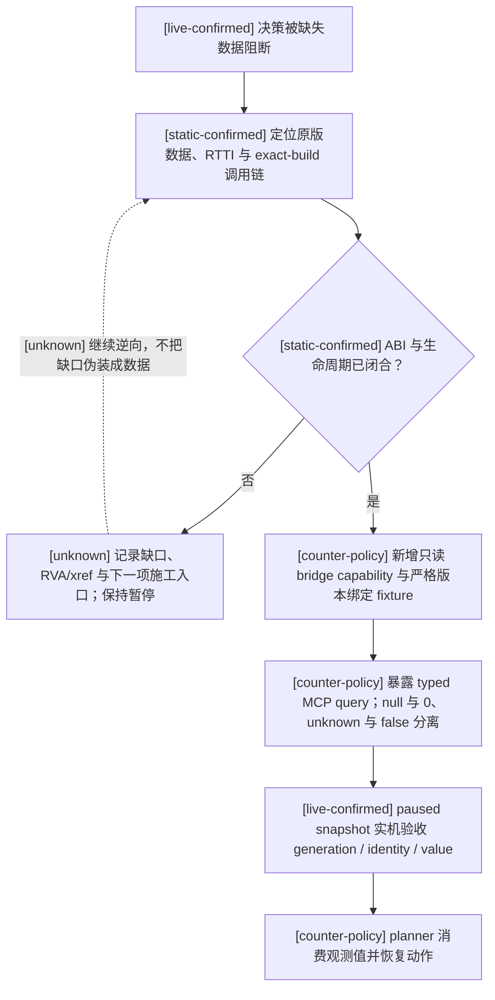

# CK3 原生 AI 决策树索引

## 2026-10-09: Restored original campaign observes current native state

[Mailbox ABI recovery](main-thread-observer-mailbox-abi-12004.md) records the
actual R79 publication failure and three-owner Native42 rebuild. R80 passed
all thirteen full paused-frame checks in the original Robert29829 campaign,
with the owned game minimized. Public revision3 binds native revision2;
the saved baseline remains6010 days and H9715.

The [same-query person carrier](battle-person-carrier-same-query-12004.md)
returned ready numerical rows for actual characters29829 and31050. This is a
production-live primitive. The [following collection](battle-person-following-2921a90-12004.md)
passed ten original native packets and the sole registered consumer after a
64-job build; Native43 remains static-ready and is not the running R80 DLL.
[Ordinary Army callback consumption](army-normal-turn-callback-consumption-12004.md)
is also qualified offline. Complete person/Entry and full soldier-loss execution
remain unfinished.

[Guardian and educator source](guardian-educator-source-entry-12004.md) binds
the existing education interaction's six roles. R80 observed a bilateral heir
marriage, zero children and no pregnancy. Its ordinary cold-marriage read
independently confirmed the recovered material result; no birth, education,
new day or SAVE is credited by these observations. Current actual context and
siege observations are indexed in the rolling reports.

## 2026-10-09: Child education point trait observer qualified offline

The next [actual linked collection after the person carrier](battle-person-following-2921a90-12004.md)
has a frozen source tree and explicit remaining branches; its later Native43
qualification is recorded above and in the topic.
The [finite M6 Chaplain live plan](m6-chaplain-native41-r79-live-plan.md)
uses existing ordinary query and action paths. R79's first complete paused
snapshot failed; R80 subsequently restored observation through Native42.
Neither source document alone adds gameplay credit.

[Child education point trait inputs](child-education-point-traits-12004.md)
closes the nine authored child-side HasTrait dependencies and separate
eight-key educator role. The existing child query gains an optional private
education_point_traits observer using the admitted actual4 Trait database,
Character.HasTrait and full-ID child receiver. Root's five new whole native
frames and six-scene registered-query/Service compound passed; canonical40
is static-ready. The actual production build and final qualification pins
are documented separately in the topic. No new live credit is claimed.
Guardian/educator identity, loaded outcome AST and education actions remain
unresolved. Qualified Native38 focus and old child fields are reused.

## 2026-10-09: Current callback soldier effects qualified offline

[Current callback soldier effects](army-current-callback-soldier-effects-12004.md)
connects the actual4 callback-derived supply budget with the existing four-pass
conditional soldier model, retaining captured siege/raid budgets and physical
aliases. The sole five-scene registered NativeDriver/Service compound passed
in 7.5853707 seconds. This is static-ready; actual post-stage loss, complete
daily/monthly execution and live outcomes remain unqualified.

## 2026-10-09: Actual4 person carrier on the existing character query

[Same character-query carrier integration](battle-person-carrier-same-query-12004.md)
connects the bounded [direct numerical source](battle-person-next-direct-carrier-12004.md)
to the requested character's actual owned model and existing terminal MCP query.
Native41 is qualified offline: compiled native/fixture source `c928804c`,
Python qualification `45ce8134`, eight original native packets and the sole
registered consumer GREEN. The actual peak compiler concurrency was 64.
Complete person/Entry
reconstruction, gameplay and live qualification remain incomplete.

## 2026-10-08: Ordinary post-birth child education source

[Child education and guardians](education-and-guardians-12004.md) records the
current stock guardian/focus decision tree and existing same-query receiver
gaps. Guardian script eligibility has no numeric minimum ward age; focus
starts at6. Existing descendant IDs and actual4 generic age/sex source are
reusable, while child focus semantics and the named HasGuardian predicate
remain unqualified. A sole Root named-entry recipe is SOURCE_NOTRUN; no
birth, guardian, focus, live or new gameplay credit is claimed.

## 2026-10-07：本地更新至 Steam build25734779，MCP 迁移中

[actual4 family关系读取](family-relationships-12004.md)闭合当前Family订婚、主配偶、spouse数组与容量字段。新增独立actual4 reader消费实际core/full-ID resolver；Family+28由真实Character1A8→Family20→DWORD数组内核receiver8路径证明。共享field windows复用，capacity有限6663B/9reads，old kernel不重读；source implemented，Root fullSnapshot接线/build/paused资格待执行，不引入未采用9a阈值功能。

[实际安装更新与 MCP 迁移](installed-build-25734779-mcp-migration-2026-10-07.md)：R0051 完成一日路线循环并正常保存 h9613，累计5997；10streams冻结、ownedjob退出并证明进程回收后，Steam已更新。新EXE SHA98702f88…dd518已冻结，native文字确认1.20.0.4，text/rdata均变，实际ABI迁移正在施工。旧g105严格构建RED C4324保留，g106已采用source0597但FIRST未跑；并行迁移各MCP领域，尚无新版live信用。
## 2026-10-07: Army registered MCP materialization performance candidate

[Army response materialization](army-strengths-mcp-result-serialization-performance-12003.md) records actual native35,683,420 B to registeredSDK140,369,382 B and the later198.265585 s refresh. Root confirmed the actual Army007/026 entry is ck3_execute_step(step="query-army-strengths-v1"). Initial d8 direct-tool-only coverage missed that entry. The follow-on wraps this exact step plus the direct Army tool, preserving all structured data and original schemas while reducing full JSON text duplication. The raw step has nine top-level keys and lacks source/army_ids; only its summary derives IDs/frame from rows/queried_*. Other steps retain the original dict path. Native/Service production semantics are unchanged; the same sole expanded compound and actual performance remain FIRST NOTRUN, research.

### 2026-10-06 late update: actual Army query recovered

Root 在 R0051 原 Robert29829 普通战役、最小化暂停现场，取得完整 Army 查询 GREEN：Army218104048 / CArmy67109093，1833/2367、39 regiments、supply100、attrition0；实际35,683,420 B native响应在67,108,864 B上限内完整写入。它是 production-live read-only primitive，不是完整 daily/monthly/future 或战争胜利。query007为15:29:48.082538–15:30:37.915800 UTC，49.833262 s；writer008为complete/success，实际来源g10471b、DLL64e934f2。随后真实 realm-law009 发布四种继承法profile；shared planner读取war termination后选择目标2606的route preview。新游戏日仍0，累计5996、Oct6原961日、natural0保持。

本次 fixture 修正实际资格分列：Detachment DATA native8＋compiled Service8/16 checks＋sole10 cases GREEN；Commander native7/64 checks＋sole Service GREEN；Tenet native7/77 checks＋sole registered MCP GREEN；Fervor corrected build8.5734101s、native4/44 checks和MCP4/85 checks GREEN；Creation/Indulgence已GREEN。Clergy only-target completion2.7343227s与native6/105 checks GREEN，但首consumer因真实 registry package缺失而RED（0 cases），正在绑定原71b真实依赖进行必要重试；Finalizer corrected sole11-TU build13.4821248s GREEN，FIRST另记。原joint、compile/link与consumer失败均保留，不合成整批all GREEN。源码修正与原71b实际runtime pins分列，未热替换当前游戏。

[实际Army恢复](Z:/ck3_mod_rewrite_process_assets/g2-background-20261006/managed-runtime-next-g104-h9596/ROOT-FIRST-ACTUAL-ARMY-CAP64-RECOVERY.json) · [真实完整写入](Z:/ck3_mod_rewrite_process_assets/g2-background-20261006/managed-runtime-next-g104-h9596/ROOT-FIRST-ACTUAL-CAP64-COMPLETE-WRITE-RECEIPT.json) · [Detachment资格](Z:/ck3_mod_rewrite_process_assets/g2-background-round29-20261006/detachment-date-pending-source/implementation/QUALIFIED-ROOT-DELIVERY.json) · [Tenet FIRST](Z:/ck3_mod_rewrite_process_assets/g2-parallel-20261006/faith-tenet/g104-first/attempt01/ROOT-FIRST-DELIVERY.json)。

## 2026-10-06：普通圣战所选 context 与 CB 原生费用 source

[普通圣战 CB 费用](ordinary-holy-war-declaration-costs-12003.md)复用已闭合的 exact `.3` selected-context、原生 scope 与十资源 Q100000 evaluator，接入同查询 optional CB-only vector，保留实际 additional role、claimant native fallback 与完整选项 ID。generic/total cost 仍明确 unknown；旧 endpoint 保持兼容。独立 nextsource 实现、sole whole-native FIRST 与 sole registered consumption 已准备，FIRST build/native/consumer/live 全部 NOTRUN，状态为 research，不增加游戏日或 live 信用。
## 2026-10-06：当前登陆惩罚天数接入同 Army 查询，FIRST NOTRUN

[当前登陆惩罚天数](army-current-disembark-penalty-days-12003.md)已闭合 `Army.GetDisembarkPenaltyDays` literal4736B10 → callback24EA630 → 7B core24AA240，完整 typed registrar与既有实际CArmy provider证明receiver。现有 `ck3_query_army_strengths` 新增 readonly int32 current-days leaf，exact `.3`已绑定，0/-1/34均保留；active/expiry predicate与future landing日期独立。独占基线71b729f0的新whole native producer五source cases与真实strict/Service/registered MCP consumer已编写；build/native/consumer FIRST全部NOTRUN，状态 research/source implemented，零新game/query/日与live信用。既有retained crossing geography资格直接复用。
## 2026-10-06：首继承人关系迁移与原生生育输入

[首继承人关系生命周期](first-heir-relationship-lifecycle-12003.md)先封原生/observer树，后修已完成订婚履约记录的当前关系分流；唯一新实际Service夹具FIRST GREEN1/1、六分支，static-ready production consumer，旧候选2/2未重跑。[成人配对输入](first-heir-adult-pair-inputs-12003.md)封selected/effective lineality、原生prospective House/Dynasty与既有paired fertility读取发布缺口；[原生生育质量分支](first-heir-native-fertility-quality-12003.md)通过授权唯一523B exact `.3` body闭合candidate fertility score-floor排除，actual loaded threshold数值仍unknown。两项新观察/质量replacement保持research，未新增live/游戏日/自然继承。
## October7 current Combat/Rule24 candidate

[Current Combat roles/phase](army-current-combat-roles-phase-observer-12003.md) and [demanded Rule24 loaded pins](army-current-rule24-source-pins-observer-12003.md) are integrated source candidates on base71b729f0, with14 new genuine wholequery scenes and one sole full-Service compound prepared; Root joint FIRST is NOTRUN. Rule24 adds33B per actual receiver/query without rereading provider/array. [Complete D19140 native state mapping](army-current-native-state-mapping-12003.md) records no Army31 dependency and invalidArmy→regular; the earlier independentcurrent31 FIRST remains static-ready and is not replayed. Move-readiness remains a source-sealed proposal; Root actual route preview succeeded and no new gate is added.

### Oct6 actual诊断与新source提交索引

current21 exact-build当前只读输入/whole Service路径具首次static-ready，9whole/18occ；完整callback与future/changed-stage依赖继续分列。R0050 actual Army响应暴露33445694B>2097152B真实size_limit，same connection generation1诊断可观察并确认bridge healthy；writer diagnostic升级production-live primitive，Army功能尚未恢复。[R0050实际资格增量](Z:/ck3_mod_rewrite_process_assets/g2-resume-20261006/local-user-reservation-20261006/report-preparation-current21/qualification-child/R0050-ACTUAL-QUALIFICATION-UPDATE.json)、[真实Army size_limit诊断回执](Z:/ck3_mod_rewrite_process_assets/g2-background-20261006/managed-runtime-next-after-r0049-response-failure/ROOT-ACTUAL-ARMY-RESULT-WRITE-DIAGNOSIS.json)。

12个source candidate完整commits及cap64 faultfix99878123已完整集成，已集成 source `bcdbc27e972df477cc9b01f167c066a691c23a7b`；FIRST g104 build/native/whole/new live均NOTRUN。ORIGINAL/adopted commit与每包既有原生source/interface依赖见[12包新source与采用commit索引](Z:/ck3_mod_rewrite_process_assets/g2-resume-20261006/local-user-reservation-20261006/report-preparation-current21/candidates-child/R0050-TWELVE-FEATURE-COMMIT-INDEX.json)；不以已有专题或旧CI授本批资格。早期current31文档结构修正、realm token0x336F元数据与reinforcement旧empty-route RED维持原scope。

已发布g102 exact0582f912949e63bf6d8f6c7a94efa27ecdcdd356的Official Runner CI37460537515 completed SUCCESS，只授该head官方L0；复用现有fields，不外推给g103/g104、cap64或12包首次资格。

Root实际登记：2026-10-06T21:43:54.058456+08:00；日报与W41持续滚动，未正式收口。

## 2026-10-06：增援到达与当前既有战斗准入已接线，FIRST 待运行

[增援到达准入](battle-reinforcement-arrival-admission-12003.md)将 current admission、current side、实际 roster/backlink 接入现有 reinforcement 查询，并提供七新 whole-wire 场景与 sole real Service consumer。source integrated / research；编译、Ct、consumer 均 NOTRUN，foreign 仅 observation、future_binding=false。[Oct6/W41 fields](battle-reinforcement-arrival-admission-12003-fields.json)供 Root 报告与下一 joint FIRST 消费。h9593 仅复用 Root 无 active combat、两 stationary armies 摘要，本包零新 game/query。

## 2026-10-06：本机仅后台，两项真实故障修复首次资格

本机用户自行游玩CK3，后台保全原战役h9586/5996日，无新game或deploy。g82两项[typed query异常回收](typed-query-executor-exception-reclaim-12003.md)与[人物source读取故障](battle-current-person-source-read-production-fault-12003.md)一次严格formal编译、两个FIRST新Ct均GREEN，static-ready；actual844/845/850 RED保留。新增[明确V2消费者](general-battle-v2-input-consumer-12003.md)、[fresh模型基线](battle-first-contact-model-quality-814-12003.md)FIRST各路径GREEN，[Rule43真实source](battle-person-rule43-real-admission-12003.md)和[outer caller关联](battle-first-contact-outer-context-caller-association-12003.md)继续补同查询观测。完整person/Entry/phase/forecast/live仍未完成，其他机器运行安排不变。

## 人物后缀与月度caller预算离线资格（2026-10-05T23:06:01+08:00）

原生source先封存后实现：同查询291F550/291F940贡献、explicit person baseline/prefix/291D1D0、24E4D10后stock对应的条件monthly预算已static-ready。后续13个新增native CTests、70份新原生fixture JSON生产消费者GREEN；无新paused/live样本或游戏日。[人物frontier](battle-first-contact-person-preparation-frontier-12003.md)、[显式阶段](battle-person-stage-baseline-12003.md)、[budget/writer](army-attrition-soldier-writeback-12003.md)记录实际source、失败与资格。完整人物Entry/其他monthly effects继续有可施工入口；运行时freeze不变。

## 后台接手已完成八包离线交付（2026-10-05T19:48:26+08:00）

用户当前自行使用CK3，本轮游戏/SDK/attach/query/UI/Steam操作0、新自动游戏日0。八包已接入生产路径并完成一次相称验证：完整路线ETA、实际参围成员、补员/损耗数值consumer、pre1640接战输入、当前战场geography、盟友拒绝diagnostics、普通holy hire。生产bridge及五native目标编译、5/5CTest与必要compiled-byte consumer均GREEN，资格为有限static-ready；final setter/post-A/B新增source研究已入canonical，完整loss/Entry/forecast仍partial。两处真实编译RED及最小修复保全。

详细源码/结果/回执与未完成项见 [后台接手施工](../handover/2026-10-05-g2-background-successor.md)。默认离线构建没有采用v73运行flags、没有deploy；下次实机须另冻正确配置并重新读真实状态。日账保持5035/36524、resume1882、Oct5+377、G2 5/8、NW2 2/4、自然0，最新自动存档h9052/raw53265168。3711攻占、War117结算和长期战役未完成；旧恢复游戏授权仅代表历史。

- [角色技能 trigger 与属性转移读回（1.20.0.3，2026-10-04）](character-skill-trigger-readback-1.20.0.3-2026-10-04.md)：六项普通 getter 的 RTTI／RVA／总技能缓存偏移与 RHS 解析边界；离线研究，基础值上下限及 effect 后缓存刷新仍待对应实机。

## 2026-10-04：新增战斗源码专题入口

本段索引开发源已采用的专题；当前冻结运行源仍为 `g63/df6e5039`，新增源码不视为已加载能力。

- [当前条件 horizon](battle-current-conditional-horizon-12003.md)（`79e0e4fb`）：有限条件 seam 为 static-ready，两个独立生产组合 case GREEN；完整 terminal、AI selection 与 script callback 仍 partial，历史 harness RED 保留，条件结果不作为未来事件或终局承诺。
- [原生 owner 撤退选择](battle-native-owner-retreat-selection-12003.md)（`94c03c90`）：research-only；选择树研究不代表撤退动作或实际结果。
- [正常战斗终结](battle-normal-finalizer-1.20.0.3-2026-10-04.md)（`9597750d`）：static-partial，两个聚焦 GREEN；实际终结结果与完整闭环仍单独验收。
- [当前 horizon 输入组装](battle-current-horizon-input-assembly-12003.md)（`b0c20706`）：static-partial，两个聚焦 GREEN；输入组装不增加未来事件执行信用。
- [具名人物伤亡](battle-named-person-casualty-12003-2026-10-04.md)（`0799f6ea`）：static-partial，两个聚焦 GREEN；尚不授具名人物实际伤亡或死亡信用。
- [战斗 phase 与 event 反馈](battle-phase-event-feedback-12003.md)（`c3d2188d`）：static-partial，两个聚焦 GREEN；当前反馈输入与未来 event 执行分开。
- [选定 owner 的 subset 撤退](battle-selected-owner-subset-retreat-12003.md)（`1ff943f14657c29c3e28e4cd724fa8a23e586640`）：普通 subset 条件分支为 static-ready，两个 case／51 checks GREEN；原生 AI selection、positive-knight、absent H append、完整 258B830 与 movement-final 仍未实现。

既有围城和军队 health 实测、一次当前 tick 的资格保持原专题范围；这些证据不把新增研究或静态局部实现提升为未来事件、完整终结或整场 OODA。

## 2026-10-04：v46 七日路线与实际集结闭环

累计 **4032/36524日**、接续 **+879日**、10月4日 **+7日**；10月3日冻结 **+777日**，自然继承0。v46七日执行前保存为h5510，实际 **7 calendar / 7 bounded time-save / 7 whole one-day OODA / 168h** 全部正常落盘，末批次h5532/raw53241096；随后独立兵力查询与零日保存形成最新 **h5534 / raw53241096 / 91,825,231B / SHA-256 `22e9028da99a4f77ba5b5485b912065f38aa9761fc9100a1adf63d4dd238f028`**。新增7日由Root计入一次，各文档消费和后续只读不再加日。

- [实际行军与剩余路线](army-march-remaining-timeline-12003.md)、[解围原生输入](war-relief-siege-native-ai-12003.md)及[占领目标](war-occupation-targets-12003.md)：主军83886367在8754/moving7，沿完整8-hop route继续2640方向，无战斗或撤退。2640仍未被占领，但敌FullSiege318767158保持active，进度97.427%、ETA10日；尚无抵达、玩家接战或解围信用。七日末帧没有strength查询，兵力以随后独立查询为准。
- [集结与补员实际闭环](army-regiment-replenishment-raised-reserve-12003.md)：after7当前native37/public2的独立兵力口确认新军167772189在2618、**123/123兵、1regiment、regular1、not_gathering/readytrue**；旧军83886367仍保留2259/2460兵、39regiments及8-hop路线。一次default raise→普通日推进→实际集结完成→独立兵力/保存已形成有限 **production-live loop**；当前123兵来自fresh getter，不把此前unraised reserve当已集结证据，也不外推为全量战争部署。
- [原Sway实例只读状态](ck3-1.20.0.2-sway-state.md)：原FullID134217986/gen8/target34333的独立恢复查询GREEN，native5/public2/raw53240928、exact owner29829 jointrue、statuscontinue/CanContinue=true/terminalfalse；历史零日保存h5510独立保留。这是原实例状态 **production-live primitive**，没有新SwayStart、完成、终结或关系收益。旧004 runtime RED原始失败帧和原因仍丢失；f4cdcb66仅增强错误文本，重查GREEN不改写旧失败分类或证明capability修复。

本包直接复用[七日sole消费回执](Z:/ck3_mod_rewrite_process_assets/g2-resume-20261003/military-ooda-continuation/relief-v46/seven-day-consumption/ROOT-DELIVERY.json)、[集结最终回执](Z:/ck3_mod_rewrite_process_assets/g2-resume-20261003/army-reinforcement-raise/runtime-v46-gathering-finished-consumption/ROOT-FINAL-DELIVERY.json)与[Sway独立恢复回执](Z:/ck3_mod_rewrite_process_assets/g2-resume-20261003/battle-observation-schedule/sway-v46-original-readonly-recovery/ROOT-DELIVERY.json)。后继 **v47 / Source54 / published `1c67491` / 冻结g51** 的full build15115已正常exit0 **GREEN**：4Release/W4WX、jobs64、556TU/553unique/1073inputs、82.767049s，DLL8,915,968B/SHA-256 `c4ff4d1835356322c94ebe4443d354dbcbbb9854863703c2d931757641f295eb`。renderer一次full5534/save5534/10streams与official prepare已GREEN，环境SHA `2cf616eb269cbf338069fbb3bc69159ccb0d395417da064ba52b64d25b9356cd`；verify/rebind/cold尚未完成，不授v47 live信用。

同source官方CI **37139457808 RED** 单列保留：existing publicCID schema测试直接取minimum触发KeyError，char-only subject的Optional生成union metadata wrapper；生产constraints未丢。仅test union/None分支修正待采用，不改变已完成v46七日帧，也不覆盖旧C1061与completion失败历史。中央日/周/交接报告由Root统一发布，当前目标和真实边界回链[统一进度](../autonomous-agent-progress/README.md)。下方旧阶段记录保留各自截止。

## 2026-10-04：v46 增援实读与战斗上下文施工

v46/R0023/PID77476 由 source9772958/冻结g49 恢复至 raw53240928；原生 strict553TU/550unique/1066inputs、jobs64、78.506418s 与官方 CI37134271120均 GREEN。最新正常 SAVE h5509，91,443,885字节，SHA-256 `7ded957a3c703ceb5bd5bd3515444c5c04d01de0594da1812a2ba99440fabafb`；累计4025日、自然继承0，窗口最小化且非前台。

- [雇佣兵原生增援上下文](player-mercenary-reinforcement-context-12003.md)：actual013 查询559候选，33支最终可雇佣、payment2/CanAffordtrue；实际生成省2618，资源1066.34828金币。尚未雇佣，typed动作正在施工。
- [集结与补员输入](army-regiment-replenishment-raised-reserve-12003.md)：actual016新军167772189原生剩余7天、available/readytrue，但实际0/0；旧军2259/2460、not_gathering，继续2640方向行军。没有抵达、接战或解围信用。
- [实际侧选将](combat-side-commander-selection-12003.md)、[战中换将时序](commander-in-battle-assignment-timing-12003.md)、[counter-campaign原生分支](counter-campaign-native-branches-12003.md)：新的exact-build研究，未增加实战信用。
- [v2局部上下文优势](contextual-advantage-v2-12003.md)：7文件扩展、sole native5/5与registeredMCP5/5 GREEN；当前static-ready，完整 encounter=false，faith来源正在续建，尚未cold部署或实读。

同批004原Sway completion读取真实RED，另三项及merc/gather/SAVE独立GREEN；原失败保留，具体原生原因恢复中，不归于增援capability。当前进度与后续回链[统一入口](../autonomous-agent-progress/README.md)和[接续报告](../handover/2026-10-03-g2-v33-resume.md)。下文保留各历史截止。

## 2026-10-03：v43 冷恢复与军事输入的当前入口

v43/R0021/PID14124已真实冷恢复，运行proof为minimized=true/foreground=false；最新有限移动保存h5384，累计仍 **3992日**、自然终局0，本轮零新增日。实际二进制来自冻结g45/source8e2cfbee：strict545TU/542unique/1051inputs、jobs64/79.43849s GREEN，DLL8,752,128字节/SHA-256 `1dba8d92eadfb6ea4469345b465b9500b8dc83ed4059303adcd949a2707e8524`、官方CI37125578704 GREEN。

- [当前补给、上限与损耗](army-current-supply-capacity-attrition-12003.md)及[补员与预备兵输入](army-regiment-replenishment-raised-reserve-12003.md)：health016实读stored100/cap300/月补给+20/attrition0，只读primitive，不作未来补给或损失承诺。
- [围城效率与phase统帅输入](siege-efficiency-inputs-12003.md)：phase014完整19行，Robert原生base quality34/generic advantage34/围城阶段时间modifier raw−10000；18个可任命候选无已观测的更优项，只读primitive、没有换将。这三值不含effective_roll读数。
- [投影接战scope](projected-contact-scope-v1-12003.md)及[对应证据](projected-contact-scope-v1-12003-evidence.json)：remote004/006与v2 SDK86145正常close GREEN，投影目标的当前守方为Robert、enemy entry2634；MC readiness仍false，只读primitive，未声称胜率或实际接战。
- [移动实际入口](war-movement-1.20.0.3-readiness-2026-10-03.md)：typed move SDK54091 GREEN，派遣及独立after有限闭环保存h5384；未抵达或解除围攻。同帧目标2640仍有敌方active siege且我军CanStart=false，War50331736/129指向同一Siege并去重，不能计为两处围城。后续仍沿[Robert防御战争树](robert-defensive-war-loop-12003.md)观察实际结果。

首SDK30708的default-raise012因startup注册缺失真实RED、h5377保存，其余成功查询分别保留；R20 day44 completed-red及preflight01过早读receipt失败→02 GREEN均保留历史。v44/g46正准备modal/raise修复，尚无新版本live信用；原生.3 adapter的162e研究/fixture已发布，未在本包改动。当前能力与保存回链[统一进度](../autonomous-agent-progress/README.md)及[接续报告](../handover/2026-10-03-g2-v33-resume.md)，下方原记录保留其历史截止。

## 2026-10-03T21:25 最新正常pair与真实收复范围

最新 h5360/raw53240136/3992日，第二explicit batch31×24h均完整，末同帧native308/public125/generation5/raw53240136的完整occupation实读：2604/holding2400 legalholder33435、occupied=false、occupier=null、counted_opposing=false；siege_observable=true且active_siege=null、besieging_strength=0、garrison25，独立证明目标敌占已清除。defender31 eligible/15 occupied，恢复帧17→终态15的两项减少中，只把holding2400这项归于已证玩家收复，另一项不猜来源。玩家军83886367仍2604、regular1/complete_empty、noncombat/nonretreat，独立strength2248。仅授单holding收复loop，无玩家battlewin/自然继承。首批44时间保存/43whole与day44 RED、h5222独立恢复分别保留。[唯一31日终态receipt](Z:/ck3_mod_rewrite_process_assets/g2-resume-20261003/military-ooda-continuation/siege-v41/second-batch-consumption/ROOT-TERMINAL-DELIVERY.json)

## 2026-10-03：v41 围城推进与收复批次的最新入口

v41/sourcecd5/冻结g43的首批显式24h推进记录44个实际日，43轮完整收口；末轮005 completion-changed真实RED保留。随后fresh recovery正常保存 **h5222 / raw53239392 / 累计3961日**，该冻结恢复帧PID62988，work20004730/32500000、progress61.553%、ETA60、主战17项仍敌占。不得把末轮失败改写为完整GREEN或补造中间日级帧。

第二批随后实际推进31日/744h，31轮完整并正常保存；累计3961→3992日（接续+839、10月3日+744）。末正常pair **h5360 / raw53240136**，save91,504,049字节、SHA-256 `b76ed06c77002e15c19e3b2c9ca349d4fad68f95c9305e745241c8c1719065c5`。完整occupation后态在native308/public125/connection generation5确认2604/holding2400合法持有人33435、`occupied=false`/occupier null/count false，siege可观测且active_siege null、besieging0/garrison25；Robert军队83886367在2604 regular1/空route/无战斗或撤退、当前2248兵。这是我军单个holding的真实收复闭环；defender31项eligible、敌占17→15，另一项减少未归因。此冻结帧不推测游戏当前运行/停止状态，不授玩家战斗胜利或自然继承信用。

- [Robert防御战争决策树](robert-defensive-war-loop-12003.md)：沿已发布树进行观察、决策、操作与独立结果验证。
- [占领目标真实行](war-occupation-targets-12003.md)：区分首批恢复帧的17项敌占与第二批的15项敌占，仅holding2400已证我军收复，不把两项减少全归因于该动作。
- [holding围城观察与实际进度](war-occupation-holding-siege-observation-12003.md)：首批恢复帧的61.553%进度和ETA60为当时值；第二批收复结果另据独立占领观察记录，估计不是完成证明。

后继v42官方CI GREEN，但fullbuild C1061真实RED；focused fix已GREEN。Root的clean source8e2cfbee已推送，v43/冻结g45基于该源等待build，只记prepared/static状态；这些结果不得替代v41实际游戏结果或声称后继版本已部署。

### 撤退原生树与当前编成的实际边界

[撤退、追击及再接战原生树](battle-retreat-pursuit-reengagement-12003.md)的独立三路径文档包已发布 `0fd88714b154c69bef90c3265a7dc0c56dcbb916`，现有双route查询实读ETA51/42日，不代表撤退解除或固定保护期。[当前目标省编成](battle-composition-actual-v34-12003.md)为target2604/entry2605指定的hypothetical contact，真实40军团与Robert advantage34/roll0..10可读，MC仍false，未接战或算胜率。

## 2026-10-03：v40 已验证查询与正常关闭的当前入口

v40/R0019/PID28788运行时最小化且非前台，现已正常stop，controller46063 exit0、completed-green。末正常pair为 **h5034 / raw53238336 / 累计3917日**（接续+764、10月3日+669；本轮零新增日），save91,105,480字节、SHA-256 `7ebe6682539b7e5477566a4613afc2b36356e0880ed94a0d7f9c4a3b62758983`。旧8-ID strength请求包含已脱离当前scope的474，harness RED保留；重新派生当前7-ID scope后查询GREEN。

- [召盟最终CanSendfalse原因](call-ally-final-cansend-false-12003.md)：九行原因字段实读、零null，全部C88=false且其余六项通过；C88为`is_valid_showing_failures_only`。组内具体触发原因未采集，当前只读primitive，没有发送或取得盟军。
- [当前军队补给源](m5-primary-current-army-supply-source-2026-09-16.md)：Robert当前2290/2461兵、supply100、40个regiments、战略base74829。当前值实读不说明人数变化的原因。
- [移动与撤退原生输入](war-movement-1.20.0.3-readiness-2026-10-03.md)及[实际编成](battle-composition-actual-v34-12003.md)：retreat004/006与composition008查询GREEN；两支敌军退往2631/8754，ETA51/42日均为estimate。只读primitive，不代表撤退已解除、我方获胜或终结结果已确认。
- [Robert防御战争决策树](robert-defensive-war-loop-12003.md)：保留当前战争观察与决策入口；[围城与占领](war-occupation-holding-siege-observation-12003.md)沿先前49实际日的冻结证据继续，不由本轮查询增加完成信用。

后继v41/sourcecd5db/冻结g43严格541TU（538unique、1041inputs）、jobs64编译84.544788s GREEN，DLL SHA-256 `779f2a9f7b2ce404a9dc44b480f32697970ed19e19d7a19138e4a52096999c32`。官方prepare/verify/stage与h5034 renderer已GREEN，随后R0020/PID62988 cold、Sway4、occupation/current7strength实际GREEN，SDK21537正常close；SDK20431显式单日最多64轮已启动尚未终态，0预计日，不提前授单日推进loop资格。最新保存、失败与后续施工回链[接续报告](../handover/2026-10-03-g2-v33-resume.md)和[统一进度](../autonomous-agent-progress/README.md)；下方入口保留各自历史截止。

## 2026-10-03：v39 四十九个实际日围城批次的当前入口

最新正常保存为 **h5021 / raw53238336 / 累计3917日**（本次接续+764、10月3日+669），save91,105,707字节、SHA-256 `d6e9986ccf24fd85c853a08921cd4d200e2b279a33236a31619e8fc1ba88bab2`。本批37轮：前36轮各推进24h成功，第37轮请求7日、实际推进13日后报harness RED但正常保存；Root已按真实日期差计入49个calendar日，不补造这13日的中间逐日帧。

- [Robert防御战争决策树](robert-defensive-war-loop-12003.md)：保留已发布的防御战争观察与决策入口。
- [占领目标真实行](war-occupation-targets-12003.md)：2604/holding2400仍由30097占领，主战仍有17项敌占；尚未收复。
- [holding围城观察与实际进度](war-occupation-holding-siege-observation-12003.md)：当前work9781290/32500000、remaining22718710（均Q100000）、ETA109、breach0/CanStartfalse；Robert军队仍在2604 sieging、空route、非战斗非撤退，围城尚未结束。
- [外国战斗当前状态](battle-current-foreign-casualty-state-1.20.0.3-2026-10-03.md)：第35轮首次观察pursuit day0、winner attacker0但未final；第36轮pursuit day1仍未final；第37轮没有战斗查询；其后独立journal已捕获正常终结，Robert不在双方，无玩家胜利信用。

独立终结实读已GREEN（journal normal_result/date53238096，query date53238336），v39现已正常exit0，末保存与总日数不变：[终结查询真实故障专题](battle-terminal-phase-date-production-fault-1.20.0.3-2026-10-03.md)。新v40/source02e88候选strict541TU、jobs64编译86.484875s及官方CI37119607735 GREEN；**尚未部署，不计live修复完成**。当前批次真实失败、正常保存与后续行动回链[接续报告](../handover/2026-10-03-g2-v33-resume.md)和[统一进度](../autonomous-agent-progress/README.md)；下方旧入口保留各自历史截止。

## 2026-10-03T19:17 v39围城观察与驻地一日实际入口

v39/R0018/PID112516仍最小化、非前台；当前正常pair **h4831/raw53237160/3868日**。围城观察primitive已实读，驻地24h已实际推进并独立保存；首max64零日horizon RED与旧dateguard RED保留，未完成64日、17项仍敌占、未获围城结束或胜利。

- [Robert防御战争决策树](robert-defensive-war-loop-12003.md)：已发布的防御战争观察/决策入口。
- [占领目标真实行](war-occupation-targets-12003.md)：2604/holding2400仍由30097占领，occupation后态核实收复。
- [任意holding围城观察](war-occupation-holding-siege-observation-12003.md)：FullSiege503316492/work351500/32500000、progress1081/100000、ETA183、breach0/CanStartfalse；旧null/static阶段为历史。

完整真实失败、保存与下一步见[接续报告](../handover/2026-10-03-g2-v33-resume.md)；三份[进度索引](../autonomous-agent-progress/README.md)由独立owner更新。

## 2026-10-03T18:41：2604到达与围城观察入口

最近v38/R0017/原PID107772已最小化完成3867保存日并正常exit0回收/completed-green；当前游戏关闭，最新正常pair h4821/raw53237136，13日日级批末h4819与旧3854首日分别保留。

- [实际行军到达](army-march-remaining-timeline-12003.md)：首日之后13连续日仅在批day13抵达2604，sieging3/空route、非战斗非撤退；限定部署loop。
- [到达后占领目标](war-occupation-targets-12003.md)：holding2400仍被30097占领、fort3/garrison400、主战17项未收复。
- [P0任意holding围城观察](war-occupation-holding-siege-observation-12003.md)：新7路径fca9daf已推送并单次fixture GREEN，仍static-ready；v39构建与原2604paused实读待执行。
- [外国13日当前战斗](battle-current-foreign-casualty-state-1.20.0.3-2026-10-03.md)：main/day6→18无winner/未finalized，Strength仅02/06/13采样，Robert未参与。

围城状态primitive不等于围城进度或收复结果；当前证据与下一施工回链[接续账本](../handover/2026-10-03-g2-v33-resume.md)，三份[进度索引](../autonomous-agent-progress/README.md)由独立owner同步，无需等待v39未来构建才记录本次结果。

## 2026-10-03T18:02：v38真实军务输入与2604第一路线日

本次冻结报告截至R0017/PID107772/h4764/raw53236824、3854日；运行最小化不抢焦点，source0ad9235/冻结g40，strict与官方CI37113104087 GREEN。

- [召盟完整所选条款](call-ally-v38-terms-production-live.md)：9个final CanSendfalse、sampled费用0，只读primitive；未发送。
- [占领目标与native预览](war-occupation-targets-12003.md)：17真实fort/garrison与三个previewavailable，2604选定2hop；不授收复信用。
- [实际派遣与逐日路线](army-march-remaining-timeline-12003.md)：一次move与首个24h路线OODA已验证，仍2610moving，未到2604或围城。
- [coordinator修复后的真实资格](ai-war-coordinator-storage-terminal-fault-1.20.0.3-2026-10-03.md)及[active phase/day边界](battle-terminal-phase-date-production-fault-1.20.0.3-2026-10-03.md)：一次active/member查询GREEN且postdiaghealthy，真正terminal journal/winner另验。

主战foreignCombat当前main/day5/优势+7不代表Robert参战或哪方胜利；后续实际推进另追加，三份[进度索引](../autonomous-agent-progress/README.md)由其owner收口。

## 2026-10-03T17:16：Robert v37 实际能力与证据入口

最近 v37/R0016/PID62452 已最小化实测并正常exit0回收，allocator completed-red；source f425/冻结g39，3853保存日、raw53236800/h4747，strict及官方CI37110280135 GREEN。R15任命、派遣和第8日抵达已独立完成；v37只读primitive、三preview曝光RED及terminal真实0xC0000005/bridgeRVA5413773分别记账。

- [统帅一次任命闭环](army-commander-assignment-provider-12003.md)：实际 commander29829，限定 production-live loop。
- [县任务派遣与原生月率](religion-fervor-county-conversion-native-ai-12003.md)：task_conversion/2629/2173，派遣闭环不等于县Faith改变。
- [实际行军与抵达时间线](army-march-remaining-timeline-12003.md)：第6/7日仍移动，第8日实际抵达2610，旧7日预计不作实际时刻。
- [完整占领与收复目标](war-occupation-targets-12003.md)：三战争104行真实集合；新2604/2625/2629 preview exposure RED正在既有路径最小修复。
- [独立头衔持有人](title-holder-observation-12003.md)：2128 holder33435、2115 holder29829，真实前态不作战争后态。
- [外国战斗当前损失与优势](battle-current-foreign-casualty-state-1.20.0.3-2026-10-03.md)：current_observation为production-live primitive；Robert未入战，terminal另验。
- [悔罪完整恢复输入](religion-repentance-recovery-inputs-12003.md)：19候选与typed PAM源完整，当前均不合法，无解除动作。
- [圣骑士团当前兵数](religion-holy-order-current-soldiers-native-observation-12003.md)：军事order4=1008兵但CanHirefalse，未雇佣或支付。

当前来源、normal checkpoint及后续施工统一回链[进度入口](../autonomous-agent-progress/README.md)；下方旧版本状态和战争OFF仅保留历史事实，不能作为当前限制。

**2026-10-03 当前战争授权：** 项目所有者明确命令取消任何非战约束并研究战斗。原 nonwar-only、战争研究停止、战争执行 OFF、仅由其他维护者施工、WAR_CASH/PREWAR 永久关闭等授权限制全部失效；允许战争原生研究、观测、实现、策略和实机执行，不再仅因战争请求确认。旧配置 OFF、失败和零动作均保留为当时事实，不能继续当作禁令。Robert29829 原 ordinary campaign、原生 AI 研究优先、exact-build、玩家限定、真实 readiness 和最小化无焦点继续执行。授权不等于全部能力已完成。

实际接续 `2026-10-03T12:22:23+08:00`：v33新PID96112最小化冷恢复和多个宗教/事件只读叶已实读；派系完整割让与holy selected仍有真实故障，优先修复而非长期unknown。[实际字段与证据](g2-v33-paused-religion-and-event-observations-12003.md)。source/native6934与开发v34分别记账，无新增游戏日或完整宗教loop。

**2026-10-03 11:29 用户已恢复工作：** 10个后台工作包并行接续，优先补当前派系scope与实际割让范围；奉献/德性/誓愿封存源码已采用，仍static-ready，v33尚未构建/部署，游戏仍关闭。3845保存天与未选择事件23保持。最新施工状态见[接续账本](../handover/2026-10-03-g2-v33-resume.md)；下方度假封存记录保留其当时事实。

**2026-10-03 度假收尾：** CK3 已正常保存并关闭，罗贝尔累计3845天、save/full4639；派系事件23未选择。当前生产仍为 v32 / source `8cf176b4`。新代码只封存为外置补丁，没有部署 v33；恢复入口见[维护者交接](../handover/2026-10-03-g2-religion-v32-maintainer-vacation-handoff.md)和[补丁索引](../handover/2026-10-03-g2-religion-v32-packets/index.json)。

收尾采用的专题：[民粹独立要求](ck3-1.20.0.3-faction-demand1001-populist.md)、[标题scope](ck3-1.20.0.3-event-scope-landed-title.md)、[派系scope](event-faction-scope25-12003.md)、[奉献与德性](religion-devotion-virtues-observation-12003.md)、[悔罪原生树](religion-excommunication-repentance-native-ai-12003.md)、[圣骑士团所选地产](religion-holy-order-selected-title-native-ai-12003.md)、[朝圣候选与活动报价](religion-pilgrimage-headless-candidate-activity-quote-native-ai-12003.md)。各页区分研究、组件fixture和实际暂停帧，未接入部分继续按交接记录施工。

## 2026-10-03：宗教观测与当前原生施工入口

宗教与战争领域均已全面开放；罗贝尔唯一入口、exact-build与最小化后台执行继续有效，旧战争暂停不再构成授权限制。当前 exact build 为 CK3 1.20.0.3／Steam25652598，EXE SHA-256 `94B55397ABB687A3DCD436805A5D885E6BE90FA6C693FEB44A9E3BBEEADE02A6`。新增专题沿已有原生树施工，不把原生最终判定、真实费用或结果观测替换成脚本猜测。

- [精神满足度与维护](religion-spiritual-growth-and-maintenance-native-ai-12003.md)：罗贝尔实机读到当前值5、等级3／7及58.333%进度；这是当前成长输入，不是月变化或新增长收益。
- [宗教关系任务的月度虔诚贡献](religious-relations-task-value-native-ai-12003.md)：当前任务原生贡献0.45、角色汇总月变化0.4375分别实读，不按差值猜测修正项。
- [Holy order借款观测](religion-holy-order-loan-native-observation-12003.md)：v27当前罗贝尔实机完整读取成功，前瞻金额300金、借款费用50虔诚；借款显示／最终合法性均false，可负担性true。还款隐藏、最终合法性true、费用零，独立已读欠款与贷款方合法缺席，不能据此执行还款。当前为只读production-live primitive，v25／v26失败保留，没有借还动作或收益。
- [神秘共融的原生最终条款](religion-mystical-communion-native-final-terms-12003.md)：同一宗教查询的独立字段实读available，当前决议隐藏／不可执行／可负担，费用100虔诚；原生理由仅返回“你未满足所有要求”，不猜具体未满足的条件。当前为只读production-live primitive，没有付费动作。
- [普通本人改宗](religion-conversion-native-ai-12003.md)：复用现有候选、条款、理由、输入和结果查询，实机取得Orthodox主Rite153候选并读取最终条款；候选Faith规则true，paid最终can_convert=false，未执行转换。当前Rite和费用、知识等输入回链实际记录，不用候选资格代替最终合法性。
- [同帧改宗热忱输入](religion-conversion-fervor-inputs-12003.md)：既有 conversion-input query 增加 actor/selected-target Faith current fervor 独立 child；源码已整合，四个 FIRST 场景与 actual registered MCP consumer 待 Root 首次联合资格。当前 research/NOTRUN，年变化另项未闭合且不阻挡本输入。
- [教士与议会任务](religion-clergy-council-native-ai-12003.md)：v28 在罗贝尔同一存档的新 PID24044 实读现任56513的独立 `native_can_fire=false`，与 `CanReassign=false` 分别保留；原生结果 available，当前职位与角色有效。该口为只读 production-live primitive，完整动作资格仍 false，没有任免或任务收益。默认完整历史 SDK 快照超时保留为 harness RED，既有有限快照路径完成两条真实注册查询。
- [教义、信条与忏悔](religion-doctrine-gameplay-native-ai-12003.md)：新版实际决议为 `pam_decision_confession`；v32 已实读 `christian_fulfillment` 类型、当前功能标志 43 和最终决议条款，当前仍隐藏且不可执行。类型查询为只读 production-live primitive；固定信条 `tenet_confession` 的许可状态尚未发布，已有信条集合不含该项不能当作许可为 false，下一项是补齐固定定义状态读取。
- [教会收入](religion-church-income-native-ai-12003.md)：新版租赁契约包含个人、固定与地方义务；v32 的[税份额输入](religion-church-tax-inputs-readonly-leaf-12003.md)和当前／最高月收入已在罗贝尔暂停帧验收。实际有效税份额 7.5%，月收入 0.21240／0.70804 金；份额来自原生 getter，不能从收入比值反推。当前为只读 production-live primitive，没有收入改善信用。
- [奉献等级、德性与罪性](religion-devotion-virtues-native-ai-12003.md)：累计等级进度与可花费虔诚分开，动态上限和当前 Rite 的德性判定已有具体原生读取入口。当前为 research，贫穷誓愿的静态收益不是罗贝尔实际合法性或收益。
- [热忱与县改宗](religion-fervor-county-conversion-native-ai-12003.md)：已闭合任务最终月率与真实县目标的施工入口；完成百分比、Faith 热忱和同名县 modifier 分别处理。R15已完成一次task_conversion派遣并独立验证2629/2173；派遣为production-live loop，县Faith改变仍待实际观察。

[朝圣类型判定](religion-pilgrimage-native-inputs-12003.md)、忏悔最终决议条款和[教会当前／最高月收入](religion-church-income-readonly-leaf-12003.md)已在同一宗教 MCP 的罗贝尔实际暂停帧验收：PID120436、raw date53234568、source/native/env d1b5b4c5。当前最高为 production-live primitive（只读）；CanPlan=true，忏悔 shown=false/can_take=false，教会当前／最高月收入分别为0.21165／0.70554金。朝圣 CanPlan 不代表所选目的地的完整 CanStart／费用／旅行时间，最高月收入也不代表已取得收入改善。证据：`artifacts/g2-maintainer-2026-10-02/resume-12003/actual-v29-religion-three-leaves-01/result.json`。

[向信仰领袖请求资助](religion-catholic-head-of-faith-gold-native-ai-12003.md)已在 v31 当前罗贝尔暂停帧闭合完整只读查询，达到 production-live primitive：信仰领袖／实际收件人29097，报价58.33566金，shown=false、CanSend=false，接受度为独立原生观测。普通请求的声明成本和接受后的250虔诚效果费用分别记账，没有发送请求或取得资金收益。v30 金额不可用的失败保留，最小计算上下文修复已在新进程恢复金额；前后不是同帧比较。证据：`artifacts/g2-maintainer-2026-10-02/resume-12003/actual-v31-head-of-faith-gold-recovery-01/result.json`。

[成年通知 coming_of_age.1002](ck3-1.20.0.3-coming-of-age1002.md)已从实际阻塞事件和新版原文闭合唯一 native0/API1 选项，v30 实际消费原通知22、独立确认窗口消失并保存，恢复正常推进。按钮只确认既有成长通知，不计教育特质、解除监护或 M2 材料收益。证据：`artifacts/g2-maintainer-2026-10-02/resume-12003/m2-events/v30-coming-age1002-resolve-save-01/result.json`。

[圣骑士团创建与雇佣](religion-holy-order-systems-native-ai-12003.md)及[专用只读查询](religion-holy-order-context-native-query-12003.md)已完成 v32 罗贝尔实机读取：组织集合包含 1 个军事组织和 4 个非军事组织，军事组织的原生最终雇佣条款可用，当前不能雇佣、可以负担、费用为 106 虔诚。现为只读 production-live primitive；所选地产的创建／撤租条款仍待实现，没有雇佣动作或收益。

同一宗教 MCP 新增精神满足类型 key 与当前教会税规则／份额两个 sibling，复用既有 progress bindings、Tenet 状态和运行期 DLC 输入；必要组合 mailbox／生产解码已通过，v32 实机尚待完成。它们补足告解显示原因及教会收入决策的实际字段，没有新宗教动作或收入信用。

[政府只读语义快照](government-readonly-semantic-capture-12003.md)修复实际正常循环的两处完整历史复制，保留全部身份／构建校验、1/7/30步长及游戏速度。v32 后继 7 天正常窗口已验证政府 context 与 native adapter 可用；实际 10 次政府查询，语义读取累计计时与完整快照计时分别记录，不承诺跨窗口提速比例。

当前实际能力与计划回链[统一进度](../autonomous-agent-progress/README.md)。宗教全面授权不等于宗教全域完成；上述原生研究、静态实现、实机观测和完整动作闭环分别记账。

## 2026-10-03：战争第 3 期刘易斯围城实机与机制研究

本段保留当时战争系列视频交付的授权和实机范围；2026-10-03最新授权已全面开放Robert主线战争与战斗，旧非战争运行限制不再生效。CK3 **1.20.0.3 / Steam build25652598** 的[威廉刘易斯实机专题](episode03-william-lewes-live-2026-10-03.md)及[精确证据索引](episode03-william-lewes-evidence-index.json)记录自然102日围城、一天相邻读回、器械增援、正常合军、一次强攻开关与4月22日占领结果。

规则研究入口：[普通推进及总工作量](episode03-siege-progress-1.20.0.3.md)、[阶段事件](episode03-siege-events-1.20.0.3.md)、[强攻](episode03-assault-1.20.0.3.md)、[占领与战争分数](episode03-occupation-war-score-1.20.0.3.md)。未知倍率、完整事件抽取调度及战争占领分母继续按未知记录；一天净变化不能扩大为隔离因果。为这次真实流程修复的公开军队ID0、路由和进程回收见[源码与验证边界](episode03-public-unit-zero-recovery-2026-10-03.md)。视频入口为[第3期项目说明](../../promo/ck3_native_war_ai/episode-03-siege/README.md)。这些结果不增加 Robert 保存日、G2 或非战争里程碑信用。

本次返修的真实书签选择、独立围攻补录、来源边界及桌面回收见[2026-10-03 UI 取材记录](episode03-revision-ui-capture-2026-10-03.md)。新运行用于解释界面，原 R0156 的定量证据保持其原来源。

第三期返修研究：[原生中英文术语库](episode03-native-chinese-terminology-1.20.0.3.md)保存246个原生key及52组上下文规则；[研究结论与讲解边界](episode03-revision-research-boundaries-2026-10-03.md)收窄守军增加、增援与合军、人数相等、事件间隔和三日占领分比较。两份专题均回链精确JSON与既有证据，只记录研究，不声明返修影片已制作或交付，也不增加G2信用。

## 2026-10-02：宗教领域全面开放

项目所有者已明确允许全方位深入研究并实现 faith/religion、rite、doctrine、tenet、fervor、改宗、宗教改革、教士、圣战与大圣战及 holy order。此前宗教暂缓和两项窄例外规则均已撤销，以当前 [AGENTS.md](../../AGENTS.md) 为准。下方按日期保存的旧禁令、失败原因和 artifact 只表示当时事实，不再限制新施工。

新增能力仍按 exact-build 原生树 → 只读 bridge/MCP → Robert paused 观测 → 策略与独立动作后置推进；缺失输入应给出具体 ABI/provider 施工入口，不能以已撤销的禁令停止。授权不代表宗教全域已经完成，也不改变 Robert 唯一测试入口、战争研究停止或 `WAR_CASH/PREWAR` OFF。当前宗教事件阻塞先沿原生事件定义与实际合法选项闭合，再扩充长期宗教规划。

## 2026-10-02 21:46：Robert 两个非宗教 Council 角色的真实技能机会

[非宗教 Council 角色输入与实际边界](ck3-1.20.0.3-council-role-coverage.md)记录新的同帧 paused 观测：Chancellor 34867 外交 7，唯一最高原生合法候选 43696 外交 13（+6）；Spymaster 34333 密谋 12，唯一最高合法候选 32440 密谋 23（+11）。完整候选／四 gates 与独立现任任务在 actor29829、raw53220624、native16／public2、PID70968 上闭合，各既有比较器一次 GREEN。当前是 **production-live primitive 只读输入**，任务产出、解职政治成本与原生总评分未观测；真实差值是下一项必要 task-value 观测及独立功能决策的依据，不是已任命或新的 G2／M4 credit。Steward43706 已闭合的 collect-taxes 循环不重发。

ROOT 已选择 Chancellor +6 优先进入最小功能扩展；Spymaster +11 因现任34333是已有 Sway target／liberty member 暂不替换。当前412源码与工具清单未发布 current-task-value MCP口，旧v13执行token不代表该口；实际skill／current task／final gates已足够本轮最小策略，未采用任务总产出与政治utility记为质量差距，不新增前置blocker。该取舍不把本次只读包升级为动作结果，也不扩展为通用政治评分或其他职位施工。

本包仅处理非宗教 Council 角色；其范围不构成宗教禁令。2026-10-02 最新授权已全面开放宗教领域，历史研究与 artifact 保留，通用宗教及 holy order 可按证据工作流继续施工。

## 2026-10-02：1.20.0.3 Spymaster 只读候选输入

[Spymaster exact-build 输入账本与原生树](ck3-1.20.0.3-spymaster-candidates.md)用当前 EXE 的命名技能枚举注册与有效技能 getter 证明 intrigue 3 / Character+E4，复用现有两项 private Council queries 的职位参数。默认总管、任命动作与正式策略保持原状；当前现任与真实合法候选的密谋能力仍须新 paused 观测，政治权重与原生 AI 评分维持 unknown。实现与 focused 验收状态回链该专题，零新增任命或 G2 M4 credit。

## 2026-10-02：1.20.0.3 Chancellor 只读候选输入

[Chancellor exact-build 输入账本与原生树](ck3-1.20.0.3-chancellor-candidates.md)复用现有参数化 Council producer／final gates，并闭合当前 EXE 的外交技能槽。当前总管33433(15)优于最佳合法替代32716(11)，继续保持 `NO_CHANGE`；掌玺大臣34867 的外交能力与合法候选仍待新 paused 查询。此包只补同一 MCP 的只读输入，不改任命或正式策略，初始为 research、零新增 live／G2 credit。

## 2026-10-01 15:49:34：非战争 G2 源码交付与实机准备

项目所有者最新指令已允许本机 CK3 实机，恢复宗教研究，并停止战争相关研究。本节覆盖下方历史截点中的“禁止占用游戏／宗教暂缓／继续战争施工”安排；历史 artifact 与失败保留，不重新解释其资格。

议会候选／四 gates／typed assign、完整派系／gift、Sway、realm law、Feast、政府真实 caller、家族 lineage／解约条款、赎金及普通 campaign 目标续接已按精确清单分包提交和普通 FF 推送。native fixture 与真实 C++ wire→Python／MCP 的通过范围见[施工账本](../autonomous-agent-progress/g2-offline-implementation-2026-10-01.md)；新增源最高为 **static-ready**，尚未新增 paused/live 或 G2 credit。中央候选首轮 DLL/injector 构建已通过，最终小增量／source pins 收口后使用[新独立 runner](../handover/2026-10-01-g2-offline-runner-files.md)进入新 PID cold／paused，再验证自然合法非战争动作及独立 material、next turn 和 cold。

新候选为 **40 ON／4 OFF**，旧 slot33 council probe／war cash／prewar／planner diag OFF，新 council 使用 slot41；MCP 计划只启用八项非战争 readonly permits，typed action 由实机责任人单独明确启用。原 canonical pair actor29829／h74／raw53169072 只是独立 1.20 migration seed，未延续 Robert。G2 **3/8**、Robert **3153/36524**、完整一局／百年／双种子资格不增加。

宗教先落 stock 与 exact-build 原生树，实际当前 Rite→Faith→Religion／main Rite／tags／fervor／精神满足度 provider 的 Od/O2 各20检查通过；当前为独立 library static-ready，同一 MCP 的实际只读 query 正在下一增量接线，尚无宗教 paused live／转换动作资格。Character+B4 是 Rite identity，不能沿用旧 Faith 标签。战争源已停止开发；[冻结归档](Z:/ck3_mod_rewrite/artifacts/g2-offline-2026-10-01/war-paused/.xar-frozen-evidence.json)保留38文件，含明确未验证的 prewar supply/latest selector，不能称其 static-ready。非战争 gold Snapshot 与赎金只复用停止前已证明的最小 getter，不继续战争研究。

root 已取得当前 Steam 离线的新鲜像素证据（07:20 UTC）与无 CK3 进程清单；此处仍未启动新游戏。最终 native bundle／新 profile／paused outcome 按实际回执追加，不以首轮 build 或 ACK 代替结果。

新版专题入口：

- [Council candidates](ck3-1.20.0.2-council-candidates.md)、[gates](ck3-1.20.0.2-council-gates.md)、[assignment](ck3-1.20.0.2-council-assignment.md)
- [Faction alerts](ck3-1.20.0.2-faction-alerts.md)、[gift](ck3-1.20.0.2-faction-gift.md)
- [offline fixture-qualified formal response] [Current selected gift consumes stock faction danger](faction-selected-gift-stock-response-12004.md)：已有 `.4` 原生危险行接入真实 M5 source/dispatcher/Service；危险赠礼在和平建设比较中优先，watch/unavailable 沿用旧规则。新唯一 compound 四分支 GREEN；无新实机操作、实际赠礼或 M4 完成信用。
- [Sway state](ck3-1.20.0.2-sway-state.md)、[private Sway/law transport](ck3-1.20.0.2-private-sway-law-transport.md)
- [Law action mailbox](ck3-1.20.0.2-realm-law-action-mailbox.md)
- [Feast terminal values](ck3-1.20.0.2-feast-outcome-values.md)、[durable lifecycle](ck3-1.20.0.2-feast-durable-lifecycle.md)
- [Government adapter](government-runtime-adapter-1.20.0.2.md)、[ordinary goal continuity](ordinary-campaign-goal-continuity.md)
- [Religion stock](ck3-1.20.0.2-religion-stock.md)、[actual current context](ck3-1.20.0.2-religion-context.md)

## 2026-10-01 13:00：1.20.0.2 非战争组合离线收口

11:56 历史截点中的 FAMILY/共享接线、native 联编和候选冻结 pending 已由后续实际回执闭合。provider 组合源码冻结于 master `adb19c92cb16a458aeaef7381201d0e9ce762885`；当前生产合同修复源码 `6878392841ed93328159a839999e0c9df44185ee` 的 [exact 官方 CI #36817339144](https://github.com/XenoAmess/ck3_eternal_recurrence/actions/runs/36817339144) 于 12:59:27（Asia/Shanghai）**SUCCESS**。此前 adb 的 [CI #36816670532 RED](https://github.com/XenoAmess/ck3_eternal_recurrence/actions/runs/36816670532) 保留：Vivhite 合同记录了 pre-add CRLF 哈希，修复绑定已提交 LF 原件，JSON 内容没有改动；不是游戏内 Rite 或文案机制变化。

[最终 native manifest](Z:/ck3_mod_rewrite/artifacts/offline-nonwar-2026-10-01/integration-final-manifest.json) SHA-256 `5f17b6515e34427ed6ee7626fbf6f185753c0c0daf6cb732e30294462dec0222` 绑定上述 adb provider source 与 exact EXE `AE1BA6FF060BA603842F6F4A2DED0AF4B7D3666B3DD271F75FB01B0DA8E81B2D`。candidate/default 两个 Release 构建、64 jobs、514/501 个实际 source/header pins 成功，最新中央 **12 个实际测试 EXE 全 returncode 0**，由 target-specific runner 执行，不能写成 CTest。实际 owner-mailbox 路由为 LIFE43、ECON42、ranked38、rich48、关系/child/alliance/outbound68、proposal/fulfill69；旧 ECON35 保留 opaque 身份。

candidate DLL `def2617b7dd67b01b08a576c99c3bfa8dc90fa908921671b4b79f9bbad47da1e` / injector `e402b569c6677dc7072ff70455564f3b2ce7f4a67c8710bd682e98e5c2f5239b`，default DLL `aa26ddb30d9f044d66fc9307ba65c32a1218acd7f2bd189981ac479892f4855a` / injector `23c39b1f247e75ec539484495ba4851cb3b037e0238cbf9a24715f66a6e254ec` 的完整路径、大小与构建记录在 manifest。完整 campaign **15 组** reader/serializer fixture 与实际 wire→Python GREEN；[FAMILY 实际 C++→Python](ck3-1.20.0.2-family-python-wire-fixtures.md) **17/17 GREEN**，与 semantic Worker 的 **17 次请求**分别计数；JOINT 两个实际生产修复维持 **111 普通 / 111 `-O` GREEN**。

[新 profile/canonical pair 实际纯文件 receipt](Z:/ck3_mod_rewrite/artifacts/offline-nonwar-2026-10-01/runner-files-adb19c9/FINAL-FILE-PROFILE-PAIR-RECEIPT.json) SHA-256 `da05c04bddb9228426290c38e495572a61c714cc9fe1e32d238afb977abc26d4` 绑定 adb source、manifest 与 `Z:/ck3_mod_rewrite_process_assets/nonwar-12002-canonical-independent-20261001/state`；environment SHA-256 `1b2b79023a481537d929051e6e51c05f9b75f6674eaf2570dea02558b40b4bb5`、86-file production tree SHA-256 `2c000fa0f6d30aa3c9dd58f4471aace2c408d73a0e8c7bed6509dbbe17d5cda2`。七项编译 private ON，formal consumers 仍 OFF；ordinary 只有 plan，未准备配对。

该 pair 是独立旧 1.20 migration seed：actor29829 / episode `native-29829-3f80e147d033` / h74/raw53169072，save SHA-256 `15fec60d3ec284161f135b095402181be9f64de966c002e1282e9bd2e5827825`，driver SHA-256 `7eba0a48b78c06d6ee31bef47ecaf7f8408bc24702bf88a5966dd1ab94dbbaa7`。它没有继续 Robert；文件准备不等于真实 cold restore。新版 LIFE、ECON、FAMILY、campaign、JOINT/transport/event 组合最高为 **`static-ready`**，本轮无 paused/live/gameplay；旧研究、fixture-live 与 production primitive 资格保持原 exact-build 范围。

最小实机接手见[后台 runner](../handover/2026-10-01-nonwar-12002-offline-runner.md)：official exact zero-process preflight → new-PID cold/paused 读回 → 真实合法 typed 操作、独立物质后置、next-turn/checkpoint 与规定 cold。自然 CE1 与长期联合价值只按实际出现的材料验收，原缺失战争现金/长期家庭价值不被夹具补成已观测。G2 **3/8**、Robert **3153/36524**、百年/首整局/独立种子 **0/1、0/1、0/2**、h4025 输出未再次 cold-tested 与原宗教/holy order 暂缓边界保持。最终 docs-only 提交的 exact 官方 CI另按真实终态记录。

## 2026-10-01 11:56：1.20.0.2 非战争 provider 后台接入

新版 exact build 是 CK3 `1.20.0.2 Crozier / Steam25588574`，EXE SHA-256 `AE1BA6FF060BA603842F6F4A2DED0AF4B7D3666B3DD271F75FB01B0DA8E81B2D`。本轮从 master 非战争正式消费者接回初次迁移的新版 adapter，按 LIFE → ECON → FAMILY、JOINT 并行施工；[交接入口](../ck3-1.20.0.2-nonwar-handoff-intake.md)与[执行账本](../ck3-1.20.0.2-nonwar-offline-execution.md)记录范围和集成状态。用户当前要求全程后台，不占用本地 CK3。

| 专题入口 | 已通过的独立离线范围 | 当前资格 |
| --- | --- | --- |
| [LIFE](ck3-1.20.0.2-lifestyle.md) | 当前 focus/XP/点数/教育及角色输入，stock focus/perk 最终合法性、typed 命令和 receipt | 组件 `static-ready`；新版真实 paused 及动作待验 |
| [ECON](ck3-1.20.0.2-construction.md) / [建设提交](construction-submit-1.20.0.2.md) | 玩家亲持地产、候选/合法性/费用/实际状态、已有地产 typed submit；MSVC `/Od` 与 `/O2` fixture | 组件 `static-ready`；实际扣款、施工及后继消费待验 |
| [FAMILY](ck3-1.20.0.2-family.md) / [候选主体](ck3-1.20.0.2-family-subject-migration.md) / [联盟投影](ck3-1.20.0.2-family-alliance-projection.md) | 当前婚约 query 68 / fulfillment 69，候选、联盟、child subject、新提案与双向关系 provider 的独立 ABI/fixture | 独立 provider `static-ready`；中央最终接线与联编仍在收口 |
| [完整 campaign-root](ck3-1.20.0.2-nonwar-campaign-context.md) | 材料/健康/领地/继承/关系/内阁，真实 C++ reader→serializer 的 15 组 fixture 和实际 wire→Python normalization | `static-ready`；字段在新版 paused 帧的互证待验 |
| [JOINT](ck3-1.20.0.2-joint-offline.md) | 两个真实正式路径缺口：无关 faction unavailable 阻断独立和平建设，以及 submit OFF 遗失已发送 first-heir 角色承诺；111 项普通与 `-O` 回归 | `static-ready`；实际选中动作及物质后置待验 |
| [Python transport](../ck3-1.20.0.2-nonwar-python-transport.md) / [非战争事件](ck3-1.20.0.2-nonwar-events.md) / [后台 runner](../handover/2026-10-01-nonwar-12002-offline-runner.md) | 新版生产 DTO/consumer 接口与 source-bound replay，沿各专题记录实际通过范围 | 随中央接线、最终 DLL 与候选冻结继续收口，不预填整包完成 |

此前 `d19e794` 的[基础迁移实机交付](../ck3-1.20.0.2-migration-completion.md)与 1.19 R0407/BA5 实证分别保留；它们不能倒算本轮新增高级非战争 provider 的新版 paused/live 资格。当前 G2 仍为 **3/8**，Robert 主线 **3,153/36,524** 持久日；本轮没有新增游戏日。中央最后所有离线包通过后才把组合标为 `static-ready`，然后集中进行新版 paused 观测及现有 typed 路径的独立后置/下一 turn/规定 cold 恢复。宗教与 holy order 暂缓、圣战/婚配必要判定窄例外和完整 combat-v3 的原边界保持。

- [R0225 production RED; exact-build source tree] [Robert 入站人质要求 `demand_hostage_interaction`](demand-hostage-inbound-r0225.md)：冻结原版发送/接受/拒绝路径及非宗教外交后果；当前 native accept/reject 均合法，但定义未分类使正式策略零回复。窄范围降级拒绝与旧 pending ID 独立后置仍待验证。

- [战争影片审片结论与研究优先重做](war-video-research-rebuild-2026-09-23.md)：旧片风格、实机与解释闭合程度未达要求；按 W0–W9 补研、落树、实机取材后重做，当前尚未完成。
- [文档覆盖盘点：2026-09-22](documentation-coverage-audit-2026-09-22.md)：按来源、触发/候选、条件、权重和后果逐项评估梳理深度；区分原生 AI、引擎状态机、我方策略与实机证据。当前基准实际 registry 为 193 条，旧摘要计数的差异见盘点。
- [提取方法评估：2026-09-22](research-methodology-review-2026-09-22.md)：现有脚本/EXE/实机证据流程、采样对象与时机的实际反例，以及验证分层、进度口径和有限自动化的改进建议；建议尚不代表实现或新增验收门禁。

- [exact-build tree + R0089 natural production fallback RED; focused offline consumer ready] [`physician_epidemic_events.1000` 疫情医师争议](physician-epidemic-events-1000.md)：原版 native 1 给玩家五年疫病抗性，同时承担狂热者好感、对立关系与可能压力成本；R0089 generic 恰选此项但不构成语义或物质 GREEN，新版同帧离线走专用合同，实机复验仍待闭合。
- [exact-build source tree + R0088 natural production fallback; focused offline consumer ready] [`char_interaction.0232` 叛臣战争邀请](char-interaction-0232-rebel-war-call.md)：原版 native 0 加入叛军战争、native 1 承担好感代价但不参战；R0088 曾因未注册而 generic 选择 native 0，新版同帧离线选 native 1，实机复验待闭合。
- [exact-build source tree + R0087 natural paused RED] [`epidemic_events.1100` 疫情爆发通知](epidemic-events-1100-outbreak-notice.md)：原版通知后的保守选项及有/无医生互斥投影，R0087 只物化 native `[0,1]`；正式 typed 选择和独立后置待新版实机，不能借此声称疫情物质结果或 G2-M2 已闭合。
- [exact-build source tree + R0092 natural paused RED] [`epidemic_events.5007` 草药师巫术控诉](epidemic-events-5007-herbalist-accusation.md)：两行原生投影 `[1,2]`，旧消费者未准入角色关系/选项变体；现仅有专用静态修复，实机后置和下一 turn 尚待复验。
- [exact-build source tree + R0094 natural paused RED] [`epidemic_events.1020` 疫病种花提议](epidemic-events-1020-flowers.md)：正式运行中 native `[0,1]`，旧消费者未准入非玩家提议者检查；现仅有专用静态修复，财政/县修正和下一 turn 尚待实机复验。
- [exact-build source tree + R0100 natural material RED] [`tgp_japan_yearly_events.1190` 夜间失德抉择](tgp-japan-yearly-1190-night-decisions.md)：通用 yearly 与日本 TGP 两入口、三项原版成本已冻结；旧 generic native0 使玩家压力 0→80，新版须以 source-bound native1、威望物质后置及下一 turn 实机复验。
- [exact-build source tree + R0099 natural paused RED] [`epidemic_events.0110` 疫后重建](epidemic-events-0110-recovery.md)：原版可选迁都 scope 与三项决策树已冻结；R0099 两行 native `[1,2]` 因 optional-scope consumer 缺口在动作前停止，物质后置与下一 turn 待新版实机。
- [exact-build source tree + R0085 natural paused RED] [`health.1101` 普通疾病恢复通知](health-1101-ill-recovery.md)：原版疾病恢复即时效果、两种精确 saved-scope 库存与唯一 tooltip-only 选项；R0085 正式消费者未准入三个既有扩展字段，typed 动作与独立后置待新版实机。

- [exact-build source tree + R0072 paused RED] [`health.7000` 衰弱开始](health-7000-infirm-onset.md)：原版 yearly-health 入口与唯一加 infirm 的选项，R0072 只因四个精确投影字段缺失在选择前阻塞；同帧 source-bound 选择与独立后置仍待实机。

- [exact-build source tree + R0065 paused RED] [`stress_threshold_special.1001` 哀伤压力事件](stress-threshold-special-1001.md)：原版九项与自然触发链、R0065 仅 `[0,4,7]` 物化；native 7 可作已知永久 grief 代价的 bounded continuation，native 4 的饥饿分支须补 trait 观测，禁止 generic first-click。

- [static-ready after production B1; live retry pending] [`fervor.1002` forced scandal notice](fervor-1002.md): exact CK3 1.19.0.6 five-scope/three-option projection and the authored option 3/native 2 bounded-stress route; this is forced-event continuity only and does not advertise a general religion policy.

- [static-ready; metropolitan live retry pending] [?????????`imperial_examination.7100`?](imperial-examination-family-notice.md)????? caller???????????? authored ???????? opt-out ???

- [typed observation/selection production-live slices; aggregate live pending] [天朝二期 Promotion source progress 与 review-now action](zhongguo-promotion-source-progress-and-review-action-v1.md)：冻结 1.19.0.6 exact build；R162 已在 repaired review action 后独立观察真实 B1 active，R193–R207 又在同一 product PID 上连续读取 B1/Central/PP 与 exact current-event。R207 以独立 instance-advanced 后置证明 `zg361pp.150` option `3/2` GREEN，随后在 `.151` instance `130` typed RED；`.151`、剩余 PP、AF5 route 3、`.146 -> D+1 -> .147 -> save` 与完整迁移树仍 pending。ACK 不作状态证据，正式 capability 保持 default-off。

## 版本与证据边界

- [static-confirmed] 本目录历史 `1.19.0.6` 专题绑定该版的
  `Crusader Kings III/binaries/ck3.exe`，SHA-256 为
  `2D00FF3101EF70B566F2FCBAE292F09263199C80E9DC8F139B82D7D96F83DB86`。
- [static-confirmed] `static-confirmed` 表示结论由该 EXE 的 RTTI、反汇编调用链，或同一安装包随附的
  `game/common` 原版数据/说明直接支持；RVA 均以该 EXE 模块基址为零点。
- [live-confirmed] `live-confirmed` 表示结论已在该 exact build 的真实 paused frame 中互证；具体专题必须记录其
  artifact/checkpoint 与生产会话边界。纯研究采样保持只读；production query/command 的验收则必须走正式 bridge/session，
  并以观测到的后置状态和 managed cleanup 为准，不能只凭 ACK。
- [inference] `inference` 表示由多个已证事实推出、但尚未找到执行分支或独立实机对照的解释，不能当成
  exact ABI 或确定策略。
- [unknown] `unknown` 表示尚未闭合；图中的虚线边和虚线节点也一律表示 unknown，不能据此实现原生动作。
- [static-confirmed] 新版 `1.20.0.2` 专题使用顶部给出的独立 EXE 绑定。EXE、原版 AI 数据或版本任一变化后，
  对应 exact-build 专题的地址、阈值和决策树须重新定位并逐条记录证据等级；历史实证保留原构建资格。

## 文档

- [live-confirmed readback; autonomous AI choice not observed] [CASE-R：Robert 两目标战争估值](war-film-robert-case-r-result-2026-09-23.md)：R0004 在同一暂停帧读取 9 条玩家合法声明行和两次原生 assessment；31899 解析为 37169，31549 保持不变，target/actor ratio 分别为 2.83095 与 0.35235。军力不是兵数或胜率，录像先于查询且实际约 9 fps VFR，不能当同步决策画面或直接按 CFR30 导入；原 RED、恢复与受管清理均保留。

- [offline-tested Python repair; new collection tool live pending] [宣战查询迟到结果收取](war-film-declaration-query-late-result-2026-09-23.md)：独立 120 秒查询预算与按原 request ID 收取接口，保留超时绑定及失败历史，严格同帧后恢复公开缓存而不重发 native 查询。11 项聚焦测试通过；R0004 的一次性临时缓存恢复与新增正式接口的验收分开记录。

- [static-confirmed; live pending] [W1 关系网络共同门](war-film-relationship-gate-2026-09-23.md)：精确闭合 can_potentially_call_ally 的 token 0x3529、注册索引 29、loader 与消费槽，root/候选分别绑定 WARRIOR/JOINER；潜在可召战不等于接受召战或实际参战。5 条静态边、2 条未知边，原版规则对象的当前进程读回仍待观察。

- [static-confirmed; live pending] [W1 宣战关系网络](war-film-declaration-relationship-network-2026-09-23.md)：六类来源闭合到配偶、订婚、有效联盟、参战义务属国/朝贡国、战争保证宗主与邦联。己方额外剔除在战中、人类玩家、同邦联以及特定宗主保证组合，目标方不照搬这些门；旧 same-realm 和 government 泛称已在新专题追加更正。共同谓词的脚本加载映射继续追查。8 条静态边、3 条未知边与异目录复提逐字节校验通过，无 live。

- [static-confirmed; live pending] [W5 移动命令构造者](war-film-move-command-constructors-2026-09-23.md)：RTTI 正式绑定 CMoveUnitCommand；0x432BF48 是 +0x30 校验槽，真正主表为 0x432BF18。声明扫描范围内 29 处引用、13 个函数已分类，新入口属于玩家地图输入、克隆和空 factory，仍未发现普通战争主动撤退 policy；后续转向 payload 填充或入队生产者，不重复 census。16 份产物、11 份快照与结果计划 scoped review PASS，a01–a04 冻结文件未变；无实机新增。

- [static-confirmed; live pending] [W5 撤退消费者的上游分类](war-film-retreat-consumer-callers-2026-09-23.md)：三条有界调用链分别归因为战斗胜方结算、战中不可达的普通 movement caller，以及继承 owner-subset 清理。继承调用传 apply_pursuit=false，不可把所有部分离场都说成先追击一次。12 份产物、4 份快照 hash 与计划检查通过，a01–a03 冻结文件未变。普通战争按败势主动撤退的策略仍待追踪间接命令构造者。

- [static-confirmed; live pending] [W1 军力缓存与特殊部队](war-film-declaration-power-cache-2026-09-23.md)：闭合 mode=3 八桶 power 生产和 +308/+310 缓存发布，区分 +2F0/+2F4 数量。特殊部队两侧均用当前 composition power，不可称全按满编；当前原版骑士估计是 (50+10)×10=600，旧注释1100不能沿用。20 个代码窗口及 define 注册已冻结，外置目录复提字节一致。自然缓存刷新时序和真实宣战同次输入仍待实机。

- [static-confirmed; live pending] [W2 目标池、排序与目标提交](war-film-target-selection-2026-09-23.md)：同省候选保留最高 priority、相等保留已有记录；军团×省候选按 signed 分数降序，随后经过预算、占用和路径门，最终提交要求严格正分。MIN_GOALS_PER_STACK=10 比较的是递增前计数，不能说固定十次或十一次寻路。32 个锚点、14 个窗口与结果计划已验证；全部集结共池、异常内存排序和自然实例仍未知。

- [static-confirmed; live pending] [W3 绝望模式分数方向](war-film-retreat-score-direction-2026-09-23.md)：原生 trigger、UI consumer、战争身份与 coordinator producer 共同证明 +1B38 是己方战争分数。普通守方末端实际 own_score >= 正门槛，不能再解释成对方领先达到阈值。27 份产物与 5 份来源快照经 scoped review hash 复验；开发意图和自然触发频率未证明，通用战中主动撤退仍未知。

- [static-confirmed; live pending] [W1 准备金与候选成本](war-film-declaration-inputs-2026-09-23.md)：入口两槽正式绑定金币/国库战争储备，比较含等号；具体 CB 特殊成本与通用交互成本分别在候选评分前验证。行政增量与基础实力、关系网络分开保留。31 段指令、7 个字符串、5 组 vtable 绑定已冻结并检查；军力缓存 producer 在后续独立包继续追查，尚无同一实际 actor/target/config 全链案例。

- [static-confirmed; live pending] [W7 白和发送与接受](war-film-peace-policy-2026-09-23.md)：白和的普通实际接受比较为 raw 严格大于零；主动提案另有 tier 月份相位门、ai_will_do 整数减随机数的竞争与 CanSend。生产发送命令链、parser 默认标志、收件人 raw 已闭合；上游 actor 入队日程及自然白和前后态仍未知。26 段与 753 条选定指令已由独立冻结器复验。

- [production-live primitive; cold restore pending] [天朝二期 AF5 独立终态观测](zhongguo-compensation-af5-snapshot-v1.md)：R402 已独立读取同 case 的 state 5→6、revision 19→22 及 m299/m300 route 3 结清；终态存档、日志与受管清理 GREEN。游标清理后的帧仅有合成验证，真实 cold restore 待验。
- [static-ready, live pending] [天朝二期 Workforce owner 终态观测](zhongguo-workforce-owner-snapshot-v1.md)：由玩家 owner 的 Central subject 绑定读取不同角色上的 Workforce/AL/M360 终态，区分 success、history 与合法 N/A，并单独发布 Central stage 11 消费状态；不切换玩家。

- [static-confirmed + fixture-ready, live pending] [phase2-wrapper-consumer-edge-observer-2026-09-03.md](phase2-wrapper-consumer-edge-observer-2026-09-03.md)
  冻结天朝二期 D7 selected task 发布后的 wrapper-entry 与 consumer-entry 组合观察：精确区分 wrapper 未再调度、进入但走其它分支、命中两条 consumer call edge 但未呈现 selected task，以及 `0x3B9DEA7` identity match。观察器仅在 private/default-OFF 构建启用；公共 ABI/readiness 不变，仍待一次 bounded live。
- [exact-build managed live, typed RED] [phase2-seed-live-82d6b77-2026-09-03.md](phase2-seed-live-82d6b77-2026-09-03.md)
  记录 exact `82d6b77` canonical-seed 唯一实机：no-launch preflight GREEN，PID 9904 在 completion publish 后仍停于
  `database_init`，未产生 candidate/native readiness；cleanup 与输入不变性全 GREEN。下一条 distinct live 是已合入的
  selected producer task → scheduler consumer `0x3B9DEA7` 动态指针关联，不重复同形 seed timeout。
- [counter-policy] [autonomous-capability-roadmap.md](autonomous-capability-roadmap.md) 盘点全游戏自治能力面、
  当前 bridge/MCP/planner 的可玩边界、依赖顺序与持续验收里程碑；它是施工路线图，不代表 CK3 原生行为。
- [static-confirmed + fixture-ready, live pending] [zhongguo-b2-pip-snapshot-v1.md](zhongguo-b2-pip-snapshot-v1.md)
  冻结天朝 361 received-self PIP 的 73-key 玩家 allowlist、绑定后唯一 owner-capacity 读取、
  gate/八维证据/回执/支持/双预算/midpoint/outcome/下一周期证据语义，以及 D+180/D+365 ticket
  与 modifier 的诚实 typed-unavailable 边界；公开 MCP 只有 owner equality filter，不含任意变量读取。
- [production transport integrated + static/fixture-ready, live pending] [zhongguo-manager-subordinate-selector-v1.md](zhongguo-manager-subordinate-selector-v1.md)
  冻结 B3 的 provider-observed 经理/直属下属 selector：从玩家与候选经理各自的原生
  `CSubjectContract` native-order 集合枚举，逐项做 full-generation identity 与 immediate-liege
  复核，再以既有 exact-build AI / `celestial_government` / landed duke+ 判定选择第一组合法绑定。
  请求不接受人物 ID；无候选与结构读取失败是不同的 typed unavailable，尚无 paused live artifact。
- [static-confirmed + fixture-ready, live pending] [zhongguo-incident-snapshot-v1.md](zhongguo-incident-snapshot-v1.md)
  冻结天朝 361 Incident X/Y/Z 的三份 50-key allowlist、真实经理国库 Q100000、严格 N/A/正案/KPI union，
  并通过第十七个 application-main slot 与 MCP 只读查询接入；玩家是唯一 subject，owner 仅作相等过滤。
- [static-confirmed + fixture-ready, live pending] [zhongguo-workforce-normal-exit-snapshot-v1.md](zhongguo-workforce-normal-exit-snapshot-v1.md)
  冻结天朝 361 received-self 正常离职的 94-key 玩家 allowlist、HC 六分区迁移、不可变回执与再录用复制，
  并通过第二十一个 application-main 固定槽与 MCP 只读查询接入；owner 只作相等过滤，尚无 paused live artifact。
- [static-confirmed exact dispatcher + provider observed revision, live pending] [zhongguo-scoreboard-state-v1.md](zhongguo-scoreboard-state-v1.md)
  冻结考核榜 15 个 named widget、玩家 ACL、cached effective visibility/enabled、modal top receiver、
  provider-owned TREE/SEMANTIC fingerprint 与 observed revision；第十八槽发布只读观测，第二十二槽执行
  exact shortcut-manager semantic activation 并只返回 verification-pending ACK。旧 slot 36 已证伪；在真实
  paused source→ACK→later artifact 完成前不广告 production action、不得生成 verified PASS。
- [static-confirmed, live pending] [title-vassal-transfer.md](title-vassal-transfer.md) 冻结原版
  `grant_vassal_interaction` 的接收者、战争、tier、容量与特殊制度前置，以及
  `create_title_and_vassal_change → change_liege → resolve_title_and_vassal_change` 原子结算树；天朝 361
  的 CL 转岗只消费 Career/HC 真实 vacancy/HC reserve 并回读 liege/title/holder，paused MCP 后置查询仍待补。
- [static-confirmed + independent/vassal production-live; newer field extensions static-ready] [campaign-root-context.md](campaign-root-context.md) 冻结 campaign setup 后 local player、主头衔/完整六级
  tier、当前首都、immediate/top liege、effective government stable key/全部 flags 与完整 selected game-rule setting-token
  vector、直属有地封臣和相邻外部省份持有者 full-generation ID 的 exact-build 状态解析树；该域没有原生 AI 决策树。typed bridge/service/MCP 已在两个不同角色的 independent/vassal
  checkpoint 上完成双查询与冷恢复，artifact SHA 为 `DA5EB7F0...02CDDC`、`677C4FF9...B279F9`；非-duchy、非-feudal 与
  landless/legal-absent live 矩阵仍待补。
- [source implemented, actual4 qualification pending] [ck3-1.20.0.4-full-campaign-root.md](ck3-1.20.0.4-full-campaign-root.md) 独立 actual4 完整 CampaignRoot environment、reader 与真实 RVA 发布器；保留完整 held-title/primary-heir 缓存，明确区分可用常规路径、尚缺 typed position key 的议会状态与尚缺 CTitle30/32 的无 Province 特殊分支。
- [static-ready, live pending] [entity-directory-v1.md](entity-directory-v1.md) 发布独立 `ck3_search_entities_v1` MCP 工具，以
  relation filter 与 keyset pagination 发现 self、直属有地封臣和相邻外部 Province holder 的稳定 CharacterID。self 与直属封臣
  及相邻 holder 的 primary-title/capital/immediate/top-liege 已由同一 campaign-root frame 逐实体解析；相邻 holder 保留来源角色，
  再按 native top liege 归一 realm identity。历史 live artifact 早于这些字段，故仍不得标 production-live。
- [static-ready, live pending] [primary-title-succession-v1.md](primary-title-succession-v1.md) 把既有战争专用
  `CLandedTitle+0x278/+0x280/+0x284` 有序继承数组提炼为 campaign-root 通用只读字段；完整 CharacterID 顺序进入同帧双采样，
  可支持主头衔最低继承警报，但不冒充继承法或跨死亡 continuation。
- [static-ready, live pending] [held-title-partition-v1.md](held-title-partition-v1.md) 从玩家 land state 的完整 held-title ID
  vector 逐项解析伯爵领以上头衔，并使用每个 `CLandedTitle+0x278` 的引擎当前第一继承人发布逐头衔分配；turn bundle 已提供
  split/no-primary-heir 状态及分割告警，继承法、宣称和改法后的假设分配仍明确在范围外。
- [static-ready, live pending] [player-monthly-gold-income-v1.md](player-monthly-gold-income-v1.md) 复用战争结算已实证的
  `0x28DBE90` 完整月收入求值器，把玩家 signed Q100000 income 接入 campaign-root 双采样；缓存 `extension+0x2B0` 因实测滞后
  继续只作诊断。turn bundle 的 ruler resource gate 现在由 current gold 与 monthly income 共同决定。
- [static-ready, live pending] [player-health-v1.md](player-health-v1.md) 冻结 `Character.GetHealth` 的 reflection registration、
  thunk 与 exact core `0x2619AD0`，把玩家 signed Q100000 health 接入 campaign-root 双采样；turn bundle 以原版
  `1.5/3.0` 阈值发布最低健康分档和 `ruler_health_below_fine` 告警，治疗、病因与死亡概率仍属后续策略。
- [static-ready; shared bounded live pending] [player-vitals-v1.md](player-vitals-v1.md) 在既有
  `ck3_query_turn_bundle_v1` 内同帧组合 health、stress 与局部 typed-unavailable legitimacy；缺正统性不会删除前两者，
  三个最低 realm-survival planner 信号按各自输入 fail closed。旧 health/stress 字段继续兼容，不新增 native RPC。
- [production-live primitive; broader matrix/action pending] [player-domain-capacity-v1.md](player-domain-capacity-v1.md) 冻结 `GetDomainSize`
  `0x260BA50` 与 `GetDomainLimit` `0x260BA20` 的 reflection registration/core 链，把玩家直辖规模和当前上限接入
  campaign-root 双采样与 turn bundle；R639 已在同一进程的独立/vassal 两个标准封建场景完成 paused production 验证，artifact
  SHA-256 为 `CFF681146A344AE18FDEB36C20BDAEAFC2A30344023CC7827E9A77006C3530DB`。holdings 明细、建筑、施工、
  grace-period 惩罚及相关动作仍未发布。
- [static-ready, live pending] [player-targeting-factions-v1.md](player-targeting-factions-v1.md) 冻结原版
  `has_targeting_faction` evaluator `0x283FAE0`，从玩家 land state 发布目标派系数量，并把最小威胁布尔值接入 turn bundle；
  派系 identity/type/power/discontent/deadline 仍未发布。
- [static-ready, live pending] [turn-bundle-v1.md](turn-bundle-v1.md) 发布 `ck3_query_turn_bundle_v1`，把一个缓存 state snapshot 与一次
  同绑定 campaign-root query 聚合为 ruler/realm/succession/pending/war/alerts 六域；最低三域警报、收入资源门与 domain capacity
  与目标派系最低警报已可用，健康分档、逐头衔 partition 和 typed council 也已有真实 native 输入；当前场景所有组件具备观测时
  bundle 才为 `available/ready=true`，可选 snapshot 面缺失或 council 超出已声明范围时仍诚实保持 `partial`。
- [production-live primitive; reassignment/action pending] [council-and-development.md](council-and-development.md) 已把 exact-build
  land-state 动态 active-task 向量、任职者与 owner、稳定 position/task key、general/county/court typed target、三类 progress 和 frozen
  接入 campaign-root native 双采样。全部已物化辅助席位都会发布，五个标准 landed 非 nomadic 核心席位可补出空缺；辅助席位空缺
  仍明确标记不完整。R639 已在独立/vassal 两个标准封建场景各观察到 6 个 occupied task，并与 turn bundle 同帧投影一致；这不包含
  任命、调任、换任务、目标选择或后置验证。
- [target progress production-live primitive; typed action live pending] [lifestyle-focus-perk-ai.md](lifestyle-focus-perk-ai.md) 冻结 CK3 1.19.0.6 的
  focus 候选、原生 AI 权重、perk 父图、关键只读 getter 与 GUI/native gate/action seam。R0128 在真实 paused 帧读到无当前重心、固定管理重心合法及目标 XP/点数；M4-STOCK-FOCUS 私有 typed 路径仍待独立和平封建场景的提交、后置、下一 turn 与恢复验证，public observer/广告保持 OFF。
- [static-confirmed; observer/action pending] [major-decision-found-kingdom.md](major-decision-found-kingdom.md) 冻结
  `found_kingdom_decision` 的 duchy-only 60 月原生 AI 候选、完整 eligibility、四态动态费用矩阵、固定 100%
  AI 分数及 `create_custom_kingdom_effect` 法理/头衔/event 树；source JSON、normal/-O verifier 与 played-character-only
  最小只读 observer 输入合同已交付。native evaluator、MCP、planner、paused live 与动作后置均未实现；宗教域不在本切片。
- [static-ready contract/fixture; production reader/live pending] [steward-develop-county-ai.md](steward-develop-county-ai.md) 闭合
  `task_develop_county` 对默认 `task_collect_taxes` 的 authored 储备/冷却权重、AI domain 候选过滤、无
  `ai_target_score` 的随机目标边界，以及完成后五/十五年冷却。独立 `query-steward-develop-county-candidates-v1`
  已接入 native mailbox/serializer、Python service 与 MCP：严格发布 task legality、储备阈值、full county identity 和
  development/rate 输入；exact-build 候选枚举/最终 legality ABI 尚未闭合，生产只返回 `reader_not_implemented`，available
  仅有离线 fixture，当前 active task 观测仍不能冒充候选或动作 readiness。
- [static-confirmed + production-live] [loaded-feature-manifest.md](loaded-feature-manifest.md) 区分当前进程 effective gameplay feature
  bitset、script-visible `has_dlc` runtime set 与独立 store entitlement service；冻结完整 44-entry feature vocabulary、三套
  exact-build registry/service RVA与 typed wire。bridge/MCP 已在真实 paused frame 双查询完成 44 rows/29 runtime keys，artifact
  SHA `2B1C8CA4...C2F2D`；原生 AI 决策树为 N/A，entitlement provenance 仍 typed unavailable，磁盘 descriptor、government
  与 selected rules 明确不能作为 runtime truth。
- [static-confirmed + production-live] [events-and-interactions.md](events-and-interactions.md) 冻结通用事件 option 的
  `SetupOptions` shown/enabled/fallback/exclusive/cancel/name/reason/effect-preview 静态 ABI、原生 AI exact weighted selector，
  以及人物互动的候选/接受树；人物互动 typed bridge/MCP 已对普通 white-peace recipient pending 完成跨存档冷恢复双查询，
  artifact SHA `D20E339D...B8BC89`。事件 current GUI data locator 已发布生产查询；EventData 稳定 key 与
  player-only trait/stress/death/scheme indicator 子集已静态闭合，但完整结构化 preview、resource/relation 语义、
  completeness 与 event live fixture 仍待施工；notification discovery/ACK 另见下一专题。宗教/信仰内容按 owner 指示保持 opaque
  compatibility，只有圣战战争 OODA 与婚姻必要判定可取最小原生输入，宗教域整体仍不计入完成。
- [static-confirmed + implementation-confirmed, live pending] [played-character-stress.md](played-character-stress.md)
  复用 exact-build `CCharacter+0x1A8 -> extension+0x2F8` 路径，把当前玩家非负压力点作为加法字段接入通用
  state snapshot；native/Python 聚焦测试已闭合，真实 paused snapshot 与事件动作前后对账仍待下一次可用实机。
- [static-confirmed + implementation-confirmed, live pending] [played-character-gold.md](played-character-gold.md)
  复用 exact-build `CCharacter+0x1A8 -> extension+0x100` 金币 leaf，把当前玩家 signed Q100000 余额作为顶层加法字段接入
  state snapshot；`trait_specific.8001` 的同角色严格增加后置已 static-ready，真实选择前后对账仍待一次有界实机。
- [static-confirmed + natural production query; action pending] [trait-specific-poet.md](trait-specific-poet.md)
  冻结 `trait_specific.9001` 的一次性和平成年触发、诗歌 subject scope、三项直接效果及原生 AI 权重。R856 自然实见
  玩家 ROOT、`subject` character scope 与三个合法选项，并在 bounded 末轮完成正式查询但未提交动作；当前
  source-reviewed 恢复策略为 authored1/native0 的长期 `lifestyle_poet`，仍需独立 instance disappearance、后续 turn 与 checkpoint。
- [static-confirmed + implementation-confirmed, live pending] [played-character-prestige.md](played-character-prestige.md)
  复用战争退出 reader 已验证的 `CCharacter+0x1A8 -> extension+0x130` leaf，把当前玩家 signed Q100000
  威望作为通用 snapshot 加法字段发布，供 GEN-034-D 在旧 WarID 消失后核对冻结的 prestige delta。
- [static-confirmed + historical action live, material live pending] [heir-death-stress.md](heir-death-stress.md)
  冻结 `death_management.1007` 的唯一选项、distinct dead-character scope 与 authored `+20` 压力档案；R374 已有 instance
  advance，但当时没有压力字段，因此同角色 non-decreasing material 对账只到 static-ready，今后遇到时有界补证。
- [static-confirmed, natural production loop pending] [g2-m2-natural-event-gap-2026-09-16.md](g2-m2-natural-event-gap-2026-09-16.md)
  核对 `.0030` 与 `.1007` 的自然调用链、现有 query/recommend/action/material/next-turn 证据，冻结天朝旅行与近亲继承人死亡的
  分场景 bounded 清单；离线实现无确定性缺口，force/simulate 只能作为局部证据。
- [source-structured + implementation-confirmed, live pending] [event-campaign-utility.md](event-campaign-utility.md)
  为 G2-M2 三个 exact 目标事件发布 bounded objective 与 source-reviewed ordinal utility；两个多选事件均选择 native1，
  planner 显式记录目标、排名和替代原因，同时把跨域 numeric score 保持为未校准 null。
- [static-confirmed + implementation-confirmed] [interaction-notification-ack.md](interaction-notification-ack.md)
  单独冻结人物互动 notification 的 full-generation 枚举、`+0x5C6` channel、enum-4 false validator seam、原生 UI
  construct/submit 与 manager transition；production bridge 已扩展为 notification 可见、paused typed query 可达和严格
  full-ID ACK step，queue 后仍以旧 pending ID 推进作为成功条件。非宗教 definition-only fixture 已完成 fresh-cold
  query/query/ACK/旧 full ID 消失；它不是 stock 或 production-only playset，自然 stock 与 intermediary notification 仍待实机。
- [static-confirmed + implementation-confirmed, cost live pending]
  [interaction-structured-terms.md](interaction-structured-terms.md) 分开冻结普通人物互动的十槽 compiled-cost evaluator、
  engine-owned `InteractionEffectsDescription` 物化链，以及 intermediary/recipient/outer 原生 AI 接受链；十个资源槽
  stable key 已由 formatter/serializer/affordability 三链闭合并接入 pending query，明确标记 actor 在 on-send 已支付。
  effect typed row/root 与 special-war dynamic outcome rows 仍是观测依赖，当前不得把 legality、已付成本或 WarID 绑定
  冒充 semantic decision readiness。
- [static-confirmed; observer/action live pending]
  [core-diplomatic-proposals.md](core-diplomatic-proposals.md) 把人物互动通用管线投影到礼物、招募/邀请、附庸提议、钩子换金、
  教育、授地/转封与赎金 11 个高价值交互，并把中国玩法所需朝贡列为紧随其后的 P1。专题冻结 definition registry
  枚举、菜单 row 静态布局、最终 Can Send/接受度/提交链和互动专属后置条件；首个已知 definition+recipient preview、动作、
  passive menu locator 与 production paused 验收仍未实现，不能据此提高自动游玩 readiness。
- [static-ready complete analysis + mixed production-live primitives] [vanilla-event-knowledge-registry.md](vanilla-event-knowledge-registry.md)
  本包组合默认 `182 contracts / 182 analysis / 182 observation metadata rows` 的 exact-build 原版事件表，其中
  `38` 个 key 含非 legacy 的 paused/live observation；既有迁移基线与
  embedded bucket 仍保持冻结，R384 新增 `pay_homage.0101` 的 exact-build Smooth 合同和选择前 RED。离线只读
  `ck3_query_vanilla_event_knowledge_v1` 保持既有 schema，production runtime 当前消费 `328` 条事件合同。R372 的 `TGP0160`、
  `great_holy_war.0011`、`TGP0020`、`TGP0001` 已分别完成共享查询、真实选择与 advance，属于四条 production-live
  primitive。`stress_threshold.1721` 保留真实 RED：reload 已生效，根因是提交阶段重新按 base contract 解析；补丁提交为
  `039a509`、`e6ab3d4`。`epidemic_events.1064` 随后以同 PID 选择 reviewed native0 并完成 advance，成为第五条
  production-live primitive；R374 又将 `natural_disaster.7031` authored3/native2 同 PID drain 并验证 instance `978` advance，成为第六条。
  其 observation 仍保留选择前 RED；R374 随后又将 `ep3_story_cycle_admin_eunuch.1001` authored2/native1 同 PID drain 并验证 instance `988` advance，成为第七条。
  `tribute_mission.1005` 的 rejected-eunuch shape 按 exact-build 定义迁移为可移植合同、analysis 与 observation 后，也在
  同一 PID 以 authored6/native5 drain instance `1007` 并验证 advance，成为第八条；其动作前 RED evidence 继续保留。
  产品私有 `.p2c.2` 的第三次合法 summary 已在同一 PID 热恢复，但上游 typed-RED cycle 仍按失败保留。
  `vassal_interaction.0040` 作为第十一个选择前 RED observation 迁移后，已在同一 PID 以 authored1/native0
  drain instance `1038` 并验证 advance，成为第九条 live primitive。当前 park6 的
  `trait_specific.4001` instance `1040` 选择前 RED 完成 exact-build 合同迁移后，已在同一 PID 以
  authored2/native1 drain 并验证 advance，成为第十条 live primitive。park7 的 `death_management.1007`
  严格无 killer 三 scope shape 已由 commit `c666335` 收口并通过 Official Runner run `34401932801` / job
  `102635654978`；R374 同 PID/generation 选择 authored1/native0，instance `1046 -> null`、snapshot
  `native:1779 -> native:1780`、revision `1780 -> 1781` 且 postcondition GREEN，成为第十一条 live primitive。
  其后 `.0010` #1047 authored2/native1、`.5110` #1048 authored2/native1 与 `.1100` #1049 authored1/native0
  均安全 drain。park8 的 `faction_demand.2001` #1050 五个 scope 与 native options
  `(0 enabled, 1 disabled, 2 enabled)` 已冻结；通用合同只登记 authored3/native2 的拒绝路线，并新增
  `disabled_native_option_indices` 以精确接受 source-authored 的 disabled row。该包由 commit
  `3bb5169ca2b81701a8ea49e9d842de36f39fd87b` 按 rebase-only 推送，Official Runner run `34404896747` / job
  `102645406781` 在约 4 分 26 秒内 completed/success、失败步骤为空；T2 判定 open_kaishek `NO-CODE-CHANGE`。
  R374 随后在原 PID/generation 选择 authored3/native2，instance `1050 -> null`、snapshot
  `native:1847 -> native:1848`、revision `1848 -> 1849` 且 postcondition GREEN，成为第十二条 live primitive。
  当前 park9 保留新的 `faction_demand.1101` #1055 选择前 RED；其 exact-build 四 scope、两个 enabled option、
  authored1/native0 安全路线和有限产品窗口内可重复合同已完成共享静态包及 normal/`-O` 双模式测试。普通不满积累约
  50 个月，高不满加成时约 7 个月；只在 eligible 状态按月检查，另有最多 90 eligible days 的更新上界，事件本身没有
  daily pulse。接受路线仍会在有效条件下损失 50 legitimacy，并对 top-liege 路线施加县控制与十年 modifier 等原版后果；
  它只是避免拒绝路线立即开农民战争的有界选择。实际 MCP list/call 已返回 available、三投影与 authored1/native0
  JSON roundtrip，T2 为 `NO-CODE-CHANGE`；Python normal/`-O` 各 `42/42`、open_kaishek `3/3` GREEN。
  commit/rebase/push 与同 PID live retry 尚待，因此 production-live 仍为十二条。
  两条 prebootstrap context profile 不混入扁平表；缺少既有 source hash 的旧分析只标 migration-only，不编造 hash。
  R414 新遇到的 `yearly.0003` 已完成 exact-source 决策树、三 scope/四 authored option/三 rendered option
  合同和选择前 RED 冻结；参见 [yearly-forbidden-love.md](yearly-forbidden-love.md)。attempt 2 随后遇到的
  `bp1_house_feud.0014` 也已按实机 scope 形状收口到 authored3/native2；参见
  [house-feud-cuckold-reveal.md](house-feud-cuckold-reveal.md)。两者已被同 PID 热恢复越过。attempt 3 进入
  stage 9 后又实见 `trait_specific.4001` 的既有廷臣 scope variant；原版可证明的四种 exact shape、R374
  生成分支与 R414 既有廷臣分支见 [trait-specific-witch-encounter.md](trait-specific-witch-encounter.md)。
  该变体已在 attempt 4 同 PID drain；继续推进后停在新事件 `tgp_movement_events.0030`，其两个 scope、两个
  shown/enabled option、原生 AI 权重与 authored2/native1 最小状态改动路线见
  [tgp-movement-support-letter.md](tgp-movement-support-letter.md)。R414 后续已越过该事件、无关系 scope 的
  `tgp_dynastic_cycle_events.0001` 和 `trait_specific.8001`。R416 从 partial checkpoint 冷恢复后再次越过草药种子事件，
  并用热更新合同越过 `bp1_house_feud.0014` 的 relation-scope 形态与 `bp1_yearly.1040`；浴场事件现为 production-live
  primitive；赠书与 artifact 事件随后也在同 PID 完成各自选择与 advance。`health.1006` 无医师投影也已在
  retry 06 以 authored1/native0 完成选择与 advance，并按原版延迟进入 `health.3001`；后者的六 scope
  形态也已在 retry 07 以 authored2/native1 完成招募与 advance。`health.3101` 的八 scope 继承形态已在 retry 08
  以 authored1/native0 完成安全治疗选择与 advance，随机结果为成功；`health.3103` 十二 scope 继承形态也已在
  retry 09 完成唯一确认与 advance。`health.3102` 八 scope / native `0/1/3/4` 投影也已在 retry 10 以
  authored1/native0 完成安全治疗与 advance；exact-build 五段决策树见
  [health-consumption-diagnosis.md](health-consumption-diagnosis.md)。`bp1_yearly.4000` 家族回忆也已在 retry 11
  以 authored2/native1 完成选择与 advance；死亡参与者的两行投影见
  [bp1-yearly-family-memory.md](bp1-yearly-family-memory.md)。R418 已从 partial checkpoint 在新 PID 冷恢复并以
  authored1/native0 闭合 `health.2202` 无医师三 scope 康复通知；retry 02 又在同一 PID 闭合九 scope
  `health.3101` 与十二 scope 成功结果 `health.3103`；retry 03 又以唯一 authored1/native0 闭合玩家康复
  `health.1106`。attempt 04 已以 authored1/native0 闭合 `yearly.1030`，retry 05 再在同一 PID/generation
  闭合稳定阶段通知 `tgp_dynastic_cycle.0072`。同一 retry 随后实见 `tgp_movement_events.0070` 在十年冷却后
  第二次合法出现，证明旧 `max_occurrences=1` 是产品合同 RED；attempt 06 已在同一 PID/generation 闭合第二次动作。
  年度把柄换秘密路线见 [yearly-hook-for-secret.md](yearly-hook-for-secret.md)，稳定阶段通知与保持独立路线见
  [tgp-dynastic-cycle-stability-notification.md](tgp-dynastic-cycle-stability-notification.md)，共读卷册的重复语义见
  [tgp-movement-shared-scroll.md](tgp-movement-shared-scroll.md)，思潮对手事件的十年 cooldown、三类重复 caller 与非敌对路线见
  [tgp-movement-rival.md](tgp-movement-rival.md)，文化分歧通知的重复 caller 与确认路线见
  [culture-divergence-notification.md](culture-divergence-notification.md)。attempt 06 已在同一 PID/generation 闭合第二次
  `.0070`，随后跑满固定 `10190` 天窗口并冻结 B1 零幸存者 liveness RED；产品诊断与最小恢复合同见
  [r418-b1-zero-survivor-liveness-red-2026-09-11.md](../phase2-promo/r418-b1-zero-survivor-liveness-red-2026-09-11.md)。artifact 树见
  [artifact-expert-improvement.md](artifact-expert-improvement.md)。上述状态不表示 182 条全部 live；
  `361/626` 全树覆盖也不是 T0、其它 mod、CI 或发布门。T0 仍为 `50% / stage 8/11 / source 3/4 / P2 LOCKED`。
- [production-live success loop; failure projection live-open] [befriend-outcome-0002.md](befriend-outcome-0002.md)
  冻结 R860 自然 failure 投影、success/failure 两类 exact scope/option 形状和 authored3/native2 温和拒绝路线；
  R861 已在新 CK3 进程自然命中 success variant，完成 registry choice、typed option3、独立 disappearance、压力物质结果、
  下一 turn 消费与 h981 checkpoint。failure variant 仍保持动作前证据加静态覆盖。该事件按原版可重复触发，旧
  `max_occurrences=2` 只是 observation，不再充当产品门。
- [static-confirmed + marriage/alliance production-live loop + call-ally blocker live / fallback static-ready]
  [marriage-and-alliance.md](marriage-and-alliance.md) 冻结 stock
  `arrange_marriage_interaction` 的 AI→玩家专用发送前接受树、五角色 redirect、marriage special 分类、六项 option 与
  accept/decline effect 边界；fresh paused run 已实见 negative full pending ID `-2013265918`、四个婚姻角色、无 intermediary、
  六 option 全未选和正常双向 reply legality；definition-bound reject-only 已实机令旧 negative full ID 消失并继续推进/checkpoint。
  G2 的 `negotiate_alliance_interaction` 又完成 definition-bound accept lifecycle。最新 turn-79 production blocker 是
  `call_ally_interaction`：target type 已实见为 `war`，type-16 token→active `CWar` resolver 已静态闭合；当前
  definition-bound query 已可在 exact canonical 组合下发布 full `war:<id>`（仍无新的 paused production live artifact），
  因而 production wire 的 target side/其它 call 语义仍
  尚未闭合；definition-bound busy-war reject fallback 与“旧 pending 消失且下一 paused frame 不新增
  WarID”后置门已通过 normal/`-O` L0，但尚未做 fresh CK3 reply。发送时具体 `ai_accept` raw/breakdown、
  secondary pair/alliance 与 call-target participant 后置观测、完整婚姻/联盟/多战争效用仍未完成，faith 只保留最小 opaque legality。
- [static-confirmed + implementation-confirmed + ordinary white-peace production-live]
  [pending-interaction-special-war-binding.md](pending-interaction-special-war-binding.md) 证明三种普通 war-exit
  `special_data` 都只是八字节 exact subtype tag，并闭合 actor/recipient common-war relation → full WarID → active
  `CWar` 的原生只读链；generic effect materializer 不读取该 special object。type + WarID + primary-side 绑定已接入现有
  pending query。[paused fixture](pending-special-war-binding-live-fixture.md) Attempt 2 已用普通 `claim_cb` 闭合
  white-peace subtype、WarID `16777290`、primary attacker/defender 与同 revision active-war 互证，artifact SHA-256
  `3140B47AD855DF50BE182CB41E5957D1041E2221496A7256C7FF903E660810EE`。Attempt 1 仍为 RED；victory/defeat、
  special outcome terms、structured terms 与 semantic decision readiness 仍为 false。其它 subtype 保持 opaque；该历史圣战
  切片只读取 war OODA 所需最小输入，未闭合的宗教专用语义不因此获得 live 资格；2026-10-02 已全面授权后续宗教研究。
- [static-confirmed + implementation-confirmed + fixture-scoped live] [event-window-context.md](event-window-context.md) 复用原生
  `0xAA43C0` accessor 闭合 `module+0x570F7B8 → owner+0x10 → CIngameInterfaceIdlerGfx` stable root，继续冻结
  manager/window/data 生命周期与最终 shown/enabled option context；production 已发布 owning-thread 最小只读 query，
  frontend 由 in-game idler/window vtable 与完整 current event instance ID 排除。generic 非宗教 seed/checkpoint/cold
  Attempt4 已整体 GREEN，artifact SHA-256 `690EB5EA188B0903281E5F5DFDA343DA795117EE0FB1C83C3FCDC7F572170B7B`；
  它闭合 canonical identity、process-local 数值、实际 presentation/cancel 与空 indicator surface。后继非空 fixture 又
  实读 `trait/add brave`、`stress/increase affected=false/critical=false` 与 `death/played_character` backing rows。详见
  [current-event-window-context-live-fixture.md](current-event-window-context-live-fixture.md) 与
  [current-event-nonempty-effect-indicators-live-fixture.md](current-event-nonempty-effect-indicators-live-fixture.md)。stock event、
  其余 indicator 分支/视觉图标、selection lifecycle、完整 effect preview、scope identity 与 semantic decision 仍未完成。
- [static-confirmed + observed product frames production-live; generic/fresh-cold breadth pending] [current-event-scopes.md](current-event-scopes.md) 以 ActiveEvent 默认构造、复制/迁移和
  serializer 三条 exact-build 链闭合 `ActiveEvent+0x00` 的 `EventTargetScope`，并冻结 root generic token、
  `+0x18/+0x24` named-target vector、`0x18` row、stable named/type key 解析。只有 type `4` CharacterID payload
  identity 有 decoder；R193–R207 retained product session 已实读 paused root 与完整 saved-scope inventory，R207 `.151`
  帧为 53 rows（19 Character、34 value）。该 live 只覆盖观察到的帧；所有非 Character payload identity、generic fresh-cold
  breadth、完整 effect preview 与 semantic decision 继续 unavailable/false。该专题为 generic 非宗教观测，不扩张宗教域。
- [static-confirmed + bounded nonempty fixture-live] [event-effect-indicators.md](event-effect-indicators.md) 闭合 `CEventOptionItem+0x88` 的 engine-owned
  `OptionEffectItem` vector：玩家角色的 trait add/remove、stress direction/critical、death 与 scheme start 可发布为
  typed indicators；Attempt4 已实读三条 available/empty rows，后续 Attempt1 又在非选择式 generic fixture 中实读
  `trait/add brave`、`stress/increase affected=false/critical=false` 与 `death/played_character`，artifact SHA-256
  `1DE73B16...8249C3`。这只升级这些特定 backing rows，不覆盖 visual icon、trait remove、其它 stress 分支或 scheme。该 vector
  不含资源/关系 delta、完整性信号或 effect execution order，不得冒充 full preview。
- [static-confirmed] [army-controller.md](army-controller.md) 记录战争 stance、目标候选和评分、重算节拍、
  `CAISubunitStack` 分派状态机、围城/追击/战斗/撤退切换边界，以及战争 `16777290` 的双敌军实例；并新增
  CUnit raw kind `0/1`、CFleet→CArmy→canonical CUnit 链与原生 move/contact tactical identity gate。
- [static-confirmed + production blocker live] [primary-defensive-war-response.md](primary-defensive-war-response.md)
  把原版集结阈值、安全集结、三个 defender stance 的共同 wargoal、胜利/白和/投降与 ordinary continue 串成
  “新发生主防守战争”决策树；run `20260828T053149Z-one-generation-9ace0939` 又实证 source `88dba0a` 在玩家为
  defender 时交换 `0xC569F0` 的 victory/surrender context。当前最小 counter-policy 输入是先修正
  `player_victory` 极性，再允许已集结军消费 exact wargoal 与 route/tactical safety；完整 terms/forecast 只约束实际退出，
  不是普通军事 continue 的前置。
- [static-confirmed + production blocker live] [army-contact-resolution.md](army-contact-resolution.md) 把原生 AI 的目标/避战门连接到
  normal daily movement，并闭合“全军移动后按 queue 接触”、省份 full-CUnitID 数值序 opponent、已有战斗优先、
  多战斗 tie-break、新战斗 participant 顺序与 `initiator_is_defender` 攻守极性；public speed 1..5 不改变这条逐 native-day
  movement/contact 链。共享 hostile timeline 已 production-live 解除原 GEN-018；随后正式 run 又实见一个旧 reader 投影为
  stationary 的 CUnit 与 embarked 主体连续 59 日逐省同步，并因 186 次失败 preview 浪费 `572.765s`。exact-build 结构闭合其
  CFleet carrier 形状：raw kind `1` 不通过原生 move/contact gate，只有 raw kind `0` 且 CArmy backlink 回到同一 full CUnitID
  才能进入 tactical ArmySnapshot。该 reader 过滤与首次拒绝即停止 target scan 已 static-ready，具体 live ID 对仍待 cold replay。
  已承诺 route 的 speed-3 application-main sentinel 已 production-live：独立 canonical step 显式绑定
  `committed_route` scope、subject、target 与 bound，完整 controllable watch 在 route target、CombatID/contact、retreat、
  army identity、native pause 或 `+45d` 边界当日停表，不再每日 query/pause。current G1 cold continuation 的 5 个 arm
  共推进 44 日且全部零 running RQ/中停/过冲，接触同日转入 battle OODA；hostile 未接触时的 retarget forecast 与非 daily
  placement 完整全序仍为 unknown。
- [live-confirmed] [actual-contact-scope.md](actual-contact-scope.md) 把同一链冻结为机器可读 ABI/fixture 与
  application-main 只读 query；已完成真实 contact date、CombatID、两侧 stored order、combat-v3 复用和战中冷恢复对照，
  `join_existing` 与 multiple-compatible 实机分支仍待闭合。
- [static-confirmed] [war-declaration.md](war-declaration.md) 记录周期/人格/cooldown 门、目标与盟友军力聚合、
  战争中目标的 power-ratio 上限、hostage、CB 评分、90% 截断、Top-5 加权随机与声明提交顺序；未闭合的
  财政和军力细项均保留为虚线 `unknown`。
- [static-confirmed + stand-and-fight inference + production blocker live] [combat-prediction.md](combat-prediction.md) 闭合原生 AI 的确定性战力占比、敌方修正、
  接战/成本 `+180` 的坏邻接绕路/求援/接战前撤退，以及无退路时 raw-code-2 的 30/45 日 bookkeeping；原版 define
  将后者关联到 stand-and-fight，但正式枚举名仍 unknown。它明确
  不是胜率或随机战斗模拟。`53216424` 的真实 blocker 又证明敌 `117440838` 在玩家任何 exact objective 首跳前 10 日
  抵达同省；该帧最小解除是现有 timed horizon 驱动的一日 contact-transition，而不是继续枚举第 186 条路或先新增预测 API。
- [static-confirmed] [battle-simulation.md](battle-simulation.md) 记录真实 `CCombat` phase/day tick、战宽、
  commander roll、advantage、MAA counter、主阶段 damage、casualty/pursuit 与 PRNG 边界；同时冻结
  exact-native-parity Monte Carlo 的完整输入门，并明确当前局胜率为 unavailable，而不是近似人数比。
- [static-confirmed + live-confirmed + production RED] [battle-controller.md](battle-controller.md) 把接触/参战、求援/增援、主动撤退、
  溃退、追击与战斗终结串成原生控制树；P1 ongoing identity/ledger 与 normal terminal query 已 production-live，
  `battle_identity_live_ready=true`、`battle_retreat_ready=true`。正式长跑实见请求一日后 paused frame 为同 CombatID
  `main/32→34`、action 自报 `elapsed_days=2` 且 ledger coherent，旧硬编码单日 verifier 因而阻断；最小修复与复跑前
  `planner_battle_hold_live_ready=false`。full-side 与 owner-subset
  retreat postcondition 均已 live，增援 assignment 只读查询也已 production-live，但 assigned+ETA/join、forecast、no-normal/residual/
  assignment-reopened terminal 分支与总 controller 仍未完成。
- [static-confirmed + production-live primitives / further live pending] [battle-speed-control.md](battle-speed-control.md) 证明 public speed `1..5`
  不改变逐 native-day 的 movement/contact/combat 计算，只改变外部介入时间；冻结五档在行军、接触、交战、围城、
  突击、撤退和追击中的准入/退出矩阵。普通战 speed 3、contact-free exact-day route speed 3 与 full-watch terminal
  primitive 已 live；phase/winner 粗停点合并与 committed-route multi-day sentinel 也已由当前 G1 cold continuation 实机闭合。speed 4 及
  double-`4x` guarded speed 5 仍保持 research。
- [production-live loop + implementation-confirmed] [battle-decision-epoch-cruise.md](battle-decision-epoch-cruise.md)
  把普通 hold 的真实 invalidation 与 phase/winner 粗变化分开，记录完整全军 speed-3 sentinel 与 speed-5 terminal
  primitive 的 live 证据；普通 arm 已删除 phase/winner-only pause，double-`4x` 则冻结为独立 guarded mode +
  feature marker + 紧凑触发 raw 的预研方案，不在 qualifying checkpoint 出现前阻塞 G1。
- [live-confirmed expanded frame] [ongoing-battle-frame.md](ongoing-battle-frame.md)
  冻结 `query-battle-control-snapshot-v1` 的 exact ABI、
  retained entry/current-soft-hard ledger 与 bounded hold 后置验证；cold checkpoint `9104CCB8...CC63` 的 maneuver 1 到
  main 2 原 frame artifact SHA 为 `A0FC6BB7268E38026CC8EED6D6388BFD675AD5DCFB60A1A65FE1C1B64E816AC6`；新增
  selected identity/scope/flags/four-gate legality 又通过 day 0–16 production progression，artifact SHA 为
  `FB521B39AD5529434596212DB9ADC1EA27D4C270D28D13575B9A2D80913BCF40`；production planner 两轮
  query→one-day advance→same-CombatID requery 的历史 GREEN artifact SHA 为
  `96CE25384517F0060A58623958DE071F43C3C2F7B68AEB6E668473E986C1DD57`；production 两日 overshoot RED report SHA 为
  `E1710E19DC4039716D3EC7A42BC6729D6245E6D99F2FDDDD0771E8FC7CC36403`；full-side 完整撤退 transition artifact SHA 为
  `21D58737126CA4ED8B0B49DB7749EA4701F3BA6F94A8B8493698F8737E5784FA`。
- [static-confirmed + full-side/owner-subset live-confirmed] [active-combat-retreat.md](active-combat-retreat.md) 冻结 active battle movement
  candidate、共同 legality、full-side/owner-subset apply 与 pursuit 边界；同帧只读 retreat projection 已证明 day 14 false、
  day 15 true；planner-selected target 的 exact route preview/token/order 又在 full-side 实机中令军队真实进入 retreat 并写入
  target/route；按完整旧 CombatID 的独立查询同时证明 full-side `main/12 → pursuit/0`，owner-subset 则只移除 owner
  `36108` 的 CUnit `357`、保留盟军 `33554657` 与原战斗。owner-subset artifact SHA 为
  `7780B619B2E7B90B8D5D5030D779F58F266585A6246A79B6C2FE20EF0F2701F9`。AI cadence 与 native destination
  候选/评分继续作为 opponent-model `unknown`，不阻塞我方动作。
- [static-confirmed + assignment-query live-confirmed] [battle-reinforcement-and-join.md](battle-reinforcement-and-join.md)
  闭合原生求援滞回、helper stored-order 分配、普通行军、抵达时选择既有 CombatID、tail append 与 pursuit→main 反馈；
  paused `ReadBattleReinforcementAssignmentV1` 已在 CUnit `357` 上实见 asking、parent stored order、route、active CombatID
  与稳定双查询，artifact SHA 为 `F0A6F3C73D49AE93CC20680E23E787F28B54CA086DAD80392E27651DAB1DB9C6`。
  owner-subset retreat 后又实见 `subunit_backlink_mismatch -> 独立 CArmy/stack membership available`，SHA
  `4AFE99B8...EE248`；当前两军夹具因留战 requester parent 退化为 singleton 而原生清 asking，故 assigned+aligned ETA、
  真实 join 与改派动作仍待三同侧 CUnit 夹具闭合。
- [static-confirmed + normal-terminal live-confirmed] [battle-terminal-and-reentry.md](battle-terminal-and-reentry.md) 区分 daily phase-done
  normal result 与 invalidation sweep no-normal-result，冻结共同 army backlink 清理、Province residual rescan、旧 CombatID 删除和幸存
  AI assignment 重入顺序。`0x230A590` terminal journal、`0x222A69B` battle-warscore journal、paused transition query、service 与 MCP
  均已实现；真实 `CombatID=335544325` 在第 33 日以 normal result 删除并把玩家分类为 `subject_retreating`，artifact SHA
  `61D0D912206A90D9B34DDE3555AEC941EC3538C253DBC4DCEB9D177D7456FDB1`。ResultID 缺失仍不得反推 terminal kind；
  no-normal、同省 residual 与 assignment-reopened live fixtures 尚缺。
- [implementation-confirmed] [combat-phase-events.md](combat-phase-events.md) 冻结 stock commander/knight
  phase-event 的 13 个顶层 row、canonical machine manifest、独立 golden、伤残死亡与 prowess 状态转移、同日刷新
  顺序；同时给出 v3 character/side/army/accolade/advantage required-field matrix、precontact 不伪造 CombatID 的边界，
  以及 actual playset、effect-local 抽样与 original trace 的剩余门。
- [implementation-confirmed] [combat-simulator-core.md](combat-simulator-core.md) 记录已落地的纯 Python
  Q100000、main casualty、逐 tick counter、component、三日 pursuit、RNG scheduler、battle-end/retreat 与四场
  `N=100000` research envelope，以及不可绕过的 transition manifest；当前由 loaded-playset/effect evaluator、
  same-day character feedback 与 exact original trace 阻断，始终不接 planner/MCP。
- [static-confirmed] [combat-simulation-inputs.md](combat-simulation-inputs.md) 盘点当前 bridge 可观测性、原版
  数据参数与尚缺的 live regiment/terrain/commander/combat-side/RNG 输入，并定义只读查询与模拟输出的
  fail-closed schema 草案。
- [static-confirmed] [war-termination.md](war-termination.md) 记录原版 AI 的执行要求、白和、投降三棵主动提出与
  接受树，包括战分、时长、债务、其它战争、人格、人质与 auto-accept 边界。
- [private production-live action-bound receipt; public/action readiness false] [g2-postwar-retention-expiry-preflight-2026-09-04.md](g2-postwar-retention-expiry-preflight-2026-09-04.md)
  把 production r1 的 WarID `50331699`、同 session 的八个 persistent/current generation、两组 CArmy 与实测
  `598` 冻结为 deterministic retention ticket；未来 receipt 必须在同 PID/connection/episode 内绑定唯一 termination
  submit、全 destroyed cleanup 与真实 persisted truce-row expiry。`04c1a00` 已补 default-OFF expiry query，后续适配边界见
  [g2-postwar-cleanup-expiry-adapter-2026-09-04.md](g2-postwar-cleanup-expiry-adapter-2026-09-04.md)；cleanup runtime dispatch
  已作为 exact-build、default-OFF private candidate 接入同 connection 的
  terms baseline → surrender ACK → exact-store cleanup 生命周期；candidate
  DLL 与 source/ABI 已冻结，fixture/静态已 GREEN；当前 canonical `549076f`
  的 fresh binary/product/唯一 short-path command 另见
  [g2-postwar-cleanup-expiry-current-pin-no-launch-2026-09-04.md](g2-postwar-cleanup-expiry-current-pin-no-launch-2026-09-04.md)。
  R3 已在 exact `e72f9fa` candidate 上完成同 lifecycle surrender → exact-store cleanup → persisted-expiry
  双读：`598 -> 0`、`evaluated_days=1825`，完整 report SHA-256 为
  `44E1F7C0B470B2CF7B6549192865402F21F88C7CF073E896DE1B93632311D5D0`。该证据仍为 private
  default-OFF，且 generic war-bound rows 没有 Raiktor source attribution，所以
  public/action/automatic-surrender/GEN-034 仍全 false。
- [static/no-launch unified intake; source-specific comparison still RED] [g2-postwar-outcome-comparison-intake-2026-09-05.md](g2-postwar-outcome-comparison-intake-2026-09-05.md)
  R3 receipt 现已进入统一 `raiktor-three-way-exit-intake-provider-v1`，并保留既有 policy 兼容输出；intake 接受
  action-bound checkpoint/cleanup/actual-expiry facts，但明确返回
  `source_specific_war_loss_attribution_unavailable`，不把 generic `598 -> 0` 当成 Raiktor-source loss，
  也不产生三方赢家或 action。
- [static-ready / default-OFF source-attribution provider; live not run] [g2-source-specific-war-loss-provider-2026-09-05.md](g2-source-specific-war-loss-provider-2026-09-05.md)
  复用 exact `spawn_army` RVA `0x2E7F951..0x2E7F9A6` standalone observer，新增六次
  `bookmark.1071.a` source execution 的 typed normalizer 与纯离线 exact-build preflight。ABI、fresh Release
  binary 和 self-test 已 GREEN；尚无真实六次 capture，也未与同 lifecycle current/postwar cleanup 配对，故
  source-specific loss/comparison/public/action/GEN-034 仍 false。
- [static-ready / no-launch same-lifecycle continuation; live not run] [g2-source-specific-war-loss-lifecycle-runner-2026-09-05.md](g2-source-specific-war-loss-lifecycle-runner-2026-09-05.md)
  将六次 source capture、同 PID paused current 双读、精确三类 generation、唯一 surrender、destroyed cleanup
  与 persisted expiry 串为同一 caller-owned driver 合同；旧 standalone capture CLI 仍自行清理进程，不允许
  跨进程拼接。当前只有 deterministic fixture，T1 保持 90%，三方 comparison/action/GEN-034 仍 false。
- [static-ready / no-launch exclusive outer-owner orchestration] [g2-source-specific-war-loss-outer-owner-2026-09-05.md](g2-source-specific-war-loss-outer-owner-2026-09-05.md)
  冻结正常事件进程在 observer 恢复断点并仅 detach 后继续存活、同 PID bridge attach、同一 driver 交给
  lifecycle continuation、最终由外层唯一 cleanup 的确定性顺序。C++ observer 已具备 detach-without-kill 路径。
- [R444 root cause proven / target-option arm guard static-ready / R445 pre-event resume admitted] [g2-source-specific-war-loss-live-adapter-2026-09-05.md](g2-source-specific-war-loss-live-adapter-2026-09-05.md)
  已实现 normal launch → speed-5 natural event → observer detach → same-PID pause/explicit-pipe bridge → same-driver
  lifecycle → one outer cleanup，并对 launch receipt 形成前的失败补 exact-PID 回收。OCR 仅用于 bridge attach 前 UI，
  source truth 来自 native observer，current/action/postwar truth 来自 MCP。R441 已将 R440 的原版单选事件修复实机验证：
  18 次 OCR 选项点击及恢复推进均成功；但 exact-build `.1071` 要求 `is_at_war=no`，目标在既定 520 秒窗口内未出现。
  R441 后继存档现已通过 exact-build、SHA-256 与 fresh-userdir copy gate；adapter 保留原 outer-owner 合同并新增可审计的
  `startup_source=resume-checkpoint`。no-launch 实档 admission GREEN，下一轮从该存档接续而不重放前缀；source-specific readiness
  仍 false、T1 保持 90%。
  R442 已实机通过 hash-bound copy、`继续游戏` 与地图恢复，并从 1079 年推进到日志可见的 1082-04-23；一次 HUD 日期 OCR
  空窗被误送到 modal-only recovery 后以 harness RED 收口。最小修复只在不存在可验证 modal 选项时重试时间轴，并要求读到更晚
  游戏日；最新 R442 autosave 已通过 no-launch admission，等待下一次 bounded continuation。
  R443 已实机触发该修复并在无法推进时保留终态帧：罗贝尔于 1084-05-06 死亡，CK3 因继承暂停。runner 未继续扮演继承人；
  exact `.1071` 排程/重试绑定罗贝尔，因此该存档链已耗尽。R444 随后从 R442 存档取得 exact native snapshot：
  `active_wars=[]`，证明战争不是 blocker；bridge timeout 来自 adapter 仍读取顶层 `played_character_id`，现已兼容 canonical
  `played_character.character_id`。R441 successor 同一角色记录中的 `show_historical_gui + raiktor` 又证明 `.1071` 已自然打开，
  实际根因是标题漏识别后通用 modal recovery 在 observer 未 arm 时吞掉目标。现已在 generic recovery 前识别完整选项或
  `扶上/君士坦丁堡/皇位` 三 token，并保持 `atomic_arm → click`；R440 的 1068-01-03 pre-target 存档已通过 R445 no-launch
  admission，下一轮从该边界接续，不重放 1066 前缀。
- [static-ready / portable operator MCP no-launch profile generator] [g2-source-specific-operator-mcp-preflight-2026-09-10.md](g2-source-specific-operator-mcp-preflight-2026-09-10.md)
  把 target identity、endpoint、clone、游戏文件与 runtime bundle 变为每机参数，并以 production operator
  profile parser 和逐文件 SHA-256 冻结；生成结果只暴露 adapter `--verify-only`，不能启动或控制 CK3，
  不绑定操作者、绝对部署根、机器或固定 `R{n}`，且不提升 G2 live/readiness。
- [production-live source-specific input consumed / no-launch policy intake; three decision providers pending] [g2-source-specific-comparison-intake-2026-09-06.md](g2-source-specific-comparison-intake-2026-09-06.md)
  新增不改 frozen live runner 的离线后处理器：只有完整验证六次 source join、同 PID/WarID/episode、唯一 surrender、
  destroyed cleanup 与 persisted expiry 后，才把真实 source-specific outcome 投影进既有三方 policy。当前尚无 live
  report，campaign、owner-budget 与 same-frame white-peace 三项 provider 仍缺，decision/action/GEN-034 不提升。
- [provider static-ready / owner-approved source not configured] [g2-owner-budget-profile-provider-2026-09-06.md](g2-owner-budget-profile-provider-2026-09-06.md)
  新增无默认值的 owner-authored JSON provider：严格验证 approval 与全部 budget 字段，将精确 source bytes SHA-256
  绑定进既有三方 policy profile。仓库仍无 owner-approved source 数值，因此当前 checkpoint 继续返回
  `owner_budget_profile_unavailable`，campaign/white-peace/action/GEN-034 均不提升。
- [provider static-ready / terms and utility evidence pending] [g2-raiktor-white-peace-comparison-provider-2026-09-06.md](g2-raiktor-white-peace-comparison-provider-2026-09-06.md)
  新增 Raiktor white-peace 四输入合取 provider：同帧 terms observation、campaign、owner profile 与显式 utility
  evaluation 的 frame/SHA 全闭合才生成既有 comparison certificate。当前 terms/utility live evidence 尚缺，
  因此 comparison/action/GEN-034 不提升，也不拿 surrender 六域或静态脚本方向冒充白和实际条款。
- [static-ready / exact source-frame binder; live evidence pending] [g2-same-frame-white-peace-comparison-2026-09-07.md](g2-same-frame-white-peace-comparison-2026-09-07.md)
  新增独立 source/white-peace/surrender 条款 comparator：durable pre-mutation source checkpoint 作为 snapshot
  锚，white observation 与 surrender aggregate 必须在 `snapshot_id`、public/native revision、full WarID 上直接或
  SHA-transitive 同帧绑定。输出只含条款差异，utility/preference/live/action/GEN-034 恒不提升。
- [NO-GO / producer evidence missing] [g2-campaign-provider-go-no-go-2026-09-06.md](g2-campaign-provider-go-no-go-2026-09-06.md)
  审计现有 campaign certificate 消费合同、combat v3 fixture、100,000 次 research envelope 与 owner 输入；确认当前
  没有 campaign-level production producer，且现有 combat 输出明确 `planner_usable=false`。因此不新增只包装
  synthetic/external JSON 的 provider；文档冻结重新开工所需的观测、forecast、owner authority 与同帧证据入口。
- [static-ready / unified fail-closed intake] [g2-three-way-exit-intake-2026-09-07.md](g2-three-way-exit-intake-2026-09-07.md)
  把 owner source provider、white-peace 四输入 provider 与既有三方策略接成一个纯离线消费入口；一次返回完整 typed
  blocker，且无论 fixture 是否能产生静态推荐都不开放 production/action。hash-bound 文件入口可直接消费 source-specific
  与 R3 generic postwar 两种完整 envelope，后者仍保留 source-attribution RED；已有 surrender execution projection 也已作为
  独立输出接入。文件 manifest v2 可显式绑定 aggregate session provenance，但 submit/cooldown/postcondition 始终关闭；
  v1 保持兼容。当前真实输入仍缺，G2 readiness 不提升。
- [NO-GO / owner valuation source missing] [g2-white-peace-utility-provider-go-no-go-2026-09-07.md](g2-white-peace-utility-provider-go-no-go-2026-09-07.md)
  审计确认 budget ceiling、campaign continue/surrender interval 与 combat-entry coefficients 均不能生成 white-peace
  owner utility；冻结 owner-approved 模型、同帧 observation/campaign 和 paused 复算等重开条件，不新增默认/fixture wrapper。
- [provider static-ready / owner choices and approval still missing] [g2-owner-exit-utility-model-provider-2026-09-07.md](g2-owner-exit-utility-model-provider-2026-09-07.md)
  新增独立的 owner exit utility model 严格 provider 与全空 draft 模板；覆盖域系数、非线性、uncertainty、tail-risk、
  budget-profile identity 和 exact-byte SHA 绑定，不猜权重。仓库仍无 owner-approved 数值，evaluator/live/action/GEN-034
  readiness 全部保持 false。
- [production-live read-only primitives + static policy, not action-ready] [raiktor-three-way-exit-policy.md](raiktor-three-way-exit-policy.md)
  冻结 G2 `GEN-034` 的 Raiktor continue/white-peace/surrender 三方静态策略；exact-build
  paused probes 已把 gold/prestige/prisoner/favor 四个窄域和 truce `evaluated_days` 提升为 read-only
  primitives，但仍不发布 surrender/white-peace action 或关闭 `GEN-034`。additive public session wrapper 已在同一 paused
  frame 完成 connection/episode/PID/revision/cache 双查询验收，GREEN report SHA-256 为
  `DD46F69ABB6B1DFA2C35B5FA72D394EC99291CA6F4421C37B8179343432B135D`；这只把 session binding
  提升为 production-live evidence；随后 default-production r1 在同一 paused frame 双查询稳定返回
  `evaluated_days=1825`，report SHA-256 为
  `AD6EEF83DCCA07C3AE280F01CADE6BBD0C1912FF0E086D797604D5F06C99F7C2`。generic current soldiers
  虽可见，但 source-specific pre/loss、actual expiry 仍不可观测，aggregate/decision/action/automatic surrender
  仍未就绪。receipt 见
  [evaluated-days-production-live-r1-green.json](../../artifacts/g2/2026-09-04/evaluated-days-production-live-r1-green.json)，terms wire/runner 入口见
  [run_war_termination_terms_live_acceptance.py](../../ck3_autonomous_player/native_bridge/research/run_war_termination_terms_live_acceptance.py)，
  四域状态与策略边界见
  [raiktor_continue_vs_surrender_policy_v1_contract.json](../../ck3_autonomous_player/native_bridge/research/fixtures/raiktor_continue_vs_surrender_policy_v1_contract.json)
  和 [raiktor_gen034_boundary_v1.json](../../ck3_autonomous_player/native_bridge/research/fixtures/raiktor_gen034_boundary_v1.json)。
  六域聚合及其 source-contract 入口为
  [raiktor_surrender_six_domain_v1_source_contract.json](../../ck3_autonomous_player/native_bridge/research/fixtures/raiktor_surrender_six_domain_v1_source_contract.json)，
  并分别冻结 [truce](../../ck3_autonomous_player/native_bridge/research/fixtures/raiktor_surrender_truce_v1_source_contract.json)
  与 [war-bound](../../ck3_autonomous_player/native_bridge/research/fixtures/raiktor_war_bound_regiment_v1_source_contract.json)
  source contract。另有 [paired war-bound loss candidate](../../ck3_autonomous_player/native_bridge/research/fixtures/raiktor_war_bound_loss_candidate_v1_source_contract.json)
  仅把 termination 前的实测 generic current checkpoint 与 full-generation postwar cleanup 配对：全 destroyed 才可得
  `post=0` 与 boundary loss，still-alive 保持 post/loss unavailable；它 default-OFF、尚无 action-bound live，
  不提供 event source attribution，也不提升 public terms/GEN-034。四域 production-live read-only primitive 不等于六域、决策或 action-ready。
  [passive native-callsite observer](g2-truce-native-callsite-observer-2026-09-02.md)
  已增加静态 session-bound postprocessor intake：仅 GREEN、双 callsite 稳定相等 return 与
  manifest/source/session identity 全匹配时可填充既有 truce v1。2026-09-03 唯一 bounded
  live 已在 exact build 上成功安装两处 observer，但 241 samples 内两处均为稳定 `0/0`，typed
  `NO-GO / no_native_callsite_hit`；因此仍无 GREEN return artifact，no-hit/pre-only/partial/read
  failure 继续 unavailable，且 decision/action/automatic surrender readiness 不变。
  [activation/CFG follow-up](g2-truce-callsite-activation-2026-09-03.md) 进一步证明实际
  index-7 节点只对应 `CAddTruceEffect<0>` 的 site0；两处 hook 属于不同模板特化，而 paused
  heartbeat-only run 没有 dispatch mutating execute slot。共享只读 preview slot 可作为更早
  traversal observer，但它不调用 duration evaluator，不能生成 `evaluated_days`。
  2026-09-02 的 paused private pre-reset capture 先将缺失 duration 收窄为
  evaluator 前的 `root_shape_drift`；随后唯一 staged capture 将首个失败检查
  精确到 `root_capacity_mismatch`（actual `capacity/count=13/12`，旧合同
  `19/14`）。后续 root-child 枚举完整读出 12/12 个 vtable，但 scripted
  effect 有五个候选 index `6/7/9/10/11`，已排除“按 vtable 唯一定位”的
  假设；候选级 shape 又证明旧 default `6/5` 无一匹配，且 indices `9/10`
  同为 selector `0`、default `1/1`。sole-child live 进一步区分为 index 9
  `Context→0x44D1E18` 与 index 10 `0x44D1D50→Context`；exact Context
  child-0 live 又确认两条 Context 均为 scope/count/capacity `1/1/1`，后继
  分别为 `0x44D1E18(1/1)` 与 `0x41E36D0(6/6)`，仍未命中 Truce vtable，
  不能命名 CAddTruce。详见
  [g2-truce-private-live-capture-2026-09-02.md](g2-truce-private-live-capture-2026-09-02.md)；
  下一层 `1+6` capture 仍未直接命中 Truce；exact-build RTTI 已将七个位置
  缩到四个 `MultipleTarget` container 位置，并确认 `CIfEffect+0x258` 是另一个
  optional owned effect pointer。后续 residual RTTI 又将 `0x44D1D50 / 0x44D27B8`
  定名为 `CShowAsTooltipEffect / CJominiContextEffect`，并以冻结原版脚本的
  12 项顶层顺序纠正 shape-only narrowing：唯一 truce scripted-effect 是 index
  `7`（其 4 个源码 children 与 live `4/4` 一致），index `9/10` 分别是
  discontent 与 LAAMP tooltip。下一 private read-only 路径只沿 index 7 的
  `hidden_effect -> scope:attacker -> CAddTruce` 验证；其首次 targeted live
  在进入 reader 前因 native readiness timeout 收口，未生成 JSONL、未命中
  Truce vtable，故仍尚未改 production 合同。
  详见
  [g2-truce-next-layer-rtti-2026-09-02.md](g2-truce-next-layer-rtti-2026-09-02.md)。
  这些 RED/static 结果不升级 truce、expiry、decision 或 action readiness。
- [inference] [player-counterpolicy.md](player-counterpolicy.md) 把上述已证事实映射为我方 planner 的
  lexicographic counter-policy、enemy endpoint epoch、multi-stack 路线矩阵、cohesion / merge 边界与测试矩阵；
  该文档描述我方策略，不代表 CK3 原生 AI 的 static fact。
- [inference] [player-war-entry-policy.md](player-war-entry-policy.md) 在原生宣战树之上设计胜率下界、损失、
  财政/时间/机会成本、盟友不确定性与退出代价的 expected-utility 门；declaration 缺 power 或 combat
  forecast 时必须 fail closed。
- [inference] [player-war-exit-policy.md](player-war-exit-policy.md) 比较继续、白和与投降的风险调整效用，
  设计防守战提前止损、条款核验、接受概率、防抖和 paused postcondition；输入缺失不会被误读成自动投降。

## 原生 AI 研究工作流

新专题与新采样方案的可执行入口见 [研究工具与操作流程](research-tooling-workflow.md)：方案检查、同源证据表/制图、
生产事件消费者离线回放、registry 即时摘要和 verifier 证据范围。该流程从后续工作采用；已有专题结论与评级不作追溯修改。

1. [static-confirmed] 先冻结游戏版本、EXE SHA 和原版数据文件版本；不同 SHA 的地址或行为不得沿用。
2. [static-confirmed] 先从原版 `.info`/`defines`/`txt` 和 EXE RTTI、调用链建立决策树，并把每条边标成
   `static-confirmed`、`live-confirmed`、`inference` 或 `unknown`。
   每个新增或变更的原生 AI 决策专题都必须同时维护证据文本与对应 Mermaid 决策图；只改其中一边不算完成。
   所有 `unknown` 边必须使用 Mermaid 虚线（例如 `-.->`），不得与已证或推断边画成同一种实线。
3. [live-confirmed] 如需互证，只做可审计的只读快照，记录 PID、对象 ID、字段和时间；不得为研究触发任何
   游戏动作或改变时间流逝。
4. [unknown] 无法闭合的枚举、评分账本、事件触发器和分支顺序必须继续留作虚线 unknown，不得用“看起来像”
   补成实现契约。
5. [counter-policy] 只有决策树已落入本目录、证据边界清楚后，才允许设计或调整我方 planner；落盘后不要求照搬或
   一次实现整棵原生树。为解除一代 run 的真实 blocker，可以先交付只消费已证合法候选、具备真实后置验证的最小
   deterministic policy；未采用的原生输入/分支、质量差距与替换入口必须写入对应专题或
   `docs/autonomous-agent-progress/one-generation-blocker-ledger.md`。策略层仍须保留失败回退和观察窗口，不能调用尚未证实的
    native 分支。宗教领域同样适用该工作流；2026-10-02 全面授权后，不再以原 owner-deferred 或两项窄例外规则限制施工。
6. [static-confirmed] CK3 升级后按“新 SHA → 重新静态定位 → 只读互证 → 更新树 → 再改策略”的顺序执行，
   先改我方策略再补逆向文档不构成完成。

## 可观测性优先：缺数据就补 MCP

[counter-policy] `unknown` 只描述当前证据边界，不是自动玩家可以无限停留的运行状态。只要缺失字段已经阻断
真实游戏里程碑，下一项工作默认是补 exact-build 只读观测链，而不是继续用相同快照重复规划。实施顺序固定为：

```mermaid
flowchart TD
    D["[live-confirmed] 决策被缺失数据阻断"] --> N["[static-confirmed] 定位原版数据、RTTI 与 exact-build 调用链"]
    N --> A{"[static-confirmed] ABI 与生命周期已闭合？"}
    A -->|否| U["[unknown] 记录缺口、RVA/xref 与下一项施工入口；保持暂停"]
    A -->|是| B["[counter-policy] 新增只读 bridge capability 与严格版本绑定 fixture"]
    B --> M["[counter-policy] 暴露 typed MCP query；null 与 0、unknown 与 false 分离"]
    M --> V["[live-confirmed] paused snapshot 实机验收 generation / identity / value"]
    V --> P["[counter-policy] planner 消费观测值并恢复动作"]
    U -. "[unknown] 继续逆向，不把缺口伪装成数据" .-> N
```

- [counter-policy] 优先发布只读状态或查询；只有查询结果、validator 与后置条件都闭合后才新增改变游戏状态的命令。
- [counter-policy] MCP 查询必须给出 typed `available / unavailable / invalid` 结果及缺失 capability，禁止返回猜测值。
- [counter-policy] 原生命令的 queue ACK 只证明提交；决策所需事实仍必须由下一份一致 paused snapshot 或专用只读查询确认。
- [counter-policy] 若某字段影响战斗、宣战、战争退出、围城或路线安全，缺字段即触发观测口施工优先级；不得用 UI 人数、
  字段默认值或旧版本偏移代填。
- [counter-policy] `null` 是 transport 的三态语义，不是完成标志。若 damage/toughness、骑士、渡河等字段仍让
  `monte_carlo_ready=false`，就必须继续补对应原生读取口；只有已独立解锁真实决策价值的 partial query 才能单独发布，
  不得把“已经定义字段名”写成“已经观测到数据”。

## 2026-09-11：GEN-034 R445 掌玺大臣信件 RED 与 R446 输入

- R445 从 R440 的 `1068-01-03` pre-target 存档单实例推进至 `1069-08-16`，在原版
  `chancellor_task.1004` 掌玺大臣外交失败信件上保留 harness RED；该信件只有一个选项，只产生
  邻国统治者对 root 的限时好感惩罚，不改变战争、资源、头衔或事件 source。产品 RED 为 false，cleanup GREEN，CK3=0。
- source adapter 只在正文和选项区同时命中 `掌玺大臣 / 外交行为 / 可怕的误会` 时关闭该唯一选项并恢复时间，
  不改共享 runner 或 DLL。normal/`-O` 各 `25/25`，R445 截图离线回放命中 `(1266,984)`；修复提交
  `3b632641ab839a6b9d569208e762fc39ad9fa052`。
- R445 最新 successor SHA-256 为 `431320AAC5094501BE48005C3A13E7FF0B4C75A56639A47C96352D04B1AFDBFF`，
  仍无 `raiktor`；R446 no-launch admission SHA-256 为
  `8A3C4FFA6E3C3A68738B6B06184F053C855B53196C896111B405A92971CBBE0F`。
- 通用原版事件资产提交 `dacc1d759d349ff142f167e265f09077c51da27d` 新增 `.1004` contract/analysis/observation，
  source-index 增至 183 项，dataset SHA-256
  `265EBCE989627D68C69DDEF178A7BC0EBE1DE846721E42584D2B8271D14E9CFD`；`open_kaishek`
  兼容提交为 `2a558f6317551ba5f04f7d95009071d7f96bc90c`。
- 本轮未获得 `.1071` source capture，`GEN-034`、comparison、decision/action readiness 均不变，T1 保持 90%。
  下一步只从该 admitted successor 启动一轮有界 R446，不重放 1066–1068 前缀。

## 2026-09-11：GEN-034 R446 自然目标到达与点击验收 RED

- R446 以唯一 PID `207976` 从 R445 successor 自然到达 `1070-09-02` 的 `bookmark.1071`；`.1071.a`
  在 `(931,934)` 可见，observer 已 attach、断点已安装、arm SHA 精确匹配。之前“最近 lineage 是否还能命中目标”的不确定性已经关闭。
- adapter 发出一次点击后没有验证选项消失，observer 最终捕获 `0` 次 source execution；原始断点字节恢复，detach 失败，外层 owner
  完成回收。该轮无法区分 UI click 未接受与 native no-hit，故保持 harness RED；report/capture SHA-256 分别为
  `536C590B10E67DFC0B362D418FFC534636FD2CFF2CC837C62AC1C78FFF2600FD` /
  `808DE68DD45D965E21BAC24F7D69D848B03C982E0295BC24F272FDA75433E453`，CK3=0。
- `20:23:35` 的原版日志保留 `bookmark.1071:immediate:1477` tooltip/description scope RED；它早于 `20:23:40` 的点击，
  不能证明 option mutation 已执行或失败。下一 action-bound run 继续核对，不吞掉该诊断。
- `85b7c8b49802a981f78e2e285f515f12e52a5812` 仅为目标选项增加“最多三次点击并要求同一识别器确认消失”；
  保持可见则 RED。normal/`-O` 各 `27/27`，adapter/manifest SHA-256 为
  `61126B773151B6F0A37966360BF6BFCD09989659737CA05572BB028E9AB00F5C` /
  `13541DE0C911C10BEE89467586F1437BB09EDE502748D3167C3B2FBD20DBBF06`。
- R446 最近 pre-target save SHA-256 `523D365EC6E566EE7432C99B04AD682C99BFCA92D26FDA7EDE340AACCCA38709`，
  无 `raiktor`；R447 no-launch admission SHA-256
  `BCF0467F59E1BEEFD02B2868BF4F159980E595137F58790A4A93860097475112`。T1 仍为 90%，下一步只跑这一近边界续轮。

## 2026-09-11：GEN-034 R447 选项执行命中与证据门纠偏

- R447 以唯一 PID `58396` 从 admitted R446 successor 启动；`.1071.a` 在 `(931,934)` 首次点击后由同一高置信识别器确认消失，关闭了 R446 的点击接受不确定性。
- observer 返回 `armed-hit-evaluated-name-mismatch`、`source_execution_count=0`，同时记录断点已安装、原字节已恢复且 debugger 已 detach。该顺序证明选项实际命中 exact `spawn_army` 断点并通过 loaded-node identity；零行来自旧采集器在 append 前把 `evaluated_name` 当硬选择器，并非 native no-hit。
- 原版 `bookmark.1071:immediate:1477` tooltip scope RED 再次出现，但随后真实命中 mutation breakpoint，已经排除其作为选项执行阻断的解释；诊断仍原样保留。R447 classification SHA-256 为 `4F9E9DD3E8EB19DFD7B9BC88A308F39E7D43A0721185B77630D14096BE34C767`，cleanup GREEN、CK3=0。
- `8e2a8917143e261ccac589436b44baafdb1b9d14` 仅取消 append 前的名称拒绝，保留每行真实读值；最终六行 validator 仍要求经审阅的预期 identity，失败继续 RED。新 capture executable SHA-256 为 `B05E0B6D3CA8DBEC41C8C5107AB8F9AACD4E99981E442AC1DBF3077868241007`，normal/`-O` 聚焦矩阵各 `53/53`，self-test GREEN。
- R447 最近 pre-target save SHA-256 `89D15B8ACB0E69E6C439D658582B63DC1F8AD11EC687089E5021A5961607D4DD` 已通过 R448 no-launch admission（receipt SHA-256 `5FF8771F9CCCA853FA4C4FE8FA7B7BE0787C3EAB5EEF25B18FD8FD5A9601E3EB`）。open_kaishek 依赖记录提交为 `1d67a5e9567e83af2875c5122681c3b35bc92278`，公开 MCP/Java/schema 不变。
- T1 保持 90%，`GEN-034` unresolved；R448 只从该近边界输入采集并审阅六行实际名称，不扩大为长跑。T0 P1 仍为 `6/9`，P2 视频硬锁未触碰。

## 2026-09-11：GEN-034 R448 六行 source 证据与本地化名称合同

- R448 唯一 CK3 PID `26020`；`.1071.a` 第一次点击后一秒内确认消失，observer 捕获完整六行、恢复断点并 detach，外层 cleanup GREEN、CK3=0。六行均绑定 WarID `33554473`，各有唯一 loaded node/CArmy generation、四组 regiment 映射和实测 500 初始兵力。
- 六行 `evaluated_name` 全为简体中文运行时显示值 `诺曼路匪`；旧 validator 用 authored key `norman_highwaymen` 比较，导致 `six-execution-identity-mismatch`。这是一项已解释的私有 harness/contract RED，产品 RED 为 false。
- R448 capture/report/classification SHA-256 分别为 `B819D4C94B3BD25EC1B505368801FE5EC2BD09CBCEFB934543B687CB1A984A1D`、`F42E36EA27E7A2CA099A49729AAE673C5A393900B3195080F7B6995BF80BA720`、`852DDB667BDEC287450441BC95A5032065F9BB77AA3FF67FFF6F315A2E300ABF`。
- `0235a50241f3dd6c37d375ff00bf56d76620d3a9` 在 C++/Python 中改为“名称非空且六行一致”，同时保留 node、WarID、generation、兵力和映射硬校验。新 executable SHA-256 `020F051DDE034CBBC67C5A308F8E035FFA3E224844AC413261AA257466B0F185`；self-test、normal/`-O` 各 `53/53` GREEN。T2 同步提交为 `880888cb130cbf2d7002ff02c9047d3e15e5f45a`，公开 MCP/Java/schema 不变。
- 本轮未进入 bridge/termination，故 source-specific loss、comparison、decision/action readiness 不提升，T1=90%、`GEN-034` unresolved。R448 已结束；autosave 与入参逐字节相同且无 `raiktor`，下一步只需一轮 R449 近边界续跑。

## 2026-09-11：R449 启动前纠正动态 source WarID 绑定

- R448 已证自然事件本轮 WarID 为 `33554473`，不是旧 fixture 的 `50331699`。启动前静态检查发现旧 lifecycle 会硬拒绝新 WarID，且 concrete continuation 缺少 outer owner 已传入的 `expected_war_id` 参数；若直接运行，capture GREEN 后必然失败。
- `5743466d1074af68ff12930bbe299becc12fef8c` 改为从已规范化的 source capture 派生本轮 full-generation WarID，并贯穿 current/termination/postwar；CLI WarID 仅保留为可选相等断言。所有同 PID、active-war、generation、checkpoint 和 postwar 门保持不变。normal/`-O` 各 `53/53` GREEN。
- T2 同步提交 `5aec42436035e870a63c29ece582d41fc909163a`；公开 MCP/Java/profile、DLL、游戏文件和加载顺序不变。未启动 CK3，当前 R448 已结束、CK3=0；T1 仍 90%，`GEN-034` unresolved。

## 2026-09-11：GEN-034 R449 debugger detach 时序 RED

- R449 唯一 PID `31936` 完成 `.1071.a` 首击接受，并以动态 WarID `33554473` 通过六行名称、node、CArmy、兵力和 regiment 校验；随后仅 `DebugActiveProcessStop` 失败。断点已恢复，outer cleanup GREEN、CK3=0，未启动 bridge 或提交 termination。
- capture/report/classification SHA-256 为 `E382E079DC7A6124A9961E174A3E802F8E67B0C95403325FB16485FD51A5E178`、`F200F6744242EED27D7ABAF8EA66DBE36ECF7FAEAF0F41E6960DDC4794F3864D`、`CAB2A4A1A8AF07FCB494F5ED52A02B49A05916F37575510A26A634CA00398B2C`。R448 同 seam 曾成功 detach，因此本轮分类为间歇性 debugger release race，产品 RED 为 false。
- `454f515d8ef55ddf6e3cd5eccfa0a8cfb26e7630` 增加最多 20 次、间隔 25 ms、总 sleep 475 ms 的有限重试，并输出 attempts/last-error；耗尽仍 RED。新 executable SHA-256 `EEE39F858E941E1500DA13FB11906814FA4D70EE42DED894CFDEB03ACEF709B8`，self-test、normal/`-O` 各 `54/54` GREEN。
- T2 同步为 `36009e7994f1db80f4e100eac7894dd357802b3a`；公开 MCP/Java/profile 不变。T1=90%、`GEN-034` unresolved，T0 P1=`6/9`、P2 视频硬锁未触碰。

## 2026-09-11：GEN-034 R450 当前战争停战期限观测 RED

- R450 以唯一 PID `105244` 从未变化的近边界存档启动；`.1071.a` 首击接受，六次 source execution、动态 WarID `33554473`、24 条 regiment 映射与实测 3000 兵力全部通过。
- R449 的有限 debugger detach 修复已在实机闭合：`detached=true / attempts=1 / last_error=0`。同一暂停帧上的两次公开 termination-term 查询均成功传输并返回 gold、prestige、PoW、favor 与 generic war-bound current，但均返回 `truce.evaluated_days_observable=false`，因此 `truce_ready=false / action_terms_ready=false`。
- lifecycle 在 mutation checkpoint 与 surrender 之前保持 RED；没有提交动作，source autosave SHA-256 `89D15B8ACB0E69E6C439D658582B63DC1F8AD11EC687089E5021A5961607D4DD` 未变，cleanup GREEN、CK3=0。该项分类为 G2 观测能力 RED，mod 产品 RED 为 false。
- capture/report/driver/classification SHA-256 为 `4C377E364C55BEC6DFB2CD5159B441786B44701DA489D7728B35A9C9B5C5BDA3`、`41D07532B36259AEA76BF5179BC31ADBF4B0AC47B2D3E8C5C1A3460A343D1F4C`、`752D03EB50EF40D0ACE629A904976CB840BAFEF3E18AA6403D1A889B64910894`、`4ACA6BC721D9D9286E572200F03D3526A2D69D53B302DFBEB5E60A545E387047`。下一包只增加只读 pre-termination 诊断并定位 default truce reader，不放宽动作门。
- 公开 MCP/ABI/schema 未变化，本轮无需 T2 代码同步。T1=90%、`GEN-034` unresolved；T0 P1=`6/9`，P2 视频硬锁未触碰。

## 2026-09-11：R451 只读停战诊断 static-ready

- source-specific lifecycle 新增显式 `--read-only-pretermination-probe`：复用自然 source 与同 PID 双查询，到 pre-termination 即止，并硬断言没有 checkpoint、action 或 postwar。
- default-OFF 诊断构建只给现有 default truce reader 增加阶段、callback、failure-enum 与 context telemetry；公开 MCP/ABI 和正常 action gate 不变。诊断 ON 与默认 OFF 两套 bridge 目标均编译通过。
- 聚焦 normal/`-O` 各 `57/57`，no-launch receipt SHA-256 `E10DA2DBF2DDD3F7B427972223F4162BA886875F1445F47C4320BD375FC6B56D`，写盘模式为 `read-only-pre-termination`。open_kaishek 私有兼容记录已同步为 `89ea4218151e2b340463c85d682ebd6b765cb651`；当前仅 static-ready，T1=90%、`GEN-034` unresolved，CK3=0。

## 2026-09-11：R451 顶部通知遮挡 pause OCR

- R451 唯一 PID `214712` 再次取得六行 source、WarID `33554473`，debugger detach 以两次尝试 GREEN；随后顶部“女儿支付赎金”通知占据 pause OCR 区域，runner 在 bridge 前 RED。没有 diagnostic row、checkpoint、action 或 postwar，source 未变、cleanup GREEN、CK3=0。
- 最小修复只在 pause click 后 OCR 超时时接受严格 3 秒 HUD 日期冻结；两端不可读或日期变化仍 RED。adapter normal/`-O` 各 `30/30`，R452 no-launch receipt SHA-256 `F89EE9D57A34038B822B74E2B75DD1F2BE9CCF1ED4798B7E636C78C033F02CCF`。
- R451 分类为 harness RED，mod 产品 RED=false；open_kaishek 私有依赖同步为 `5175bdaf2031449e1822a5ebdfccc77b23557044`。T1=90%、`GEN-034` unresolved，T0 P1=`6/9`、P2=`LOCKED`。

- 2026-09-11 R452：G2 source-specific adapter 的 `--pipe` 事后注入不会执行 pre-resume `XarCk3BridgePrepareStartup`；`callback_count=0 / invalid_request` 已实机定位。adapter 现复用共享 suspended launcher，恢复主线程前完成无 `--pipe` Prepare；详见 [G2 source-specific war-loss live adapter](g2-source-specific-war-loss-live-adapter-2026-09-05.md)。
- 2026-09-11 R455：同一修复后的 source-first 只读链已在 WarID `33554473` 上双读 `evaluated_days=1825`、`terms_ready=true`；当前输入的 truce observation RED 已关闭，动作与 GEN-034 仍待正常 lifecycle，证据见同一专题。

## 2026-09-12: GEN-034 R471 active-war power production-live primitive

- R471 queried active-war opponent `28551` twice through the official MCP
  surface on one unchanged paused frame. Both native results are available and
  identical except for sequences `1/2`: player `29829` power
  `13075500000`, opponent total `16770900000`, ratio `128262/100000`, and
  target source `active_war_primary_opponent`; all native readiness bits pass.
- The original report RED is an explained harness audit defect: the runner read
  absent `history` instead of canonical `native_command_history`. The corrected
  focused normal/optimized tests pass `1/1`; offline reclassification is GREEN
  without replaying queries or restarting CK3. Report/reclassification hashes
  are `F4676762...E7CD` / `D8F43EAB...24C9`.
- The query capability is now a production-live read-only primitive. Campaign
  dominance still needs a policy-level derivation, and same-frame white-peace
  comparison remains missing. `GEN-034` is unresolved. Current round R471 and old round R470 are terminated;
  CK3=0. T0 P1 remains 6/9 and P2 remains `LOCKED`.

## 2026-09-12: G2 requirements reset and GEN-034 strategy profile

- [`g2-requirements-and-execution.md`](../autonomous-agent-progress/g2-requirements-and-execution.md) replaces the unbounded
  `T1=90%` label with eight visible OODA milestones. Whole-program G2 is
  `0/8`; fixed-seed cross-episode evidence remains a completed prerequisite.
- GEN-034 now reports `1/4`: its versioned repository strategy budget profile
  and base-bound operator override are complete. Profile source SHA is
  `4206D725...FD11`; offline provider receipt SHA is `BB20D872...7981`.
- The next live input is frozen in
  [`gen034-next-live-input-freeze-2026-09-12.md`](gen034-next-live-input-freeze-2026-09-12.md).
  It reuses R459/R471 evidence and permits only the missing same-frame
  white-peace comparison before any single recommendation/action. No CK3 was
  launched for this package.

- [static-ready, production live pending] [Succession transition v1](succession-transition-v1.md) freezes the current per-title first-heir projection, reconciles only the predecessor estate after a real played-character transition, and starts a new one-life identity on the matched CK3 successor without a command or restart.
- [static-ready candidate; paused production live pending] [Current timeline blocker context v1](current-timeline-blocker-context-v1.md) combines the exact-build fixed GUI owner/tree ABI with the frozen `IsPausedBySuccession` and `HasOpenSuccession(Character*)` native predicates. Both booleans are fail-closed typed observations; the capability remains unregistered and unadvertised.
- [typed action static-ready; R777 precondition live, R778 action pending] [Private typed death-succession modal Close](death-succession-modal-continue-v1.md) now has a sealed formal production-owned runner: exact cold restore, one Close, later independent predicate/root observation, formal date advancement, and GREEN-only checkpoint. ACK is never material success; the public registry and MCP tool list remain unchanged.
- [static-ready; ordinary live pending] [R793 ordinary natural-event and succession long-run contract](r793-natural-event-succession-long-run-contract.md) binds the R792 `xar_off` continuation, keeps the celestial-only travel event in a separate natural scene, and makes `native-auto-run` clear or verify the exact succession timeline blocker before saving an ordinary successor checkpoint.

## 2026-09-21: R0030–R0032 GEN-034-D long-war terminal-policy correction

- R0030 and R0031 proved that the pending-merge fence is production-live: all
  five requested merges were consumed, no merge receipt remained pending, and
  the continued Raiktor war produced real siege, battle and retreat state.
  R0032 then cold-restored the exact R0031 checkpoint/driver pair in a distinct
  CK3 process and completed another bounded continuation without replaying an
  already applied action.
- The R0032 terminal frame is an exact counterexample to the old fixed tail
  penalty: duration `804` days, player score `-3`, player power
  `10,518,484,600`, opponent power `24,041,080,000`, ratio
  `228560/100000`. Surrender was native-valid and would be accepted, but its
  utility `-101,825,000` lost to continue `-50,000,000`; white peace was
  unavailable. The formal loop therefore exhausted its bounded window without
  a matching terminal plan.
- Model `1.1.0` keeps every old branch except a losing opponent-stronger war at
  or beyond `730` days. That branch scales the existing continue tail penalty
  by the same-frame exact measured-power ratio. On the R0032 frame the penalty
  becomes `114,280,000`, so surrender wins by `12,455,000`. The policy remains
  a replaceable counter-policy input, not a claim about vanilla AI behavior or
  a campaign forecast.
- Normal and optimized focused/broader suites pass `31/31`, `129/129`, and the
  complete affected gameplay-bridge suite passes `259/259` in each mode. The
  change is static-ready; a newly frozen runtime and production replay from the
  clean R0032 pair are still required before any terminal action or GEN-034-D
  closure is claimed. No public MCP wire, native ABI, or `open_kaishek` shape
  changed (`NO-CODE-CHANGE`). G2 remains `1/8`; GEN-034 remains `3/4`.

## 2026-10-01 13:57:06：G2 其它原生施工入口

按冻结`0acff9b3`，新版nonwar集成不是旧native能力的全量移植。完整议会候选／任命、派系rows与gift、war cash、Sway／realm law／Feast、GOV source binding仍有实际旧版或未闭合输入；普通campaign高层目标也未接继承消费。[G2八项后台施工图](../autonomous-agent-progress/g2-offline-work-map-2026-10-01.md)给出对应现存原生专题、生产源码、最小离线交付和必须实机的后置。

新包先沿该专题冻结1.20原生树／EXE／ABI再接同一MCP；不可仅改版本或重写已有DTO／consumer。本次仅读现有Git源，未做新增原生验证或CK3操作，原已交付static-ready与旧live边界保持。

## 2026-10-03T11:51 接续源码采用

已闭合Phase+1078是AI分数、+6A0是CScriptedCost；GetProgressPhaseDate与GetActiveStartDate为既有活动纯getter，三个月是到达后停留而非全程ETA。采用两独立内部只读组件与原生专题，唯一新增fixture直接执行exactgetter机器码，/W4 /WX GREEN，Date=-1与对象bytes不变。尚未发布此叶的MCP；同帧active CActivity身份和全旅程CostBreakdown仍有具体施工依赖，完整费用/预先返回日期仍research，不替代现activityquote。

实际记录：`2026-10-03T11:51:26+08:00`。源码已采用；严格组合DLL和Robert暂停实读仍待完成，不能记为live或增加日数/动作/收益/G2信用。ROOT负责正常commit/push。

交付回执：[pilgrimage-journey](Z:/ck3_mod_rewrite_process_assets/g2-resume-20261003/pilgrimage-journey/ROOT-DELIVERY.json)。

朝圣实际空offers的原生解释和默认阶段报价入口：[default-phase native tree](religion-pilgrimage-default-phase-quote-12003.md)。新增focused native/MCP GREEN不替代下一暂停帧报价。

## 2026-10-03 战争授权和当前两场防御战争

[Robert .3防御战争原生树与实际输入](robert-defensive-war-readiness-12003-2026-10-03.md)回链现有两WarID、真实CB、五部队与正常save4653。当前战争已全面授权，实际读取与未实现字段独立分级；核心军事MCP不依赖旧WAR_CASH/PREWAR。

## 2026-10-03 战争授权后的并行研究与v34实际观测

2026-10-03 战争授权后的九包并行研究、v34 宗教／派系实读及拒绝事件后的战斗发现入口。各页保留自己的暂停基线；九包的拒绝前记录不回写为拒绝后的数据。未编译的功能叶和准备好的调用均不代表新增生产循环，后续动作使用 ROOT 的新鲜帧。

- [动员入口](war-mobilization-12003.md)：`static-ready` 调用合同；罗贝尔新动员后态待实机。
- [移动、截击与撤退](war-movement-1.20.0.3-readiness-2026-10-03.md)：`static-ready` 路线查询准备；罗贝尔 ETA、命令和后态待实机。
- [战斗观测与 readiness](battle-readiness-1.20.0.3-2026-10-03.md)、[罗贝尔冻结帧](battle-current-robert-1.20.0.3-2026-10-03.md)：`static-ready` 原生查询树；真实接战、hold、撤退和终局待实机。
- [战争结束条件](war-end-conditions-1.20.0.3-2026-10-03.md)：`static-ready` 终战树；复用罗贝尔同帧 options 的 `production-live primitive`，终战结果待实机。
- [军费与雇佣](ck3-1.20.0.3-war-finance-and-hire.md)：`research`；现有财务读口优先，雇佣候选／报价／typed 动作仍为施工入口。
- [原生目标评分](army-target-triage-1.20.0.3.md)：`research`；当前构建已闭合的局部分支与未知候选／分配边界。
- [解围、自方围城与强攻](war-relief-siege-native-ai-12003.md)：`research`；原生阈值与 William 第三期实机证据复用，罗贝尔动作待实机。
- [民粹拒绝事件到战争的原生树](research-plans/war-revolt-outcome-12003/native-graph.md)：`research/source-ready`；复用事件前身份，拒绝／新 WarID／兵力后态待实机。
- [军队与当前兵力](army-1.20.0.2-migration.md)：新增 `.3` 罗贝尔五军同帧 `production-live primitive` 证据；军种组成和完整战争循环未由该次读取证明。
- [v34 宗教、派系与事件实读](g2-v34-paused-religion-and-faction-observations-12003.md)：五项查询和历史 save4647 的 `production-live primitive`；后续军事 save4653 单独记录，不覆盖历史锚点。
- [圣骑士团选中地产条款](religion-holy-order-selected-title-native-ai-12003.md)：九项真实报价／资格／理由为 `production-live primitive`，当前 eligible=0；乱码结论已更正为 worker 显示误读，typed 动作与收益未完成。
- [朝圣默认阶段实测](religion-pilgrimage-headless-candidate-activity-quote-native-ai-12003.md)：五个活动报价为 `production-live primitive`，只追加“v34 默认阶段报价实际验收”，全旅程、CanStart 与完成结果仍待。
- [从敌军发现既有战斗](battle-hostile-existing-combat-discovery-1.20.0.3-2026-10-03.md)：复用 ROOT 拒绝后 War50331736 与 route-entry2634；已有 v2→CombatID→transition 查询配方，真实 provider 结果仍待。

## 2026-10-03 拒绝后的实际战场与首个防守移动循环

2026-10-03 post-refusal increment: actual military input primitives and a verified paused movement-order loop; no arrival, battle victory or completed war credited.

- [Post-refusal actual observations and verified2610 movement order](robert-post-refusal-military-actual-2026-10-03.md)
- [Actual composition, knights and native counters](battle-composition-actual-v34-12003.md)
- [Short defensive target counterpolicy](robert-defensive-target-counterpolicy-1.20.0.3.md)
- [Relief/contact tactical delta and native bonus boundaries](war-relief-contact-tactical-delta-12003-20261003.md)
- [Headless one-day observation cadence](battle-observation-cadence-headless-12003.md)
- [Casualty, retreat and terminal military outcome observations](battle-casualty-retreat-terminal-outcomes-1.20.0.3-2026-10-03.md)
- [Installed character-result stock chain](battle-character-result-stock-1.20.0.3-2026-10-03.md)
- [Current-build native retreat/continue AI branches](battle-retreat-and-continue-native-ai-12003-2026-10-03.md)
- [Dated actual route and movement postconditions](war-movement-1.20.0.3-readiness-2026-10-03.md)
- [Dated actual populist war end conditions](war-end-conditions-1.20.0.3-2026-10-03.md)
- [Dated eight-army strength capture](army-1.20.0.2-migration.md)
- [Dated actual terrain and hypothetical-entry inputs](battle-current-robert-1.20.0.3-2026-10-03.md)
- [Observed hostile CombatID and actual ordered sides](battle-hostile-existing-combat-discovery-1.20.0.3-2026-10-03.md)

## 2026-10-03 战争与宗教并行接续

- [玩家统帅候选与资格](commander-candidates-and-assignment-12003.md)、[玩家任命原生链](commander-player-assignment-12003.md)、[typed任命provider](army-commander-assignment-provider-12003.md)。
- [战争占领与收复目标](war-occupation-targets-12003.md)、[战争结算typed动作与实测边界](war-settlement-typed-actions-12003.md)。
- [召盟owned命令](ck3-1.20.0.3-call-ally-command.md)、[原生WarPicker顺序与合法无入口](call-ally-selected-target-finalization-12003.md)。
- [悔罪来源与恢复输入](religion-repentance-recovery-inputs-12003.md)。

以上新增实现已聚焦static-ready；actual当前军务五日OODA与新DLL能力实测分开记录，详见统一进度入口。

## Associated refill current and phase input source continuation (2026-10-06T09:26:17+08:00)

仅后台继续：associated refill物理ADD一次、DATA按occurrence刷新current/max的新生产字段首次1/1 GREEN，bounded static-ready，actual仍false/null；完整月度、真实兵力变化未完成。phase adopted Rite参数最小source树/Mermaid已交，仍research，optional V2叶与人物identity census正在施工，不授完整V3/forecast/live。新game/nativebuild/旧tests0，原h9586/5996日/natural0不变。[FIRST](Z:/ck3_mod_rewrite_process_assets/g2-background-round6-20261006/associated-refill-current-assembly/FIRST-PYTHON-CASE-RECEIPT.json)、[phase原生入口](combat-phase-readonly-input-frontier-12003.md)。

## Three readonly observer FIRST qualification and source continuation (2026-10-06T10:29:11+08:00)

三个可达生产叶（current/old/pair模型身份、phase adopted Rite参数、Province补给contributors）完成 g85@01d98c73ca42b91b5e39c827e32a07b1afe51479 fresh native编译及FIRST3Ct 3/3 GREEN，新actualwire4/5/4首次生产消费GREEN；**bounded static-ready**，未live/部署。两个compiler/link RED保留，实际fix后通过；无旧tests重跑。warmonger Core membership与land resupply新叶正在实现，person2921350/2921020数值source闭合、observer/emitter尚待施工。用户自行重启解决Steam环境继承造成的启动失败；Root无再次游戏/Steam/SDK操作。Z新worktree空间不足已缩减Root两树、编译转C盘。原h9586/5996日/natural0、G2 5/8/NW2 2/4不变。[资格证据](Z:/ck3_mod_rewrite_process_assets/g2-background-round6-20261006/readonly-observer-batch/root-publication/ROOT-FIRST-QUALIFICATION.json)、[源树入口](combat-phase-warmonger-predicate-12003.md)。

## Land resupply and warmonger FIRST qualification; actual isolated CI repair (2026-10-06T10:59:32+08:00)

g86@75e9d648dac75f941cc338a0d410f930570fa1fb四runtime+两新fixtures native121.607099s/FIRST2Ct2/2 GREEN；新resupply4wire、warmonger7samples/67checks首次生产消费GREEN，两current叶 **static-ready**，未live/部署/fullrate/fullphase。实际359e CI漏collector依赖已复现并最小修复，一次必要isolate route检查GREEN，其它旧测试不重复。phase敌方Faith方向与实际Side token/class source闭合，46552B有界metadata定位未中iterator/resolver，下一compiled registration入口明确，仍research。人物两numerical producers/native17wire待集中资格、full-rate source继续。本机CK3/Steam/SDK/input0，其他机器安排照旧，冻结agent h9586/5996/natural0不变。[资格证据](Z:/ck3_mod_rewrite_process_assets/g2-background-round8-20261006/current-land-resupply-observer/root-resupply-warmonger-publication/ROOT-FIRST-QUALIFICATION.json)、[继续source入口](phase-enemy-participant-faith-conditional-12003.md)。

## Person following stages and full land rate FIRST qualification (2026-10-06T11:24:15+08:00)

g87@5c33040bbc28864fa76106e719fa61fae30258ab FIRST native三新Ct3/3、人物17wires/4条件stage/204checks、full-land-rate5wires均GREEN；两人物阶段与同context完整陆军rate为限定static-ready，实际Rule43/阶段关联/月度/Entry/live仍未完成。[人物树](battle-person-stage-chain-12003.md)、[补给率](army-land-supply-rate-inputs-12003.md)、[Root资格](Z:/ck3_mod_rewrite_process_assets/g2-background-round9-20261006/person-full-rate-root-publication/root-publication/ROOT-FIRST-QUALIFICATION.json)。registry/name source13627B闭合，敌方iterator/resolver继续；狂战士五输入最小源码接点已确认并开始V2施工。上一323445bc官方CI37406839068 SUCCESS。本机game/Steam/SDK/input0，其他机器授权照旧；冻结agent h9586/5996/natural0不变。

## Berserker inputs, cold person projection and joined refill service (2026-10-06T11:49:59+08:00)

g88@a71cbc85e80c4c5c85531733596303fa3dd305cd FIRST native/Ct1/1、新berserker9samples/95checks/9stockAST GREEN；新leaf限定static-ready，Core/context wrapper synthetic，wholephase/live不升级。cold normal-return pure1case和joined refillservice1case首次GREEN；[cold模型](battle-person-cold-tier-projection-12003.md)、[月度组装源入口](army-monthly-supply-stock-assembly-inputs-12003.md)、[Root资格](Z:/ck3_mod_rewrite_process_assets/g2-background-round11-20261006/berserker-cold-join-root/root-publication/ROOT-FIRST-QUALIFICATION.json)。kind11 ctor/decoder source9094B闭合，compiled enemy/list与Rule43 context继续；月度pure assembly正在施工。上一16f官方CI SUCCESS434s。本机game/Steam/SDK/input0，冻结agent h9586/5996/natural0不变；其他机器授权照旧。

## Selected refill monthly assembly and Rule43 root source (2026-10-06T12:00:46+08:00)

选定补员→derived DATA/current/max/flags0123→full-land-rate→stock/SJR→四轮扣兵→caller的production service条件组装 **FIRST1/1 GREEN**（四variants，0.024s/outer3.2408652s），预算18/41/12、首writer current90验证真正消费refilled frame；[月度树与边界](army-monthly-supply-stock-assembly-inputs-12003.md)。限定bounded static-ready，actual/full regular/full monthly false/null。Rule43 actual kind4 producer及expected22565B0完整leaf source闭合，newEXE I/O91B/unique credit0；[根验证器与实际观测入口](battle-person-rule43-character-root-validator-12003.md)，loaded descriptor/current witnesses/finalpredicate未升级。上一c19官方CI SUCCESS419s，本包0native/旧测试重跑/本机game或Steam/SDK；冻结h9586/5996/natural0未变。继续actual manager preparation、compiled enemy/list factory和berserker chance source。

## Actual refill/assault order and phase input implementation frontiers (2026-10-06T12:23:40+08:00)

source确认primaryArmyManager2A540/secondary2A548、重复full7q-buffer补员→最后Armyrefresh及每日active-assault table loss；[真实顺序](army-monthly-manager-prepared-stage-inputs-12003.md)，selected固定模型仍只限定static-ready。observed-prepared scoped有序observer/kernel、[Rule43同query整合](battle-person-rule43-integrated-current-query-12003.md)、berserker18新增traits等chance输入和fleet固定context observed-rate模式正在隔离C树施工；没有以null/metadata冒充功能。compiledenemy/list缺实际factorypin，0newread且停止弱定位扩张。本批source/plan均research，0Root native/旧测试/本机game或Steam/SDK；冻结h9586/5996/natural0不变。上一b991官方CI SUCCESS406s。实际fullregular/fullmonthly、全person/Entry/phase/自然继承未完成。

## Same-query chance and Rule43 FIRST qualification; fleet monthly composition (2026-10-06T12:45:55+08:00)

g89-fix02@aff6d9f2首次strict native GREEN119.043374s/FIRST2Ct2/2；同query狂战士chance **10samples/90checks** 与Rule43 **8cases** 首次生产消费GREEN，限定static-ready；[chance树](combat-phase-berserker-chance-inputs-12003.md)、[Rule43树](battle-person-rule43-integrated-current-query-12003.md)、[Root回执](Z:/ck3_mod_rewrite_process_assets/g2-background-round16-20261006/phase-chance-rule43-batch/root-publication/ROOT-FIRST-QUALIFICATION.json)。fleet固定context月度service FIRST1/5variants GREEN。配置误列inlinehelper cpp的strict01 RED保留，未运行fixture；旧tests/wires本地重复0。scoped ordered core23097990 Python FIRST1 GREEN但native待g90，B/pointerfix和fresh fixedchunk0输入继续施工。上一d84官方CI SUCCESS418s。本机game/Steam/SDK/input0，冻结h9586/5996/natural0不变；其他机器授权照旧。实际fullmonthly、wholeperson/Entry/phase/forecast、自然继承与complete未完成。

## Ordered core and siege current FIRST native qualification (2026-10-06T13:08:17+08:00)

g90-fix02@62f39655 native GREEN121.900624s、FIRST2Ct2/2、ordered core **5新wires/5 GREEN**、B/pointerfix **5新wires/5 GREEN**；[有序树](army-ordered-regular-refill-projection-plan-12003.md)、[围城B树](army-province-besieging-current-12003.md)、[Root回执](Z:/ck3_mod_rewrite_process_assets/g2-background-round17-20261006/ordered-core-assault-batch/root-publication/ROOT-FIRST-QUALIFICATION.json)。重复80→90→100、DATA200；独立selectedB352→381、强攻预算8→9实际消费derivedphysical且无第二ADD。限定static-ready、不同入口scope不混；missing与0分开。corefixture缺第五serializer参数的strict01 RED保留，Root最小修复后首次Ct/wires通过，旧测试本地重跑0。下一ordered→B刷新语义组合、freshchunk0 candidate932/native6、dailyassaulttable输入继续；上一58e官方CI SUCCESS255s。无本机game/Steam/SDK/input/部署，新日0，冻结h9586/5996/natural0不变，其他机器照旧；actual/fullmonthly/fullwar/自然继承/complete未完成。

## Fixed chunk0 preparation FIRST qualification and actual CI compatibility fix (2026-10-06T13:22:37+08:00)

固定chunk0准备同查询输入：g91@51d14f31 fresh native GREEN116.223264s、FIRST新Ct1/1、首次六个compiled wires6/6 GREEN；ordinary10000/permission false0/negative−123/合法0/partial/empty分支均经production contract/service。限定static-ready，不写148，[原生树](army-fixed-chunk0-preparation-inputs-12003.md)、[Root回执](Z:/ck3_mod_rewrite_process_assets/g2-background-round18-20261006/fixed-chunk0-root/root-publication/ROOT-FIRST-QUALIFICATION.json)。上一f1a官方CI FAILURE155s由ArmyBindings聚合前缀变化造成；b9367e30将新增成员移尾，一次必要corrected route检查GREEN21.6291008s，原RED保留，旧新资格未重复。显式prepare→core、[真实refresh ordered→B](army-ordered-refill-besieging-assault-composition-12003.md)、[当前daily-assault分组](army-daily-assault-active-table-placement-12003.md)继续实施；后两者source-plan已采用、尚为research。仅后台，新game/Steam/SDK/pipe/输入/部署/日0，冻结h9586/5996/natural0不变，其他机器照旧。actual/fullmonthly/live/complete未完成。

## Explicit preparation to ordered current/max FIRST production-query composition (2026-10-06T13:40:46+08:00)

[显式准备组装](army-explicit-preparation-scoped-core-assembly-12003.md)增加MCP可选模式 `fixed_chunk0_prepare`，共享ordered core只执行一次，再刷新subject DATA/current-max。FIRST新compound1/1 GREEN、六次真实registered dispatch、1.042s/3.0493282s；重复80→90→100/两DATA200、合法0负值/缺权限不借old148均验证。限定static-ready条件输入组装，0新native build/旧test/wire/EXE/live；[首次收据](Z:/ck3_mod_rewrite_process_assets/g2-background-round16-20261006/explicit-prepare-scoped-core/first01/FIRST-COMPOUND-RECEIPT.json)。上一3b0官方CI SUCCESS299s/static296s，[终态](Z:/ck3_mod_rewrite_process_assets/g2-background-round18-20261006/fixed-chunk0-root/root-publication/CI-3b0b0290/FINAL-CI-RESULT.json)，原f1失败保留。日常强攻表新native9与真实refresh ordered→B继续；本机游戏及用户现场不动，新日0，冻结h9586/5996/natural0不变，其他机器照旧。实际write/fullmonthly/live/complete尚未完成。

## Current daily assault groups and ordered besieging refill FIRST compiled qualification (2026-10-06T14:17:02+08:00)

[当前daily表](army-daily-assault-active-table-placement-12003.md)与[ordered-B组装](army-ordered-refill-besieging-assault-composition-12003.md)有限static-ready：immutable g92/ae7819df full首次GREEN120.59862s、595TU/590unique/1306inputs、generated0/reuse0、65ON50OFF；新Ct2/2GREEN。两项零场景 harness RED保留，最小输出flag/三个假ID修正、单fixture重编译复用原runtime后，FIRST真实整帧service **table9/164checks** 与 **ordered7** 均GREEN（0.5269947s/0.5344395s）。[9帧](Z:/ck3_mod_rewrite_process_assets/g2-background-20261006/daily-assault-active-table-2aa2030/implementation/FIXTURE-ID-FIX-COMPILED-SERVICE-RESULT.json)、[7帧](Z:/ck3_mod_rewrite_process_assets/g2-background-round17-20261006/ordered-core-assault-composition/FIRST-NATIVE-WIRES-QUALIFICATION-repaired-output.json)、[分开源码的修正收据](C:/codex-ck3-background/ordered-assault-table-batch/fixture-output-repair01/CORRECTED-FIXTURE-CTESTS.json)。物理顺序/重复/fullDWORD、局部分母[200,30,0]及B800/80 versus held640/64成立；actual/fullmonthly/future placement/live未计。当前daily-loss新compound1/1GREEN、native新6待统一资格，[损失输入](army-current-daily-assault-loss-inputs-12003.md)；[实际freshB范围](army-ordered-besieging-fresh-preparation-scope-plan-12003.md)实现继续。上一12fd官方CI SUCCESS427/static423，[终态](Z:/ck3_mod_rewrite_process_assets/g2-background-round19-20261006/explicit-prepare-core-root-publication/root-publication/CI-12fdc06f/FINAL-CI-RESULT.json)。本机游戏操作与新日0、h9586/5996/natural0维持，其他机器照旧。

## Current daily assault sequential loss FIRST compiled qualification (2026-10-06T14:35:14+08:00)

[当前daily-loss](army-current-daily-assault-loss-inputs-12003.md)有限static-ready：g93/1f45a362 full首次GREEN128.750114s，605TU/590unique/1310inputs，65ON50OFF/generated0/reuse0；原新Ct缺endcontrol RED与service旧ID字段RED均保留。两个fixture-only最小修正后复用原producer，新Ct1/1GREEN/NEW6；此前失败6个实际字节场景完整service必要重试 **GREEN6/12checks/1.6269146s**，[收据](Z:/ck3_mod_rewrite_process_assets/g2-background-round16-20261006/current-daily-assault-loss-numeric-plan/implementation/compiled-consumer-attempt02/CONSUMER-FIRST-RECEIPT.json)、[修正双来源](C:/codex-ck3-background/current-daily-loss-batch/fixture-output-repair02/CORRECTED-NEW-CTEST.json)。原生预算116/58与顺序条件116/25、B252/targetcached20/physical10分开，actual/fullmonthly/live未计。actualfreshB scope新模式和[physical stage接口](army-ordered-besieging-physical-stage-interface-12003.md)待FIRST，源树[队列/release](army-daily-assault-queue-release-12003.md)与futureplacement继续。上一fdc官方CI SUCCESS439/static436，[终态](Z:/ck3_mod_rewrite_process_assets/g2-background-round20-20261006/ordered-assault-table-root/root-publication/CI-fdcbd9c5/FINAL-CI-RESULT.json)。本机游戏操作、新日0，冻结h9586/5996/natural0不变；其他机器照旧。

## Actual ordered-B fresh preparation FIRST compiled qualification (2026-10-06T14:59:49+08:00)

[实际ordered-B准备查询](army-ordered-besieging-fixed-chunk0-preparation-inputs-12003.md)有限static-ready：g94/cc453409首次fullGREEN123.705205s，599TU/591unique/1315inputs、65ON50OFF/generated0/reuse0；FIRST新Ct1/1GREEN、[七个完整MCP实际字节场景](Z:/ck3_mod_rewrite_process_assets/g2-background-round18-20261006/fresh-ordered-b-preparation/NATIVE-ROOT-DELIVERY.json)FIRST GREEN7/7，核心一次/adapter ADD0，B640→800/预算64→80。缺输入保留partial，旧RED和冻结NOT_RUN保留。队列pre-release FIRST完整service1/1GREEN；[canonical release源码](army-daily-assault-queue-release-12003.md)闭合到HeapFree，条件释放后态另包施工。[实际allocator匹配的futureplacement](army-daily-assault-future-placement-12003.md)候选FIRST纯service GREEN，六新native待g95；完整roster/admission为下一观测主线。上一637官方CI SUCCESS303/static299，[收据](Z:/ck3_mod_rewrite_process_assets/g2-background-round21-20261006/current-daily-loss-root/root-publication/CI-637ac0a9/FINAL-CI-RESULT.json)。本机游戏操作、新日0，h9586/5996/natural0保留；actual/fullmonthly/live未增加。

## Actual daily assault allocator witness FIRST compiled qualification (2026-10-06T15:08:44+08:00)

[实际allocator witness与有限放置](army-daily-assault-future-placement-12003.md)compiled static-ready：g95/f2cd130e首次fullGREEN118.89139s、594TU/591unique/1316inputs/65ON50OFF/generated0/reuse0；FIRST新Ct1/1GREEN，[六新全帧完整service与显式conditional prefix](Z:/ck3_mod_rewrite_process_assets/g2-background-20261006/daily-assault-future-placement/g95-first-compiled-service01/FIRST-COMPILED-SERVICE-RESULT.json)FIRST GREEN。正常匹配的slot1→2搬迁保留重复，缺witness/mismatch保留独立current与hit/directempty资格；不称明日状态。下一项实际原primary roster/admission query与[条件release原始header输入](army-daily-assault-queue-release-12003.md)继续。本机游戏操作、新日0，h9586/5996/natural0保留，actual/fullmonthly/live未增加。[上一11ab7145官方CI37426962332终态SUCCESS](Z:/ck3_mod_rewrite_process_assets/g2-background-round22-20261006/fresh-ordered-b-root/root-publication/CI-11ab7145/FINAL-CI-RESULT.json)，与native资格分别计账；本次exact新HEAD官方L0由唯一observer另记。

## Current assault conditional normal-return release FIRST qualification (2026-10-06T15:41:21+08:00)

[actual raw header与条件release](army-daily-assault-queue-release-12003.md)有限compiled static-ready：g96/c981首次fullGREEN121.693152s，594TU/591unique/1317inputs/65ON50OFF/gen0/reuse0、FIRST新Ct1/1GREEN。新strict拒native reason=null的零投影RED保留；只修Python并[冻结service cc33fc55](Z:/ck3_mod_rewrite_process_assets/g2-background-round24-20261006/daily-release-root/IMMUTABLE-SERVICE-REASON-FIX.json)，producer未改，必要首例retry+五首次全GREEN6/6，[字节资格](Z:/ck3_mod_rewrite_process_assets/g2-background-round18-20261006/current-daily-assault-normal-return-release/compiled-consumer-necessary-retry02/CONSUMER-FIRST-RECEIPT.json)。normal-return null保留、nonnull canonical清零，count驱动control清理，独立table/header/pending资格保留。旧fixture source-only correction不计runtime。[generalcollision309B源码与纯extension](army-daily-assault-carried-collision-12003.md)FIRST新完整service1方法/6subcases GREEN，两次非空重复值交换+hit/empty完成count6，[独立收据](Z:/ck3_mod_rewrite_process_assets/g2-background-round20-20261006/daily-assault-carried-collision/first-new-service-compound01/RECEIPT.json)，无native重编/旧case重跑。下一[当前roster/admission](army-daily-assault-roster-admission-12003.md)observer与实际first-removal输入继续；上一aff官方CI SUCCESS463/static458，[收据](Z:/ck3_mod_rewrite_process_assets/g2-background-round23-20261006/daily-placement-root/root-publication/CI-aff08f99/FINAL-CI-RESULT.json)。本机游戏操作、新日0；h9586/5996/natural0保留，actual/fullmonthly/live未增加。

## Pre-date mutating pending-list source closure and first-removal input plan (2026-10-06T16:01:33+08:00)

[前置pending mutator原生树](army-pre-date-roster-pending-update-12003.md)source闭合：2A92320保留旧列表并追加actual ArRg10，subject Contract B9/persistent13C/War按需选择，最终count与Army44比较；重复Army改变removal append与admission skip。2299uniqueB/duplicate0，FIRST source全GREEN，[收据](Z:/ck3_mod_rewrite_process_assets/g2-background-round21-20261006/pre-date-army-roster-dispatch/ROOT-DELIVERY.json)，两次bus CLI RED不计source失败。current standalone admission独立；下一raw observer+纯模型施工，零新test/native/live。[current/derived首次removal context](army-current-assault-first-removal-context-12003.md)计划已采用，[交付](Z:/ck3_mod_rewrite_process_assets/g2-background-round19-20261006/current-assault-removal-reference-context/ROOT-DELIVERY.json)，借qualified原始queue与六列表/B0，仅补actual14、第二次helper和physical bucket。7e官方CI SUCCESS454/static451，[终态](Z:/ck3_mod_rewrite_process_assets/g2-background-round24-20261006/daily-release-root/root-publication/CI-7e621c24/FINAL-CI-RESULT.json)。h9586/5996/natural0及全部已冻结资格保持；本机操作和新增日0，actual/fullmonthly/live未增加。该记录是实际追加时刻的施工更新，不倒填早会。

## Current standalone roster admission compiled qualification and preceding dated-append source (2026-10-06T16:26:07+08:00)

[current完整原始名册与standalone准入](army-daily-assault-roster-admission-12003.md)有限compiled static-ready，FIRST新九wholewire完整serviceGREEN9/307，[收据](Z:/ck3_mod_rewrite_process_assets/g2-background-20261006/daily-assault-roster-admission/compiled-service-first01/RECEIPT.json)；七ready/twopartial，重复/fallback/knownArmy-nullArRg/合法空/legacyqueue实际复用保留。g97首次full fixtureunsigned断言RED123.89342s，[原记录](C:/codex-ck3-background/roster-admission-batch/strict01/BUILD-RESULT.json)；生产da887不改，四runtime复用对象completionGREEN2.681649s/593TU590unique1320inputs/65ON50OFF，fixture1df仅1TU修正后FIRST新CtGREEN9wire，[分来源](C:/codex-ck3-background/roster-admission-batch/fixture-repair01/FIXTURE-ONLY-BUILD-RECEIPT.json)。这些wire的currenttableabsent，不计compiledplacement/fullfuture/live。[前置dated158 append source](army-pre-date-tomorrow-context-preparation-12003.md)560B缓存复用，新读取/hash0，[交付](Z:/ck3_mod_rewrite_process_assets/g2-background-20261006/pre-date-tomorrow-context-preparation/ROOT-DELIVERY.json)，不改roster50/removal68/pending130；实际tomorrow operand与按需date observer继续。043官方CI SUCCESS502/static498，[终态](Z:/ck3_mod_rewrite_process_assets/g2-background-round25-20261006/roster-admission-root/source-publication/CI-04369827/FINAL-CI-RESULT.json)。本机操作/新日0，h9586/5996/natural0与所有旧资格保持；该记录是实际追加更新，非倒填早会。

## Current first-removal qualification and pre-date observation progress (2026-10-06T17:14:56+08:00)

[当前首轮清理](army-current-assault-first-removal-context-12003.md)达到有限 compiled static-ready：g98首次full GREEN126.984656s；新夹具 Strength 数据 RED0wire保留，只编修正 CPP，原 producer177a/includes/service与fixture9e49分开记录。FIRST六个新wholewire完整service GREEN6/17checks/2.7709512s，[回执](Z:/ck3_mod_rewrite_process_assets/g2-background-round19-20261006/current-assault-removal-reference-context/compiled-consumer-first01/CONSUMER-FIRST-RECEIPT.json)，actual/future drain/live均未提升。[pending完整服务](army-current-pre-date-pending-update-inputs-12003.md)新11场景 GREEN2.7556847s，[资格](Z:/ck3_mod_rewrite_process_assets/g2-background-round22-20261006/current-pre-date-pending-update/FIRST-SERVICE-QUALIFICATION.json)；FIRST实际native8-wire完整服务GREEN8，保留首次消费者断言RED并仅重试未通过的6场景。g99首次full RED117.416104s仅pending夹具unsigned断言，生产复用completion GREEN2.939789s/595TU592unique1333inputs/65ON50OFF，[记录](C:/codex-ck3-background/pre-date-inputs-batch/runtime-completion01/REPORT-FIELDS.json)；dated新Ct GREEN1/五wire，FIRST实际消费GREEN5。[dated](army-pre-date-tomorrow-context-preparation-12003.md)原生clock+24U/signed wrap接线完成；新Python夹具必要修正后source compound GREEN1/六querycases，原RED保留。[Character-prefix树](army-pre-date-character-prefix-and-post-admission-callback-12003.md)source-only采用，24DF精确metadata160B+body669B的树/写账本已采用，下一项补rawArRg40以解锁独立24/28数值刷新；后续flag/callback仍分列。9c官方CI SUCCESS453/static449，[终态](Z:/ck3_mod_rewrite_process_assets/g2-background-round25-20261006/roster-admission-root/qualification-publication/CI-9c85009c/FINAL-CI-RESULT.json)。本机操作/新增游戏日0，h9586/5996/natural0不变；这是实际追加进度，非倒填早会。

## Isolated CI link correction and source-bound mapper/commander seams (2026-10-06T17:33:21+08:00)

97192b20官方CI RED127/static125，缺新collectorTU导致isolatedroute LNK2019，[终态](Z:/ck3_mod_rewrite_process_assets/g2-background-round27-20261006/pre-date-root/g98-pre-date-publication/CI-97192b20/FINAL-CI-RESULT.json)。Root仅补实际直接编译列表/header，必要同14TU link GREEN33.4633789s/fixture0.1356856s，[验证](C:/codex-ck3-background/pre-date-inputs-batch/isolated-route-link-fix01/NECESSARY-LINK-FIX-VERIFICATION.json)；CMake/runtime及19wire资格不重跑，新官方CI另记。[后续动态buffer/mapper](army-later-removal-drain-stage-inputs-12003.md)source已采用，247code+220metadata一次、无neighbor/hash，kind1/4与count0/negative、signedcount>0 fallback分支闭合，[交付](Z:/ck3_mod_rewrite_process_assets/g2-background-round20-20261006/later-removal-drain-stage-plan/mapper-2a977a0/ROOT-DELIVERY.json)。[Character前缀计划](army-pre-date-character-validation-and-commander-inputs-12003.md)以现有F/T/F真实predicate补观测，Unit174先读，failure80不阻断admission，[计划](Z:/ck3_mod_rewrite_process_assets/g2-background-20261006/pre-date-character-validation-commander-inputs/ROOT-DELIVERY.json)；只读实现进行中，无compiled/live。numeric24/28、pendingnewkey及byte20/30source继续。本机操作/新增day0，h9586/5996/natural0保持；实际追加记录不倒填早会。

## Current numeric refresh service and exact flag/growth source (2026-10-06T17:46:44+08:00)

dfab3f7d官方CI37443785470 SUCCESS284s，[终态](Z:/ck3_mod_rewrite_process_assets/g2-background-round27-20261006/pre-date-root/ci-link-fix-publication/CI-dfab3f7d/FINAL-CI-RESULT.json)，首次lookup已terminal，static独立时间未观测不补猜。原971LNK RED/最小link修复/19wholewire资格分账不重放。[numeric24/28新输入](army-current-post-admission-refresh-inputs-12003.md)真实hooks820d已接入；完整immutable Service FIRST1method/4queries GREEN0.014s/process3.6116393s，[收据](Z:/ck3_mod_rewrite_process_assets/g2-background-20261006/current-post-admission-refresh-inputs/first-source-service01/FIRST-SERVICE-COMPOUND-RECEIPT.json)，9compiled新wires尚未运行，actualrefresh/nextrepeat/fullcallback/live不计。[实际20/30 source](army-refresh-two-byte-flags-12003.md)采用e7db，809actual/803credited code+184metadata，六padding与locator/decoder RED保留，[交付](Z:/ck3_mod_rewrite_process_assets/g2-background-20261006/army-refresh-two-byte-flags-source/ROOT-DELIVERY.json)；真实20tail24E3FE0与30Army1D8+160 condition待补。同query [pendingcarry/growth](army-current-pending-new-key-carry-growth-12003.md)StageA307uniqueB/dup0、普通wrapper/continuation有限前沿已记录，[收据](Z:/ck3_mod_rewrite_process_assets/g2-background-round23-20261006/current-pending-new-key-source/ROOT-STAGE-A-DELIVERY.json)，StageB只有限source。Character前缀/wholecandidate mapper施工中，Root计划一次新formal batch。本机操作/day0，5996/natural0保持；真实追加非早会倒填。

## g100 three current-input families: compiled25 FIRST GREEN (2026-10-06T18:25:38+08:00)

fdcf官方CI37445325155 SUCCESS476/static473，[终态](Z:/ck3_mod_rewrite_process_assets/g2-background-round28-20261006/refresh-root/source-refresh-publication/CI-fdcf9118/FINAL-CI-RESULT.json)。Rootb044 fullRED130.251976s为mapperinc在namespace外的实际接线错误，source/log保留；仅include919修正后551f完整freshfullGREEN126.056244s、597TU/594unique/1347inputs/gen0/65ON50OFF，[构建](C:/codex-ck3-background/refresh-prefix-mapper-batch/strict02-production-namespace/BUILD-RESULT.json)，[FIRST仅3新Ct](C:/codex-ck3-background/refresh-prefix-mapper-batch/strict02-production-namespace/FIRST-THREE-NEW-CTESTS.json) GREEN0.6709783s。三family25新wholeStrength真实strict→Service→pure **9numeric+8prefix+8mapper全GREEN**：[numeric](Z:/ck3_mod_rewrite_process_assets/g2-background-20261006/current-post-admission-refresh-inputs/COMPILED-QUALIFIED-ROOT-DELIVERY.json)独立24/28/repeats/fallback；[prefix](Z:/ck3_mod_rewrite_process_assets/g2-background-20261006/pre-date-character-prefix-observer/QUALIFICATION-DELIVERY.json)真实按需6/5/4、validfallbackactualCharacterID/重复skip转换；[mapper](Z:/ck3_mod_rewrite_process_assets/g2-background-round21-20261006/current-candidate-detachment-mapper/FINAL-QUALIFIED-ROOT-DELIVERY.json)9raw/7physical/4signedcounts、fallbackstate4、183checks。已过source4/5和mapper10场不重放；mapper仅新夹具Nullable构造修复后7未跑场续GREEN，原RED保留。三个当前输入static-ready，actualeffect/future/fullcallback/monthly/livefalse。[pendinggrowth源](army-current-pending-new-key-carry-growth-12003.md)1788uniqueB闭合及九文件实现已授权；[20tail/30condition源](army-refresh-tail-and-condition-verdict-inputs-12003.md)531B增量落盘，实际30 current-verdict新family准备，28B2820/B02D10/2633FF0实际叶cache-first继续。本机操作/day0、5996/natural0保持；无部署/rebind，真实追加非早会倒填。

## g101 compiled17 FIRST GREEN and local minimized authorization (2026-10-06T18:55:55+08:00)

新 [pending physical carry/growth](Z:/ck3_mod_rewrite_process_assets/g2-background-round24-20261006/current-pending-carry-growth/ROOT-FIRST-NATIVE-QUALIFICATION.json) eight wholewires FIRST GREEN3.3887058s＋source281十新case GREEN6.2592101s；[Army30 actual condition](C:/codex-ck3-background/packets/army-current-condition30-implementation-20261006/ROOT-FIRST-WHOLE-SERVICE-QUALIFICATION-DELIVERY.json) nine whole samples/18occurrences FIRST GREEN1.8697133s。均使用生产 strict→完整 Service→pure，native行不替换，synthetic provenance显式；bounded current-input static-ready，actual/future/fullcallback/livefalse。原281生产 optional-byte RED41.80983s保留，单typedzero修正后333 fresh [fullGREEN](C:/codex-ck3-background/pending-condition-batch/strict02-production-byte/BUILD-RESULT.json)156.551973s、596TU593unique1350inputs/gen0/65ON50OFF，[FIRST仅2新Ct](C:/codex-ck3-background/pending-condition-batch/strict02-production-byte/FIRST-TWO-NEW-CTESTS.json) GREEN1.3169391s。142官方CI FAILURE491/static487是incoming handoff的旧引擎名称文案违规，[终态](Z:/ck3_mod_rewrite_process_assets/g2-background-round28-20261006/refresh-root/g100-qualified-publication/CI-1421466a/FINAL-CI-RESULT.json)与[唯一失败文件最小修正](Z:/ck3_mod_rewrite_process_assets/g2-background-round30-20261006/pending-condition-root/ACTUAL-INCOMING-HANDOFF-CI-CORRECTION.json)保存；validator与已过九项未改/重跑，新exactHEADCI另计。[owner-chain source](army-refresh-owner-character-chain-12003.md)304新增B闭合，current20九文件实施获授权；[prefix B02 fragments](army-pre-date-character-prefix-failure-transition-12003.md)与[date/pending实际树](army-detachment-date-pending-inputs-12003.md)继续必要source/input施工，无重复allocator审计。用户现在允许本机CK3，要求保持最小化；Root唯一受管恢复准备，不自动借旧PID/endpoint/权限。此时game启动/SDK/新day0，冻结5996/natural0保持，下一实际paused/live另记。

## Actual minimized Robert cold restore and current query fault (2026-10-06T19:31:17+08:00)

最新本机授权已实际执行：**xenoamess-full-tower-eb9d2c1186--eternal-recurrence--R0049**，execution`4a7d89ce-d1ba-46d2-b050-771bacb6680e`，官方prepare-profile→十完整冻结流copy→rebind→no-launch-preflight GREEN后，以fresh Operator8769/job`96e3187a-a73d-4e4e-9d21-0da37e343a96`启动qualified333的`native-session --start-minimized`。CK3 PID92056窗口实读minimized；fresh gameplay SDK仅Root持有。首snapshot001在加载期RED保留，002实际map/paused/Robert29829 alive/原episode/raw53288232/public3/native2已确认，[实际恢复收据](Z:/ck3_mod_rewrite_process_assets/g2-background-20261006/managed-runtime-resume-r0049/ROOT-ACTUAL-MINIMIZED-COLD-RESTORE.json)与全部原响应保存。旧h9586/十流/失败attempt未改，新增正常游戏日0，累计5996/natural0不变。

**当前具体阻点是003 ownArmy218104048 query-army-strengths-v1实际native command_result超时**，没有把qualified synthetic17个wire当成live。004共享planner仍正常，005执行它选择的war-termination-context查询返回available；006下一phase确实要求当前both-side力量。只针对这次实际生产故障安排离线定位；不重复发送同一请求，不绕过力量观测推进进攻。current30/pending physical growth/fullcallback/daily/monthly/future无live提升。[current20源与候选](army-current-flag20-observer-12003.md)九文件+Root七hooks/actualTAIL已整合到0b5694e8，freshBelowNormal64正式四runtime+仅新fixture构建进行中，FIRST Ct/六wholeService尚未执行；没有热替换当前游戏DLL。

后台source增量：B02D10三fragment至RET的完整normal-return append保留完整DWORD/顺序/重复/count32bit+1，写footprint与admission直接load交集空；复用既有logical80，不新增observer/kernel/allocator审计。2658050当前predicate已闭合，2658180 wrapper真实427B/1seek完成，旧plan443长度误差保留并纠正；等日期分支不调用pending，Province有效分支所需2C54340及2A9BE60按有限metadata/cache-first继续。各原native source/失败ledger与source-only边界保持。

b3010a10官方CI37453062903 FAILURE439/static437是第二份incoming handoff第159行的旧引擎名称文案违规。55470f0e只删除冗余名称子句，保持Python/cmd规则，实际唯一失败文件productionvalidator定向GREEN；validator/已过九测试未改。原CI失败保留，新publication exactHEAD另计。此为真实晚间增量/早会调整，不倒填早会；本次恢复与新研究继续正常提交推送。

## Current20 qualified; R0049 actual query diagnosis continues (2026-10-06T20:02:34+08:00)

**[独立 current Army20](army-current-flag20-observer-12003.md) 已达到 static-ready**：原 fresh full RED131.140795s 只因新 fixture unsigned比较，原失败保存；四 runtime 完成剩余 graph GREEN2.959932s（复用原对象，不称第二次 fresh full），594TUs/591unique/1352inputs/generated0/65ON50OFF。仅修正 fixture 重编译5.0562931s、链接0.1263375s 后 FIRST唯一新 Ct GREEN0.351344s；同一生产 whole-query JSON 六新样本／12重复 occurrences，经 strict→完整Service→pure 的 FIRST唯一复合方法 GREEN3.1395252s。runtime/Service源码0b5694e8与修正CPP3f5d1c77分记，实际getter回调及暂停frame明确synthetic；current20/cached20分列，没有actual/future/fullcallback/live提升。[资格字段](C:/codex-ck3-background/packets/army-current-flag20-implementation-20261006/OCT6-W41-FIRST-QUALIFICATION-FIELDS.json)。本包已完成，正常提交推送。

R0049仍是最小化 samePID92056、原Robert29829 episode、paused/raw53288232；正常保存h9591与完整十流冻结已完成，新增游戏日0、累计5996/natural0保持。Python-only query deadline改为max(configured,35)，唯一新复合方法原FIRST RED仅末尾protocol总帧数断言，最小修正后四场景GREEN3.668710s，其他命令10秒不变，未重建或替换333 DLL。正常关闭旧SDK后新source03@3fe0dddf接入同游戏；实际fresh both-army query **仍RED11.629072s**，[原响应](Z:/ck3_mod_rewrite_process_assets/g2-background-20261006/managed-runtime-resume-r0049/python-deadline-hot-upgrade/fixture-repair01/gameplay-responses/002-fresh-both-army-deadline-retry.json)保留，因此不宣称修复已获live资格。必要单次[diagnostics](Z:/ck3_mod_rewrite_process_assets/g2-background-20261006/managed-runtime-resume-r0049/python-deadline-hot-upgrade/fixture-repair01/gameplay-responses/003-after-retry-bridge-diagnostics.json)确认samePID可用、connection generation3→4、mailbox failure/exception0且published/completed4；不能把后续健康状态冒充该query成功。现沿实际提前断连／传输路径定位，不重复发送同一query，不凭未知力量推进进攻。

source增量：B02D10 normal-return全文已闭合且复用既有logical80；detachment date2C54340完整397B可复用原生route入口，pending2A9BE60起始50B不能冒充完整函数。实际新reached metadata仅44B/5seeks选中BE92/BF59两个CHAIN片段；Root已读并批准其唯一256B/2seeks continuation计划，source总1760B/346seeks（该时刻），尚无新pending observer/live。current21 exact API计划已采用，九独占文件实施中，正式构建/首次验收尚未执行。此为真实晚间计划调整，既有早会/历史失败与其他机器授权保持。

### 原生AI能力与资格索引增量

新局部资格保持分列：Creation/Indulgence FIRST GREEN；detachment native8 GREEN，但consumer RED（test553必要修复；553 appenddoc冲突按Root实际处理保留双方，不授consumer GREEN）。Commander后来新封实际FIRST双GREEN：producer7whole/64checks，0.2216355秒；唯一Service/MCP方法消费7原始whole加1单独标注null-derived variant，5.746253秒；fixture2738568d/runtime与consumer71b，static-ready、无live。四link batch整体RED和原Commander13symbol RED均保留；Tenet link GREEN、FIRST仍pending。Fervor仍2项LNK RED，Clergy pending，finalizer14d仅source adoption完成，build/test尚无执行报告。原始71b四runtime正式archive GREEN保持（605 actual TU/602 unique/1408 inputs），原 joint FIRST/remaining RED保留。此前33445694B容量包是单个SYNTHETIC隔离pipe transport GREEN，非actualCK3 packet或typedArmy资格；与本次Army007真实query primitive独立记账。不得合成整批all GREEN。

R0051 snapshot006只授地图/角色/暂停观察，007另授只读Army query primitive，不授未来执行、未来changed-stage、完整callback或OODA。R0050 已完整关闭：SDK81997 与 owned job 均正常 exit0，cleanup_proven=true，全10 streams freeze GREEN；此前 STOP_PENDING 属历史。cleanup_proven仅适用于R0050，不能借给当前R0051。R0051 已实际 allocation c001edec / sequence51，PID155556，DLL pin 64e934f2 对应编译来源71b729f0cc4894331f1dadb89155920fccd42a00，SDK暴露207 tools。snapshot001 仅clock-only pending，15:21:20UTC的006才实际确认Robert29829、public revision3/native revision2、mapready/alive/paused。Army FIRST007已由Root亲读actual GREEN：15:29:48.082538→15:30:37.915800UTC，49.833262秒，SDK raw140369382B，available/accepted=true且noerror；Army218104048/CArmy67109093、1833/2367兵、39reg、supply100/attrition0。只读production Army query恢复到production-live primitive；此前PENDING版本已归档，不授full daily/monthly/future/loop。累计5996正常日、natural0；本R0050/51轮次增量0，Oct6既有日账961（5035→5996，既有resume961/cumulative2843）保留，不把整天改成0。

已push源码185653d94e694c659a0e2cb90aa29363d1bcbd13、实际runtime编译来源71b、最后已提供的fixture修正HEAD前缀69a2fe5c9（当时UNPUSHED）分列；后续14d/553施工可能改变HEAD，current exact HEAD待Root更近fields，不把69a永称当前。exact185 CI37480703382仅复用14:44:28UTC一次in_progress历史观测，不再查询、不借给修正HEAD或live。

证据入口：[Army007真实恢复](Z:/ck3_mod_rewrite_process_assets/g2-background-20261006/managed-runtime-next-g104-h9596/ROOT-FIRST-ACTUAL-ARMY-CAP64-RECOVERY.json)；[恢复事实小索引](Z:/ck3_mod_rewrite_process_assets/g2-resume-20261006/local-user-reservation-20261006/report-preparation-current21/candidates-child/LATEST-R0051-ACTUAL-ARMY-RECOVERY-FACTS.json)；[R0050关闭/R0051恢复及历史pending](Z:/ck3_mod_rewrite_process_assets/g2-resume-20261006/local-user-reservation-20261006/report-preparation-current21/candidates-child/LATEST-R0050-CLOSED-R0051-ARMY-PENDING-FACTS.json)；[Commander新增FIRST](Z:/ck3_mod_rewrite_process_assets/g2-parallel-20261006/battle-commander/OCT6-W41-ACTUAL-FIRST-FIELDS.json)；[原始构建、修复与正式archive分层](Z:/ck3_mod_rewrite_process_assets/g2-resume-20261006/local-user-reservation-20261006/report-preparation-current21/qualification-child/G104-BUILD-FAILURE-REPAIR-INCREMENT.json)。authority由Root/事实兄弟唯一读取，本版消费兄弟小索引并复用已封fields，不重读authority、CI或旧proof。

- [R0051 bounded waypoint: actual order and independent current state](war-bounded-waypoint-r0051-12003.md): public4/native3 actual route; current Army latency evidence, arrival and saved-day still pending.
2026-10-06 后台新增：[paired native fertility发布候选](first-heir-adult-pair-inputs-12003.md#source-candidate-paired-fertility-publication)沿既有FAMILY48 reader/wire/transport进入正式plan/pending，source candidate / FIRST NOT RUN。新原生build、compiled-wire与sole新transport method资格归Root，不复用relationship1/1或preview2/2替代。
