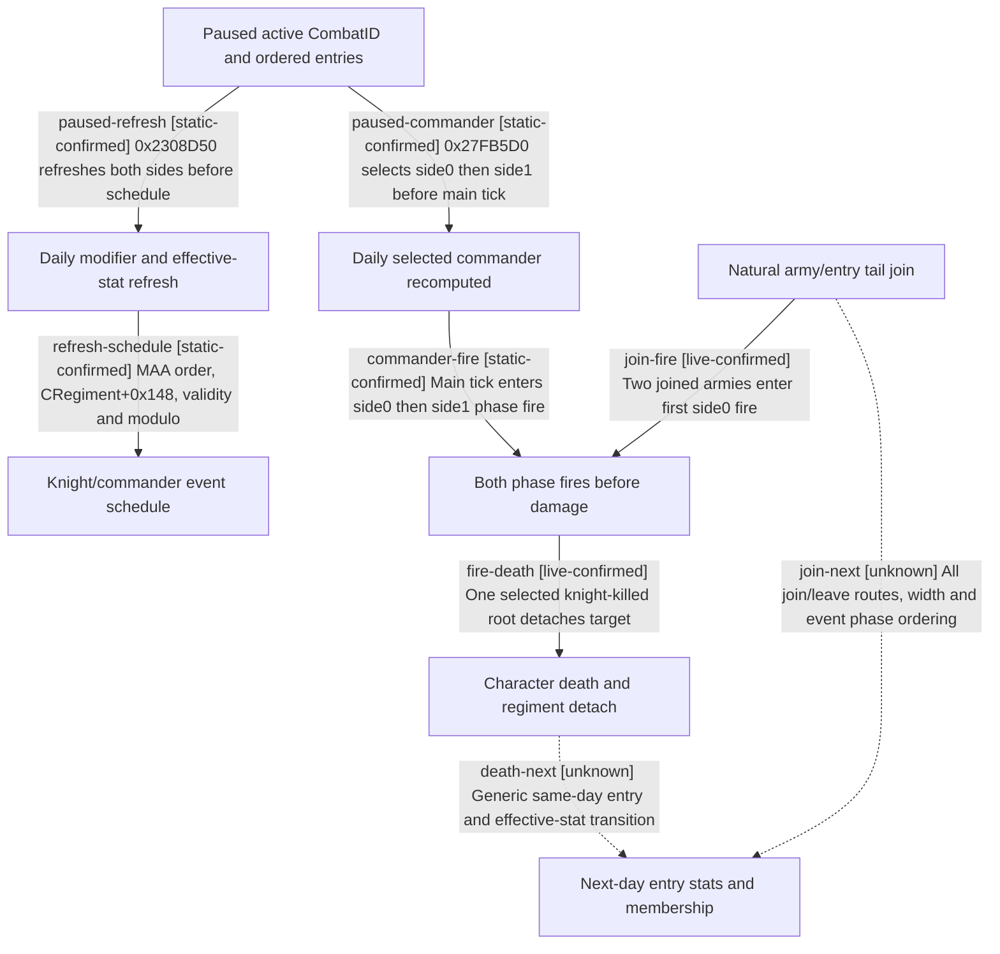

# Research plan: active-battle-knight-entry-transitions

GENERATED from the supplied research plan; no native semantics are inferred.

Question: Which active-combat knight and army identities feed the next native daily schedule, commander selection, event fire and damage, and which transitions remain unobserved?



| Edge | Declared status | Evidence IDs | Open question |
|---|---|---|---|
| paused-refresh | static-confirmed | source-review |  |
| refresh-schedule | static-confirmed | source-review |  |
| paused-commander | static-confirmed | source-review |  |
| commander-fire | static-confirmed | source-review |  |
| fire-death | live-confirmed | day26-kill |  |
| join-fire | live-confirmed | joined-fire |  |
| death-next | unknown |  | At which original call boundary do lethal and nonlethal character changes alter each entry and damage contribution? |
| join-next | unknown |  | Two joins do not close every route or global manager order |

| Observation design | Value |
|---|---|
| mode | offline-only |
| actor_kind | engine |
| owner_scope | One generation-bound active CombatID, both sides and their ordered full CArmyID/RegimentID rows; no new running session |
| identity_kind | generation-id |
| identity_lifetime | Full IDs bind to the same loaded combat/revision; process-local event pointers and hook ordinals expire on reload |
| producer_trigger | not-applicable |
| producer | Offline review of exact-build daily refresh 0x2308D50, schedule 0x23C8750, commander selector 0x23C8A60 and main tick 0x2309E80 |
| caller | Exact-build CCombatManager dispatchers 0x27FB4D0 and 0x27FB5D0; this plan calls none of them |
| consumer | Static dependency ledger for a future typed read-only active-combat producer and day-to-day simulation |
| cache_lifetime | Paused entry stats describe one revision; daily refresh and roster mutation can invalidate them before the next tick. Event pointers are process-local |
| expected_signal | Distinct ordered army, entry, scripted-knight, scheduled-event and selected-commander sources with exact RVAs and a future observation contract |
| zero_sample_meaning | Zero new live samples in this offline audit establishes no negative runtime behavior; a future zero-event window cannot exclude death or join paths |
| stop_condition | Stop after reviewing pinned EXE call sites and frozen reports; no CK3 launch or native hook |
| runtime_window_ref | None |

| Evidence ID | Declared layer | File | SHA-256 | Supports |
|---|---|---|---|---|
| source-review | source-contract | active-battle-knight-entry-transitions-2026-09-27.md | 0ee5e7b73c369a498ddf1f7d715865b73aa1d522dbb3689f9f143e72b3ff7a90 | Human-reviewed exact-build schedule/commander/phase chain and unresolved transition boundaries |
| day26-kill | live-observation | ../../ck3_autonomous_player/src/xar_autoplayer/simulation/data/ck3_1_19_0_6_episode01_messina_knight_kill_writeback.json | 752D2257D358159FCA918885A9B16B6909D81FEC835F0FA9205868CE882876CA | Day-26 selected knight-killed target detaches and has battle-death attribution in paired later save |
| joined-fire | live-observation | ../../ck3_autonomous_player/src/xar_autoplayer/simulation/data/ck3_1_19_0_6_episode01_join_schedule_boundary_v1.json | CBB7956D8D3B1F466F3D09FD8C79F8ECD960A7C0FC8954703921747FD59D4DFB | Independent joined-army replays saw new ArmyID/entries before first side0 phase fire |

Check result (file integrity and declarations only):

```json
{
  "schema": "xar.native-research-plan-check.v1",
  "result": "plan-consistent",
  "proof_layer": "record-structure-and-file-integrity",
  "semantic_correctness_verified": false,
  "live_execution_performed": false,
  "observation_plan_issues": [
    "offline-only plan does not define a live observation window",
    "the real producer trigger must be located before live sampling"
  ],
  "declared_edges_by_status": {
    "counter-policy": 0,
    "inference": 0,
    "live-confirmed": 2,
    "static-confirmed": 4,
    "unknown": 2
  },
  "enumerated_native_edges": 8,
  "declared_cases_by_status": {
    "pending": 2,
    "observed": 2,
    "not-applicable": 0
  },
  "checked_evidence_files": 3,
  "limitations": [
    "Evidence layers and conclusions are author declarations; hashes bind bytes, not their truth.",
    "Counts cover this enumerated graph only, not all CK3 branches.",
    "A consistent observation plan is not authorization to run or manipulate CK3."
  ],
  "plan_sha256": "cbff45b08419d4cbfa5602b171b1575cf99979fe890bf2ba10e87e42e6c8608a"
}
```
