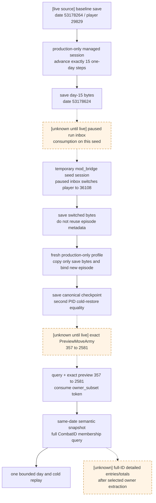

# CK3 1.19.0.6 owner-subset 主动撤退受管实机夹具

本文只定义一个可重复物化、随后可在 production-only 环境重放的
`owner_subset` 主动撤退夹具。它不改变主动撤退 ABI，也不把构造夹具时临时使用的
data Mod 当成生产能力。对应机器清单是
[`active_combat_retreat_owner_subset_fixture_v1.json`](../../ck3_autonomous_player/native_bridge/research/active_combat_retreat_owner_subset_fixture_v1.json)。

## 状态与证据标签

| 项 | 值 |
|---|---|
| game version | `1.19.0.6` |
| executable SHA-256 | `2D00FF3101EF70B566F2FCBAE292F09263199C80E9DC8F139B82D7D96F83DB86` |
| 复核日期 | 2026-08-26 |
| 当前结论 | **production-live GREEN**；owner-subset 撤退与同侧异 owner 保留均已闭合 |
| 本轮运行边界 | managed CK3；seed 为 non-debug 临时双 Mod，最终动作来自 fresh production-only profile |

- **[live-confirmed source]**：既有 production/non-debug managed artifact 已经证明；
- **[static-confirmed construction]**：源码或原版脚本证明构造机制存在，但本夹具尚未执行；
- **[recipe, live pending]**：下一次受管运行必须逐项通过，不能提前标记 ready；
- **[unknown]**：现有只读接口不能闭合的动作后细节。

## 2026-08-26 managed live 结果

[`run_owner_subset_retreat_live_acceptance.py`](../../ck3_autonomous_player/native_bridge/research/run_owner_subset_retreat_live_acceptance.py)
的 v13 完整运行 GREEN：

| artifact | size | SHA-256 |
|---|---:|---|
| `%LOCALAPPDATA%/Temp/xar-owner-subset-retreat-live-v13.json` | `790823` | `7780B619B2E7B90B8D5D5030D779F58F266585A6246A79B6C2FE20EF0F2701F9` |

- source save `9104...CC63` 前后未变；所有 CK3 PID 均由 supervisor 回收，state root 自动删除；
- day-15 checkpoint：`67369236` bytes，SHA
  `952FFCB2486084FC85B63F9B0F930FAA694CCC58251D329A91A44B53DCEBBD2D`；
- seed checkpoint：`67354079` bytes，SHA
  `F8AE14EB3BAC5A8CE673A709B25F01467FE608F440003094F28B931AC897BF78`；
- canonical production checkpoint：`67354053` bytes，SHA
  `54E059141FFC53BD02D09A2CF3F2FCD418A8F53A257DF489605ABEFBDE17C3A9`；
- non-debug paused `mod_bridge` 现场产生 switch/guard-clear marker；换人后与清 guard 后各有两个不同
  request ID 的完整 `BEGIN → STATE → ACK → END` frame，四帧均为 player `36108`、total-days
  `390777`；
- fresh production-only PID 重新绑定 Character `36108`；exact preview `357 → 2581` 可用，token
  被消费且 order 为 `accepted_verification_pending`；随后同日 native snapshot 看到 `357`
  `retreating=true`、已离开 CombatID `335544325`，旧战斗仍为 `main/12`、winner `none`，双方顺序为
  attacker `[83886341]`、defender `[33554657]`。

因此 `owner_subset_live_ready=true`。详细 combat entry、CArmy backlink 与 participant ledger 仍属于下文
明确列出的只读观测缺口，不影响已经可见的所属方撤退动作语义。

## 为什么不再构造一次同盟参战

[live-confirmed source] 既有战斗本身已经满足 mixed-owner：

| identity | exact value |
|---|---:|
| baseline/current retreat epoch | `53178264` |
| WarID | `16777290` |
| CombatID | `335544325` |
| combat ProvinceID | `2586` |
| source played CharacterID | `29829` |
| attacker stored order | `[83886341]` |
| defender stored order | `[357, 33554657]` |

原生 side stored order 的完整映射为：

| side | public CUnitID | native CArmyID | owner CharacterID |
|---:|---:|---:|---:|
| attacker / `0` | `83886341` | `50331733` | `29829` |
| defender / `1` | `357` | `344` | `36108` |
| defender / `1` | `33554657` | `50331769` | `28180` |

因此只要在不推进日期的情况下把本地玩家切换为 `36108`，再选择 CUnit `357`，
原生 owner scan 就应得到：

```text
side_index = 1
side_scope = owner_subset
affected_public_cunit_ids_in_stored_order = [357]
unaffected_same_side_public_cunit_ids_in_stored_order = [33554657]
```

当前 production action surface 没有 call-ally、join-war 或 switch-played-character；
split/merge 只能处理同 owner 军队，也不能制造本夹具。复用已存在的 mixed-owner side
比重新发起战争、邀请盟友并等待同日 join 更短、更确定。

## 冻结输入与可复核 artifact

受管运行每次都必须先核对 bytes，不能仅凭文件名选择存档：

| 文件 | size | SHA-256 | 用途 |
|---|---:|---|---|
| `%LOCALAPPDATA%/Temp/xar-active-retreat-query-v1-a72f4846fa01477ab26860479927c1b3/profile/last_save.ck3` | `67287758` | `9104CCB8AE9D5776166FBBAEDA9B43BD08CBAA2CB5C057332EB8B7A1A212CC63` | date `53178264` 的 battle baseline |
| 同目录 `profile/save games/autosave.ck3` | `67287758` | 同上 | 同 bytes 备份 |
| `profile/save games/autosave_1.ck3` | `67288173` | `40D4E73D2B45BEF7F8F94F9FC8007A5A039031840C24D72758E5D6452E1A2C6C` | contact lineage；不是 day-15 seed |
| `logs/active-retreat-query-initial-live.json` | `187788` | `97D5C5D0FC1AABCBDA3B8A6F47B146F3A81EF626E70F2772E60F73F3E1EB049B` | elapsed day `0` 查询 |
| `logs/active-retreat-query-days-live.json` | `3710489` | `FB521B39AD5529434596212DB9ADC1EA27D4C270D28D13575B9A2D80913BCF40` | day `1..16` 查询 |

Temp 路径不是长期资产。正式执行前应把 source save 复制到受管 fixture store，仍以
上述 size/SHA 为身份；本 recipe 不要求把 67 MiB 存档提交进 Git。

### day 15 的已知稳定帧

[live-confirmed source] `active-retreat-query-days-live.json` 已经证明以下连续帧；两侧 roster
在 day `0..16` 没有变化：

| elapsed whole days | date raw | phase/day | legal now |
|---:|---:|---|---|
| `14` | `53178600` | `main/11` | `false` |
| `15` | `53178624` | `main/12` | `true` |
| `16` | `53178648` | `main/13` | `true` |

day 15 的 retreat baseline 是 `53178264`，exclusive threshold 是 `14`，earliest date
是 `53178624`。`disallow_retreat=false`、`allow_early_retreat=false`、
`skip_pursuit=false`、landless gate 允许，native reason arrays 为空。

同一帧 defender 的只读数值锚点是：

| owner | entry count | starting raw | current raw | soft raw | derived hard raw | entry strength raw |
|---:|---:|---:|---:|---:|---:|---:|
| `36108` | `22` | `224000000` | `182943495` | `25582136` | `13474369` | `77637` |
| `28180` | `22` | `101100000` | `80924517` | `12560066` | `6615417` | `35180` |

整个 defender side 的 `derived_current_fighting_raw=263868012`、
`derived_soft_casualties_raw=38142202`、
`participant_hard_total_raw=20089786`、`side_strength_raw=112817`；participant hard
ledger stored order 是 `[(36108,13474369),(28180,6615417)]`。这些值用于换人前后同日
一致性核对，不是 owner-subset 动作后已验证值。

## 受管物化流程



### A. 先物化 day-15 存档，仍由 Character `29829` 控制

[live-confirmed v13]

1. 从 hash `9104...CC63` 克隆一个独立 state；使用 exact DLL/injector、普通 production
   singleton playset 和 non-debug managed native session。
2. 首帧必须是 paused、date `53178264`、episode CharacterID `29829`、WarID
   `16777290`、CombatID `335544325`、Province `2586`、roster
   `[83886341]` 对 `[357,33554657]`。
3. 连续执行十五次 `life-advance`。每次只允许推进一天并重新暂停；每一天都重新查询 full
   CombatID 与 side stored order。任一 CUnit 消失、CombatID 变化、日期跳跃或托管清理失败即废弃该 clone。
4. 到 date `53178624` 后查询两次 battle-control，除 query sequence 外必须相同；按上节核对
   `main/12`、legality、flags、owner mapping 和 defender 数值锚点。
5. **此时**才调用 native `save-checkpoint`，产出例如
   `xar_owner_subset_day15_before_switch.ck3`，记录 size/SHA 并完成 managed cleanup。

现有 `run_battle_control_live_acceptance.py --save-checkpoint --advance-days 15` 不可直接承担
第 5 步：该脚本在 advance loop **之前**保存，所以会保存 day 0。应新增独立 materializer，或把
“advance then save”明确写进 owner-subset 专用受管 harness；不能手工把已有 artifact 当存档。

### B. 临时 mod_bridge 只负责一次 paused player switch

[live-confirmed v13]

原版 `common/on_action/game_start.txt` 已有
`set_player_character = character:906`，证明 full CharacterID link 可作为该 effect 的 RHS。
现有 `ck3_autonomous_player/mod_bridge` 通过 registered scripted widget，在 `GetPlayer` 有效后每
`0.4s` 执行 userdir `run/xar_mcp_inbox.txt`；它不是 on_action，因此设计上会在存档 UI
建立后重新创建，也不依赖日期 tick。v13 已现场证明 non-debug、paused、读档后的循环会持续重新读取原子替换
的 inbox；命令日志只是 transport 证据，最终仍由 native played-character 与 battle frame 闭合。

步骤：

1. 另建 disposable seed state。加载 A 的 day-15 bytes，临时注册 `mod_bridge`；启动前 inbox
   必须是带 BOM 的注释 no-op，避免在 battle/frame 核对前换人。
2. 这个临时双 Mod playset 不满足 production profile 的 singleton verifier。seed-only harness
   必须仍由 lifecycle supervisor 持有进程树，但显式使用独立临时 load manifest；不能伪造
   `verify_profile` 成功。最终 production 验收绝不使用该 manifest。
3. 等 native bridge 给出 paused date `53178624`、played CharacterID `29829` 和上述 exact battle
   frame 后，再原子替换 inbox 为一次性 effect。最小候选内容为：

   ```text
   province:2543 = {
       province_owner = {
           save_temporary_scope_as = xar_fixture_owner_subset_target
       }
   }
   if = {
       limit = {
           exists = scope:xar_fixture_owner_subset_target
           NOT = { global_var:xar_fixture_owner_subset_switch_consumed = 1 }
       }
       set_global_variable = {
           name = xar_fixture_owner_subset_switch_consumed
           value = 1
       }
       set_player_character = scope:xar_fixture_owner_subset_target
       debug_log = "XAR_FIXTURE:OWNER_SUBSET_SWITCH|target=36108"
   }
   ```

   `character:36108` 是动态存档 ID，不是历史数据库 key；v11 实机确定它会报
   `Referencing non-existent character in script link`。Province `2543` 则是该 frozen frame 中主对手
   `36108` 的 `enemy_primary_default_raise_province_id`，静态 Province link 可解析，再从
   `province_owner` 取得动态 Character scope。

4. 看到本次 launch epoch 内的 debug marker 后立刻原子恢复 no-op；用两个不同 request ID 的完整
   data-Mod snapshot frame 证明至少两个独立 poll，再确认 native `played_character=36108` 且 date 仍为
   `53178624`。ACK 或日志不能替代 native played-character 与 battle frame。
5. 用第二个 inbox effect 删除 `xar_fixture_owner_subset_switch_consumed`，再次恢复 no-op 并等待两个
   poll interval。最终 seed 不保留该临时 guard。
6. 查询 subject `357`，必须同时看到：controllable、in combat、not retreating、CArmy `344`、
   CombatID `335544325`、side `1`、scope `owner_subset`、affected `[357]`、unaffected
   `[33554657]`。War `16777290` 的玩家视角应翻转为 defender，primary opponent 应为 `29829`。
7. 不推进日期，调用 native `save-checkpoint`，保存为
   `xar_active_retreat_owner_subset_day15_seed.ck3`，记录 size/SHA 后由 supervisor 完整停止 CK3。

`set_player_character` 会改变 one-life episode identity。B 中旧的 `driver-state.json`、episode seed、
checkpoint metadata 和 command history 都不能随 seed 复用；旧 driver 报
`played_character_changed` 只说明它正确拒绝跨角色沿用 episode，不是最终夹具失败。

### C. 把 save bytes 收养为 production-only checkpoint

[live-confirmed v13]

1. `prepare_profile` 创建全新、通过 `verify_profile` 的 production singleton state。
2. 只复制 B 的 `.ck3` bytes 到该 profile 的 `last_save.ck3` 与一个具名 save；不复制 B 的
   `control/`、`native-session/`、`driver-state.json`、manifest 或任何 bridge inbox/log。
3. 用普通 non-debug `continue_last_save` 启动新 PID，不使用来自 B 的
   `--cold-start-checkpoint` metadata。首个稳定 paused frame 必须把新 episode 绑定到 Character
   `36108`，并完整重证 B.6 的 battle identity/scope。
4. 在这个 production-only PID 内调用 `save-checkpoint`，得到 canonical checkpoint 与正确绑定
   `36108` 的 metadata，然后停止并证明全机 CK3 process inventory 为零。
5. 第二个 fresh PID 用该 canonical checkpoint cold restore；date、episode、CombatID、两侧顺序、
   owner mapping、legality、完整 battle frame 和 `357` 的 controllable state 必须一致。

这一步也是“带临时 bridge 保存的存档能否在没有该 bridge 时无提示/无阻塞地加载”的硬门。
它通过前，`owner_subset_seed_ready` 必须保持 false。

## production-only 动作验收

[live-confirmed v13] 现有
`run_active_combat_retreat_live_acceptance.py` 的最终判定硬编码为 `full_side`，不能拿它原样执行
owner-subset mutation：它会在动作已经提交后仍以 full-side gate 报 RED。应先复制为独立
owner-subset harness，并在 mutation 前完成静态/unit 演练。

### 动作前硬门

在同一 paused frame：

1. 连续两次 `query_battle_control_snapshot_v1(357)`，除 query sequence 外相同；
2. 断言 `date=53178624`、`combat_id=335544325`、`province=2586`、`phase=main/12`、
   `legal_now=true`、`side_index=1`、`side_scope=owner_subset`；
3. 断言 affected `[357]`、unaffected `[33554657]`，并保留完整 attacker/defender frame hash；
4. 调用 `query_army_strengths([357,33554657,83886341])`，保存 row-atomic soldiers/base-power
   诊断。它能辅助证明同日非目标军没有异常变化，但不能替代 combat entry/participant ledger；
5. 调用 exact preview：selected `357`、target Province `2581`、当前 revision。既有 live snapshot
   只证明 `357` 当前 stored move target/route 是 `[2581]`，**没有**证明新玩家视角下的
   `PreviewMoveArmy(357,2581)`。必须看到 `status=available`、`action_ready=true`、route `[2581]`
   和新 candidate token 后才能继续。

### 唯一 mutation 与同日后置条件

只消费一次 preview token，order 参数必须原样绑定：

```text
selected_public_cunit_id = 357
expected_combat_id = 335544325
expected_side_index = 1
expected_scope = owner_subset
target_province_id = 2581
expected_revision = preview.source_binding.revision
candidate_token = preview.target_preview.candidate_token
```

ACK 只接受 `accepted_verification_pending`。随后在**同一 date `53178624`**轮询语义状态：

- CUnit `357`: `retreating=true`、target `2581`、route 末端 `2581`，且不再是 active combat member；
- full CombatID `335544325`: `status=available`、Province `2586`、phase 仍为 `main`、winner
  仍为 `none`；attacker stored order `[83886341]`，defender stored order `[33554657]`；
- `357` 必须从两侧数组都消失；`33554657` 必须仍在 defender side，不能随 owner `36108` 一起撤；
- 同日再次查询三军 strength，`33554657` 与 `83886341` 的 aggregate 不应因 subset extraction
  变化；这只是辅助观测。若 aggregate 读法在 combat 中延迟提交，记录实际值而不要据此否定已经闭合的
  full-CombatID membership。

可选的后续稳定性回归可再推进一个 bounded day 到 `53178648` 并重放同一 canonical seed；这不属于
同日动作 readiness。最低检查仍是两侧不再含 `357`、`33554657` 仍属于 defender，且旧 CombatID
没有被另一代对象冒名。

## 当前可证明与不可证明的分界

现有 production surface 已足以闭合玩家可见的核心 owner-subset 语义：

- subject `357` 的 retreating/target/route；
- 旧 full CombatID 的 phase/winner；
- stored side membership 从 `[357,33554657]` 变为 `[33554657]`；
- unaffected different-owner CUnit 没有被撤走。

但 `query_battle_transition_v1` 只发布 side CUnit IDs、phase、winner、Province 与 result identity；
subject-bound battle-control 又会在 `357` 已 retreating 后拒绝该 subject，且玩家不能查询不受控盟军
`33554657` 的完整 battle-control frame。因此目前仍**不能**用 production query 完整证明：

- owner `36108` 的所有 combat entries 已按原生路径删除；
- `CArmy+0x128` backlink 的每一项变化；
- unaffected owner `28180` 的 entries/totals 在同日逐字节不变；
- subset pursuit 写入 participant hard ledger 的精确 delta。

这些是 full-CombatID detailed battle frame（或扩展 transition query）的下一项只读施工需求；不妨碍先用
stored membership 完成 owner-subset 可见动作闭环，但不能把 membership 证据写成详细 ledger 已 live。

## 完成判据与当前状态

只有同时满足以下条件才能把本夹具标为 production-live：

1. day-15 checkpoint 已物化并有固定 size/SHA；
2. 临时 paused inbox 换人有本次 launch 的 marker、native played-character 与同日 battle frame；
3. 该 save 在 fresh production singleton profile 中加载并重新保存为 canonical checkpoint；
4. 第二 PID 冷恢复 byte/frame 等价；
5. exact preview `357 -> 2581` 成功；
6. owner-subset order 只撤 `[357]`，旧 CombatID 同日保留 `[33554657]`；
7. managed cleanup 完成。

v13 已满足以上七项，机器 readiness 为 `owner_subset_live_ready=true`。bounded one-day 与第二次动作
重放保留为非阻断的稳定性扩展；不得把它们写成已经完成。
