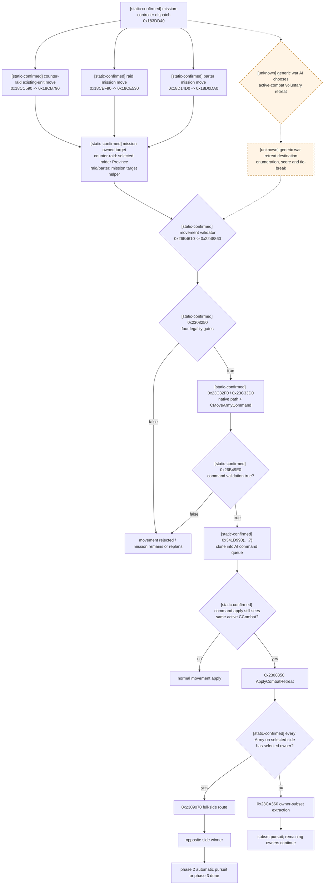

# CK3 1.19.0.6 原生主动撤退决策树

本文只研究一支军队已经参加真实 `CCombat` 后，原生 AI 如何产生可移动候选、引擎如何判断该候选能否变成主动撤退、
以及命令执行后 full-side、mixed-owner 与 pursuit 分别怎样变化。接敌前的 `ratio <= 0.45` 战略退让树不是本文的
主动撤退 policy；战斗伤亡公式与接敌顺序仍分别以 [battle-simulation.md](battle-simulation.md) 和
[army-contact-resolution.md](army-contact-resolution.md) 为准。

## 冻结版本与证据边界

| 项 | 冻结值 |
|---|---|
| game version | `1.19.0.6` |
| executable | `Crusader Kings III/binaries/ck3.exe` |
| SHA-256 | `2D00FF3101EF70B566F2FCBAE292F09263199C80E9DC8F139B82D7D96F83DB86` |
| 原版 AI 数据 | `Crusader Kings III/game/common/defines/ai/00_ai.txt` |
| 原版 combat 数据 | `Crusader Kings III/game/common/defines/00_defines.txt` |
| 复核日期 | 2026-08-26 |

本文沿用知识库的证据标签：

- **[static-confirmed]**：冻结 EXE 的 direct xref、机器分支、RTTI/字符串，或冻结原版数据直接证明；
- **[live-confirmed]**：冻结 build 的 paused application-main 实机帧已经对账；
- **[inference]**：多个静态锚点一致，但正式类型名或完整 caller contract 尚未恢复；
- **[unknown]**：证据仍不足；决策树用虚线表示，不能作为生产策略的原生事实。

本文使用 `CanOrderCombatRetreat`、`ApplyCombatRetreat`、`RaidMissionMove`、`BarterMissionMove`、
`CounterRaidMove` 等研究别名；它们不是恢复出的原生符号。
静态逆向阶段没有启动 CK3；随后在 2026-08-26 使用 production/non-debug managed session 完成了本文所述
legality/scope 只读投影的 paused live 验收；同日又完成了 planner-selected target 的 exact preview、一次性 token 与 full-side
玩家命令提交，并在更新的 paused snapshot 看到真实 retreat/target/route。随后新增按完整旧 CombatID 的独立 lifecycle query，
实机证明 `main/12 → pursuit/0` 与对侧 winner；因此 full-side 完整动作后置条件已闭合，owner-subset 仍待完成。

## 一页结论

- [static-confirmed] 冻结 EXE 中三条会提交通用 movement command 的 direct AI caller 都属于**任务型控制器**，不是
  通用战争“判断败势后主动撤退”策略：raid 为 `0x18CE240 -> 0x18CE530`，barter 为
  `0x18CFC20 -> 0x18D0DA0`，已有反袭军追赶 raid 目标为 `0x18CB790`。前两条分别在
  `0x18CE3A5` / `0x18CFD85` 直接预检 `0x2308250(combat, army, nullptr)`；counter-raid 经
  `0x18CBACC -> 0x2248860 -> 0x2308250` 才进入同一 legality。
- [static-confirmed] 归因不是按邻近代码猜测：`0x18CE2D1` 读取 `MAX_RAID_DAYS=365`，
  `0x18CFCB1` 读取 `MAX_BARTER_DAYS=730`；`0x18CBAD9` 读取
  `COUNTER_RAID_MAX_DISTANCE=200`，`0x18CB999` 在
  `VASSAL_COUNTER_RAID_MIN_STRENGTH_RATIO=0.9` 与
  `INDEPENDENT_COUNTER_RAID_MIN_STRENGTH_RATIO=0.75` 的 runtime globals 间选择。
- [static-confirmed] 通用 CUnit movement validator `0x2248860` / 相邻 variant 也在
  `0x224890B` / `0x2248A0C` 调用同一个 `0x2308250`。AI candidate 与命令校验因此共用主动撤退 legality，
  但这仍不证明 AI 在哪一天决定撤退。
- [static-confirmed] 通用 movement command apply `0x26B4710` 若发现目标 CUnit 的 CArmy 仍绑定 active CCombat，
  会把命令携带的 target Province 交给 `0x2308850`。所以 active retreat 是通用移动动作在 in-combat 状态下的
  语义分派，不需要发明一个鼠标/OCR 专用动作。
- [static-confirmed] `0x2308250` 的四个业务拒绝边按固定顺序求值：`disallow_retreat`、严格
  `elapsed_whole_days > 14`（除非 allow-early）、`phase < 2`、landless restriction。四个原生 reason key 已闭合。
- [static-confirmed] `0x2308850` 不是无条件把整个 side 撤走。若该 side 所有 Army 的 owner 都等于所选 CUnit 的
  owner，走 `0x2309070` full-side；只要发现另一 owner，就走 `0x23CA360` owner-subset，并让其余 owner 继续战斗。
- [static-confirmed] full-side 主动撤退先写每支 CUnit 的 retreat route，再确定对侧 winner，随后进入自动 pursuit/done；
  owner-subset 离场前只对被抽出的 entries 同步做一次 subset pursuit，不写整场 winner。
- [static-confirmed] `0x26B49E0` 是 movement command 的 native validation wrapper，而非最终 queue submit；三条 AI
  路径在它返回 true 后才以 `0x341D990(..., kind=7)` 克隆入队。queued command apply vfunc
  `0x26B4710` 在 apply 时仍见 active CCombat 才分派到 `0x2308850`。因此“validator 接受”仍不是已撤退。
- [unknown] `0x2308250` 的全部 direct-call census 没有恢复出通用 war AI 依据 battle odds/forecast 选择主动撤退的
  policy caller；不能把上述 raid/barter/counter-raid 的任务移动冒充该策略，也不能由此断言原生绝无 indirect caller。
- [unknown] `UPDATE_TARGETS_TICK=7` 与 `UPDATE_TARGETS_TICK_LOPSIDED=14` 尚无 exact xref 连到这三条任务路径，
  不得写成 active-combat retreat cadence。已经闭合的 365/730 日上限和 1825/365/180 日 cooldown 是任务寿命/启动
  冷却，也不是 active-combat retry cadence。
- [unknown] 通用 war AI voluntary-retreat destination 的候选 Province 枚举、评分项与 tie-break 尚未闭合。
  已知 mission path 使用任务已有目标；`SHATTERED_RETREAT_*` 尚未证明被 voluntary retreat scorer 使用。
- [implementation-confirmed + live-confirmed semantic action] production Python 组合层已经把同帧 battle-control、exact
  `PreviewMoveArmy`、planner target 与单次 token 绑定，并复用玩家 `SubmitMoveArmy(kind=1)`。full-side 实机中 CUnit
  `83886341` 最终为 `retreating=true`、target/route=`2579`；ACK 本身仍只叫 `accepted_verification_pending`。
- [live-confirmed] subject-bound battle-control 确会拒绝已经 retreating 的 CUnit；独立 full-CombatID lifecycle query 已绕过该
  eligibility gate，并从 prior `CombatID=335544325` 读到 `main/12 → pursuit/0`、winner=defender 与双方 stored-order
  CUnitIDs。因此 full-side 已有完整 transition 证据；mixed-owner owner-subset 仍待 production live。

## 原生控制树

实线只表示本页已经闭合的调用或状态转移；虚线表示仍需继续逆向的 AI policy、cadence 或 destination 选择。



边界必须明确：

1. “没有发出合法撤退命令”时，CCombat 默认继续逐日结算；不存在必须每日发送的 `keep_fighting` command。
2. `0x2308250 == true` 只表示此刻允许撤退，不表示通用战争 AI 此刻选择撤退，也不产生 destination。
3. 已闭合 AI 路径之所以移动，是 raid/barter/counter-raid assignment 的目标变化或继续执行；active combat 只把该普通
   movement 解释成 retreat，不能反推它们做过“继续战斗 vs 撤退”的 odds 比较。
4. generic movement ACK 只证明命令进入 apply；必须重观测真实 CombatID、side、route 与 phase 才算动作完成。

## 任务型 AI movement、assignment state 与 cadence 边界

### 三条 direct AI command spine 的真实归属

[static-confirmed] `0x183DD40` 按 controller state bytes 分派三族任务。可复核的 direct-call spines 是：

```text
counter-raid (已有反袭 CUnit)
0x183DD73 -> 0x18CC590
  -> 0x18CC6A3: 0x18CF170 builds raid-army candidate list
  -> 0x18CC6C8: 0x18CB790 selects one candidate and moves
     -> 0x18CBACC: 0x2248860 -> 0x2308250 when in active CCombat
     -> 0x18CBC60: 0x26B49E0

raid mission
0x183DDE8 / 0x183E2E1 -> 0x18CEF90
  -> 0x18CF047 -> 0x18CEC60 -> 0x18CEF59 -> 0x18CE530
     -> 0x18CE566: 0x18CE240
        -> 0x18CE3A5: 0x2308250
     -> 0x18CE6FE: 0x26B49E0

barter mission
0x183DDCC / 0x183E2B3 -> 0x18D14D0
  -> 0x18D14AD -> 0x18D0DA0
     -> 0x18D0DDA: 0x18CFC20
        -> 0x18CFD85: 0x2308250
     -> 0x18D1089: 0x26B49E0
```

raid/barter 两个 viability 函数的 active-combat 部分同构：从 CUnit `+0x178` generation-safe 解析 CArmy，从
`CArmy+0x128` 经 combat store `module+0x570C758` 解析 CCombat，先调研究名未闭合的
`0x2277240(CArmy*, CCombat*)` relation predicate；命中才以 `errors=nullptr` 调 `0x2308250`。counter-raid
不做这次提前调用，但其通用 CUnit validator 会做同一检查。

[static-confirmed] `0x26B49E0` 的 direct call census 只有 `0x18CBC60`、`0x18CE6FE`、`0x18D1089`；
`0x2308250` 的 AI 邻域 direct callers 只有 raid/barter 的 `0x18CE3A5` / `0x18CFD85`，其余 direct callers
属于 UI/query、通用 movement validator 或 combat transition。这个 census 证明目前恢复到的 native AI active-combat
movement 是任务型的；它不证明不存在 indirect/vtable caller，但已经足以否定“这两函数就是通用败势撤退 policy”的旧归因。

### assignment target 与 persistent state

[static-confirmed] runtime define registration 把这些 globals 钉死到原版数据：

| runtime global | define | 值 | exact use |
|---|---|---:|---|
| `0x570DCB0` | `MIN_STRENGTH_TO_RAID_VASSAL` | `500` | raid readiness strength branch |
| `0x570DCB4` | `MIN_STRENGTH_TO_RAID_INDEPENDENT` | `300` | raid readiness strength branch |
| `0x570DBC8` | `MAX_RAID_DAYS` | `365` | raid assignment age check |
| `0x570DBC0` | `MAX_BARTER_DAYS` | `730` | barter assignment age check |
| `0x570DCD0` | `COUNTER_RAID_MAX_DISTANCE` | `200` | existing counter-raid unit→target distance cap |
| `0x570DCD8` | `VASSAL_COUNTER_RAID_MIN_STRENGTH_RATIO` | `0.9` | counter-raid strength responsibility branch |
| `0x570DCE0` | `INDEPENDENT_COUNTER_RAID_MIN_STRENGTH_RATIO` | `0.75` | counter-raid strength responsibility branch |

这关闭了旧的 `CCharacter/controller object +0x2F4` 猜测：`0x18CECC1..0x18CECFB` 与
`0x18CC11F..0x18CC178` 都把 `+0x2F4` 同 `500/300` 的 fixed-point runtime value 比较；它是 raid readiness
强度量，不是 date、tick counter 或 active-retreat cadence。

[static-confirmed] controller-associated object `+0x20` 下的三个 64-bit raw date slots 分别服务任务启动/年龄：

| raw slot | write/read evidence | bounded meaning |
|---|---|---|
| `+0x258` | `0x18CEE09` 写当前 raw date；`0x18CE2CA` / `0x18CEEA6` 读取并加 `24*MAX_RAID_DAYS` | raid timestamp |
| `+0x260` | `0x183DDAA` 写当前 raw date；`0x18CC663` 读取并加 `24*COUNTER_RAID_COOLDOWN_DAYS` | counter-raid timestamp |
| `+0x268` | `0x18D135D` 写当前 raw date；`0x18CFCAA` / `0x18D123F` 读取并加任务 define | barter timestamp |

这些是可施工的只读 assignment evidence，但只应在 controller 对象 exact generation/owner 归属闭合后发布；当前最小 retreat
query 不需要它们。对普通战争军队不得伪造 `assignment_kind=war_retreat`。已闭合路径最多发布
`assignment_kind=raid|barter|counter_raid` 与 `assignment_target_provenance=mission_controller`。

### 命令校验的第二道共用 gate

[static-confirmed] 通用 CUnit movement validator `0x2248860(CUnit*, int32 order_kind)` 在 CUnit 可解析 CArmy、CArmy
绑定 active CCombat 且 `0x2277240` 命中时，于 `0x224890B` 再调一次
`0x2308250(combat, army, nullptr)`；返回 false 时整个 movement validation 返回 false。相邻 validator 在
`0x2248A0C` 有同样调用。

这条命令层 gate 直接影响实际使用：planner 不能跳过它后把一个普通 move ACK 当成撤退成功。生产 action 应复用现有 exact
`CMoveArmyCommand` 路径，且在 ACK 后重读状态，而不是直接调用 `0x2308850` 或自制 route writer。

### cadence：当前能说到哪里

[static-confirmed] 原版数据给出：

| define | 值 | 已证明用途边界 |
|---|---:|---|
| `UPDATE_TARGETS_TICK` | `7` | 一般 army target 更新常量；未连到这三条任务 movement |
| `UPDATE_TARGETS_TICK_LOPSIDED` | `14` | lopsided target 更新常量；未连到这三条任务 movement |
| `MAX_RAID_DAYS` | `365` | raid assignment age/return-home input；不是 retry cadence |
| `MAX_BARTER_DAYS` | `730` | barter assignment age/return-home input；不是 retry cadence |
| `RAID_COOLDOWN_DAYS` | `1825` | 新 raid 启动冷却；不是 combat retry cadence |
| `BARTER_COOLDOWN_DAYS` | `365` | 新 barter 启动冷却；不是 combat retry cadence |
| `COUNTER_RAID_COOLDOWN_DAYS` | `180` | 新 counter-raid 启动冷却；不是 combat retry cadence |
| `STAND_AND_FIGHT_DAYS` | `30` | pre-contact `0x184B170` wrapper 的 raw-state timer |
| `STAND_AND_FIGHT_COOLDOWN_DAYS` | `45` | pre-contact stand-and-fight cooldown |

[unknown] 因而目前唯一可靠 active-combat cadence 表述是：**当上游调用上述 mission movement path 时，它会按同一帧状态
检查 retreat legality**。
不能声称“每日检查”、第 7/14 日检查，或第 15 日一合法就必撤。

下一次原生 AI policy 施工入口固定为：

1. 不再从这三条 mission controller 向上猜通用 war retreat；先找通用 war target/assignment dispatcher 中能到
   `0x2248860` 或 `CMoveArmyCommand` 的 indirect/vtable caller，并要求 caller 同时读取 active CCombat/battle odds；
2. 闭合该 caller 的 invalidator/tick source 后才给 cadence 命名；`UPDATE_TARGETS_TICK*` 只作为待对照 define；
3. 把该通用 caller 的 destination 生成、评分与最终 command `destination_province_id` 连成一条数据流；
4. 以后再用 paused live trace 对账连续多日选择，当前轮不启动 CK3。

在这条证据链闭合前，我方 counter-policy 可以比原生更聪明，但不得把猜测写成原生 opponent model。

## `0x2308250` legality：exact reasons、day、phase、flags 与 landless

### ABI 与必要前置条件

```cpp
bool CanOrderCombatRetreat(
    CCombat* combat,       // RCX
    CArmy* selected_army,  // RDX
    ErrorSink* errors);    // R8; nullable
// RVA 0x2308250
```

[static-confirmed] caller 必须先证明 selected CArmy 属于该 exact CCombat 的一侧。成员关系缺失、CombatID generation 不匹配、
selected CUnit 已经 retreating 等应由 typed query/action 返回结构性 unavailable reason；它们不是下面四个原生业务 reason key。

side 布局为：

| 字段 | side0 absolute | side1 absolute | 语义 |
|---|---:|---:|---|
| `CCombatSide` base | `CCombat+0x20` | `CCombat+0x368` | 两侧 stride `0x348` |
| `+0xC0` | `CCombat+0xE0` | `CCombat+0x428` | `disallow_retreat` |
| `+0xC1` | `CCombat+0xE1` | `CCombat+0x429` | `allow_early_retreat` |
| `+0xC2` | `CCombat+0xE2` | `CCombat+0x42A` | `skip_pursuit`；不是 legality gate |

### 四个 gate 的固定顺序

[static-confirmed] boolean 与 reason 收集顺序如下：

| 顺序 | exact predicate | 失败 key | 边界 |
|---:|---|---|---|
| 1 | selected side `+0xC0 != 0` | `COMBAT_NO_RETREAT_DISALLOWED` | 最先检查 |
| 2 | side `+0xC1 == 0` 且 `elapsed_whole_days <= 14` | `COMBAT_NO_RETREAT_TOO_EARLY` | 必须严格 `>14`；第 15 whole day 才通过 |
| 3 | `CCombat+0x6B0 >= 2` | `COMBAT_NO_RETREAT_PURSUIT` | pursuit `2` 与 done `3` 都拒绝 |
| 4 | raw owner/land-status predicate 命中 | `COMBAT_NO_RETREAT_LANDLESS` | allow-early 不绕过 |

`errors == nullptr` 时首个失败立即返回 false；有 error sink 时会追加每个命中的 localization reason，继续求值，最终返回
四个 gate 的 conjunction。因此 typed query 可以一次发布全部 reason，但必须保持以上原生顺序。

day gate 的 exact 数据链来自机器分支而不只是 define 注释：`CCombat+0x708` **只**是 opaque signed full
`BattleResultID`，`-1` 是唯一 missing sentinel。`0x23083B7..0x23083E8` 以低 24-bit 查
`module+0x57C0328` Battle-result store、回读 `BattleResult+0x08` 校验完整 signed dword；原函数在解析失败时改取
`module+0x57C0320` fallback object。elapsed 的历史
操作数实际是解析结果的 signed dword `BattleResult+0x2C`，当前操作数是
`(*(module+0x570E068) /* CGameState */)+0x08` 的 signed low dword。两者分别执行
`trunc_signed((date_raw-0x029C55C0)/24)`，随后以 current day index 减去 Battle-result day index，再同 runtime
`MIN_DAYS_BEFORE_MANUAL_RETREAT=14` 比较；通过分支是 signed `jg`。

生产 `BattleControlSnapshot` 的 same-frame identity gate 故意比该 helper 更强：合法缺省
`BattleResultID == -1` 才读取 `module+0x57C0320` fallback；任何其它 signed full ID 若 generation 回读不一致，一律返回
`state_changed`，不把它静默降级成 fallback。这是查询对同一帧身份一致性的边界，**不声称**原生 `0x2308250`
面对 stale non-`-1` ID 时也会失败。因此 live 验收必须使用 generation-valid BattleResult，或确实为 `-1` 的合法缺省帧，
不能用 stale full ID 证明 legality 已可用。

[production-live correction] G2 paused artifact
`20260831T011500Z-signed-battle-result-query` 在 `date_raw=53291904` 连续两次读到稳定
`CombatID=-2147483647 / BattleResultID=-2046820351`，frame SHA-256
`5AD7B6D65ED5876B619CE05A9EEC286FE325E444C055BB255AF75575F97630AF`。这直接否定“负 ID 等于未物化”的旧
consumer 假设；完整 ID 必须原样贯穿 query、action token、transition 与 terminal journal。

[unknown] `BattleResult+0x2C` 的独立原生业务名尚无符号、反射或写入链闭合；本文只称它为
`retreat_elapsed_baseline_date_raw`，不称“战斗起始日期”。`allow_early_retreat` 只跳过这一步，不跳过 disallow、phase 或
landless。`earliest_legal_date` 只能称为 day gate 的日历下界；届时 phase/flags 仍可能变化。

### landless predicate 的 raw 边界

[static-confirmed] 错误字符串把该分支命名为 `COMBAT_NO_RETREAT_LANDLESS`。机器链为：

```text
selected CArmy +0x124 -> CUnit
CUnit +0x174          -> owner CharacterID
Character +0x1B8      -> opaque land/title-state object

reject iff:
  object != null
  and int32(object + 0x1F8) == -1
  and bit 10 of uint32(0x26165B0()->+0x38) == 0
```

本文只冻结这个原生 predicate 与 reason，不把 opaque object 或 global bit 擅自改写成“是否持有任意头衔”等自制公式。
query 对外应发布 `landless_gate_allows_retreat` 与原生 reason，而不是暴露易漂移的内部指针。

对应 effect writer 已由相邻研究闭合：`0x2EB46F0` 写 disallow、`0x2EB4740` 写 allow-early、`0x2EB4790`
写 skip-pursuit。skip-pursuit 只改变 winner 后的 pursuit transition，不让 phase `2` 的 voluntary retreat 重新合法。

## full-side 与 mixed-owner apply

### dispatcher 怎样选择 scope

```cpp
void ApplyCombatRetreat(
    CCombat* combat,             // RCX
    int32_t selected_cunit_id,   // EDX; full public CUnitID
    CProvince* target);          // R8
// RVA 0x2308850
```

[static-confirmed] `0x2308850` 的 scope 判定不是 caller 自报：

1. generation-safe 解析 selected public CUnitID，并从 `CUnit+0x178` 得 full CArmyID；
2. 在 side0 `+0x10/+0x1C` 与 side1 `+0x10/+0x1C` 的 stored ArmyID arrays 中定位 selected Army；
3. 从 selected CUnit `+0x174` 取 owner CharacterID；
4. 按该 side stored ArmyID order 解析每支 Army 对应 CUnit 的 owner；
5. 若每个 owner 都等于 selected owner，走 full-side；一旦见到另一 owner，走 owner-subset。

所以 `scope=full_side` 的准确含义是“该 side 当前所有 Army 都属于 selected owner”，不是“玩家是战争主导者”或“selected Army
排在第一”。mixed-owner side 中点击玩家任一 CUnit，只撤该 owner 的所有 matching rows/armies。

### full-side：`0x2309070`

[static-confirmed] full-side 按 side ArmyID stored order：

1. 解析每个 CArmy 对应 CUnit；
2. 对各 CUnit 依次调用 `0x2247A60(CUnit*,1)` 与 `0x2248170(CUnit*,target,2,0)`，写 retreat state 与 native route；
3. 更新两组 combat entries，把原生选择的 current/routed amount 合并到 soft pool、清 current，并清 side totals；
4. 最后调用 `0x230A010(combat, 1-side_index)`，把对侧记录为 winner。

顺序是 **route/state 先写，winner 后写**。动作验收不能因中间帧已出现 route 就提前宣布整场 transition 完成。

### owner-subset：`0x23CA360`

[static-confirmed] mixed-owner 分支传入 selected owner、opposing side、target 与 `apply_pursuit=true`：

1. 逆序扫描两组 `0x60`-byte combat entry arrays；
2. 沿 Regiment→CArmy→CUnit owner 只抽出 matching owner 的 rows，累计其 soft pool，并从 side totals 扣除 current；
3. 对抽出的临时 entries 同步调用一次 `0x23CD2E0` subset pursuit transition；
4. 逆序移除该 owner 的 side ArmyIDs，清其 `CArmy+0x128` CombatID backlink；
5. 给该 owner 的 CUnit 写 retreat state 与 target route；
6. 不写 `CCombat+0x6E0`，不结束仍有其它 owner 的 side。

这条分支不能被简化成 full-side：玩家撤退后，盟军可能继续在同一 CombatID 中战斗；被抽出 subset 还会先承受同步 pursuit。

## destination、path 与 assignment：已知和 unknown 必须分开

### 三条任务路径的 destination provenance

[static-confirmed] raid 在 `0x18CE530` 调 `0x18CE070` 取得 mission-specific target object，并要求 vcall `+0x30`
通过；barter 在 `0x18D0DA0` 使用 `0x18CFF10` / `0x18D0550` 等 mission-specific target helpers。其内部候选评分尚未
闭合，但 `MAX_RAID_DAYS` / `MAX_BARTER_DAYS` 与 controller 分派已经证明它们不是通用 voluntary-retreat safe-province
builder。

[static-confirmed] counter-raid 更明确：`0x18CF170` 生成 raid-army candidate list，`0x18CB790` 先按现有
counter-raid CUnit 到 candidates 的距离选择目标，再聚合双方兵力并应用 vassal/independent responsibility ratio；
`0x18CBAAB` 从选中 raid CUnit 取得其当前 CProvince，`0x18CBAF4 -> 0x2209330` 将距离平方同
`COUNTER_RAID_MAX_DISTANCE^2` 比较，随后把该 Province 传给通用 route builder。这里的 destination 是“追赶 raid
assignment 目标所在省”，不是“败退到安全省”。

### 已闭合的 command/route 边

[static-confirmed] 三条 AI caller 都按同一顺序求 `0x26B51B0(CUnit,target,1)` 的 move mode、经
`0x2248860` 检查 CUnit/active-combat legality，构造 `0x23C32F0` path context，并以
`0x23C33D0(..., route_kind=2, ...)` 建 route。它们构造的 native command payload 在 validation wrapper
`0x26B49E0` 入口可直接复核：`+0x20 command_kind`、`+0x24 public CUnitID`、`+0x28 destination ProvinceID`、
`+0x2C move_mode`，`+0x38/+0x44` 为 optional route storage/count。AI wrappers 使用 `command_kind=2`；玩家现有
production bridge 使用 UI 路径的 `command_kind=1`。

[static-confirmed] `0x26B49E0` 只做 command validation；`0x18CBC69`、`0x18CE707`、`0x18D1092` 之后才各自
调用 `0x341D990(command_manager, cloned_command, 7)` 入 AI queue。queued/apply 形态在 `0x26B4710` 读取
`+0x0C public CUnitID`、`+0x10 target ProvinceID`、`+0x14 move_mode`。

[static-confirmed] command vtable 的 apply target 为 `0x26B4710`。它从命令读 selected CUnit、target Province 与 order kind，
重新解析 CUnit→CArmy；若该 Army 仍绑定 CCombat，则在 `0x26B48C5` / `0x26B48DC` 调 `0x2308850`，否则走普通
movement/route apply。目标不是由 `0x2308850` 评分；它接收已经选定的 `CProvince* target`。

因此最小 production action 不需要等待一个尚未发现的“native voluntary-retreat ranked destination set”。自动玩家可以自行
选择战略 target，但必须先用现有 exact-build `PreviewMoveArmy` 对该 target 走 `0x2248260` / `0x23C33D0` 得到 native
route，再以同 revision target token 复用现有 `SubmitMoveArmy` 的 player `CMoveArmyCommand`；绝不能直接写 retreat bit 或调用
`0x2308850`。这会牺牲“复制未知原生 AI target score”的 parity，却不会牺牲 native action/path 语义。

### shattered-retreat 数据不是 voluntary parity 证明

[static-confirmed] `00_defines.txt:703-719` 提供以下 shattered-retreat 输入：

| define group | 值 |
|---|---:|
| preferred provinces / max preferred offset penalty | `7 / 7` |
| own realm / own subrealm / own capital | `340 / 60 / 100` |
| war friend / enemy | `200 / -250` |
| same religion / same culture / coastal | `30 / 10 / 10` |
| occupied / distance multiplier | `-60 / -50` |
| max provinces | `15` |
| neighbour / own / enemy unit multiplier | `0.5 / 0.05 / -0.2` |
| distance from capital | `-0.01` |

[static-confirmed] retreating movement speed 为 `4.5`，普通 movement speed 为 `3`。

[unknown] 本轮没有闭合这些 define 的 loaded globals 到通用 war-AI voluntary command target 的 direct xref。也没有闭合：

- 起始 Province 的 candidate 枚举半径与 traversal order；
- 海陆、通行、敌控、不可达、重复 target 与当前 Province 的过滤顺序；
- 每个 candidate 的 score breakdown、最大/最小方向与 tie-break；
- 通用 war AI 是否存在一份独立 ranked candidate set；
- full-side 与 owner-subset 在 planner 自选同一 target 时是否另做 destination filtering；
- winner 后的 forced/shattered route 与 voluntary retreat 是否共享 scorer；
- 通用 war AI 自选 target 时从 candidate score 到 route/ETA 的 linkage；调用者给定单 target 的逐 Province route 与
  ETA builder ABI 已由现有 `PreviewMoveArmy` 闭合。

在这些边闭合前，`SHATTERED_RETREAT_*` 只能作为研究线索，不能生成一个自制分数后标记 `provenance=native`。

## winner、pursuit 与撤退后转移

### full-side transition

[static-confirmed] `0x230A010` 写 `CCombat+0x6E0=winner` 后，以 loser side 第一 stored Army 再调用 `0x2308250`：

- validator false：清 loser entry current/soft state，phase 直接写 done `3`，不进入 pursuit；
- validator true：冻结 loser 两组初始 soft pools到 `CCombat+0x6E8/+0x6F0`，phase 写 pursuit `2`；
- loser `CCombatSide+0xC2 skip_pursuit` 为 true：同步跳到 done，不施加当日 pursuit damage；
- 正常 pursuit 使用 winner side 为 pursuer、相反 side 为 retreater；`PURSUIT_PHASE_DAYS=3`，day 1/2/3 结算，day 4 done。

### mixed-owner transition

[static-confirmed] owner-subset 的 `0x23CD2E0` 只消费抽出的临时 entries 与双方 pursuit/screen context。它不是把整个
CCombat 切到 phase `2`：其余 owner 的 side roster、CArmy backlinks 与当前 battle phase 保留，下一 tick 再从更新后的 totals 判定。

### pursuit reopen 与战后追赶

[static-confirmed] full-side 已进入 phase `2` 后，如果新的有效 participant 通过 `0x23040A0` 加入，join path 会把 phase
重开为 main `1` 并写 `winner=-1`。因此 retreat action 的 terminal postcondition不能假设 phase2 一定连续三日不变。

战斗内部 pursuit 是自动结算，不存在需要 planner 发送的 `pursue_in_battle` command。战斗结束后跨省追赶 retreating enemy
是新的 army assignment/move 决策；它必须重新观察敌军 route、补给、战争目标与其它威胁，不能复用本动作 ACK。

## 最小 typed query

production 已按这一设计落地为组合查询
`preview_active_combat_retreat_v1(selected_public_cunit_id, target_province_id, expected_revision)`：legality/scope 直接复用现有
battle-control same-revision reader，单 target route 复用 `PreviewMoveArmy` exact path ABI。它不复制另一套 CombatID reader，也不把
未知的 generic war-AI ranked destination set 冒充动作前置条件。不传 target 的纯 legality/scope 仍由
`query_battle_control_snapshot_v1` 发布。

```text
ActiveCombatRetreatQueryV1 {
  status: available | unavailable,
  unavailable_reason?,
  snapshot_revision,
  observed_date_raw,

  selected_public_cunit_id,
  selected_native_carmy_id,
  selected_owner_character_id,
  combat_id,
  combat_province_id,
  side_index,
  side_scope: full_side | owner_subset,
  affected_public_cunit_ids_in_stored_order,
  unaffected_same_side_public_cunit_ids_in_stored_order,

  legality: {
    status: available | unavailable,
    phase_raw,
    phase: maneuver | main | pursuit | done,
    elapsed_whole_days,
    minimum_elapsed_whole_days_exclusive: 14,
    disallow_retreat,
    allow_early_retreat,
    landless_gate_allows_retreat,
    legal_now,
    reason_codes_in_native_order: [
      disallowed | too_early | pursuit_or_done | landless
    ],
    native_reason_keys_in_native_order: [string],
    earliest_day_gate_date_raw?
  },

  native_ai_policy: {
    status: mission_scoped_only | unavailable,
    unavailable_reason?,
    known_assignment_kind?: raid | barter | counter_raid,
    assignment_target_province_id?,
    assignment_target_provenance?: mission_controller,
    generic_war_retreat_choice_available: false
  },

  target_preview: {
    status: not_requested | available | unavailable,
    unavailable_reason?,
    provenance: planner_selected_exact_native_route_preview,
    candidate_token?,
    target_province_id?,
    move_mode?,
    route_province_ids?: [int32],
    eta_date_raw?,
    movement_days?
  },

  action_ready
}
```

最小不变量：

- subject CUnit→CArmy→CCombat full IDs 与 side membership 在同一 paused revision generation-safe；
- side arrays 保持 native stored order，scope 由 `0x2308850` 同一 owner scan 规则得出；
- `reason_codes` 顺序与 `0x2308250` 一致，合法零值与读取失败分开；
- `native_ai_policy` 只有能证明 controller assignment 时才发布 mission kind/target；普通 war combat 保持 unavailable，不能回落
  成 `raid` 或长期 `null`；
- `target_preview.status=available` 只表示调用者给定的单个 Province 已通过 exact native movement validator/path builder，
  不表示该目标来自原生 AI score，也不枚举“所有可撤省”；
- `action_ready = identity_ready && legality.available && legal_now && target_preview.available && candidate_token fresh`；
- `earliest_day_gate_date_raw` 不是未来合法保证，phase/flags/participant 变化会使旧 query 失效。

传 target 后若 exact preview 成功则签发同 snapshot/public+native revision/date、episode/connection、CombatID、selected identity、
side/scope/affected stored order 与 route 全绑定的一次性 token，不必等通用 native-AI destination scorer 逆向完成；preview 失败给出
结构化 reason，不能用空 route 暗示“合法但没有目的地”。target 等于 combat Province 时明确拒绝为
`target_does_not_leave_combat_province`。

## legality/scope production-live 证据

2026-08-26 从 immutable 战中存档 SHA-256
`9104CCB8AE9D5776166FBBAEDA9B43BD08CBAA2CB5C057332EB8B7A1A212CC63` 建立隔离 profile，使用 fresh native
build 的 DLL SHA-256 `490E90B41AF43747E43CAE104D11DEFA20D3E27353577114DB7874E1ED09A190`。两次 managed
session 分别完成初始双查询和 16 个逐日 bounded advance；每帧均暂停后双查询，立即重复帧相等、query sequence 递增，最后
两棵 CK3 进程树都由 supervisor 完整回收。

同一真实 `CombatID=335544325`、Province `2586` 的玩家 CUnit `83886341` 被 generation-safe 映射到 CArmy
`50331733`、owner `29829`。它位于 side 0，scope 为 `full_side`，affected stored order 为 `[83886341]`，
unaffected 为空；`disallow_retreat=false`、`allow_early_retreat=false`、`skip_pursuit=false`，landless gate 通过。

| elapsed whole days | raw date | phase/day | native boolean / `legal_now` | reasons |
|---:|---:|---|---|---|
| 0 | `53178264` | maneuver / 1 | false / false | `too_early` |
| 14 | `53178600` | main / 11 | false / false | `too_early` |
| 15 | `53178624` | main / 12 | true / true | empty |
| 16 | `53178648` | main / 13 | true / true | empty |

这在生产路径直接证明了严格 `elapsed > 14` 边界，而且 day 15 时战斗仍在 main phase，并非用 terminal 状态伪造合法性。
初始 artifact SHA-256 为 `97D5C5D0FC1AABCBDA3B8A6F47B146F3A81EF626E70F2772E60F73F3E1EB049B`；17 帧
progression artifact SHA-256 为 `FB521B39AD5529434596212DB9ADC1EA27D4C270D28D13575B9A2D80913BCF40`。
这只令 `retreat_legality_scope_live_ready=true`：本轮没有预览目的地或提交命令，不能据此声称 action/full-side live ready。

## full-side 命令提交与完整 transition production-live 证据

2026-08-26 从同一 immutable 战中存档重新建立 managed session，推进到 elapsed day 15 的 `main/12`，对玩家 CUnit
`83886341` 与 planner target Province `2579` 执行 production 组合链：

1. battle-control 返回 `CombatID=335544325`、Province `2586`、`full_side`、affected `[83886341]`、native/legal true；
2. exact `PreviewMoveArmy` 返回 route `[2579]`，组合层签发 battle-bound 单次 token；
3. order 消费 token，重查同一 battle frame、重跑并逐项比较 route，再复用 player `SubmitMoveArmy(kind=1)`；
4. command ACK 为 `accepted_verification_pending`。其立即 snapshot 已有 target/route，但 retreat bit 尚未出现；随后 paused
   snapshot 中同一 CUnit 为 `in_combat=true`、`retreating=true`、target/route=`2579`，直接证明异步 apply 的真实状态变化；
5. PID `92100`、watchdog、CK3 进程树与 control files 全部由 managed cleanup 回收。

artifact 路径为
`C:\Users\xenoa\AppData\Local\Temp\xar-active-retreat-query-v1-a72f4846fa01477ab26860479927c1b3\logs\active-retreat-action-full-side-live-v4.json`，
大小 `627856` bytes，SHA-256
`A57FF20DCAD39DF79DAB6A9418054C36B0F5489C5D8B5E9E880CE899AE89DF9C`。

这令 `retreat_semantic_action_live_ready=true`，并实证 ACK 后必须轮询新帧。旧 subject-bound battle-control 确实会因
subject 已 retreating 返回 `battle-control subject is outside the active controllable battle scope`；为此生产桥新增
`game.command.query-battle-transition-v1-N` 与 MCP `ck3_query_battle_transition_v1`。它按 positive full-generation CombatID
直接双采样 `CCombat`，不经过 selected CUnit eligibility，并发布 `available | combat_not_found | state_changed | unavailable`、
phase/day、winner/forced winner、finalized、BattleResultID 与双方 stored-order public CUnitIDs。

完整重跑 artifact 为
`C:\Users\xenoa\AppData\Local\Temp\xar-active-retreat-query-v1-a72f4846fa01477ab26860479927c1b3\logs\active-retreat-action-full-side-transition-live-v6.json`，
大小 `629571` bytes，SHA-256
`21D58737126CA4ED8B0B49DB7749EA4701F3BA6F94A8B8493698F8737E5784FA`。动作前为 `CombatID=335544325`、
attacker side `full_side=[83886341]`、`main/12`；动作后军队为 retreating/target/route `2579`，旧 CombatID query 同帧返回
`available`、`pursuit/0`、winner=`defender`、forced winner=`none`、attacker `[83886341]`、defender
`[357,33554657]`。DLL SHA-256 `BD7C309E27EE2A8C1432A501CB45ADC0C2E0A33FC2D83D23B78E311CB63009AB`，
injector SHA-256 `7AB872D0F364527EFB1581D7B2E3025B14441CE0426900A7894F38794121FDD3`；source save 仍为
`9104CCB8AE9D5776166FBBAEDA9B43BD08CBAA2CB5C057332EB8B7A1A212CC63`，managed cleanup 后 CK3 process count 为零。
这使 `prior_combat_transition_query_ready=true` 与 `full_side_live_acceptance_ready=true`；它不替代 owner-subset B 场。

## 最小 typed action 与后置条件

```text
OrderActiveCombatRetreatV1 {
  expected_snapshot_revision,
  expected_combat_id,
  selected_public_cunit_id,
  expected_side_index,
  expected_scope: full_side | owner_subset,
  candidate_token,
  target_province_id
}

OrderActiveCombatRetreatAckV1 {
  accepted,
  status: accepted_verification_pending | rejected,
  rejection_reason?,
  token_consumed,
  verification_pending,
  semantic_postcondition
}
```

action 必须在 application-main 的同一代对象生命周期内重新校验 CombatID、membership、scope、四个 legality gates 与 target
preview token，再走 exact native movement command/apply 语义。ACK 永远不是完成证据；随后必须获得一个新 revision 的
observation。

### 当前 production 实现边界

不需要新增 combat constructor，也**禁止调用或建议调用 `0x27FB7C0`**。最小实现复用仓库已有两个入口：

1. **[已实现]** 在 `ck3_11906.cpp::ReadBattleControlSnapshotSample` 已经解析出的 subject CUnit/CArmy/CCombat 上，新增
   `using CanOrderCombatRetreat = bool (*)(void*, void*, void*)`，绑定 `module+0x2308250`，只以 null error sink 调用；同时读取
   selected side `+0xC0/+0xC1/+0xC2`、`CCombat+0x6B0`、`CCombat+0x708 -> BattleResult+0x2C`，并按
   `0x2308850` 的 owner scan 产生 scope/affected/unaffected ordered IDs。null-sink 分支的 disassembly 未见 world write；reason
   codes 由同一 raw frame按原生四 gate 顺序投影，不必构造 ErrorSink。landless gate 还需绑定只读 accessor
   `module+0x26165B0`，读取返回对象 `+0x38` 的 bit 10；否则不能把该 gate 的 raw conjunction 与 native boolean 对账。
2. **[已实现]** target-scoped preview 直接复用 `ck3_11906.cpp::PreviewMoveArmy`：现有 bindings 已是
   `0x26B51B0`、`0x2248860`、`0x2248260`、`0x23C32F0`、`0x23C33D0`、`0x0C7BA70`。将
   revision/combat/side/target/route 绑定为短命 token；这里无需恢复未知的 generic war-AI candidate enumerator。
3. **[已实现]** submit 直接复用 `ck3_11906.cpp::SubmitMoveArmy` 的 player command：现有 `MoveArmyCommand` 已精确布局
   `+0x20 kind=1`、`+0x24 public CUnitID`、`+0x28 target ProvinceID`、`+0x2C move_mode`、`+0x30 route_kind=2`、
   `+0x34 direct_target=1`，并经 command manager clone。只在 submit 前加 expected revision/CombatID/scope/token revalidation；
   不直接调用 AI-only `0x26B49E0`，也不直接调用 mutation helper `0x2308850`。

第一阶段只读投影实际新增的 exact native function pointer 只有 null-sink legality `0x2308250` 与 rule-state accessor
`0x26165B0`；动作 ABI 复用既有入口。通用原生 war-AI 败退
policy/cadence 仍缺“读取 active CCombat/odds 后抵达 movement command 的 caller”，但它不再阻塞自动玩家执行 planner-selected
target 的 native retreat。

随后必须看到：

| expected scope | 必须看到的真实后置条件 |
|---|---|
| full-side | 所有 affected CUnit 都进入 native retreat state，target/route 指向 planner 所选 target；selected side current totals 清理；对侧 winner 已记录；phase 为 pursuit/done，或显式观察到 join-reopen transition |
| owner-subset | 只有 selected owner 的 ArmyIDs/entries 从 side 移除，相关 `CArmy+0x128` backlinks 清空并写 retreat route；unaffected owners 仍绑定原 CombatID；整场 winner 不因该动作直接写入；subset pursuit transition 已反映到离场 entries/loss ledger |

若 command apply 前战斗已经结束、scope 因增援变化、target preview token/route 失效或 phase 进入 pursuit，返回具体业务 rejection 并重观测；
不要把通用 move ACK、日期前进或 CUnit route 的单字段变化当作成功。

## 两类 production-live 验收

### A. homogeneous-owner full-side：day/flag/phase 与完整 transition

构造玩家 side 只有同一 owner 的真实 active CCombat，在 main phase 保存 checkpoint：

1. paused day-14 frame 查询：`allow_early=false`、其它 gate clear，必须返回
   `legal_now=false`、唯一 native reason `COMBAT_NO_RETREAT_TOO_EARLY`；提交 action 必须拒绝，CombatID/roster/route 不变；
2. 恢复同 checkpoint，单日推进到 day 15；同一 query 必须 `legal_now=true`；对 planner 选定且离开 combat Province 的
   target 做 exact target-scoped route preview，必须得到 fresh token/route；
3. 以该 preview token 提交 action；ACK 后新 revision 必须逐军对账 affected stored order、retreat state、target 与 route；
4. 对侧 winner、phase2/phase3、initial soft pools 与 skip-pursuit 行为同 exact transition 对账；若同日增援重开 main，记录为
   明确 `pursuit_reopened_by_join`，不能误报失败；
5. checkpoint cold restore 后在动作前 query 必须逐项相等，再重复一次成功动作，证明 production save/resume 可继续。

同一场可附加 `disallow=true`、`allow_early=true` 与 phase2 三个 paused 子帧，分别验证 reason 顺序和 early 只绕过 day gate；
这些是功能边界，不是额外安全审计。

### B. mixed-owner owner-subset：只撤玩家、盟军继续

构造玩家与至少一个不同 owner 盟军同 side 的真实 main-phase CCombat，并令 player CUnit 可控：

1. paused query 必须返回 `side_scope=owner_subset`，affected 只含玩家 owner，unaffected 保持原生 side order；
2. day/phase/landless gates clear，对 planner target 完成 exact native route preview 后提交玩家撤退；
3. 新 revision 对账：玩家 owner 的 ArmyIDs/entries 已移除、backlink 清空、route/state 已写；盟军 Army 仍在同一 CombatID 和同一 side；
4. `CCombat+0x6E0` 未由 partial apply 直接写 winner，remaining battle 继续；离场 subset 的同步 pursuit 损失与
   `0x23CD2E0` transition 对账；
5. 再推进一个 bounded day，确认 totals/phase 从更新后的 remaining roster 演进，而不是把玩家离场误判成整 side 战败。

只有 A、B 两类都在 production bridge、paused snapshot、semantic action 与 postcondition readback 上通过，才能令
`active_combat_retreat_live_ready=true`。单元测试、detached probe 或直接调用 mutation helper 都不能替代。

## readiness 与下一施工入口

| gate | 当前证据 | 当前状态 |
|---|---|---|
| `retreat_legality_static_ready` | 四 gate、四 reason、day/phase/flag/landless raw predicate 已闭合 | true |
| `retreat_apply_static_ready` | common command→`0x2308850`、full/partial、pursuit 后果已闭合 | true |
| `retreat_mission_ai_attribution_ready` | raid/barter/counter-raid spines、defines、assignment timestamps 与 command target provenance 已闭合 | true |
| `retreat_generic_war_ai_policy_static_ready` | active combat odds→choice caller、cadence 与 generic destination score 尚未闭合 | false |
| `retreat_target_preview_native_ready` | 现有 `PreviewMoveArmy` 已绑定 exact validator/origin/A* route ABI | true |
| `retreat_target_preview_token_ready` | production 组合层绑定 snapshot/public+native revision/date、episode/connection、CombatID、selected identity、side/scope/affected stored order、target/route；一次性消费 | true |
| `retreat_native_command_spine_ready` | 现有 player `SubmitMoveArmy` 已构造/入队 exact `CMoveArmyCommand` | true |
| `retreat_legality_scope_live_ready` | production paused 帧从 elapsed day 0/14 的 `too_early` 推进到 day 15/16 的 native true；full-side scope/flags/identity 与双查询稳定 | true |
| `retreat_semantic_action_live_ready` | full-side day15 exact preview/order 后，更新 paused snapshot 实见 retreating=true 与 target/route=2579；artifact `A57FF20D...DF9C` | true |
| `prior_combat_transition_query_ready` | 独立 full-CombatID 双采样 query 已实现并在 retreating subject 场读到 `pursuit/0`、winner 与两侧 stored order | true |
| `full_side_live_acceptance_ready` | day15 command 后军队 retreating/target/route 与旧 CombatID `main/12→pursuit/0`、opposite winner 均已 live | true |
| `active_combat_retreat_action_ready` | typed composition/command 与 full-side 完整 transition 已闭合；owner-subset 完整 live proof 尚缺 | false |
| `active_combat_retreat_live_ready` | full-side 已完成，owner-subset 尚未完成 | false |

按实际可玩价值排序的施工顺序：

1. **[完成]** 在现有 battle-control same-revision sample 发布 `0x2308250(nullptr)` boolean、typed reasons、scope 与
   affected/unaffected ordered IDs；新增的两个只读 binding 是 legality helper `0x2308250` 与 landless rule-state
   accessor `0x26165B0`，后者只读取返回对象 `+0x38 bit10`。production live 已验证 day 14→15 严格边界。
2. **[完成]** 把现有 `PreviewMoveArmy` 的单 target exact route 同 revision/CombatID/side/scope/affected stored order 绑定成短命 token；
   没有等待未知的 generic native-AI ranked destination set。
3. **[完成：命令与军队语义层]** `order_active_combat_retreat_v1` 已在 token revalidation 后复用现有
   `SubmitMoveArmy(kind=1)`；full-side A 场已实见 retreating/target/route，ACK 保持 verification pending。
4. **[完成：full-side 完整 transition]** 按 full prior CombatID 的 paused lifecycle query 已读到 winner/phase/side ordered IDs，
   A 场 `main/12→pursuit/0` 与 opposite winner 成立；不再用 ACK 冒充 postcondition。
5. **[当前]** 制造 mixed-owner B 场并证明只撤 owner subset、unaffected owners 仍绑定原 CombatID 与后续 roster 演进。
6. opponent model 另行从通用 war assignment dispatcher 找“active CCombat/odds→movement command”的 indirect/vtable caller；
   找到前保持 `generic_war_ai_policy=unknown`，不再沿 raid/barter/counter-raid 猜败退阈值。
7. 在有 ongoing combat forecast 后由我方策略比较 continue/reinforce/retreat；planner-selected target 走 exact preview/action，
   不机械复制任务型原生阈值。

理论安全问题不得占用这条施工链；只有可复现地导致 CK3 动作失败、非预期输入、真实数据损坏或无法回收进程时才最小修复。

## 只读复现命令

以下命令只读磁盘，不启动或附加 CK3：

```powershell
Get-FileHash 'Crusader Kings III/binaries/ck3.exe' -Algorithm SHA256

rg -n 'UPDATE_TARGETS_TICK|MAX_RAID_DAYS|MAX_BARTER_DAYS|RAID_COOLDOWN_DAYS|BARTER_COOLDOWN_DAYS|COUNTER_RAID|MIN_STRENGTH_TO_RAID|STAND_AND_FIGHT' `
  'Crusader Kings III/game/common/defines/ai/00_ai.txt'

rg -n 'MIN_DAYS_BEFORE_MANUAL_RETREAT|PURSUIT_PHASE_DAYS|SHATTERED_RETREAT|MOVEMENT_SPEED_RETREAT' `
  'Crusader Kings III/game/common/defines/00_defines.txt'

& 'tools/.venv/Scripts/python.exe' `
  'ck3_autonomous_player/native_bridge/research/find_xrefs.py' `
  0x2308250 0x2308850 0x26B49E0 `
  0x570DCB0 0x570DCB4 0x570DBC0 0x570DBC8 `
  0x570DCD0 0x570DCD8 0x570DCE0

& 'tools/.venv/Scripts/python.exe' `
  'ck3_autonomous_player/native_bridge/research/disasm_ck3.py' `
  0x18CB790 --size 0x5D0

& 'tools/.venv/Scripts/python.exe' `
  'ck3_autonomous_player/native_bridge/research/disasm_ck3.py' `
  0x18CE240 --size 0x2F0

& 'tools/.venv/Scripts/python.exe' `
  'ck3_autonomous_player/native_bridge/research/disasm_ck3.py' `
  0x18CFC20 --size 0x2F0

& 'tools/.venv/Scripts/python.exe' `
  'ck3_autonomous_player/native_bridge/research/disasm_ck3.py' `
  0x2308250 --size 0x600

& 'tools/.venv/Scripts/python.exe' `
  'ck3_autonomous_player/native_bridge/research/disasm_ck3.py' `
  0x2308850 --size 0x280

& 'tools/.venv/Scripts/python.exe' `
  'ck3_autonomous_player/native_bridge/research/disasm_ck3.py' `
  0x26B4710 --size 0x2D0
```

关键静态复核点：

| address | 应看到的事实 |
|---|---|
| `0x18A4683` / `0x18A49C3` | `0x570DCB0/B4` registration 对应 `MIN_STRENGTH_TO_RAID_VASSAL/INDEPENDENT` |
| `0x18A6313` / `0x18A7D13` | `0x570DBC8/DBC0` registration 对应 `MAX_RAID_DAYS/MAX_BARTER_DAYS` |
| `0x18A3913` / `0x18A3C53` / `0x18A3DC3` | counter-raid distance 与两种 strength ratio runtime globals |
| `0x18CE2CA..0x18CE2E7` / `0x18CFCAA..0x18CFCC7` | raid/barter timestamp 分别加 365/730 日同 current date 比较 |
| `0x18CE3A5` / `0x18CFD85` | raid/barter mission viability 直接调用 `0x2308250` |
| `0x18CB999` / `0x18CBAD9` | counter-raid 使用 strength ratio 与 max-distance；随后走 generic validator |
| `0x18CBC60` / `0x18CE6FE` / `0x18D1089` | `0x26B49E0` 的三个 direct AI command-validation callers |
| `0x224890B` / `0x2248A0C` | 通用 movement validator 再次调用同一 legality |
| `0x26B49E0..0x26B4AB9` | command `+0x20/+0x24/+0x28/+0x2C` validation；它本身不入队 |
| `0x23082CE..0x230882C` | disallow → day/early → phase → landless reason 顺序 |
| `0x144300878..0x1443008F7` | 四个 `COMBAT_NO_RETREAT_*` 原生字符串 |
| `0x23089DC..0x2308AC6` | side owner 全量扫描；homogeneous→full，mixed→owner-subset |
| `0x2309154` | full-side 对每个 CUnit 写 native target/route |
| `0x23CAA6D` | partial subset 同步调用 pursuit transition |
| `0x26B48C5` / `0x26B48DC` | generic movement command apply 在 active CCombat 下调用 `0x2308850` |
