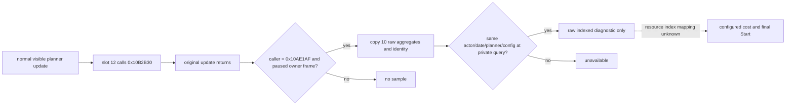

# Activity cost: passive slot-12 raw capture after R0356

Exact CK3 1.19.0.6 Steam 23530548 `ck3.exe` SHA-256:
`2D00FF3101EF70B566F2FCBAE292F09263199C80E9DC8F139B82D7D96F83DB86`.
The existing [cost and final-gate trace](activity-cost-slot12-r0346-boundary-1.19.0.6.md)
establishes the object and callsite. R0356's same-paused-frame stage-1 read
selected `feast_type_generic` with original IsShown, IsValid and stage-1
CanProgress all true. Its report is
`Z:\m6-activity-h3928-stage1-read-candidate-v2-20260929\operator-runs\feast-stage1-option-read-1\formal-report.txt`,
SHA-256 `562B9B2E9A01020CA593746872FFE733B030DBD6D08784E9B3F824305848BCD2`.
That proves a category Confirm opportunity. It does not prove a configured
price or permission to start the feast.

## Native read boundary

`ActivityPlanner` slot 12 at RVA `0x10AE180` calls the normal cost update
`0x10B2B30` at `0x10AE1AA`; the call return address is `0x10AE1AF`.
The update clears and recomputes the embedded `AccessCostBreakdown` object at
`planner+0x1AD8`. Its final loop calls `0x21C7B60` for each of ten raw
category aggregates. The copy address for index `i` is
`planner+0x1AD8+0x50+i*0x90+0x78`, `i=0..9`.

The default-OFF private flag
`XAR_CK3_ENABLE_G2_ACTIVITY_COST_SLOT12_PASSIVE_PRIVATE_V1` installs an
exact-prologue detour while the primary thread is suspended at startup.
The detour calls the original update trampoline exactly once. **After** it
returns, it records a sample only when the caller return address is
`0x10AE1AF`, the game is paused, the caller is the application-main owner
thread, the played actor is present, and the planner is the exact feast
planner type. It copies all ten signed 64-bit aggregates. It does not invoke
the update on demand, select an option, progress planning, or start an
activity.

The private `query-activity-cost-slot12-raw-v1-private` command reports a
sample only if the current paused native snapshot and its bridge revision
agree, actor/date/thread match the captured frame, and the planner's owner,
activity type, stage and bytes `+0x1530..+0x1AD7` still match the sample's
configuration fingerprint. The result identifies the normal slot-12 return
source and returns `raw_aggregate_i64[10]`. It deliberately emits
`resource_mapping=null` and `configured_cost=null`. A copied raw zero is
only a raw slot value; no index has a proven `gold` or other resource name.
The fingerprint covers the planner's observed configuration region; it is
not a claim that every game-side configuration field has been mapped.

## Next gate

Advance the already validated stage-1 category through its separate formal
action contract, then configure the planner in an owner-coordinated paused
candidate carrying this hook. A visible planner must perform the **normal**
slot-12 refresh after the final selection. A missing capture is reported as
`no_normal_refresh`, not a zero cost. At stage 5, compare an unambiguous
nonzero raw aggregate with the original GUI's
`CostBreakdown.GetCost('gold')` at
`game/gui/shared/value_breakdown.gui:800-803` in that exact configuration.
The GUI presents the planner's `AccessCostBreakdown` at
`window_activity_planner.gui:1744-1747` and `1978-1980`. The final button
uses `CanProgressPlanningStage` at `1762-1767` and `1987-1991`.
Only then bind named cost and separately read the stage-5 branch of
`0x10B0DA0`; the stage-1 true result is a different branch. Do not use
`ProgressPlanningStage` as a query, and do not promote this raw observer to
a formal cost or start capability.

The source package's exact ABI fixture checks the 14-byte refresh prologue
and the five-byte slot-12 call. Release/Debug focused tests exercise no
capture, wrong caller, valid raw capture, configuration mutation and date
change. They are source-level evidence only; this package did not launch CK3
or obtain a new live cost readback.
