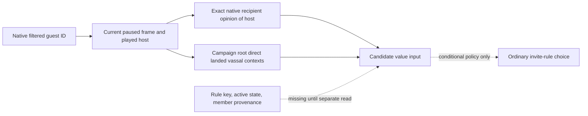

# Feast ordinary guest: host relationship value input (CK3 1.19.0.6)

Status: **source-only private command routed behind a default-OFF native build
option; no paused result or invited guest yet**.
This narrow input supports value comparison for a native-filtered ordinary
guest. It does not infer which authored invite rule contains that guest, nor
prove that the rule is active, an invitation is legal, accepted, or attended.

The frozen executable is `1.19.0.6-steam23530548`, SHA-256
`2D00FF3101EF70B566F2FCBAE292F09263199C80E9DC8F139B82D7D96F83DB86`.
The original `game/common/activities/activity_types/feast.txt:798-830`
declares the ordinary invite rule keys. In particular,
`activity_invite_rule_vassals` is a default; its definition in
`game/common/activities/guest_invite_rules/activity_invite_rules.txt:194-214`
enumerates direct vassals with the diarch exclusion. `window_activity_guest_list.gui:101-115`
binds a rule row to `ToggleInviteFromRules` and `IsInviteRuleActive`.
Those sources show category semantics, but a character's presence in the
planner's flattened filtered candidate groups does not establish which rule
produced that character.

## Reused native observation

The already verified faction-gift receiver
`ReadGiftOpinionExact11906V1(module, bindings, recipient_id, player_id, result)`
accepts arbitrary generation-bearing character IDs. It resolves both native
characters against the exact storage, calls original
`0x2610A50(recipient, player)` for current recipient opinion of player, and
requires two identical samples. The proposed private transport passes the candidate
as recipient and the live played host as player, on the paused application
thread. It compares a snapshot before and after and publishes only full IDs,
revision, date, and the signed integer opinion. Failure stays typed
`opinion_unavailable`; it never becomes zero. Negative opinion is a valid
observed value. The transport accepts requested IDs from the caller and contains
no Robert/H3928 constant.

The private build option
`XAR_CK3_ENABLE_G2_ACTIVITY_FEAST_GUEST_OPINION_PRIVATE_V1` is OFF by default.
When enabled, CMake includes the existing gift-opinion receiver if another
private consumer has not already included it, and builds the opinion core and
transport. The bridge validates the requested full CharacterID against the
same paused snapshot, submits a mailbox query through dedicated executor slot
67, checks the post-query snapshot, and returns a typed private read-only
response. The Python consumer still requires its own explicit opt-in. A
successful build or command ACK cannot establish the opinion value: a fresh
paused native read and its independent frame check are still required before
using it for guest selection.

The bounded operator exposes
`--private-activity-feast-guest-opinion-character-id <full CharacterID>` as a
standalone, default-OFF paused read. It does not open the feast planner or
submit Stage-1/Stage-2, invitation, rule activation, Start, or a gameplay date
turn. The runner records the same-frame signed opinion and holds the decision;
`opinion_unavailable` remains RED. This route can sample the known H3928 guest
without relying on a Stage-5 rule window, but a fresh exact-build paired
no-launch check is required before any live run.

The routed source compiles and links as a full MSVC 19.51 x64 Debug and
Release bridge DLL with this option ON. The core fixture passes in both
configurations (1/1 each); the main-thread mailbox fixture passes in Debug
(1/1) with the frozen executable supplied as a read-only source input. The
focused Python parser passes in normal and optimized mode (3/3 each). These
are source and fixture checks, with no CK3 launch or paused native read.

`query-campaign-root-context-v1` independently publishes the live player's
`direct_landed_vassal_character_ids` and related context/title tier. Its
nonempty vector was live validated on R639. A same-frame match may support
the direct landed-vassal relationship and rank value; absence does not exclude
an unlanded direct vassal, and membership still does **not** prove the
candidate's authored rule, diarch status, or current rule toggle. Rule
provenance remains the separate native query's responsibility.

R0373's [paused report](Z:/m6-activity-h3928-guest-abi-candidate-20260929/operator-runs/feast-guest-abi-repair-read-1/formal-report.txt)
SHA-256 `809FBAE514E2E9AC099B21A0A2110ECA7A08A9AF96F6D8D84C3AE040261FA51C`
observed candidate CharacterID `38293`, planner join raw `9300000`, travel
days `0`, and arrival `53219928 <= 53221344`. It exposed no opinion,
relationship, rank, rule member map, or active-rule state; the new read cannot
retroactively fill the terminated R0373 frame. A fresh paired paused read
must bind all values to one frame before a concrete rule can be selected.

For a `vassals` rule decision, opinion and direct-vassal rank are only
candidate value signals. Policy still needs the rule's actual current member
set and active flag, its effects on selected guest count (feast max 40),
any resulting resource difference, and the independent invitation/Start
legality checks. An opinion value is not a promised opinion increase or an
alliance. The fixed H3928 feast Gold charge and current war cash reservation
remain separate Start-value terms.
