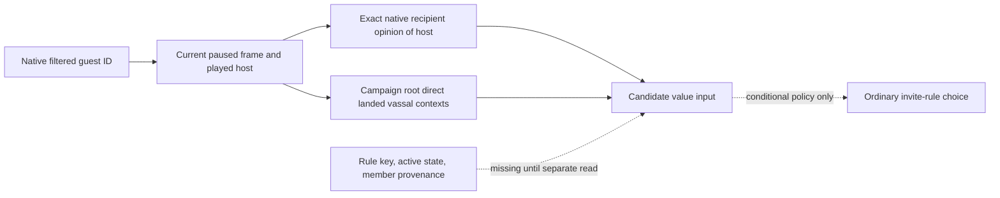

# Feast ordinary guest: host relationship value input (CK3 1.19.0.6)

Status: **source-only core and transport, not routed into the bridge build or
command dispatcher; no paused result or invited guest yet**.
This narrow input supports value comparison for a native-filtered ordinary
guest. It does not infer which authored invite rule contains that guest, nor
prove that the rule is active, an invitation is legal, accepted, or attended.

The frozen executable is `1.19.0.6-steam23530548`, SHA-256
`2D00FF3101EF70B566F2FCBAE292F09263199C80E9DC8F139B82D7D96F83DB86`.
The original `game/common/activities/activity_types/feast.txt:798-830`
declares the ordinary invite rule keys. In particular,
`activity_invite_rule_vassals` is a default; its definition in
`game/common/activities/guest_invite_rules/activity_invite_rules.txt:194-214`
enumerates direct vassals with the diarch exclusion. `window_activity_guest_list.gui:101-115`
binds a rule row to `ToggleInviteFromRules` and `IsInviteRuleActive`.
Those sources show category semantics, but a character's presence in the
planner's flattened filtered candidate groups does not establish which rule
produced that character.

## Reused native observation

The already verified faction-gift receiver
`ReadGiftOpinionExact11906V1(module, bindings, recipient_id, player_id, result)`
accepts arbitrary generation-bearing character IDs. It resolves both native
characters against the exact storage, calls original
`0x2610A50(recipient, player)` for current recipient opinion of player, and
requires two identical samples. The proposed private transport passes the candidate
as recipient and the live played host as player, on the paused application
thread. It compares a snapshot before and after and publishes only full IDs,
revision, date, and the signed integer opinion. Failure stays typed
`opinion_unavailable`; it never becomes zero. Negative opinion is a valid
observed value. The transport accepts requested IDs from the caller and contains
no Robert/H3928 constant.

The native core fixture and transport object compile with MSVC `/W4 /WX`
Release; the focused Python parser tests pass 3/3 in normal and optimized
mode. These checks do not show that the command can be called from a running
bridge. The remaining source step is to register the default-OFF build option,
compile the existing gift opinion receiver when otherwise absent, grant a new
main-thread mailbox executor slot, and add the bridge command dispatch and
typed private response. That shared-file work is deferred until the separate
per-rule provenance writer releases `bridge.cpp`, `CMakeLists.txt`, and the
mailbox files. Then rerun the affected MSVC fixture/build and no-launch checks
against the new exact source before any paused live query.

`query-campaign-root-context-v1` independently publishes the live player's
`direct_landed_vassal_character_ids` and related context/title tier. Its
nonempty vector was live validated on R639. A same-frame match may support
the direct landed-vassal relationship and rank value; absence does not exclude
an unlanded direct vassal, and membership still does **not** prove the
candidate's authored rule, diarch status, or current rule toggle. Rule
provenance remains the separate native query's responsibility.

R0373's [paused report](Z:/m6-activity-h3928-guest-abi-candidate-20260929/operator-runs/feast-guest-abi-repair-read-1/formal-report.txt)
SHA-256 `809FBAE514E2E9AC099B21A0A2110ECA7A08A9AF96F6D8D84C3AE040261FA51C`
observed candidate CharacterID `38293`, planner join raw `9300000`, travel
days `0`, and arrival `53219928 <= 53221344`. It exposed no opinion,
relationship, rank, rule member map, or active-rule state; the new read cannot
retroactively fill the terminated R0373 frame. A fresh paired paused read
must bind all values to one frame before a concrete rule can be selected.

For a `vassals` rule decision, opinion and direct-vassal rank are only
candidate value signals. Policy still needs the rule's actual current member
set and active flag, its effects on selected guest count (feast max 40),
any resulting resource difference, and the independent invitation/Start
legality checks. An opinion value is not a promised opinion increase or an
alliance. The fixed H3928 feast Gold charge and current war cash reservation
remain separate Start-value terms.
