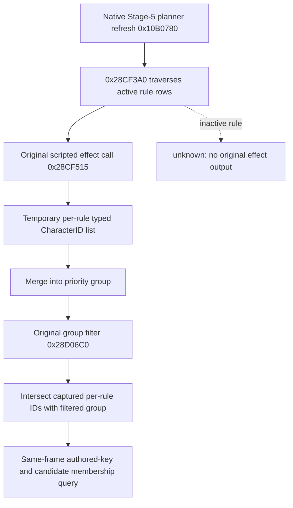

# Ordinary feast guest rule provenance: passive exact-build read

Status: **source and focused fixture only**. This private default-OFF path has
not produced a paused CK3 result. It applies to CK3 1.19.0.6, EXE SHA-256
`2D00FF3101EF70B566F2FCBAE292F09263199C80E9DC8F139B82D7D96F83DB86`.
It extends the [ordinary rule binding](activity-feast-guest-rule-toggle-1-19-0-6.md)
and [Stage-5 guest read](activity-stage5-feast-guest-candidate-1.19.0.6.md).

The original `activity_feast` definition lists `activity_invite_rule_vassals`
among its default guest rules (`game/common/activities/activity_types/feast.txt:798-832`).
That rule runs `every_vassal` subject to its authored predicate
(`game/common/activities/guest_invite_rules/activity_invite_rules.txt:194-214`).
Several default rules share priority 1, so an ID in the final priority-1
group does not establish which rule supplied it.

## Native decision tree

The call at `0x10B0A5C` passes the planner's active-rule vector
`planner+0x1A18` and filtered-group vector `planner+0x1590` to `0x28CF3A0`.
Within its rule loop, `0x28CF4B0` loads the 16-byte active row's definition
pointer and priority. The call at `0x28CF515` invokes the rule's loaded effect
at `definition+0x38` via `0x3380410`. On its natural return, the temporary
output has a `+0x100` row pointer and `+0x10C` row count. The matching list
key is `definition+0x9C`; its 0x48-byte row contains a typed-value pointer at
`+0x10` and count at `+0x1C`. Type 4 values hold full CharacterID at `+8`.
`0x28CF590..0x28CF5B0` merges these IDs into the priority group and loses
their rule origin. The final original filtering later runs per group.

Two exact-prologue observers wrap the original `0x28CF3A0` refresh and
`0x3380410` effect executor. Each trampoline calls the original once. The
effect observer records only calls returning to `0x28CF51A` inside the
current natural refresh; it never invokes a scripted effect for inspection.
After the original refresh returns, the observer intersects each rule's
temporary IDs with the final group of the same priority. It stores a bounded
capture with the current feast planner, paused date/actor/thread, native
definition hash, active-rule contents and final group contents. Any changed
frame/vector, incomplete read or overflow returns a typed unavailable result.

The new private step is `query-activity-feast-guest-rule-provenance-v1`.
It takes the existing exact paused Stage-5 context fields, authored rule key,
and `candidate_character_id`. It first uses the existing key-to-unique-row
and window-binding read, then matches the native hash to exactly one captured
active rule. An observed response contains raw rule ID count, filtered rule
ID count/list, natural refresh sequence and the candidate's membership in
that filtered list. On an inactive rule or a frame without a matching natural
refresh, membership remains `null`; a priority group is never substituted.
The stock feast `max_guests=40` is an authored capacity input, not a measured
native invitation or acceptance outcome.

This read supplies a decision input only. It does not send an invitation,
prove acceptance or attendance, start the feast, advance a turn, or close a
cold-recovery contract. Its focused MSVC fixture checks exact instruction
anchors, rule-specific ID capture, post-filter intersection, negative
candidate membership and stale-group rejection. A separate frozen DLL,
official pair/no-launch check and paused live read are still required.

The bounded Python runner and operator now expose this read only when a named
rule and the same run's filtered candidate read are requested. The transport
checks the exact envelope, candidate identity and unchanged paused frame;
observed membership still yields `hold` with invitation and Start disabled.
This is source and fixture coverage, not a live membership result. In H3928,
R0378 separately found Stage-5 `final_can_start=false`: actor 29829 failed
`is_available_adult` because `in_army=no`. A future action trial therefore
needs a fresh legal paused frame with `final_can_start=true`, a matching
candidate/rule membership read, native invitation legality, and the action's
independent postcondition before any Start or invitation claim.
