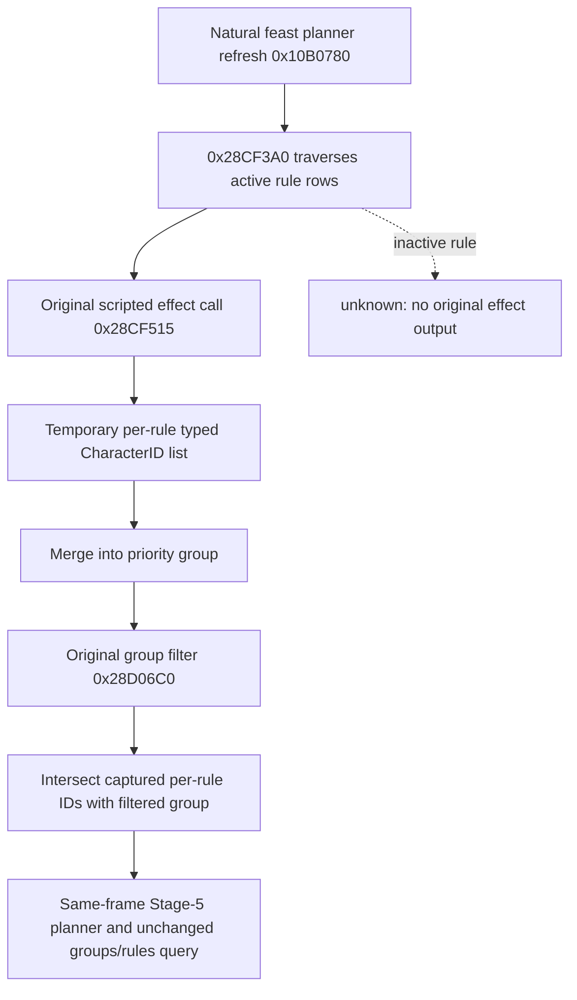
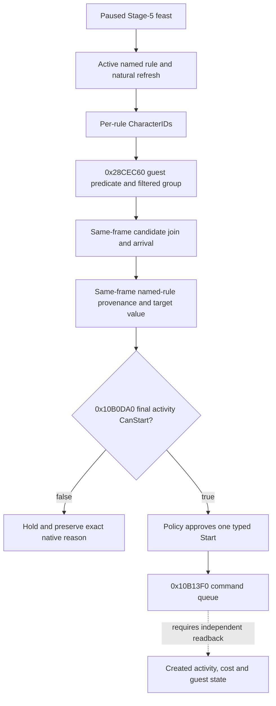
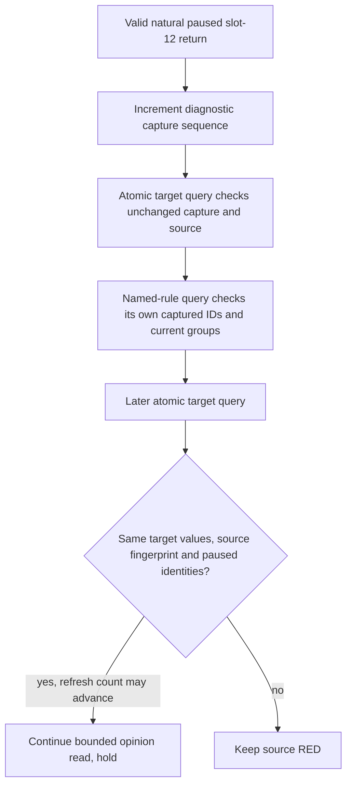

# Ordinary feast guest rule provenance: passive exact-build read

Status: **R0401 observed private target and named-rule membership; the bounded
route remains RED at the Python target recheck, before opinion**. This
private default-OFF path now has a paused membership result, described below. It
applies to CK3 1.19.0.6, EXE SHA-256
`2D00FF3101EF70B566F2FCBAE292F09263199C80E9DC8F139B82D7D96F83DB86`.
It extends the [ordinary rule binding](activity-feast-guest-rule-toggle-1-19-0-6.md)
and [Stage-5 guest read](activity-stage5-feast-guest-candidate-1.19.0.6.md).

The original `activity_feast` definition lists `activity_invite_rule_vassals`
among its default guest rules (`game/common/activities/activity_types/feast.txt:798-832`).
That rule runs `every_vassal` subject to its authored predicate
(`game/common/activities/guest_invite_rules/activity_invite_rules.txt:194-214`).
Several default rules share priority 1, so an ID in the final priority-1
group does not establish which rule supplied it.

## Native decision tree

The call at `0x10B0A5C` passes the planner's active-rule vector
`planner+0x1A18` and filtered-group vector `planner+0x1590` to `0x28CF3A0`.
Within its rule loop, `0x28CF4B0` loads the 16-byte active row's definition
pointer and priority. The call at `0x28CF515` invokes the rule's loaded effect
at `definition+0x38` via `0x3380410`. On its natural return, the temporary
output has a `+0x100` row pointer and `+0x10C` row count. The matching list
key is `definition+0x9C`; its 0x48-byte row contains a typed-value pointer at
`+0x10` and count at `+0x1C`. Type 4 values hold full CharacterID at `+8`.
`0x28CF590..0x28CF5B0` merges these IDs into the priority group and loses
their rule origin. The final original filtering later runs per group.

Two exact-prologue observers wrap the original `0x28CF3A0` refresh and
`0x3380410` effect executor. Each trampoline calls the original once. The
effect observer records only calls returning to `0x28CF51A` inside the
current natural refresh; it never invokes a scripted effect for inspection.
After the original refresh returns, the observer intersects each rule's
temporary IDs with the final group of the same priority. It stores a bounded
capture with the current feast planner, paused date/actor/thread, native
definition hash, active-rule contents and final group contents. Any changed
frame/vector, incomplete read or overflow returns a typed unavailable result.
The exact H3928 Stage-2 destination route performs this natural refresh while
the planner is still at stage 2; the later Stage-5 read accepts that capture
only when the same planner, feast type, actor/date/thread, active rules and
filtered groups remain bound. A query before Stage 5 or after a changed vector
remains unavailable.

The new private step is `query-activity-feast-guest-rule-provenance-v1`.
It takes the existing exact paused Stage-5 context fields, authored rule key,
and `candidate_character_id`. It first uses the existing key-to-unique-row
and window-binding read, then matches the native hash to exactly one captured
active rule. An observed response contains raw rule ID count, filtered rule
ID count/list, natural refresh sequence and the candidate's membership in
that filtered list. On an inactive rule or a frame without a matching natural
refresh, membership remains `null`; a priority group is never substituted.
The stock feast `max_guests=40` is an authored capacity input, not a measured
native invitation or acceptance outcome.

This read supplies a decision input only. It does not send an invitation,
prove acceptance or attendance, start the feast, advance a turn, or close a
cold-recovery contract. Its focused MSVC fixture checks exact instruction
anchors, rule-specific ID capture, post-filter intersection, negative
candidate membership and stale-group rejection. R0386 supplied a separately
frozen DLL, official pair/no-launch check and paused live read, but the
membership result was unavailable as described below.

The bounded Python runner and operator now expose this read only when a named
rule and the same run's filtered candidate read are requested. The transport
checks the exact envelope, candidate identity and unchanged paused frame;
observed membership still yields `hold` with invitation and Start disabled.
The R0401 increment below records the first observed membership; its failed
caller did not complete the bounded target/rule/opinion route. In H3928,
R0378 separately found Stage-5 `final_can_start=false`: actor 29829 failed
`is_available_adult` because `in_army=no`. A future action trial therefore
needs a fresh legal paused frame with `final_can_start=true`, a matching
candidate/rule membership read, native invitation legality, and the action's
independent postcondition before any Start or invitation claim.

## Ordinary invitation decision seam (2026-09-29 source trace)

The frozen executable still hashes to the EXE SHA above. The original
`window_activity_guest_list.gui` hashes to
`FD293E8FA1D73AFB15D5B1DF2EE1075E7184185E871E8B359F5C1BEC9FADFA97`;
`feast.txt` hashes to
`CE9B72F84B534CE5B8E0764FBFE0552CDBE889ABDEC370747643014B2668FB7C`.
The ordinary GUI offers `ToggleInviteFromRules` for each category
(`window_activity_guest_list.gui:100-115`). Its per-character Select button
is visible only for a special guest (`:547-552`). The normal feast definition
uses category rules and `can_be_activity_guest` (`feast.txt:798-839`).

The exact executable's `0x10B0780` consumes active rules at planner `+0x1A18`
and refreshes filtered groups at `+0x1590`. For each group CharacterID,
`0x28D07A1` calls `0x28CEC60`; that routine checks `0x28AF3B0` and evaluates
the activity type's guest predicate at `+0xD58` before retaining the ID.
Thus the existing candidate reader samples a **post-filter** group and then
checks original join chance and arrival. The provenance read identifies which
named active rule supplied an ID before groups lose that origin. Neither read
is a command validator or evidence that an invitation was sent.

Stage-5 `0x10B0DA0:0x10B1018-0x10B1092` copies the planner payload into a
temporary `CStartActivityCommand` and invokes its validator. After approval,
`0x10B13F0:0x10B1400-0x10B14A9` refreshes the planner, copies the payload and
queues the command. This is an **activity-level** final gate. The source trace
does not establish a separate ordinary per-character invitation action or an
independent pre-Start `final_invite_legal` boolean, nor when the game records
each guest's invitation. No new aggregate read or typed guest action is
justified by the current frame.

R0373's candidate 38293 and R0377's opinion +62 came from separate paused
runs. R0378's `activity_invite_rule_vassals` was active with 22 filtered
characters, but that aggregate count does not establish 38293's membership;
the #675 provenance bridge has source/fixture coverage only. R0378 also had
`final_can_start=false` from the host's `is_available_adult` army condition.
The next useful trial therefore needs a **new legally Startable paused frame**
with candidate, named-rule membership, join/arrival, target value, current
cost and final CanStart read on that frame. Only then can a formal Start
consumer submit once and verify created activity, debit, guest state, next
turn and required restore. Until then `final_invite_legal` remains unknown;
candidate filtering and a positive join estimate do not turn it true.

## R0386 paused read RED and diagnostic boundary

R0386 used source `d7cbfb4`, Release DLL SHA-256
`5EE67F398863B1EE63A0E8F4BD2E95B5F5F486C2B614CECF071A34BFC27C02CF`,
and the officially paired H3928 paused Robert frame (actor 29829,
raw date 53219928). The Stage-5 candidate and combined route proof both read
the same native refresh sequence and fingerprint, but the named
`activity_invite_rule_vassals` provenance query for CharacterID 38293 returned
`no_normal_refresh`. The runner correctly retained RED; it did not infer a
membership boolean, toggle a category, invite, Start, or advance the game date.

The rule query first returned an observed rule state; its native transport
assigns the same `no_normal_refresh` status when either the second passive
slot-12 read fails or the provenance observer's `latest.sequence` is zero.
The R0386 result does not distinguish those two branches. The earlier
candidate and route proof had observed the passive capture, but that does not
prove its status at the later named-rule query. The exact executable's call at
`0x10B0A5C` supplies `planner+0x1A18` as the fourth argument and
`planner+0x1590` as the sixth, matching the hook's binding. The artifact does
not distinguish an absent matching callback from a callback rejected by its
paused frame, thread, planner, feast-type, or Stage-5 gate.

The default-OFF diagnostic build reports the second passive read's exact
status or counts each rejection at the natural provenance refresh hook,
whichever branch fails. It includes those details only in the existing
`no_normal_refresh` RED message. It never synthesizes a rule membership,
invokes a refresh or scripted effect, or enables invitation/Start. R0388 below
used this diagnostic to identify the actual failed gate.

## R0388 Stage-2 refresh phase and source repair

R0388 used the officially paired H3928 candidate at source master
`bb5b8b86ddafcfde1f1b2a4fa229e46fc35d4253`
and the unchanged Robert paused date `53219928`. Its native diagnostic reported
`no_normal_refresh hook=2 ... stage_not_five=2 accepted=0 last_stage=2`;
all other rejection counters were zero. The second passive slot-12 read
succeeded. Both actual natural refreshes were discarded solely because the
observer demanded stage 5 at entry. The bounded trial did not invite, Start,
advance a date, or change the source save. Its immutable formal report has
SHA-256 `F4ACAFC31D54CB0C5258F9AA4AF2631561EC5AC7F20BF594B7EB66BAFB62B8E3`.

The exact `0x10B1BD0` stage setter writes stage 5 before invoking the stage-2
exit callback; it does not itself call the guest-rule refresh. The Stage-2
destination path can therefore leave a group created during stage 2 for the
Stage-5 planner. The observer now captures an otherwise valid natural stage-2
refresh and intersects the original per-rule outputs with the filtered group.
At read time it requires current stage 5, the same feast type and unchanged
active-rule and filtered-group fingerprints. A changed group or rule remains
`frame_changed`; no aggregate group is substituted for a rule-specific result.
R0401 below subsequently returned a paused membership boolean; that result
does not turn its failed whole route into a successful run.

## R0401 target recheck: passive refresh count is not a changed guest source

R0401 used frozen Python `e12801a91676caf0837a9094b2d3216b9c659e69` and
Release DLL SHA-256
`BF66E08513393E7744E35A53C905ACBEE2E14DD8E66FF8F60289E0F3733602B5`.
Its immutable report is
`D:\nw-activity-target-h3928-python-c6-20260930\operator-runs\feast-target43699-h3928-python-c6-1\formal-report.txt`
(1,543,939,699 bytes). The compact fault extract is
`D:\nw-activity-r0401-target-rule-source-20260930\R0401-COMPACT-FAULT.json`;
an independent audit is retained beside the C6 candidate as
`INDEPENDENT-R0401-EVIDENCE.json`.

The first target read and the read after named-rule provenance both observed
CharacterID 43699 on actor 29829's paused H3928 frame, date 53219928,
snapshot `native:3`, public revision 4 and native revision 3. Both source
fingerprints were `0xe161ec03ef105649`. Every returned target field matched
except `normal_refresh_sequence`, which advanced from 952 to 1506. The named
vassals rule independently observed membership `true`, with 9 raw IDs and
the single post-filter ID 43699. Its sequence was 2, from a different observer.

The native definition explains the difference. In
`src/activity_cost_slot12_passive_v1.cpp`,
`RecordActivityCostSlot12NormalReturnV1` increments
`candidate.sequence = observer.latest.sequence + 1` on each valid natural
paused return. `src/activity_feast_guest_candidate_v1.cpp` copies that count
into the target result. It still requires the sequence, planner and
configuration fingerprint to remain unchanged **inside one atomic native
query** (`capture_after.sequence != capture.sequence` remains a rejection).
The separate rule observer increments its own count in
`EndActivityGuestRuleRefreshV1`; its counter is not the target observer's
source identity. No observer or native per-query gate changes here.

The production Python caller compared the entire target dictionaries and
therefore raised `StepPostconditionError` at 03:40:26 UTC despite unchanged
content. The minimal Python fix excludes only this diagnostic count from
cross-query dictionary equality, reusing the same content comparison at the
immediate recheck and the final bounded qualification. Both caller positions
previously compared the whole dictionary; a focused production regression
confirmed that fixing only the first still left final qualification RED.
It keeps the original counts in the report,
all other target fields in the comparison, both per-read paused-frame gates,
and the rule-membership/filtered-target consistency check. The next candidate's
outer verifier must use the same comparison; the frozen C6 helper also used
whole-dictionary equality and remains preserved with its failed attempt.

The actual target was filtered but unselected, with join raw -98,700,000,
travel 73 days, arrival 53221680 later than planned start 53221344, and native
`final_can_start=false`. These negative values remain unchanged. Opinion was
not reached. R0401 completed 0/1 formal turns, zero gameplay/checkpoint/date
advances, retained the original save SHA
`A92073407D1CB2800EEF9C0C3EFEB9846D48398F679DC3163B71EF86C40CEC2C`,
and reported the owned process tree gone at 03:40:29 UTC. Source repair and
offline production replay do not close this live RED, authorize Invite/Start,
or claim a successful opinion, action, next turn or recovery.

`open_kaishek` preflight is not applicable: this change compares Python
observation dictionaries and changes no Paradox authored-script semantics.
