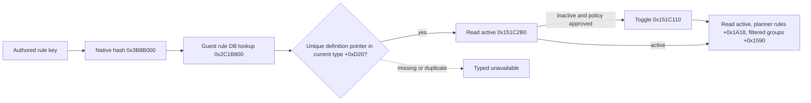

# Ordinary feast invitation rule: exact native binding and private toggle

This source-only contract applies to CK3 `1.19.0.6`, executable SHA-256
`2D00FF3101EF70B566F2FCBAE292F09263199C80E9DC8F139B82D7D96F83DB86`.
It extends the activity guest read tree. No CK3 action or paused live postcondition
was produced while deriving this ABI.

`game/gui/window_activity_guest_list.gui:100-115` binds an ordinary invitation
category row to `ActivityGuestListWindow.ToggleInviteFromRules` and the active
query to `IsInviteRuleActive`. The exact callback `0x151C3E0` resolves its
`OrderedActivityInviteRule.Self` to a native 16-byte rule row before calling
`0x151C110(window, row)`. The active getter is `0x151C2B0(window, row)`.

The authored keys appear under `guest_invite_rules` in
`game/common/activities/activity_types/feast.txt:798-832`. Their numeric
priorities repeat; neither priority nor row index identifies a key. The
`CActivityGuestInviteRulesDatabase` constructor `0x2C22DC0` stores its
singleton at module `+0x57D35F8`, with vtables `+0x4400678` and `+0x4400660`.
Getter `0x2C19210` retrieves it. Resolver `0x2C15160(std::string* key)`
passes the key's bytes and length to `0x3B8B000` (MurmurHash3 x86 32, zero
seed), then calls `0x2C1B800(database, hash32)`. The lookup returns the
`SActivityGuestInviteRule*` definition or the missing sentinel at
`*(module+0x57D3618)`. The parser `0x2C192D0` inserts each created definition
and its hash (`definition+0x14`) into the same database table. On the current
`CActivityType`, `+0xD20` points to ordered 16-byte rows and `+0xD2C` is their
signed count. A row's first pointer is its definition; require exactly one
pointer match to bind an authored key.

`handler+0x3F0` holds the guest window (vtable `+0x41676E8`).
`window+0x100` must equal `handler+0x3C0`, the current Stage-5 planner, and
`window+0xF8` must be `-1` for planning mode. The live host, played actor,
feast type and paused frame must also agree. An allocated but unbound window
returns typed `window_unbound`; this private toggle does not open the GUI.

The native toggle copies the window's active rows into `planner+0x1A18`,
then calls the planner's guest filter refresh `0x10B0780`, which writes groups
at `planner+0x1590`. The private result checks the active getter against the
copied row and reads the refreshed group structure on the paused frame.
The ordinary guest list is category based; `planner+0x1678` individual
selection count may stay zero. `activated` only states this category toggle
and readback succeeded. It does not claim an accepted guest, activity Start,
the next turn, or cold recovery. Those require separate formal consumption
and live evidence. Unavailable wire results carry `null` for active, native
hash and counts; `invoked` remains a known boolean so a failed postcondition
does not invite an automatic second toggle. The build option is default OFF
and adds no public ad.

## Python consumption boundary

The default-off Python route uses `--private-activity-feast-guest-rule-key`
only after the existing same-frame Stage-5 destination and full-cost route.
The typed transport checks the paused actor, native revision and date before
and after the native read. An inactive rule becomes a `hold` decision with
`formal_action_ready=false` and reason
`category_membership_and_value_unobserved`; an active rule becomes a hold
with reason `category_already_active`. `window_unbound` remains a typed RED,
since a planner and the guest list window are distinct native objects.

The native action transport is present but its driver action flag is OFF in
this runner. The R0373 positive pre-invitation candidate lacks a rule
membership mapping and target-specific value fields, so the current source
cannot choose a category. This source-only addition supplies no live action,
guest invitation, following turn or recovery evidence. A later formal
consumer must join same-frame rule membership and target value, then persist
an intent before action and reconcile native active state on cold restore.

## R0374 read RED and bounded source correction

R0374 used the frozen H3928 guest-rule candidate and reached the same paused
`native:3`, actor 29829, raw date 53219928 after verified Stage-1 Confirm and
Stage-2 Province 2619 selection. Stage-5 full cost read Gold 10,000,000 raw
against actor Gold 120,644,281 raw, with normal refresh sequence 890. The
private `activity_invite_rule_vassals` query returned `planner_unavailable`
before hash, rule or window binding. Its [formal report](Z:/m6-activity-h3928-guest-rule-state-candidate-20260929/operator-runs/feast-guest-rule-vassals-read-1/formal-report.txt)
has SHA-256 `E3DE54D75BABA3B8D36E2CF74CFC43E7605FD93EB9889372671AF0FF3870B59E`.
There was no date advance, Gold debit or save change, and the CK3 tree was
reclaimed. This is a live RED for the private reader, not a failed toggle.

The guest-rule binder required `host_view_activity_key_known=true`, while the
Stage-5 cost and guest-candidate readers allow an unknown HostView key and
independently validate the normal slot-12 planner's exact feast type. The
HostView can still carry an earlier or empty activity after the planner selects
a feast. That mismatch is a plausible cause of the R0374 status; the formal
result did not publish the diagnostic key, so it does not prove which
`planner_unavailable` guard fired. The bounded correction accepts an unknown
HostView key only when the same paused capture validates `activity_feast` and
all existing owner, actor, stage and window checks still pass. A known
non-feast key remains rejected. The focused native fixture now covers both
states. It is source and no-launch evidence only until another paired live
read shows the rule state.

## R0376 exact-master live retry

The bounded H3928 candidate used master `a6605fa`, official CI run
`36576910658` (success), Release DLL SHA-256
`8A444F05EE9FD28F003E7FFD45B694C7098B8D78B7187BB1C56F309889CDAFE7`,
and an official paired no-launch `ready` report. CK3 PID175868 was minimized
after its window appeared; the process stayed responsive in the background.
Stage-1 Confirm, Stage-2 Province2619 typed selection and Stage-5 cost read
passed. The same paused `native:3` frame at revision4, actor29829 and
raw53219928 returned `window_unbound` for
`activity_invite_rule_vassals`, with `active=null` and unknown membership.
The attempted private read therefore remains RED. The transition from
R0374's `planner_unavailable` narrows the failing path but does not prove why
the guest-rule window failed to bind; there is no evidence that minimizing
caused it. No toggle, invitation, Start, gameplay turn or date change occurred;
the original save hash remained
`A92073407D1CB2800EEF9C0C3EFEB9846D48398F679DC3163B71EF86C40CEC2C`,
and the process tree was reclaimed. The [formal report](Z:/m6-gr374-redfix-20260929/operator-runs/feast-guest-rule-vassals-redfix-read-1/formal-report.txt)
has SHA-256 `0A78C143E796DEB58C5D9D04AC79A3C7B2E46612AC0E08202E0AAC45AE179EF6`;
the [operator receipt](Z:/m6-gr374-redfix-20260929/operator-runs/feast-guest-rule-vassals-redfix-read-1/operator-receipt.json)
has SHA-256 `5D8D5D58E935E87452C57D41239CA700F705F04FD991CEFE2E8F26D2DCBFBA69`.
This artifact supersedes a source-only inference, while retaining the exact
unresolved live boundary for the native reader.

The `window_unbound` status proves the query passed the feast planner and
actor guards before failing one guest-list view binding check: owner+0x3F0,
the exact window vtable, its bound planner at +0x100, or mode at +0xF8. The
report does not distinguish those checks. In vanilla
`window_activity_planner.gui`, the `activity_guest_list` view opens separately
through `OpenGameViewData('activity_guest_list', ActivityPlanner.AccessSelf)`;
Stage-1/2 and Stage-5 cost success alone do not establish that view.

The next bounded source change reads a named rule's active state from the
planner's +0x1A18/+0x1A24 vector, which the original guest filter consumes,
without requiring the guest-list view. The typed toggle still requires that
view and agreement between the native getter and active vector. Exact-key
focused Debug and Release fixtures passed. This remains source and fixture
evidence until a newly paired paused live read succeeds; OS minimization has
not been shown to cause the window binding failure.
