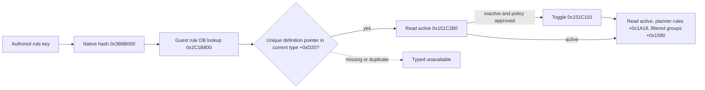

# Ordinary feast invitation rule: exact native binding and private toggle

This source-only contract applies to CK3 `1.19.0.6`, executable SHA-256
`2D00FF3101EF70B566F2FCBAE292F09263199C80E9DC8F139B82D7D96F83DB86`.
It extends the activity guest read tree. No CK3 action or paused live postcondition
was produced while deriving this ABI.

`game/gui/window_activity_guest_list.gui:100-115` binds an ordinary invitation
category row to `ActivityGuestListWindow.ToggleInviteFromRules` and the active
query to `IsInviteRuleActive`. The exact callback `0x151C3E0` resolves its
`OrderedActivityInviteRule.Self` to a native 16-byte rule row before calling
`0x151C110(window, row)`. The active getter is `0x151C2B0(window, row)`.

The authored keys appear under `guest_invite_rules` in
`game/common/activities/activity_types/feast.txt:798-832`. Their numeric
priorities repeat; neither priority nor row index identifies a key. The
`CActivityGuestInviteRulesDatabase` constructor `0x2C22DC0` stores its
singleton at module `+0x57D35F8`, with vtables `+0x4400678` and `+0x4400660`.
Getter `0x2C19210` retrieves it. Resolver `0x2C15160(std::string* key)`
passes the key's bytes and length to `0x3B8B000` (MurmurHash3 x86 32, zero
seed), then calls `0x2C1B800(database, hash32)`. The lookup returns the
`SActivityGuestInviteRule*` definition or the missing sentinel at
`*(module+0x57D3618)`. The parser `0x2C192D0` inserts each created definition
and its hash (`definition+0x14`) into the same database table. On the current
`CActivityType`, `+0xD20` points to ordered 16-byte rows and `+0xD2C` is their
signed count. A row's first pointer is its definition; require exactly one
pointer match to bind an authored key.

`handler+0x3F0` holds the guest window (vtable `+0x41676E8`).
`window+0x100` must equal `handler+0x3C0`, the current Stage-5 planner, and
`window+0xF8` must be `-1` for planning mode. The live host, played actor,
feast type and paused frame must also agree. An allocated but unbound window
returns typed `window_unbound`; this private toggle does not open the GUI.

The native toggle copies the window's active rows into `planner+0x1A18`,
then calls the planner's guest filter refresh `0x10B0780`, which writes groups
at `planner+0x1590`. The private result checks the active getter against the
copied row and reads the refreshed group structure on the paused frame.
The ordinary guest list is category based; `planner+0x1678` individual
selection count may stay zero. `activated` only states this category toggle
and readback succeeded. It does not claim an accepted guest, activity Start,
the next turn, or cold recovery. Those require separate formal consumption
and live evidence. The build option is default OFF and adds no public ad.
