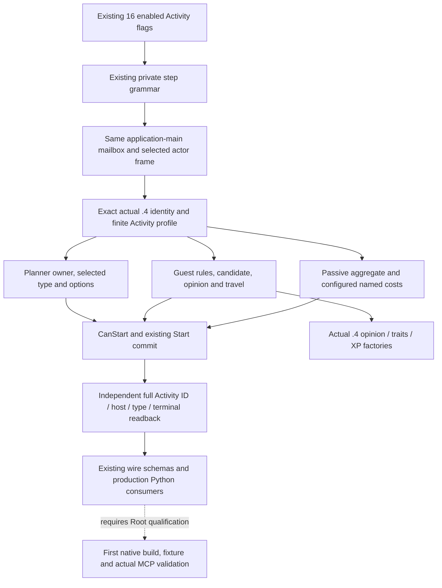

# Adopted Activity and Feast MCP migration to CK3 1.20.0.4

Source-first migration, October 7, 2026 (Asia/Shanghai). The implementation
baseline is `caa4adc3d1278e324cf4ec19774028e9b9138e28`. The current frozen tuple
is CK3 **1.20.0.4**, Steam **25734779**, executable SHA-256
`98702F88A547CDE2EAF29A85F93B85F68EE4CF8148336A4F7AFAEB75319DD518`.
The earlier .2/.3 contracts and live receipts remain historical evidence.

The authoritative adopted coverage assigns sixteen existing enabled flags to
this package: passive slot-12 cost, guest candidate, guest opinion, guest rule
provenance and toggle, planner Open, Stage-1 option read and confirm, Stage-2
destination, gate, location and option read, and Stage-5 CanStart, Gold, full
Feast cost and Start. Their current production route also returns the existing
Start-input and hosted-post/target views. This migration preserves these
schemas, actions and policy. It adds no Activity decision or policy.

The source ledger is external at
`Z:/ck3_mod_rewrite_process_assets/g2-migration-20261007/activity/`.
`common-native/SOURCE-TREE.md` and `PARENT-SOURCE-PLAN.md`,
`planner-native/SOURCE-TREE.md`, `guest-cost-native/SOURCE-TREE.md`, and
`python/SOURCE-TREE.md` were sealed before their implementation. Each finite
mapper receipt retains original ranges, candidates, decoded member operands,
relative/RIP targets, unique I/O and partial attempts. Existing core-global and
command-layout proofs are reused; no whole-image read, hash or runtime contact
is part of this package.

The existing planner .2 ABI retains full IDs, owner `+A0`, handler slots `+3C0`
and `+3D8`, selected type `+1500`, stage `+1AE8`, option rows and actual widget
visibility. Actual .4 mapped code retains those member operands. Direct entry
mappings include CanStart `11B8670 -> 11B8650`, selected province
`11B6C80 -> 11B6C60`, Commit `11B8D90 -> 11B8D70`, and unchanged typed dispatch
`AF39E0`. The ScriptOption identifier belongs to ScriptIdentifierTable:
`3F8A800 -> 3F8A7E0` and `3F8A6F0 -> 3F8A6D0`. It is not the generic type-name
domain. Relative guard displacements are recalculated from the paired actual
instruction site and target while all opcode/member bytes remain exact.

CanStart contains 800 code bytes followed by six DWORD image-relative branch
targets. Its code uses the paired table addresses `11B8990 -> 11B8970`; the
separate temporary vptr `476BAA0 -> 476BAB0` is corroborated by the actual
paired RIP base `476BA70 -> 476BA80`. These two operands and the branch table
are explicitly compared as code/data, not blindly normalized. The selected
Stage-5 source branch is `11B88E8 -> 11B88C8`.

Guest/cost source has a concrete historical literal correction: the actual
.3/.4 rule sentinel is `5D34048`, whereas the old .2 literal was `5D33F48`.
The .4 database getter has displacement byte `3D` instead of `1D`. Rule
vptrs `48B2F20 -> 48B2F30` and `48B2EC0 -> 48B2ED0` come from paired native
operands. Actual selected guest refresh, activation, independent readback,
membership, configured signed cost values and travel ABI remain distinct from
the passive aggregate. The native travel call still begins at `9DFF87`, now
targeting `2BBADC0`. Arrival constructor calendar-table operands changed; its
full equivalence is not claimed because the production view reads raw copied
dates and does not call that constructor.

Actual constructor operands close planner vptrs `45325C8 -> 45325D8` and
`45326A0 -> 45326B0`, HostView `457A138 -> 457A148` and `457A110 -> 457A120`,
and ActivityType `48BFE50 -> 48BFE60`. The remaining identity packet closes
idler `44BC408 -> 44BC418`, handler `44BA890 -> 44BA8A0`, ScriptOption
`48BFD18 -> 48BFD28`, Activity `472E130 -> 472E140` and payload descriptor
vptr `44E6F38 -> 44E6F48`. The two RTTI type descriptors remain `5514438` and
`5514460`; their named classes, linked COL/hierarchies and actual paired stores
are retained in `planner-native/REMAINING-IDENTITY-PROOF.json`. Pointer copy and
move remain `878290`. No common `.rdata` or code delta is assumed.

The explicit .4 GiftOpinion factory uses total opinion `28BC470`, modifier
lookup `25A2EE0`, group lookup `2949A80`, sum `2596290`, database `5D207E0`,
modifier vptrs `48C5380`/`48C5348`, and receiver vptrs `473DE18`/`473DDE0`.
All eleven windows reuse retained exact caches with zero new EXE reads. It
retains recipient-to-actor direction, full-ID resolution, repeated scalar and
keyed modifier semantics. Feast's stable-key hash directly uses the already
closed `3F7E220`; it does not claim an unclosed EventWindow producer.

The independent .4 phase-character factory returns the existing software
Bindings DTO while directly admitting the current SHA and six current
functions. Trait database `89E5B0`/slot `5C67528`, presence `28BB1D0`, tracks
`28BB0D0`, track index `30E56F0`, human-player `2BAA6F0` and knight context
`28BFC50` are bound explicitly. The full tracks/index paths are 251/193 bytes;
the insufficient first-fragment receipts remain preserved. Existing raw trait
definition/name/presence/XP readers are reused. This does not migrate the
separate phase-definition identifier binder.

Python Activity leaves consume the central exact-build provenance contract.
Their existing schemas require no duplicate version table. The single new
compound test exercises current-build production cost, guest, Start-input,
submit and hosted/terminal consumers. Its retained historical payloads plus
synthetic actual .4 hello are fixture inputs, not new .4 native or live proof.
Native fixtures likewise use fake memory and fixture-owned executable thunks.

The single new production Python case first passed on October 7 (outer
2.1765844 seconds, unittest 1/1). Its receipt is
`python/new-production-case-01/RESULT.json`; no old case was run. The unique
native target recipe is `ROOT-HOOK-AND-NATIVE-TARGET.md`, with three new
production fixture groups and one main. Child native build/execution is zero.

Until Root's first formal build and fixtures, this package is a source-backed
implementation candidate. No actual .4 MCP or live action qualification is
claimed. Start acknowledgement remains pending until independent hosted
readback; terminal identity does not itself prove an opinion/resource gain.
