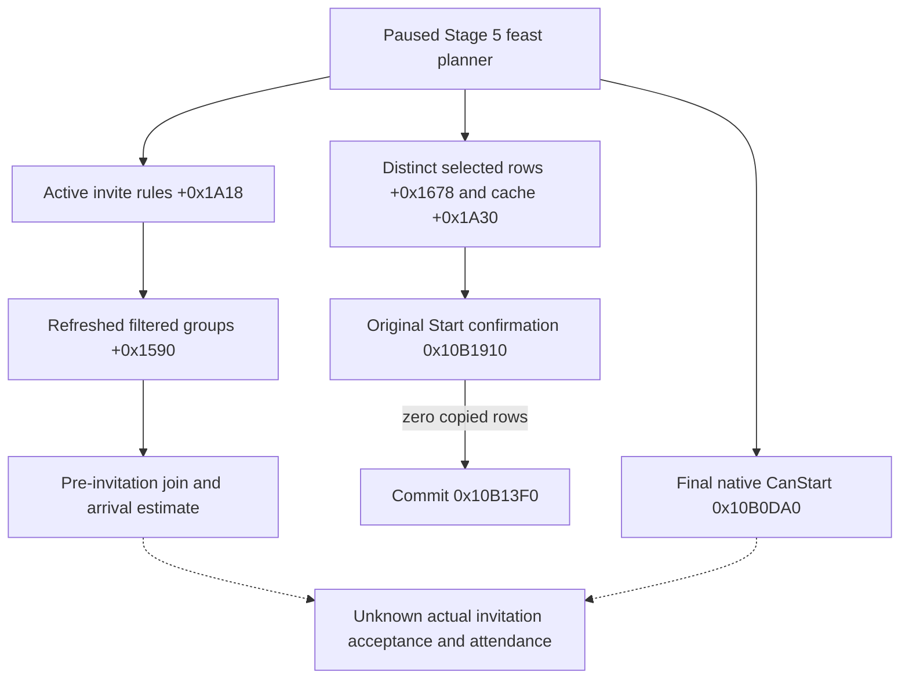

# Feast Stage 5 guest route proof: exact-build read-only boundary

Status: **private source-ready; paused proof not yet run; Start remains OFF**.
This source package adds a separate same-frame read, not a guest invitation,
accepted guest, or permission to host a feast.

## Original decision tree

Frozen CK3 `1.19.0.6-steam23530548`, `ck3.exe` SHA-256
`2D00FF3101EF70B566F2FCBAE292F09263199C80E9DC8F139B82D7D96F83DB86`.
The exact original `window_activity_guest_list.gui:101-115` exposes active
invite rules, and lines 568-580 display a positive join estimate and a
separate late-arrival warning. The planner's active 16-byte rule rows are at
`+0x1A18/+0x1A24`; refreshed native-filtered candidate groups are at
`+0x1590/+0x159C`. Selected 16-byte rows are a different collection at
`+0x1678/+0x1684`, with cached join bytes at `+0x1A30`.

The exact `0x10B1910` Start confirmation path copies selected rows only if
row `+8 != -1` and cache byte `+0x1A30[index] == 0`. At `0x10B1AD2`, a
**zero** copied-row count directly calls ordinary Commit `0x10B13F0`.
Thus R0368's observed `selected_nonhost_count=0` cannot be interpreted as
the original game's Start refusal. It also does not prove anyone will attend.
The script `feast.txt:52-61` requires `is_available_adult`, which expands
through `is_available_quick` to `in_army=no`; R0378's native final
`CanStart=false` and army-role failure display still block the H3928 Start.

`verify_activity_feast_guest_route_proof_1_19_0_6.py` pins the exact EXE
hash and bytes at the selected-row, zero-count branch, Commit, active-rule,
and group-view RVAs. Its checks support this source interpretation only.

## Private read contract

The default-OFF candidate build also recognizes
`query-activity-feast-stage5-guest-route-proof-v1-private`. The same paused
application-main executor reads the existing native-filtered candidate,
selected guest rows and final CanStart. It then repeats the candidate read
and requires identical source fingerprint, normal refresh sequence, actor,
date and paused frame across the three readers. No Start helper is called.

Schema `activity-feast-stage5-guest-route-proof-private-v1` reports:

| Field | Meaning |
| --- | --- |
| `status`, `candidate_status`, `selected_status`, `start_gate_status` | Independent availability; `observed` requires all three readers and repeat binding. |
| `snapshot_revision`, `date_raw`, `actor_character_id`, `normal_refresh_sequence`, `source_fingerprint` | Same paused identity and fingerprint of active rule bytes, selected row bytes and filtered group IDs. |
| `active_rule_count`, `filtered_group_count`, `selected_row_count` | Exact bounded current planner vector counts. Counts do not identify a specific authored rule. |
| `selected_nonhost_rows`, `positive_join_count`, `timely_positive_join_count` | Selected non-host CharacterIDs with original join and arrival predictions; not accepted guests. |
| `pre_invitation_candidate`, `candidate_selected_membership` | First positive timely native-filtered non-host candidate, if any. The candidate reader excludes already selected rows, so its selected membership is `false` when present. |
| `authored_rule_membership` | `null`: this query does not bind a candidate to a named rule. The separate passive provenance observer is needed for that claim. |
| `final_can_start` | Original final predicate on this frame, separate from guest value. |
| `native_guest_route_qualified` | Always `false` in this read-only schema. No prediction lifts the formal Start gate. |

All observational numbers are `null` when the combined read is unavailable.
The public MCP and existing Stage 5 Start-input schema are unchanged. A
later consumer can pair the new result with the value policy, but must first
obtain a fresh paused frame with `final_can_start=true`, identify a credible
guest route and apply current resource commitments. The original action
requires its own typed submit, independent postcondition, next turn and cold
restore. R0378/H3928 supplies no such action evidence.
