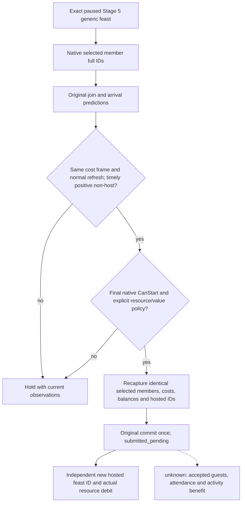

# Feast Stage-5 balance and typed Start core (CK3 1.19.0.6)

Source baseline: master `ad0646b72e441c853a4528a85e83540f417ecbae`.
Exact executable SHA-256:
`2D00FF3101EF70B566F2FCBAE292F09263199C80E9DC8F139B82D7D96F83DB86`.
This is source and focused native fixture evidence. It has not submitted Start
in CK3 and is default-off and unregistered.

The original Stage-5 route and `0x10B13F0` common accept branch are traced in
[the Start command tree](activity-stage5-feast-start-command-1.19.0.6.md).
The byte signature at that branch is
`48 89 5c 24 10 57 48 81 ec 10 0a 00 00`; the final evaluator at
`0x10B0DA0` starts `48 89 5c 24 10 48 89`. The private core checks these
at the admitted module base and calls the original branch with the planner
as its Windows x64 `this` argument only after the typed gates pass. A
returning branch is a **pending submission**, never a proven created feast.

The original actor storage used by the hosted identity reader resolves the
played full character ID through module `+0x570C130`, storage `+0x20/+0x2C`,
the 16-byte slot table and character `+0x18`. On that same actor, extension
pointer `+0x1A8` holds Gold at `+0x100` and Piety at `+0x110` in Q100000,
matching the existing exact-build `ck3_11906.cpp` resource reader. The new
read-only provider samples these leaves twice on a paused application-main
frame, checks the full ID and pointer round trip, and marks only Gold and
Piety as available. Treasury and barter goods stay unavailable because this
package has no qualified native getter for them.

The Start core requires a transport capture that binds stage 5, selected
`activity_feast`/`feast_type_generic`, the **normal** slot-12 refresh, four
named configured costs, final native CanStart, balances and existing hosted
activity IDs to one frame. It captures twice and rejects changes. It also
requires an affirmative value decision and resource reserves. Every native
positive cost needs an observed same-unit balance; a native zero cost needs
no balance. For ordinary feudal Robert this permits the Gold branch if the
four-cost native result actually confirms the other three costs are zero.
It does not infer zero cost from Robert's government or substitute unknown
Treasury/barter balances. A prior unresolved Start receipt rejects a repeat.

After a returning commit, the result remains `submitted_pending`. A separate
paused read compares the generation-bearing activity IDs and exact feast
type/host against the pre-submit set. On the same date, exact resource deltas
for every nonzero cost prove debit; a changed date or unmatched delta leaves
creation and debit as separate findings. A missing new ID leaves the command
pending. Next turn and cold restore remain separate acceptance steps.

Registration requires a real same-frame capture adapter for the already
separate four-cost, final CanStart, selected-option and hosted-identity
readers, plus a Stage-5 paused fixture. Treasury/barter positive-cost routes
also need exact native balance getters before their Start can pass. No public
query/action or formal autonomous consumer is enabled by this source package.

## Selected-member Start qualification (2026-09-30, source boundary)

On baseline `23b2e6535bde313d08c105bf5ba61ff042640a32`, the final evaluator,
original commit binder and independent hosted/resource post reader already
exist. The private transport leaves `guest_route_qualified=false` forever,
so even a positive native final gate and value decision cannot reach Start.
The narrow repair reuses the existing selected-member observer at planner
`+0x1678/+0x1684`; it does not select or invite an additional guest.

The original [guest route tree](activity-feast-stage5-guest-route-proof-1.19.0.6.md)
shows that `0x10B1910` examines selected rows and the join cache before
confirmation, then reaches `0x10B13F0`. Actual guest acceptance and arrival
are later outcomes, so they cannot serve as a prerequisite to submitting a
feast which has not yet been created. The counter-policy nevertheless
requires an observed selected non-host member with a positive original join
prediction and a timely original arrival prediction. The member read,
four-resource costs and final CanStart must share their paused frame and
normal slot-12 refresh sequence.

The Start core binds the selected members' full IDs, signed join results and
arrival fields across its two captures. The existing typed input schema,
payload and independent post schema remain unchanged. The qualification is
a selected-member prediction path; it does not qualify a global filtered
candidate or unnamed category membership, and it does not advertise an
accepted invitation. H3928's zero selected-member observation and native
`CanStart=false` from the army-role condition remain a hold. New paused
positive inputs, Start, debit, next turn and cold restore are still pending.

Source validation: the Start and selected-member observer CTests pass in
both Release and Debug (two tests per configuration). The actual private
transport translation unit also compiles in both configurations. Logs are
`D:\nw-activity-start-native-20260930\release-focused.log` and
`D:\nw-activity-start-native-20260930\debug-focused.log`; build/temp outputs
are in the same non-C task root. This package did not link or freeze a full
DLL and did not launch CK3.
