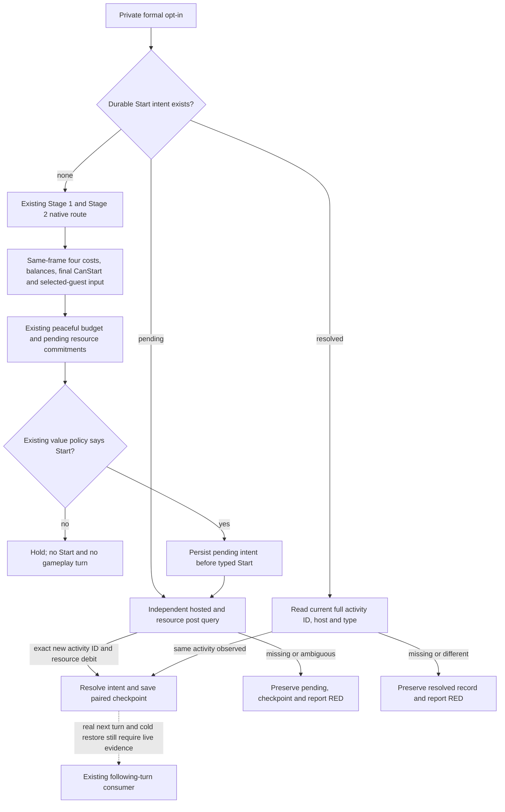

# Feast Stage 5 Start: private formal entry

Package: `NW-INSTITUTIONS-ACTIVITY-START-PY`, 2026-09-30. Status: source / no-launch fixture verification; no new CK3 Start evidence.

## Native input and existing implementation

Exact build remains CK3 `1.19.0.6-steam23530548`, EXE SHA-256
`2D00FF3101EF70B566F2FCBAE292F09263199C80E9DC8F139B82D7D96F83DB86`.
The research inputs are [guest selection and arrival](activity-stage5-feast-guest-candidate-1.19.0.6.md),
[Start core](activity-feast-stage5-start-core-1.19.0.6.md),
[private transport](activity-feast-stage5-start-private-transport-1.19.0.6.md), and
[normal command](activity-stage5-feast-start-command-1.19.0.6.md).
Final `CanStart` (`0x10B0DA0`), the typed Start/private mailbox transport, common
commit (`0x10B13F0`), value policy, durable consumer and following-turn hook
already existed. This package wires their previously missing formal opt-in entry.

Native package #741 (`cd89b3bb6762b46baefa51f9dbb5e0528dac3fbc` on master)
derives `native_guest_route_qualified` from actual selected non-host guests,
same-frame normal cost refresh, observed arrival and a positive timely join
prediction. It rechecks the selected identities, predictions, final legality,
costs and balances immediately before the original commit. This selected-guest
qualification is a prediction used by the decision; it does not prove actual
acceptance or eventual arrival. A filtered category candidate alone does not
qualify the route. INPUT/POST schema and typed request fields stay unchanged.

R0396 and the frozen H3928 candidate still have `CanStart=false` and no selected
non-host guest. The existing native failure display is consistent with the
played character's army commander/knight restriction. They remain hold; this
package neither changes that role nor changes the frozen candidate/DLL.

## Entry and consumption

| Layer | Explicit opt-in | Default |
| --- | --- | --- |
| Official operator | `--private-activity-feast-stage5-start-formal-trial` | OFF |
| Native runner CLI | `--allow-private-activity-feast-stage5-start-formal-trial` | OFF |
| Python runner argument | `allow_private_activity_feast_stage5_start_formal_trial` | `False` |
| Native compiled private flag | `XAR_CK3_ENABLE_G2_ACTIVITY_FEAST_STAGE5_START_PRIVATE_V1` | OFF |

The Python trial requires the existing bounded Stage 1 Confirm → queried native
Stage 2 destination → Stage 5 four-cost → Start-input assessment route. The
official operator bounds the trial to one turn. Read-only Start assessment
continues to hold without the formal opt-in, even when the policy finds a
positive opportunity.

Only the bounded paused lane submits. The existing budget observer reuses the
200-gold cash floor and reads active wars, pending native interactions and
existing spending ledgers. An unknown war cash reserve stays unknown and blocks
a positive-gold feast when a war is active; zero-cost resources do not need an
invented balance. No additional framework or arbitrary resource value is added.

The runner records a new Start attempt as gameplay, but increments visible
gameplay only after independent material poststate. ACK without a new matching
feast identity and exact configured debit remains RED. The resulting pending or
resolved ledger is saved with the game's checkpoint on the same paused actor
and date. A recovered ledger is consumed before opening another planner. A
resolved recovery reads the recorded activity's current full ID, host and type;
it does not infer that today's balance should equal the original debit balance.
Recovery queries add no new Start/gameplay turn. The existing following-turn
consumer requires a later actual game date and keeps its separate evidence.

## Verification and remaining evidence

Focused normal/optimized checks passed **45/45 in each mode**. Fixture coverage exercises default OFF, unqualified
selected guests, native `CanStart=false`, positive typed submission with
independent fee/activity poststate and checkpoint, ACK without an effect,
pending recovery without resubmission, and resolved identity recovery. Fixtures
also cover the adjacent activity and Sway routes. These are source/no-launch
checks; they are not paired CK3 cold recovery or production Start evidence.

A future candidate must combine the new Python entry with the matching new
private DLL and pass official pairing/no-launch checks. Actual Start acceptance,
independent poststate, next turn and new-PID paired recovery remain outstanding.
No public capability, advertisement, G2 milestone or H3928 readiness is raised
by these fixture results. PRV008, C3/C4/C5 and R0400 keep their frozen identity.
