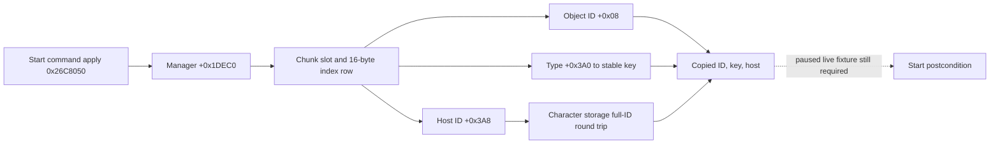

# Hosted activity identity readback (CK3 1.19.0.6)

This is a read-only exact-build tree for an independent feast Start
postcondition. Source is master `8ca18a2f281672a0a0aa1b9913a62cca9cbec691`.
The inspected `ck3.exe` SHA-256 is
`2D00FF3101EF70B566F2FCBAE292F09263199C80E9DC8F139B82D7D96F83DB86`.
No game was launched and no Start has been submitted for this work.

## Native identity and storage tree

The Start command's secondary dispatch `0x26C8050` takes the manager at
`*(module+0x570E068)->+0xA0+0x1DEC0` and calls `0x2700340`. The latter
allocates a `0x5F0` activity object. Manager `+0x20` points to an array of
`0x17C000`-byte chunks, with count at `+0x2C`; each chunk holds 1024
objects (`0x2704A60`, `0x2704B9A`). The manager's `+0x38` points to a
16-byte-per-slot index table; `+0x44` is its slot capacity, `+0x50` is the
highest live index (or `-1`), `+0x54` is the active count, and `+0x58` is the
free-list head. `0x2703AF0` traverses the full capacity to rebuild the free
list, whereas `0x2703E3E` checks a released object's low 24-bit index against
that capacity. A table row's `+0x08` is either null or the corresponding
activity pointer. `0x2700340` sets the row pointer and increments the active
count before applying the command payload.

The object `+0x08` stores a 32-bit ID: low 24 bits are the slot index and
high 8 bits are the slot generation. `0x270043E` increments the generation
when allocating a slot; `0x2703E70` compares the complete ID before release.
The object primary vtable is `module+0x42F2F28` from `0x218EE08`.
`0x218EE1F..0x218EE2D` copies the type pointer to object `+0x3A0` and the
host's full character ID to `+0x3A8`. The apply path at `0x2700541` resolves
that host ID through the character storage at `module+0x570C130`, slot
pointer `+0x20`, slot count `+0x2C`, 16-byte rows with object pointer at
row `+0x08`, and compares character object `+0x18` with the full host ID.
The type vtable `module+0x440E308` and stable key at type `+0x18` are already
used by the planner's native binder.

## Bounded reader and evidence boundary

On an application-main paused frame, the standalone reader first checks the
played character's full ID and character-storage round trip. It copies each
non-null index row from index zero through the highest live index, checks
that its object is the corresponding chunk slot, compares the object's full
ID with the row index, and counts all live rows against manager `+0x54`.
For objects hosted by the current actor it copies the type stable key, ID,
and host ID. It checks the index table and source frame again before returning.
The output contains no object or type pointers. Invalid/cross-frame reads
return unavailable rather than an empty set.

A pre-Start and later independent post-Start read can compare the copied
`(activity_id, type_key, host_id)` tuples. A new `activity_feast` ID with the
same host proves creation only when the command's pending receipt and resource
readback are bound to those frames. It does not prove debit, phase, next turn,
or cold restore. A fresh paused live fixture is still required to validate
the manager and object layouts before this reader is registered as a bridge
capability; the underlying pointers are never durable across turns or PIDs.

Reproduce the trace with `native_bridge/research/disasm_ck3.py` at RVAs
`0x26C8050` (`0x30`), `0x2700340` (`0x210`), `0x2703AF0` (`0x80`),
`0x2703E3E` (`0xD0`), `0x2704A60` (`0x180`), `0x218EDB0` (`0x90`), and
`0x2700541` (`0x50`) against the hashed executable.
