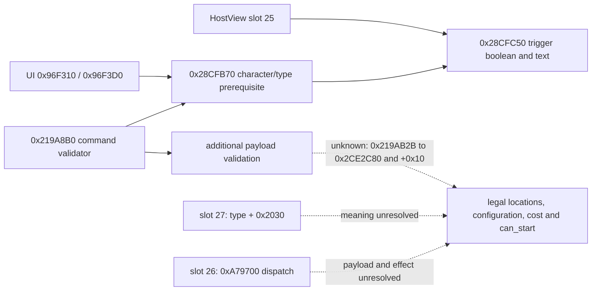
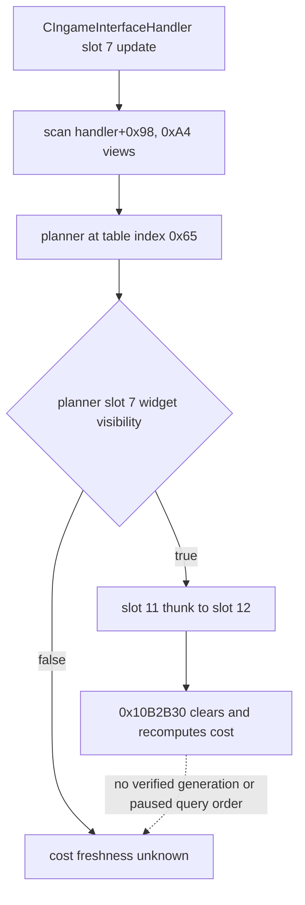
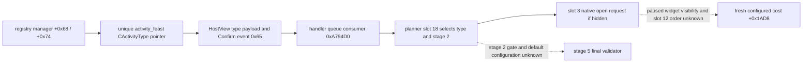

# Feast planner semantic seam: bounded native trace (CK3 1.19.0.6)

This is read-only research for the private `activity_feast` planner after the
C81 exact slot-25 callback. It does not establish a legal feast on the current
Robert save, a full semantic sample, a new query, or an activity action.

## Frozen evidence

- The inspected `ck3.exe` SHA-256 is
  `2D00FF3101EF70B566F2FCBAE292F09263199C80E9DC8F139B82D7D96F83DB86`
  (1.19.0.6; image base `0x140000000`).
- `CActivityListDetailHostView` primary vtable RVA `0x4166528` has slot 25 at
  `0x15051F0`, slot 26 at `0x1505230`, slot 27 at `0x1505330`, and slot 29 at
  `0x1505340`. These are image-relative function addresses, not live objects.
- Slot 27 merely returns `HostView+0x268` (`CActivityType*`) plus `0x2030`;
  slot 29 returns that type pointer plus `0x1F8`. The latter offset is the
  third trigger input of the slot-25 final evaluator. Neither getter evaluates
  a legal location, selected configuration, configured cost, or a final
  `can_start` result.
- Slot 26 reads the HostView's handler at `+0xD0`, calls `0xA79700` with value
  `0x65`, and eventually tail-calls a HostView virtual method at `+0x20`.
  Its effect and payload semantics are unresolved. It cannot be used as a
  read-only planner collector on this evidence.
- The final evaluator `0x28CFC50` calls trigger evaluator `0x33C9140` on
  `CActivityType+0x38`, then `+0x118` or `+0x2D8`, followed by `0x33C8FE0`
  on `+0x1F8`. It returns the final boolean and optional failure text through
  C81. The static trace does not assign the script-level `is_shown`,
  `can_start`, location or cost meaning to each native offset.
- The original character/type-only callers of `0x28CFB70` are `0x96F310`
  (`.pdata 0x96F310..0x96F3CF`, boolean wrapper) and `0x96F3D0`
  (`.pdata 0x96F3D0..0x96F4B7`, caller-owned 32-byte failure-text wrapper).
  Both build a tagged character target through `0x96A130`; neither supplies
  a selected location, options, intent, guests or an activity command payload.
  The former calls `0x28CFB70` at `0x96F33F` without failure text; the latter
  calls it at `0x96F42C` with the text output. These are prerequisites, not
  a complete start-eligibility result.
- `0x28CFB70` (`.pdata 0x28CFB70..0x28CFC47`) first calls another native
  check at `0x28CFBE7 -> 0x28CFA40`, then other flag checks and the known
  `0x28CFC50` evaluator at `0x28CFC1D`. The exact script-level meaning of
  `0x28CFA40` and of each native branch remains unresolved.
- The original `CStartActivityCommand` validator is primary slot 6
  `0x26C8070 -> 0x219A8B0`. It builds a tagged character target from the
  command's full character ID at `+0x08`, then calls the **same** `0x28CFB70`
  at `0x219AB02` with optional failure text. A false result branches to
  `0x219B861`, but a true result continues payload validation. In particular,
  `0x219AB2B -> 0x2CE2C80` consumes the activity type, command character ID
  and another resolved identity, and the return is compared against command
  `+0x10` at `0x219AB3A`. The meaning of this call and field is not proven.
  The validator also traverses a command list at `+0x4C8` in 32-byte steps
  before the prerequisite call; its elements remain opaque.

Reproduce the function trace with the repository's
`native_bridge/research/disasm_ck3.py` using RVAs `0x1505230` (size `0x110`),
`0x1505330` (size `0x20`), `0x1505340` (size `0x20`), `0x28CFC50`
(size `0x190`), `0x96F310` (size `0xC0`), `0x96F3D0` (size `0xE8`),
`0x28CFB70` (size `0xD8`) and the validator span
`0x219AAF0..0x219AB45` against the exact executable. The vtable slots are
eight-byte entries at `0x4166528 + 8 * slot`. The C106 trace only read the
frozen executable; it did not launch or attach to CK3.

## Decision boundary and next native address

The frozen `feast.txt` has player-facing visibility, adult/cooldown planning
gates, a single-location planner and configured resource cost. The current
Robert actor's cooldown, final native location/configuration and affordability
have not been observed. A static script gate or a positive slot-25 boolean
cannot fill the complete `read_semantics` callback required by the private
source adapter.



The next bounded reverse step is `0x219A8B0` after its prerequisite call:
resolve `0x219AB2B -> 0x2CE2C80`, the comparison with command `+0x10`,
and the sources and meanings of the remaining `0x508` payload fields. The
earlier `0x1505230 -> 0xA79700` and `CActivityType+0x2030` consumer remain
possible planner collection leads, but their semantics are unproved. Only a
verified native operation that yields copied legal locations, selected keys,
authoritative configured cost and final shown/can-start may be wired to
`read_semantics`. Calling `0x28CFB70` alone cannot supply those fields or
establish that a command would pass the remaining validator branches.
Then a paired paused Robert frame must test the current feast legality before
any consumer is enabled. No CK3 process was started or attached in this work.

## H3911 follow-up: payload and UI dispatch boundary

The frozen executable was rehashed as
`2D00FF3101EF70B566F2FCBAE292F09263199C80E9DC8F139B82D7D96F83DB86`.
This bounded trace narrows the missing semantic operation; it does not
identify a legal feast or provide a planning collector.

- At `0x219AB2B`, the validator passes the command's activity type, character
  ID, and resolved character object to `0x2CE2C80`. One branch of that callee
  uses `CActivityType+0xE98`; the other reads `CActivityType+0xEA0`. The
  result is compared with command `+0x10` at `0x219AB3A`; the global
  predicate at `0x28BCEB0` selects the branch. These addresses prove a
  further type/payload identity check after the prerequisite. They do not
  establish a province, selected option, configured cost, or `can_start`.
- If the comparison passes, `0x219ABCE` calls `0x2517900` with command
  `+0x10`, the command character ID, and the previously resolved object.
  That function begins with a virtual predicate on the supplied object and
  checks further fields. It is not a stand-alone location or affordability
  evaluator on this evidence.
- The AI path's `0x18E1160`, previously described as building command data,
  actually copies an already populated object into a destination: it copies
  the first `0x30` bytes, clones several owned containers, and handles the
  list at `+0x4C8`. It does not show how stable activity, location, options,
  invites, or costs were selected. The original producer of that source
  object remains the construction lead.
- In the caller, `0x18E0BB4` invokes `0x18DF5B0` with an output at stack
  `+0x188`; the path then calls `0x28CD3C0` at `0x18E0C3F` and `0x28CD8E0`
  at `0x18E0C61` while preparing an object at stack `+0x1020`. Immediately
  before the copy, `0x18E10BB` supplies a populated source pointer in `RDX`
  to `0x18E1160`. The writer and layout relationship among those objects is
  not yet decoded; this is a bounded provenance trail, not a field map.
- `0x18DF5B0` starts from AI manager/type inputs, builds 16-byte candidate
  rows, and reaches selection arithmetic before returning. `0x28CD3C0`
  writes into its caller-supplied object and expands a local pointer array;
  `0x28CD8E0` also writes through caller-supplied output and traverses type
  data at `+0xA88`/`+0x3E30`. Their caller-controlled output layouts and
  side effects are not proven safe for a player-facing paused read. Calling
  them to manufacture a supposedly authoritative default configuration
  would copy the AI route rather than observe the player's planner.
- HostView slot 26 at `0x1505230` calls `0xA79700` with event ID `0x65`.
  `0xA79700` routes through an event handler and can update a handler-owned
  list via `0xA95A40`; calling slot 26 as a supposedly read-only semantic
  collector would be unjustified.
- The primary HostView vtable starts at `0x4166528` and ends with slot 29
  (`0x1505340`); the following qword at slot position 30 is the secondary
  vtable's COL, immediately before the secondary vtable at `0x4166620`.
  Thus there is no unexamined primary slot after 29 that directly supplies
  the complete location/configuration/cost sample.

Reproduce the bounded spans with `native_bridge/research/disasm_ck3.py` at
`0x219A8B0` (size `0x280`), `0x219AB20` (size `0x100`), `0x2CE2C80`
(size `0x70`), `0x2517900` (size `0x200`), `0x28BCEB0` (size `0x60`),
`0x18E1160` (size `0x220`), `0x18E0B90` (size `0x140`), `0x18E1080`
(size `0x90`), `0x1505230` (size `0x100`), and `0xA79700`
(size `0x150`). All are RVAs against the exact executable above.

This AI provenance does not expose a safe player-side collector. The next
construction task is to locate a non-mutating planner getter for legal
locations, selected configuration, authoritative configured cost and final
`can_start`, then map its outputs to the validator's `+0x10` and `+0x4C8`
consumers. Only then can `read_semantics` safely copy a complete feast sample
in the private application-main glue. The H3911 driver contains no activity
snapshot, so it cannot establish current feast eligibility or cost. No CK3
process was started for this follow-up.

## Planner state getter lead (same exact build)

The original `game/gui/window_activity_planner.gui` is SHA-256
`ADB96B79A36E43F444410B85A80D0E393A2CC1B3D0D6380EA76EB2F515D382C7`.
Its start button at lines 1758-1767 binds
`ActivityPlanner.CanProgressPlanningStage` and
`GetCanProgressPlanningStageTooltip`; lines 1744-1746 and 1978-1990 bind
`ActivityPlanner.AccessCostBreakdown`. The button's `onclick` is
`ProgressPlanningStage`, an operation that must not be used for a read-only
capture. The GUI also reads `GetSelectedSpecialOption` and
`GetSelectedHostIntent`. A progress boolean may describe an intermediate
planning stage, so it cannot be renamed to final `can_start` without the
stage value and command validation.

The EXE embeds `source\\interface\\activity_planner_window.cpp` beside these
binding names. RTTI for `CActivityPlanner` is at type descriptor RVA
`0x52395F8`. Its object-offset-0 COL is `0x46A49B8`, primary vtable
`0x41205F0`; an object-offset-`0x10` COL is `0x46A4990`, secondary vtable
`0x41206C8`. This distinguishes the planning object from the already bound
`CActivityListDetailHostView` (`0x4166528`). The same EXE supplies a bounded
owner path: `CIngameInterfaceHandler` initializer `0xA734B0` calls `0xA90430`
at `0xA7519E`. `0xA90430` allocates `0x73A0` bytes, calls the planner
constructor `0x10AC080` at `0xA90459`, then publishes the returned pointer at
`handler+0x3C0` (`0xA90468`). The constructor writes `planner+0xD0 = handler`
at `0x10AC0F3`, allowing a fresh owner round-trip. The existing private
activity binder already resolves this handler from
`*(module+0x570F7B8) -> idler -> handler`; it currently reads the separate
HostView at `handler+0x3D8`. Thus a paused query can read `handler+0x3C0`
afresh and check the exact primary/secondary vtables and owner round-trip.
The published pointer is replaced and the old object destroyed in `0xA90430`,
so it cannot be cached between frames. This static constructor path does not
prove the planner is present, selected for `activity_feast`, or populated on
H3911's opening paused frame.

The exact GUI `AccessCostBreakdown` binding registers at `0x1590B9` /
`0x1590FE`; wrappers `0x10B57D0` / `0x10B57E0` reach the pure accessor
`0x10AB170`, which only returns `planner+0x1AD8`. The result is the address
of a planner-owned embedded cost object, not a copied cost value. The next
same-shape object begins at `planner+0x23E8` (`0x910` stride). Constructor
`0x10AC352` initializes the first object; it does not price a selected feast.
Any future query must copy values while its freshly checked planner/frame is
held and must establish that the object was refreshed.

`CActivityPlanner` vtable slot 12 (`0x10AE180`) calls `0x10B2B30`, which
clears `+0x1AD8` via `0x10AAFD0` and recomputes through `0x10B6A60`,
`0x10CC1E0`, and `0x3DDB850`. This is a write path, not an observer. A bounded
trace of `0x10B2B30..0x10B2EFC` found no planner generation, valid or timestamp
write after the recomputation. The `0xA90430` creation path invokes vtable
slot 7 and conditionally slot 4, not slot 12; thus it does not prove that
the cost object is fresh before the planner window opens. Empty cost data
cannot be interpreted as zero cost.

The `CanProgressPlanningStage` boolean wrapper `0x10B4D20` calls evaluator
`0x10B0DA0` (optional native string output). This branches on
`planner+0x1AB0` stages 0..5. Only stage 5 constructs a temporary
`CStartActivityCommand` and calls its slot 6 validator; other stages decide
whether the current planning stage may advance. The constructor sets stage
to `2`, so `CanProgressPlanningStage=true` at that stage is not final
`can_start`. Neither the current snapshot schema nor the constructor path
proves a selected feast, complete configuration, authoritative costs or
player-stage final eligibility on H3911's paused frame.

## Proven handler-update caller of planner slot 12

The handler's primary vtable slot 7 points to update function `0xA75C40`.
Within it, `0xA76ABC` sets `rdi = handler+0x98`, and
`0xA76AD8..0xA76B9D` iterates `0xA4` pointer slots. The planner publication
at `handler+0x3C0` is table index `(0x3C0-0x98)/8 = 0x65`, so this path
includes it. For each non-null view, `0xA76B55` calls primary vtable slot 7.
Only on true does `0xA76B65` invoke slot 11; the `CActivityPlanner` slot 11
target `0xAA33F0` tail-jumps through slot 12 (`[vtable+0x60]`) to
`0x10AE180`, which calls the cost recomputation `0x10B2B30` at `0x10AE1AA`.
The planner slot 7 implementation is shared `0x1F30970`, which returns false
when `planner+0x78` has no attached widget and otherwise tests the widget's
visibility state. This is an actual runtime caller, conditional on the
planner widget visibility gate. It does not establish that the H3911 paused
frame has an attached/visible planner widget, a selected feast, or a complete
configuration. The creation path invokes slot 7 and conditionally slot 4,
but not slot 11/12.



No read-only freshness/authoritative marker has been identified in the
recomputed `+0x1AD8` container or surrounding planner fields. A caller can
read a fresh planner pointer, attached-widget presence, stage and selected
type/configuration without changing state, but those fields alone do not
prove that slot 12 completed before the paused query or that its output is a
final configured feast cost. They are a narrow private diagnostic readout,
not a complete semantic collector or `can_start` answer. The next executable
diagnostic is an official paused-frame capture of those fields with the
planner window closed, followed by a separately bounded visible-window
capture or a proven independent native cost evaluator. Any visual step must
follow the current CK3 owner and minimize the window afterward. If the
selected configuration or cost validity cannot be established,
`configured_cost` and `can_start` remain typed unknown. No activity action or
private semantic callback is eligible on this evidence alone; absent planner
context must be reported as absent, not synthesized from `feast.txt` or the
AI activity path.

## 2026-09-29 paused-query wiring decision

This check used master `38085f9bb6d7494dcac951373cc9df2e4157a486` and
rehashed the local `ck3.exe` to the frozen SHA-256 above. It did not start CK3,
read a save, or obtain a paused-frame activity result. The bounded static
reproduction is:

```text
py native_bridge/research/disasm_ck3.py 0x10AB170 --size 0x20 --exe "<exact ck3.exe>"
py native_bridge/research/disasm_ck3.py 0x10B2B30 --size 0x230 --exe "<exact ck3.exe>"
py native_bridge/research/disasm_ck3.py 0x10B0DA0 --size 0x420 --exe "<exact ck3.exe>"
```

Run these from `ck3_autonomous_player/`. At `0x10AB170`, the reflected
`AccessCostBreakdown` getter only returns `planner+0x1AD8`. The update at
`0x10B2B52..0x10B2B60` first clears that object; it then reads planner
fields at `+0x1530` and `+0x1538`, and later walks selected rows at
`+0x1578`/`+0x1584` before accumulating costs. Those reads show that the
cost is configuration-dependent, not a constant obtainable from
`activity_feast` alone. The actual caller is the handler update described
above, gated by the planner widget being visible. At `0x10B0DC3`, the
`CanProgressPlanningStage` evaluator reads `planner+0x1AB0`; only its stage-5
branch builds and validates `CStartActivityCommand`. The constructor starts
at stage 2. A true earlier-stage result cannot be labeled final `can_start`.

The available exact-build path supports a **private diagnostic** read of a
freshly resolved planner pointer, owner round trip, attached widget,
visibility, stage, and selected type/configuration. It does **not** yet
support the requested same-frame `native_authoritative_configured_cost` plus
final `can_start` sample on an unopened paused frame. Wiring the existing
Activity5 semantic callback or a runner now would either publish stale/empty
costs or invent final legality, so this package leaves both unwired. An empty
`+0x1AD8` container is `unknown`, never zero.

The smallest executable next step is a default-off paused diagnostic for
`handler+0x3C0`, validating both planner vtables, `planner+0xD0 == handler`,
widget attachment/visibility, `+0x1AB0` stage and the current activity key.
It can run against the existing paired Robert save without an action or date
advance. If the window is closed and the widget is absent/invisible, the
next source task is to identify a separate native evaluator that prices a
fully copied feast configuration without mutating the live planner. If the
widget is visible, a separately bounded capture must prove that slot 12
completed before reading the embedded cost and that stage 5 final validation
uses that same configuration. The current instance owner must coordinate any
brief visible-window step and minimize afterward. A complete copied semantic
sample is still required before a private bridge or formal activity action.

## Private paused planner metadata diagnostic

`activity_planner_diag_v1` implements that narrow next read, behind
`XAR_CK3_ENABLE_G2_ACTIVITY_PLANNER_DIAG_PRIVATE_QUERY_V1=OFF` by default.
The exact-build ABI verifier checks the frozen EXE hash, planner owner/widget/
stage instruction bytes and primary/secondary vtable slots. The private
application-main mailbox uses slot 57 only after a matching paused actor/date
snapshot; the native reader takes two complete metadata samples and reads the
frame again before copying a pointer-free result. The bounded operator flag
is `--private-activity-planner-diag-query`.

The result distinguishes planner absent from planner present, reports native
widget attachment/slot-7 visibility and stage 0–5, and optionally copies the
**HostView current activity-type key** with that source named explicitly. It
does not claim that this HostView key is the planner's selected type. There is
no configured-cost value, final `can_start`, activity action, public query or
advertised capability; both decision fields remain typed `unknown`. A closed
widget with an empty cost container remains unknown. Static ABI and no-launch
tests establish only source/build readiness; a paired paused CK3 capture is
still required to learn which diagnostic state Robert actually presents.

## 2026-09-29 original feast planner entry trace

This bounded read used the same frozen 1.19.0.6 executable and SHA-256 stated
above, plus original `game/gui/window_activity_list.gui` lines 410–418 and
849–860. No CK3 process, save or input was used. The list entry opens
`activity_list_detail_host_window` with its `ActivityType` data. That window's
Confirm button calls `ActivityListDetailHostView.Confirm`.

- `CActivityListDetailHostView` primary slot 26 at RVA `0x1505230` obtains
  `HostView+0x268` (`CActivityType*`), wraps it in a native event payload, and
  calls `0xA79700(handler, 0x65, payload)`. The function then closes the
  HostView. `0xA79700` inserts an event into the handler-owned queue using
  `0xA95A40`; it is an effectful operation, not a semantic getter.
- `handler+0x3C0` contains the `CActivityPlanner` registered as handler table
  index `0x65`. Its primary vtable slot 18 at RVA `0x10AE120` receives a
  payload, calls `0x10AE040` to resolve a `CActivityType*`, then calls
  `0x10AD7C0(planner, type)`. The latter copies the type's initial planner
  data to `planner+0x1530`, sets stage `planner+0x1AB0 = 2` at `0x10AD929`,
  and proceeds with more initialization. Slot 18 then calls `0x10CCF90`.
  Slot 19 at `0x10AE150` resolves the same payload type and compares it with
  `planner+0x1530`, consistent with the event's selected-type identity.
- The handler's queue consumer at `0xA794D0` pops a 0x30-byte event from
  `handler+0x5D0`/`+0x5DC`, resolves its event ID to the corresponding handler
  table object via `0xA942C0`, calls that object's virtual slot 21
  (`+0xA8`) to test the payload, and on success calls virtual slot 18
  (`+0x90`) at `0xA795D2`. Planner slot 21 resolves to the constant-true
  `0x7E9220`, and slot 18 is `0x10AE120` for event `0x65`; slot 19 is a
  separate selected-type comparison, not this queue gate. The queue consumer is
  reached from `0xA23B32`, and `0xA79200` handles the relevant widget state.
  This closes the event delivery shape; live timing and resulting planner
  visibility remain unobserved.
- The separate HostView at `handler+0x3D8` is handler table index `0x68`.
  Its primary slot 18 is `0x15050E0`: it calls `0x1506E70` on an incoming
  payload and writes the resulting type pointer to `HostView+0x268` at
  `0x15050F1`. Slot 19 at `0x1505100` compares an incoming payload type with
  that field. This is the original route by which a type-bearing view event
  selects the detail HostView; it does not identify a stable-key lookup or
  prove that an unopened paused frame already has `activity_feast` selected.
- The original planner GUI binds `ActivityPlanner.ProgressPlanningStage` to
  stage buttons and `CanProgressPlanningStage` to the enabled state at lines
  1762–1767 and 1987–1991. The native evaluator `0x10B0DA0` treats
  stage 5 specially: it constructs a temporary `CStartActivityCommand` and
  invokes the final command validator. A stage-2 positive result is only an
  earlier planning gate. The planner's cost container at `+0x1AD8` is still
  refreshed by visible-widget slot 12, with no independent validity marker.
- The GUI's `ProgressPlanningStage` registration at `0x1574B3..0x157546`
  supplies wrapper `0x10B4CE0`, which calls `0x10B1330`. Its jump table at
  `0x10B13D8` sends stage 2 to `0x10B13B3`, setting stage 5 through
  `0x10B1BD0`; its stage-5 branch goes to `0x10B1910`, which initiates the
  start path. A bounded planner-preparation operation could call it at stage
  2 only after the original `CanProgressPlanningStage` gate and then stop at
  stage 5. It must never call the same method at stage 5 merely to observe
  the final validator. Whether the selected feast defaults pass the stage-2
  gate is unobserved.
- A direct-call cross-reference scan of `0x10B2B30` found only
  `0x10AE1AA`, inside planner slot 12. `SetActivityType` does not itself call
  that cost update. Thus a newly initialized stage-5 planner has no proven
  fresh configured cost until the visible-widget update has occurred.

```mermaid
flowchart LR
    A[Activity list type] --> B[HostView Confirm: 0x1505230]
    A -. detail view event 0x68 requires native type payload .-> H[HostView slot 18: 0x15050E0]
    H --> B
    B --> P[typed 8-byte type payload: 0xCAF920 / 0x80DCB0]
    P --> C[handler event 0x65: 0xA79700]
    C --> Q[queue consumer: 0xA794D0]
    Q --> D[planner slot 21 then 18: 0x7E9220 / 0x10AE120]
    D --> E[SetActivityType: 0x10AD7C0, stage 2]
    E -. stage 2 gate and one transition require paused proof .-> F[stage 5 command validator]
    E -. visible refresh unproved .-> G[configured cost at +0x1AD8]
```



The next bounded proof is a stable-key-to-`CActivityType*` original lookup,
native payload construction for the detail view, and actual planner widget
visibility after event `0x65`. A private action
cannot claim an opened/configured feast or use stage-2 `true` as `can_start`
until those branches and a paired paused readback are established.

## 2026-09-29 type-payload continuation

On the same exact EXE, `0x1505230` obtains the native descriptor from
`0xCAF920`. That descriptor is the static object at `0x4FE3DB0` with vtable
`0x40DB298`. Its slots `+0x58` and `+0x60` both point to `0x80DCB0`, which
copies one 8-byte value from `HostView+0x268` into the stack variant's data
field. `0xA79700` then copies the descriptor and data into its queued event;
the receiver at `0x10AE040` resolves the type through the descriptor's
runtime type check. This closes the **type-bearing event payload shape** for
the original HostView Confirm path. It does not supply an independent
`activity_feast` type lookup or authorize a synthetic queue submission.

The four `GetActivityType` registration references at `0xD9802`, `0x154C42`,
`0x25B722`, and `0x25D0F2` bind object getters; their callbacks read fields
from an existing object. None proves a stable-key registry lookup. The next
bounded source is the normal `ActivityListWindow.GetActivityGroupItems` ->
`ActivityGroupItem.GetActivities` -> `ActivityItem.GetType` collection, whose
GUI binding is in `game/gui/window_activity_list.gui` lines 162 and 807-860.
An operation would have to enumerate fresh type pointers, verify the exact
vtable and copied `+0x18` key, and retain no pointer across a frame. It would
also need a paired paused observation that event `0x65` makes the planner
widget visible and its slot-12 cost update runs before `+0x1AD8` is read.
Those conditions remain dashed `unknown`; no CK3 process or save was used in
this continuation.

## 2026-09-29 registry and queue-delivery continuation

This continuation supersedes the **lookup and delivery** unknowns immediately
above. It uses the same exact 1.19.0.6 EXE/SHA-256 and original
`game/gui/window_activity_list.gui` lines 162 and 807-860. It is static
evidence only: no CK3 process, paused save, or planner action was used.

- `CActivityListWindow.GetActivityGroupItems` is registered at `0x258AE0`;
  wrapper `0x1506380` calls `0xB75420`, which returns the window's `+0xF8`
  collection. `ActivityGroupItem.GetActivities` is registered at `0x258600`;
  wrapper `0x15062E0` returns the group item's `+0x08` collection.
  `ActivityItem.GetType` is registered in the same GUI binding cluster at
  `0x258187`; callback `0x7F7EB0` returns `[item+0x08]`, and wrapper
  `0x1506240` uses the `0xCAF920` type descriptor. The list's slot 12
  (`0x1504410`) rebuilds its row collection, so row addresses are transient.
- The same slot 12 obtains the **underlying activity-type registry** at
  `0x15046C3 -> 0x88E140`. The latter reads manager global RVA
  `0x570BE98`; `0x15046C8/CC` read its 8-byte `CActivityType*` array at
  `manager+0x68` and count at `manager+0x74`. The loop at `0x15046F0`
  reads each type before applying original visibility/eligibility inputs.
  An operation can enumerate the registry without retaining a GUI row:
  require a present manager, bounded/readable array, exact type vtable
  `0x440E308`, copied stable key at `type+0x18`, and **exactly one**
  `activity_feast` match. Reacquire and validate the pointer in each paused
  operation; the static trace does not prove its lifetime across reloads or
  frames.
- The handler queue consumer at `0xA794D0` takes the accepted event through
  `0xA795A8 -> 0xA79200`, invokes the recipient's slot 18 at `0xA795D2`,
  then tests its slot 7 visibility and invokes slot 3 at `0xA795E5..EB`
  when hidden. For event `0x65`, the recipient is the planner at
  `handler+0x3C0`: slot 18 `0x10AE120` selects the type and initializes
  stage 2; slot 3 `0x10ACCB0` runs its native open path. This proves that
  original event delivery **requests** the planner to open without a
  coordinate click. It does not prove that a particular paused frame has an
  attached, visible widget after delivery.



The remaining executable proof is a correctly paired paused frame: verify
the event makes the planner widget visible, the normal handler update runs
slot 12 **after** selecting/configuring this type and **before** reading
`+0x1AD8`, then establish that the stage-2 gate permits one transition to
stage 5 and read the final `0x10B0DA0` validator there. No generation or
validity marker for the cost container has been found. Calling effectful
slot 12 directly is not a substitute for proving the normal update order;
calling `ProgressPlanningStage` at stage 5 starts an activity. Until those
observations, configured cost and final `can_start` remain typed `unknown`,
and this registry/dispatch trace is a prerequisite, not an activity action.
