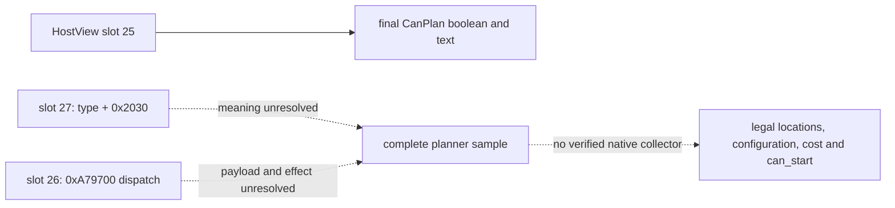

# Feast planner semantic seam: bounded native trace (CK3 1.19.0.6)

This is read-only research for the private `activity_feast` planner after the
C81 exact slot-25 callback. It does not establish a legal feast on the current
Robert save, a full semantic sample, a new query, or an activity action.

## Frozen evidence

- The inspected `ck3.exe` SHA-256 is
  `2D00FF3101EF70B566F2FCBAE292F09263199C80E9DC8F139B82D7D96F83DB86`
  (1.19.0.6; image base `0x140000000`).
- `CActivityListDetailHostView` primary vtable RVA `0x4166528` has slot 25 at
  `0x15051F0`, slot 26 at `0x1505230`, slot 27 at `0x1505330`, and slot 29 at
  `0x1505340`. These are image-relative function addresses, not live objects.
- Slot 27 merely returns `HostView+0x268` (`CActivityType*`) plus `0x2030`;
  slot 29 returns that type pointer plus `0x1F8`. The latter offset is the
  third trigger input of the slot-25 final evaluator. Neither getter evaluates
  a legal location, selected configuration, configured cost, or a final
  `can_start` result.
- Slot 26 reads the HostView's handler at `+0xD0`, calls `0xA79700` with value
  `0x65`, and eventually tail-calls a HostView virtual method at `+0x20`.
  Its effect and payload semantics are unresolved. It cannot be used as a
  read-only planner collector on this evidence.
- The final evaluator `0x28CFC50` calls trigger evaluator `0x33C9140` on
  `CActivityType+0x38`, then `+0x118` or `+0x2D8`, followed by `0x33C8FE0`
  on `+0x1F8`. It returns the final boolean and optional failure text through
  C81. The static trace does not assign the script-level `is_shown`,
  `can_start`, location or cost meaning to each native offset.

Reproduce the function trace with the repository's
`native_bridge/research/disasm_ck3.py` using RVAs `0x1505230` (size `0x110`),
`0x1505330` (size `0x20`), `0x1505340` (size `0x20`), and `0x28CFC50`
(size `0x190`) against the exact executable. The vtable slots are eight-byte
entries at `0x4166528 + 8 * slot`.

## Decision boundary and next native address

The frozen `feast.txt` has player-facing visibility, adult/cooldown planning
gates, a single-location planner and configured resource cost. The current
Robert actor's cooldown, final native location/configuration and affordability
have not been observed. A static script gate or a positive slot-25 boolean
cannot fill the complete `read_semantics` callback required by the private
source adapter.

The next bounded reverse step is to trace `0x1505230 -> 0xA79700` and its
downstream virtual call to establish whether it actually exposes a read-only
planner collection. Separately, consumers of the `0x1505330` pointer must
identify what `CActivityType+0x2030` represents. Only a verified native
operation that yields copied legal locations, selected keys, authoritative
configured cost and final shown/can-start may be wired to `read_semantics`.
Then a paired paused Robert frame must test the current feast legality before
any consumer is enabled. No CK3 process was started or attached in this work.
