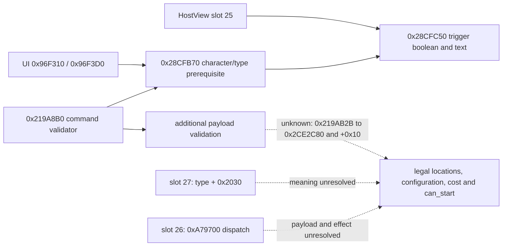

# Feast planner semantic seam: bounded native trace (CK3 1.19.0.6)

This is read-only research for the private `activity_feast` planner after the
C81 exact slot-25 callback. It does not establish a legal feast on the current
Robert save, a full semantic sample, a new query, or an activity action.

## Frozen evidence

- The inspected `ck3.exe` SHA-256 is
  `2D00FF3101EF70B566F2FCBAE292F09263199C80E9DC8F139B82D7D96F83DB86`
  (1.19.0.6; image base `0x140000000`).
- `CActivityListDetailHostView` primary vtable RVA `0x4166528` has slot 25 at
  `0x15051F0`, slot 26 at `0x1505230`, slot 27 at `0x1505330`, and slot 29 at
  `0x1505340`. These are image-relative function addresses, not live objects.
- Slot 27 merely returns `HostView+0x268` (`CActivityType*`) plus `0x2030`;
  slot 29 returns that type pointer plus `0x1F8`. The latter offset is the
  third trigger input of the slot-25 final evaluator. Neither getter evaluates
  a legal location, selected configuration, configured cost, or a final
  `can_start` result.
- Slot 26 reads the HostView's handler at `+0xD0`, calls `0xA79700` with value
  `0x65`, and eventually tail-calls a HostView virtual method at `+0x20`.
  Its effect and payload semantics are unresolved. It cannot be used as a
  read-only planner collector on this evidence.
- The final evaluator `0x28CFC50` calls trigger evaluator `0x33C9140` on
  `CActivityType+0x38`, then `+0x118` or `+0x2D8`, followed by `0x33C8FE0`
  on `+0x1F8`. It returns the final boolean and optional failure text through
  C81. The static trace does not assign the script-level `is_shown`,
  `can_start`, location or cost meaning to each native offset.
- The original character/type-only callers of `0x28CFB70` are `0x96F310`
  (`.pdata 0x96F310..0x96F3CF`, boolean wrapper) and `0x96F3D0`
  (`.pdata 0x96F3D0..0x96F4B7`, caller-owned 32-byte failure-text wrapper).
  Both build a tagged character target through `0x96A130`; neither supplies
  a selected location, options, intent, guests or an activity command payload.
  The former calls `0x28CFB70` at `0x96F33F` without failure text; the latter
  calls it at `0x96F42C` with the text output. These are prerequisites, not
  a complete start-eligibility result.
- `0x28CFB70` (`.pdata 0x28CFB70..0x28CFC47`) first calls another native
  check at `0x28CFBE7 -> 0x28CFA40`, then other flag checks and the known
  `0x28CFC50` evaluator at `0x28CFC1D`. The exact script-level meaning of
  `0x28CFA40` and of each native branch remains unresolved.
- The original `CStartActivityCommand` validator is primary slot 6
  `0x26C8070 -> 0x219A8B0`. It builds a tagged character target from the
  command's full character ID at `+0x08`, then calls the **same** `0x28CFB70`
  at `0x219AB02` with optional failure text. A false result branches to
  `0x219B861`, but a true result continues payload validation. In particular,
  `0x219AB2B -> 0x2CE2C80` consumes the activity type, command character ID
  and another resolved identity, and the return is compared against command
  `+0x10` at `0x219AB3A`. The meaning of this call and field is not proven.
  The validator also traverses a command list at `+0x4C8` in 32-byte steps
  before the prerequisite call; its elements remain opaque.

Reproduce the function trace with the repository's
`native_bridge/research/disasm_ck3.py` using RVAs `0x1505230` (size `0x110`),
`0x1505330` (size `0x20`), `0x1505340` (size `0x20`), `0x28CFC50`
(size `0x190`), `0x96F310` (size `0xC0`), `0x96F3D0` (size `0xE8`),
`0x28CFB70` (size `0xD8`) and the validator span
`0x219AAF0..0x219AB45` against the exact executable. The vtable slots are
eight-byte entries at `0x4166528 + 8 * slot`. The C106 trace only read the
frozen executable; it did not launch or attach to CK3.

## Decision boundary and next native address

The frozen `feast.txt` has player-facing visibility, adult/cooldown planning
gates, a single-location planner and configured resource cost. The current
Robert actor's cooldown, final native location/configuration and affordability
have not been observed. A static script gate or a positive slot-25 boolean
cannot fill the complete `read_semantics` callback required by the private
source adapter.

The next bounded reverse step is `0x219A8B0` after its prerequisite call:
resolve `0x219AB2B -> 0x2CE2C80`, the comparison with command `+0x10`,
and the sources and meanings of the remaining `0x508` payload fields. The
earlier `0x1505230 -> 0xA79700` and `CActivityType+0x2030` consumer remain
possible planner collection leads, but their semantics are unproved. Only a
verified native operation that yields copied legal locations, selected keys,
authoritative configured cost and final shown/can-start may be wired to
`read_semantics`. Calling `0x28CFB70` alone cannot supply those fields or
establish that a command would pass the remaining validator branches.
Then a paired paused Robert frame must test the current feast legality before
any consumer is enabled. No CK3 process was started or attached in this work.

## H3911 follow-up: payload and UI dispatch boundary

The frozen executable was rehashed as
`2D00FF3101EF70B566F2FCBAE292F09263199C80E9DC8F139B82D7D96F83DB86`.
This bounded trace narrows the missing semantic operation; it does not
identify a legal feast or provide a planning collector.

- At `0x219AB2B`, the validator passes the command's activity type, character
  ID, and resolved character object to `0x2CE2C80`. One branch of that callee
  uses `CActivityType+0xE98`; the other reads `CActivityType+0xEA0`. The
  result is compared with command `+0x10` at `0x219AB3A`; the global
  predicate at `0x28BCEB0` selects the branch. These addresses prove a
  further type/payload identity check after the prerequisite. They do not
  establish a province, selected option, configured cost, or `can_start`.
- If the comparison passes, `0x219ABCE` calls `0x2517900` with command
  `+0x10`, the command character ID, and the previously resolved object.
  That function begins with a virtual predicate on the supplied object and
  checks further fields. It is not a stand-alone location or affordability
  evaluator on this evidence.
- The AI path's `0x18E1160`, previously described as building command data,
  actually copies an already populated object into a destination: it copies
  the first `0x30` bytes, clones several owned containers, and handles the
  list at `+0x4C8`. It does not show how stable activity, location, options,
  invites, or costs were selected. The original producer of that source
  object remains the construction lead.
- In the caller, `0x18E0BB4` invokes `0x18DF5B0` with an output at stack
  `+0x188`; the path then calls `0x28CD3C0` at `0x18E0C3F` and `0x28CD8E0`
  at `0x18E0C61` while preparing an object at stack `+0x1020`. Immediately
  before the copy, `0x18E10BB` supplies a populated source pointer in `RDX`
  to `0x18E1160`. The writer and layout relationship among those objects is
  not yet decoded; this is a bounded provenance trail, not a field map.
- HostView slot 26 at `0x1505230` calls `0xA79700` with event ID `0x65`.
  `0xA79700` routes through an event handler and can update a handler-owned
  list via `0xA95A40`; calling slot 26 as a supposedly read-only semantic
  collector would be unjustified.

Reproduce the bounded spans with `native_bridge/research/disasm_ck3.py` at
`0x219A8B0` (size `0x280`), `0x219AB20` (size `0x100`), `0x2CE2C80`
(size `0x70`), `0x2517900` (size `0x200`), `0x28BCEB0` (size `0x60`),
`0x18E1160` (size `0x220`), `0x18E0B90` (size `0x140`), `0x18E1080`
(size `0x90`), `0x1505230` (size `0x100`), and `0xA79700`
(size `0x150`). All are RVAs against the exact executable above.

The first executable construction task is to follow the normal planner's
`0x18DF5B0 -> 0x28CD3C0/0x28CD8E0 -> 0x18E1160` provenance,
identify the source object copied by `0x18E1160`, and map its stable
location/configuration fields to the validator's `+0x10` and `+0x4C8`
consumers. In the same trace, identify the authoritative configured cost
evaluator and final `can_start` result, including input ownership and
non-mutating lifetime. Only then can `read_semantics` safely copy a complete
feast sample in the private application-main glue. The H3911 driver contains
no activity snapshot, so it cannot establish current feast eligibility or
cost. No CK3 process was started for this follow-up.
