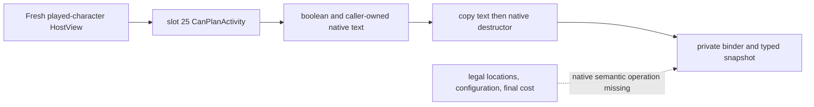

# Private feast CanPlanActivity callback (CK3 1.19.0.6)

This is a static, read-only continuation of the `activity_feast` planner. It
provides the native final-evaluator operation accepted by the existing private
application-main glue. It does not provide the semantic location/configuration
collector, a live paused capture, an activity action, or a public query.

## Exact native source

- `ck3.exe` SHA-256, checked on this machine:
  `2D00FF3101EF70B566F2FCBAE292F09263199C80E9DC8F139B82D7D96F83DB86`.
- `CActivityListDetailHostView` primary vtable slot 25 is RVA `0x15051F0`.
  At `0x15051F4` it reads `HostView+0x268` (`CActivityType*`). Its regular path
  forwards caller `RDX` through stack argument five to final evaluator
  `0x28CFC50`; the result returns in `AL`. The early `+0x3FC3` activity-type
  path returns true directly.
- Native wrapper `0x96F4C0` initializes the caller's 32-byte MSVC string with
  size zero and inline capacity 15 before passing it as that fifth argument.
  Native destructor `0x7E97D0` frees heap-backed text with the game's
  allocator and resets the string.

Reproduce the bounded disassembly with
`native_bridge/research/disasm_ck3.py` at RVAs `0x15051F0` (`0x40` bytes),
`0x96F4C0` (`0x80` bytes), and `0x7E97D0` (`0x60` bytes), using the frozen EXE.
The call-chain details and false-path text origin remain in
`activity-planning-failure-display-abi-1.19.0.6.md`.

## Private operation

`InvokeActivityPlanningNativeCanPlanExactV1` accepts only the exact slot-25
address and `activity_feast` request. It initializes the native output string,
calls the final evaluator with the freshly resolved HostView, copies optional
display bytes into a fixed pointer-free result, and invokes the exact game's
string destructor before returning. It leaves the stable failure key absent;
the C70 binder/source adapter emits
`failure_display_key=unknown/native_stable_key_unresolved` when a false result
has nonempty text. Empty false-path text remains unavailable in the binder.
The operation takes no action and cannot be called by the default-off bridge:
an activity-owned caller must explicitly supply it to the existing glue and
must also supply the separate full semantic operation.

## Acceptance and next binding

The private application-glue fixture now exercises the operation through its
scoped callback with native-shaped inline and heap strings. MSVC normal
`/Od /RTC1 /W4 /WX` and optimized `/O2 /DNDEBUG /W4 /WX` runs pass for true,
false with short/long text, and empty false text retained as RED. The fixture
uses a fake native callee/destructor and does not prove a current save's feast
legality or execute the real EXE function.

The first unresolved runtime question is whether a fresh `activity_feast`
HostView and full planning configuration can be obtained on the formal Robert
paused frame. The exact remaining implementation is the native semantic
operation for legal locations, selected options/intents/invite rule, configured
cost, final shown/can-start and cooldown, followed by the private
application-main invocation. A normal paused capture must answer actual feast
legality before any consumer may plan or start one. No CK3 instance was
launched for this package.
