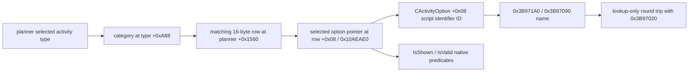
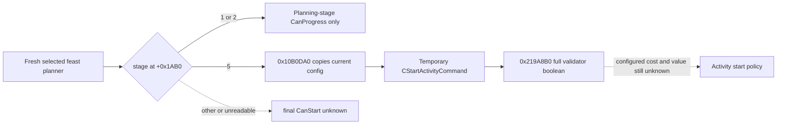

# Stage 1 activity option identity (CK3 1.19.0.6)

Exact `ck3.exe` SHA-256:
`2D00FF3101EF70B566F2FCBAE292F09263199C80E9DC8F139B82D7D96F83DB86`.
The ABI trace below is deterministic, read-only native research. R0356 later
tested its private collector in CK3 without submitting a stage transition.
The R0350 planner-open report and stage transition boundary are recorded in
`activity-planning-stage1-feast-r0350-1.19.0.6.md`.

## Selected row and stable key

`0x10AEBB9..0x10AEBF8` finds the selected activity type's
`CActivityType+0xA88` special category in the planner's 16-byte rows at
`planner+0x1560`, count at `+0x156C`, then stores the row pointer at
`planner+0x1AC8`. `0x10B43F0..0x10B444B` independently searches that same
category and loads `[row+0x08]` as the selected option pointer. The pointer
is a process-local observation, not a stable option identity.

The GUI's `GetSelectedSpecialOption` name at RVA `0x411EB98` is assembled in
the registration stub at `0x1559DE/0x1559E8`; `0x155A59..0x155A65` registers
callback `0x10B4330`. It jumps to native getter `0x10AEAE0`, which finds the
selected category row and returns its `+0x08` `CActivityOption*`, or null.
The nearby `0x10AB0B0` getter instead returns `planner+0x1AC8`, the
`ActiveActivityOption` row pointer; it is not the option object passed to
`IsShown` or `IsValid`.

The `CActivityOption` constructor at `0x2CEA820..0x2CEA84F` writes the
`CActivityOption` vtable (RVA `0x440E1D0`), initializes `option+0x08` to
`-1`, and copies another source dword into `option+0x10`. The array copy at
`0x2CEAA10..0x2CEAA2C` preserves both fields with a `0x1020` object stride.
The game's own option-name path at
`0x2CE3EF0..0x2CE3F16` reads `[option+0x08]`, calls the script-identifier
table getter `0x3B971A0`, resolves the full ID through `0x3B97090`, then
hashes the returned string bytes at `0x3B8B000`. Thus `option+0x08` is the
correct source for a stable key. `option+0x10` is another copied field; its
semantics are not established here.

The bridge already has a lookup-only `0x3B97020` path for this identifier
domain. A collector should resolve the populated full 32-bit ID to nonempty bounded
bytes, reject the fallback entry, and require a lookup-only string-to-ID
round trip. It must not persist option pointers or treat a script
`default = yes` as proof of the current selected option.

## Remaining decision boundary

The original GUI uses `ActivityOption.IsShown(GetPlayer,
ActivityPlanner.GetSelectedSpecialOption)` and `ActivityOption.IsValid` with
the same arguments in `game/gui/window_activity_planner.gui:682-684`. The
`IsShown` GUI callback `0x9743C0` calls native `0x971270(candidate option,
player character, selected special option)` through `0x976B40`. That native
predicate evaluates the option's `+0x18` scripted trigger. The `IsValid` GUI
callback `0x9744D0` similarly calls native `0x971370`, which evaluates the
option's `+0xF8` trigger. Both include the player's CharacterID and, if
selected option is non-null, its `+0x08` ID in the script scope. The native
return `AL` is the predicate; the GUI wrapper's `AL` only means it wrote a
result. Their registration stubs are respectively `0x121F0` and `0x122C0`.

The category Confirm calls `ActivityPlanner.ProgressPlanningStage` near line
922. The stage-1 `CanProgressPlanningStage` branch at
`0x10B0DE7..0x10B0E08` only requires a category row; it does not itself
evaluate `IsShown` or `IsValid`. A private read must report all three values
on the same paused frame before a stage-1 Confirm can be considered legal.
The R0350 report contains none of those per-option results.

## Stage 5 final legality getter (static ABI)

The planner GUI's `CanProgressPlanningStage` wrapper at `0x10B4D20`
calls `0x10B0DA0(planner, optional_failure_text)` at `0x10B4D34`.
The evaluator's return `AL` is the boolean; the wrapper's own `AL=1`
reports that it wrote a GUI result and must not be read as CanStart.
The evaluator dispatches on `planner+0x1AB0`. Its stage-1 and stage-2
branches test permission to advance planning, **not** permission to start.
Only stage 5 reaches `0x10B1018`: `0x10B10E0` copies the planner's current
configuration from `planner+0x1530`, `0x18E1160` clones it into a temporary
`CStartActivityCommand`, and the call at `0x10B108F` invokes its virtual
slot `+0x30` (`0x26C8070` → `0x219A8B0`). The returned validator boolean
is copied to `AL` at `0x10B10A1`; the temporary objects are destroyed.
This branch does not enqueue the command or advance the planning stage.
The actual stage-5 `ProgressPlanningStage` path starts the activity and is
not a read-only getter.

The full command validator first uses `0x28CFB70` for character/type
prerequisites, then checks further payload identity via `0x2CE2C80`
against command `+0x10` and traverses the command list at `+0x4C8`.
Those payload fields are not sufficiently identified to reconstruct a
command from the stable `activity_feast` key. A future private getter should
reuse the original planner's current configuration and the existing paused
main-thread, fresh-planner owner, selected-feast, actor/date/revision checks.
It may call `0x10B0DA0(planner, nullptr)` once **only when the same frame
confirms stage 5**, then copy the returned boolean as final native legality.
At any other stage or on a failed invocation, final CanStart remains typed
`unknown`; an optional failure string is not decoded by this minimal path.

This is an exact-build call-chain result, not a live stage-5 observation.
R0356 reached stage 1 only. A legal stage-1 Confirm and subsequent stage-2
configuration/gate are still needed before a paired paused stage-5 getter
can be tested. Final legality alone would not establish fresh configured
cost, affordability, opportunity value, or resource commitments; those
remain separate requirements before formally starting a feast.

## Private collector boundary

`XAR_CK3_ENABLE_G2_ACTIVITY_STAGE1_OPTION_READ_PRIVATE_V1` is default OFF.
When built explicitly, `query-activity-stage1-option-v1-private` runs on the
paused application main thread. It binds the current played actor, planner,
selected `activity_feast` type, special category row, original getter result,
and full script-identifier key; then invokes the original `0x971270`
`IsShown`, `0x971370` `IsValid`, and stage-1 `0x10B0DA0` CanProgress on that
same frame. It re-reads native identity and frame after evaluation. Only
`feast_type_generic` with all three positive values yields
`generic_feast_confirm_ready=true`. The collector emits no process pointer,
changes no option or stage, and does not advertise a public action.
The read uses the mailbox's separate slot 59, so a private candidate may
include the existing feast planner opener (slot 57) and then read stage 1
within the same DLL and process. No DLL swap or restart is required between
those two steps.

The Release bridge compilation and Release/Debug focused unit test are
source-level validation. They are separate from the paused game observation
below.

## R0356 paused game observation

The formal private report at
`Z:\m6-activity-h3928-stage1-read-candidate-v2-20260929\operator-runs\feast-stage1-option-read-1\formal-report.txt`
has SHA-256
`562B9B2E9A01020CA593746872FFE733B030DBD6D08784E9B3F824305848BCD2`.
Its bounded run reports `ok=true`, status
`private_activity_feast_stage1_option_observed`, and outcome
`read_only_observed`. H3928/raw53219928 used actor 29829, new CK3 PID
76388, and bridge DLL SHA-256
`D36B010391B673ED5D67914C3AA1B3542C31011AC42ED3C4EB5C0FA60F04C3B0`.
The bridge hello declared CK3 1.19.0.6 and `ck3_build_match=true`; the
report's separate `identity.ck3_executable_sha256` is null, so that field
does not independently rehash the executable.

The opener receipt on paused native revision 3 reports selected feast
verified, widget attached and visible, planning stage 1, and no change in
date_raw 53219928. The option observation reports `same_frame=true`; its
immediately paired private receipt has
`snapshot_revision=3`, actor 29829, `activity_key=activity_feast`,
`selected_option_key=feast_type_generic`, and all of
`selected_option_shown`, `selected_option_valid`, `can_progress_stage1`, and
`generic_feast_confirm_ready` true. The receipt is `read_only=true` and
persists no raw pointer fields. Its source and post frames retain
`native:3` and date_raw 53219928. The run then stopped with
`cleanup_proven=true`. This establishes one selected, currently legal
stage-1 special option on this paused frame; it does not establish a Confirm
submission or an activity start.

The opener still reports `configured_cost_state=unknown` and
`final_can_start_state=unknown`. The next candidate needs the native
stage-1 Confirm operation with same-frame selection and legality checks,
then an independent stage-2 readback. Before any activity start or resource
commit, observe the configured cost, affordability, and final CanStart
result on that later planning state. No expense, start, event effect, or
date advancement is claimed by R0356.
