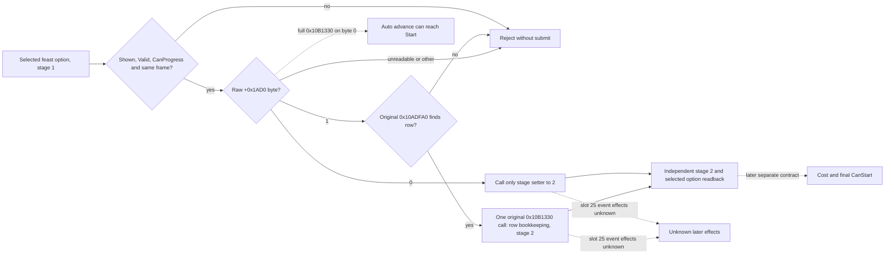

# Bounded feast stage-1 transition (CK3 1.19.0.6)

Exact executable SHA-256:
`2D00FF3101EF70B566F2FCBAE292F09263199C80E9DC8F139B82D7D96F83DB86`.
The disassembly below is bound to that executable. R0360 and R0361 tested the
private Confirm on the H3928 paused frame; both stopped before submission.
The R0356 selected `activity_feast` / `feast_type_generic` paused read is in
`activity-planning-stage1-option-identity-1.19.0.6.md`.

## Original decision tree and action boundary

The category Confirm button in
`game/gui/window_activity_planner.gui:922` calls
`ActivityPlanner.ProgressPlanningStage`. Its native `0x10B1330` stage-1
dispatch first tests the byte at `planner+0x1AD0`. With byte `0`, it calls
`0x10B1BD0(planner, 2)` at `0x10B13A1`, **then** tail jumps to `0x10B1C90`.
That routine can recursively advance stage 2 to 5 and invoke the stage-5
Start branch `0x10B1910`. A full GUI operation on byte `0` is therefore not
bounded to stage 1.

With a nonzero byte, the same stage-1 dispatch calls the read-only row finder
`0x10ADFA0`. When it finds a row, `0x10B1372..0x10B1397` stores that row at
`planner+0x1AC0`, writes `1` at `+0x1ABC`, clears the row's `+8` field, and
tail calls `0x10B1BD0(planner, 2)`. This path does not jump to `0x10B1C90`.
When the finder returns null, it instead sets stage 5 through
`0x10B13B3..0x10B13C0`; that single call does not directly enter Start, but
it does not satisfy a stage-2 Confirm contract. The constructor writes byte
`1` at `0x10AC34A`; the original activity type-selection handler writes
byte `1` at `0x10ADE22` after its stage/category updates. Other identified
writers in this planner path clear it to `0`, including the stage setter.
This evidence identifies the branch selector's behavior, not an independent
gameplay meaning for the byte.

The stage setter `0x10B1BD0(planner, 2)` itself writes `+0x1AD0=0`,
`+0x1AB0=2`, and `+0x1AB4=1`, calls the planner's primary vtable slot 25
(`0x10AEC20`), and clears `+0x1AC8` because the previous stage was 1. It
does not directly call the start path or change the selected activity type at
`+0x1530` or option rows at `+0x1560`. Slot 25 dispatches an event through
the global interface object with code `0x2B4F` and arguments `0x2F,0`; the
event's exact effects are not resolved here. The selected-special getter
`0x10AEAE0` reconstructs its result from the selected type's `+0xA88`
category and the option rows; it does not depend on cleared `+0x1AC8`.

## Private implementation

`XAR_CK3_ENABLE_G2_ACTIVITY_STAGE1_CONFIRM_PRIVATE_V1` defaults OFF and
requires the existing private stage-1 option reader. The typed request step
`confirm-activity-feast-stage1-v1-private` requires an expected revision,
date, actor, `activity_feast`, and `feast_type_generic`. The existing paused
application-main mailbox slot 59 executes it once. It reuses the original
`IsShown`, `IsValid`, and `CanProgressPlanningStage` evaluations on that frame,
requires the selected option, planner owner, widget, and stage 1. For
`+0x1AD0=0`, it calls only the stage setter. For the R0361 observed byte
`1`, it requires the original `0x10ADFA0` finder to return a row within the
planner's `+0x1578/+0x1584` row array; it rechecks the same actor, planner,
option, byte, and paused frame, then calls `0x10B1330` once on that guarded
branch. Other byte values and absent or unverified rows reject before
submission. A separate native
diagnostic checks stage 2, widget visibility, same actor, feast identity,
effective selected option pointer and ID, and same paused frame. The game
snapshot before and after must match, including gold and date. The receipt
retains `submitted=true` even when the postcondition fails; a failed
postcondition is RED and does not authorize retry without fresh observation.
No pointer is serialized, and the step remains private and unadvertised.

The independent default-OFF
`XAR_CK3_ENABLE_G2_ACTIVITY_STAGE2_OPTION_READ_PRIVATE_V1` step
`query-activity-feast-stage2-option-v1-private` accepts the same expected
revision/date/actor/type/option keys. On a new mailbox request it checks the
stage-2 widget and owner, rereads the selected `activity_feast` and current
special-category row, invokes the original pure getter `0x10AEAE0`, resolves
the option's script identifier, and reports only
`feast_type_generic` as positive. This is separate from the action receipt.
The already-open feast opener can additionally reread stage-2 visibility
without dispatching another open operation.

This bounded helper is a stage transition, not activity Start. Focused tests
cover both byte routes, row absence, invalid options, and a retained-option
failure after submission. Release and Debug bridge compilation and focused
tests are static gates only. A frozen candidate still needs the R0356
paused scenario, independent stage-2 and resource readback, subsequent turn,
and required checkpoint/cold restore before any live ability claim. Stage-5
cost and final CanStart remain separate unknowns; the opaque slot-25 event
also remains a live observation item.

## R0360/R0361 live Confirm: byte 1, no submission

R0360 used the official H3928/raw53219928 pair with source master
`3e249604a7805acc72f5e583cae416997bbf0a2b`. The immutable
[`formal-report.txt`](Z:/m6-activity-h3928-confirm-candidate-20260929/operator-runs/feast-stage1-confirm-1/formal-report.txt)
has SHA-256
`D59B08B4D2514FA6D56EFC495E2EEE15BA1B8ECEF1E19060BBB2DB3244F5C01D`.
The planner opened and the separate stage-1 read found selected
`feast_type_generic`, shown, valid, able to progress, and
`generic_feast_confirm_ready=true` on native revision 3. The Confirm
receipt returned `precondition_rejected`, `submitted=false`,
`accepted=false`, `pending=false`; gold stayed at 120644281 raw and the
game snapshot/date stayed at raw53219928. The independent stage-2 read was
not called. The formal run is RED, with zero gameplay turns, unchanged
checkpoint save, and proven process-tree cleanup. There is no stage
transition or activity Start evidence.

The precondition result does not identify which later guard rejected it.
Offline bytes in the same frozen EXE confirm the setter signature at RVA
`0x10B1BD0` and planner vtable slot at RVA `0x41206B8` pointing to
`0x10AEC20`; those checks should not be presumed to be the live failure.
The follow-up R0361 used source commit
`c547d1732f5e1177ca152569ddc2ee369859e109` and the same H3928/raw53219928
pair. Its immutable
[`formal-report.txt`](Z:/m6-activity-h3928-confirm-reason-candidate-20260929/operator-runs/feast-stage1-confirm-reason-1/formal-report.txt)
has SHA-256
`DAA8B93387EA2C62DB0ACCC387D82D01AE3AA69A75956B14269583AE858159E5`.
The focused rejection receipt says `precondition_reject_reason=stage_auto_nonzero`
and `planner_stage_auto_raw=1`, after the same selected option, shown/valid,
and stage-1 progress checks succeeded. `submitted=false`; gold remained
120644281 raw, date raw53219928, and no stage-2 query, activity Start, or
normal gameplay turn was performed. This closes R0360's immediate rejection
cause to the byte-zero guard. It does not yet prove that the row finder will
return a row on this frame or qualify an alternative Confirm action.

The implemented byte-1 candidate requires the row lookup and same-frame
identity checks before it invokes original `0x10B1330` once. It retains the
original byte-0 direct setter. Its independent postcondition requires stage
2, selected option retained, unchanged gold/date snapshot, and no immediate
activity Start; a failed postcondition preserves `submitted=true` for
recovery. A null or unverified row remains a pre-submit rejection. Neither
R0360 nor R0361 is stage-transition evidence; a new frozen live candidate
is still required.

## R0362 live stage-one Confirm and independent stage-two reads

The independent H3928/raw53219928 candidate was built from exact master
`287f9b33446c9b33231d5af9057764a5e0995418` after official push CI
`36534861195` succeeded. Its [frozen index](Z:/m6-activity-h3928-stage1-byte1-candidate-20260929/CANDIDATE-INDEX.json)
has SHA-256 `8DC53DC58B56061B5A079F7781981A73D3D556D8540FD4E55DBB9A2AE8B119A4`;
the Release DLL has SHA-256
`1FA231AA064C1AC6D284CC61B93F8417A15E47A9C5466374F038F9DDAFDD0CF3`.
Official original-pair rebind and no-launch were ready. The single live CK3
process was PID 95316 with a verified minimized window. This candidate enabled
only feast open, stage-one option read and Confirm, stage-two option and gate
reads, plus the existing H3928 sidecar flags. It did not enable stage-two
advance, Start, cost action, or the old diagnostic executor.

On one paused `native:3` frame, actor 29829 and date raw53219928, the separate
stage-one read again found selected `feast_type_generic` shown, valid, able to
progress, and ready for generic Confirm. The typed
`confirm-activity-feast-stage1-v1-private` receipt was `ok=true`,
`accepted=true`, `submitted=true`, `pending=false`, and
`status=stage_two_verified`. Its immediate postcondition observed a visible
stage-two planner with the same selected option, unchanged snapshot and gold
raw120644281, and `activity_start_state=not_started_immediate`. A separate
mailbox request for `query-activity-feast-stage2-option-v1-private` then read
stage 2 and `feast_type_generic` again. This proves one exact-build private
stage-one transition with an independent selected-option readback; it is more
than an ACK. The green receipt does not expose the raw `+0x1AD0` byte, so the
specific internal byte branch in this run is inferred from R0361's same
original pair and the bounded candidate, rather than independently read again.

A further independent same-frame
`query-activity-feast-stage2-gate-v1-private` returned two configuration
rows. Both had `raw_dword=0` at indices 0 and 1; native
`can_progress_stage2=false` and `generic_feast_stage2_advance_ready=false`.
These raw values do not identify a currency cost or a chosen configuration.
The [immutable formal report](Z:/m6-activity-h3928-stage1-byte1-candidate-20260929/operator-runs/feast-stage1-byte1-confirm-1/formal-report.txt)
has SHA-256 `F19F6BE7248EE9C5B84F32D5B4CBDD73478D1D3F01121E4B727D508481F2A09B`;
the [operator receipt](Z:/m6-activity-h3928-stage1-byte1-candidate-20260929/operator-runs/feast-stage1-byte1-confirm-1/operator-receipt.json)
has SHA-256 `34BDF0083B550572FE2D73ED52F485DEEFC835191629B1230C032BE8D00A25AC`.
The specialized route completed with `planning_stage_advanced`, no first
blocker, zero ordinary auto-run turns or date advance, unchanged checkpoint
save SHA-256 `A92073407D1CB2800EEF9C0C3EFEB9846D48398F679DC3163B71EF86C40CEC2C`,
and proven process-tree cleanup.

R0360 and R0361 remain failed attempts; R0362 does not turn them into successes.
The next decision needs native identities, legal options, and resource effects
for both stage-two configuration rows before a bounded configuration action.
Stage-two advance, stage-five cost/final CanStart, activity Start, next-turn
consumption, and checkpoint cold restore remain unverified. The public action
and advertisement gates remain closed.
