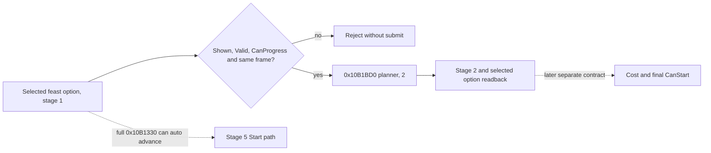

# Bounded feast stage-1 transition (CK3 1.19.0.6)

Exact executable SHA-256:
`2D00FF3101EF70B566F2FCBAE292F09263199C80E9DC8F139B82D7D96F83DB86`.
This is an exact-build source and disassembly result. No CK3 instance was
launched for this implementation, so the new action has no live qualification.
The R0356 selected `activity_feast` / `feast_type_generic` paused read is in
`activity-planning-stage1-option-identity-1.19.0.6.md`.

## Original decision tree and action boundary

The category Confirm button in
`game/gui/window_activity_planner.gui:922` calls
`ActivityPlanner.ProgressPlanningStage`. Its native `0x10B1330` stage-1
normal branch calls `0x10B1BD0(planner, 2)` at `0x10B13A1`, **then** tail
jumps to `0x10B1C90` at `0x10B13AE`. That second routine can recursively
advance stage 2 to 5 when its configuration rows pass, then validate the
temporary start command at stage 5 and invoke `0x10B1330` again. The latter
dispatches stage 5 to `0x10B1910`, which starts an activity. Therefore one
direct call to the full GUI operation is not bounded to stage 1.

The stage setter `0x10B1BD0(planner, 2)` itself writes `+0x1AD0=0`,
`+0x1AB0=2`, and `+0x1AB4=1`, calls the planner's primary vtable slot 25
(`0x10AEC20`), and clears `+0x1AC8` because the previous stage was 1. It
does not directly call the start path or change the selected activity type at
`+0x1530` or option rows at `+0x1560`. Slot 25 dispatches an event through
the global interface object with code `0x2B4F` and arguments `0x2F,0`; the
event's exact effects are not resolved here. The selected-special getter
`0x10AEAE0` reconstructs its result from the selected type's `+0xA88`
category and the option rows; it does not depend on cleared `+0x1AC8`.

## Private implementation

`XAR_CK3_ENABLE_G2_ACTIVITY_STAGE1_CONFIRM_PRIVATE_V1` defaults OFF and
requires the existing private stage-1 option reader. The typed request step
`confirm-activity-feast-stage1-v1-private` requires an expected revision,
date, actor, `activity_feast`, and `feast_type_generic`. The existing paused
application-main mailbox slot 59 executes it once. It reuses the original
`IsShown`, `IsValid`, and `CanProgressPlanningStage` evaluations on that frame,
requires the selected option, planner owner, widget, stage 1, and normal
`+0x1AD0=0` route, then calls only the stage setter. A separate native
diagnostic checks stage 2, widget visibility, same actor, feast identity,
effective selected option pointer and ID, and same paused frame. The game
snapshot before and after must match, including gold and date. The receipt
retains `submitted=true` even when the postcondition fails; a failed
postcondition is RED and does not authorize retry without fresh observation.
No pointer is serialized, and the step remains private and unadvertised.

This bounded helper is a stage transition, not activity Start. The new
source-level unit test verifies a positive stage transition and rejection of
an invalid option or nonnormal stage route. Release bridge compilation and
focused test are static gates only. A frozen candidate still needs the R0356
paused scenario, independent stage-2 and resource readback, subsequent turn,
and required checkpoint/cold restore before any live ability claim. Stage-5
cost and final CanStart remain separate unknowns; the opaque slot-25 event
also remains a live observation item.
